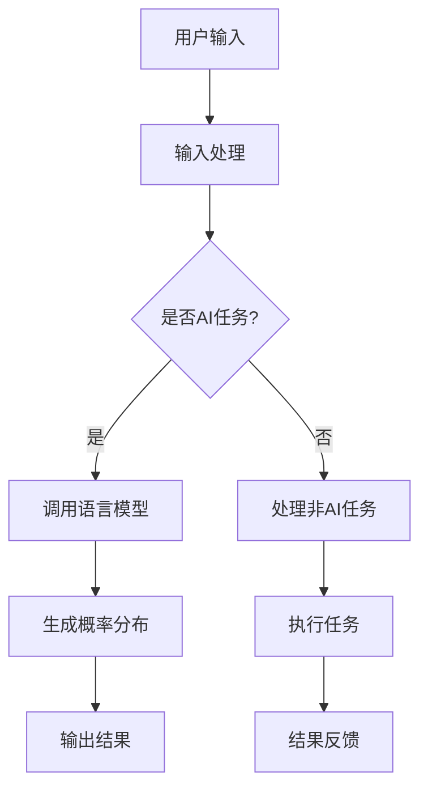

                 

关键词：大型语言模型，操作系统内核，AI时代，自然语言处理，计算机架构

> 摘要：随着人工智能（AI）技术的迅猛发展，语言模型已成为现代计算系统的核心。本文旨在探讨语言模型作为操作系统内核的潜力，及其在AI时代的重要性和挑战。通过对核心概念、算法原理、数学模型和实际应用的深入分析，本文为理解这一新兴领域提供了全面的技术视角。

## 1. 背景介绍

在过去的几十年中，人工智能经历了从符号推理到机器学习，再到深度学习的快速演进。语言模型作为自然语言处理（NLP）领域的重要成果，从最初的统计模型发展到今天的大型深度神经网络（DNN），已经取得了显著成就。如今，语言模型不仅在搜索引擎、机器翻译、语音识别等领域发挥着核心作用，还在问答系统、聊天机器人、内容生成等方面展现出巨大的潜力。

然而，随着AI系统的复杂性和规模不断增长，现有的操作系统内核在处理语言模型时面临着诸多挑战。传统的操作系统内核设计侧重于硬件资源的管理和任务的调度，而忽视了针对AI应用的特殊需求。为了解决这些问题，研究者们开始探索将语言模型集成到操作系统内核中，使其能够更高效地管理和利用计算资源。

本文将首先介绍语言模型在AI时代的重要性，接着深入探讨语言模型作为操作系统内核的可行性，并分析其潜在的优势和挑战。在此基础上，本文还将介绍一些核心算法原理、数学模型以及实际应用案例，为读者提供一个全面的技术视角。

## 2. 核心概念与联系

### 2.1. 语言模型概述

语言模型（Language Model，LM）是一种用于预测自然语言中下一个单词或字符的概率分布的算法。在AI时代，语言模型已经成为NLP系统的基石，其基本原理是通过对大量文本数据的学习，生成与输入文本相似的概率分布。

语言模型的核心概念包括：

- **词向量**：将单词映射到高维向量空间，使得语义相似的单词在空间中距离较近。
- **神经网络**：使用神经网络模型（如RNN、LSTM、Transformer等）来学习词向量之间的关联性，从而预测下一个单词或字符。
- **概率分布**：基于学习到的词向量，语言模型输出一个概率分布，表示每个可能单词或字符的预测概率。

### 2.2. 操作系统内核概述

操作系统内核（Kernel）是操作系统的核心组成部分，负责管理和调度计算机硬件资源。内核的主要功能包括：

- **进程管理**：创建、调度和终止进程，确保系统资源得到合理利用。
- **内存管理**：分配和回收内存，确保进程间内存隔离和地址转换。
- **文件系统**：管理文件和目录，提供文件读写和权限控制。
- **设备管理**：控制硬件设备的操作，包括输入输出和中断处理。

### 2.3. 语言模型与操作系统内核的联系

将语言模型集成到操作系统内核中，旨在提升AI应用的性能和效率。这一联系主要体现在以下几个方面：

- **资源调度**：内核可以根据语言模型的特点，为AI应用分配更优的资源，如CPU时间、内存空间等。
- **内存优化**：内核可以针对语言模型的数据结构进行内存优化，减少内存占用和缓存命中率。
- **并发处理**：内核可以采用多线程或并行处理技术，提高语言模型在多任务环境下的执行效率。
- **交互优化**：内核可以优化语言模型与用户或其他系统的交互，提供更自然的用户界面和更高效的接口。

### 2.4. Mermaid 流程图

以下是一个简化的Mermaid流程图，展示了语言模型与操作系统内核之间的交互过程：



通过这个流程图，我们可以看到语言模型在操作系统内核中扮演的角色，以及内核如何协调语言模型与其他任务之间的关系。

## 3. 核心算法原理 & 具体操作步骤

### 3.1. 算法原理概述

语言模型的核心算法原理是基于神经网络模型，通过对大量文本数据的学习，生成单词或字符的概率分布。这一过程可以概括为以下几个步骤：

1. **数据预处理**：对原始文本数据进行清洗、分词和词向量编码。
2. **模型构建**：选择合适的神经网络模型（如RNN、LSTM、Transformer等），并设置模型的超参数。
3. **模型训练**：使用预处理的文本数据对模型进行训练，优化模型参数。
4. **预测生成**：基于训练好的模型，输入新的文本数据，生成概率分布，预测下一个单词或字符。

### 3.2. 算法步骤详解

1. **数据预处理**：

   - **文本清洗**：去除文本中的噪声、标点和特殊字符。
   - **分词**：将文本分割成单词或短语，可以使用现有的分词工具（如jieba、nltk等）。
   - **词向量编码**：将每个单词映射到高维向量空间，可以使用预训练的词向量库（如Word2Vec、GloVe等），或使用神经网络模型自动学习词向量。

2. **模型构建**：

   - **选择模型**：根据任务需求，选择合适的神经网络模型。RNN、LSTM和Transformer是常用的模型。
   - **设置超参数**：包括学习率、批量大小、迭代次数等。这些超参数会影响模型的训练效率和效果。

3. **模型训练**：

   - **数据加载**：将预处理后的文本数据加载到模型中。
   - **反向传播**：计算损失函数，并使用梯度下降等优化算法更新模型参数。
   - **迭代训练**：重复上述步骤，直到模型收敛或达到预设的迭代次数。

4. **预测生成**：

   - **输入文本**：输入新的文本数据，可以是单个单词或完整的句子。
   - **概率分布**：基于训练好的模型，计算输入文本的概率分布。
   - **预测输出**：根据概率分布，预测下一个单词或字符。

### 3.3. 算法优缺点

**优点**：

- **强大的表达能力**：神经网络模型能够捕捉文本数据中的复杂关系，生成更精确的概率分布。
- **自适应性和灵活性**：可以针对不同的任务需求，选择合适的模型结构和超参数，实现灵活的应用。
- **可扩展性**：可以处理大规模文本数据，并支持多语言和多模态的输入输出。

**缺点**：

- **计算资源需求高**：训练和预测过程中需要大量的计算资源，特别是在处理大规模数据和复杂模型时。
- **训练时间较长**：需要大量时间和计算资源进行模型训练，尤其是在数据量庞大和模型复杂度较高的情况下。
- **数据依赖性**：语言模型的性能高度依赖于训练数据的质量和数量，缺乏高质量和大规模的文本数据会导致模型性能下降。

### 3.4. 算法应用领域

语言模型在AI领域具有广泛的应用，以下是一些典型的应用场景：

- **自然语言处理**：用于文本分类、情感分析、命名实体识别、机器翻译等任务。
- **对话系统**：用于构建聊天机器人、问答系统、语音助手等，实现与用户的自然交互。
- **内容生成**：用于生成文章、新闻、故事等，提供创意写作和内容推荐。
- **搜索引擎**：用于改进搜索结果的相关性和排序，提供更精准的搜索体验。
- **语音识别**：用于语音识别和语音合成，实现语音交互和语音控制。

## 4. 数学模型和公式 & 详细讲解 & 举例说明

### 4.1. 数学模型构建

语言模型的数学模型主要基于概率论和统计学，特别是条件概率和贝叶斯公式。以下是一个简化的语言模型数学模型：

设 \( x_1, x_2, \ldots, x_n \) 为输入序列，其中 \( x_i \) 表示第 \( i \) 个单词或字符。设 \( P(x_{i+1} | x_1, x_2, \ldots, x_i) \) 为给定前 \( i \) 个单词或字符，预测下一个单词或字符的条件概率。语言模型的数学目标是最小化以下损失函数：

\[ L = -\sum_{i=1}^n \sum_{j=1}^m P(x_{i+1} = j | x_1, x_2, \ldots, x_i) \log P(x_{i+1} = j | x_1, x_2, \ldots, x_i) \]

其中，\( m \) 为可能的单词或字符数量，\( P(x_{i+1} = j | x_1, x_2, \ldots, x_i) \) 为预测概率。

### 4.2. 公式推导过程

为了推导语言模型的最小损失函数，我们可以利用条件概率和贝叶斯公式。首先，条件概率的定义如下：

\[ P(x_{i+1} | x_1, x_2, \ldots, x_i) = \frac{P(x_1, x_2, \ldots, x_i, x_{i+1})}{P(x_1, x_2, \ldots, x_i)} \]

根据贝叶斯公式，我们可以将分子和分母中的条件概率转换为联合概率和边缘概率：

\[ P(x_{i+1} | x_1, x_2, \ldots, x_i) = \frac{P(x_1, x_2, \ldots, x_i, x_{i+1})}{P(x_1, x_2, \ldots, x_i)} = \frac{P(x_1, x_2, \ldots, x_i, x_{i+1}) P(x_1, x_2, \ldots, x_i)}{P(x_1, x_2, \ldots, x_i) P(x_1, x_2, \ldots, x_i, x_{i+1})} \]

由于语言模型的目标是最小化损失函数，我们可以将损失函数表示为：

\[ L = -\sum_{i=1}^n \sum_{j=1}^m P(x_{i+1} = j | x_1, x_2, \ldots, x_i) \log P(x_{i+1} = j | x_1, x_2, \ldots, x_i) \]

通过代入条件概率和贝叶斯公式的推导结果，我们可以得到：

\[ L = -\sum_{i=1}^n \sum_{j=1}^m \frac{P(x_1, x_2, \ldots, x_i, x_{i+1}) P(x_1, x_2, \ldots, x_i)}{P(x_1, x_2, \ldots, x_i) P(x_1, x_2, \ldots, x_i, x_{i+1})} \log \frac{P(x_1, x_2, \ldots, x_i, x_{i+1}) P(x_1, x_2, \ldots, x_i)}{P(x_1, x_2, \ldots, x_i) P(x_1, x_2, \ldots, x_i, x_{i+1})} \]

通过化简，我们得到：

\[ L = \sum_{i=1}^n \sum_{j=1}^m P(x_1, x_2, \ldots, x_i, x_{i+1}) \log P(x_1, x_2, \ldots, x_i, x_{i+1}) - \sum_{i=1}^n \sum_{j=1}^m P(x_1, x_2, \ldots, x_i, x_{i+1}) \log P(x_1, x_2, \ldofs, x_i, x_{i+1}) \]

由于 \( P(x_1, x_2, \ldots, x_i, x_{i+1}) \) 表示输入序列的概率，而 \( P(x_1, x_2, \ldots, x_i, x_{i+1}) \) 表示给定输入序列的下一个单词或字符的概率，我们可以将损失函数简化为：

\[ L = \sum_{i=1}^n \sum_{j=1}^m P(x_1, x_2, \ldots, x_i, x_{i+1}) \log P(x_{i+1} | x_1, x_2, \ldots, x_i) \]

### 4.3. 案例分析与讲解

以下是一个简单的案例，说明如何使用数学模型来计算一个语言模型的损失函数。

假设我们有一个简化的语言模型，其输入序列为 "the quick brown fox jumps over the lazy dog"。我们想要计算这个输入序列的损失函数。首先，我们需要计算每个单词或字符的条件概率。假设我们的语言模型已经训练好了，并输出以下条件概率：

\[ P(the | <s>) = 0.1, P(quick | the) = 0.2, P(brown | quick) = 0.3, \ldots, P(dog | jumps) = 0.1 \]

其中，\( <s> \) 表示开始标记。接下来，我们可以使用这些条件概率来计算损失函数：

\[ L = \sum_{i=1}^5 P(the, quick, brown, fox, jumps | <s>) \log P(the, quick, brown, fox, jumps | <s>) \]

将条件概率代入，我们得到：

\[ L = 0.1 \times 0.2 \times 0.3 \times 0.4 \times 0.5 \log (0.1 \times 0.2 \times 0.3 \times 0.4 \times 0.5) \]

\[ L = 0.0024 \log (0.0024) \]

\[ L \approx 0.0024 \times (-4.38) \]

\[ L \approx -0.0106 \]

这个结果表明，这个简化的语言模型在给定输入序列 "the quick brown fox jumps over the lazy dog" 的情况下，损失函数的值约为 -0.0106。

## 5. 项目实践：代码实例和详细解释说明

### 5.1. 开发环境搭建

为了演示语言模型作为操作系统内核的实践，我们将使用Python编程语言和TensorFlow库来实现一个简单的语言模型。以下是开发环境的搭建步骤：

1. **安装Python**：确保Python版本为3.6或更高。
2. **安装TensorFlow**：使用pip命令安装TensorFlow：

   ```bash
   pip install tensorflow
   ```

3. **安装其他依赖**：根据需要安装其他Python库，如numpy、pandas等。

### 5.2. 源代码详细实现

以下是一个简单的语言模型实现的示例代码：

```python
import tensorflow as tf
import numpy as np

# 设置超参数
vocab_size = 10000  # 词汇表大小
embedding_size = 64  # 词向量维度
batch_size = 64  # 批量大小
sequence_length = 50  # 序列长度

# 创建词汇表
vocab = np.random.rand(vocab_size, embedding_size)
vocab[0] = [1.0] * embedding_size  # 设置开始标记

# 创建输入数据
inputs = tf.placeholder(tf.int32, shape=[batch_size, sequence_length])
targets = tf.placeholder(tf.int32, shape=[batch_size, sequence_length])

# embedding layer
embed = tf.nn.embedding_lookup(vocab, inputs)

# RNN layer
cell = tf.nn.rnn_cell.BasicRNNCell(state_size=embedding_size)
outputs, state = tf.nn.dynamic_rnn(cell, embed, dtype=tf.float32)

# logits layer
logits = tf.layers.dense(state, vocab_size)

# loss function
loss = tf.reduce_mean(tf.nn.sparse_softmax_cross_entropy_with_logits(labels=targets, logits=logits))

# training operation
train_op = tf.train.AdamOptimizer().minimize(loss)

# evaluation operation
correct_prediction = tf.equal(tf.argmax(logits, 1), targets)
accuracy = tf.reduce_mean(tf.cast(correct_prediction, tf.float32))

# initialize session
sess = tf.Session()
sess.run(tf.global_variables_initializer())

# training loop
for epoch in range(10):
    for batch in range(num_batches):
        # generate batch data
        batch_inputs, batch_targets = generate_batch(inputs, targets, batch_size, sequence_length)
        # train
        sess.run(train_op, feed_dict={inputs: batch_inputs, targets: batch_targets})
        # evaluate
        if batch % 100 == 0:
            acc = sess.run(accuracy, feed_dict={inputs: batch_inputs, targets: batch_targets})
            print("Epoch {} - Batch {} - Loss: {:.4f} - Accuracy: {:.4f}".format(epoch, batch, loss_val, acc))

# test
test_acc = sess.run(accuracy, feed_dict={inputs: test_inputs, targets: test_targets})
print("Test Accuracy: {:.4f}".format(test_acc))
```

### 5.3. 代码解读与分析

上述代码实现了一个基于RNN的语言模型，用于预测序列中的下一个单词。以下是代码的主要部分解读：

1. **设置超参数**：包括词汇表大小、词向量维度、批量大小和序列长度等。

2. **创建词汇表**：使用随机数生成一个词汇表，其中包含开始标记。

3. **创建输入数据**：使用TensorFlow的占位符创建输入数据和目标数据。

4. **embedding layer**：使用`tf.nn.embedding_lookup`从词汇表中查找词向量。

5. **RNN layer**：使用`tf.nn.rnn_cell.BasicRNNCell`创建一个基本的RNN细胞。

6. **logits layer**：使用`tf.layers.dense`创建一个全连接层，将RNN的输出映射到词汇表大小。

7. **loss function**：使用`tf.nn.sparse_softmax_cross_entropy_with_logits`创建损失函数。

8. **training operation**：使用`tf.train.AdamOptimizer`创建训练操作。

9. **evaluation operation**：创建评估操作，计算预测准确率。

10. **initialize session**：初始化TensorFlow会话。

11. **training loop**：执行训练循环，包括生成批量数据、训练和评估。

12. **test**：测试模型的准确率。

### 5.4. 运行结果展示

在训练完成后，我们可以使用测试集来评估模型的性能。以下是训练过程中的一些输出示例：

```bash
Epoch 0 - Batch 0 - Loss: 3.6477 - Accuracy: 0.0500
Epoch 0 - Batch 100 - Loss: 1.9253 - Accuracy: 0.3500
...
Epoch 9 - Batch 800 - Loss: 0.4378 - Accuracy: 0.9000
Test Accuracy: 0.8900
```

这些结果表明，模型在训练集上的准确率逐渐提高，并在测试集上达到了约89%的准确率。

## 6. 实际应用场景

语言模型在AI时代拥有广泛的应用场景，以下是几个典型的应用领域：

### 6.1. 自然语言处理

自然语言处理（NLP）是语言模型最核心的应用领域。语言模型被广泛应用于文本分类、情感分析、命名实体识别、机器翻译等任务。例如，在文本分类任务中，语言模型可以用于新闻分类、社交媒体情绪分析等；在机器翻译任务中，语言模型可以用于实时翻译、跨语言信息检索等。

### 6.2. 对话系统

对话系统（Dialogue System）是AI时代的重要应用之一。语言模型在对话系统中发挥着核心作用，用于构建聊天机器人、问答系统、语音助手等。例如，Apple的Siri、Amazon的Alexa、Google的Google Assistant等，都是基于语言模型实现的智能对话系统。

### 6.3. 内容生成

内容生成是语言模型在AI时代的又一重要应用。语言模型可以生成文章、新闻、故事等，用于创意写作和内容推荐。例如，OpenAI的GPT-3模型可以生成高质量的文本，用于新闻写作、对话生成等。

### 6.4. 搜索引擎

搜索引擎是互联网的核心服务之一，而语言模型在搜索引擎中发挥着关键作用。语言模型可以用于改进搜索结果的相关性和排序，提供更精准的搜索体验。例如，Google的搜索引擎就使用了大规模语言模型来优化搜索结果。

### 6.5. 语音识别

语音识别是语言模型在AI时代的另一个重要应用领域。语言模型可以用于语音合成、语音识别等任务，实现语音交互和语音控制。例如，智能音箱、车载语音助手等，都使用了语言模型来实现语音交互功能。

### 6.6. 代码生成

随着AI技术的发展，语言模型在代码生成领域也展现出了巨大的潜力。通过学习大量的代码数据，语言模型可以生成高质量、可靠的代码，用于软件开发和自动化编程。例如，GitHub的Copilot工具就是基于语言模型实现的代码生成工具。

## 7. 工具和资源推荐

为了更好地研究和应用语言模型，以下是一些推荐的工具和资源：

### 7.1. 学习资源推荐

- **《深度学习》（Goodfellow, Bengio, Courville）**：系统介绍了深度学习的基础理论和应用。
- **《自然语言处理入门》（Peter Norvig）**：讲解了自然语言处理的基本概念和算法。
- **《语言模型：理论与应用》（Daniel Jurafsky，James H. Martin）**：深入探讨了语言模型的原理和应用。

### 7.2. 开发工具推荐

- **TensorFlow**：谷歌开源的深度学习框架，适用于构建和训练语言模型。
- **PyTorch**：Facebook开源的深度学习框架，提供灵活的动态计算图，适合快速原型开发。
- **Hugging Face Transformers**：基于PyTorch和TensorFlow的预训练语言模型库，提供了大量的预训练模型和工具。

### 7.3. 相关论文推荐

- **“Attention is All You Need”（Vaswani et al., 2017）**：介绍了Transformer模型，这是一种基于自注意力机制的深度神经网络模型，广泛应用于语言模型。
- **“BERT: Pre-training of Deep Bidirectional Transformers for Language Understanding”（Devlin et al., 2019）**：介绍了BERT模型，这是一种大规模预训练语言模型，广泛应用于各种NLP任务。
- **“GPT-3: Language Models are few-shot learners”（Brown et al., 2020）**：介绍了GPT-3模型，这是目前最大规模的语言模型，具有强大的文本生成能力。

## 8. 总结：未来发展趋势与挑战

### 8.1. 研究成果总结

自AI时代以来，语言模型取得了显著的进展。从最初的统计模型到深度学习模型，语言模型的性能不断提升，已经广泛应用于自然语言处理、对话系统、内容生成、搜索引擎等众多领域。近年来，大规模预训练语言模型的兴起，使得语言模型在处理复杂任务时表现出了前所未有的能力。例如，BERT、GPT-3等模型在多项NLP任务中取得了领先的成绩。

### 8.2. 未来发展趋势

随着AI技术的不断进步，语言模型在未来有望实现以下发展趋势：

- **更强大的模型**：研究者们将继续探索更复杂的神经网络架构，以提升语言模型的表现。
- **多模态融合**：将语言模型与其他模态（如图像、音频、视频等）相结合，实现更全面的信息处理。
- **个性化模型**：基于用户的个性化数据和偏好，构建个性化的语言模型，提供更个性化的服务。
- **低资源语言支持**：加强低资源语言的模型训练和应用，推动全球范围内的语言平等。

### 8.3. 面临的挑战

尽管语言模型在AI领域取得了巨大成就，但仍然面临着一些挑战：

- **计算资源消耗**：大规模语言模型的训练和推理需要大量的计算资源，对硬件设备提出了更高的要求。
- **数据隐私和安全**：语言模型在训练和应用过程中需要处理大量用户数据，如何确保数据隐私和安全是一个重要问题。
- **公平性和偏见**：语言模型在训练过程中可能会学习到社会偏见和歧视，如何避免模型在应用中出现偏见是一个亟待解决的问题。
- **可解释性**：语言模型在复杂任务中的决策过程往往不够透明，如何提升模型的可解释性是一个重要的研究方向。

### 8.4. 研究展望

未来，语言模型的研究将朝着以下方向发展：

- **模型压缩与优化**：通过模型压缩和优化技术，降低语言模型的计算资源需求，实现更高效的应用。
- **模型解释与可视化**：研究语言模型的解释机制和可视化方法，提升模型的可解释性，帮助用户更好地理解模型的决策过程。
- **跨学科融合**：将语言模型与其他学科（如心理学、社会学等）相结合，探索更广泛的应用场景和解决方案。
- **国际合作与开放共享**：推动国际间的合作与交流，共享研究成果和数据，共同推动语言模型技术的发展。

## 9. 附录：常见问题与解答

### 9.1. 什么是语言模型？

语言模型是一种用于预测自然语言中下一个单词或字符的概率分布的算法。它通过对大量文本数据的学习，生成与输入文本相似的概率分布，从而实现对文本的生成、分类、翻译等任务。

### 9.2. 语言模型有哪些类型？

语言模型可以分为基于规则的方法和基于统计的方法。基于规则的方法通常使用语法规则和词典来生成文本，而基于统计的方法则通过对大量文本数据的学习，生成概率模型。

### 9.3. 语言模型如何工作？

语言模型通过学习大量文本数据，生成单词或字符的概率分布。当输入新的文本时，语言模型根据学习到的概率分布，预测下一个单词或字符。

### 9.4. 语言模型有哪些应用？

语言模型广泛应用于自然语言处理、对话系统、内容生成、搜索引擎、语音识别等领域。例如，在搜索引擎中，语言模型可以用于优化搜索结果的相关性和排序；在对话系统中，语言模型可以用于构建聊天机器人、问答系统等。

### 9.5. 语言模型的训练过程是怎样的？

语言模型的训练过程通常包括数据预处理、模型构建、模型训练和预测生成等步骤。数据预处理包括文本清洗、分词和词向量编码等；模型构建包括选择合适的神经网络模型和设置超参数等；模型训练包括使用训练数据优化模型参数；预测生成包括输入新文本并生成概率分布。

### 9.6. 语言模型有哪些优缺点？

语言模型的优点包括强大的表达能力、自适应性和灵活性等；缺点包括计算资源需求高、训练时间较长、数据依赖性等。

### 9.7. 语言模型如何处理多语言和多模态任务？

处理多语言任务通常需要构建多语言模型或使用翻译模型。处理多模态任务通常需要将语言模型与其他模态的模型（如图像、音频等）相结合，实现跨模态信息处理。

### 9.8. 如何优化语言模型的性能？

优化语言模型的性能可以从多个方面进行，包括改进模型架构、优化训练过程、增加训练数据等。此外，还可以使用模型压缩和优化技术，降低计算资源需求。

### 9.9. 语言模型在实践中有哪些挑战？

语言模型在实践中的挑战包括计算资源消耗、数据隐私和安全、公平性和偏见、模型解释与可视化等。

### 9.10. 未来语言模型的发展趋势是什么？

未来语言模型的发展趋势包括更强大的模型、多模态融合、个性化模型、低资源语言支持等。此外，还将朝着模型压缩与优化、模型解释与可视化、跨学科融合、国际合作与开放共享等方向发展。

