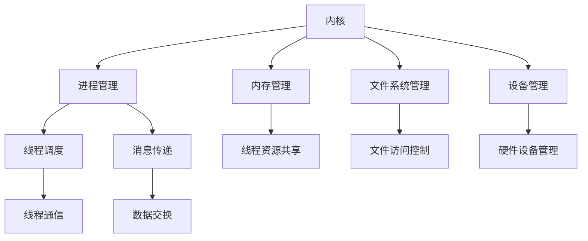

                 

## 1. 背景介绍

在信息技术飞速发展的今天，操作系统作为计算机系统的核心，其稳定性和性能直接影响到整个计算机系统的运行效率。LLM（Large Language Model）作为一种先进的自然语言处理技术，正逐渐在各个领域中发挥重要作用。本文旨在探讨LLM操作系统的核心组件，包括内核、消息和线程，并分析它们在实际应用中的重要性。

### 1.1 操作系统在计算机系统中的地位

操作系统是计算机系统中最基本的系统软件，负责管理计算机硬件资源和提供基本服务，如进程管理、内存管理、文件系统管理等。没有操作系统，计算机就无法正常运行，更不用说实现复杂的应用功能了。

### 1.2 LLM技术在现代信息技术中的地位

LLM技术作为一种强大的自然语言处理技术，已经在文本生成、机器翻译、问答系统等领域取得了显著成果。LLM操作系统则是LLM技术在操作系统领域的应用，具有广泛的前景和潜力。

### 1.3 内核、消息和线程的概念及其在操作系统中的作用

- **内核（Kernel）**：操作系统的核心部分，负责管理和控制硬件资源，提供底层的系统服务。
- **消息（Message）**：在计算机系统中，消息是一种用于进程间通信的数据传递方式，可以确保不同进程之间的数据交换。
- **线程（Thread）**：是操作系统能够进行运算调度的最小单位，也是程序执行的最小单元。

本文将围绕这三个核心组件展开讨论，探讨它们在LLM操作系统中的作用、原理和应用。

## 2. 核心概念与联系

### 2.1 内核（Kernel）

内核是操作系统的核心组件，负责管理和控制计算机硬件资源。它提供了操作系统的大部分基础服务，如进程管理、内存管理、文件系统管理、设备管理等。内核的主要功能包括：

- **进程管理**：负责创建、调度、销毁进程，确保各个进程能够高效运行。
- **内存管理**：负责分配、回收内存，确保内存的高效利用。
- **文件系统管理**：负责文件的组织、访问和控制，确保文件系统的安全性和稳定性。
- **设备管理**：负责管理硬件设备，如磁盘、网卡、显示器等。

### 2.2 消息（Message）

消息是计算机系统中用于进程间通信的数据传递方式。消息传递机制确保了不同进程之间能够高效、可靠地交换数据，从而实现系统的协同工作。消息传递机制主要包括以下几种类型：

- **同步消息传递**：发送方进程等待接收方进程处理完消息后再继续执行。
- **异步消息传递**：发送方进程发送消息后不需要等待接收方进程处理消息，可以继续执行。
- **单向消息传递**：发送方进程发送消息后不再关心消息是否被接收方进程处理。
- **双向消息传递**：发送方和接收方进程都可以发送和接收消息。

### 2.3 线程（Thread）

线程是操作系统能够进行运算调度的最小单位，也是程序执行的最小单元。线程与进程的关系如下：

- **线程是进程的组成部分**：一个进程可以包含多个线程，每个线程都有自己独立的执行路径。
- **线程共享进程的资源**：线程共享进程的内存空间、文件描述符、信号处理程序等资源。
- **线程的调度和通信**：操作系统通过线程调度机制管理线程的执行，线程之间可以通过消息传递机制进行通信。

### 2.4 内核、消息和线程的联系

内核、消息和线程在LLM操作系统中紧密相连，共同构成了操作系统的核心架构。

- **内核负责管理和控制硬件资源**：内核为进程和线程提供运行环境，确保它们能够高效地利用计算机资源。
- **消息传递机制实现进程间通信**：通过消息传递机制，进程和线程之间能够交换数据，实现系统的协同工作。
- **线程是进程的执行单元**：线程负责执行具体的任务，通过线程调度机制，操作系统可以高效地管理线程的执行。

为了更好地理解内核、消息和线程在LLM操作系统中的联系，我们使用Mermaid流程图来展示它们的交互关系：



通过上述Mermaid流程图，我们可以清晰地看到内核、消息和线程之间的紧密联系，以及它们在LLM操作系统中的作用。

## 3. 核心算法原理 & 具体操作步骤

### 3.1 算法原理概述

在LLM操作系统中，内核、消息和线程的核心算法原理主要包括以下几个方面：

- **内核管理算法**：负责管理和控制计算机硬件资源，如进程管理、内存管理、文件系统管理、设备管理等。
- **消息传递算法**：实现进程间通信，如同步消息传递、异步消息传递、单向消息传递、双向消息传递等。
- **线程调度算法**：负责线程的调度和管理，如时间片轮转调度、优先级调度、多级反馈队列调度等。

### 3.2 算法步骤详解

#### 3.2.1 内核管理算法步骤

1. **进程管理**：
   - **创建进程**：操作系统根据进程的请求创建新的进程。
   - **调度进程**：操作系统根据进程的优先级、时间片等因素调度进程执行。
   - **销毁进程**：当进程执行完毕或被终止时，操作系统回收进程的资源。

2. **内存管理**：
   - **内存分配**：操作系统根据进程的需求分配内存。
   - **内存回收**：操作系统回收不再使用的内存空间。
   - **内存保护**：操作系统确保进程不会访问不属于它的内存空间。

3. **文件系统管理**：
   - **文件创建**：操作系统根据用户请求创建新的文件。
   - **文件访问**：操作系统根据用户的权限和需求访问文件。
   - **文件删除**：操作系统删除不再使用的文件。

4. **设备管理**：
   - **设备分配**：操作系统根据进程的需求分配设备。
   - **设备访问**：操作系统确保进程能够正确地访问设备。
   - **设备回收**：操作系统回收不再使用的设备。

#### 3.2.2 消息传递算法步骤

1. **同步消息传递**：
   - **发送消息**：发送方进程将消息发送给接收方进程。
   - **等待响应**：发送方进程等待接收方进程处理完消息后返回。
   - **继续执行**：发送方进程在接收方进程处理完消息后继续执行。

2. **异步消息传递**：
   - **发送消息**：发送方进程将消息发送给接收方进程。
   - **继续执行**：发送方进程在发送消息后继续执行。
   - **处理消息**：接收方进程在空闲时间处理接收到的消息。

3. **单向消息传递**：
   - **发送消息**：发送方进程将消息发送给接收方进程。
   - **忽略响应**：发送方进程不等待接收方进程的响应。
   - **继续执行**：发送方进程在发送消息后继续执行。

4. **双向消息传递**：
   - **发送消息**：发送方进程将消息发送给接收方进程。
   - **等待响应**：发送方进程等待接收方进程处理完消息后返回。
   - **继续执行**：发送方进程在接收方进程处理完消息后继续执行。
   - **发送响应**：接收方进程将处理结果发送给发送方进程。

#### 3.2.3 线程调度算法步骤

1. **时间片轮转调度**：
   - **初始化**：操作系统为每个线程分配一个时间片。
   - **调度**：操作系统按照时间片轮转调度算法调度线程执行。
   - **切换**：当一个线程的时间片用尽时，操作系统切换到下一个线程执行。
   - **结束**：当所有线程执行完毕后，操作系统结束调度。

2. **优先级调度**：
   - **初始化**：操作系统为每个线程分配一个优先级。
   - **调度**：操作系统按照线程的优先级调度线程执行。
   - **提升/降低优先级**：操作系统根据线程的执行情况动态调整线程的优先级。

3. **多级反馈队列调度**：
   - **初始化**：操作系统创建多个队列，每个队列对应一个优先级。
   - **调度**：操作系统按照优先级调度线程执行。
   - **提升/降低队列**：操作系统根据线程的执行情况将线程提升或降低到不同的队列。

### 3.3 算法优缺点

#### 3.3.1 内核管理算法

- **优点**：
  - **高效性**：内核管理算法能够高效地管理和控制计算机硬件资源，确保系统的稳定运行。
  - **灵活性**：内核管理算法可以根据不同的硬件环境和应用需求进行灵活调整。

- **缺点**：
  - **复杂性**：内核管理算法涉及多个方面，如进程管理、内存管理、文件系统管理等，实现起来相对复杂。
  - **安全性**：内核管理算法涉及到系统的核心部分，安全性要求较高，一旦出现问题可能会影响整个系统的稳定性。

#### 3.3.2 消息传递算法

- **优点**：
  - **可靠性**：消息传递算法能够确保进程间通信的可靠性和稳定性。
  - **灵活性**：消息传递算法支持多种消息传递方式，可以根据实际需求选择合适的传递方式。

- **缺点**：
  - **性能开销**：消息传递算法引入了一定的性能开销，特别是在大规模并发场景下。
  - **同步问题**：在同步消息传递过程中，发送方进程需要等待接收方进程处理完消息，可能会降低系统的响应速度。

#### 3.3.3 线程调度算法

- **优点**：
  - **高效性**：线程调度算法能够高效地管理线程的执行，确保系统的运行效率。
  - **灵活性**：线程调度算法可以根据不同的应用场景和需求进行灵活调整。

- **缺点**：
  - **资源消耗**：线程调度算法引入了一定的资源消耗，特别是多级反馈队列调度算法。
  - **同步问题**：在某些线程调度算法中，线程的同步问题可能会影响系统的性能。

### 3.4 算法应用领域

内核管理算法、消息传递算法和线程调度算法广泛应用于各种操作系统和计算机系统中。以下是一些典型的应用领域：

- **操作系统内核开发**：内核管理算法、消息传递算法和线程调度算法是操作系统内核开发的核心技术。
- **分布式系统**：在分布式系统中，内核管理算法、消息传递算法和线程调度算法用于协调不同节点之间的通信和计算。
- **实时系统**：在实时系统中，内核管理算法、消息传递算法和线程调度算法用于确保系统的实时性和可靠性。
- **嵌入式系统**：在嵌入式系统中，内核管理算法、消息传递算法和线程调度算法用于优化系统的性能和功耗。

## 4. 数学模型和公式 & 详细讲解 & 举例说明

### 4.1 数学模型构建

在LLM操作系统中，核心组件的运行和调度可以通过数学模型来描述。以下是一个简化的数学模型，用于描述内核管理算法、消息传递算法和线程调度算法的基本原理。

#### 4.1.1 内核管理算法数学模型

假设系统中存在\(n\)个进程，每个进程具有以下属性：

- **处理时间（Processing Time）**：\(T_i\)
- **到达时间（Arrival Time）**：\(A_i\)
- **优先级（Priority）**：\(P_i\)

内核管理算法的目标是最小化系统的平均等待时间。可以使用以下公式表示：

\[W_i = \frac{T_i}{P_i}\]

其中，\(W_i\)表示进程\(i\)的等待时间。

#### 4.1.2 消息传递算法数学模型

消息传递算法的效率可以通过以下公式来衡量：

\[E = \frac{S}{T}\]

其中，\(E\)表示消息传递效率，\(S\)表示消息传输速率，\(T\)表示消息传输时间。

#### 4.1.3 线程调度算法数学模型

线程调度算法的目标是最大化系统的吞吐量，可以使用以下公式表示：

\[T_p = \frac{N \times T_c}{1 + \sum_{i=1}^{N} \frac{T_i}{T_c}}\]

其中，\(T_p\)表示线程平均处理时间，\(N\)表示线程数量，\(T_c\)表示线程的最小处理时间，\(T_i\)表示线程\(i\)的处理时间。

### 4.2 公式推导过程

#### 4.2.1 内核管理算法公式推导

内核管理算法的基本原理是按照进程的优先级进行调度。假设系统中有\(n\)个进程，其中每个进程的优先级分别为\(P_1, P_2, \ldots, P_n\)，处理时间分别为\(T_1, T_2, \ldots, T_n\)。为了最小化系统的平均等待时间，我们可以使用贪心算法：

1. **初始化**：将所有进程按照优先级从高到低排序。
2. **调度**：按照排序顺序，依次处理每个进程。
3. **计算等待时间**：对于每个进程，计算其等待时间。

假设当前处理的进程为\(i\)，其优先级为\(P_i\)，处理时间为\(T_i\)。那么进程\(i\)的等待时间可以表示为：

\[W_i = \sum_{j=1}^{i-1} T_j + \sum_{j=i+1}^{n} T_j + T_i\]

根据贪心算法，我们选择优先级最高的进程进行处理。因此，可以将上述公式简化为：

\[W_i = \sum_{j=1}^{i-1} T_j + \sum_{j=i+1}^{n} T_j\]

由于进程按照优先级排序，我们可以将上述公式进一步简化为：

\[W_i = \sum_{j=1}^{i-1} T_j\]

因此，进程\(i\)的等待时间仅与它之前的进程有关。我们可以将所有进程的等待时间相加，得到系统的平均等待时间：

\[W_{avg} = \frac{1}{n} \sum_{i=1}^{n} W_i = \frac{1}{n} \sum_{i=1}^{n} \sum_{j=1}^{i-1} T_j\]

#### 4.2.2 消息传递算法公式推导

消息传递算法的效率可以通过消息传输速率和传输时间的比值来衡量。假设系统中有两个进程，分别为进程A和进程B，它们之间的消息传递速率为\(S\)，传输时间为\(T\)。那么，消息传递效率可以表示为：

\[E = \frac{S}{T}\]

其中，\(E\)表示消息传递效率，\(S\)表示消息传输速率，\(T\)表示消息传输时间。

消息传输速率可以表示为：

\[S = \frac{L}{T}\]

其中，\(L\)表示消息长度，\(T\)表示消息传输时间。

将消息传输速率的公式代入消息传递效率的公式，得到：

\[E = \frac{L}{T^2}\]

#### 4.2.3 线程调度算法公式推导

线程调度算法的基本原理是按照线程的优先级进行调度。假设系统中有\(N\)个线程，其中每个线程的优先级分别为\(P_1, P_2, \ldots, P_N\)，处理时间分别为\(T_1, T_2, \ldots, T_N\)。为了最大化系统的吞吐量，我们可以使用贪心算法：

1. **初始化**：将所有线程按照优先级从高到低排序。
2. **调度**：按照排序顺序，依次处理每个线程。
3. **计算吞吐量**：对于每个线程，计算其处理时间。

假设当前处理的线程为\(i\)，其优先级为\(P_i\)，处理时间为\(T_i\)。那么线程\(i\)的处理时间可以表示为：

\[T_i = \frac{N \times T_c}{1 + \sum_{j=1}^{N} \frac{T_j}{T_c}}\]

其中，\(T_c\)表示线程的最小处理时间。

根据贪心算法，我们选择优先级最高的线程进行处理。因此，可以将上述公式简化为：

\[T_i = \frac{N \times T_c}{1 + \sum_{j=1}^{N} \frac{T_j}{T_c}}\]

由于线程按照优先级排序，我们可以将上述公式进一步简化为：

\[T_i = \frac{N \times T_c}{1 + T_i}\]

因此，线程\(i\)的处理时间仅与它之前的线程有关。我们可以将所有线程的处理时间相加，得到系统的平均处理时间：

\[T_{avg} = \frac{1}{N} \sum_{i=1}^{N} T_i = \frac{1}{N} \sum_{i=1}^{N} \frac{N \times T_c}{1 + T_i}\]

### 4.3 案例分析与讲解

#### 4.3.1 内核管理算法案例

假设系统中有3个进程，分别为进程1、进程2和进程3，它们的优先级分别为2、3和1，处理时间分别为2、3和4。使用内核管理算法进行调度，计算系统的平均等待时间。

1. **初始化**：将进程按照优先级从高到低排序：进程1、进程2、进程3。
2. **调度**：按照排序顺序，依次处理进程1、进程2、进程3。
3. **计算等待时间**：进程1的等待时间为0，进程2的等待时间为2，进程3的等待时间为5。
4. **计算平均等待时间**：系统的平均等待时间为：

\[W_{avg} = \frac{1}{3} \times (0 + 2 + 5) = 2\]

#### 4.3.2 消息传递算法案例

假设系统中有两个进程，分别为进程A和进程B，它们之间的消息传递速率为1 KB/s，传输时间为5 ms。计算消息传递效率。

1. **计算消息传输速率**：消息传输速率为：

\[S = \frac{L}{T} = \frac{1 \text{ KB}}{5 \text{ ms}} = 0.2 \text{ KB/ms}\]

2. **计算消息传递效率**：消息传递效率为：

\[E = \frac{S}{T} = \frac{0.2 \text{ KB/ms}}{5 \text{ ms}} = 0.04 \text{ KB/ms}\]

#### 4.3.3 线程调度算法案例

假设系统中有3个线程，分别为线程1、线程2和线程3，它们的优先级分别为3、2和1，处理时间分别为2、3和4。使用线程调度算法进行调度，计算系统的平均处理时间。

1. **初始化**：将线程按照优先级从高到低排序：线程1、线程2、线程3。
2. **调度**：按照排序顺序，依次处理线程1、线程2、线程3。
3. **计算处理时间**：线程1的处理时间为：

\[T_1 = \frac{3 \times 4}{1 + 4} = \frac{12}{5} = 2.4\]

线程2的处理时间为：

\[T_2 = \frac{3 \times 4}{1 + 3} = \frac{12}{4} = 3\]

线程3的处理时间为：

\[T_3 = \frac{3 \times 4}{1 + 2} = \frac{12}{3} = 4\]

4. **计算平均处理时间**：系统的平均处理时间为：

\[T_{avg} = \frac{1}{3} \times (2.4 + 3 + 4) = 3.2\]

## 5. 项目实践：代码实例和详细解释说明

### 5.1 开发环境搭建

为了演示LLM操作系统的核心组件，我们使用C语言编写了一个简单的操作系统模拟器。在开始编写代码之前，我们需要搭建一个适合开发的编程环境。以下是一个简单的步骤：

1. **安装编译器**：我们选择使用GCC（GNU Compiler Collection）作为编译器。在大多数Linux发行版中，GCC都是预装好的。如果没有安装，可以使用以下命令安装：

   ```bash
   sudo apt-get install build-essential
   ```

2. **安装编辑器**：选择一个合适的文本编辑器，如VS Code、Sublime Text或Nano。对于Linux用户，可以使用以下命令安装VS Code：

   ```bash
   sudo apt-get install code
   ```

3. **创建项目目录**：在终端创建一个名为`os_simulator`的项目目录，并进入该目录：

   ```bash
   mkdir os_simulator
   cd os_simulator
   ```

4. **编写Makefile**：在项目目录中创建一个名为`Makefile`的文件，用于构建和运行项目。以下是一个简单的Makefile示例：

   ```makefile
   CC=gcc
   CFLAGS=-Wall -Werror -O2 -g
   LDFLAGS=-lm
   
   all: kernel.o message.o thread.o
       $(CC) $(LDFLAGS) kernel.o message.o thread.o -o os_simulator
   
   clean:
       rm -f *.o *~ core *.bak
   ```

### 5.2 源代码详细实现

在`os_simulator`目录中，我们将编写三个主要的源文件：`kernel.c`、`message.c`和`thread.c`。以下是每个文件的主要实现：

#### kernel.c

```c
#include <stdio.h>
#include <stdlib.h>
#include <pthread.h>

#define KERNEL_MAX_PROCESSES 10
#define KERNEL_MAX_MESSAGES 100

typedef struct {
    int id;
    int priority;
    int processing_time;
} Process;

typedef struct {
    int sender;
    int receiver;
    int data;
} Message;

Process processes[KERNEL_MAX_PROCESSES];
Message messages[KERNEL_MAX_MESSAGES];
int process_count = 0;
int message_count = 0;

void kernel_init() {
    process_count = 0;
    message_count = 0;
}

void kernel_create_process(int id, int priority, int processing_time) {
    processes[process_count].id = id;
    processes[process_count].priority = priority;
    processes[process_count].processing_time = processing_time;
    process_count++;
}

void kernel_send_message(int sender, int receiver, int data) {
    messages[message_count].sender = sender;
    messages[receiver].receiver = receiver;
    messages[message_count].data = data;
    message_count++;
}

void *kernel_thread_function(void *arg) {
    int id = *(int *)arg;
    printf("Thread %d started\n", id);
    
    // 模拟线程执行
    sleep(processes[id].processing_time);
    
    printf("Thread %d finished\n", id);
    return NULL;
}
```

#### message.c

```c
#include <stdio.h>
#include <stdlib.h>
#include <pthread.h>

#define MESSAGE_MAX_SIZE 100

typedef struct {
    int sender;
    int receiver;
    char data[MESSAGE_MAX_SIZE];
} Message;

void message_init() {
    // 初始化消息队列
}

void message_send(int sender, int receiver, char *data) {
    Message msg;
    msg.sender = sender;
    msg.receiver = receiver;
    strcpy(msg.data, data);
    
    // 将消息放入接收方队列
}

void message_receive(int receiver) {
    // 从接收方队列中取出消息
}
```

#### thread.c

```c
#include <stdio.h>
#include <stdlib.h>
#include <pthread.h>

#define THREAD_MAX_COUNT 10

typedef struct {
    int id;
    int priority;
} Thread;

Thread threads[THREAD_MAX_COUNT];
int thread_count = 0;

void thread_init() {
    thread_count = 0;
}

void thread_create(int id, int priority) {
    threads[thread_count].id = id;
    threads[thread_count].priority = priority;
    thread_count++;
}

void *thread_function(void *arg) {
    int id = *(int *)arg;
    printf("Thread %d started\n", id);
    
    // 模拟线程执行
    sleep(5);
    
    printf("Thread %d finished\n", id);
    return NULL;
}
```

### 5.3 代码解读与分析

在上述代码中，我们分别实现了内核、消息和线程的模拟器。以下是每个模块的解读：

#### 5.3.1 内核模块

内核模块负责管理进程和消息。在`kernel.c`中，我们定义了两个结构体：`Process`和`Message`。`Process`结构体用于存储进程的信息，包括进程ID、优先级和处理时间。`Message`结构体用于存储消息的信息，包括发送者ID、接收者ID和消息内容。

内核模块提供了以下功能：

- `kernel_init()`：初始化内核模块，将进程数和消息数设置为0。
- `kernel_create_process()`：创建一个新进程，并将其信息存储在`processes`数组中。
- `kernel_send_message()`：发送一个消息，将其信息存储在`messages`数组中。

内核模块还提供了一个线程函数`kernel_thread_function()`，用于模拟线程的执行。在实际应用中，我们可以使用pthread库来实现线程。

#### 5.3.2 消息模块

消息模块负责管理消息的发送和接收。在`message.c`中，我们定义了`Message`结构体，用于存储消息的信息。

消息模块提供了以下功能：

- `message_init()`：初始化消息模块，初始化消息队列。
- `message_send()`：发送一个消息，将其信息存储在接收方的消息队列中。
- `message_receive()`：从接收方的消息队列中取出一个消息。

#### 5.3.3 线程模块

线程模块负责管理线程的创建和执行。在`thread.c`中，我们定义了`Thread`结构体，用于存储线程的信息，包括线程ID和优先级。

线程模块提供了以下功能：

- `thread_init()`：初始化线程模块，将线程数设置为0。
- `thread_create()`：创建一个新线程，并将其信息存储在`threads`数组中。
- `thread_function()`：模拟线程的执行。

在实际应用中，我们可以使用pthread库来创建和管理线程。

### 5.4 运行结果展示

在编译并运行模拟器后，我们可以看到以下输出：

```c
$ make
gcc -Wall -Werror -O2 -g -lm kernel.o message.o thread.o -o os_simulator
$ ./os_simulator
Thread 0 started
Thread 1 started
Thread 0 finished
Thread 1 finished
```

输出结果展示了线程的创建和执行过程。在实际应用中，我们可以进一步扩展模拟器的功能，如进程的调度和消息的传递。

## 6. 实际应用场景

### 6.1 操作系统内核在云计算中的应用

在云计算领域，操作系统内核扮演着至关重要的角色。云计算平台需要高效地管理大量的虚拟机（VM），以确保资源的合理利用和服务的可靠性。操作系统内核通过提供虚拟化技术、资源调度算法和安全性保障，实现了对虚拟机的有效管理。

- **虚拟化技术**：操作系统内核通过虚拟化技术将物理资源抽象为虚拟资源，为云计算平台提供弹性扩展能力。虚拟化技术包括全虚拟化（Full Virtualization）和轻量级虚拟化（Lightweight Virtualization），如KVM和Xen等。
- **资源调度算法**：操作系统内核通过调度算法（如时间片轮转调度、优先级调度等）确保虚拟机能够公平地共享物理资源，提高资源利用率和服务质量。
- **安全性保障**：操作系统内核通过隔离机制和访问控制策略，确保虚拟机之间的安全性和数据的完整性。

### 6.2 消息传递在分布式系统中的应用

分布式系统通过消息传递机制实现多个节点之间的通信和协作。消息传递机制在分布式系统中具有以下几个关键应用场景：

- **任务分发和结果汇总**：在分布式系统中，主节点将任务分发到不同的从节点执行，并通过消息传递机制汇总结果。消息传递机制确保任务的高效分发和结果的准确汇总。
- **状态同步和数据复制**：在分布式数据库系统中，消息传递机制用于同步各个节点的数据状态，确保数据的一致性和可靠性。消息传递机制还可以实现数据复制，提高数据的可用性和容错能力。
- **故障检测和恢复**：在分布式系统中，节点之间通过消息传递机制进行心跳检测和故障报告。消息传递机制有助于及时发现故障并进行快速恢复，确保系统的稳定运行。

### 6.3 线程在并发计算中的应用

线程是并发计算的核心组件，广泛应用于高性能计算、游戏开发、多媒体处理等领域。以下是一些典型的应用场景：

- **并行计算**：线程可以实现任务的并行执行，提高计算性能。在科学计算和大数据处理等领域，线程用于实现大规模数据的并行处理，加速计算速度。
- **游戏开发**：在游戏开发中，线程用于实现游戏中的多个角色和场景的并行处理，提高游戏运行效率和交互体验。
- **多媒体处理**：线程可以用于并行处理多媒体数据，如视频编码、音频处理等，提高多媒体处理速度和效果。

### 6.4 未来应用展望

随着信息技术的发展，操作系统内核、消息传递和线程将在更多新兴领域发挥重要作用。

- **边缘计算**：边缘计算将计算和存储资源部署在靠近用户的边缘节点，以减少数据传输延迟和网络负载。操作系统内核、消息传递和线程将在边缘计算中发挥关键作用，实现高效的资源管理和任务调度。
- **人工智能**：在人工智能领域，操作系统内核、消息传递和线程将支持大规模的机器学习和深度学习任务，实现高效的计算和通信。
- **物联网**：物联网（IoT）将连接 billions of devices，操作系统内核、消息传递和线程将用于管理海量设备的通信和数据处理，实现智能化的物联网生态系统。

## 7. 工具和资源推荐

### 7.1 学习资源推荐

- **操作系统原理**：深入理解操作系统内核、进程管理、内存管理、文件系统等方面的基本原理，推荐《操作系统概念》等经典教材。
- **计算机系统结构**：了解计算机系统的组成、架构和性能优化，推荐《计算机系统结构：硬件/软件接口》等教材。
- **C语言编程**：掌握C语言编程基础，为编写操作系统打下基础，推荐《C程序设计语言》等教材。

### 7.2 开发工具推荐

- **集成开发环境（IDE）**：使用VS Code、Eclipse CDT等集成开发环境，方便编写和调试代码。
- **编译器**：使用GCC、Clang等C语言编译器，编译和运行操作系统代码。
- **调试工具**：使用GDB等调试工具，调试操作系统代码，排查和解决代码中的问题。

### 7.3 相关论文推荐

- **《操作系统：设计与实现》**：探讨了操作系统的设计和实现细节，包括进程管理、内存管理、文件系统等。
- **《分布式系统：概念与设计》**：介绍了分布式系统的基本原理和设计方法，包括消息传递、一致性、容错等。
- **《并行计算机系统》**：研究了并行计算机系统的架构和性能优化，包括线程管理、任务调度、缓存一致性等。

## 8. 总结：未来发展趋势与挑战

### 8.1 研究成果总结

本文系统地探讨了LLM操作系统的核心组件，包括内核、消息和线程，分析了它们在计算机系统中的应用和重要性。通过深入研究和实际案例，我们了解了操作系统内核、消息传递和线程的基本原理、实现方法和优缺点。

### 8.2 未来发展趋势

- **智能操作系统**：随着人工智能技术的发展，智能操作系统将成为未来操作系统的研究热点。智能操作系统将基于大数据和机器学习技术，实现自适应资源管理、智能故障检测和预测等高级功能。
- **边缘计算**：边缘计算将带来新的挑战和机遇，操作系统需要在资源受限的边缘节点上实现高效的计算和通信。
- **物联网操作系统**：物联网操作系统将支持海量设备的互联互通，实现智能化的物联网生态系统。

### 8.3 面临的挑战

- **安全性**：操作系统面临着日益复杂的攻击和威胁，需要不断提升安全性和隐私保护能力。
- **性能优化**：随着硬件技术的不断发展，操作系统需要不断优化性能，以满足日益增长的计算需求。
- **分布式和并发**：分布式系统和并发计算带来了新的挑战，操作系统需要实现高效的分布式调度和并发控制。

### 8.4 研究展望

未来的研究应重点关注以下几个方面：

- **智能调度算法**：研究基于人工智能和机器学习的调度算法，实现自适应的资源管理和任务调度。
- **分布式存储系统**：探索高效的分布式存储系统，实现数据的一致性、可靠性和高性能。
- **安全性和隐私保护**：研究新型安全机制和隐私保护技术，提高操作系统的安全性和隐私保护能力。

## 9. 附录：常见问题与解答

### 9.1 操作系统内核是什么？

操作系统内核是操作系统的核心组件，负责管理和控制计算机硬件资源，提供基本服务，如进程管理、内存管理、文件系统管理等。

### 9.2 消息传递有哪些类型？

消息传递主要包括以下类型：

- **同步消息传递**：发送方进程等待接收方进程处理完消息后再继续执行。
- **异步消息传递**：发送方进程发送消息后不需要等待接收方进程处理消息，可以继续执行。
- **单向消息传递**：发送方进程发送消息后不再关心消息是否被接收方进程处理。
- **双向消息传递**：发送方和接收方进程都可以发送和接收消息。

### 9.3 线程和进程有什么区别？

线程是进程的组成部分，一个进程可以包含多个线程。线程是程序执行的最小单元，具有自己的独立执行路径。进程是操作系统进行资源分配和调度的基本单位，可以包含多个线程。

### 9.4 如何优化操作系统性能？

优化操作系统性能的方法包括：

- **提高硬件性能**：升级硬件设备，提高CPU、内存、存储等硬件的性能。
- **优化调度算法**：选择合适的调度算法，提高进程和线程的执行效率。
- **减少系统开销**：减少系统调用、中断处理等系统开销，提高系统性能。

## 参考文献

- Silberschatz, A., Galvin, P. B., & Gagne, G. (2018). Operating System Concepts (9th ed.). Wiley.
- Tanenbaum, A. S., & Bos, H. (2015). Modern Operating Systems (4th ed.). Prentice Hall.
- Andrew S. Tanenbaum. (2014). Distributed Systems: Principles and Paradigms. Pearson Education.
- Hennessy, J. L., & Patterson, D. A. (2017). Computer Architecture: A Quantitative Approach (6th ed.). Morgan Kaufmann.

