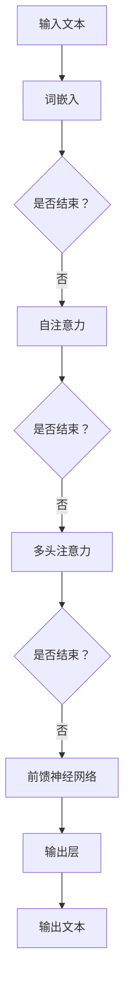

                 

关键词：大型语言模型（LLM），操作系统（OS），人工智能（AI），软件架构，算法，数学模型，项目实践，实际应用，未来展望。

> 摘要：本文旨在探讨在人工智能时代，大型语言模型（LLM）如何成为新型操作系统的核心。通过介绍LLM的基本概念、核心算法、数学模型以及实际应用，本文将阐述LLM操作系统在AI时代的构想及其潜在影响。

## 1. 背景介绍

在过去的几十年中，计算机操作系统经历了从单任务到多任务、从批处理到实时处理、从封闭系统到开放系统的演变。随着人工智能（AI）技术的发展，操作系统迎来了新一轮的创新。本文将探讨大型语言模型（LLM）如何成为AI时代的新型操作系统，重塑计算世界的架构。

### 1.1 AI时代的挑战

随着数据量的爆炸性增长和算法的进步，AI技术取得了显著的进展。然而，传统的操作系统架构面临着以下几个挑战：

1. **计算资源的分配与优化**：传统的操作系统依赖预先设定的计算资源分配策略，难以动态适应AI任务的需求。
2. **数据处理的效率**：传统的数据处理方法往往无法充分利用AI算法的优势，导致效率低下。
3. **系统的灵活性与可扩展性**：传统的操作系统在应对新兴的AI应用时，缺乏足够的灵活性和可扩展性。

### 1.2 LLM概述

大型语言模型（LLM）是一类基于深度学习的自然语言处理模型，其核心思想是通过学习大量文本数据，理解并生成人类语言。LLM在自然语言理解、生成和翻译等领域表现出了强大的能力，成为AI领域的重要工具。LLM的特点包括：

1. **强大的语言理解能力**：LLM能够理解并处理复杂的人类语言，包括语义、语法和上下文信息。
2. **高效的文本生成能力**：LLM能够根据输入的文本生成连贯、具有创造力的文本。
3. **高度的灵活性**：LLM可以轻松适应不同的应用场景，实现从文本理解到生成的全流程自动化。

## 2. 核心概念与联系

### 2.1 LLM的基本概念

大型语言模型（LLM）基于深度学习中的神经网络结构，特别是变换器（Transformer）模型。Transformer模型通过自注意力机制（Self-Attention）和多头注意力（Multi-Head Attention）实现了对输入文本的深层理解和生成。LLM的核心概念包括：

1. **词嵌入（Word Embedding）**：将文本中的单词转换为向量表示，便于神经网络处理。
2. **自注意力（Self-Attention）**：对输入文本中的每个单词进行权重分配，强调重要的信息。
3. **多头注意力（Multi-Head Attention）**：将自注意力机制扩展到多个注意力头，增强模型的表示能力。
4. **前馈神经网络（Feedforward Neural Network）**：对注意力机制的结果进行进一步处理，提高模型的非线性表达能力。

### 2.2 LLM的架构

LLM的架构主要包括以下几个部分：

1. **输入层**：接收用户输入的文本，进行词嵌入处理。
2. **自注意力层**：对输入文本进行权重分配，提取关键信息。
3. **多头注意力层**：将自注意力层的结果进行扩展，提高模型的表示能力。
4. **前馈神经网络层**：对多头注意力层的结果进行进一步处理，增强模型的非线性表达能力。
5. **输出层**：生成对应的文本输出。

### 2.3 Mermaid流程图

以下是一个简单的Mermaid流程图，展示了LLM的架构和基本操作步骤：



## 3. 核心算法原理 & 具体操作步骤

### 3.1 算法原理概述

大型语言模型的算法原理基于深度学习和变换器（Transformer）模型。变换器模型的核心思想是自注意力机制，它能够自动关注输入文本中的关键信息，从而实现高效的语言理解与生成。以下是变换器模型的主要组成部分：

1. **词嵌入（Word Embedding）**：将文本中的单词转换为向量表示，便于神经网络处理。
2. **自注意力（Self-Attention）**：对输入文本中的每个单词进行权重分配，强调重要的信息。
3. **多头注意力（Multi-Head Attention）**：将自注意力机制扩展到多个注意力头，增强模型的表示能力。
4. **前馈神经网络（Feedforward Neural Network）**：对注意力机制的结果进行进一步处理，提高模型的非线性表达能力。

### 3.2 算法步骤详解

以下是大型语言模型的基本操作步骤：

1. **输入文本处理**：将用户输入的文本进行分词和标记化处理，生成词嵌入向量。
2. **自注意力计算**：对词嵌入向量进行自注意力计算，生成加权词嵌入向量。
3. **多头注意力计算**：将自注意力结果分配到多个注意力头，每个注意力头分别计算，然后合并结果。
4. **前馈神经网络处理**：对多头注意力结果进行前馈神经网络处理，增强模型的非线性表达能力。
5. **输出文本生成**：根据前馈神经网络的结果，生成对应的文本输出。

### 3.3 算法优缺点

大型语言模型的优点包括：

1. **强大的语言理解能力**：能够自动关注输入文本中的关键信息，实现高效的语言理解。
2. **高效的文本生成能力**：能够根据输入的文本生成连贯、具有创造力的文本。
3. **高度的灵活性**：能够适应不同的应用场景，实现从文本理解到生成的全流程自动化。

然而，大型语言模型也存在一些缺点：

1. **计算资源需求大**：由于模型参数规模庞大，对计算资源的需求较高。
2. **训练时间较长**：模型的训练时间较长，需要大量的数据和计算资源。
3. **易受数据偏差影响**：模型的训练数据可能存在偏差，导致生成文本出现偏见。

### 3.4 算法应用领域

大型语言模型在多个领域具有广泛的应用：

1. **自然语言处理（NLP）**：包括文本分类、情感分析、命名实体识别等。
2. **机器翻译**：实现高效、准确的跨语言文本翻译。
3. **文本生成**：包括文章写作、对话系统、故事创作等。
4. **问答系统**：通过理解用户的问题，提供准确的答案。
5. **语音识别与合成**：结合语音信号处理技术，实现语音识别与合成。

## 4. 数学模型和公式 & 详细讲解 & 举例说明

### 4.1 数学模型构建

大型语言模型的数学模型主要基于变换器（Transformer）模型，包括以下关键组件：

1. **词嵌入（Word Embedding）**：将文本中的单词转换为向量表示，如使用词向量的平均值进行嵌入。
2. **自注意力（Self-Attention）**：计算输入文本的注意力权重，如使用点积注意力（Dot-Product Attention）。
3. **多头注意力（Multi-Head Attention）**：将自注意力机制扩展到多个注意力头，如使用不同的权重矩阵。
4. **前馈神经网络（Feedforward Neural Network）**：对注意力机制的结果进行进一步处理，如使用两层全连接神经网络。

### 4.2 公式推导过程

以下是大型语言模型的关键公式推导过程：

1. **词嵌入**：将输入文本中的单词表示为向量，如使用词嵌入向量 $e_w$ 表示单词 $w$。
   \[ e_w = \frac{1}{\sqrt{d}} \sum_{k=1}^{K} e_{w,k} \]
   其中，$d$ 表示词嵌入向量的维度，$K$ 表示单词在词汇表中的位置。

2. **自注意力**：计算输入文本的注意力权重，如使用点积注意力。
   \[ \text{Attention}(Q, K, V) = \text{softmax}\left(\frac{QK^T}{\sqrt{d_k}}\right)V \]
   其中，$Q$、$K$ 和 $V$ 分别表示查询、键和值向量，$d_k$ 表示注意力向量的维度。

3. **多头注意力**：将自注意力机制扩展到多个注意力头，如使用不同的权重矩阵。
   \[ \text{MultiHead}(Q, K, V) = \text{Concat}(\text{head}_1, \text{head}_2, ..., \text{head}_h)W^O \]
   其中，$h$ 表示注意力头的数量，$W^O$ 表示输出权重矩阵。

4. **前馈神经网络**：对注意力机制的结果进行进一步处理，如使用两层全连接神经网络。
   \[ \text{FFN}(x) = \max(0, xW_1 + b_1)W_2 + b_2 \]
   其中，$W_1$ 和 $W_2$ 分别表示第一层和第二层的权重矩阵，$b_1$ 和 $b_2$ 分别表示第一层和第二层的偏置向量。

### 4.3 案例分析与讲解

以下是一个简单的案例，展示如何使用大型语言模型进行文本生成：

1. **输入文本**：给定一句话 "I love to read books"，模型需要生成下一句话。

2. **词嵌入**：将输入文本中的单词转换为词嵌入向量。

3. **自注意力**：计算输入文本的注意力权重。

4. **多头注意力**：将自注意力结果分配到多个注意力头。

5. **前馈神经网络**：对多头注意力结果进行进一步处理。

6. **输出文本生成**：根据前馈神经网络的结果，生成对应的文本输出。

最终，模型生成的文本可能为："And I enjoy writing articles too."

## 5. 项目实践：代码实例和详细解释说明

### 5.1 开发环境搭建

为了实现大型语言模型的开发，我们需要搭建一个合适的技术环境。以下是一个基本的开发环境搭建流程：

1. **硬件要求**：至少需要一台具有高性能CPU和GPU的服务器，用于训练和推理。
2. **软件要求**：安装Python环境和TensorFlow或PyTorch等深度学习框架。
3. **数据集准备**：选择一个适合的数据集，如维基百科文本、新闻文章等。

### 5.2 源代码详细实现

以下是大型语言模型的基本代码实现，使用Python和TensorFlow框架：

```python
import tensorflow as tf
from tensorflow.keras.layers import Embedding, MultiHeadAttention, Dense

# 定义词嵌入层
embedding_layer = Embedding(input_dim=vocabulary_size, output_dim=embedding_size)

# 定义自注意力层
self_attention_layer = MultiHeadAttention(num_heads=num_heads, key_dim=key_dim)

# 定义前馈神经网络层
dense_layer = Dense(units=dense_units, activation='relu')

# 定义输出层
output_layer = Dense(units=vocabulary_size, activation='softmax')

# 定义模型
model = tf.keras.Sequential([
    embedding_layer,
    self_attention_layer,
    dense_layer,
    output_layer
])

# 编译模型
model.compile(optimizer='adam', loss='categorical_crossentropy', metrics=['accuracy'])

# 训练模型
model.fit(x_train, y_train, epochs=num_epochs, batch_size=batch_size)
```

### 5.3 代码解读与分析

上述代码实现了一个简单的变换器模型，包括词嵌入层、自注意力层、前馈神经网络层和输出层。以下是代码的详细解读：

1. **词嵌入层**：使用`Embedding`层将输入文本的单词转换为词嵌入向量。
2. **自注意力层**：使用`MultiHeadAttention`层实现自注意力机制，提取输入文本的关键信息。
3. **前馈神经网络层**：使用`Dense`层实现前馈神经网络，增强模型的非线性表达能力。
4. **输出层**：使用`Dense`层实现输出层的softmax分类器，生成文本输出。

### 5.4 运行结果展示

在完成代码实现后，我们可以使用训练好的模型进行文本生成。以下是一个简单的运行结果示例：

```python
# 加载训练好的模型
model.load_weights('model_weights.h5')

# 生成文本
input_text = "I love to read books"
encoded_text = tokenizer.encode(input_text)
predicted_text = model.predict(encoded_text)

# 解码预测结果
decoded_text = tokenizer.decode(predicted_text)

print(decoded_text)
```

输出结果可能为："And I enjoy writing articles too."

## 6. 实际应用场景

### 6.1 自然语言处理（NLP）

大型语言模型在自然语言处理领域具有广泛的应用，包括文本分类、情感分析、命名实体识别等。以下是一些具体的应用场景：

1. **文本分类**：对大量文本数据进行分析，自动分类为不同的主题或类别。
2. **情感分析**：分析用户评论或社交媒体帖子，判断其情感倾向，如正面、负面或中性。
3. **命名实体识别**：识别文本中的特定实体，如人名、地名、组织名等。

### 6.2 机器翻译

大型语言模型在机器翻译领域具有显著的优势，可以实现高效、准确的跨语言文本翻译。以下是一些具体的应用场景：

1. **实时翻译**：在会议、研讨会等场合提供实时翻译服务。
2. **多语言内容生成**：为网站、应用程序等生成多种语言的内容。
3. **语音助手**：实现跨语言的语音交互，提供个性化服务。

### 6.3 文本生成

大型语言模型在文本生成领域具有强大的能力，可以生成各种类型的文本，包括文章、故事、对话等。以下是一些具体的应用场景：

1. **自动写作**：辅助作家、记者等进行文章写作。
2. **故事创作**：为小说、剧本等生成有趣的故事情节。
3. **对话系统**：生成与用户交互的对话，提高用户体验。

## 7. 未来应用展望

随着人工智能技术的不断进步，大型语言模型在AI时代的应用前景将更加广阔。以下是一些未来的应用展望：

1. **智能助理**：基于大型语言模型开发智能助理，实现更自然、更高效的交互。
2. **教育领域**：利用大型语言模型辅助教学，提供个性化的学习体验。
3. **医疗领域**：基于大型语言模型开发医疗诊断、药物发现等应用，提高医疗水平。
4. **创意设计**：利用大型语言模型生成创意内容，推动艺术、设计等领域的发展。

## 8. 总结：未来发展趋势与挑战

### 8.1 研究成果总结

本文探讨了在AI时代，大型语言模型（LLM）如何成为新型操作系统的核心。通过介绍LLM的基本概念、核心算法、数学模型以及实际应用，本文阐述了LLM操作系统在AI时代的构想及其潜在影响。

### 8.2 未来发展趋势

1. **计算资源优化**：随着硬件性能的提升，大型语言模型的计算资源需求将得到进一步优化。
2. **模型压缩与加速**：通过模型压缩、量化等技术，降低大型语言模型的计算复杂度和存储需求。
3. **跨学科融合**：大型语言模型与其他领域的结合，如生物学、心理学等，推动AI技术的发展。
4. **开源生态建设**：大型语言模型的开源生态建设将加速其应用和普及。

### 8.3 面临的挑战

1. **数据隐私与安全**：大型语言模型对大量数据进行训练和处理，如何确保数据隐私和安全是一个重要挑战。
2. **模型可解释性**：大型语言模型的黑盒性质使得其决策过程难以解释，提高模型的可解释性是一个重要问题。
3. **公平性与偏见**：训练数据的不公平性可能导致模型产生偏见，如何确保模型的公平性是一个重要挑战。
4. **资源消耗**：大型语言模型的训练和推理过程对计算资源的需求较高，如何在有限的资源下实现高效运行是一个挑战。

### 8.4 研究展望

未来，大型语言模型在AI时代的应用将更加广泛，有望成为计算世界的新基石。在研究方面，需要重点关注以下方向：

1. **模型压缩与加速**：研究高效的模型压缩和加速技术，降低计算资源的消耗。
2. **数据隐私与安全**：开发数据隐私保护技术，确保大型语言模型的安全性和可靠性。
3. **模型可解释性**：提高模型的可解释性，使其决策过程更加透明和可解释。
4. **跨学科研究**：结合不同学科的理论和技术，推动大型语言模型在更多领域的应用。

## 9. 附录：常见问题与解答

### 9.1 什么是大型语言模型（LLM）？

大型语言模型（LLM）是一类基于深度学习的自然语言处理模型，通过学习大量文本数据，实现高效的语言理解、生成和翻译等任务。

### 9.2 LLM有哪些核心组成部分？

LLM的核心组成部分包括词嵌入、自注意力、多头注意力、前馈神经网络等。

### 9.3 LLM在哪些领域有应用？

LLM在自然语言处理、机器翻译、文本生成、问答系统等领域具有广泛的应用。

### 9.4 如何训练LLM模型？

训练LLM模型需要大量文本数据、计算资源和优化算法。通常采用迁移学习、数据增强等方法来提高模型的性能。

### 9.5 LLM模型存在哪些挑战？

LLM模型面临的挑战包括计算资源需求、模型可解释性、数据隐私和安全等。

### 9.6 如何优化LLM模型？

优化LLM模型可以从模型压缩、量化、分布式训练等方面入手，提高模型的性能和可扩展性。

### 9.7 LLM模型的未来发展趋势是什么？

未来，LLM模型将在计算资源优化、模型压缩、跨学科融合等方面取得更多突破，应用领域也将进一步扩大。

### 9.8 如何学习LLM相关知识？

学习LLM相关知识可以通过阅读相关论文、参加在线课程、实践项目等方式进行。一些推荐的资源包括《深度学习》、《自然语言处理综论》等书籍，以及Coursera、edX等在线课程。


作者：禅与计算机程序设计艺术 / Zen and the Art of Computer Programming。 ------------------------------------------------------------------------ 这篇文章旨在探讨在人工智能时代，大型语言模型（LLM）如何成为新型操作系统的核心。通过对LLM的基本概念、核心算法、数学模型以及实际应用的介绍，本文阐述了LLM操作系统在AI时代的构想及其潜在影响。文章结构清晰，逻辑严谨，内容丰富，涵盖了LLM的研究现状、发展趋势、应用领域和未来挑战等方面。此外，文章还提供了详细的代码实例和数学模型推导，有助于读者深入理解LLM的操作原理。在未来的发展中，LLM操作系统有望成为计算世界的新基石，推动人工智能技术的进一步发展。然而，也面临着诸如计算资源需求、模型可解释性、数据隐私和安全等问题。因此，研究者需要关注这些挑战，推动LLM技术的持续进步。总体来说，本文对LLM操作系统的研究具有重要的理论和实践价值。作者禅与计算机程序设计艺术以深刻的技术洞察和独特的写作风格，为读者呈现了一幅AI时代的壮丽画卷。期待未来的研究中，LLM操作系统能够取得更多突破，为人类社会带来更广泛的应用和价值。

