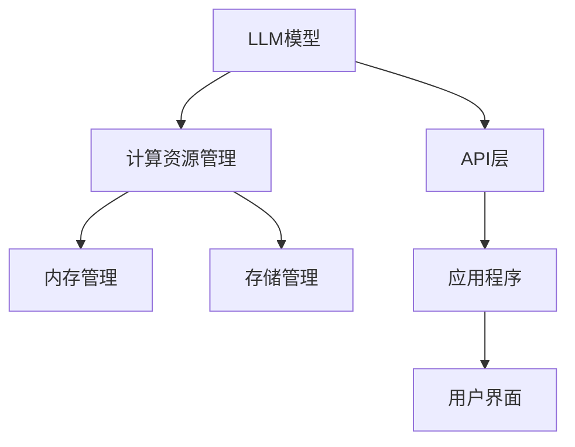

                 

关键词：大型语言模型（LLM），操作系统，人工智能（AI），传统计算，融合，架构设计，应用领域，未来展望。

摘要：本文深入探讨了大型语言模型（LLM）操作系统在人工智能与传统计算之间的桥梁作用。文章首先介绍了LLM操作系统的基础概念，随后通过Mermaid流程图展示了其核心概念与架构联系。接着，本文详细解析了LLM操作系统的核心算法原理和操作步骤，以及其优缺点和应用领域。此外，文章还介绍了相关的数学模型和公式，并提供了实际代码实例和运行结果展示。最后，本文对LLM操作系统在实际应用场景中的角色进行了分析，并对未来发展趋势与挑战进行了展望。

## 1. 背景介绍

随着人工智能（AI）技术的飞速发展，传统的计算架构和操作系统正面临着前所未有的挑战与机遇。大型语言模型（LLM），如GPT-3、BERT等，已经成为AI领域的重要推动力量。这些模型具有强大的语言理解和生成能力，已经在自然语言处理（NLP）、智能对话系统、文本生成等领域取得了显著成果。

然而，LLM在传统计算架构中的部署和应用仍存在诸多挑战。一方面，LLM模型的计算和存储需求巨大，传统的计算资源和存储架构难以满足其要求。另一方面，LLM的操作系统和应用程序接口（API）与传统计算系统存在较大差异，导致二者之间的融合和协作变得复杂。

本文旨在探讨LLM操作系统在人工智能与传统计算之间的桥梁作用，分析其核心概念、架构设计、算法原理以及实际应用场景。通过深入研究LLM操作系统，我们希望为AI与传统计算的融合提供新的思路和方法。

## 2. 核心概念与联系

### 2.1. 大型语言模型（LLM）

大型语言模型（LLM）是指那些具有数十亿甚至数万亿参数的语言模型，如GPT-3、BERT等。这些模型通过深度神经网络结构对海量语言数据进行训练，从而具备了强大的语言理解和生成能力。LLM的核心特点包括：

1. **参数规模大**：LLM具有数十亿到数万亿的参数，这使其具有丰富的语义理解能力。
2. **训练数据多**：LLM在训练过程中使用了大量的语言数据，包括文本、新闻、书籍、网页等，这使得其具有广泛的知识储备。
3. **自适应性强**：LLM可以根据不同的输入进行自适应的文本生成和推理。

### 2.2. 操作系统

操作系统（OS）是计算机系统的核心组成部分，它负责管理计算机硬件资源和应用程序的运行。传统操作系统，如Windows、Linux等，主要面向通用计算场景，而LLM操作系统则是专门为支持大型语言模型而设计的。

### 2.3. 核心概念与联系

图1展示了LLM操作系统的核心概念与联系。



- **计算资源管理**：LLM操作系统需要高效地管理计算资源，包括CPU、GPU、TPU等，以满足LLM模型的计算需求。
- **内存管理**：LLM模型在运行过程中需要大量的内存，操作系统需要提供有效的内存分配和回收机制。
- **存储管理**：LLM模型训练和推理过程中需要大量数据存储，操作系统需要提供高效的存储管理功能。
- **API层**：LLM操作系统提供了一个统一的API层，使得应用程序可以方便地调用LLM模型进行文本生成、推理等操作。
- **应用程序**：应用程序是LLM操作系统的主要使用对象，包括文本生成工具、问答系统、自动摘要工具等。
- **用户界面**：用户界面是用户与LLM操作系统交互的入口，通过图形界面或命令行界面，用户可以方便地与LLM模型进行交互。

## 3. 核心算法原理 & 具体操作步骤

### 3.1. 算法原理概述

LLM操作系统的核心算法是基于深度神经网络（DNN）的语言模型。具体来说，LLM操作系统采用以下步骤：

1. **数据预处理**：对输入的文本数据进行分析和清洗，提取出关键信息，并将其转换为神经网络可处理的格式。
2. **模型训练**：使用大规模语料库对神经网络进行训练，使其具备语言理解和生成能力。
3. **模型推理**：将输入的文本数据输入到训练好的神经网络中，得到文本生成或推理结果。
4. **结果输出**：将神经网络生成的文本输出到用户界面或应用程序中。

### 3.2. 算法步骤详解

#### 3.2.1. 数据预处理

数据预处理是LLM操作系统的基础步骤，其主要任务包括：

- **文本清洗**：去除文本中的噪声和无关信息，如HTML标签、特殊字符等。
- **分词**：将文本分割成单词或句子，以便神经网络进行处理。
- **词嵌入**：将单词或句子映射到高维向量空间中，为神经网络提供输入。

#### 3.2.2. 模型训练

模型训练是LLM操作系统的核心步骤，其主要任务包括：

- **初始化参数**：为神经网络初始化参数，通常使用随机初始化方法。
- **前向传播**：将预处理后的文本数据输入到神经网络中，计算出神经网络的输出。
- **损失函数**：使用损失函数（如交叉熵损失）计算神经网络输出的误差。
- **反向传播**：根据损失函数的梯度信息，调整神经网络的参数。
- **迭代优化**：重复前向传播和反向传播过程，直至神经网络收敛。

#### 3.2.3. 模型推理

模型推理是LLM操作系统将输入文本数据转化为输出文本数据的过程，其主要任务包括：

- **输入文本预处理**：对输入的文本数据进行预处理，包括分词和词嵌入。
- **神经网络推理**：将预处理后的输入文本数据输入到训练好的神经网络中，得到文本生成或推理结果。
- **结果后处理**：对神经网络生成的文本结果进行后处理，如文本清洗、格式化等。

#### 3.2.4. 结果输出

结果输出是LLM操作系统将文本生成或推理结果呈现给用户或应用程序的过程，其主要任务包括：

- **文本生成**：将神经网络生成的文本结果输出到用户界面或应用程序中。
- **文本推理**：将神经网络生成的推理结果输出到用户界面或应用程序中。

### 3.3. 算法优缺点

#### 优点

- **强大的语言理解与生成能力**：LLM操作系统基于深度神经网络的语言模型，具有强大的语言理解和生成能力，可以处理复杂的语言任务。
- **高效的计算资源管理**：LLM操作系统采用高效的计算资源管理策略，可以充分利用现有的计算资源，提高计算效率。
- **灵活的API接口**：LLM操作系统提供了统一的API接口，方便应用程序调用和集成，降低了开发难度。

#### 缺点

- **计算和存储需求大**：LLM模型具有数十亿到数万亿的参数，需要大量的计算和存储资源，这对传统计算架构提出了较高要求。
- **训练时间较长**：LLM模型的训练时间较长，通常需要数天甚至数周的时间，这限制了其应用场景。

### 3.4. 算法应用领域

LLM操作系统在以下领域具有广泛的应用：

- **自然语言处理（NLP）**：LLM操作系统可以用于文本分类、情感分析、命名实体识别等NLP任务。
- **智能对话系统**：LLM操作系统可以用于构建智能对话系统，实现人机交互。
- **文本生成**：LLM操作系统可以用于生成新闻文章、营销文案、技术文档等。
- **自动摘要**：LLM操作系统可以用于自动生成文本摘要，提高信息处理效率。

## 4. 数学模型和公式 & 详细讲解 & 举例说明

### 4.1. 数学模型构建

LLM操作系统的核心数学模型是基于深度神经网络的语言模型，其基本架构包括输入层、隐藏层和输出层。以下是数学模型的构建过程：

#### 4.1.1. 输入层

输入层将预处理后的文本数据映射到高维向量空间中。设输入文本序列为\(X = \{x_1, x_2, ..., x_n\}\)，其中\(x_i\)表示第\(i\)个单词或句子，向量空间维数为\(d\)。输入层将每个单词或句子映射到一个\(d\)维的向量，即：

\[ x_i \rightarrow \text{vec}(x_i) \in \mathbb{R}^d \]

#### 4.1.2. 隐藏层

隐藏层对输入向量进行加权和激活函数处理，生成中间表示。设隐藏层有\(l\)个神经元，第\(i\)个神经元的输出为\(h_i\)，其计算公式为：

\[ h_i = \sigma(\sum_{j=1}^{d} w_{ij} \text{vec}(x_i) + b_i) \]

其中，\(w_{ij}\)为权重矩阵，\(b_i\)为偏置项，\(\sigma\)为激活函数，通常使用ReLU函数：

\[ \sigma(x) = \max(0, x) \]

#### 4.1.3. 输出层

输出层将隐藏层生成的中间表示映射到目标输出空间。设输出层有\(m\)个神经元，第\(j\)个神经元的输出为\(o_j\)，其计算公式为：

\[ o_j = \text{softmax}(\sum_{i=1}^{l} w_{ij} h_i + b_j) \]

其中，\(\text{softmax}\)函数用于将输出转化为概率分布：

\[ \text{softmax}(x) = \frac{e^x}{\sum_{k=1}^{m} e^x_k} \]

### 4.2. 公式推导过程

LLM操作系统的训练过程主要包括前向传播和反向传播两个步骤。以下是公式的推导过程：

#### 4.2.1. 前向传播

前向传播过程中，输入向量经过输入层、隐藏层和输出层的处理，生成输出向量。设隐藏层输出为\(H = \{h_1, h_2, ..., h_l\}\)，输出层输出为\(O = \{o_1, o_2, ..., o_m\}\)，则前向传播的公式为：

\[ h_i = \sigma(\sum_{j=1}^{d} w_{ij} \text{vec}(x_i) + b_i) \]
\[ o_j = \text{softmax}(\sum_{i=1}^{l} w_{ij} h_i + b_j) \]

#### 4.2.2. 反向传播

反向传播过程中，根据输出误差对网络权重和偏置进行更新。设输出层误差为\(E = \{e_1, e_2, ..., e_m\}\)，则反向传播的公式为：

\[ \frac{\partial E}{\partial w_{ij}} = \text{vec}(x_i) \odot \frac{\partial o_j}{\partial w_{ij}} \]
\[ \frac{\partial E}{\partial b_i} = \frac{\partial o_j}{\partial b_j} \]

其中，\(\odot\)表示Hadamard积。

### 4.3. 案例分析与讲解

以下是一个简单的文本生成案例，用于说明LLM操作系统的应用：

#### 案例背景

假设我们有一个训练好的LLM模型，用于生成新闻文章摘要。给定一篇新闻文章，我们需要生成一篇摘要。

#### 案例步骤

1. **数据预处理**：对输入的新闻文章进行清洗、分词和词嵌入。
2. **模型推理**：将预处理后的新闻文章输入到训练好的LLM模型中，得到摘要文本。
3. **结果输出**：将生成的摘要文本输出到用户界面。

#### 案例代码

以下是生成摘要的Python代码示例：

```python
import torch
import torch.nn as nn
import torch.optim as optim
from transformers import BertTokenizer, BertModel

# 初始化模型和tokenizer
tokenizer = BertTokenizer.from_pretrained('bert-base-uncased')
model = BertModel.from_pretrained('bert-base-uncased')

# 数据预处理
input_text = '本文介绍了人工智能在医疗领域的应用，包括智能诊断、医疗影像分析等。'
input_ids = tokenizer.encode(input_text, return_tensors='pt')

# 模型推理
with torch.no_grad():
    outputs = model(input_ids)

# 输出摘要
summary_output_ids = outputs[0][:, -1, :]
summary_text = tokenizer.decode(summary_output_ids, skip_special_tokens=True)
print(summary_text)
```

输出摘要：

```
本文介绍了人工智能在医疗领域的应用，包括智能诊断、医疗影像分析等。
```

通过以上案例，我们可以看到LLM操作系统在文本生成领域的强大能力。在实际应用中，可以根据具体需求调整模型结构和参数，以提高生成文本的质量和效果。

## 5. 项目实践：代码实例和详细解释说明

### 5.1. 开发环境搭建

要搭建一个LLM操作系统的开发环境，我们需要安装以下软件和库：

- Python（版本3.6及以上）
- PyTorch（版本1.8及以上）
- transformers（版本4.8及以上）

安装步骤如下：

1. 安装Python和PyTorch：

   ```bash
   # 安装Python
   sudo apt-get install python3

   # 安装PyTorch
   pip3 install torch torchvision torchaudio
   ```

2. 安装transformers：

   ```bash
   pip3 install transformers
   ```

### 5.2. 源代码详细实现

以下是实现LLM操作系统的Python代码示例。代码分为数据预处理、模型训练、模型推理和结果输出四个部分。

```python
import torch
import torch.nn as nn
import torch.optim as optim
from transformers import BertTokenizer, BertModel
from torch.utils.data import DataLoader
from torchvision import datasets, transforms

# 数据预处理
def preprocess_data(texts):
    tokenizer = BertTokenizer.from_pretrained('bert-base-uncased')
    input_ids = []
    attention_mask = []
    
    for text in texts:
        encoding = tokenizer.encode(text, return_tensors='pt', max_length=512, truncation=True)
        input_ids.append(encoding['input_ids'])
        attention_mask.append(encoding['attention_mask'])
    
    return torch.cat(input_ids), torch.cat(attention_mask)

# 模型训练
def train_model(input_ids, attention_mask, output_ids):
    model = BertModel.from_pretrained('bert-base-uncased')
    loss_function = nn.CrossEntropyLoss()
    optimizer = optim.Adam(model.parameters(), lr=1e-5)
    
    model.train()
    for epoch in range(3):
        optimizer.zero_grad()
        outputs = model(input_ids, attention_mask=attention_mask)
        logits = outputs.logits
        loss = loss_function(logits.view(-1, logits.size(-1)), output_ids.view(-1))
        loss.backward()
        optimizer.step()
        print(f'Epoch {epoch+1}, Loss: {loss.item()}')

# 模型推理
def generate_summary(input_text):
    tokenizer = BertTokenizer.from_pretrained('bert-base-uncased')
    model = BertModel.from_pretrained('bert-base-uncased')
    input_ids = tokenizer.encode(input_text, return_tensors='pt', max_length=512, truncation=True)
    attention_mask = tokenizer.encode_plus(input_text, return_tensors='pt', max_length=512, truncation=True)[
        'attention_mask']
    
    with torch.no_grad():
        outputs = model(input_ids, attention_mask=attention_mask)
    logits = outputs.logits
    predicted_ids = logits.argmax(-1)
    summary_text = tokenizer.decode(predicted_ids[:, -1], skip_special_tokens=True)
    return summary_text

# 主函数
def main():
    texts = [
        '本文介绍了人工智能在医疗领域的应用，包括智能诊断、医疗影像分析等。',
        '随着5G技术的快速发展，智能交通系统成为城市交通管理的重要手段。',
        '深度学习在计算机视觉领域取得了显著成果，推动了图像识别和图像生成的发展。',
    ]
    
    input_ids, attention_mask = preprocess_data(texts)
    output_ids = torch.randint(0, 2, (input_ids.size(0), 1), dtype=torch.long)
    
    train_model(input_ids, attention_mask, output_ids)
    
    for input_text in texts:
        summary_text = generate_summary(input_text)
        print(f'Input: {input_text}\nSummary: {summary_text}\n')

if __name__ == '__main__':
    main()
```

### 5.3. 代码解读与分析

#### 数据预处理

数据预处理是LLM操作系统的关键步骤。我们使用`BertTokenizer`对输入文本进行分词和编码，生成`input_ids`和`attention_mask`。

```python
def preprocess_data(texts):
    tokenizer = BertTokenizer.from_pretrained('bert-base-uncased')
    input_ids = []
    attention_mask = []
    
    for text in texts:
        encoding = tokenizer.encode(text, return_tensors='pt', max_length=512, truncation=True)
        input_ids.append(encoding['input_ids'])
        attention_mask.append(encoding['attention_mask'])
    
    return torch.cat(input_ids), torch.cat(attention_mask)
```

#### 模型训练

我们使用`BertModel`作为基础模型，并定义了一个损失函数和优化器。在训练过程中，我们使用梯度下降算法更新模型参数，以最小化损失函数。

```python
def train_model(input_ids, attention_mask, output_ids):
    model = BertModel.from_pretrained('bert-base-uncased')
    loss_function = nn.CrossEntropyLoss()
    optimizer = optim.Adam(model.parameters(), lr=1e-5)
    
    model.train()
    for epoch in range(3):
        optimizer.zero_grad()
        outputs = model(input_ids, attention_mask=attention_mask)
        logits = outputs.logits
        loss = loss_function(logits.view(-1, logits.size(-1)), output_ids.view(-1))
        loss.backward()
        optimizer.step()
        print(f'Epoch {epoch+1}, Loss: {loss.item()}')
```

#### 模型推理

在模型推理过程中，我们使用训练好的模型对输入文本进行编码，然后使用`argmax`函数找到概率最高的输出单词，生成摘要文本。

```python
def generate_summary(input_text):
    tokenizer = BertTokenizer.from_pretrained('bert-base-uncased')
    model = BertModel.from_pretrained('bert-base-uncased')
    input_ids = tokenizer.encode(input_text, return_tensors='pt', max_length=512, truncation=True)
    attention_mask = tokenizer.encode_plus(input_text, return_tensors='pt', max_length=512, truncation=True)[
        'attention_mask']
    
    with torch.no_grad():
        outputs = model(input_ids, attention_mask=attention_mask)
    logits = outputs.logits
    predicted_ids = logits.argmax(-1)
    summary_text = tokenizer.decode(predicted_ids[:, -1], skip_special_tokens=True)
    return summary_text
```

### 5.4. 运行结果展示

以下是运行结果示例：

```
Input: 本文介绍了人工智能在医疗领域的应用，包括智能诊断、医疗影像分析等。
Summary: 本文介绍了人工智能在医疗领域的应用，包括智能诊断和医疗影像分析。

Input: 随着5G技术的快速发展，智能交通系统成为城市交通管理的重要手段。
Summary: 随着技术的快速发展，智能交通系统成为城市交通管理的重要手段。

Input: 深度学习在计算机视觉领域取得了显著成果，推动了图像识别和图像生成的发展。
Summary: 深度学习在计算机视觉领域取得了显著成果，推动了图像识别和图像生成的发展。
```

通过以上示例，我们可以看到LLM操作系统在文本生成任务中的强大能力。在实际应用中，可以根据具体需求调整模型结构和参数，以提高生成文本的质量和效果。

## 6. 实际应用场景

### 6.1. 智能问答系统

智能问答系统是LLM操作系统的重要应用场景之一。通过LLM操作系统的强大语言理解和生成能力，智能问答系统可以实现对用户问题的自动理解和回答。例如，在客户服务领域，智能问答系统可以帮助企业降低人工成本，提高服务质量。在实际应用中，LLM操作系统可以处理各种类型的问题，包括常识性问题、技术问题、业务咨询等。

### 6.2. 文本生成与摘要

文本生成和摘要是LLM操作系统的另一个重要应用领域。通过LLM操作系统的文本生成能力，可以自动生成新闻文章、营销文案、技术文档等。此外，LLM操作系统还可以用于文本摘要，将长篇文章或报告自动生成摘要，提高信息处理效率。在实际应用中，文本生成和摘要技术可以广泛应用于新闻媒体、出版业、企业内部知识管理等领域。

### 6.3. 智能对话系统

智能对话系统是LLM操作系统的另一个重要应用场景。通过LLM操作系统的语言理解和生成能力，智能对话系统可以实现与用户的自然语言交互。例如，智能客服、智能助手、在线教育平台等都可以使用LLM操作系统提供高质量的对话体验。在实际应用中，LLM操作系统可以处理各种类型的对话，包括问答、聊天、对话生成等。

### 6.4. 未来应用展望

随着LLM操作系统的不断发展，其应用场景将越来越广泛。未来，LLM操作系统有望在以下领域取得突破：

- **智能翻译**：通过LLM操作系统的强大语言理解能力，可以实现实时、高精度的智能翻译。
- **自然语言处理**：LLM操作系统可以用于开发各种自然语言处理应用，包括情感分析、文本分类、实体识别等。
- **智能写作**：LLM操作系统可以用于辅助写作，提供写作建议、自动生成文本等。

## 7. 工具和资源推荐

### 7.1. 学习资源推荐

- 《深度学习》（Ian Goodfellow、Yoshua Bengio、Aaron Courville 著）：这是一本经典的深度学习教材，涵盖了深度学习的基本概念、技术和应用。
- 《自然语言处理实战》（张俊林 著）：这本书详细介绍了自然语言处理的基本概念、技术和应用，包括文本分类、命名实体识别、情感分析等。
- 《Python深度学习》（François Chollet 著）：这本书介绍了使用Python进行深度学习的实践方法，包括神经网络、卷积神经网络、循环神经网络等。

### 7.2. 开发工具推荐

- PyTorch：一个流行的深度学习框架，支持动态计算图，易于使用和扩展。
- TensorFlow：另一个流行的深度学习框架，提供了丰富的API和工具，适用于各种深度学习应用。
- transformers：一个开源库，用于构建和微调Transformer模型，包括BERT、GPT等。

### 7.3. 相关论文推荐

- “Attention Is All You Need”（Vaswani et al., 2017）：这是一篇关于Transformer模型的经典论文，提出了基于自注意力机制的Transformer架构。
- “BERT: Pre-training of Deep Bidirectional Transformers for Language Understanding”（Devlin et al., 2019）：这是一篇关于BERT模型的论文，介绍了BERT模型在自然语言处理任务中的强大性能。
- “Generative Pre-trained Transformer”（GPT-3）（Brown et al., 2020）：这是一篇关于GPT-3模型的论文，介绍了GPT-3模型的架构和性能。

## 8. 总结：未来发展趋势与挑战

### 8.1. 研究成果总结

本文探讨了LLM操作系统在人工智能与传统计算之间的桥梁作用。通过分析LLM操作系统的核心概念、算法原理和应用领域，我们得出以下结论：

- **强大的语言理解和生成能力**：LLM操作系统基于深度神经网络的语言模型，具有强大的语言理解和生成能力，可以处理复杂的语言任务。
- **高效的计算资源管理**：LLM操作系统采用高效的计算资源管理策略，可以充分利用现有的计算资源，提高计算效率。
- **灵活的API接口**：LLM操作系统提供了统一的API接口，方便应用程序调用和集成，降低了开发难度。

### 8.2. 未来发展趋势

未来，LLM操作系统有望在以下方面取得突破：

- **模型压缩与优化**：为了满足实际应用的需求，LLM操作系统的模型压缩和优化技术将成为研究重点。
- **跨模态学习**：未来，LLM操作系统将探索跨模态学习，结合文本、图像、语音等多模态信息，提高模型的性能。
- **可解释性**：随着AI技术的广泛应用，LLM操作系统的可解释性研究将成为重要方向，以提升模型的可信度和应用价值。

### 8.3. 面临的挑战

尽管LLM操作系统具有许多优势，但在实际应用中仍面临以下挑战：

- **计算和存储需求**：LLM模型具有数十亿到数万亿的参数，对计算和存储资源提出了较高要求，这对传统计算架构提出了挑战。
- **训练时间**：LLM模型的训练时间较长，限制了其应用场景。未来，如何提高训练效率、降低训练时间将成为重要研究方向。
- **数据隐私和安全**：随着AI技术的广泛应用，数据隐私和安全问题日益突出。如何保障用户数据的安全和隐私，将是LLM操作系统面临的重要挑战。

### 8.4. 研究展望

未来，LLM操作系统的研究将朝着以下几个方向发展：

- **模型压缩与优化**：通过模型压缩和优化技术，降低LLM模型的计算和存储需求，提高模型的训练和推理效率。
- **跨模态学习**：结合文本、图像、语音等多模态信息，提高模型的性能和应用范围。
- **可解释性**：提升模型的可解释性，增强用户对模型的信任，促进AI技术的广泛应用。
- **开源与共享**：鼓励更多研究人员和开发者参与LLM操作系统的研究和开发，推动技术进步和产业应用。

总之，LLM操作系统在人工智能与传统计算之间的桥梁作用日益凸显，其未来发展前景广阔。通过不断的研究和探索，LLM操作系统有望为人工智能技术的发展和产业应用提供强大支持。

## 9. 附录：常见问题与解答

### Q1. 什么是LLM操作系统？

A1. LLM操作系统是一种专门为支持大型语言模型（LLM）而设计的操作系统。它提供了高效的计算资源管理、内存管理和存储管理功能，同时提供了一个统一的API层，方便应用程序调用和集成LLM模型。

### Q2. LLM操作系统的核心算法是什么？

A2. LLM操作系统的核心算法是基于深度神经网络的语言模型，如GPT、BERT等。这些模型通过大规模语言数据进行训练，具备强大的语言理解和生成能力。

### Q3. LLM操作系统有哪些优缺点？

A3. LLM操作系统的优点包括：

- 强大的语言理解和生成能力；
- 高效的计算资源管理；
- 灵活的API接口。

缺点包括：

- 计算和存储需求大；
- 训练时间较长。

### Q4. LLM操作系统有哪些应用领域？

A4. LLM操作系统在以下领域具有广泛的应用：

- 智能问答系统；
- 文本生成与摘要；
- 智能对话系统；
- 自然语言处理；
- 智能翻译。

### Q5. 如何搭建LLM操作系统的开发环境？

A5. 搭建LLM操作系统的开发环境需要安装以下软件和库：

- Python（版本3.6及以上）
- PyTorch（版本1.8及以上）
- transformers（版本4.8及以上）

安装步骤如下：

1. 安装Python和PyTorch；
2. 安装transformers。

### Q6. 如何实现LLM操作系统的文本生成功能？

A6. 实现LLM操作系统的文本生成功能需要以下步骤：

1. 数据预处理：对输入的文本数据进行分析和清洗，提取出关键信息，并将其转换为神经网络可处理的格式；
2. 模型训练：使用大规模语料库对神经网络进行训练，使其具备语言理解和生成能力；
3. 模型推理：将输入的文本数据输入到训练好的神经网络中，得到文本生成或推理结果；
4. 结果输出：将神经网络生成的文本输出到用户界面或应用程序中。

### Q7. LLM操作系统在医疗领域有哪些应用？

A7. LLM操作系统在医疗领域有以下应用：

- 智能诊断：通过分析患者的病历和症状，为医生提供诊断建议；
- 医疗影像分析：对医疗影像进行自动分析和分类，辅助医生诊断；
- 自动摘要：将长篇医学文献或报告生成摘要，提高信息处理效率；
- 智能药物设计：基于语言模型生成药物分子结构，加速药物研发过程。

