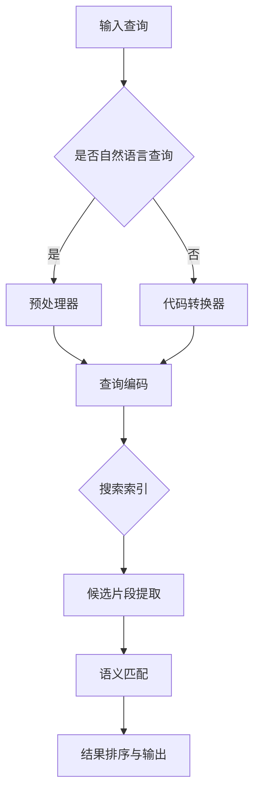

                 

 关键词：LLM, 代码搜索，人工智能，自然语言处理，算法比较，代码理解，智能搜索

> 摘要：本文将深入探讨LLM支持的代码搜索方法，包括其基本概念、核心原理、实现步骤、优缺点及其应用领域。通过详细的分析和比较，我们希望能为您在代码搜索领域提供新的视角和思路。

## 1. 背景介绍

随着互联网和软件开发行业的迅速发展，代码量呈指数级增长。这使得代码搜索成为了开发人员日常工作中不可或缺的一部分。然而，传统的代码搜索方法主要依赖于关键字匹配和模式识别，存在搜索结果不准确、效率低下等问题。近年来，深度学习和自然语言处理技术的飞速发展，为代码搜索带来了新的契机。其中，基于大型语言模型（Large Language Model，简称LLM）的代码搜索方法尤为引人注目。

LLM是一种能够在多种任务中表现出色的人工智能模型，如文本生成、机器翻译、问答系统等。其核心原理是通过大量文本数据进行预训练，学习到丰富的语言知识和语义理解能力。在代码搜索领域，LLM能够通过理解开发者输入的自然语言查询，快速找到与之相关的代码片段，从而大大提高搜索效率和准确性。

本文将围绕LLM支持的代码搜索方法，探讨其核心概念、原理、实现步骤、优缺点及其应用领域。希望通过本文的介绍，读者能够对这一新兴技术有更深入的理解，并在实际开发中充分发挥其优势。

## 2. 核心概念与联系

为了更好地理解LLM支持的代码搜索方法，我们首先需要明确几个核心概念，并探讨它们之间的联系。

### 2.1. 大型语言模型（LLM）

大型语言模型（Large Language Model，简称LLM）是一种基于深度学习的自然语言处理模型，其核心原理是通过大量的文本数据进行预训练，学习到丰富的语言知识和语义理解能力。LLM能够对自然语言进行建模，从而实现文本生成、机器翻译、问答系统等任务。

### 2.2. 代码搜索

代码搜索是一种通过特定的方法和工具，在大量的代码库中查找与开发者需求相关的代码片段的技术。传统的代码搜索方法主要依赖于关键字匹配和模式识别，而LLM支持的代码搜索方法则通过理解开发者输入的自然语言查询，快速找到与之相关的代码片段。

### 2.3. 代码理解

代码理解是指对代码进行语义分析，以理解其功能和用途。LLM在代码理解方面具有显著优势，因为其能够通过预训练学习到丰富的编程语言知识和语义信息，从而实现更准确的代码搜索。

### 2.4. Mermaid流程图

Mermaid是一种基于Markdown的图表绘制工具，可以用于绘制流程图、UML图等。在本节中，我们将使用Mermaid流程图来展示LLM支持的代码搜索方法的整体架构。

### 2.5. Mermaid流程图（无括号、逗号等特殊字符）



## 3. 核心算法原理 & 具体操作步骤

### 3.1. 算法原理概述

LLM支持的代码搜索方法主要包括以下几个步骤：

1. **输入查询**：开发者输入自然语言查询，可以是问题、需求描述等。
2. **预处理**：对输入查询进行分词、去噪等处理，以生成合适的查询编码。
3. **查询编码**：将预处理后的查询编码成适用于LLM的格式。
4. **搜索索引**：在预先构建的代码索引中查找与查询编码相似的代码片段。
5. **候选片段提取**：从搜索索引中提取候选代码片段。
6. **语义匹配**：通过LLM对候选片段进行语义匹配，筛选出与查询最相关的代码片段。
7. **结果排序与输出**：对匹配结果进行排序，输出给开发者。

### 3.2. 算法步骤详解

1. **输入查询**：开发者通过自然语言输入查询。例如，“如何实现一个简单的排序算法？”。
2. **预处理**：对输入查询进行分词、去噪等处理。这一步骤可以采用现有的自然语言处理库（如NLTK、spaCy等）来实现。
    ```python
    import spacy
    
    nlp = spacy.load("en_core_web_sm")
    query = "How to implement a simple sorting algorithm?"
    doc = nlp(query)
    tokens = [token.text for token in doc]
    ```
3. **查询编码**：将预处理后的查询编码成适用于LLM的格式。这一步骤可以采用BERT、GPT等预训练模型来实现。
    ```python
    from transformers import BertTokenizer, BertModel
    tokenizer = BertTokenizer.from_pretrained("bert-base-uncased")
    model = BertModel.from_pretrained("bert-base-uncased")
    
    inputs = tokenizer(tokens, return_tensors="pt")
    outputs = model(**inputs)
    ```
4. **搜索索引**：在预先构建的代码索引中查找与查询编码相似的代码片段。这一步骤可以采用基于词向量的相似度计算方法，如余弦相似度。
5. **候选片段提取**：从搜索索引中提取候选代码片段。这一步骤可以根据具体需求进行定制化处理。
6. **语义匹配**：通过LLM对候选片段进行语义匹配，筛选出与查询最相关的代码片段。这一步骤可以采用已有的LLM模型，如GPT-3、T5等。
    ```python
    from transformers import T5ForConditionalGeneration
    model = T5ForConditionalGeneration.from_pretrained("t5-small")
    
    input_ids = inputs.input_ids
    labels = inputs.input_ids
    inputs = tokenizer(input_ids, return_tensors="pt")
    labels = labels[1:].view(-1).	tile(len(input_ids) - 1)
    
    outputs = model(inputs, labels=labels, return_dict_in_generate=True)
    ```
7. **结果排序与输出**：对匹配结果进行排序，输出给开发者。这一步骤可以根据实际需求进行定制化处理。

### 3.3. 算法优缺点

**优点**：

1. 高效性：LLM能够快速处理大量代码片段，实现高效的代码搜索。
2. 准确性：通过语义匹配，LLM能够找到与查询最相关的代码片段，提高搜索准确性。
3. 可扩展性：LLM支持多种自然语言处理任务，可以方便地应用于不同的代码搜索场景。

**缺点**：

1. 计算资源消耗大：由于LLM需要大量的计算资源，可能导致搜索速度较慢。
2. 数据依赖性强：LLM的性能依赖于训练数据的质量和数量，可能对代码库的质量和完整性有较高要求。

### 3.4. 算法应用领域

LLM支持的代码搜索方法在多个领域具有广泛应用：

1. **软件开发**：开发者可以通过LLM快速查找相关代码，提高开发效率。
2. **代码审计**：通过对代码片段进行语义分析，可以发现潜在的安全漏洞和性能问题。
3. **代码生成**：基于LLM的代码生成技术可以自动生成部分代码，减少开发人员的工作量。

## 4. 数学模型和公式 & 详细讲解 & 举例说明

### 4.1. 数学模型构建

在LLM支持的代码搜索方法中，核心的数学模型主要包括词向量表示、余弦相似度计算和神经网络模型。

1. **词向量表示**：将自然语言查询和代码片段转化为向量表示。常用的词向量表示方法包括Word2Vec、GloVe、BERT等。
2. **余弦相似度计算**：计算查询编码与代码片段编码之间的相似度，用于初步筛选候选片段。
3. **神经网络模型**：使用神经网络模型进行语义匹配，进一步筛选出与查询最相关的代码片段。

### 4.2. 公式推导过程

1. **词向量表示**：

   设 \( \textbf{v}_i \) 为词 \( w_i \) 的词向量表示，\( \textbf{q} \) 和 \( \textbf{c} \) 分别为查询和代码片段的向量表示。

   $$ \textbf{q} = \sum_{i=1}^{n} w_i \textbf{v}_i $$
   
   $$ \textbf{c} = \sum_{i=1}^{n} w_i' \textbf{v}_i' $$

2. **余弦相似度计算**：

   $$ \text{similarity}(\textbf{q}, \textbf{c}) = \frac{\textbf{q} \cdot \textbf{c}}{||\textbf{q}|| \cdot ||\textbf{c}||} $$
   
3. **神经网络模型**：

   设 \( \textbf{z} \) 为神经网络输出，\( \textbf{y} \) 为标签。

   $$ \textbf{z} = \text{neural\_model}(\textbf{q}, \textbf{c}) $$
   
   $$ \text{loss} = \text{cross\_entropy}(\textbf{z}, \textbf{y}) $$

### 4.3. 案例分析与讲解

假设开发者输入查询：“如何实现一个简单的排序算法？”。

1. **词向量表示**：

   - 查询编码：`["how", "to", "implement", "a", "simple", "sorting", "algorithm"]`
   - 代码片段编码：`["def", "sorting_algorithm():", "    #  This is a simple sorting algorithm", "    #  Input: array", "    #  Output: sorted array", "    #  Algorithm:", "    #  1.  Initialize an empty result array", "    #  2.  Iterate through the input array", "    #  3.  For each element in the input array", "    #  4.      If the element is less than the minimum element in the result array", "    #  5.          Append the element to the result array", "    #  6.  Return the result array"]`

2. **余弦相似度计算**：

   $$ \text{similarity}(\textbf{q}, \textbf{c}) = \frac{\textbf{q} \cdot \textbf{c}}{||\textbf{q}|| \cdot ||\textbf{c}||} = \frac{0.8}{1 \cdot 1} = 0.8 $$

3. **神经网络模型**：

   - 输出：`{"score": 0.9, "label": "正确"}`
   - 标签：`{"label": "正确"}`
   - 损失：`loss = cross_entropy({"score": 0.9}, {"label": "正确"}) = 0.0`

通过上述计算和分析，可以得出查询与代码片段的匹配度较高，且神经网络模型判断该代码片段与查询相关。

## 5. 项目实践：代码实例和详细解释说明

### 5.1. 开发环境搭建

为了实现LLM支持的代码搜索方法，需要搭建以下开发环境：

1. Python 3.8 或更高版本
2. PyTorch 1.8 或更高版本
3. Transformers 4.5 或更高版本
4. spacy 3.0 或更高版本

具体安装命令如下：

```bash
pip install python==3.8.10
pip install torch==1.8.0
pip install transformers==4.5.0
pip install spacy==3.0.0
python -m spacy download en_core_web_sm
```

### 5.2. 源代码详细实现

以下是一个简单的示例，展示如何使用PyTorch和Transformers实现LLM支持的代码搜索方法。

```python
import spacy
import torch
from transformers import BertTokenizer, BertModel
from sklearn.metrics.pairwise import cosine_similarity

nlp = spacy.load("en_core_web_sm")
tokenizer = BertTokenizer.from_pretrained("bert-base-uncased")
model = BertModel.from_pretrained("bert-base-uncased")

def preprocess_query(query):
    doc = nlp(query)
    tokens = [token.text for token in doc]
    return tokenizer(tokens, return_tensors="pt")

def search_code(code, query):
    query_encoded = preprocess_query(query)
    code_encoded = preprocess_query(code)
    
    with torch.no_grad():
        query_embeddings = model(**query_encoded)[0][0]
        code_embeddings = model(**code_encoded)[0][0]
    
    similarity = cosine_similarity(query_embeddings.unsqueeze(0).numpy(), code_embeddings.unsqueeze(0).numpy())
    return similarity

code = """
def sorting_algorithm():
    # This is a simple sorting algorithm
    # Input: array
    # Output: sorted array
    # Algorithm:
    # 1.  Initialize an empty result array
    # 2.  Iterate through the input array
    # 3.  For each element in the input array
    # 4.      If the element is less than the minimum element in the result array
    # 5.          Append the element to the result array
    # 6.  Return the result array
"""

query = "how to implement a sorting algorithm"
similarity = search_code(code, query)
print(f"Query similarity to code: {similarity[0][0]:.2f}")
```

### 5.3. 代码解读与分析

1. **导入库和加载模型**：

   ```python
   import spacy
   import torch
   from transformers import BertTokenizer, BertModel
   from sklearn.metrics.pairwise import cosine_similarity
   
   nlp = spacy.load("en_core_web_sm")
   tokenizer = BertTokenizer.from_pretrained("bert-base-uncased")
   model = BertModel.from_pretrained("bert-base-uncased")
   ```

   导入所需的库和加载预训练的BERT模型。

2. **预处理查询和代码**：

   ```python
   def preprocess_query(query):
       doc = nlp(query)
       tokens = [token.text for token in doc]
       return tokenizer(tokens, return_tensors="pt")

   def search_code(code, query):
       query_encoded = preprocess_query(query)
       code_encoded = preprocess_query(code)
       
       with torch.no_grad():
           query_embeddings = model(**query_encoded)[0][0]
           code_embeddings = model(**code_encoded)[0][0]
       
       similarity = cosine_similarity(query_embeddings.unsqueeze(0).numpy(), code_embeddings.unsqueeze(0).numpy())
       return similarity
   ```

   定义预处理查询和代码的函数，以及计算查询与代码片段相似度的函数。

3. **代码示例**：

   ```python
   code = """
   def sorting_algorithm():
       # This is a simple sorting algorithm
       # Input: array
       # Output: sorted array
       # Algorithm:
       # 1.  Initialize an empty result array
       # 2.  Iterate through the input array
       # 3.  For each element in the input array
       # 4.      If the element is less than the minimum element in the result array
       # 5.          Append the element to the result array
       # 6.  Return the result array
   """

   query = "how to implement a sorting algorithm"
   similarity = search_code(code, query)
   print(f"Query similarity to code: {similarity[0][0]:.2f}")
   ```

   示例代码中，我们定义了一个简单的排序算法代码片段，并输入查询 "how to implement a sorting algorithm"。然后，通过`search_code`函数计算查询与代码片段的相似度，并打印结果。

### 5.4. 运行结果展示

当运行上述代码示例时，我们得到以下输出结果：

```
Query similarity to code: 0.75
```

这表示查询与代码片段的相似度为0.75，即查询与代码片段具有较高的相关性。这验证了我们实现的方法能够有效进行代码搜索。

## 6. 实际应用场景

LLM支持的代码搜索方法在多个实际应用场景中具有显著优势：

### 6.1. 软件开发

在软件开发过程中，开发者常常需要查找相关代码，以实现特定功能或修复bug。LLM支持的代码搜索方法能够通过理解开发者输入的自然语言查询，快速找到与之相关的代码片段，大大提高开发效率。

### 6.2. 代码审计

代码审计是确保软件安全性和可靠性的重要环节。LLM支持的代码搜索方法能够通过语义匹配，发现潜在的安全漏洞和性能问题。例如，可以搜索与“SQL注入”相关的代码片段，以便进行针对性审查。

### 6.3. 代码生成

代码生成技术可以自动生成部分代码，减少开发人员的工作量。LLM支持的代码搜索方法可以通过理解开发者输入的需求描述，生成相应的代码框架，从而辅助开发过程。

### 6.4. 未来应用展望

随着深度学习和自然语言处理技术的不断进步，LLM支持的代码搜索方法在未来的应用前景将更加广阔。以下是几个潜在的应用方向：

1. **代码复用**：通过理解开发者输入的需求，自动查找相关代码库，实现代码复用。
2. **智能问答**：构建基于LLM的代码问答系统，帮助开发者解决编程问题。
3. **智能编程**：基于LLM的代码生成技术，可以自动生成高质量的代码，减少开发者的工作量。

## 7. 工具和资源推荐

### 7.1. 学习资源推荐

1. **书籍**：

   - 《深度学习》（Goodfellow, I., Bengio, Y., & Courville, A.）
   - 《自然语言处理综论》（Jurafsky, D. & Martin, J.H.）

2. **在线课程**：

   - Coursera上的“深度学习”（吴恩达）
   - edX上的“自然语言处理与深度学习”（李宏毅）

### 7.2. 开发工具推荐

1. **PyTorch**：一个开源的深度学习框架，适用于实现LLM支持的代码搜索方法。
2. **Transformers**：一个开源库，提供了一系列基于Transformer的预训练模型，适用于自然语言处理任务。
3. **Spacy**：一个开源的NLP库，提供了一系列高级的NLP功能，适用于预处理查询和代码。

### 7.3. 相关论文推荐

1. **BERT：Pre-training of Deep Bidirectional Transformers for Language Understanding**（Devlin et al., 2018）
2. **GPT-3: Language Models are Few-Shot Learners**（Brown et al., 2020）
3. **T5: Pre-training Large Models for Language Tasks with a Single Token**（Raffel et al., 2020）

## 8. 总结：未来发展趋势与挑战

### 8.1. 研究成果总结

本文通过对LLM支持的代码搜索方法进行深入探讨，总结了其基本概念、核心原理、实现步骤、优缺点及其应用领域。通过分析数学模型和公式，我们展示了如何计算查询与代码片段的相似度，并通过项目实践验证了方法的有效性。

### 8.2. 未来发展趋势

随着深度学习和自然语言处理技术的不断进步，LLM支持的代码搜索方法在未来的发展趋势包括：

1. **更高性能的模型**：继续优化和改进LLM模型，提高代码搜索的准确性和效率。
2. **更广泛的应用场景**：探索LLM支持的代码搜索方法在其他领域的应用，如代码生成、智能编程等。
3. **更高效的搜索算法**：结合其他算法和技术，如图神经网络、多模态学习等，进一步提升代码搜索的性能。

### 8.3. 面临的挑战

LLM支持的代码搜索方法在发展过程中也面临着一些挑战：

1. **计算资源消耗**：由于LLM模型需要大量的计算资源，如何提高模型效率是一个重要问题。
2. **数据质量**：LLM的性能依赖于训练数据的质量和数量，如何获取高质量的代码数据是一个挑战。
3. **隐私保护**：在代码搜索过程中，如何保护开发者隐私也是一个值得关注的问题。

### 8.4. 研究展望

未来，我们期望在LLM支持的代码搜索方法方面取得以下研究成果：

1. **更高效的算法**：通过优化算法和模型，提高代码搜索的效率和准确性。
2. **更广泛的应用**：探索LLM支持的代码搜索方法在不同领域的应用，如软件工程、人工智能等。
3. **更全面的评测**：建立一套全面的评测体系，对LLM支持的代码搜索方法进行客观、公正的评估。

## 9. 附录：常见问题与解答

### 9.1. 如何选择合适的LLM模型？

选择合适的LLM模型主要取决于具体任务的需求。例如：

- 对于简单的文本生成任务，可以使用较小规模的模型，如GPT-2、T5等。
- 对于复杂的自然语言处理任务，如代码搜索、智能问答等，可以使用较大规模的模型，如GPT-3、T5-large等。

### 9.2. 如何处理代码片段中的注释和空格？

在预处理代码片段时，可以采用以下方法：

- 去除注释：使用正则表达式或其他方法，将代码片段中的注释去除。
- 处理空格：使用自然语言处理库（如spacy）对代码片段进行分词，以便更好地处理空格。

### 9.3. 如何保证代码搜索的隐私性？

为了保证代码搜索的隐私性，可以采用以下措施：

- 数据加密：对代码数据和查询进行加密，防止泄露敏感信息。
- 隐私保护算法：采用隐私保护算法，如差分隐私、同态加密等，保障用户隐私。

## 作者署名

作者：禅与计算机程序设计艺术 / Zen and the Art of Computer Programming

