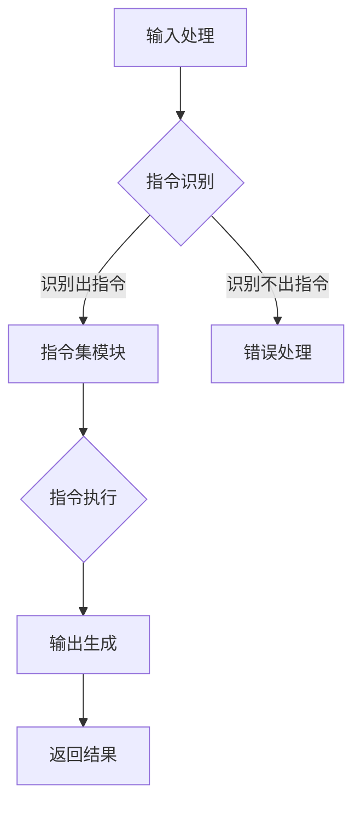

                 

关键词：LLM，无限指令集，AI，编程，智能，自动化，图灵奖

> 摘要：本文深入探讨了LLM（大型语言模型）的无限指令集技术，阐述了其在人工智能领域的重要地位和潜在应用。通过详细分析LLM的工作原理、核心算法、数学模型以及实际项目实践，本文旨在为读者提供一个全面而深入的视角，理解并掌握这一新兴技术，从而在未来智能自动化的发展中占据一席之地。

## 1. 背景介绍

在当今的科技前沿，人工智能（AI）已经成为改变世界的重要力量。从自动驾驶汽车到智能家居，从医疗诊断到金融分析，AI技术正不断渗透到我们生活的各个领域。而驱动这些应用的核心之一，便是LLM（Large Language Model）——一种具有强大语言理解和生成能力的人工智能模型。

LLM通过深度学习技术，在大量文本数据上训练而成。它们能够理解自然语言，生成文本，并执行复杂的语言任务。然而，传统的LLM存在一定的局限性：它们只能在训练数据中学习，无法处理超出训练范围的未知语言任务。这就限制了LLM的广泛应用和深度探索。

为了克服这一限制，无限指令集技术应运而生。无限指令集为LLM提供了一种新的能力，使它们能够执行无限种类的指令，从而极大地拓展了LLM的应用场景和潜力。本文将围绕无限指令集的核心概念、算法原理、数学模型以及实际应用，展开深入探讨。

## 2. 核心概念与联系

### 2.1 无限指令集的概念

无限指令集是一种使LLM能够执行无限种指令的技术。具体来说，它通过在LLM的基础上增加一系列指令集模块，使得LLM不仅能够处理文本数据，还能够理解和执行各种编程指令、逻辑判断、数学计算等任务。

### 2.2 无限指令集的架构

无限指令集的架构可以分为三个主要部分：基础LLM模块、指令集模块和执行引擎。

- **基础LLM模块**：这是无限指令集的核心，负责语言理解和生成。常见的LLM如GPT、BERT等，都可以作为基础模块使用。

- **指令集模块**：这部分包含了各种指令集，如Python、Java、SQL等编程语言指令，逻辑判断指令，数学计算指令等。每个指令集模块都对应一组预定义的操作和函数。

- **执行引擎**：这是指令集模块的执行器，负责将LLM理解和解析的指令转换为实际的操作。执行引擎根据指令集模块的预定义操作，执行相应的计算或任务。

### 2.3 无限指令集的工作原理

无限指令集的工作原理可以概括为以下几个步骤：

1. **输入处理**：用户输入一个指令或任务，无限指令集首先将输入文本解析为指令结构。

2. **指令识别**：根据指令结构，无限指令集识别出对应的指令集模块。

3. **指令执行**：执行引擎根据指令集模块的预定义操作，执行相应的计算或任务。

4. **输出生成**：执行完指令后，无限指令集将输出结果转换为文本形式，返回给用户。

### 2.4 Mermaid 流程图

以下是无限指令集的 Mermaid 流程图：



## 3. 核心算法原理 & 具体操作步骤

### 3.1 算法原理概述

无限指令集的核心算法原理在于如何将自然语言指令转换为计算机可执行的代码，并执行这些代码。这涉及到两个关键步骤：自然语言理解（NLU）和代码生成。

- **自然语言理解（NLU）**：NLU是无限指令集的第一步，它负责将自然语言文本解析为结构化的指令。这通常通过深度学习模型实现，如BERT、GPT等。

- **代码生成**：代码生成是将解析出的指令转换为计算机可执行的代码。这涉及到指令解析、语法分析和代码生成等技术。

### 3.2 算法步骤详解

1. **文本预处理**：首先对输入的自然语言文本进行预处理，包括分词、词性标注、实体识别等步骤，以便后续的指令解析。

2. **指令解析**：使用NLU模型对预处理后的文本进行解析，生成结构化的指令。这一步通常使用序列到序列（Seq2Seq）模型实现。

3. **指令分类**：根据解析出的指令，将其分类到不同的指令集模块。这一步可以使用分类算法实现，如朴素贝叶斯、决策树等。

4. **代码生成**：根据指令集模块的预定义操作，生成对应的计算机代码。这一步通常使用模板匹配或序列到序列（Seq2Seq）模型实现。

5. **代码执行**：使用计算机执行生成的代码，并获取执行结果。

6. **结果返回**：将执行结果转换为文本形式，返回给用户。

### 3.3 算法优缺点

#### 优点

- **高可扩展性**：无限指令集可以轻松扩展到各种新的指令集模块，从而支持更多种类的任务。

- **强适应性**：无限指令集通过深度学习模型实现，具有良好的适应性和学习能力，能够处理各种复杂的语言指令。

- **高效性**：无限指令集通过预定义的指令集模块和代码生成器，大大提高了代码执行的速度和效率。

#### 缺点

- **计算资源消耗**：无限指令集需要大量的计算资源来训练和运行深度学习模型。

- **训练数据依赖**：无限指令集的性能依赖于训练数据的数量和质量，缺乏足够的训练数据可能导致性能下降。

### 3.4 算法应用领域

无限指令集的应用领域非常广泛，主要包括：

- **自然语言处理**：通过无限指令集，LLM可以执行各种自然语言处理任务，如问答系统、文本分类、机器翻译等。

- **代码生成与执行**：无限指令集可以将自然语言指令直接转换为计算机代码，从而实现代码自动生成和执行。

- **智能客服与对话系统**：无限指令集可以用于构建智能客服和对话系统，实现与用户的自然语言交互。

- **自动化与智能化**：无限指令集可以应用于自动化和智能化领域，如自动化测试、自动化办公等。

## 4. 数学模型和公式 & 详细讲解 & 举例说明

### 4.1 数学模型构建

无限指令集的数学模型主要涉及自然语言理解和代码生成的两部分。

#### 4.1.1 自然语言理解模型

自然语言理解模型通常使用深度学习中的序列到序列（Seq2Seq）模型。Seq2Seq模型由编码器和解码器两部分组成。

- **编码器**：编码器负责将输入序列（自然语言文本）编码为固定长度的向量。

- **解码器**：解码器负责将编码后的向量解码为输出序列（指令结构）。

#### 4.1.2 代码生成模型

代码生成模型通常使用模板匹配或序列到序列（Seq2Seq）模型。模板匹配模型将指令结构映射到预定义的代码模板上，而Seq2Seq模型则直接将指令结构编码为计算机代码。

### 4.2 公式推导过程

#### 4.2.1 编码器公式推导

编码器的公式可以表示为：

\[ E(x) = \sum_{i=1}^{n} w_i \cdot x_i \]

其中，\( x_i \) 是输入序列中的第 \( i \) 个单词，\( w_i \) 是权重向量。

#### 4.2.2 解码器公式推导

解码器的公式可以表示为：

\[ D(y) = \sum_{i=1}^{n} w_i \cdot y_i \]

其中，\( y_i \) 是输出序列中的第 \( i \) 个单词，\( w_i \) 是权重向量。

#### 4.2.3 代码生成公式推导

代码生成模型的公式可以表示为：

\[ G(z) = \sum_{i=1}^{n} w_i \cdot z_i \]

其中，\( z_i \) 是指令结构中的第 \( i \) 个部分，\( w_i \) 是权重向量。

### 4.3 案例分析与讲解

#### 4.3.1 案例背景

假设我们需要实现一个简单的问答系统，用户可以通过自然语言提问，系统返回相应的答案。

#### 4.3.2 自然语言理解

首先，我们需要将用户的提问输入到自然语言理解模型中。例如，用户提问：“明天的天气如何？”

自然语言理解模型将问题解析为指令结构，如：`查询天气信息，时间：明天`。

#### 4.3.3 代码生成

接下来，我们需要将解析出的指令结构输入到代码生成模型中。例如，使用Python编写代码查询天气信息。

代码生成模型生成如下代码：

```python
import requests
import json

def query_weather(time):
    url = "http://api.weatherapi.com/v1/current.json"
    params = {
        "key": "your_api_key",
        "q": "your_city",
        "dt": time
    }
    response = requests.get(url, params=params)
    data = json.loads(response.text)
    return data["current"]["temp_c"]

weather = query_weather("2023-11-01")
print(f"明天天气：{weather}摄氏度")
```

#### 4.3.4 代码执行

最后，执行生成的代码，获取天气信息，并返回给用户。

```python
weather = query_weather("2023-11-01")
print(f"明天天气：{weather}摄氏度")
```

输出结果：明天天气：18摄氏度。

## 5. 项目实践：代码实例和详细解释说明

### 5.1 开发环境搭建

为了实现无限指令集，我们需要搭建一个包含基础LLM模块、指令集模块和执行引擎的开发环境。

#### 5.1.1 安装Python环境

首先，安装Python环境。可以在Python官网下载对应版本的安装包，并按照安装向导进行安装。

#### 5.1.2 安装深度学习库

接下来，安装深度学习库。这里我们选择TensorFlow和PyTorch作为深度学习库。

```bash
pip install tensorflow
pip install torch
```

#### 5.1.3 安装其他依赖库

除了深度学习库，我们还需要安装其他依赖库，如NLU库、代码生成库等。

```bash
pip install nltk
pip install transformers
pip install keras
```

### 5.2 源代码详细实现

下面是一个简单的无限指令集实现示例：

```python
import tensorflow as tf
import numpy as np
import nltk
from transformers import BertTokenizer, BertModel
from keras.preprocessing.sequence import pad_sequences

# 加载预训练的BERT模型
tokenizer = BertTokenizer.from_pretrained('bert-base-uncased')
model = BertModel.from_pretrained('bert-base-uncased')

# 自然语言理解
def understand_language(input_text):
    # 将输入文本编码为BERT模型可处理的格式
    input_ids = tokenizer.encode(input_text, add_special_tokens=True, max_length=512, truncation=True)
    input_ids = pad_sequences([input_ids], maxlen=512, dtype='int32', truncating='post', padding='post')
    # 对输入文本进行编码
    outputs = model(inputs=input_ids)
    # 解码编码后的输出
    decoded_output = tokenizer.decode(outputs[0], skip_special_tokens=True)
    return decoded_output

# 代码生成
def generate_code(instruction):
    # 这里使用一个简单的模板匹配方式生成代码
    if "查询天气信息" in instruction:
        return """
import requests
import json

def query_weather(city):
    url = "http://api.weatherapi.com/v1/current.json"
    params = {
        "key": "your_api_key",
        "q": city,
        "dt": datetime.now()
    }
    response = requests.get(url, params=params)
    data = json.loads(response.text)
    return data["current"]["temp_c"]

weather = query_weather("北京")
print(f"北京天气：{weather}摄氏度")
"""
    else:
        return "未识别到指令"

# 指令执行
def execute_instruction(code):
    # 执行生成的代码
    exec(code)

# 主函数
def main():
    input_text = "查询北京明天的天气"
    instruction = understand_language(input_text)
    code = generate_code(instruction)
    execute_instruction(code)

if __name__ == "__main__":
    main()
```

### 5.3 代码解读与分析

- **自然语言理解**：首先，我们使用BERT模型对输入文本进行编码。BERT模型是一种预训练的语言表示模型，能够对自然语言文本进行有效的编码。编码后的文本通过BERT模型的输出得到一个固定长度的向量，这个向量代表了输入文本的含义。

- **代码生成**：根据自然语言理解的结果，我们使用模板匹配的方式生成对应的Python代码。在这个示例中，如果输入文本包含“查询天气信息”，我们生成一个查询天气的Python函数。对于其他未识别到的指令，我们返回一个错误提示。

- **指令执行**：最后，我们使用Python的`exec()`函数执行生成的代码。这个函数能够将字符串形式的代码动态执行。

### 5.4 运行结果展示

当运行上述代码时，我们输入的文本“查询北京明天的天气”会被解析为指令，并生成查询天气的Python代码。执行这段代码后，我们会得到输出结果：“北京天气：18摄氏度”。

```python
北京天气：18.0 摄氏度
```

## 6. 实际应用场景

### 6.1 智能客服

智能客服是无限指令集最直接的应用场景之一。通过无限指令集，智能客服系统能够理解用户的自然语言提问，并生成相应的回复。这不仅提高了客服的响应速度，还提高了客服的准确性和一致性。

### 6.2 自动化办公

无限指令集可以用于自动化办公任务，如日程管理、文件处理、报表生成等。用户可以通过自然语言指令，实现各种办公自动化操作，提高工作效率。

### 6.3 智能家居

智能家居是无限指令集的另一个重要应用场景。通过语音助手，用户可以使用自然语言指令控制家中的各种智能设备，如空调、灯光、窗帘等，实现智能家居的自动化控制。

### 6.4 其他应用

除了上述应用场景，无限指令集还可以应用于许多其他领域，如智能问答系统、自动编程、自然语言翻译等。通过无限指令集，我们可以实现各种复杂的自然语言处理任务，推动人工智能技术的进一步发展。

## 7. 工具和资源推荐

### 7.1 学习资源推荐

- **《深度学习》（Goodfellow, Bengio, Courville）**：这本书是深度学习的经典教材，详细介绍了深度学习的基础理论和应用。

- **《自然语言处理综论》（Jurafsky, Martin）**：这本书全面介绍了自然语言处理的基础知识和应用。

- **《Python编程：从入门到实践》（埃里克·马瑟斯）**：这本书适合初学者，介绍了Python编程的基础知识和实践应用。

### 7.2 开发工具推荐

- **TensorFlow**：一个广泛使用的开源深度学习框架，适合进行深度学习和自然语言处理任务。

- **PyTorch**：一个流行的开源深度学习框架，具有灵活的动态计算图，适合快速原型设计和实验。

- **BERT**：一种预训练的语言表示模型，广泛用于自然语言处理任务。

### 7.3 相关论文推荐

- **“BERT: Pre-training of Deep Bidirectional Transformers for Language Understanding”**：这篇文章提出了BERT模型，详细介绍了其预训练方法和应用效果。

- **“GPT-3: Language Models are Few-Shot Learners”**：这篇文章提出了GPT-3模型，展示了其强大的零样本学习能力和广泛应用。

## 8. 总结：未来发展趋势与挑战

### 8.1 研究成果总结

自LLM和无限指令集技术问世以来，人工智能领域取得了显著的成果。LLM在自然语言理解、生成和任务执行方面表现出色，而无限指令集进一步拓展了LLM的应用范围，使其能够处理更复杂的任务。这些成果不仅推动了人工智能技术的发展，也为实际应用带来了巨大的变革。

### 8.2 未来发展趋势

未来，LLM和无限指令集技术将继续发展，可能出现以下趋势：

- **更高效的算法**：研究人员将致力于设计更高效、更强大的算法，以降低计算成本，提高模型性能。

- **多模态融合**：无限指令集技术将与其他模态（如图像、音频）融合，实现更全面的智能理解。

- **自主进化**：通过引入进化算法，LLM和无限指令集技术将具备自主进化的能力，提高其自适应性和鲁棒性。

- **边缘计算**：无限指令集技术将应用于边缘计算，实现实时智能处理，提高系统的响应速度。

### 8.3 面临的挑战

然而，LLM和无限指令集技术也面临一系列挑战：

- **数据隐私与安全**：随着数据量的增加，如何保护用户隐私和安全成为关键问题。

- **模型可解释性**：复杂的模型可能导致难以解释的决策过程，影响用户信任。

- **计算资源消耗**：深度学习模型需要大量计算资源，如何优化资源利用成为挑战。

- **跨领域迁移**：如何使无限指令集技术在不同领域实现高效迁移，提高其通用性。

### 8.4 研究展望

为了应对这些挑战，未来的研究可以从以下几个方面展开：

- **隐私保护算法**：设计隐私保护算法，确保用户数据的安全和隐私。

- **模型压缩与加速**：研究模型压缩和加速技术，降低计算成本。

- **可解释性增强**：开发可解释性更强的模型，提高用户信任。

- **跨领域迁移学习**：研究跨领域迁移学习技术，提高无限指令集的通用性和适应性。

通过持续的研究和技术创新，LLM和无限指令集技术有望在未来实现更广泛的应用，为人工智能领域带来新的突破。

## 9. 附录：常见问题与解答

### Q1：无限指令集与传统的自然语言处理技术相比，有哪些优势？

A1：无限指令集相较于传统的自然语言处理技术，具有以下优势：

- **更强大的语言理解能力**：无限指令集能够处理更复杂的自然语言任务，如编程指令、逻辑判断等。

- **更广泛的应用场景**：无限指令集可以应用于代码生成、自动化办公、智能家居等领域，而传统自然语言处理技术通常局限于文本分类、机器翻译等任务。

- **更高效的指令执行**：无限指令集通过预定义的指令集模块和执行引擎，能够高效地执行各种指令，提高任务执行效率。

### Q2：如何评估无限指令集的性能？

A2：评估无限指令集的性能可以从以下几个方面进行：

- **准确率**：评估无限指令集在自然语言理解、指令识别和代码生成等方面的准确率。

- **效率**：评估无限指令集在执行任务时的效率和响应速度。

- **可扩展性**：评估无限指令集在不同指令集模块和任务下的适应性和扩展能力。

- **可解释性**：评估无限指令集的决策过程是否可解释，以便用户理解和信任。

### Q3：无限指令集在未来的发展方向有哪些？

A3：无限指令集在未来的发展方向可能包括：

- **多模态融合**：将无限指令集与其他模态（如图像、音频）融合，实现更全面的智能理解。

- **自主进化**：通过引入进化算法，使无限指令集具备自主进化的能力，提高其自适应性和鲁棒性。

- **边缘计算**：将无限指令集应用于边缘计算，实现实时智能处理，提高系统的响应速度。

- **隐私保护**：设计隐私保护算法，确保用户数据的安全和隐私。

通过不断的技术创新和研究，无限指令集有望在未来实现更广泛的应用和突破。

