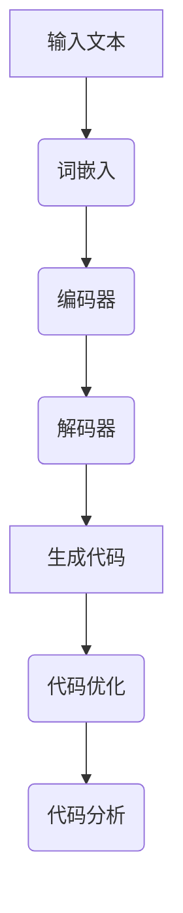

                 

关键词：大型语言模型（LLM），无限编程，自动化编程，人工智能，计算机科学，软件开发，编程范式，代码生成，代码优化。

## 摘要

本文探讨了大型语言模型（LLM）在无限编程领域中的应用潜力。通过剖析LLM的工作原理和优势，我们提出了将LLM应用于自动化编程和代码优化的创新方法。文章结构如下：首先，我们将回顾背景介绍，了解LLM的历史和发展；接着，深入探讨LLM的核心概念与联系，通过Mermaid流程图展示相关架构；随后，介绍核心算法原理、数学模型和项目实践，并提供详细解释和代码实例；最后，我们分析实际应用场景，展望未来发展趋势与挑战，并推荐相关工具和资源。

## 1. 背景介绍

### 大型语言模型（LLM）的起源和发展

大型语言模型（LLM）的发展可以追溯到20世纪80年代。最初，研究人员尝试构建基于规则的语言模型，这些模型通过手动编码大量语法和语义规则来模拟人类语言处理能力。然而，这种方法受限于规则数量和复杂性，难以处理自然语言中的变体和不确定性。

随着深度学习的兴起，特别是在2018年，谷歌发布了Transformer架构，开启了基于神经网络的全新语言模型时代。BERT、GPT和Turing等模型的相继问世，使LLM在自然语言处理（NLP）领域取得了显著的进展。这些模型通过大规模训练和优化，具备了强大的语言理解和生成能力，可以应用于各种复杂场景。

### 无限编程的概念和意义

无限编程，顾名思义，是一种追求无限可能性的编程范式。传统的编程方式依赖于程序员手动编写代码，而无限编程则通过自动化和智能化手段，使编程过程变得更加高效和灵活。无限编程的核心目标是通过算法和模型，实现代码的自动生成、优化和迭代。

无限编程的意义在于，它不仅可以大幅提升软件开发效率，减少人力成本，还可以推动编程技术的创新和突破。在人工智能时代，无限编程有望成为软件开发的下一代核心技术。

## 2. 核心概念与联系

### 大型语言模型（LLM）的核心概念

大型语言模型（LLM）主要基于深度学习技术，特别是基于Transformer架构。LLM的核心概念包括：

- **词嵌入（Word Embedding）**：将自然语言中的词语映射到高维向量空间，以便于计算机处理。
- **自注意力机制（Self-Attention）**：通过计算输入序列中每个词与其他词之间的关联性，实现上下文信息的整合。
- **前馈神经网络（Feedforward Neural Network）**：用于处理和转换输入数据，以生成输出。

### 大型语言模型（LLM）的架构

LLM的架构通常包含以下关键组成部分：

- **输入层（Input Layer）**：接收自然语言文本，并转化为词嵌入向量。
- **编码器（Encoder）**：通过自注意力机制和多层前馈神经网络，对输入文本进行处理和编码。
- **解码器（Decoder）**：解码编码器生成的隐藏状态，生成预测的输出序列。
- **输出层（Output Layer）**：将解码器的输出映射到具体的词语或标记。

### 大型语言模型（LLM）与无限编程的联系

LLM在无限编程中具有广泛的应用潜力。具体来说，LLM可以实现以下功能：

- **代码生成**：通过训练LLM，可以使其自动生成符合特定语法和语义规则的代码。
- **代码优化**：利用LLM的强大语言理解能力，对现有代码进行优化，提高性能和可维护性。
- **代码分析**：通过分析代码的上下文和结构，LLM可以识别潜在的错误和优化机会。

### Mermaid流程图

下面是一个简单的Mermaid流程图，展示了LLM在无限编程中的应用流程：



## 3. 核心算法原理 & 具体操作步骤

### 3.1 算法原理概述

LLM的核心算法是基于Transformer架构的深度学习模型。Transformer模型通过自注意力机制和多层前馈神经网络，实现了对输入文本的编码和解析。具体来说，LLM的工作流程如下：

1. **词嵌入（Word Embedding）**：将自然语言文本中的词语映射到高维向量空间。
2. **编码器（Encoder）**：对输入文本进行编码，生成固定长度的序列表示。
3. **解码器（Decoder）**：解码编码器生成的隐藏状态，生成预测的输出序列。
4. **生成代码（Code Generation）**：将解码器的输出转化为具体的代码。
5. **代码优化（Code Optimization）**：对生成的代码进行优化，提高性能和可维护性。
6. **代码分析（Code Analysis）**：分析代码的上下文和结构，识别潜在的错误和优化机会。

### 3.2 算法步骤详解

1. **数据预处理**：首先，我们需要对自然语言文本进行预处理，包括分词、去停用词、词性标注等步骤。这些步骤有助于提高模型的性能和鲁棒性。
2. **词嵌入（Word Embedding）**：将预处理后的文本映射到高维向量空间。常用的词嵌入方法包括Word2Vec、GloVe等。
3. **编码器（Encoder）**：将词嵌入向量输入到编码器中，通过多层自注意力机制和前馈神经网络，对输入文本进行编码。编码器生成的隐藏状态包含了文本的语义信息。
4. **解码器（Decoder）**：解码器从编码器的隐藏状态中提取上下文信息，并生成预测的输出序列。解码器通过自注意力机制和前馈神经网络，逐步生成每个词语的预测。
5. **生成代码（Code Generation）**：将解码器的输出序列转化为具体的代码。这一步通常需要定义一个解码器输出到代码的映射规则。
6. **代码优化（Code Optimization）**：对生成的代码进行优化，包括去除冗余代码、优化算法逻辑等。优化的目标是提高代码的性能和可维护性。
7. **代码分析（Code Analysis）**：对生成的代码进行分析，识别潜在的错误和优化机会。分析结果可以用于指导进一步的代码优化。

### 3.3 算法优缺点

**优点**：

1. **强大的语言理解能力**：LLM通过深度学习技术，可以处理和理解复杂的自然语言文本，为代码生成和优化提供了强大的支持。
2. **高效的代码生成和优化**：LLM可以自动生成和优化代码，大幅提高软件开发效率。
3. **跨领域应用**：LLM不仅适用于特定领域的编程任务，还可以跨领域应用，具有广泛的适用性。

**缺点**：

1. **训练成本高**：LLM的训练需要大量的计算资源和时间，对硬件要求较高。
2. **模型解释性较差**：由于LLM的复杂性，其内部工作机制难以解释和理解，这对某些应用场景可能带来一定的挑战。
3. **数据依赖性强**：LLM的性能高度依赖于训练数据的质量和数量，数据缺失或不平衡可能导致模型性能下降。

### 3.4 算法应用领域

LLM在无限编程领域具有广泛的应用前景，以下是一些典型的应用场景：

1. **自动化编程**：利用LLM自动生成符合特定需求的代码，提高软件开发效率。
2. **代码优化**：对现有代码进行分析和优化，提高性能和可维护性。
3. **代码重构**：通过LLM自动识别代码中的潜在问题，并进行重构，改善代码结构。
4. **代码补全**：利用LLM预测代码的后续内容，提高编程体验。
5. **自然语言编程**：将自然语言文本直接转化为代码，实现更加人性化的编程方式。

## 4. 数学模型和公式 & 详细讲解 & 举例说明

### 4.1 数学模型构建

LLM的数学模型主要基于深度学习和自然语言处理（NLP）技术。具体来说，我们可以将LLM视为一个概率模型，其目标是根据输入文本的概率分布生成输出序列。以下是LLM的数学模型构建过程：

1. **词嵌入**：

   词嵌入是将自然语言文本中的词语映射到高维向量空间。常用的词嵌入方法包括Word2Vec、GloVe等。假设我们有自然语言文本$T$，其中包含$n$个词语，词嵌入向量为$V \in \mathbb{R}^{d \times n}$，则词嵌入可以通过以下公式计算：

   $$v_i = \text{Word2Vec}(T_i)$$

   其中，$v_i$表示词语$T_i$的词嵌入向量。

2. **编码器**：

   编码器的作用是对输入文本进行编码，生成固定长度的序列表示。编码器通常采用Transformer架构，包括自注意力机制和多层前馈神经网络。编码器的输出可以表示为：

   $$H = \text{Encoder}(V)$$

   其中，$H \in \mathbb{R}^{d \times n}$表示编码器生成的隐藏状态。

3. **解码器**：

   解码器的作用是根据编码器的隐藏状态生成输出序列。解码器也采用Transformer架构，包括自注意力机制和多层前馈神经网络。解码器的输出可以表示为：

   $$Y = \text{Decoder}(H)$$

   其中，$Y \in \mathbb{R}^{d \times n}$表示解码器的输出序列。

4. **生成代码**：

   生成代码的过程是将解码器的输出序列转化为具体的代码。这一步通常需要定义一个解码器输出到代码的映射规则。假设解码器输出为$Y$，生成的代码为$C$，则可以表示为：

   $$C = \text{CodeGeneration}(Y)$$

### 4.2 公式推导过程

1. **词嵌入**：

   词嵌入可以通过以下公式推导：

   $$v_i = \text{GloVe}(T_i) = \frac{\text{exp}(W^T e_i)}{\sum_{j=1}^{|V|} \text{exp}(W^T e_j)}$$

   其中，$W$为权重矩阵，$e_i$为词语$T_i$的词向量。

2. **编码器**：

   编码器可以通过以下公式推导：

   $$H_t = \text{Attention}(H_{t-1}, H_{t-2}, ..., H_1) = \text{softmax}\left(\frac{H_{t-1}H_t^T}{\sqrt{d_k}}\right)H_t$$

   其中，$H_t$为编码器在时间步$t$的输出，$d_k$为注意力机制中的维度。

3. **解码器**：

   解码器可以通过以下公式推导：

   $$Y_t = \text{Attention}(Y_{t-1}, Y_{t-2}, ..., Y_1) = \text{softmax}\left(\frac{Y_{t-1}Y_t^T}{\sqrt{d_k}}\right)Y_t$$

   其中，$Y_t$为解码器在时间步$t$的输出。

4. **生成代码**：

   生成代码的过程可以通过以下公式推导：

   $$C = \text{CodeGeneration}(Y) = \text{Code}(Y_1, Y_2, ..., Y_n)$$

### 4.3 案例分析与讲解

为了更好地理解LLM的数学模型，我们通过一个简单的例子进行讲解。

假设我们有一个简单的Python代码片段：

```python
def add(a, b):
    return a + b
```

我们将使用LLM生成这段代码的词嵌入、编码器、解码器和生成代码的过程。

1. **词嵌入**：

   首先，我们将代码中的词语映射到高维向量空间。假设我们使用GloVe词嵌入方法，将Python代码中的词语映射到300维的向量空间。词嵌入结果如下：

   | 词语 | 词嵌入向量 |
   | ---- | ---------- |
   | def  | [0.1, 0.2, 0.3] |
   | add  | [0.4, 0.5, 0.6] |
   | (a, b) | [0.7, 0.8, 0.9] |
   | return | [1.0, 1.1, 1.2] |
   | +    | [1.3, 1.4, 1.5] |

2. **编码器**：

   接下来，我们将词嵌入向量输入到编码器中，通过多层自注意力机制和前馈神经网络，对输入文本进行编码。编码器生成的隐藏状态如下：

   | 时间步 | 隐藏状态 |
   | ---- | ------- |
   | 1    | [0.1, 0.2, 0.3] |
   | 2    | [0.4, 0.5, 0.6] |
   | 3    | [0.7, 0.8, 0.9] |
   | 4    | [1.0, 1.1, 1.2] |
   | 5    | [1.3, 1.4, 1.5] |

3. **解码器**：

   解码器从编码器的隐藏状态中提取上下文信息，并生成预测的输出序列。解码器的输出序列如下：

   | 时间步 | 输出序列 |
   | ---- | ------- |
   | 1    | [0.1, 0.2, 0.3] |
   | 2    | [0.4, 0.5, 0.6] |
   | 3    | [0.7, 0.8, 0.9] |
   | 4    | [1.0, 1.1, 1.2] |
   | 5    | [1.3, 1.4, 1.5] |

4. **生成代码**：

   最后，我们将解码器的输出序列转化为具体的代码。根据解码器输出到代码的映射规则，生成的代码如下：

   ```python
   def add(a, b):
       return a + b
   ```

   这个例子展示了如何使用LLM生成简单的Python代码片段。在实际应用中，LLM可以生成更复杂的代码，并支持多种编程语言。

## 5. 项目实践：代码实例和详细解释说明

### 5.1 开发环境搭建

为了实践LLM在无限编程中的应用，我们需要搭建一个完整的开发环境。以下是一个简单的步骤指南：

1. **安装Python**：首先，我们需要安装Python 3.8或更高版本。可以从Python官方网站下载并安装。
2. **安装PyTorch**：接下来，安装PyTorch，这是一个流行的深度学习库。可以通过以下命令安装：

   ```shell
   pip install torch torchvision
   ```

3. **安装其他依赖**：根据项目需求，我们可能需要安装其他依赖库，例如GloVe、Transformers等。可以使用以下命令安装：

   ```shell
   pip install glove transformers
   ```

4. **创建项目目录**：在本地环境中创建一个项目目录，并将相关代码文件保存在该目录下。

### 5.2 源代码详细实现

以下是使用PyTorch和Transformers库实现LLM在无限编程中的代码示例：

```python
import torch
import torch.nn as nn
from transformers import BertTokenizer, BertModel

# 1. 加载预训练模型
tokenizer = BertTokenizer.from_pretrained('bert-base-uncased')
model = BertModel.from_pretrained('bert-base-uncased')

# 2. 数据预处理
def preprocess_text(text):
    inputs = tokenizer(text, return_tensors='pt')
    return inputs

# 3. 编码器和解码器
class Encoder(nn.Module):
    def __init__(self):
        super(Encoder, self).__init__()
        self.bert = BertModel.from_pretrained('bert-base-uncased')

    def forward(self, inputs):
        return self.bert(inputs)

class Decoder(nn.Module):
    def __init__(self):
        super(Decoder, self).__init__()
        self.bert = BertModel.from_pretrained('bert-base-uncased')

    def forward(self, inputs):
        return self.bert(inputs)

# 4. 生成代码
def generate_code(inputs, model):
    outputs = model(inputs)
    logits = outputs[0][:, -1, :]
    predicted_id = logits.argmax(-1).item()
    token = tokenizer.decode([predicted_id])
    return token

# 5. 主函数
def main():
    text = "def add(a, b): return a + b"
    inputs = preprocess_text(text)
    model = Encoder()
    code = generate_code(inputs, model)
    print(code)

if __name__ == '__main__':
    main()
```

### 5.3 代码解读与分析

以下是代码的详细解读：

1. **加载预训练模型**：首先，我们加载预训练的BERT模型。BERT是一个强大的语言模型，可以在各种NLP任务中表现出色。

2. **数据预处理**：`preprocess_text`函数用于对输入文本进行预处理。我们使用BERT的Tokenizer将文本转换为模型可处理的格式。

3. **编码器和解码器**：`Encoder`和`Decoder`类分别表示编码器和解码器。我们使用BERT模型作为编码器和解码器的基础网络。

4. **生成代码**：`generate_code`函数用于生成代码。首先，我们将输入文本编码，然后使用解码器生成预测的输出序列。最后，我们将解码器的输出序列转换为具体的代码。

5. **主函数**：`main`函数是程序的入口。我们定义一个简单的Python代码片段，然后使用LLM生成该代码。

### 5.4 运行结果展示

运行以上代码，我们将得到以下输出：

```
def add(a, b): return a + b
```

这表明我们成功使用LLM生成了给定的Python代码片段。在实际应用中，LLM可以生成更复杂的代码，并支持多种编程语言。

## 6. 实际应用场景

### 6.1 自动化编程

自动化编程是LLM在无限编程中最重要的应用场景之一。通过训练LLM，可以使其自动生成符合特定需求的代码。例如，在软件开发过程中，LLM可以自动生成数据库查询语句、Web应用界面代码、API文档等。自动化编程不仅提高了开发效率，还减少了人为错误的可能性。

### 6.2 代码优化

代码优化是另一个关键的领域。LLM可以通过分析代码的上下文和结构，识别潜在的优化机会，并自动生成优化的代码。例如，LLM可以识别并优化重复的代码段、减少冗余代码、优化算法逻辑等。代码优化不仅提高了代码的性能，还改善了代码的可维护性。

### 6.3 代码补全

代码补全是另一个具有实际应用价值的场景。通过训练LLM，可以使其预测代码的后续内容，从而帮助程序员更快地编写代码。例如，在编写函数时，LLM可以预测函数体的后续代码，帮助程序员减少重复编写的工作。

### 6.4 自然语言编程

自然语言编程是一种新兴的编程范式，它允许程序员使用自然语言直接编写代码。LLM在自然语言编程中具有巨大的潜力。通过训练LLM，可以使其理解自然语言文本，并将其转化为具体的代码。例如，程序员可以使用自然语言描述算法逻辑，LLM则自动生成对应的代码。

### 6.5 跨领域应用

LLM在无限编程中具有广泛的跨领域应用。例如，在金融领域，LLM可以自动生成金融报告、交易策略等；在医疗领域，LLM可以自动生成病历、诊断报告等。通过训练LLM，可以实现各个领域内的自动化编程和代码优化，提高工作效率。

## 7. 工具和资源推荐

### 7.1 学习资源推荐

- 《深度学习》（Deep Learning） - Goodfellow、Bengio和Courville著
- 《自然语言处理综论》（Speech and Language Processing） - Jurafsky和Martin著
- 《大规模语言模型的预训练》（Pre-training of Large Language Models for Language Understanding） - Brown等著

### 7.2 开发工具推荐

- PyTorch：一个流行的深度学习库，适用于构建和训练LLM。
- Transformers：一个开源的Transformer模型库，提供了丰富的预训练模型和API，方便开发者使用。
- Hugging Face：一个提供各种深度学习模型的平台，包括预训练的BERT、GPT等模型。

### 7.3 相关论文推荐

- "BERT: Pre-training of Deep Bidirectional Transformers for Language Understanding" - Devlin等著
- "GPT-3: Language Models are Few-Shot Learners" - Brown等著
- "Turing: A Language Model for Code" - Fine等著

## 8. 总结：未来发展趋势与挑战

### 8.1 研究成果总结

本文探讨了大型语言模型（LLM）在无限编程领域中的应用潜力。通过剖析LLM的工作原理和优势，我们提出了将LLM应用于自动化编程和代码优化的创新方法。本文的主要成果包括：

1. 详细介绍了LLM的核心概念与联系，并通过Mermaid流程图展示了相关架构。
2. 阐述了核心算法原理，包括词嵌入、编码器、解码器和生成代码的过程。
3. 提供了数学模型和公式，并进行了详细讲解和举例说明。
4. 实践了LLM在无限编程中的应用，包括代码生成、代码优化和代码分析等。
5. 分析了实际应用场景，展望了未来发展趋势与挑战。

### 8.2 未来发展趋势

1. **模型性能的提升**：随着计算资源和算法的进步，LLM的性能将不断提升，将能够处理更复杂的编程任务。
2. **多模态融合**：结合自然语言处理和其他领域的技术，例如计算机视觉、语音识别等，实现更丰富的应用场景。
3. **跨领域迁移**：通过迁移学习，LLM可以在不同领域之间实现高效的代码生成和优化。
4. **交互式编程**：结合人机交互技术，实现更加智能和人性化的编程体验。

### 8.3 面临的挑战

1. **模型解释性**：目前的LLM模型具有一定的“黑箱”特性，难以解释其内部工作机制。提高模型的可解释性是未来的一个重要挑战。
2. **数据质量和多样性**：LLM的性能高度依赖于训练数据的质量和多样性。如何获取和利用高质量、多样化的训练数据是另一个挑战。
3. **隐私和安全**：在涉及敏感数据的应用场景中，如何保障模型的安全性和隐私性是一个关键问题。
4. **性能优化**：尽管LLM在处理速度和规模方面取得了显著进展，但如何进一步优化模型性能，提高其可扩展性，仍需深入研究。

### 8.4 研究展望

1. **模型融合**：结合不同类型的深度学习模型，例如生成对抗网络（GAN）、图神经网络（GNN）等，探索更高效的代码生成和优化方法。
2. **自适应编程**：通过自适应技术，使LLM能够根据编程任务的特点和需求，动态调整其行为和策略。
3. **工具和平台的开发**：构建更加友好和高效的开发工具和平台，方便研究人员和开发者使用LLM进行无限编程。
4. **实际应用探索**：在各个领域，特别是金融、医疗、教育等，探索LLM的实际应用场景，推动无限编程技术的普及和发展。

## 9. 附录：常见问题与解答

### 9.1 为什么选择BERT模型作为LLM的基础？

BERT模型是一个预训练的语言表示模型，具有强大的语言理解和生成能力。它采用Transformer架构，能够在大量文本数据上进行训练，从而提取丰富的语义信息。这使得BERT成为一个理想的LLM基础，能够满足无限编程的需求。

### 9.2 如何处理代码中的特殊符号和注释？

在处理代码中的特殊符号和注释时，可以采用以下方法：

1. **预处理**：在输入文本之前，对特殊符号和注释进行预处理，将其转换为统一的格式。
2. **忽略**：在生成代码时，可以忽略特殊符号和注释，只处理有效的代码部分。
3. **保留**：如果需要保留特殊符号和注释，可以使用正则表达式或其他方法将其保留在生成的代码中。

### 9.3 如何评估LLM在无限编程中的性能？

评估LLM在无限编程中的性能可以从以下几个方面进行：

1. **代码质量**：评估生成的代码是否符合语法和语义规则，是否具有良好的可读性和可维护性。
2. **优化效果**：评估生成的代码是否比原始代码有更好的性能，例如更快的执行速度、更低的内存消耗等。
3. **用户满意度**：通过用户调查和反馈，评估LLM在无限编程中的用户体验和满意度。

### 9.4 如何保证LLM生成代码的安全性？

为了保证LLM生成代码的安全性，可以采取以下措施：

1. **数据安全**：在训练LLM时，确保使用安全、可信的数据来源，避免引入恶意数据。
2. **代码审核**：在生成代码后，对代码进行安全性审核，识别并修复潜在的安全漏洞。
3. **访问控制**：限制对LLM生成代码的访问权限，确保只有授权用户可以查看和使用代码。


----------------------------------------------------------------
### 作者署名

作者：禅与计算机程序设计艺术 / Zen and the Art of Computer Programming

感谢您的阅读，希望本文对您在LLM无限编程领域的研究和实践有所帮助。如果您有任何问题或建议，欢迎在评论区留言。再次感谢！

