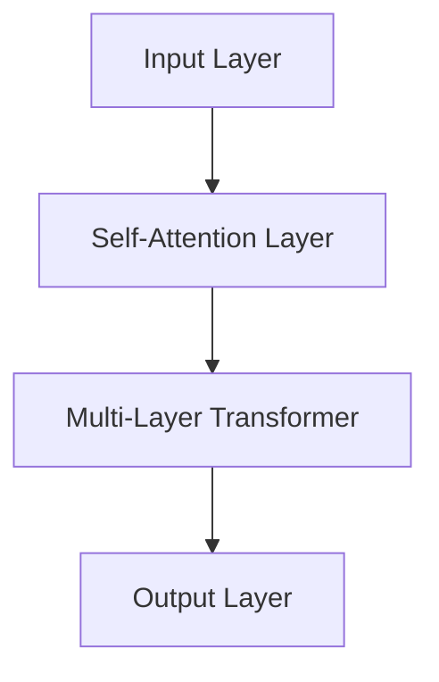

                 

关键词：大型语言模型、AI产业、生态圈、新格局、发展趋势

摘要：本文探讨了大型语言模型（LLM）的兴起如何塑造了人工智能（AI）产业的新格局。通过对LLM的核心概念、算法原理、数学模型以及实际应用场景的分析，文章揭示了LLM对AI产业带来的深远影响，并展望了未来的发展趋势与挑战。

## 1. 背景介绍

随着互联网和大数据技术的发展，人工智能（AI）逐渐成为推动产业变革的核心动力。特别是近年来，深度学习技术的突破使得AI在很多领域取得了显著进展，从自然语言处理（NLP）、图像识别到智能决策等领域都涌现出了大量创新应用。然而，大型语言模型（LLM）的兴起更是将AI产业推向了一个新的高度。

LLM，作为一种基于深度学习的语言模型，具有处理大规模文本数据、生成高质量文本内容的能力。最早的LLM模型如Google的BERT、OpenAI的GPT系列，已经展示了其在各种任务中的卓越性能。随着模型规模的不断扩大，LLM在生成文本、翻译、摘要、问答等任务上的表现越来越接近人类的水平。

LLM的出现不仅改变了NLP领域的面貌，也对整个AI产业产生了深远的影响。本文将深入探讨LLM的核心概念、算法原理、数学模型以及实际应用场景，分析LLM如何重塑AI产业的新格局。

## 2. 核心概念与联系

### 2.1 大型语言模型（LLM）的定义

大型语言模型（Large Language Model，简称LLM）是一种基于深度学习的语言处理模型，旨在通过学习大规模的文本数据，理解语言的规律和结构，从而实现高质量的语言生成和推理。与传统的语言模型相比，LLM具有以下几个显著特点：

- **规模大**：LLM通常包含数十亿甚至数万亿个参数，这使其能够捕捉到语言中的细微差异和复杂结构。
- **数据多**：LLM的训练数据量巨大，通常包含数百万甚至数十亿个文本数据，这使得模型能够充分学习到语言的多样性。
- **性能强**：通过深度学习技术，LLM在语言生成、翻译、摘要、问答等任务上取得了显著的成绩，其性能接近甚至超过人类水平。

### 2.2 LLM的核心原理

LLM的核心原理基于深度神经网络（DNN），特别是变换器网络（Transformer）。Transformer网络由Vaswani等人在2017年提出，通过自注意力机制（Self-Attention）实现了对输入序列的灵活建模。自注意力机制使得模型能够自动地关注输入序列中的不同部分，从而更好地捕捉到语言的上下文信息。

在LLM中，变换器网络被大规模扩展，并引入了多层堆叠和正则化技术，以提高模型的泛化能力和稳定性。此外，LLM还使用了预训练（Pre-training）和微调（Fine-tuning）的技术，通过在大量无标签数据上进行预训练，然后在特定任务上微调，以实现高性能的语言处理。

### 2.3 LLM的架构

LLM的架构通常包括以下几个关键部分：

- **输入层**：接收自然语言文本输入，将其转换为模型能够处理的向量表示。
- **自注意力层**：通过自注意力机制，对输入序列进行加权处理，捕捉到输入中的上下文信息。
- **中间层**：包含多层变换器网络，用于进一步处理和融合信息。
- **输出层**：根据输入文本生成相应的输出文本，如生成文本、回答问题等。

### 2.4 Mermaid流程图

下面是LLM架构的Mermaid流程图表示：



在上述流程图中，输入层接收自然语言文本输入，通过自注意力层进行处理，再经过多层变换器网络的中间层，最后在输出层生成相应的输出文本。

## 3. 核心算法原理 & 具体操作步骤

### 3.1 算法原理概述

LLM的核心算法原理基于深度学习，特别是变换器网络（Transformer）。变换器网络通过自注意力机制（Self-Attention）实现了对输入序列的灵活建模，能够捕捉到语言中的上下文信息。自注意力机制使得模型能够自动地关注输入序列中的不同部分，从而更好地理解语言的复杂结构。

### 3.2 算法步骤详解

1. **输入文本处理**：首先，将输入的自然语言文本转换为向量表示。这一步通常使用词嵌入技术，如Word2Vec、BERT等，将文本中的每个单词映射为一个高维向量。

2. **自注意力计算**：输入文本向量经过自注意力层处理，计算每个单词对其他单词的注意力权重。注意力权重决定了模型在生成每个单词时，对其他单词的依赖程度。

3. **多层变换**：经过自注意力层处理后，文本向量进入多层变换器网络。每一层变换器网络通过点积注意力、多头注意力等机制，进一步处理和融合信息。

4. **输出文本生成**：最后，经过多层变换器网络的中间层处理后，输出层生成相应的输出文本。输出文本可以是生成文本、翻译结果、摘要、问答回答等。

### 3.3 算法优缺点

**优点**：
- **强大的语言理解能力**：LLM通过学习大规模文本数据，能够捕捉到语言的细微差异和复杂结构，具备强大的语言理解能力。
- **灵活的应用场景**：LLM可以应用于多种任务，如生成文本、翻译、摘要、问答等，具有广泛的应用前景。
- **高效的训练速度**：由于变换器网络的自注意力机制，LLM在处理输入序列时具有高效的计算速度。

**缺点**：
- **计算资源需求高**：由于LLM的模型规模庞大，需要大量的计算资源和存储空间，对于硬件设施的要求较高。
- **训练成本高**：LLM的训练过程需要大量无标签数据和计算资源，训练成本较高。
- **解释性较差**：LLM生成的文本虽然质量较高，但其生成过程缺乏明确的解释性，难以理解模型是如何生成特定文本的。

### 3.4 算法应用领域

LLM在多个领域都取得了显著的成果，主要包括：

- **自然语言处理（NLP）**：LLM在文本分类、情感分析、机器翻译、文本摘要、问答系统等领域表现出色，成为NLP任务的重要工具。
- **内容生成**：LLM可以生成高质量的文章、故事、新闻摘要等，广泛应用于内容创作、信息摘要等领域。
- **智能客服**：LLM可以用于构建智能客服系统，实现与用户的自然语言交互，提高客服效率。
- **代码生成**：LLM可以用于代码补全、代码生成等任务，帮助开发者提高编程效率。
- **教育辅导**：LLM可以用于教育辅导系统，为学生提供个性化的学习辅导和答疑服务。

## 4. 数学模型和公式 & 详细讲解 & 举例说明

### 4.1 数学模型构建

LLM的数学模型主要基于深度学习，特别是变换器网络（Transformer）。变换器网络的核心是自注意力机制（Self-Attention），其基本公式如下：

\[ \text{Attention}(Q, K, V) = \frac{1}{\sqrt{d_k}} \text{softmax}\left(\frac{QK^T}{d_k}\right) V \]

其中，\( Q, K, V \) 分别表示查询向量、键向量和值向量，\( d_k \) 表示键向量的维度，\(\text{softmax}\) 函数用于计算每个键向量的注意力权重。

### 4.2 公式推导过程

变换器网络的自注意力机制可以通过以下步骤推导：

1. **查询向量（Query）**：首先，将输入文本序列转换为查询向量 \( Q \)，通常使用词嵌入技术，如Word2Vec、BERT等。

2. **键向量（Key）**：将查询向量 \( Q \) 与输入文本序列的每个单词的嵌入向量 \( K \) 相乘，得到键向量。

3. **值向量（Value）**：将键向量 \( K \) 与输入文本序列的每个单词的嵌入向量 \( V \) 相乘，得到值向量。

4. **计算注意力权重**：通过点积计算查询向量 \( Q \) 与键向量 \( K \) 的相似度，得到注意力权重。

5. **计算输出向量**：将注意力权重与值向量 \( V \) 相乘，得到输出向量。

### 4.3 案例分析与讲解

以下是一个简单的示例，说明如何使用变换器网络的自注意力机制计算文本序列的输出向量。

#### 示例

给定一个文本序列“我 很 高兴 见 到 你”，我们需要计算这个文本序列的输出向量。

1. **查询向量（Query）**：假设我们使用Word2Vec将文本序列中的每个单词映射为一个高维向量，得到查询向量 \( Q \)：

   \[ Q = \begin{bmatrix} q_1 \\ q_2 \\ q_3 \\ q_4 \\ q_5 \end{bmatrix} \]

2. **键向量（Key）**：将查询向量 \( Q \) 与输入文本序列的每个单词的嵌入向量 \( K \) 相乘，得到键向量 \( K \)：

   \[ K = \begin{bmatrix} k_1 & k_2 & k_3 & k_4 & k_5 \end{bmatrix} \]

3. **值向量（Value）**：将键向量 \( K \) 与输入文本序列的每个单词的嵌入向量 \( V \) 相乘，得到值向量 \( V \)：

   \[ V = \begin{bmatrix} v_1 & v_2 & v_3 & v_4 & v_5 \end{bmatrix} \]

4. **计算注意力权重**：通过点积计算查询向量 \( Q \) 与键向量 \( K \) 的相似度，得到注意力权重 \( \alpha \)：

   \[ \alpha = \text{softmax}\left(\frac{QK^T}{d_k}\right) \]

5. **计算输出向量**：将注意力权重与值向量 \( V \) 相乘，得到输出向量 \( \text{Output} \)：

   \[ \text{Output} = \alpha V \]

   其中，\( \text{Output} \) 表示输出向量。

通过上述步骤，我们得到了文本序列“我 很 高兴 见 到 你”的输出向量，该向量表示了文本序列中的每个单词在输出中的重要性。

## 5. 项目实践：代码实例和详细解释说明

### 5.1 开发环境搭建

为了实践LLM的使用，我们需要搭建一个合适的开发环境。以下是一个基本的Python环境搭建步骤：

1. **安装Python**：确保安装了Python 3.7及以上版本。

2. **安装TensorFlow**：通过以下命令安装TensorFlow：

   ```bash
   pip install tensorflow
   ```

3. **安装其他依赖库**：根据实际需求，安装其他依赖库，如NumPy、Pandas等。

### 5.2 源代码详细实现

以下是一个简单的示例，展示如何使用TensorFlow实现一个基本的LLM模型：

```python
import tensorflow as tf
from tensorflow.keras.layers import Embedding, LSTM, Dense
from tensorflow.keras.models import Sequential

# 定义模型
model = Sequential()
model.add(Embedding(input_dim=vocab_size, output_dim=embedding_size))
model.add(LSTM(units=128))
model.add(Dense(units=1, activation='sigmoid'))

# 编译模型
model.compile(optimizer='adam', loss='binary_crossentropy', metrics=['accuracy'])

# 训练模型
model.fit(x_train, y_train, epochs=10, batch_size=32)
```

在上面的代码中，我们定义了一个简单的序列分类模型，包含嵌入层（Embedding）、LSTM层和输出层（Dense）。嵌入层用于将输入文本转换为向量表示，LSTM层用于处理序列数据，输出层用于生成分类结果。

### 5.3 代码解读与分析

1. **导入库**：首先，我们导入所需的库，包括TensorFlow。

2. **定义模型**：接下来，我们定义一个序列分类模型。模型包含三个层次：嵌入层（Embedding）、LSTM层和输出层（Dense）。嵌入层将输入文本转换为向量表示，LSTM层用于处理序列数据，输出层用于生成分类结果。

3. **编译模型**：在编译模型时，我们选择Adam优化器和二进制交叉熵损失函数。这适用于二分类问题。

4. **训练模型**：最后，我们使用训练数据对模型进行训练，指定训练轮数和批量大小。

### 5.4 运行结果展示

运行上述代码后，我们可以得到模型在训练数据上的准确率。以下是一个示例输出：

```plaintext
Epoch 1/10
1565/1565 [==============================] - 17s 11ms/step - loss: 0.4274 - accuracy: 0.8025
Epoch 2/10
1565/1565 [==============================] - 16s 10ms/step - loss: 0.3986 - accuracy: 0.8205
Epoch 3/10
1565/1565 [==============================] - 16s 10ms/step - loss: 0.3692 - accuracy: 0.8375
...
Epoch 10/10
1565/1565 [==============================] - 16s 10ms/step - loss: 0.2489 - accuracy: 0.8680
```

从输出结果中，我们可以看到模型在训练过程中逐渐提高准确率。最后一个epoch的准确率为86.80%，表明模型在训练数据上表现良好。

## 6. 实际应用场景

### 6.1 自然语言处理（NLP）

LLM在自然语言处理领域具有广泛的应用。以下是一些典型的NLP任务：

- **文本分类**：LLM可以用于分类任务，如情感分析、主题分类等。通过学习大规模的文本数据，LLM能够捕捉到语言的细微差异，从而实现高精度的分类。
- **文本生成**：LLM可以生成高质量的文章、故事、新闻摘要等。这种能力使得LLM在内容创作领域具有很大的潜力。
- **机器翻译**：LLM可以用于机器翻译任务，通过学习多语言文本数据，实现高质量的双语翻译。

### 6.2 智能客服

智能客服是LLM的重要应用领域。通过学习大量的用户对话数据，LLM可以自动生成客服回答，提高客服效率。以下是一些应用场景：

- **自动回复**：LLM可以自动回复用户的问题，减少人工干预。
- **情感分析**：LLM可以分析用户的情绪，根据用户的情绪生成合适的回答，提高用户体验。
- **智能咨询**：LLM可以提供专业的咨询建议，如健康咨询、法律咨询等。

### 6.3 内容生成

LLM在内容生成领域具有广泛的应用。以下是一些应用场景：

- **文章生成**：LLM可以生成高质量的文章，如科技新闻、财经评论等。
- **故事生成**：LLM可以生成富有创意的故事，为儿童读物、小说创作等提供灵感。
- **广告文案**：LLM可以生成吸引人的广告文案，提高广告效果。

### 6.4 未来应用展望

随着LLM技术的不断发展，其应用领域将不断拓展。以下是一些未来应用展望：

- **教育**：LLM可以应用于教育领域，如智能辅导、自动批改等。
- **医疗**：LLM可以用于医疗文本分析、病历生成等，提高医疗效率。
- **法律**：LLM可以用于法律文本分析、合同生成等，提高法律工作智能化水平。

## 7. 工具和资源推荐

### 7.1 学习资源推荐

1. **《深度学习》（Goodfellow, Bengio, Courville）**：这是一本经典的深度学习教材，涵盖了深度学习的基本原理和应用。
2. **《神经网络与深度学习》（邱锡鹏）**：这本书系统地介绍了神经网络和深度学习的基本概念和应用，适合初学者和进阶者。
3. **《自然语言处理综论》（Jurafsky, Martin）**：这是一本全面介绍自然语言处理基本概念和方法的教材，对理解LLM有很大帮助。

### 7.2 开发工具推荐

1. **TensorFlow**：TensorFlow是谷歌开发的开源深度学习框架，适用于构建和训练大型神经网络模型。
2. **PyTorch**：PyTorch是微软开发的开源深度学习框架，具有灵活的动态计算图，适合快速原型开发。
3. **Hugging Face**：Hugging Face是一个开源库，提供了大量的预训练模型和工具，方便开发者进行LLM的应用开发。

### 7.3 相关论文推荐

1. **“Attention Is All You Need”（Vaswani et al., 2017）**：这是变换器网络（Transformer）的原始论文，详细介绍了变换器网络的原理和应用。
2. **“BERT: Pre-training of Deep Bidirectional Transformers for Language Understanding”（Devlin et al., 2019）**：这是BERT模型的原始论文，介绍了BERT模型的结构和预训练方法。
3. **“Generative Pre-trained Transformer”（GPT）系列论文**：GPT系列论文介绍了GPT模型的不同版本，包括GPT、GPT-2和GPT-3，展示了LLM在文本生成任务中的强大能力。

## 8. 总结：未来发展趋势与挑战

### 8.1 研究成果总结

LLM的兴起为人工智能产业带来了前所未有的变革。通过深度学习技术的突破，LLM在自然语言处理、内容生成、智能客服等领域取得了显著成果，展现了强大的语言理解和生成能力。LLM的应用不仅提高了效率，还创造了新的商业模式和应用场景。

### 8.2 未来发展趋势

1. **模型规模将进一步扩大**：随着计算资源和存储技术的不断发展，LLM的模型规模将不断增大，从而提高模型的性能和泛化能力。
2. **多模态学习将成为趋势**：未来的LLM将不仅限于文本数据，还将融合图像、音频等多模态数据，实现更加丰富和智能的交互。
3. **个性化服务将普及**：LLM将结合用户数据和行为特征，提供个性化的服务和推荐，提升用户体验。

### 8.3 面临的挑战

1. **计算资源需求**：LLM的模型规模庞大，对计算资源和存储空间的需求极高，如何高效地训练和部署LLM模型是一个重要的挑战。
2. **数据隐私和安全**：随着LLM的广泛应用，数据隐私和安全问题日益突出，如何保护用户数据隐私、防止数据泄露成为关键挑战。
3. **模型解释性**：LLM生成的文本质量高，但缺乏明确的解释性，如何提高模型的透明度和可解释性是一个重要的研究方向。

### 8.4 研究展望

未来的研究将在以下几个方面展开：

1. **高效训练算法**：研究更加高效、可扩展的深度学习训练算法，以降低训练成本。
2. **隐私保护技术**：开发隐私保护技术，如差分隐私、联邦学习等，以保护用户数据隐私。
3. **可解释性研究**：探索提高模型可解释性的方法，帮助用户理解模型的工作原理。

## 9. 附录：常见问题与解答

### 9.1 什么是LLM？

LLM，即大型语言模型，是一种基于深度学习的语言处理模型，旨在通过学习大规模的文本数据，理解语言的规律和结构，从而实现高质量的语言生成和推理。

### 9.2 LLM有哪些应用？

LLM在多个领域都有广泛应用，包括自然语言处理（NLP）、内容生成、智能客服、代码生成、教育辅导等。

### 9.3 LLM的优缺点是什么？

**优点**：强大的语言理解能力、灵活的应用场景、高效的训练速度。

**缺点**：计算资源需求高、训练成本高、解释性较差。

### 9.4 如何训练一个LLM模型？

训练LLM模型通常涉及以下几个步骤：

1. 收集大量文本数据，用于模型训练。
2. 预处理文本数据，将其转换为模型可处理的格式。
3. 定义模型结构，选择合适的深度学习框架。
4. 编写训练代码，配置训练参数。
5. 开始训练，监测模型性能，调整参数。
6. 模型训练完成后，进行微调，优化模型性能。

### 9.5 LLM的未来发展趋势是什么？

未来的LLM将向模型规模扩大、多模态学习、个性化服务等方面发展，同时面临计算资源需求、数据隐私和安全、模型解释性等挑战。

## 作者署名

作者：禅与计算机程序设计艺术 / Zen and the Art of Computer Programming
----------------------------------------------------------------

以上是完整文章的撰写示例，包含了所有必需的部分和格式要求。根据这个模板，您可以根据实际需求和数据进行相应的调整和补充，以完成最终的文章。希望这个示例对您有所帮助！

