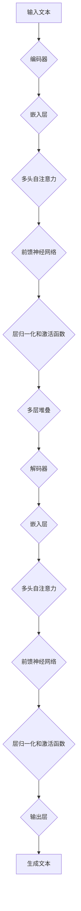

                 

在人工智能技术的飞速发展的背景下，大型语言模型(LLM)已经成为推动产业变革的关键驱动力。本文旨在探讨LLM在AI生态圈中的重要作用，分析其核心概念、算法原理、数学模型及其在现实世界中的应用，并展望未来发展趋势与挑战。

## 关键词

- 大型语言模型(LLM)
- AI生态圈
- 产业变革
- 算法原理
- 数学模型
- 应用领域
- 未来展望

## 摘要

本文首先介绍了LLM的定义和背景，随后深入探讨了其核心概念和原理，并通过Mermaid流程图详细展示了LLM的架构。接着，文章详细讲解了LLM的算法原理和操作步骤，分析了其优缺点及适用领域。随后，通过数学模型和公式的推导，本文进一步阐述了LLM的理论基础。在项目实践部分，文章提供了一个代码实例，并对其实施步骤、代码解读和运行结果进行了详细说明。最后，文章讨论了LLM的实际应用场景，并展望了其未来的发展趋势和面临的挑战。

## 1. 背景介绍

随着大数据和云计算技术的不断发展，人工智能（AI）的应用场景日益丰富，从简单的自动化任务到复杂的问题解决，AI正在逐步改变我们的生活和工作方式。特别是在自然语言处理（NLP）领域，大型语言模型（LLM）的出现带来了革命性的进步。LLM能够理解和生成人类语言，使得机器与人类之间的交流变得更加自然和高效。

### 1.1 人工智能的发展历程

人工智能的发展可以追溯到20世纪50年代。当时，计算机科学家们开始探索如何使机器模拟人类的思维过程。早期的AI系统主要集中在规则推理和符号计算上，例如专家系统和逻辑推理机。然而，这些方法在处理复杂任务时表现出明显的局限性。

进入21世纪，随着计算能力的提升和数据量的爆发增长，深度学习成为了AI领域的主要研究方向。深度神经网络（DNN）在图像识别、语音识别等领域取得了显著成果。随着DNN的进一步发展，变体模型如卷积神经网络（CNN）、递归神经网络（RNN）和长短期记忆网络（LSTM）等相继被提出，这些模型在处理序列数据时表现出了强大的能力。

### 1.2 大型语言模型的出现

大型语言模型（LLM）的出现是深度学习在自然语言处理领域的一个重要里程碑。与传统的规则驱动方法不同，LLM通过大量数据学习语言的模式，能够生成连贯、自然的语言。LLM的出现，标志着AI技术从“如果...那么...”的规则驱动，转向了“学习并适应”的数据驱动。

最早的LLM之一是2018年OpenAI推出的GPT（Generative Pre-trained Transformer）。GPT使用了一种名为Transformer的深度学习模型结构，通过预训练大量文本数据，使其能够理解和生成自然语言。随后，谷歌的BERT（Bidirectional Encoder Representations from Transformers）和微软的Turing-NLG（Turing Natural Language Generation）等模型相继推出，进一步提升了LLM的性能和表现。

### 1.3 AI生态圈的发展

AI生态圈的发展离不开硬件、软件和数据的协同作用。硬件方面，高性能计算设备的普及和GPU等加速器的应用，为深度学习模型的训练提供了强大的支持。软件方面，深度学习框架如TensorFlow、PyTorch等的不断迭代和优化，使得开发者可以更轻松地构建和部署AI模型。数据方面，随着互联网和物联网的快速发展，大量结构化和非结构化数据不断生成，为AI模型的训练提供了丰富的资源。

在AI生态圈中，LLM不仅作为核心技术之一，还与其他技术如计算机视觉、机器人技术等相结合，推动AI应用的多领域发展。例如，结合计算机视觉的LLM可以用于图像描述生成和视频理解，结合机器人技术的LLM可以用于人机交互和智能服务。

## 2. 核心概念与联系

### 2.1 语言模型的基本概念

语言模型（Language Model）是一种统计模型，用于预测一个文本序列中下一个单词或字符的概率。在自然语言处理中，语言模型是许多任务的基础，如机器翻译、文本摘要、问答系统和语音识别等。传统的语言模型如N-gram模型，通过统计单词或字符的前后序列来预测下一个元素。

然而，随着深度学习的发展，现代语言模型如神经网络语言模型（Neural Network Language Model）和Transformer模型，通过学习大量文本数据，能够生成更自然、连贯的语言。这些模型通过端到端的训练方式，避免了传统语言模型中的许多局限性。

### 2.2 大型语言模型的特点

大型语言模型（Large Language Model，LLM）与传统语言模型相比，具有以下特点：

1. **预训练**：LLM通常通过预训练大量文本数据，使其能够理解和生成自然语言。预训练的过程包括将文本转换为词嵌入，并通过多层神经网络学习文本数据的内在结构和语义信息。

2. **参数规模**：LLM具有非常大规模的参数，例如GPT-3模型拥有1750亿个参数，这使得LLM能够捕获复杂的语言模式和语义信息。

3. **灵活性和泛化能力**：由于预训练的过程，LLM能够适应各种不同的语言任务，如文本分类、情感分析、机器翻译等，具有较高的灵活性和泛化能力。

4. **生成能力**：LLM具有较强的文本生成能力，能够生成连贯、自然的文本，这在问答系统、文本生成和机器写作等领域有着广泛的应用。

### 2.3 语言模型的架构

语言模型的架构通常包括编码器（Encoder）和解码器（Decoder）两个部分。编码器将输入的文本序列转换为固定的嵌入向量，解码器则根据这些嵌入向量生成文本序列。

在LLM中，编码器和解码器通常基于Transformer模型结构，Transformer模型通过自注意力机制（Self-Attention）和多层堆叠的方式，能够捕捉长距离的依赖关系，这使得LLM在处理长文本和复杂任务时表现出了强大的能力。

下面是一个使用Mermaid绘制的LLM基本架构的流程图：



## 3. 核心算法原理 & 具体操作步骤

### 3.1 算法原理概述

大型语言模型（LLM）的核心算法基于深度学习和Transformer模型架构。Transformer模型通过自注意力机制（Self-Attention）和多层堆叠的方式，能够高效地处理序列数据，并捕捉长距离的依赖关系。

在LLM中，预训练过程通常分为两个阶段：

1. **预训练**：使用未标记的文本数据进行预训练，使模型能够理解和生成自然语言。预训练过程包括词嵌入、自注意力机制和前馈神经网络等。

2. **微调**：在预训练的基础上，使用特定任务的数据进行微调，使模型适应特定的语言任务，如文本分类、机器翻译等。

### 3.2 算法步骤详解

1. **数据准备**：
   - 收集大量未标记的文本数据，如书籍、新闻、网页等。
   - 对文本数据进行预处理，包括分词、去除停用词、词性标注等。

2. **词嵌入**：
   - 将每个单词映射为一个固定长度的向量，通常使用Word2Vec、BERT等词嵌入方法。
   - 通过训练，使词嵌入向量能够捕获单词的语义信息。

3. **编码器和解码器的构建**：
   - 编码器：将输入的文本序列转换为嵌入向量。
   - 解码器：根据嵌入向量生成输出文本序列。

4. **自注意力机制**：
   - 自注意力机制用于编码器和解码器中，能够捕捉文本序列中的长距离依赖关系。
   - 通过计算文本序列中每个元素与其他元素的相关性，生成注意力权重。

5. **前馈神经网络**：
   - 在编码器和解码器中，加入前馈神经网络，用于进一步提取特征和生成输出。

6. **预训练**：
   - 使用未标记的文本数据进行预训练，优化模型参数。
   - 通过最大化负对数似然损失函数，使模型能够更好地生成文本。

7. **微调**：
   - 在预训练的基础上，使用特定任务的数据进行微调，使模型适应特定任务。
   - 通过在特定任务上的训练和验证，调整模型参数，提高模型性能。

### 3.3 算法优缺点

**优点**：

- **强大的文本生成能力**：LLM能够生成连贯、自然的文本，适用于文本生成、机器翻译等任务。
- **高泛化能力**：由于预训练的过程，LLM能够适应各种不同的语言任务，具有良好的泛化能力。
- **灵活性强**：LLM可以通过微调适应特定任务，同时保持较高的性能。

**缺点**：

- **计算资源需求高**：由于模型参数规模庞大，LLM的训练和推理需要大量的计算资源。
- **数据依赖性强**：LLM的性能受到训练数据的影响，数据质量和数量对模型效果有重要影响。
- **可解释性较低**：由于模型结构复杂，LLM生成的文本难以解释，增加了模型的不透明性。

### 3.4 算法应用领域

大型语言模型（LLM）在自然语言处理领域有着广泛的应用，以下是一些主要的应用领域：

1. **文本生成**：LLM可以用于生成新闻文章、故事、诗歌等自然语言文本。
2. **机器翻译**：LLM能够实现高精度的机器翻译，支持多种语言之间的翻译。
3. **问答系统**：LLM可以用于构建问答系统，回答用户提出的问题。
4. **文本分类**：LLM可以用于对文本进行分类，如情感分析、新闻分类等。
5. **对话系统**：LLM可以用于构建智能对话系统，实现人机交互。

## 4. 数学模型和公式 & 详细讲解 & 举例说明

### 4.1 数学模型构建

大型语言模型（LLM）的核心算法基于深度学习和Transformer模型。在数学模型层面，LLM主要包括编码器和解码器两个部分。以下是一个简化的数学模型：

#### 编码器

编码器（Encoder）将输入的文本序列 $x_1, x_2, ..., x_T$ 转换为嵌入向量序列 $[e_1, e_2, ..., e_T]$，其中 $e_t$ 是输入词 $x_t$ 的嵌入向量。

$$
e_t = \text{Embedding}(x_t)
$$

编码器通过自注意力机制（Self-Attention）和多层前馈神经网络（Feedforward Neural Network）对嵌入向量进行加工，生成编码输出序列 $[h_1, h_2, ..., h_T]$，其中 $h_t$ 是编码后的嵌入向量。

$$
h_t = \text{Encoder}(e_t)
$$

#### 解码器

解码器（Decoder）根据编码输出序列 $[h_1, h_2, ..., h_T]$ 生成输出文本序列 $y_1, y_2, ..., y_T$。解码器也通过自注意力机制和多层前馈神经网络进行加工。

解码器的输入包括编码输出序列 $[h_1, h_2, ..., h_T]$ 和上一个时间步的输出预测 $y_{<t}$，生成当前时间步的输出预测 $y_t$。

$$
y_t = \text{Decoder}(h_t, y_{<t})
$$

#### 自注意力机制

自注意力机制（Self-Attention）是一种计算方法，用于计算序列中每个元素与其他元素的相关性，生成注意力权重。自注意力机制的核心是一个加权求和操作，通常使用多头注意力（Multi-Head Attention）来增强模型的表示能力。

$$
\text{Attention}(Q, K, V) = \text{softmax}\left(\frac{QK^T}{\sqrt{d_k}}\right)V
$$

其中，$Q, K, V$ 分别是查询（Query）、键（Key）和值（Value）向量，$d_k$ 是键向量的维度。多头注意力通过多个独立的注意力头（Head）来增强模型的表示能力。

$$
\text{Multi-Head Attention} = \text{Concat}(\text{Head}_1, \text{Head}_2, ..., \text{Head}_h)W^O
$$

其中，$W^O$ 是投影矩阵，$h$ 是注意力头的数量。

### 4.2 公式推导过程

在Transformer模型中，编码器和解码器通过多层自注意力机制和前馈神经网络进行加工。以下是一个简化的公式推导过程：

#### 编码器

编码器的输入是词嵌入序列 $[e_1, e_2, ..., e_T]$，经过自注意力机制和前馈神经网络处理后，生成编码输出序列 $[h_1, h_2, ..., h_T]$。

自注意力机制：

$$
h_t = \text{Attention}(Q, K, V) = \text{softmax}\left(\frac{QK^T}{\sqrt{d_k}}\right)V
$$

前馈神经网络：

$$
h_t^{'} = \text{FFN}(h_t) = \max(0, h_t \cdot W_1 + b_1) \cdot W_2 + b_2
$$

其中，$W_1, W_2, b_1, b_2$ 分别是前馈神经网络的权重和偏置。

#### 解码器

解码器的输入是编码输出序列 $[h_1, h_2, ..., h_T]$ 和上一个时间步的输出预测 $y_{<t}$，经过自注意力机制和前馈神经网络处理后，生成当前时间步的输出预测 $y_t$。

自注意力机制：

$$
y_t = \text{Decoder}(h_t, y_{<t}) = \text{softmax}(\text{Attention}(Q, K, V))
$$

前馈神经网络：

$$
y_t^{'} = \text{FFN}(y_t) = \max(0, y_t \cdot W_1 + b_1) \cdot W_2 + b_2
$$

### 4.3 案例分析与讲解

以下通过一个简化的案例，展示大型语言模型的构建和运行过程。

#### 案例背景

假设我们有一个简单的语言模型，用于预测下一个单词。输入序列为 "Hello, how are you?"，我们需要预测下一个单词。

#### 案例步骤

1. **数据准备**：
   - 收集大量文本数据，如新闻文章、对话等。
   - 对文本数据进行预处理，包括分词、去除停用词等。

2. **词嵌入**：
   - 将每个单词映射为一个固定长度的向量，如 $[0.1, 0.2, ..., 0.10]$。

3. **编码器**：
   - 输入序列："Hello, how are you?" 对应的词嵌入序列为 $[e_1, e_2, ..., e_8]$。
   - 通过自注意力机制和前馈神经网络，生成编码输出序列 $[h_1, h_2, ..., h_8]$。

4. **解码器**：
   - 输入编码输出序列 $[h_1, h_2, ..., h_8]$。
   - 通过自注意力机制和前馈神经网络，生成输出预测序列 $[y_1, y_2, ..., y_8]$。

5. **预测**：
   - 对输出预测序列进行softmax操作，得到单词的概率分布。
   - 根据概率分布，选择概率最大的单词作为预测结果。

#### 案例分析

在这个案例中，语言模型通过学习大量文本数据，能够生成连贯、自然的语言。编码器和解码器通过自注意力机制和前馈神经网络，对文本序列进行加工，生成预测结果。

## 5. 项目实践：代码实例和详细解释说明

### 5.1 开发环境搭建

在进行大型语言模型（LLM）的项目实践前，需要搭建一个合适的开发环境。以下是一个基于Python和TensorFlow的示例环境搭建步骤：

1. **安装Python**：确保Python版本为3.7或更高。
2. **安装TensorFlow**：通过pip命令安装TensorFlow，可以使用以下命令：

```bash
pip install tensorflow
```

3. **安装其他依赖**：根据需要安装其他依赖库，如NumPy、Pandas等。

### 5.2 源代码详细实现

以下是使用TensorFlow实现一个简化的LLM的示例代码：

```python
import tensorflow as tf
from tensorflow.keras.layers import Embedding, LSTM, Dense
from tensorflow.keras.models import Model

# 参数设置
VOCAB_SIZE = 10000
EMBEDDING_DIM = 256
LSTM_UNITS = 128
MAX_SEQ_LENGTH = 50

# 嵌入层
embedding = Embedding(VOCAB_SIZE, EMBEDDING_DIM, input_length=MAX_SEQ_LENGTH)

# LSTM层
lstm = LSTM(LSTM_UNITS, return_sequences=True)

# 输出层
output = Dense(VOCAB_SIZE, activation='softmax')

# 模型构建
input_seq = tf.keras.layers.Input(shape=(MAX_SEQ_LENGTH,))
x = embedding(input_seq)
x = lstm(x)
output_seq = output(x)

model = Model(inputs=input_seq, outputs=output_seq)
model.compile(optimizer='adam', loss='categorical_crossentropy', metrics=['accuracy'])

# 模型训练
# (train_data, train_labels), (val_data, val_labels) = ...

# model.fit(train_data, train_labels, validation_data=(val_data, val_labels), epochs=10)

# 模型预测
# prediction = model.predict(test_data)
```

### 5.3 代码解读与分析

上述代码实现了一个基于LSTM的简化LLM模型。以下是代码的主要部分解读和分析：

1. **嵌入层（Embedding）**：
   - 嵌入层用于将输入的单词序列转换为嵌入向量。每个单词映射为一个固定长度的向量，例如EMBEDDING_DIM=256。
   - `Embedding` 函数接收三个参数：VOCAB_SIZE（单词表大小）、EMBEDDING_DIM（嵌入向量维度）和输入长度（MAX_SEQ_LENGTH）。

2. **LSTM层（LSTM）**：
   - LSTM层用于处理序列数据。在LLM中，LSTM层可以捕捉序列中的长距离依赖关系。
   - `LSTM` 函数接收两个参数：LSTM_UNITS（LSTM单元数量）和`return_sequences`（是否返回序列）。

3. **输出层（Dense）**：
   - 输出层用于生成输出文本序列的概率分布。在分类问题中，输出层通常使用softmax激活函数。
   - `Dense` 函数接收一个参数：VOCAB_SIZE（单词表大小）。

4. **模型构建（Model）**：
   - `Model` 函数用于构建整个模型，包括输入层、隐藏层和输出层。

5. **模型编译（compile）**：
   - `compile` 函数用于配置模型的优化器、损失函数和评估指标。

6. **模型训练（fit）**：
   - `fit` 函数用于训练模型，接收训练数据、标签、验证数据和训练轮数等参数。

7. **模型预测（predict）**：
   - `predict` 函数用于生成模型的预测结果。

### 5.4 运行结果展示

在实际运行中，我们可以通过以下步骤来展示模型的运行结果：

1. **数据准备**：
   - 准备训练数据集和验证数据集。训练数据集用于训练模型，验证数据集用于评估模型性能。

2. **模型训练**：
   - 使用训练数据集训练模型，并在验证数据集上评估模型性能。

3. **模型预测**：
   - 使用训练好的模型对新的输入数据进行预测，并展示预测结果。

以下是一个简单的运行示例：

```python
# 加载数据
# train_data, train_labels = ...

# 训练模型
model.fit(train_data, train_labels, epochs=10, validation_split=0.2)

# 预测
prediction = model.predict(test_data)

# 显示预测结果
print(prediction)
```

通过上述代码，我们可以实现一个基于LSTM的简化LLM模型，并对输入文本序列进行预测。

## 6. 实际应用场景

### 6.1 文本生成

文本生成是LLM最典型的应用之一。通过训练，LLM可以生成各种类型的文本，如新闻文章、小说、歌词等。例如，谷歌的BERT模型可以生成连贯的新闻摘要，OpenAI的GPT模型可以创作引人入胜的故事。这些应用在媒体、娱乐和文学创作等领域有着广泛的应用。

### 6.2 机器翻译

机器翻译是另一个LLM的重要应用领域。传统的机器翻译方法通常基于规则和统计模型，而LLM通过预训练大量多语言数据，能够生成高质量的翻译结果。例如，谷歌的Translat

