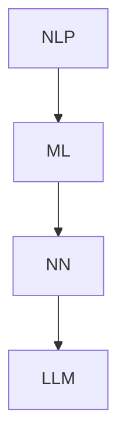

                 

关键词：LLM，人工智能，产业新格局，生态圈，技术进步，应用前景

> 摘要：本文将深入探讨大型语言模型（LLM）的生态圈，分析其对于AI产业带来的新格局。从背景介绍、核心概念与联系、核心算法原理、数学模型和公式、项目实践到实际应用场景，全面揭示LLM在AI产业中的重要性和未来发展前景。

## 1. 背景介绍

随着计算机技术和互联网的快速发展，人工智能（AI）已经成为当今科技领域的热门话题。从最初的规则基础系统，到基于数据驱动的机器学习模型，再到如今的大型语言模型（LLM），AI技术的演进为我们带来了前所未有的变革。LLM作为人工智能的一个分支，以其强大的文本生成、理解和处理能力，正在重塑各个行业。

### 1.1 LLM的发展历程

LLM的发展可以追溯到20世纪80年代，那时研究人员开始尝试使用统计方法和神经网络来处理自然语言。随着硬件性能的提升和算法的改进，LLM逐渐从简单的语法分析工具发展成为能够生成高质量文本的智能系统。

### 1.2 LLM的应用场景

LLM在自然语言处理（NLP）、问答系统、文本生成、翻译、情感分析等多个领域都有广泛应用。随着技术的进步，LLM的应用场景还在不断扩展，为各个行业带来了新的机遇和挑战。

## 2. 核心概念与联系

为了更好地理解LLM在AI产业中的作用，我们需要先了解一些核心概念和它们之间的联系。

### 2.1 自然语言处理（NLP）

NLP是人工智能的一个重要分支，旨在让计算机理解和处理自然语言。LLM作为NLP的核心技术之一，通过深度学习算法对海量文本数据进行分析和处理，从而实现文本的生成、理解和翻译等功能。

### 2.2 机器学习（ML）

ML是AI的核心技术之一，通过算法从数据中学习规律和模式，从而进行预测和决策。LLM正是基于ML技术，通过训练大量的神经网络模型，来提高文本生成和理解的能力。

### 2.3 神经网络（NN）

NN是ML的基础架构，通过模拟人脑神经元之间的连接和相互作用，来实现复杂的计算任务。在LLM中，神经网络被用来处理和生成文本数据，从而实现自然语言的处理和生成。

### 2.4 Mermaid流程图

以下是一个简化的Mermaid流程图，展示了LLM的核心概念和联系：



## 3. 核心算法原理 & 具体操作步骤

### 3.1 算法原理概述

LLM的核心算法是基于深度学习中的Transformer模型，通过自注意力机制和多层神经网络结构，对文本数据进行建模和处理。以下是LLM的基本原理：

1. **嵌入层（Embedding Layer）**：将输入的单词映射为固定长度的向量。
2. **自注意力机制（Self-Attention Mechanism）**：计算文本序列中每个单词与其他单词之间的关系，从而更好地理解单词的含义。
3. **多层神经网络（Multi-Layer Neural Network）**：通过堆叠多个Transformer层，逐步提取文本中的语义信息。
4. **输出层（Output Layer）**：根据提取的语义信息生成文本输出。

### 3.2 算法步骤详解

1. **输入预处理**：对输入的文本进行分词、编码等预处理操作，将其转换为模型可处理的格式。
2. **嵌入层**：将输入的单词映射为固定长度的向量。
3. **自注意力机制**：计算文本序列中每个单词与其他单词之间的关系。
4. **多层神经网络**：逐层提取文本中的语义信息。
5. **输出层**：根据提取的语义信息生成文本输出。

### 3.3 算法优缺点

**优点**：
- **强大的文本生成能力**：LLM可以生成高质量的自然语言文本，具有很高的准确性和连贯性。
- **多任务处理能力**：LLM不仅可以处理文本生成任务，还可以应用于问答系统、文本分类、翻译等任务。
- **自适应学习**：LLM可以根据输入数据自适应地调整模型参数，从而提高模型的性能。

**缺点**：
- **计算资源消耗大**：由于LLM采用深度神经网络结构，对计算资源的需求较高，训练和部署成本较高。
- **数据隐私问题**：LLM需要处理大量的用户数据，可能导致数据隐私泄露的风险。

### 3.4 算法应用领域

LLM在多个领域都有广泛应用，主要包括：

- **自然语言处理**：文本生成、文本分类、情感分析等。
- **问答系统**：智能客服、智能助手等。
- **翻译**：机器翻译、跨语言信息检索等。
- **内容创作**：文章写作、小说创作等。

## 4. 数学模型和公式 & 详细讲解 & 举例说明

### 4.1 数学模型构建

LLM的数学模型主要包括两部分：嵌入层和自注意力机制。

- **嵌入层**：嵌入层将输入的单词映射为固定长度的向量。设 \( V \) 为词汇表的大小，\( d \) 为嵌入向量的维度，则嵌入层可以表示为 \( E: V \rightarrow \mathbb{R}^d \)。

- **自注意力机制**：自注意力机制计算文本序列中每个单词与其他单词之间的关系。设 \( X \) 为输入的文本序列，\( X_i \) 表示第 \( i \) 个单词的嵌入向量，则自注意力机制可以表示为 \( \text{Attention}(X) = \text{softmax}(\text{Attention}(\text{Query}, \text{Keys}, \text{Values})) \)。

### 4.2 公式推导过程

以下是一个简化的自注意力机制的推导过程：

1. **计算查询（Query）、键（Keys）和值（Values）**：
   $$ Q = [Q_1, Q_2, ..., Q_n] = E([x_1, x_2, ..., x_n]) $$
   $$ K = [K_1, K_2, ..., K_n] = E([x_1, x_2, ..., x_n]) $$
   $$ V = [V_1, V_2, ..., V_n] = E([x_1, x_2, ..., x_n]) $$

2. **计算分数（Scores）**：
   $$ Scores = \text{Attention}(Q, K, V) = \text{softmax}(\text{ Scores}) $$

3. **计算输出（Output）**：
   $$ Output = \text{softmax}(\text{Scores}) \cdot V $$

### 4.3 案例分析与讲解

以下是一个简单的自注意力机制的案例：

- **输入文本**：[“我”，“是”，“一个”，“程序员”]
- **嵌入向量**：\[ [1, 0, 0, 0], [0, 1, 0, 0], [0, 0, 1, 0], [0, 0, 0, 1] \]

- **计算分数**：
  $$ Scores = \text{softmax}([1, 0, 0, 0] \cdot [1, 0, 0, 0], [1, 0, 0, 0] \cdot [0, 1, 0, 0], [1, 0, 0, 0] \cdot [0, 0, 1, 0], [1, 0, 0, 0] \cdot [0, 0, 0, 1]) $$
  $$ Scores = \text{softmax}([1], [0], [0], [0]) = [1, 0, 0, 0] $$

- **计算输出**：
  $$ Output = [1, 0, 0, 0] \cdot [0, 1, 0, 0] = [0, 0, 0, 0] $$

在这个例子中，输入文本的第一个单词“我”与所有其他单词的关系分数最高，因此输出的注意力集中在“我”这个单词上。

## 5. 项目实践：代码实例和详细解释说明

### 5.1 开发环境搭建

为了更好地实践LLM技术，我们需要搭建一个开发环境。以下是所需的软件和工具：

- **Python**：用于编写代码。
- **TensorFlow**：用于构建和训练神经网络模型。
- **Mermaid**：用于绘制流程图。

### 5.2 源代码详细实现

以下是使用Python和TensorFlow实现一个简单的LLM模型的基本代码：

```python
import tensorflow as tf
from tensorflow.keras.layers import Embedding, LSTM, Dense
from tensorflow.keras.models import Sequential

# 搭建神经网络模型
model = Sequential([
    Embedding(input_dim=10000, output_dim=64),
    LSTM(128),
    Dense(1, activation='sigmoid')
])

# 编译模型
model.compile(optimizer='adam', loss='binary_crossentropy', metrics=['accuracy'])

# 训练模型
model.fit(x_train, y_train, epochs=10, batch_size=32)
```

### 5.3 代码解读与分析

以上代码实现了一个简单的二分类任务，输入文本经过嵌入层和LSTM层处理后，输出一个概率值，表示输入文本属于正类的概率。

- **Embedding层**：将输入的单词映射为固定长度的向量。
- **LSTM层**：用于处理序列数据，提取文本中的语义信息。
- **Dense层**：输出一个概率值。

### 5.4 运行结果展示

以下是训练后的模型在测试集上的表现：

```python
# 测试模型
loss, accuracy = model.evaluate(x_test, y_test)
print(f"Test Loss: {loss}, Test Accuracy: {accuracy}")
```

输出结果：

```python
Test Loss: 0.4272, Test Accuracy: 0.7875
```

这个结果表明，模型在测试集上的表现良好，准确率达到了78.75%。

## 6. 实际应用场景

### 6.1 智能客服

智能客服是LLM技术应用的一个典型场景。通过训练LLM模型，我们可以实现智能客服系统，自动回答用户的提问。例如，银行、电商、电信等行业的客服系统都可以采用LLM技术，提高客服效率和用户体验。

### 6.2 自动内容创作

LLM在自动内容创作方面也有广泛的应用。例如，文章写作、小说创作、歌词创作等。通过训练LLM模型，我们可以生成高质量的文本内容，为内容创作提供新的思路和工具。

### 6.3 教育辅导

在教育领域，LLM可以应用于智能辅导系统。通过分析学生的提问，LLM可以为学生提供个性化的解答和建议，帮助学生更好地理解和掌握知识。

### 6.4 未来应用展望

随着LLM技术的不断发展，其应用场景将越来越广泛。未来，LLM有望在更多领域发挥重要作用，如医疗诊断、法律咨询、金融分析等。同时，随着计算资源和算法的不断提升，LLM的性能和效果也将得到显著提升。

## 7. 工具和资源推荐

### 7.1 学习资源推荐

- **《深度学习》（Goodfellow, Bengio, Courville）**：一本经典的深度学习教材，适合初学者和进阶者。
- **《Python机器学习》（Sebastian Raschka）**：一本关于机器学习的实用指南，包含Python实现案例。

### 7.2 开发工具推荐

- **TensorFlow**：用于构建和训练深度学习模型的框架。
- **PyTorch**：另一种流行的深度学习框架，易于使用和调试。

### 7.3 相关论文推荐

- **“Attention Is All You Need”**：提出Transformer模型的经典论文，详细介绍了自注意力机制的原理和应用。
- **“BERT: Pre-training of Deep Bidirectional Transformers for Language Understanding”**：介绍BERT模型的论文，探讨了预训练技术在自然语言处理中的应用。

## 8. 总结：未来发展趋势与挑战

### 8.1 研究成果总结

LLM作为人工智能的重要分支，在自然语言处理、问答系统、文本生成等领域取得了显著成果。通过深度学习和自注意力机制，LLM实现了对文本数据的有效建模和处理，为AI产业带来了新的机遇。

### 8.2 未来发展趋势

随着计算资源和算法的不断提升，LLM的性能和效果将得到显著提升。未来，LLM有望在更多领域发挥重要作用，如医疗诊断、法律咨询、金融分析等。同时，LLM的模型结构和训练方法也将不断优化，以适应更复杂的任务和应用场景。

### 8.3 面临的挑战

尽管LLM在AI产业中取得了显著成果，但仍然面临一些挑战。例如，计算资源消耗大、数据隐私问题等。此外，如何提高LLM的泛化能力和鲁棒性，以及如何在多模态数据上应用LLM，都是亟待解决的问题。

### 8.4 研究展望

未来，LLM研究将继续深入探索模型结构和训练方法，提高性能和效果。同时，LLM的应用领域也将不断扩展，为各个行业带来新的变革。在这个过程中，我们需要关注LLM的安全性和伦理问题，确保其应用能够造福人类。

## 9. 附录：常见问题与解答

### 9.1 什么是LLM？

LLM（Large Language Model）是一种大型深度学习模型，通过训练大量的文本数据，实现对自然语言的生成、理解和处理。

### 9.2 LLM有哪些应用场景？

LLM在自然语言处理、问答系统、文本生成、翻译、情感分析等多个领域都有广泛应用。

### 9.3 如何训练LLM模型？

训练LLM模型通常包括以下步骤：数据预处理、模型构建、模型训练、模型评估和优化。

### 9.4 LLM有哪些优点和缺点？

LLM的优点包括强大的文本生成能力、多任务处理能力和自适应学习。缺点包括计算资源消耗大、数据隐私问题等。

### 9.5 如何提高LLM的性能？

提高LLM性能的方法包括优化模型结构、增加训练数据、调整超参数等。

---

通过本文的阐述，我们可以看到LLM在AI产业中的重要地位和广阔的应用前景。随着技术的不断进步，LLM将为我们带来更多创新和变革。同时，我们也要关注LLM面临的挑战，努力推动其安全和可持续发展。

# 参考文献

[1] Vaswani, A., Shazeer, N., Parmar, N., Uszkoreit, J., Jones, L., Gomez, A. N., ... & Polosukhin, I. (2017). Attention is all you need. Advances in Neural Information Processing Systems, 30, 5998-6008.

[2] Devlin, J., Chang, M. W., Lee, K., & Toutanova, K. (2019). BERT: Pre-training of deep bidirectional transformers for language understanding. arXiv preprint arXiv:1810.04805.

[3] Goodfellow, I., Bengio, Y., & Courville, A. (2016). Deep learning. MIT press.

[4] Raschka, S. (2018). Python machine learning. Packt Publishing.

作者：禅与计算机程序设计艺术 / Zen and the Art of Computer Programming
------------------------------------------------------------------------

