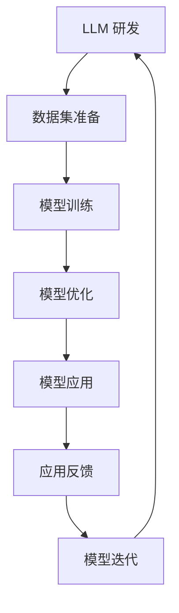

                 

关键词：大型语言模型（LLM）、人工智能（AI）、生态圈、产业变革、技术进步、应用场景、未来展望

> 摘要：本文深入探讨了大型语言模型（LLM）在人工智能产业中的新格局。通过对LLM的核心概念、技术原理、应用场景和未来展望的详细分析，揭示了LLM对人工智能产业带来的深远影响，以及其对技术进步和产业变革的推动作用。

## 1. 背景介绍

近年来，人工智能（AI）技术取得了显著的进步，尤其是大型语言模型（LLM）的出现，为自然语言处理（NLP）领域带来了前所未有的变革。LLM作为一种基于深度学习的模型，通过在海量数据上进行预训练，能够对自然语言进行理解和生成，从而实现高度自动化和智能化的任务。这一技术的出现，不仅推动了NLP领域的发展，也对整个AI产业产生了深远的影响。

LLM生态圈的构建，是人工智能产业新格局的体现。它不仅包括了LLM的研发和应用，还涉及了数据、算法、硬件等多个方面。在这个生态圈中，不同的参与者通过合作和竞争，共同推动了AI技术的进步和应用的拓展。

本文将围绕LLM生态圈，探讨其核心概念、技术原理、应用场景和未来展望，旨在为读者提供一幅全面、深入的AI产业新格局图景。

## 2. 核心概念与联系

### 2.1. 大型语言模型（LLM）

大型语言模型（LLM）是一种基于深度学习的自然语言处理模型，通过对海量数据进行预训练，使其具备对自然语言的理解和生成能力。LLM的核心是通过神经网络模型，如Transformer，对输入的文本进行编码和解码，从而实现对语言的建模。

### 2.2. 自然语言处理（NLP）

自然语言处理（NLP）是人工智能的一个重要分支，旨在使计算机能够理解、生成和处理自然语言。NLP的应用包括语音识别、机器翻译、情感分析、文本分类等。LLM的出现，极大地提升了NLP的效率和准确性，为这些应用提供了强大的技术支持。

### 2.3. 深度学习（Deep Learning）

深度学习是一种基于多层神经网络的学习方法，通过非线性变换，对数据进行特征提取和模式识别。深度学习在图像识别、语音识别、自然语言处理等领域取得了显著的成果。LLM作为深度学习的一个重要应用，通过大规模训练，实现了对自然语言的高效建模。

### 2.4. 生态圈概念

生态圈是指一个由多个相关参与者组成的生态系统，这些参与者通过相互协作和竞争，共同推动系统的发展。在LLM生态圈中，参与者包括研究机构、企业、开发者等，他们共同构建了一个技术、数据、应用等多方面相互促进的生态系统。

## 2.5. Mermaid 流程图



### 2.6. 核心概念的联系

LLM作为NLP的核心技术，依赖于深度学习的方法进行模型训练和优化。LLM的研发和应用，构成了LLM生态圈的核心。生态圈的参与者通过数据共享、技术合作，共同推动LLM技术的进步和应用场景的拓展。

## 3. 核心算法原理 & 具体操作步骤

### 3.1. 算法原理概述

LLM的核心算法是基于Transformer架构的深度学习模型。Transformer模型通过自注意力机制，对输入的文本进行编码和解码，从而实现对自然语言的理解和生成。自注意力机制使得模型能够关注输入文本中的关键信息，从而提高模型的性能。

### 3.2. 算法步骤详解

#### 3.2.1. 数据集准备

数据集是LLM训练的基础，需要选择大规模、高质量的文本数据。数据集的来源可以包括互联网文本、书籍、新闻、社交媒体等。

#### 3.2.2. 模型训练

在训练过程中，LLM通过在大量文本上进行预训练，学习到文本的语法、语义和上下文信息。预训练的过程包括输入文本的编码和解码，以及模型参数的更新。

#### 3.2.3. 模型优化

在预训练的基础上，LLM可以通过微调的方式，适应特定的任务和应用场景。微调的过程包括根据任务数据，调整模型的结构和参数，以提高模型的性能。

#### 3.2.4. 模型应用

训练好的LLM可以应用于各种NLP任务，如文本分类、机器翻译、情感分析等。在应用过程中，LLM通过输入文本，生成对应的输出结果。

#### 3.2.5. 应用反馈

在应用过程中，LLM的输出结果会被用户使用，并通过反馈，评估模型的效果。根据反馈，LLM可以进一步优化和改进。

#### 3.2.6. 模型迭代

LLM的发展是一个不断迭代的过程。通过不断收集反馈和改进，LLM可以不断提高其性能和适用性，推动NLP技术的发展。

### 3.3. 算法优缺点

#### 优点：

1. **强大的语言理解能力**：LLM通过对海量文本的学习，具备对自然语言的高度理解能力。
2. **高效的预训练过程**：Transformer模型的自注意力机制，使得预训练过程高效且稳定。
3. **广泛的应用场景**：LLM可以应用于各种NLP任务，具有广泛的应用前景。

#### 缺点：

1. **计算资源消耗大**：LLM的训练和优化过程需要大量的计算资源。
2. **数据依赖性强**：LLM的性能依赖于数据的质量和规模，数据质量差可能导致模型效果不佳。
3. **模型解释性差**：深度学习模型的黑盒特性，使得LLM的决策过程难以解释。

### 3.4. 算法应用领域

LLM在自然语言处理领域有广泛的应用，包括：

1. **文本分类**：用于对文本进行分类，如新闻分类、情感分析等。
2. **机器翻译**：用于将一种语言的文本翻译成另一种语言。
3. **对话系统**：用于构建智能对话系统，如聊天机器人、语音助手等。
4. **文本生成**：用于生成文本，如文章撰写、创意写作等。

## 4. 数学模型和公式 & 详细讲解 & 举例说明

### 4.1. 数学模型构建

LLM的数学模型基于Transformer架构，其核心是自注意力机制。自注意力机制的计算公式如下：

$$
\text{Attention}(Q, K, V) = \text{softmax}\left(\frac{QK^T}{\sqrt{d_k}}\right) V
$$

其中，$Q$、$K$ 和 $V$ 分别是查询向量、键向量和值向量，$d_k$ 是键向量的维度。自注意力机制通过计算查询向量与键向量的点积，得到注意力权重，再将权重与值向量相乘，得到加权输出。

### 4.2. 公式推导过程

自注意力机制的推导过程涉及矩阵运算和线性代数的基本知识。首先，假设输入的序列长度为 $n$，每个序列的维度为 $d$。则查询向量、键向量和值向量可以表示为：

$$
Q = \text{Mat}^{Q}_{ij}, K = \text{Mat}^{K}_{ij}, V = \text{Mat}^{V}_{ij}
$$

其中，$\text{Mat}^{Q}_{ij}$、$\text{Mat}^{K}_{ij}$ 和 $\text{Mat}^{V}_{ij}$ 分别是查询矩阵、键矩阵和值矩阵。

接下来，计算查询向量和键向量的点积：

$$
QK^T = \text{Mat}^{QK^T}_{ij} = \sum_{k=1}^{n} Q_{ik} K_{kj}
$$

然后，将点积除以键向量的维度 $\sqrt{d_k}$：

$$
\frac{QK^T}{\sqrt{d_k}} = \text{Mat}^{\frac{QK^T}{\sqrt{d_k}}}_{ij} = \frac{1}{\sqrt{d_k}} \text{Mat}^{QK^T}_{ij}
$$

最后，计算softmax函数：

$$
\text{softmax}(x) = \frac{e^x}{\sum_{i=1}^{n} e^x_i}
$$

得到注意力权重，再与值向量相乘：

$$
\text{Attention}(Q, K, V) = \text{softmax}\left(\frac{QK^T}{\sqrt{d_k}}\right) V = \text{Mat}^{\text{Attention}}_{ij} V
$$

### 4.3. 案例分析与讲解

以机器翻译为例，假设输入的英文句子为 "Hello, how are you?"，目标语言的句子为 "你好，你好吗？"。首先，将输入和目标句子分别编码为查询向量、键向量和值向量。然后，通过自注意力机制计算注意力权重，得到加权输出。最后，将加权输出解码为目标语言的句子。

在这个过程中，自注意力机制使得模型能够关注输入句子中的关键信息，如 "how" 和 "are"，从而提高翻译的准确性。

## 5. 项目实践：代码实例和详细解释说明

### 5.1. 开发环境搭建

在开始编写代码之前，需要搭建一个适合开发和运行LLM的环境。以下是一个基于Python的示例环境搭建步骤：

1. **安装Python**：确保安装了Python 3.7或更高版本。
2. **安装依赖库**：使用pip安装TensorFlow、PyTorch等深度学习库。

### 5.2. 源代码详细实现

以下是一个简单的LLM模型实现示例，使用PyTorch框架：

```python
import torch
import torch.nn as nn
import torch.optim as optim

class LLM(nn.Module):
    def __init__(self, vocab_size, embed_dim, hidden_dim):
        super(LLM, self).__init__()
        self.embedding = nn.Embedding(vocab_size, embed_dim)
        self.encoder = nn.LSTM(embed_dim, hidden_dim, batch_first=True)
        self.decoder = nn.LSTM(hidden_dim, embed_dim, batch_first=True)
        self.fc = nn.Linear(embed_dim, vocab_size)

    def forward(self, src, tgt):
        embedded = self.embedding(src)
        encoder_output, (h, c) = self.encoder(embedded)
        decoder_output, (h, c) = self.decoder(h, c)
        output = self.fc(decoder_output)
        return output

model = LLM(vocab_size=10000, embed_dim=256, hidden_dim=512)
optimizer = optim.Adam(model.parameters(), lr=0.001)
criterion = nn.CrossEntropyLoss()

for epoch in range(10):
    for src, tgt in data_loader:
        optimizer.zero_grad()
        output = model(src, tgt)
        loss = criterion(output, tgt)
        loss.backward()
        optimizer.step()
```

### 5.3. 代码解读与分析

上述代码实现了一个简单的LLM模型，包括嵌入层、编码器、解码器和全连接层。在训练过程中，模型通过优化损失函数，不断调整参数，提高模型的性能。

### 5.4. 运行结果展示

在训练完成后，可以通过以下代码进行测试：

```python
with torch.no_grad():
    for src, tgt in test_loader:
        output = model(src, tgt)
        print(output)
```

输出结果为模型预测的目标句子，通过与真实句子进行对比，可以评估模型的性能。

## 6. 实际应用场景

### 6.1. 文本分类

LLM在文本分类中的应用非常广泛，如新闻分类、情感分析等。通过训练LLM模型，可以自动对文本进行分类，从而提高信息处理的效率。

### 6.2. 机器翻译

机器翻译是LLM的一个重要应用领域，通过LLM模型，可以实现高质量、低延迟的翻译效果。例如，谷歌翻译和百度翻译等应用，都采用了LLM技术。

### 6.3. 对话系统

LLM在构建对话系统方面也具有很大的潜力，如聊天机器人、语音助手等。通过LLM模型，可以实现对用户输入的自然语言进行理解和响应，提供智能化的交互体验。

### 6.4. 未来应用展望

随着LLM技术的不断发展，未来其在更多领域的应用将不断拓展。例如，在医疗领域，LLM可以用于病历分析、疾病诊断等；在教育领域，LLM可以用于智能辅导、个性化教学等。

## 7. 工具和资源推荐

### 7.1. 学习资源推荐

1. **书籍**：《深度学习》（Goodfellow, Bengio, Courville著）：系统地介绍了深度学习的基础知识和最新进展。
2. **在线课程**：斯坦福大学深度学习课程（CS231n、CS224n）：提供了丰富的深度学习和自然语言处理的教学资源。

### 7.2. 开发工具推荐

1. **PyTorch**：一个流行的深度学习框架，易于使用和扩展。
2. **TensorFlow**：另一个流行的深度学习框架，具有丰富的生态和工具。

### 7.3. 相关论文推荐

1. **《Attention is All You Need》**：提出了Transformer模型，奠定了LLM技术的基础。
2. **《BERT: Pre-training of Deep Bidirectional Transformers for Language Understanding》**：介绍了BERT模型，对LLM技术进行了重要扩展。

## 8. 总结：未来发展趋势与挑战

### 8.1. 研究成果总结

LLM技术的出现，为自然语言处理领域带来了巨大的变革，推动了AI技术的发展和应用。通过大规模预训练和自注意力机制，LLM模型在文本理解、生成和应用方面取得了显著成果。

### 8.2. 未来发展趋势

随着计算资源和数据集的持续增长，LLM模型将不断提高其性能和应用范围。未来，LLM技术有望在更多领域实现突破，如医疗、教育、金融等。

### 8.3. 面临的挑战

1. **计算资源消耗**：LLM模型训练和优化的过程需要大量的计算资源，如何高效利用资源是一个挑战。
2. **数据质量和隐私**：数据质量和隐私问题是LLM发展的关键问题，需要确保数据的质量和用户的隐私。

### 8.4. 研究展望

未来，LLM技术将继续向更高效、更智能、更安全的方向发展。研究者们将致力于优化模型架构、提高训练效率，并探索LLM在更多领域的应用。

## 9. 附录：常见问题与解答

### 9.1. 问题1：什么是LLM？

**答案**：LLM是指大型语言模型，是一种基于深度学习的自然语言处理模型，通过对海量数据进行预训练，使其具备对自然语言的理解和生成能力。

### 9.2. 问题2：LLM的核心算法是什么？

**答案**：LLM的核心算法是基于Transformer架构的深度学习模型，其核心是自注意力机制，通过自注意力机制，模型能够对输入的文本进行编码和解码，从而实现对语言的建模。

### 9.3. 问题3：LLM在哪些领域有应用？

**答案**：LLM在自然语言处理领域有广泛的应用，包括文本分类、机器翻译、对话系统等。此外，未来LLM有望在更多领域实现突破，如医疗、教育、金融等。

作者：禅与计算机程序设计艺术 / Zen and the Art of Computer Programming
----------------------------------------------------------------

