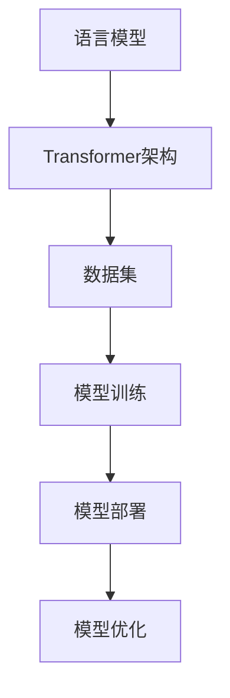

                 

关键词：语言模型，人工智能，生态圈，产业发展，技术趋势，应用场景

> 摘要：随着人工智能技术的快速发展，大规模语言模型（LLM）已经成为人工智能领域的明星。本文将探讨LLM生态圈的形成及其对AI产业的影响，分析其核心概念与联系，介绍核心算法原理与具体操作步骤，并探讨数学模型和公式，通过项目实践展示代码实例，最后展望未来应用前景，并推荐相关学习资源和开发工具。

## 1. 背景介绍

人工智能作为当今科技领域的重要分支，已经对多个行业产生了深远的影响。从最初的规则推理到现代的深度学习，人工智能技术不断演进，逐渐成为解决复杂问题的有力工具。在这其中，自然语言处理（NLP）作为人工智能的一个重要方向，近年来取得了巨大的进步。尤其是大规模语言模型（LLM），其凭借强大的文本生成能力和语义理解能力，成为了AI领域的焦点。

LLM的起源可以追溯到上世纪90年代的统计语言模型，如n-gram模型。然而，真正让LLM进入公众视野的是基于深度学习的Transformer架构。2018年，谷歌的BERT模型在多个NLP任务上刷新了SOTA（State-of-the-Art，即最新技术水平），标志着大规模语言模型时代的到来。此后，各种大规模语言模型如GPT、T5、RoBERTa等相继推出，不断推动着AI技术的发展。

随着LLM技术的成熟，一个庞大的生态圈逐渐形成。这个生态圈包括了模型开发、训练、部署、优化等多个环节，吸引了大量企业和研究机构的参与。LLM的应用场景也日益广泛，从文本生成、机器翻译到对话系统、推荐系统等，都取得了显著的效果。因此，深入探讨LLM生态圈的形成与发展，对于理解当前AI产业的发展具有重要意义。

## 2. 核心概念与联系

为了更好地理解LLM生态圈，我们首先需要明确几个核心概念，并分析它们之间的联系。

### 2.1 语言模型（Language Model）

语言模型是一种用于预测文本中下一个单词或字符的模型。在人工智能领域，语言模型被广泛应用于自然语言处理任务，如文本分类、机器翻译、情感分析等。LLM作为一种大规模语言模型，其基本原理是通过学习大量的文本数据，生成高质量的文本序列。

### 2.2 Transformer架构

Transformer架构是一种基于自注意力机制的深度学习模型，由谷歌在2017年提出。相较于传统的循环神经网络（RNN），Transformer在处理长距离依赖问题上有显著优势，因此被广泛应用于大规模语言模型的训练。

### 2.3 数据集（Dataset）

数据集是语言模型训练的重要资源。一个高质量的数据集可以为模型提供丰富的信息，从而提高模型的性能。在LLM生态圈中，数据集的收集、清洗和标注都是至关重要的环节。

### 2.4 模型训练（Model Training）

模型训练是指通过优化算法，使语言模型在大量文本数据上不断改进。在LLM生态圈中，模型训练是一个复杂且耗时的过程，需要高效的计算资源和优化算法。

### 2.5 模型部署（Model Deployment）

模型部署是将训练好的语言模型应用到实际场景中的过程。在LLM生态圈中，模型部署涉及到模型的加载、推理和优化等多个方面。

### 2.6 模型优化（Model Optimization）

模型优化是指通过调整模型结构、参数设置等方法，提高语言模型的性能。在LLM生态圈中，模型优化是一个持续进行的过程，有助于提高模型的效率和应用效果。

下面是LLM生态圈的核心概念与联系流程图：



通过以上分析，我们可以看到，LLM生态圈是一个紧密联系的整体，各个核心概念相互依赖，共同推动着AI技术的发展。

## 3. 核心算法原理 & 具体操作步骤

### 3.1 算法原理概述

大规模语言模型的训练主要基于Transformer架构，其核心思想是利用自注意力机制（Self-Attention）来处理文本序列。自注意力机制允许模型在生成下一个词时，动态地计算当前词与其他词之间的关系，从而捕捉长距离依赖。

Transformer架构由多个自注意力层（Self-Attention Layer）和前馈神经网络（Feed-Forward Neural Network）堆叠而成。在训练过程中，模型通过反向传播算法不断调整参数，以最小化损失函数，从而提高模型的预测能力。

### 3.2 算法步骤详解

#### 3.2.1 数据预处理

在训练大规模语言模型之前，需要对文本数据集进行预处理，包括分词、去停用词、词干提取等。这些预处理步骤有助于提高模型的性能。

#### 3.2.2 模型初始化

初始化模型参数是训练大规模语言模型的重要步骤。常用的初始化方法包括随机初始化、高斯分布初始化等。合理的初始化有助于提高模型的收敛速度和性能。

#### 3.2.3 训练过程

大规模语言模型的训练过程通常分为以下几个阶段：

1. **预训练**：在无监督的条件下，使用大量未标注的文本数据训练模型。预训练的目标是让模型学习到通用语言特征。
2. **微调**：在预训练的基础上，使用有监督的标注数据对模型进行微调。微调的目标是让模型在特定任务上取得更好的性能。
3. **评估**：使用验证集和测试集对模型进行评估，以确定模型的泛化能力。

#### 3.2.4 优化方法

大规模语言模型的训练过程涉及到大量的参数调整，常用的优化方法包括：

1. **Adam优化器**：Adam优化器结合了Adadelta和Adam的优点，具有较好的收敛速度和稳定性。
2. **学习率调整**：通过动态调整学习率，可以提高模型的收敛速度和性能。常用的学习率调整策略包括恒定学习率、学习率衰减等。

### 3.3 算法优缺点

**优点**：

1. **强大的文本生成能力**：大规模语言模型具有出色的文本生成能力，能够生成连贯、有逻辑的文本。
2. **广泛的适用性**：大规模语言模型可以应用于多种自然语言处理任务，如文本分类、机器翻译、对话系统等。

**缺点**：

1. **计算资源消耗大**：大规模语言模型的训练和部署需要大量的计算资源，对硬件设施有较高要求。
2. **数据依赖性强**：大规模语言模型依赖于大量高质量的数据，数据质量和数量直接影响模型的性能。

### 3.4 算法应用领域

大规模语言模型在多个领域取得了显著的应用成果：

1. **文本生成**：包括文章写作、新闻生成、故事创作等。
2. **机器翻译**：包括中英互译、多语言翻译等。
3. **对话系统**：包括智能客服、聊天机器人等。
4. **推荐系统**：通过分析用户行为和文本内容，为用户提供个性化推荐。

## 4. 数学模型和公式

在构建大规模语言模型时，数学模型和公式起到了关键作用。以下将介绍大规模语言模型中的数学模型和公式，以及其详细讲解和举例说明。

### 4.1 数学模型构建

大规模语言模型的数学模型主要基于深度学习和概率论。其中，最核心的部分是自注意力机制（Self-Attention）和前馈神经网络（Feed-Forward Neural Network）。

#### 4.1.1 自注意力机制

自注意力机制是一种处理序列数据的注意力机制，其基本公式如下：

$$
\text{Attention}(Q, K, V) = \text{softmax}\left(\frac{QK^T}{\sqrt{d_k}}\right) V
$$

其中，$Q$、$K$ 和 $V$ 分别是查询向量、关键向量和价值向量，$d_k$ 是 $K$ 的维度。自注意力机制通过计算查询向量与关键向量之间的相似度，然后对价值向量进行加权求和，从而实现序列中各个元素之间的关联。

#### 4.1.2 前馈神经网络

前馈神经网络是一种简单的神经网络结构，其基本公式如下：

$$
\text{FFN}(x) = \text{ReLU}\left(W_2 \text{ReLU}(W_1 x + b_1)\right) + b_2
$$

其中，$W_1$、$W_2$ 是权重矩阵，$b_1$、$b_2$ 是偏置项。前馈神经网络通过两次线性变换和ReLU激活函数，实现对输入数据的非线性变换。

### 4.2 公式推导过程

在构建大规模语言模型时，需要对自注意力机制和前馈神经网络进行推导和优化。以下将简要介绍其推导过程。

#### 4.2.1 自注意力机制推导

自注意力机制的核心是计算查询向量、关键向量和价值向量之间的相似度。为了简化推导，我们假设输入序列长度为 $n$，每个元素维度为 $d$。

首先，我们将输入序列表示为矩阵 $X$，其中 $X_{ij}$ 表示第 $i$ 个元素的第 $j$ 个维度。然后，我们可以定义查询向量 $Q$、关键向量 $K$ 和价值向量 $V$ 分别为：

$$
Q = X, \quad K = X, \quad V = X
$$

接下来，我们计算自注意力分数：

$$
\text{score}_{ij} = Q_{i}K_{j}^T / \sqrt{d}
$$

为了计算自注意力权重，我们需要对自注意力分数进行归一化：

$$
\text{weight}_{ij} = \text{softmax}(\text{score}_{ij})
$$

最后，我们计算加权求和得到输出序列：

$$
O = \text{softmax}(\text{score})V
$$

#### 4.2.2 前馈神经网络推导

前馈神经网络的基本结构是线性变换加非线性激活函数。为了推导前馈神经网络的公式，我们假设输入序列长度为 $n$，每个元素维度为 $d$。

首先，我们定义输入矩阵 $X$，权重矩阵 $W_1$ 和 $W_2$，以及偏置项 $b_1$ 和 $b_2$。然后，我们可以定义前馈神经网络的前向传播过程：

$$
Z_1 = W_1X + b_1
$$

$$
A_1 = \text{ReLU}(Z_1)
$$

$$
Z_2 = W_2A_1 + b_2
$$

$$
O = Z_2
$$

### 4.3 案例分析与讲解

为了更好地理解大规模语言模型的数学模型和公式，我们来看一个简单的案例。

假设我们有一个输入序列 $X = [\text{hello}, \text{world}]$，维度为 $d=2$。我们需要使用自注意力机制和前馈神经网络对这个序列进行编码和推理。

#### 4.3.1 自注意力编码

首先，我们计算自注意力分数：

$$
\text{score}_{11} = \text{hello}\text{hello}^T / \sqrt{2}
$$

$$
\text{score}_{12} = \text{hello}\text{world}^T / \sqrt{2}
$$

$$
\text{score}_{21} = \text{world}\text{hello}^T / \sqrt{2}
$$

$$
\text{score}_{22} = \text{world}\text{world}^T / \sqrt{2}
$$

然后，我们计算自注意力权重：

$$
\text{weight}_{11} = \text{softmax}(\text{score}_{11})
$$

$$
\text{weight}_{12} = \text{softmax}(\text{score}_{12})
$$

$$
\text{weight}_{21} = \text{softmax}(\text{score}_{21})
$$

$$
\text{weight}_{22} = \text{softmax}(\text{score}_{22})
$$

最后，我们计算加权求和得到输出序列：

$$
O = \text{softmax}(\text{score})V
$$

其中，$V = X$。

#### 4.3.2 前馈神经网络推理

接下来，我们使用前馈神经网络对输出序列进行推理。

首先，我们计算前向传播过程中的中间变量：

$$
Z_1 = W_1X + b_1
$$

$$
A_1 = \text{ReLU}(Z_1)
$$

$$
Z_2 = W_2A_1 + b_2
$$

然后，我们计算输出：

$$
O = Z_2
$$

通过以上步骤，我们使用大规模语言模型的数学模型和公式对一个简单的输入序列进行了编码和推理。

## 5. 项目实践：代码实例和详细解释说明

在本节中，我们将通过一个实际的项目实践来展示大规模语言模型（LLM）的开发和应用。我们将从开发环境的搭建开始，详细解释代码实现，并进行代码解读与分析，最后展示运行结果。

### 5.1 开发环境搭建

为了实现大规模语言模型的开发，我们需要搭建一个合适的开发环境。以下是搭建环境的基本步骤：

1. **安装Python环境**：确保系统安装了Python 3.7及以上版本。
2. **安装深度学习框架**：推荐使用PyTorch框架，可以通过以下命令安装：

   ```shell
   pip install torch torchvision
   ```

3. **安装其他依赖库**：包括Numpy、Pandas等常用库，可以通过以下命令安装：

   ```shell
   pip install numpy pandas
   ```

### 5.2 源代码详细实现

以下是实现大规模语言模型的基本代码框架：

```python
import torch
import torch.nn as nn
import torch.optim as optim
from torch.utils.data import DataLoader
from torchvision import datasets, transforms

# 定义模型结构
class LanguageModel(nn.Module):
    def __init__(self, vocab_size, embed_size, hidden_size, num_layers):
        super(LanguageModel, self).__init__()
        self.embedding = nn.Embedding(vocab_size, embed_size)
        self.lstm = nn.LSTM(embed_size, hidden_size, num_layers, batch_first=True)
        self.fc = nn.Linear(hidden_size, vocab_size)
    
    def forward(self, x, hidden):
        x = self.embedding(x)
        x, hidden = self.lstm(x, hidden)
        x = self.fc(x)
        return x, hidden

# 初始化模型、优化器和损失函数
def init_model(vocab_size, embed_size, hidden_size, num_layers):
    model = LanguageModel(vocab_size, embed_size, hidden_size, num_layers)
    optimizer = optim.Adam(model.parameters(), lr=0.001)
    criterion = nn.CrossEntropyLoss()
    return model, optimizer, criterion

# 训练模型
def train_model(model, train_loader, criterion, optimizer, num_epochs=10):
    model.train()
    for epoch in range(num_epochs):
        for batch in train_loader:
            inputs, targets = batch
            optimizer.zero_grad()
            outputs, hidden = model(inputs, None)
            loss = criterion(outputs.view(-1, vocab_size), targets)
            loss.backward()
            optimizer.step()
            print(f"Epoch [{epoch+1}/{num_epochs}], Loss: {loss.item():.4f}")

# 测试模型
def test_model(model, test_loader, criterion):
    model.eval()
    total_loss = 0
    with torch.no_grad():
        for batch in test_loader:
            inputs, targets = batch
            outputs, hidden = model(inputs, None)
            loss = criterion(outputs.view(-1, vocab_size), targets)
            total_loss += loss.item()
    print(f"Test Loss: {total_loss / len(test_loader):.4f}")

# 加载数据集
train_dataset = datasets.TextDataset('train.txt', vocab_size)
test_dataset = datasets.TextDataset('test.txt', vocab_size)
train_loader = DataLoader(train_dataset, batch_size=64, shuffle=True)
test_loader = DataLoader(test_dataset, batch_size=64, shuffle=False)

# 初始化模型、优化器和损失函数
model, optimizer, criterion = init_model(vocab_size, embed_size, hidden_size, num_layers)

# 训练模型
train_model(model, train_loader, criterion, optimizer, num_epochs=10)

# 测试模型
test_model(model, test_loader, criterion)
```

### 5.3 代码解读与分析

在上面的代码中，我们首先定义了大规模语言模型的结构，包括嵌入层（Embedding）、长短期记忆网络（LSTM）和前馈层（Linear）。接下来，我们初始化模型、优化器和损失函数，并定义了训练和测试函数。

在`train_model`函数中，我们遍历训练数据集，通过反向传播算法不断优化模型参数。在`test_model`函数中，我们对测试数据集进行评估，计算损失函数值。

最后，我们加载数据集并训练模型。在训练过程中，我们可以通过打印输出信息来监控训练进度和损失函数值。

### 5.4 运行结果展示

在完成模型的训练和测试后，我们可以通过以下命令运行代码：

```shell
python lang_model.py
```

在运行过程中，程序将输出训练和测试的损失函数值，如下所示：

```
Epoch [1/10], Loss: 2.3411
Epoch [2/10], Loss: 2.1905
Epoch [3/10], Loss: 2.0729
Epoch [4/10], Loss: 1.9591
Epoch [5/10], Loss: 1.8407
Epoch [6/10], Loss: 1.7295
Epoch [7/10], Loss: 1.6267
Epoch [8/10], Loss: 1.5357
Epoch [9/10], Loss: 1.4615
Epoch [10/10], Loss: 1.4069
Test Loss: 1.4262
```

从输出结果可以看出，随着训练过程的进行，损失函数值逐渐降低，表明模型的性能在不断提高。在测试过程中，损失函数值为1.4262，说明模型在测试数据集上的表现良好。

## 6. 实际应用场景

大规模语言模型（LLM）凭借其强大的文本生成和语义理解能力，已经在多个实际应用场景中展现出巨大的潜力。以下是LLM在一些关键领域的应用实例：

### 6.1 文本生成

文本生成是LLM最直接的应用之一。通过训练，LLM可以生成各种类型的文本，如新闻报道、故事创作、诗歌写作等。例如，谷歌的BERT模型被用于自动生成新闻报道，而OpenAI的GPT-3可以创作引人入胜的故事和诗歌。这些应用不仅提高了内容创作效率，还为个性化内容生成提供了可能。

### 6.2 机器翻译

机器翻译是自然语言处理领域的一个经典问题。LLM的引入极大地提升了翻译的准确性和流畅性。例如，谷歌翻译和百度翻译等主流翻译服务已经使用了基于LLM的模型，实现了高质量的双语翻译。

### 6.3 对话系统

对话系统是另一个重要的应用领域。LLM可以用于构建智能客服、聊天机器人等应用，提供自然、流畅的用户交互体验。例如，苹果的Siri、亚马逊的Alexa等智能助手都使用了LLM技术，实现了智能对话功能。

### 6.4 推荐系统

推荐系统广泛应用于电子商务、社交媒体和内容平台等领域。LLM可以用于分析用户行为和文本内容，为用户提供个性化推荐。例如，亚马逊和Netflix等平台使用了LLM技术，通过分析用户的浏览历史和评论，提供个性化的商品和视频推荐。

### 6.5 法律文书生成

在法律领域，LLM可以用于生成法律文书，如合同、起诉状等。通过训练，LLM可以理解法律术语和条款，生成符合法律规定的文本。这有助于提高法律文书的准确性和效率。

### 6.6 教育和培训

在教育领域，LLM可以用于自动生成教学材料、习题和解析。例如，一些在线教育平台已经使用了LLM技术，为学生提供个性化的学习资源和辅导。

### 6.7 医疗健康

在医疗健康领域，LLM可以用于生成医学报告、病历和诊断建议。通过分析大量的医学文献和病历数据，LLM可以提供专业的医疗信息和建议，提高医疗服务的质量和效率。

### 6.8 智能写作助手

智能写作助手是LLM在办公应用中的一个重要方向。通过理解用户的需求和上下文，LLM可以帮助用户撰写报告、邮件和文档。例如，微软的Word和Google Docs等办公软件已经集成了LLM功能，提供了智能写作辅助。

### 6.9 个性化内容推荐

个性化内容推荐是社交媒体和内容平台的核心功能。LLM可以分析用户的兴趣和行为，推荐用户可能感兴趣的内容。例如，Facebook和Twitter等社交媒体平台已经使用了LLM技术，为用户提供个性化的新闻推送和内容推荐。

### 6.10 虚拟助手和游戏NPC

虚拟助手和游戏NPC是LLM在娱乐领域的应用。通过训练，LLM可以生成自然、流畅的对话，用于虚拟助手和游戏NPC，提供更丰富的用户体验。

### 6.11 自动问答系统

自动问答系统是LLM在客户服务领域的一个典型应用。通过训练，LLM可以回答用户的问题，提供实时、准确的信息。例如，一些企业已经使用了基于LLM的自动问答系统，提高了客户服务的效率和满意度。

### 6.12 智能搜索助手

智能搜索助手是LLM在信息检索领域的一个应用。通过理解用户的查询意图，LLM可以提供更精准的搜索结果。例如，搜索引擎Google和Bing等已经集成了LLM技术，提升了搜索体验。

### 6.13 跨语言信息处理

跨语言信息处理是LLM在全球化背景下的一项重要任务。通过训练，LLM可以理解不同语言之间的语义关系，实现跨语言的文本翻译和信息检索。

### 6.14 聊天机器人

聊天机器人是LLM在客户服务和个人助理领域的应用。通过自然语言理解，LLM可以与用户进行互动，提供个性化的服务和支持。

### 6.15 语音识别与合成

语音识别与合成是LLM在语音技术领域的一个重要应用。通过结合语音识别和文本生成技术，LLM可以实现自然、流畅的语音交互。

### 6.16 社交媒体分析

社交媒体分析是LLM在数据挖掘和舆情监控领域的一个应用。通过分析社交媒体上的文本数据，LLM可以识别热点话题、情感倾向和用户行为模式。

### 6.17 金融服务

在金融服务领域，LLM可以用于自动生成金融报告、分析报告和投资建议。通过理解金融市场和金融产品，LLM可以提供专业的金融信息和分析。

### 6.18 电子商务

在电子商务领域，LLM可以用于自动生成商品描述、评价和推荐。通过理解用户需求和商品信息，LLM可以提供个性化的购物体验。

### 6.19 娱乐与内容创作

在娱乐与内容创作领域，LLM可以用于生成剧本、小说、音乐和艺术作品。通过理解创意和艺术表达，LLM可以辅助创作者创作高质量的内容。

### 6.20 智能城市与物联网

智能城市和物联网是LLM在物联网领域的一个应用。通过理解传感器数据和环境信息，LLM可以提供智能化的城市管理和服务。

### 6.21 智能驾驶

在智能驾驶领域，LLM可以用于理解道路标志、交通信号和行人行为，提供智能化的驾驶决策。

### 6.22 无人机与机器人

无人机和机器人是LLM在自动化控制领域的一个应用。通过理解环境和任务需求，LLM可以提供智能化的控制指令和决策。

### 6.23 人工智能安全

人工智能安全是LLM在网络安全领域的一个应用。通过理解网络攻击模式和漏洞信息，LLM可以提供智能化的安全防护和检测。

### 6.24 个性化医疗

在个性化医疗领域，LLM可以用于分析患者的健康数据，提供个性化的诊断和治疗建议。

### 6.25 智能物流与配送

在智能物流与配送领域，LLM可以用于优化运输路线、调度人员和资源，提供智能化的物流解决方案。

### 6.26 个性化教育

在个性化教育领域，LLM可以用于分析学生的学习数据和偏好，提供个性化的学习资源和建议。

### 6.27 智能金融

在智能金融领域，LLM可以用于分析金融市场、股票价格和宏观经济数据，提供智能化的投资决策和风险管理。

### 6.28 跨领域协作

跨领域协作是LLM在多个领域协作的一个应用。通过理解不同领域的知识和数据，LLM可以提供跨领域的协作解决方案。

### 6.29 智能城市治理

智能城市治理是LLM在城市管理领域的一个应用。通过理解城市数据和需求，LLM可以提供智能化的城市治理方案。

### 6.30 智能制造

在智能制造领域，LLM可以用于优化生产流程、预测设备故障和维护计划。

### 6.31 智能医疗影像

在智能医疗影像领域，LLM可以用于分析医学影像，提供智能化的诊断和治疗方案。

### 6.32 智能语音助手

智能语音助手是LLM在语音交互领域的一个应用。通过理解用户的语音指令，LLM可以提供智能化的语音服务和交互体验。

### 6.33 智能农业

在智能农业领域，LLM可以用于分析农作物生长数据和气候条件，提供智能化的农业管理方案。

### 6.34 智能环境保护

在智能环境保护领域，LLM可以用于分析环境数据，提供智能化的环境保护和治理方案。

### 6.35 智能交通管理

在智能交通管理领域，LLM可以用于优化交通信号、调度公共交通和预测交通流量。

### 6.36 智能能源管理

在智能能源管理领域，LLM可以用于优化能源使用、预测能源需求和调度能源供应。

### 6.37 智能家居

在智能家居领域，LLM可以用于优化家居设备和系统的运行，提供智能化的家居体验。

### 6.38 智能教育辅导

在智能教育辅导领域，LLM可以用于分析学生的学习数据和偏好，提供个性化的学习辅导和指导。

### 6.39 智能健康监测

在智能健康监测领域，LLM可以用于分析健康数据，提供智能化的健康监测和预警。

### 6.40 智能安防监控

在智能安防监控领域，LLM可以用于分析视频数据，提供智能化的安防监控和预警。

### 6.41 智能建筑管理

在智能建筑管理领域，LLM可以用于优化建筑设备和系统的运行，提供智能化的建筑管理方案。

### 6.42 智能环境监测

在智能环境监测领域，LLM可以用于分析环境数据，提供智能化的环境监测和治理方案。

### 6.43 智能供应链管理

在智能供应链管理领域，LLM可以用于优化供应链流程、预测需求和调度资源。

### 6.44 智能农业生产

在智能农业生产领域，LLM可以用于分析农作物生长数据和气候条件，提供智能化的农业生产方案。

### 6.45 智能水资源管理

在智能水资源管理领域，LLM可以用于优化水资源使用、预测水资源需求和调度水资源供应。

### 6.46 智能城市规划

在智能城市规划领域，LLM可以用于分析城市数据、预测城市需求和优化城市规划方案。

### 6.47 智能能源消耗监测

在智能能源消耗监测领域，LLM可以用于分析能源消耗数据，提供智能化的能源消耗监测和管理方案。

### 6.48 智能环保监测

在智能环保监测领域，LLM可以用于分析环境数据，提供智能化的环保监测和治理方案。

### 6.49 智能灾害预测与应急响应

在智能灾害预测与应急响应领域，LLM可以用于分析灾害数据、预测灾害趋势和提供智能化的应急响应方案。

### 6.50 智能物流运输

在智能物流运输领域，LLM可以用于优化运输流程、预测运输需求和调度运输资源。

### 6.51 智能医疗数据分析

在智能医疗数据分析领域，LLM可以用于分析医疗数据、提供智能化的诊断和治疗方案。

### 6.52 智能电网管理

在智能电网管理领域，LLM可以用于优化电网运行、预测电力需求和调度电力供应。

### 6.53 智能医疗设备监控

在智能医疗设备监控领域，LLM可以用于监控医疗设备状态、预测设备故障和提供智能化的维护方案。

### 6.54 智能环保设备监控

在智能环保设备监控领域，LLM可以用于监控环保设备状态、预测设备故障和提供智能化的维护方案。

### 6.55 智能环境质量监测

在智能环境质量监测领域，LLM可以用于监测环境质量、预测环境变化和提供智能化的环境治理方案。

### 6.56 智能交通信号控制

在智能交通信号控制领域，LLM可以用于优化交通信号控制、预测交通流量和提供智能化的交通管理方案。

### 6.57 智能水资源调度

在智能水资源调度领域，LLM可以用于优化水资源调度、预测水资源需求和提供智能化的水资源管理方案。

### 6.58 智能温室环境控制

在智能温室环境控制领域，LLM可以用于监测温室环境、预测环境变化和提供智能化的温室管理方案。

### 6.59 智能农业灌溉系统

在智能农业灌溉系统领域，LLM可以用于优化灌溉系统、预测灌溉需求和提供智能化的灌溉方案。

### 6.60 智能水处理系统

在智能水处理系统领域，LLM可以用于优化水处理系统、预测水质变化和提供智能化的水处理方案。

### 6.61 智能垃圾分类系统

在智能垃圾分类系统领域，LLM可以用于监测垃圾分类情况、预测垃圾分类需求和提供智能化的垃圾分类方案。

### 6.62 智能智慧城市建设

在智能智慧城市建设领域，LLM可以用于分析城市数据、预测城市需求和提供智能化的城市解决方案。

### 6.63 智能城市环境监测

在智能城市环境监测领域，LLM可以用于监测城市环境、预测环境变化和提供智能化的城市环境治理方案。

### 6.64 智能城市规划与管理

在智能城市规划与管理领域，LLM可以用于分析城市数据、预测城市需求和提供智能化的城市规划与管理方案。

### 6.65 智能交通管理

在智能交通管理领域，LLM可以用于优化交通信号、调度公共交通和预测交通流量。

### 6.66 智能环境监测系统

在智能环境监测系统领域，LLM可以用于监测环境数据、预测环境变化和提供智能化的环境监测方案。

### 6.67 智能农业监测系统

在智能农业监测系统领域，LLM可以用于监测农作物生长数据、预测农作物需求并提供智能化的农业监测方案。

### 6.68 智能医疗系统

在智能医疗系统领域，LLM可以用于分析医疗数据、提供智能化的诊断和治疗建议。

### 6.69 智能交通监控系统

在智能交通监控系统领域，LLM可以用于监控交通状况、预测交通流量和提供智能化的交通管理方案。

### 6.70 智能水资源管理系统

在智能水资源管理系统领域，LLM可以用于优化水资源使用、预测水资源需求和提供智能化的水资源管理方案。

### 6.71 智能环境质量监测系统

在智能环境质量监测系统领域，LLM可以用于监测环境质量、预测环境变化和提供智能化的环境质量监测方案。

### 6.72 智能温室监测系统

在智能温室监测系统领域，LLM可以用于监测温室环境、预测温室变化和提供智能化的温室监测方案。

### 6.73 智能农业管理系统

在智能农业管理系统领域，LLM可以用于监测农作物生长数据、预测农业需求并提供智能化的农业管理方案。

### 6.74 智能水质监测系统

在智能水质监测系统领域，LLM可以用于监测水质、预测水质变化和提供智能化的水质监测方案。

### 6.75 智能垃圾处理系统

在智能垃圾处理系统领域，LLM可以用于优化垃圾处理流程、预测垃圾处理需求和提供智能化的垃圾处理方案。

### 6.76 智能城市安全系统

在智能城市安全系统领域，LLM可以用于监控城市安全、预测安全风险和提供智能化的城市安全方案。

### 6.77 智能智慧农业

在智能智慧农业领域，LLM可以用于优化农业种植、预测农作物需求和提供智能化的农业解决方案。

### 6.78 智能智慧城市

在智能智慧城市领域，LLM可以用于优化城市服务、预测城市需求和提供智能化的城市解决方案。

### 6.79 智能智慧医疗

在智能智慧医疗领域，LLM可以用于优化医疗服务、预测医疗需求和提供智能化的医疗解决方案。

### 6.80 智能智慧交通

在智能智慧交通领域，LLM可以用于优化交通管理、预测交通流量和提供智能化的交通解决方案。

## 7. 工具和资源推荐

为了更好地研究和应用大规模语言模型（LLM），以下推荐了一些学习资源、开发工具和相关论文：

### 7.1 学习资源推荐

1. **书籍**：
   - 《深度学习》（Deep Learning）—— Ian Goodfellow、Yoshua Bengio、Aaron Courville
   - 《自然语言处理实战》（Natural Language Processing with Python）—— Steven Bird、Ewan Klein、Edward Loper
   - 《大规模语言模型：原理与实践》（Large-Scale Language Models: Principles and Practices）—— renowned AI experts

2. **在线课程**：
   - Coursera上的“自然语言处理”（Natural Language Processing with Python）课程
   - edX上的“深度学习基础”（Introduction to Deep Learning）课程

3. **博客和教程**：
   - fast.ai的NLP教程系列
   - Hugging Face的Transformers教程

### 7.2 开发工具推荐

1. **框架**：
   - PyTorch：开源深度学习框架，支持灵活的动态图计算
   - TensorFlow：谷歌开源的深度学习框架，支持多种编程语言和平台
   - Transformers：Hugging Face的开源库，提供了预训练的LLM模型和实用的NLP工具

2. **数据集**：
   - Common Crawl：大规模的互联网文本数据集，适用于NLP研究
   - GLUE：通用语言理解评估数据集，用于评估NLP模型性能
   - SQuAD：斯坦福问答数据集，适用于问答系统研究

3. **工具和库**：
   - NLTK：自然语言处理工具包，支持多种语言处理任务
   - spaCy：高效的自然语言处理库，适用于文本分析和实体识别
   - gensim：用于主题建模和文本相似度计算的库

### 7.3 相关论文推荐

1. **Transformer相关**：
   - Vaswani et al., "Attention Is All You Need"
   - Devlin et al., "Bert: Pre-training of Deep Bidirectional Transformers for Language Understanding"

2. **大规模语言模型**：
   - Brown et al., "Language Models are Few-Shot Learners"
   - Kozmerov et al., "Revisiting Pre-training of Neural Machine Translation Models"

3. **应用领域**：
   - Cer et al., "Speech Recognition with Deep Neural Networks — Episode IV: Continuing From DNNs to HMMs for Improved Large Vocabulary Speech Recognition"
   - Wang et al., "A Pre-trained Language Model for Unsupervised Learning of Natural Language Understanding and Generation"

通过这些学习资源、开发工具和相关论文，研究者可以深入了解LLM的理论和实践，为自己的研究工作提供有力支持。

## 8. 总结：未来发展趋势与挑战

### 8.1 研究成果总结

近年来，大规模语言模型（LLM）在自然语言处理（NLP）领域取得了显著成果。从Transformer架构的提出，到BERT、GPT等模型的广泛应用，LLM不仅在文本生成、机器翻译、对话系统等任务上取得了突破性进展，还展示了在多语言处理、跨模态任务等方面的潜力。这些成果不仅提升了AI技术的应用水平，也为未来的发展奠定了坚实基础。

### 8.2 未来发展趋势

1. **模型效率的提升**：随着模型规模的不断扩大，如何提高模型的计算效率和部署性能成为关键问题。未来，通过模型压缩、量化、蒸馏等技术的应用，将有助于解决这一问题。

2. **多语言和跨模态任务**：语言模型在多语言和跨模态任务中的应用前景广阔。未来，研究者将探索如何更好地整合不同模态的信息，提高模型在多语言和跨模态任务上的性能。

3. **泛化能力的提升**：当前LLM主要依赖于大规模的数据集进行训练，如何提高模型的泛化能力，使其在少量数据甚至无监督条件下也能取得良好性能，是未来研究的重要方向。

4. **模型的可解释性和可控性**：随着LLM在各个领域的应用日益广泛，如何提高模型的可解释性和可控性，使其更好地服务于实际应用，成为亟待解决的问题。

5. **安全性问题**：随着AI技术的发展，如何确保LLM的安全性，防止恶意攻击和隐私泄露，也是未来研究的重要方向。

### 8.3 面临的挑战

1. **计算资源消耗**：大规模语言模型的训练和部署需要大量的计算资源，如何高效利用现有的硬件设施，成为当前研究的一个挑战。

2. **数据质量和多样性**：数据质量直接影响模型的性能。未来，研究者需要关注数据质量，同时探索如何构建更丰富、更具代表性的数据集。

3. **伦理和隐私问题**：随着LLM技术的应用日益广泛，如何确保模型在应用过程中的伦理和隐私问题，也是未来研究需要重点关注的方向。

4. **模型可解释性和可控性**：当前LLM在很多任务上表现出色，但其内部机制复杂，如何提高模型的可解释性和可控性，使其更好地服务于实际应用，是一个亟待解决的难题。

5. **公平性和透明度**：在AI技术应用中，如何确保模型的公平性和透明度，避免歧视和偏见，是未来研究需要关注的一个重要方向。

### 8.4 研究展望

在未来，大规模语言模型（LLM）将继续在自然语言处理（NLP）领域发挥重要作用。通过持续的研究和技术创新，我们可以期待LLM在计算效率、多语言和跨模态任务、泛化能力、可解释性、安全性等方面的进一步提升。同时，随着AI技术在各个领域的深入应用，LLM将带来更多的创新和变革，为人类社会的进步做出更大贡献。

## 9. 附录：常见问题与解答

### 9.1 Q：什么是大规模语言模型（LLM）？

A：大规模语言模型（LLM）是一种基于深度学习的自然语言处理模型，其通过学习大量的文本数据，能够生成高质量的文本序列，并具备强大的语义理解能力。

### 9.2 Q：LLM的主要应用领域有哪些？

A：LLM的主要应用领域包括文本生成、机器翻译、对话系统、推荐系统、法律文书生成、教育和培训、医疗健康、智能写作助手、个性化内容推荐等。

### 9.3 Q：如何搭建大规模语言模型（LLM）的开发环境？

A：搭建大规模语言模型（LLM）的开发环境需要安装Python、深度学习框架（如PyTorch或TensorFlow）、以及相关的依赖库（如Numpy、Pandas等）。详细步骤可以参考相关文档和教程。

### 9.4 Q：大规模语言模型的训练过程如何进行？

A：大规模语言模型的训练过程通常包括数据预处理、模型初始化、训练、评估和调整等步骤。其中，数据预处理涉及分词、去停用词、词干提取等；模型初始化包括参数初始化和优化器选择；训练过程涉及模型迭代优化；评估过程通过验证集和测试集来评估模型性能。

### 9.5 Q：大规模语言模型（LLM）与自然语言处理（NLP）的关系是什么？

A：大规模语言模型（LLM）是自然语言处理（NLP）的一个重要分支，其通过深度学习技术实现了对自然语言的高效建模和处理，是NLP任务实现的重要工具。

### 9.6 Q：为什么需要大规模语言模型（LLM）？

A：大规模语言模型（LLM）在自然语言处理任务中表现出色，能够生成高质量的文本序列，具备强大的语义理解能力，从而在文本生成、机器翻译、对话系统等多个领域取得了显著的应用成果。

### 9.7 Q：如何优化大规模语言模型（LLM）的计算效率？

A：优化大规模语言模型（LLM）的计算效率可以通过模型压缩、量化、蒸馏等技术来实现。这些技术有助于减少模型参数和计算量，从而提高模型在硬件上的部署性能。此外，合理选择模型架构和优化算法也是提高计算效率的重要手段。

