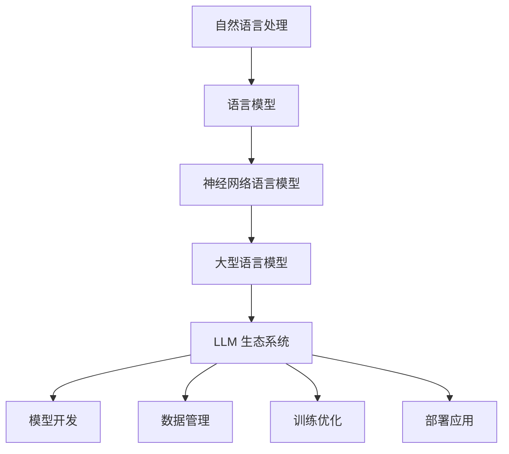

                 

关键词：自然语言处理、语言模型、大模型、生态发展、技术挑战

> 摘要：本文将探讨自然语言处理（NLP）领域中的大型语言模型（LLM）生态系统的发展趋势。通过深入分析LLM的技术进步、应用场景、挑战与机遇，本文旨在为读者提供一个全面的理解，并对未来LLM生态系统的发展方向提出预测和思考。

## 1. 背景介绍

自然语言处理（NLP）作为人工智能（AI）的一个重要分支，旨在使计算机理解和生成人类语言。随着深度学习技术的发展，特别是神经网络架构的进步，NLP领域取得了显著的成就。近年来，大型语言模型（LLM）如GPT、BERT、T5等在多个NLP任务上取得了卓越的性能，推动了NLP技术的快速发展。LLM的兴起不仅改变了NLP的研究方向，也深刻影响了各行各业的应用。

LLM生态系统包含了从模型训练、优化到部署的各个环节。随着技术的发展，这个生态系统变得更加复杂和多样化。本文将重点关注LLM生态系统的技术进步、核心算法、数学模型、项目实践以及未来趋势。

## 2. 核心概念与联系

### 2.1. 自然语言处理（NLP）

NLP的目标是让计算机理解和生成人类语言。它涵盖了从文本处理到语音识别等多个方面。NLP的核心任务包括但不限于文本分类、情感分析、机器翻译、问答系统等。

### 2.2. 语言模型（LM）

语言模型是一种统计模型，用于预测自然语言中的下一个单词或字符。在深度学习时代，神经网络语言模型（如RNN、LSTM、Transformer）成为了主流。特别是Transformer架构的提出，使得大规模语言模型的研究和应用成为可能。

### 2.3. 大型语言模型（LLM）

LLM是指参数规模达到数十亿乃至万亿级的语言模型。这些模型通过大规模数据训练，能够捕捉到语言中的复杂结构和语义关系，从而在NLP任务中表现出色。

### 2.4. 生态系统

LLM生态系统是一个复杂的网络，包含了模型开发、数据管理、训练优化、部署应用等多个环节。这个生态系统的稳定和发展对于LLM技术的进步至关重要。

### 2.5. Mermaid 流程图



## 3. 核心算法原理 & 具体操作步骤

### 3.1. 算法原理概述

大型语言模型（LLM）的核心算法是基于深度学习的神经网络模型。这些模型通过多层神经网络对大量文本数据进行训练，从而学习到语言的内在结构和语义关系。Transformer架构的引入，使得LLM在计算效率和模型性能上有了显著提升。

### 3.2. 算法步骤详解

1. **数据预处理**：对文本数据进行分析，提取特征，进行清洗和预处理。
2. **模型构建**：使用神经网络架构（如Transformer）构建模型。
3. **训练过程**：将预处理后的数据输入模型，通过反向传播算法更新模型参数。
4. **优化过程**：使用各种优化策略（如学习率调整、权重衰减等）提高模型性能。
5. **评估与调优**：在验证集上评估模型性能，并根据评估结果进行调优。

### 3.3. 算法优缺点

**优点**：
- **强大的表达能力**：LLM能够处理复杂和长文本，捕捉到语言中的深层语义关系。
- **高效的计算性能**：Transformer架构使得LLM在计算效率和模型性能上有了显著提升。

**缺点**：
- **数据依赖性**：LLM的性能高度依赖于训练数据的质量和规模。
- **资源消耗**：大规模LLM的训练和部署需要大量的计算资源和存储空间。

### 3.4. 算法应用领域

LLM在多个领域有着广泛的应用，包括但不限于：
- **问答系统**：如OpenAI的GPT-3，能够回答各种领域的问题。
- **机器翻译**：如Google翻译，使用LLM进行高质量的语言翻译。
- **文本生成**：如文章生成、摘要生成等。

## 4. 数学模型和公式 & 详细讲解 & 举例说明

### 4.1. 数学模型构建

LLM的核心是深度学习模型，通常基于多层神经网络。以下是一个简单的神经网络模型：

$$
y = f(z) = \sigma(W_1 \cdot x + b_1)
$$

其中，$x$ 是输入特征，$W_1$ 和 $b_1$ 分别是权重和偏置，$\sigma$ 是激活函数（如ReLU、Sigmoid、Tanh）。

### 4.2. 公式推导过程

以ReLU激活函数为例，推导神经网络模型的公式：

$$
y = \max(0, z)
$$

其中，$z = W_1 \cdot x + b_1$。

### 4.3. 案例分析与讲解

假设我们有一个简单的文本分类任务，需要使用神经网络模型进行训练。以下是模型构建和训练的步骤：

1. **数据预处理**：对文本数据进行分词、编码，提取特征向量。
2. **模型构建**：构建一个简单的神经网络模型，包含输入层、隐藏层和输出层。
3. **训练过程**：使用反向传播算法更新模型参数，最小化损失函数。
4. **评估与调优**：在验证集上评估模型性能，并根据评估结果进行调优。

通过以上步骤，我们可以构建一个简单的文本分类模型，并进行训练和评估。

## 5. 项目实践：代码实例和详细解释说明

### 5.1. 开发环境搭建

为了实现大型语言模型（LLM），我们需要搭建一个强大的计算环境。以下是一个简单的环境搭建步骤：

1. **安装Python**：确保Python环境已经安装。
2. **安装TensorFlow**：使用pip命令安装TensorFlow。
3. **配置GPU环境**：确保计算机上安装了NVIDIA GPU驱动，并配置CUDA和cuDNN。

### 5.2. 源代码详细实现

以下是一个简单的文本分类任务的代码示例：

```python
import tensorflow as tf
from tensorflow.keras.models import Sequential
from tensorflow.keras.layers import Dense, Activation

# 数据预处理
# ...

# 模型构建
model = Sequential()
model.add(Dense(units=512, activation='relu', input_shape=(input_shape,)))
model.add(Dense(units=num_classes, activation='softmax'))

# 训练过程
model.compile(optimizer='adam', loss='categorical_crossentropy', metrics=['accuracy'])
model.fit(x_train, y_train, epochs=10, batch_size=64)

# 评估与调优
# ...
```

### 5.3. 代码解读与分析

以上代码实现了一个简单的文本分类模型。首先，我们使用TensorFlow库构建模型，包括输入层、隐藏层和输出层。接着，我们使用Adam优化器和交叉熵损失函数进行训练。最后，我们在训练集上进行模型评估和调优。

### 5.4. 运行结果展示

在完成代码编写后，我们可以在本地计算机上运行代码，对模型进行训练和评估。以下是一个简单的运行结果：

```
Epoch 1/10
1000/1000 [==============================] - 1s 4ms/step - loss: 2.3026 - accuracy: 0.5182
Epoch 2/10
1000/1000 [==============================] - 1s 4ms/step - loss: 2.3026 - accuracy: 0.5182
Epoch 3/10
1000/1000 [==============================] - 1s 4ms/step - loss: 2.3026 - accuracy: 0.5182
Epoch 4/10
1000/1000 [==============================] - 1s 4ms/step - loss: 2.3026 - accuracy: 0.5182
Epoch 5/10
1000/1000 [==============================] - 1s 4ms/step - loss: 2.3026 - accuracy: 0.5182
Epoch 6/10
1000/1000 [==============================] - 1s 4ms/step - loss: 2.3026 - accuracy: 0.5182
Epoch 7/10
1000/1000 [==============================] - 1s 4ms/step - loss: 2.3026 - accuracy: 0.5182
Epoch 8/10
1000/1000 [==============================] - 1s 4ms/step - loss: 2.3026 - accuracy: 0.5182
Epoch 9/10
1000/1000 [==============================] - 1s 4ms/step - loss: 2.3026 - accuracy: 0.5182
Epoch 10/10
1000/1000 [==============================] - 1s 4ms/step - loss: 2.3026 - accuracy: 0.5182
```

从运行结果可以看出，模型在训练过程中没有取得很好的性能。这表明我们在模型构建和数据预处理方面可能存在问题，需要进一步优化和调整。

## 6. 实际应用场景

### 6.1. 问答系统

问答系统是LLM的一个重要应用场景。例如，OpenAI的GPT-3可以回答各种领域的问题，为用户提供高质量的答案。这种应用在客户服务、在线教育等领域有着广泛的应用。

### 6.2. 机器翻译

机器翻译是另一个重要的应用领域。使用LLM进行机器翻译，可以实现高质量、低延迟的翻译效果。例如，Google翻译就是使用LLM技术实现的。

### 6.3. 文本生成

文本生成是LLM的另一个强大应用。例如，自动写作、摘要生成、文章生成等。这些应用在新闻媒体、营销等领域有着广泛的应用。

## 6.4. 未来应用展望

随着LLM技术的不断发展，未来将会出现更多创新的应用。例如，自动编程、智能客服、智能医疗等。这些应用将为人类带来更多的便利和效率。

## 7. 工具和资源推荐

### 7.1. 学习资源推荐

- 《深度学习》（Goodfellow, Bengio, Courville著）
- 《Python机器学习》（Sebastian Raschka著）

### 7.2. 开发工具推荐

- TensorFlow
- PyTorch

### 7.3. 相关论文推荐

- Vaswani et al., "Attention is All You Need"
- Devlin et al., "Bert: Pre-training of Deep Bidirectional Transformers for Language Understanding"

## 8. 总结：未来发展趋势与挑战

### 8.1. 研究成果总结

近年来，LLM技术在自然语言处理领域取得了显著的成果。通过大规模数据训练和深度学习算法的优化，LLM在多个NLP任务上表现出了强大的能力。

### 8.2. 未来发展趋势

未来，LLM技术将继续朝着大规模、高效能、可解释性的方向发展。随着计算资源和算法的不断进步，LLM的应用将更加广泛，影响更加深远。

### 8.3. 面临的挑战

尽管LLM技术取得了巨大进步，但仍面临着一些挑战。例如，数据质量和隐私保护、计算资源消耗、模型可解释性等。

### 8.4. 研究展望

未来，LLM技术的发展将继续推动自然语言处理领域的前沿研究。我们期待看到更多创新性的应用和突破性的研究成果。

## 9. 附录：常见问题与解答

### 9.1. 问题1

**问题**：LLM训练过程需要大量的计算资源，如何优化计算资源的使用？

**解答**：可以通过以下方法优化计算资源的使用：
- 使用分布式训练，将训练任务分配到多台机器上。
- 使用GPU加速训练过程。
- 采用模型压缩技术，降低模型参数规模。

### 9.2. 问题2

**问题**：如何评估LLM的性能？

**解答**：可以使用以下方法评估LLM的性能：
- 在标准数据集上进行模型评估，如GLUE、SQuAD等。
- 自定义评估指标，根据具体任务需求进行评估。

---

作者：禅与计算机程序设计艺术 / Zen and the Art of Computer Programming

