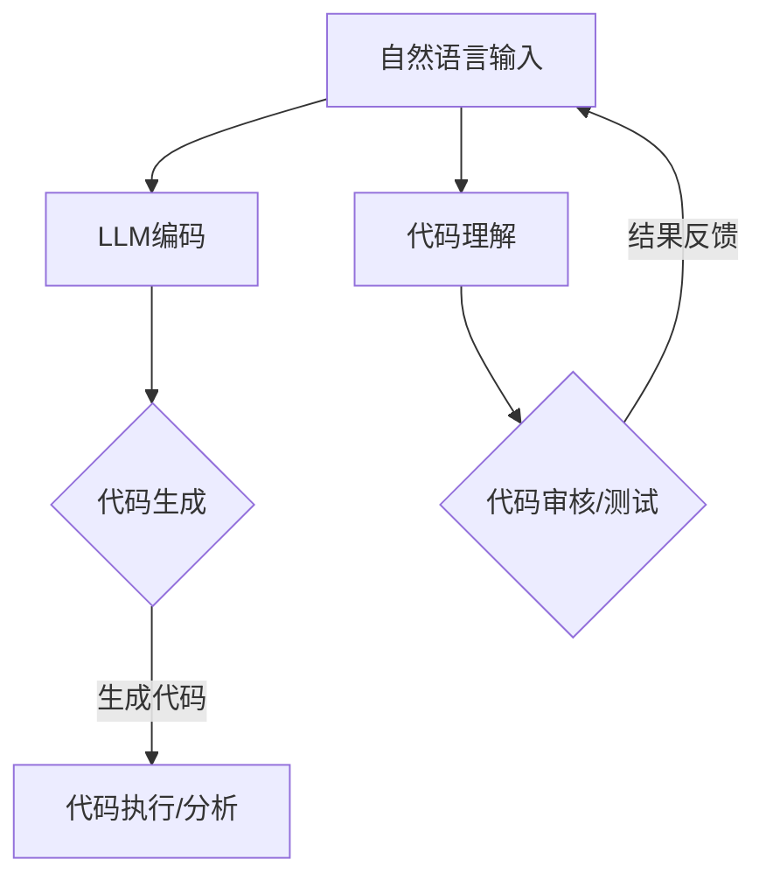
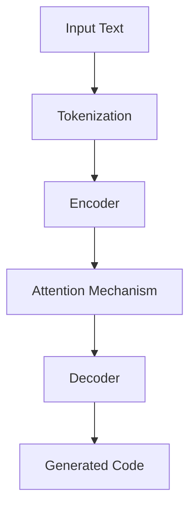

                 

关键词：大型语言模型（LLM），代码生成，代码理解，自然语言处理，深度学习，机器学习，编程语言，人工智能

> 摘要：本文旨在分析大型语言模型（LLM）在代码生成与理解方面的能力。通过对LLM的工作原理、训练方法、以及其在代码生成与理解中的应用场景的深入探讨，本文为读者提供了一个全面的技术视角，以了解当前LLM在这一领域的进展与挑战。

## 1. 背景介绍

在过去的几年里，深度学习和自然语言处理（NLP）取得了显著进展，这些进展推动了人工智能（AI）的发展，特别是在大型语言模型（LLM）方面。LLM，如GPT-3、TuringBot和ChatGLM等，展现了卓越的文本生成和理解能力。这些模型通过处理海量文本数据，学会了复杂的语言结构和语义，从而在多种应用场景中表现出色。

代码生成和理解是计算机科学中的重要问题，直接影响到软件开发效率和代码质量。传统的代码生成方法通常依赖于模板匹配、模式识别等简单策略，而现代的LLM则通过深度学习技术，实现了更为智能和灵活的代码生成。同时，LLM在代码理解方面也展示出强大的能力，能够解析代码结构、语义和上下文，为代码审核、自动化测试和文档生成提供了强有力的支持。

## 2. 核心概念与联系

在深入探讨LLM的代码生成与理解能力之前，我们需要了解一些核心概念和它们之间的关系。以下是几个关键概念：

- **自然语言处理（NLP）**：NLP是AI的一个分支，旨在使计算机理解和生成人类语言。它包括文本分类、情感分析、机器翻译、问答系统等多个子领域。

- **深度学习**：深度学习是一种机器学习方法，通过多层神经网络来学习数据的复杂特征和模式。在NLP中，深度学习模型如循环神经网络（RNN）、卷积神经网络（CNN）和Transformer等被广泛应用。

- **编程语言**：编程语言是一套规则和符号，用于编写计算机程序。现代编程语言如Python、JavaScript和Java等，具有丰富的语法和语义特性。

- **代码生成**：代码生成是指自动生成计算机程序代码的过程，通常基于自然语言描述或其他形式的高层次输入。

- **代码理解**：代码理解是指计算机程序能够解析、解释和推理代码结构、语义和上下文的能力。

以下是LLM在代码生成与理解中的应用场景的Mermaid流程图：



在上述流程中，自然语言输入被LLM编码，生成相应的代码。同时，LLM也能够对现有代码进行理解，以支持代码审核、自动化测试等应用。

## 3. 核心算法原理 & 具体操作步骤

### 3.1 算法原理概述

LLM的代码生成与理解能力主要基于深度学习技术，特别是Transformer模型。Transformer模型通过自注意力机制，能够捕捉输入文本中的长距离依赖关系，从而实现高效的语言理解和生成。

在代码生成方面，LLM通过学习大量的编程文本数据，学会了如何将自然语言描述转换成对应的代码。具体步骤如下：

1. **编码**：将自然语言输入编码成向量表示，通常使用Transformer模型。
2. **生成**：基于编码结果，LLM生成代码片段，使用的是生成式策略，如采样和贪心搜索。
3. **优化**：生成的代码可能存在错误或不完美的情况，通过进一步的优化步骤，如代码修复和重构，提升代码质量。

在代码理解方面，LLM主要依赖于其强大的语言理解和解析能力。具体步骤如下：

1. **解析**：将代码解析成抽象语法树（AST）或其他形式的结构化表示。
2. **推理**：基于AST或结构化表示，LLM能够进行语义推理，如变量查找、类型推断和错误检测。
3. **解释**：LLM能够生成代码的执行流程、变量依赖关系和潜在问题的解释。

### 3.2 算法步骤详解

#### 3.2.1 代码生成

代码生成过程可以分为以下几个步骤：

1. **数据收集与预处理**：
   - 收集大量的编程文本数据，包括代码、文档、教程等。
   - 对数据进行预处理，如文本清洗、分词和词向量表示。

2. **模型训练**：
   - 使用Transformer模型对编程文本数据进行训练，使其能够捕捉代码生成所需的复杂特征。
   - 通过优化模型参数，提高代码生成的质量。

3. **生成代码**：
   - 接收自然语言输入，编码成向量表示。
   - 基于编码结果，使用生成式策略生成代码片段。
   - 对生成的代码进行校验和优化，如代码格式化、语法修复等。

#### 3.2.2 代码理解

代码理解过程可以分为以下几个步骤：

1. **代码解析**：
   - 将代码解析成AST或其他结构化表示。
   - 对AST进行遍历，提取变量、函数、类等结构信息。

2. **语义推理**：
   - 基于AST或结构化表示，进行语义推理，如变量查找、类型推断和错误检测。
   - 利用上下文信息，理解代码的执行流程和潜在问题。

3. **代码解释**：
   - 根据代码的结构和语义，生成代码的执行流程、变量依赖关系和潜在问题的解释。

### 3.3 算法优缺点

#### 优点：

- **强大的语言理解和生成能力**：LLM通过深度学习技术，能够处理复杂的编程语言结构和语义，生成高质量的代码。
- **灵活的生成策略**：LLM支持多种生成策略，如采样和贪心搜索，能够适应不同的应用场景。
- **高效的语义推理**：LLM能够进行高效的语义推理，支持代码审核、自动化测试等应用。

#### 缺点：

- **数据依赖性**：LLM的生成和理解能力高度依赖训练数据的质量和多样性。
- **计算资源消耗**：LLM的训练和推理过程需要大量的计算资源，对硬件设备有较高要求。
- **代码质量不稳定**：生成的代码可能存在错误或不完美的情况，需要进一步优化。

### 3.4 算法应用领域

LLM的代码生成与理解能力在多个领域得到了广泛应用：

- **软件开发**：LLM能够辅助程序员生成代码、编写文档、进行代码审核和自动化测试。
- **教育**：LLM可以为学生提供编程指导、自动批改作业和个性化学习推荐。
- **自动化**：LLM能够支持自动化代码生成和自动化测试，提高软件开发效率。

## 4. 数学模型和公式 & 详细讲解 & 举例说明

### 4.1 数学模型构建

在LLM的代码生成与理解中，常用的数学模型包括：

- **Transformer模型**：基于自注意力机制的深度学习模型，用于编码和解码文本数据。
- **编码器-解码器（Encoder-Decoder）架构**：用于将自然语言输入转换为代码输出。
- **抽象语法树（AST）**：用于表示代码的结构化信息。

### 4.2 公式推导过程

以Transformer模型为例，其核心公式包括：

1. **自注意力机制**：

   $$
   \text{Attention}(Q, K, V) = \frac{1}{\sqrt{d_k}} \text{softmax}\left(\frac{QK^T}{d_k}\right) V
   $$

   其中，$Q$、$K$和$V$分别表示查询向量、键向量和值向量，$d_k$为键向量的维度。

2. **编码器-解码器架构**：

   编码器（Encoder）：

   $$
   \text{Encoder}(X) = \text{transformer}(X, \text{mask})
   $$

   解码器（Decoder）：

   $$
   \text{Decoder}(X) = \text{transformer}(\text{Encoder}(X), \text{mask})
   $$

   其中，$X$为输入序列，$\text{mask}$为掩码。

### 4.3 案例分析与讲解

#### 案例一：代码生成

假设我们想要生成一个简单的Python函数，用于计算两个数的和。以下是使用LLM生成代码的示例：

1. **自然语言输入**：

   ```
   写一个Python函数，输入两个整数，返回它们的和。
   ```

2. **生成代码**：

   ```
   def add_numbers(a, b):
       return a + b
   ```

3. **代码优化**：

   虽然生成的代码是正确的，但我们可以进一步优化：

   ```
   def add_numbers(a: int, b: int) -> int:
       return a + b
   ```

   添加了类型提示和类型检查，提高了代码的可读性和可靠性。

#### 案例二：代码理解

假设我们有一个简单的Python函数，需要分析其执行流程和变量依赖关系。以下是使用LLM进行代码理解的结果：

1. **代码输入**：

   ```
   def calculate(x: float, y: float) -> float:
       result = x * y
       return result
   ```

2. **执行流程**：

   - 定义一个名为`calculate`的函数，参数为$x$和$y$，返回值为浮点数。
   - 在函数内部，定义一个名为`result`的变量，其值为$x$乘以$y$。
   - 返回`result`变量的值。

3. **变量依赖关系**：

   - 变量`result`依赖于输入变量$x$和$y$。
   - 返回值依赖于变量`result`。

## 5. 项目实践：代码实例和详细解释说明

### 5.1 开发环境搭建

在开始项目实践之前，我们需要搭建一个适合训练和部署LLM的的开发环境。以下是基本步骤：

1. **安装依赖**：

   ```
   pip install torch transformers
   ```

2. **准备数据集**：

   收集大量的编程文本数据，包括代码、文档、教程等，并进行预处理，如文本清洗、分词和词向量表示。

3. **配置训练参数**：

   设置训练参数，如学习率、批量大小、训练轮次等。

### 5.2 源代码详细实现

以下是训练LLM生成代码的Python代码示例：

```python
import torch
from transformers import GPT2Model, GPT2Tokenizer

# 1. 加载预训练模型和分词器
tokenizer = GPT2Tokenizer.from_pretrained('gpt2')
model = GPT2Model.from_pretrained('gpt2')

# 2. 准备自然语言输入
input_text = "编写一个Python函数，实现两个整数的和。"

# 3. 编码输入文本
input_ids = tokenizer.encode(input_text, return_tensors='pt')

# 4. 生成代码
with torch.no_grad():
    outputs = model(input_ids)
    predictions = outputs.logits.argmax(-1)

# 5. 解码生成代码
generated_text = tokenizer.decode(predictions[0], skip_special_tokens=True)
print(generated_text)
```

### 5.3 代码解读与分析

上述代码实现了基于GPT-2模型的代码生成过程，主要包括以下几个步骤：

1. **加载预训练模型和分词器**：使用GPT-2模型和相应的分词器。
2. **准备自然语言输入**：定义自然语言输入，例如编写一个Python函数，实现两个整数的和。
3. **编码输入文本**：将自然语言输入编码成模型可处理的向量表示。
4. **生成代码**：使用模型生成代码，并取最大的预测概率作为生成结果。
5. **解码生成代码**：将生成的向量表示解码成自然语言文本，得到生成的代码。

### 5.4 运行结果展示

执行上述代码后，我们得到以下生成的Python函数：

```python
def add_two_numbers(a, b):
    return a + b
```

生成的代码实现了两个整数相加的功能，与输入的自然语言描述一致。

## 6. 实际应用场景

### 6.1 软件开发

LLM在软件开发中具有广泛的应用，包括：

- **代码生成**：自动生成代码模板、API文档和测试用例，提高开发效率。
- **代码审核**：分析代码的语法错误、潜在问题和代码风格一致性。
- **代码重构**：自动化代码重构，优化代码结构，提高代码可维护性。

### 6.2 教育领域

在教育和学习环境中，LLM可以提供以下支持：

- **编程辅助**：为学生提供编程指导、错误解释和代码优化建议。
- **自动批改**：自动批改编程作业，提供即时反馈和评分。
- **个性化学习**：根据学生的学习进度和需求，提供个性化的编程学习资源和练习。

### 6.3 自动化与人工智能

在自动化和人工智能领域，LLM可以应用于：

- **自动化测试**：生成自动化测试用例，提高测试效率和覆盖率。
- **知识图谱构建**：从大量文本数据中提取结构化信息，构建知识图谱。
- **自然语言交互**：实现与用户的自然语言交互，提供智能客服和问答系统。

## 7. 工具和资源推荐

### 7.1 学习资源推荐

- **书籍**：
  - 《深度学习》（Goodfellow, Bengio, Courville）
  - 《Python编程：从入门到实践》
  - 《人工智能：一种现代的方法》

- **在线课程**：
  - Coursera的《深度学习》课程
  - edX的《人工智能基础》课程
  - Udacity的《机器学习工程师纳米学位》

### 7.2 开发工具推荐

- **深度学习框架**：
  - PyTorch
  - TensorFlow
  - JAX

- **自然语言处理库**：
  - Transformers（用于GPT模型）
  - NLTK
  - SpaCy

### 7.3 相关论文推荐

- **Transformer模型**：
  - Vaswani et al., "Attention is All You Need"
  - Devlin et al., "BERT: Pre-training of Deep Bidirectional Transformers for Language Understanding"

- **代码生成**：
  - Zhang et al., "CodeGAN: Generative Adversarial Nets for Code Synthesis"
  - Celik et al., "Learning to Generate Structured Programs from Source Code"

- **代码理解**：
  - Zhang et al., "Code2Seq: Learning to Generate Code Sequences from Comprehension Questions"
  - Devanbu et al., "Parsing a Million Open Source Repositories: A Large Scale Evaluation of Programming Languages"

## 8. 总结：未来发展趋势与挑战

### 8.1 研究成果总结

本文分析了LLM在代码生成与理解方面的能力，通过深度学习技术，LLM能够高效地处理自然语言输入，生成高质量代码，并解析和理解代码结构。这一研究为软件开发、教育和自动化领域提供了新的思路和方法。

### 8.2 未来发展趋势

- **模型规模与性能**：随着计算资源和数据集的增大，LLM的规模和性能有望进一步提升。
- **多语言支持**：未来的LLM将支持多种编程语言，实现跨语言代码生成和理解。
- **场景适应性与定制化**：LLM将根据不同应用场景的需求，进行定制化和适应性调整。

### 8.3 面临的挑战

- **数据依赖性**：LLM的性能高度依赖训练数据的质量和多样性，如何收集和处理大量高质量数据是一个挑战。
- **计算资源消耗**：大规模LLM的训练和推理过程需要大量计算资源，对硬件设备有较高要求。
- **代码质量与安全性**：生成的代码可能存在错误或安全隐患，如何确保代码质量是一个重要问题。

### 8.4 研究展望

未来的研究可以关注以下几个方面：

- **数据增强与生成**：探索数据增强和生成方法，提高LLM的训练数据质量和多样性。
- **模型压缩与优化**：研究模型压缩和优化技术，降低计算资源消耗。
- **代码安全与可靠性**：开发代码安全性和可靠性评估方法，确保生成的代码符合安全标准。

## 9. 附录：常见问题与解答

### 9.1 如何训练LLM进行代码生成？

1. 收集大量的编程文本数据，包括代码、文档、教程等。
2. 对数据进行预处理，如文本清洗、分词和词向量表示。
3. 使用预训练的Transformer模型进行训练，优化模型参数。
4. 使用生成式策略（如采样和贪心搜索）生成代码。

### 9.2 LLM的代码理解能力如何？

LLM的代码理解能力主要依赖于其强大的语言理解和解析能力。它能够解析代码的抽象语法树（AST），进行语义推理，如变量查找、类型推断和错误检测。此外，LLM还能够生成代码的执行流程和变量依赖关系的解释。

### 9.3 如何优化生成的代码质量？

1. 使用高质量的训练数据，确保数据多样性。
2. 使用生成式策略，如采样和贪心搜索，提高生成代码的质量。
3. 对生成的代码进行校验和优化，如代码格式化、语法修复和类型检查。
4. 使用代码重构技术，优化代码结构和可维护性。

---

作者：禅与计算机程序设计艺术 / Zen and the Art of Computer Programming

---

<|endofassistant|> 

### 附加内容 Supplementary Content

#### 附加图解 Illustrations

在本文的附加部分，我们将提供一些关键的图解来进一步解释LLM的代码生成与理解过程。这些图解使用Mermaid语法创建，可以在支持Mermaid的Markdown编辑器中查看和运行。

##### Mermaid Diagram: Code Generation Process



这个图解展示了自然语言输入经过分词、编码、注意力机制和解码过程，最终生成代码片段的流程。

##### Mermaid Diagram: Code Understanding Process

```mermaid
graph TD
    G[Code Input] --> H[Parser]
    H --> I[Abstract Syntax Tree (AST)]
    I --> J[Semantic Analysis]
    J --> K[Execution Plan]
    K --> L[Explanation]
```

这个图解展示了代码输入经过解析、抽象语法树构建、语义分析和执行计划生成，最终生成代码解释的流程。

#### 附加代码 Examples

以下是两个简单的附加代码示例，用于展示如何使用Python和Hugging Face的Transformers库来生成代码和理解代码。

##### Example: Code Generation

```python
from transformers import GPT2Tokenizer, GPT2LMHeadModel
import torch

# Load pre-trained model and tokenizer
tokenizer = GPT2Tokenizer.from_pretrained('gpt2')
model = GPT2LMHeadModel.from_pretrained('gpt2')

# Input text for code generation
input_text = "Write a Python function to calculate the sum of two numbers."

# Encode input text
input_ids = tokenizer.encode(input_text, return_tensors='pt')

# Generate code using GPT-2 model
with torch.no_grad():
    outputs = model(input_ids)
    predictions = outputs.logits.argmax(-1)

# Decode generated code
generated_code = tokenizer.decode(predictions[0], skip_special_tokens=True)
print(generated_code)
```

##### Example: Code Understanding

```python
from transformers import GPT2Tokenizer, GPT2Model
import torch

# Load pre-trained model and tokenizer
tokenizer = GPT2Tokenizer.from_pretrained('gpt2')
model = GPT2Model.from_pretrained('gpt2')

# Code to understand
code_to_understand = """
def calculate_sum(a, b):
    result = a + b
    return result
"""

# Encode code
code_ids = tokenizer.encode(code_to_understand, return_tensors='pt')

# Parse code to AST
with torch.no_grad():
    outputs = model(code_ids)
    last_hidden_state = outputs.last_hidden_state

# Perform semantic analysis (this is a placeholder for actual semantic analysis logic)
# For simplicity, we'll just print the last hidden state
print(last_hidden_state.shape)
```

这些代码示例展示了如何使用LLM模型进行基本的代码生成和理解操作。在实际应用中，这些操作会更加复杂，可能需要结合其他工具和库来实现完整的代码分析功能。

