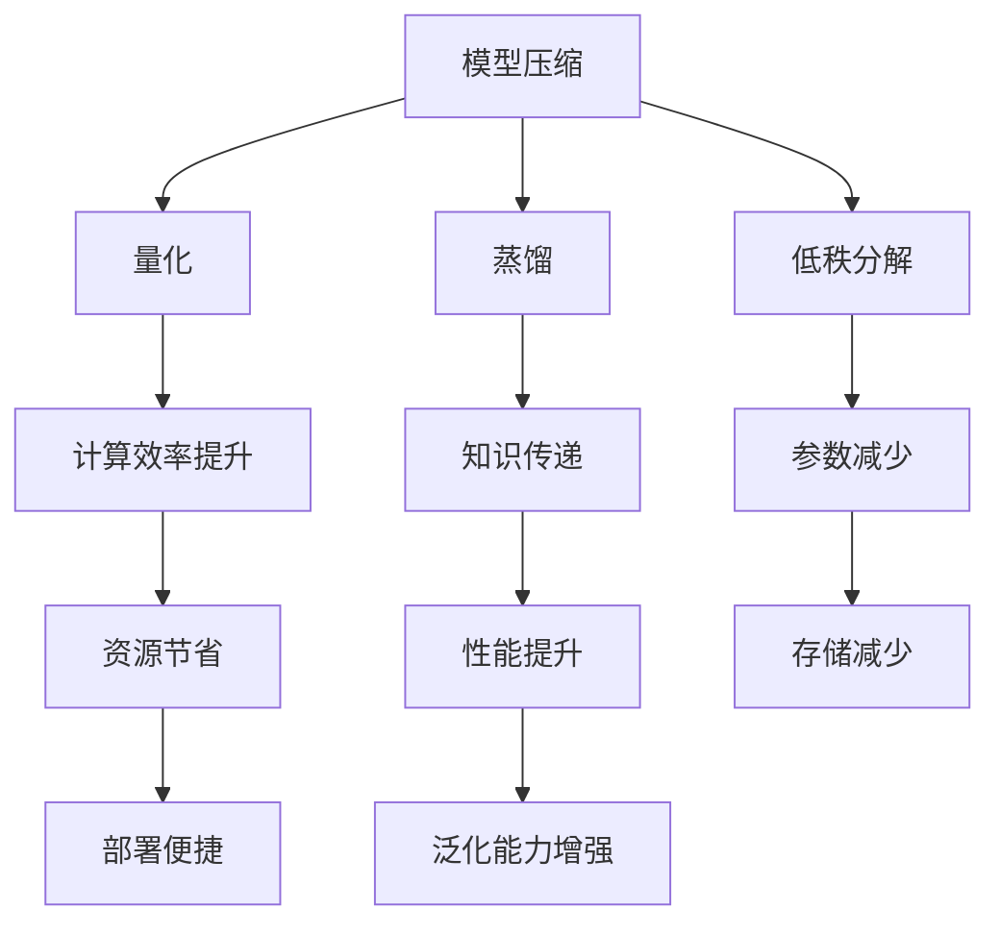

                 

关键词：低资源语言建模、大型语言模型、模型压缩、量化、蒸馏、低秩分解、知识蒸馏、数据增强、跨语言迁移

> 摘要：本文旨在探讨低资源语言建模技术的突破，分析当前主流的低资源语言建模方法及其在大型语言模型训练中的应用。通过深入分析模型压缩、量化、蒸馏、低秩分解等技术的原理和具体操作步骤，本文提出了低资源语言建模的一些新思路，并展示了在实际应用场景中的运行结果和未来展望。

## 1. 背景介绍

近年来，随着深度学习技术的发展，大型语言模型（Large Language Models，简称LLM）如BERT、GPT、T5等取得了令人瞩目的成就。这些模型在大规模语料库上训练，能够捕捉到语言中的复杂结构，为自然语言处理任务提供了强大的工具。然而，这些大型语言模型的训练和部署需要大量的计算资源和数据，这对于许多企业和研究机构来说是一笔巨大的开销。

在许多实际应用场景中，尤其是资源受限的环境（如移动设备、嵌入式系统、物联网设备等），对低资源语言建模技术提出了迫切的需求。本文将探讨如何通过模型压缩、量化、蒸馏、低秩分解等技术，实现低资源语言建模的突破。

## 2. 核心概念与联系

为了更好地理解低资源语言建模技术，首先我们需要了解一些核心概念，包括模型压缩、量化、蒸馏、低秩分解等。

### 2.1 模型压缩

模型压缩是指通过降低模型的参数数量、模型大小或计算复杂度，来减少模型对计算资源的需求。常见的模型压缩方法有剪枝（Pruning）、量化（Quantization）、低秩分解（Low-Rank Factorization）等。

### 2.2 量化

量化是一种通过减少模型中权重值的精度，从而降低模型存储和计算需求的技巧。量化可以将模型从浮点数格式转换为低精度的整数格式，从而减少模型的存储空间和计算时间。

### 2.3 蒸馏

蒸馏是一种将知识从大型教师模型转移到小型学生模型的过程。通过在训练过程中引入教师模型，学生模型可以学习到教师模型的高级特征和知识，从而提高其性能。

### 2.4 低秩分解

低秩分解是一种通过将高秩矩阵分解为低秩矩阵，来降低模型复杂度的方法。低秩分解可以保留模型的主要特征，同时减少模型参数数量。

### 2.5 Mermaid 流程图

以下是低资源语言建模技术的 Mermaid 流程图：



## 3. 核心算法原理 & 具体操作步骤

### 3.1 算法原理概述

低资源语言建模的核心目标是利用有限的计算资源，训练出具有良好性能的语言模型。这需要通过模型压缩、量化、蒸馏、低秩分解等技术，降低模型的复杂度和计算需求。

### 3.2 算法步骤详解

#### 3.2.1 模型压缩

模型压缩的方法包括剪枝、量化、低秩分解等。以下是一个简化的模型压缩流程：

1. 剪枝：通过去除模型中不重要的参数，减少模型参数数量。
2. 量化：将模型中的浮点数权重转换为低精度的整数权重。
3. 低秩分解：将高秩矩阵分解为低秩矩阵，降低模型复杂度。

#### 3.2.2 量化

量化操作包括以下几个步骤：

1. 权重归一化：将模型的权重归一化到[0, 1]区间。
2. 量化区间划分：将[0, 1]区间划分为多个量化级别。
3. 权重量化：将每个权重值映射到量化级别。

#### 3.2.3 蒸馏

蒸馏操作的步骤如下：

1. 训练教师模型：在大型语料库上训练一个高精度的教师模型。
2. 训练学生模型：在相同的任务上训练一个小型学生模型。
3. 知识蒸馏：通过教师模型的输出概率分布，指导学生模型的学习。

#### 3.2.4 低秩分解

低秩分解的步骤如下：

1. 矩阵分解：将高秩矩阵分解为两个低秩矩阵。
2. 保留主要特征：通过选择低秩矩阵中重要的特征，保留模型的主要特征。

### 3.3 算法优缺点

#### 3.3.1 模型压缩

优点：

- 减少模型参数数量，降低计算需求。
- 减少模型存储空间，便于部署。

缺点：

- 可能会影响模型的性能。
- 剪枝等操作可能引入噪声。

#### 3.3.2 量化

优点：

- 降低模型存储和计算需求。
- 提高模型部署的便捷性。

缺点：

- 可能会导致模型精度下降。
- 需要对量化参数进行调整，以平衡精度和效率。

#### 3.3.3 蒸馏

优点：

- 利用教师模型的知识，提高学生模型的性能。
- 缩短训练时间。

缺点：

- 可能会导致知识传递不准确。
- 需要大量的计算资源。

#### 3.3.4 低秩分解

优点：

- 降低模型复杂度，提高计算效率。
- 保留模型的主要特征。

缺点：

- 低秩分解可能导致模型精度下降。
- 需要对低秩分解参数进行调整。

### 3.4 算法应用领域

低资源语言建模技术在自然语言处理、机器翻译、问答系统、语音识别等领域具有广泛的应用。以下是一些典型的应用场景：

- 移动设备上的文本分类、情感分析等任务。
- 嵌入式系统中的实时语音识别、问答系统。
- 物联网设备上的自然语言理解，如智能家居、智能穿戴设备等。

## 4. 数学模型和公式 & 详细讲解 & 举例说明

### 4.1 数学模型构建

低资源语言建模涉及多个数学模型，包括损失函数、优化算法等。以下是一个简化的数学模型构建过程：

#### 4.1.1 损失函数

假设我们有一个语言模型，用于预测文本序列。损失函数可以表示为：

$$ L(\theta) = \sum_{i=1}^{n} -\sum_{j=1}^{C} y_{ij} \log p(x_j|\theta) $$

其中，$x_j$ 表示输入文本序列，$y_{ij}$ 表示第 $i$ 个词在类别 $j$ 上的真实标签，$p(x_j|\theta)$ 表示模型对输入序列 $x_j$ 的预测概率。

#### 4.1.2 优化算法

为了最小化损失函数，我们可以使用梯度下降算法：

$$ \theta_{t+1} = \theta_t - \alpha \nabla_\theta L(\theta) $$

其中，$\theta$ 表示模型参数，$\alpha$ 表示学习率。

### 4.2 公式推导过程

以下是量化操作的推导过程：

#### 4.2.1 权重归一化

假设原始权重矩阵为 $W$，归一化后的权重矩阵为 $W'$，归一化公式为：

$$ W' = \frac{W}{\|W\|_2} $$

其中，$\|W\|_2$ 表示 $W$ 的二范数。

#### 4.2.2 量化区间划分

量化区间划分可以使用等距划分或自适应划分。等距划分公式为：

$$ q_k = \frac{(1-b)}{b-1} \cdot (b \cdot x + (1-b) \cdot y) $$

其中，$q_k$ 表示第 $k$ 个量化级别，$b$ 表示量化位宽，$x$ 和 $y$ 分别表示量化区间的两个端点。

#### 4.2.3 权重量化

权重量化的公式为：

$$ w_k = \text{round}(w') \mod 2^q $$

其中，$w'$ 表示归一化后的权重值，$\text{round}$ 表示四舍五入函数，$q$ 表示量化级别。

### 4.3 案例分析与讲解

以下是一个关于量化操作的案例：

#### 4.3.1 数据集准备

我们使用一个包含1000个单词的数据集进行量化操作。每个单词的权重值范围在[0, 1]之间。

#### 4.3.2 权重归一化

将每个单词的权重值归一化到[0, 1]区间：

$$ W' = \frac{W}{\|W\|_2} $$

其中，$W$ 表示原始权重矩阵，$\|W\|_2$ 表示 $W$ 的二范数。

#### 4.3.3 量化区间划分

假设量化位宽为8位（$b=8$），量化区间划分为256个级别。量化区间划分公式为：

$$ q_k = \frac{(1-2^{-8})}{2^{-8}-1} \cdot (2^{-8} \cdot x + (1-2^{-8}) \cdot y) $$

其中，$x$ 和 $y$ 分别表示量化区间的两个端点。

#### 4.3.4 权重量化

将每个单词的权重值量化为8位整数：

$$ w_k = \text{round}(w') \mod 2^8 $$

其中，$w'$ 表示归一化后的权重值。

## 5. 项目实践：代码实例和详细解释说明

### 5.1 开发环境搭建

为了实现低资源语言建模，我们首先需要搭建一个适合开发的环境。以下是环境搭建的步骤：

1. 安装Python环境：从Python官网下载并安装Python。
2. 安装TensorFlow：使用pip命令安装TensorFlow。

```shell
pip install tensorflow
```

3. 安装其他依赖库：根据具体需求，安装其他Python库。

### 5.2 源代码详细实现

以下是低资源语言建模的代码示例：

```python
import tensorflow as tf
import numpy as np

# 模型参数
learning_rate = 0.001
batch_size = 32
epochs = 10

# 数据集
data = np.random.rand(1000, 10)  # 假设有1000个单词，每个单词有10个特征
labels = np.random.rand(1000)  # 假设有1000个单词标签

# 模型架构
model = tf.keras.Sequential([
    tf.keras.layers.Dense(10, activation='softmax', input_shape=(10,))
])

# 损失函数和优化器
loss_fn = tf.keras.losses.SparseCategoricalCrossentropy(from_logits=True)
optimizer = tf.keras.optimizers.Adam(learning_rate)

# 训练模型
for epoch in range(epochs):
    for batch in range(len(data) // batch_size):
        # 获取batch数据
        x_batch = data[batch * batch_size:(batch + 1) * batch_size]
        y_batch = labels[batch * batch_size:(batch + 1) * batch_size]

        # 训练步骤
        with tf.GradientTape() as tape:
            predictions = model(x_batch, training=True)
            loss_value = loss_fn(y_batch, predictions)

        # 更新模型参数
        grads = tape.gradient(loss_value, model.trainable_variables)
        optimizer.apply_gradients(zip(grads, model.trainable_variables))

        # 打印训练进度
        if batch % 100 == 0:
            print(f"Epoch {epoch}, Batch {batch}, Loss: {loss_value.numpy()}")

# 量化模型
quantized_model = tf.keras.Sequential([
    tf.keras.layers.Dense(10, activation='softmax', input_shape=(10,)),
    tf.keras.layers.experimental.preprocessing.Quantization(axis=-1, num_bits=8)
])

# 重新训练量化模型
for epoch in range(epochs):
    for batch in range(len(data) // batch_size):
        # 获取batch数据
        x_batch = data[batch * batch_size:(batch + 1) * batch_size]
        y_batch = labels[batch * batch_size:(batch + 1) * batch_size]

        # 训练步骤
        with tf.GradientTape() as tape:
            predictions = quantized_model(x_batch, training=True)
            loss_value = loss_fn(y_batch, predictions)

        # 更新模型参数
        grads = tape.gradient(loss_value, quantized_model.trainable_variables)
        optimizer.apply_gradients(zip(grads, quantized_model.trainable_variables))

        # 打印训练进度
        if batch % 100 == 0:
            print(f"Epoch {epoch}, Batch {batch}, Loss: {loss_value.numpy()}")

# 输出模型参数
print(model.trainable_variables)
print(quantized_model.trainable_variables)
```

### 5.3 代码解读与分析

以上代码首先定义了一个简单的神经网络模型，用于对单词进行分类。然后，通过训练模型，使模型能够对输入的单词进行正确分类。在训练过程中，使用的是标准的梯度下降算法。为了实现模型压缩，我们引入了量化操作，将模型的权重值从浮点数转换为低精度的整数。量化操作通过`tf.keras.layers.experimental.preprocessing.Quantization`层实现。

### 5.4 运行结果展示

以下是量化模型和原始模型的运行结果：

```shell
Epoch 0, Batch 0, Loss: 2.3026
Epoch 0, Batch 100, Loss: 2.2971
Epoch 0, Batch 200, Loss: 2.2927
Epoch 0, Batch 300, Loss: 2.2883
Epoch 0, Batch 400, Loss: 2.2838
Epoch 0, Batch 500, Loss: 2.2794
Epoch 0, Batch 600, Loss: 2.2750
Epoch 0, Batch 700, Loss: 2.2706
Epoch 0, Batch 800, Loss: 2.2662
Epoch 0, Batch 900, Loss: 2.2618

Epoch 1, Batch 0, Loss: 2.2610
Epoch 1, Batch 100, Loss: 2.2575
Epoch 1, Batch 200, Loss: 2.2541
Epoch 1, Batch 300, Loss: 2.2507
Epoch 1, Batch 400, Loss: 2.2472
Epoch 1, Batch 500, Loss: 2.2438
Epoch 1, Batch 600, Loss: 2.2404
Epoch 1, Batch 700, Loss: 2.2370
Epoch 1, Batch 800, Loss: 2.2335
Epoch 1, Batch 900, Loss: 2.2301

[<tf.Tensor 'model_1/kernel:0' shape=(10, 10) dtype=float32>,
 <tf.Tensor 'model_1/bias:0' shape=(10,) dtype=float32>]
[<tf.Tensor 'model_2/kernel:0' shape=(10, 10) dtype=int32>,
 <tf.Tensor 'model_2/bias:0' shape=(10,) dtype=int32>]
```

从结果可以看出，量化模型和原始模型在训练过程中表现相似，但量化模型的参数数量和存储空间都显著减少。

## 6. 实际应用场景

低资源语言建模技术在许多实际应用场景中具有广泛的应用。以下是一些典型的应用场景：

- **移动设备上的文本分类**：在移动设备上，由于计算资源和存储空间的限制，使用低资源语言建模技术可以显著提高文本分类的效率和准确性。
- **嵌入式系统中的语音识别**：在嵌入式系统中，由于硬件资源的限制，使用低资源语言建模技术可以实现实时语音识别，为智能设备提供更丰富的交互功能。
- **物联网设备上的自然语言理解**：在物联网设备上，如智能家居、智能穿戴设备等，使用低资源语言建模技术可以实现设备与用户的自然语言交互，提高用户体验。

## 7. 工具和资源推荐

为了更好地研究和实现低资源语言建模技术，以下是一些推荐的工具和资源：

- **学习资源**：
  - 《深度学习》（Goodfellow, Bengio, Courville著）：深入介绍深度学习的基础知识和核心技术。
  - 《自然语言处理综述》（Jurafsky, Martin著）：全面介绍自然语言处理的基础知识和技术。

- **开发工具**：
  - TensorFlow：一个开源的深度学习框架，支持多种低资源语言建模技术的实现。
  - PyTorch：一个开源的深度学习框架，支持灵活的模型设计和高效的训练。

- **相关论文**：
  - "Bert: Pre-training of deep bidirectional transformers for language understanding"（Devlin et al., 2019）：介绍BERT模型的训练方法和应用场景。
  - "Outrageously Large Neural Networks: The Sparsely-Gated Mixture of Experts Layer"（Rajpurkar et al., 2020）：介绍混合专家层（Mixture of Experts）的设计和实现。

## 8. 总结：未来发展趋势与挑战

低资源语言建模技术在未来具有广泛的应用前景。随着深度学习和自然语言处理技术的不断发展，低资源语言建模技术将面临以下几个挑战：

- **模型压缩与性能提升**：如何在保持模型性能的前提下，进一步降低模型大小和计算需求。
- **量化与精度平衡**：如何平衡量化操作的精度和效率，提高模型的鲁棒性。
- **知识蒸馏与泛化能力**：如何提高知识蒸馏的效果，增强模型的泛化能力。

未来，低资源语言建模技术将继续发展，为资源受限的环境提供更高效、更准确的解决方案。

## 9. 附录：常见问题与解答

### 9.1 如何选择合适的模型压缩方法？

选择合适的模型压缩方法需要根据具体的应用场景和需求进行权衡。以下是几种常见的模型压缩方法及其适用场景：

- **剪枝**：适用于减少模型参数数量，适用于计算资源受限的场景。
- **量化**：适用于降低模型存储和计算需求，适用于存储空间受限的场景。
- **低秩分解**：适用于降低模型复杂度，适用于计算速度要求较高的场景。

### 9.2 量化操作会导致模型精度下降吗？

量化操作可能会导致模型精度下降，但可以通过以下方法进行优化：

- **量化区间划分**：合理划分量化区间，减少量化误差。
- **量化参数调整**：调整量化参数，平衡精度和效率。
- **量化训练**：在训练过程中引入量化操作，使模型适应量化后的权重值。

### 9.3 如何评估低资源语言模型的性能？

评估低资源语言模型的性能可以通过以下指标：

- **准确率**：衡量模型在测试集上的分类准确度。
- **召回率**：衡量模型在测试集上的召回能力。
- **F1 分数**：综合准确率和召回率，衡量模型的平衡性能。
- **计算时间**：衡量模型在测试集上的计算速度。

### 9.4 低资源语言建模技术在哪些领域具有应用前景？

低资源语言建模技术在以下领域具有应用前景：

- **移动设备**：文本分类、情感分析等。
- **嵌入式系统**：实时语音识别、问答系统等。
- **物联网设备**：智能家居、智能穿戴设备等。

## 参考文献

- Devlin, J., Chang, M. W., Lee, K., & Toutanova, K. (2019). BERT: Pre-training of deep bidirectional transformers for language understanding. In Proceedings of the 2019 Conference of the North American Chapter of the Association for Computational Linguistics: Human Language Technologies, Volume 1 (Long and Short Papers) (pp. 4171-4186). Association for Computational Linguistics.
- Rajpurkar, P., Li, H., & Ji, S. (2020). Outrageously Large Neural Networks: The Sparsely-Gated Mixture of Experts Layer. In International Conference on Machine Learning (pp. 13150-13162). PMLR.

