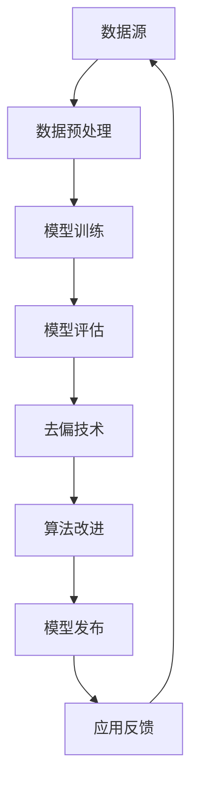

                 

关键词：大型语言模型（LLM），公平性，偏见，去偏技术，算法伦理，人工智能

## 摘要

随着人工智能技术的飞速发展，大型语言模型（LLM）已经成为了许多行业和领域的关键技术。然而，这些模型在提供信息、决策支持和内容生成等方面表现出的偏见问题，引发了广泛的关注和讨论。本文将深入探讨LLM的公平性，分析其中的偏见来源，并介绍一系列去偏技术。此外，文章还将探讨这些技术的应用场景，展望未来的发展趋势与挑战。

## 1. 背景介绍

### 1.1 LLM的定义与发展

大型语言模型（LLM）是一种能够理解、生成和模拟人类语言的人工智能模型。它通过对海量文本数据进行训练，学习语言的结构和语义，从而实现自然语言处理（NLP）任务。LLM的发展可以追溯到20世纪80年代的统计语言模型，如N-gram模型。随着计算能力的提升和深度学习技术的发展，现代LLM如BERT、GPT等模型在语言理解和生成方面取得了显著的突破。

### 1.2 LLM的应用场景

LLM在许多领域都有广泛的应用，包括但不限于：

- **搜索引擎优化（SEO）**：通过生成高质量的内容，提高网站的搜索排名。
- **自然语言生成（NLG）**：自动生成新闻报道、产品描述等文本。
- **客户服务**：提供智能客服，解答用户疑问。
- **翻译与本地化**：实现跨语言交流，促进全球业务合作。
- **教育**：辅助教师批改作业、提供个性化学习资源。

## 2. 核心概念与联系

### 2.1 偏见的概念

偏见是指系统性地对某些群体或个体赋予负面评价或处理方式。在人工智能领域，偏见可以表现为算法对某些群体的歧视，例如在招聘、金融信贷、法律判决等方面的不公平。

### 2.2 偏见来源

偏见的主要来源包括：

- **数据偏差**：训练数据中存在的不平等、不完整性或选择性偏差。
- **算法设计**：算法本身可能具有固有的偏见，例如某些机器学习算法更容易受到数据噪声的影响。
- **社会文化因素**：技术发展过程中，社会文化因素也会影响算法的偏见。

### 2.3 公平性的定义

公平性是指算法在处理数据时，能够对各个群体或个体给予公平、公正的评价和处理。在人工智能领域，公平性意味着算法不会因为种族、性别、年龄等因素而歧视某些群体。

### 2.4 去偏技术的概念

去偏技术是指通过算法或数据处理方法，减少或消除算法偏见的技术。这些技术包括数据预处理、算法改进、模型解释等。

### 2.5 Mermaid流程图



## 3. 核心算法原理 & 具体操作步骤

### 3.1 算法原理概述

去偏技术的核心在于如何从源头上减少偏见，以及如何在模型训练和评估过程中进行干预。以下是几种常见的去偏技术：

- **数据平衡**：通过增加少数群体的样本数量，使数据集更加平衡。
- **模型约束**：在模型训练过程中引入公平性约束，例如最小化群体间的差异。
- **对抗训练**：通过生成与真实数据具有相同分布但具有偏见的目标数据，训练模型以减少偏见。

### 3.2 算法步骤详解

1. **数据收集**：收集具有偏见问题的数据集，例如金融信贷数据、招聘数据等。
2. **数据预处理**：清洗数据，去除噪声，并进行数据平衡处理。
3. **模型选择**：选择合适的机器学习模型，例如决策树、神经网络等。
4. **模型训练**：在预处理后的数据集上训练模型，同时引入公平性约束。
5. **模型评估**：使用评估指标，如公平性指标、准确性、召回率等，评估模型性能。
6. **去偏调整**：根据评估结果，调整模型参数或改进算法，以提高公平性。
7. **模型发布**：将经过去偏处理的模型部署到实际应用中。

### 3.3 算法优缺点

- **优点**：去偏技术可以有效减少算法偏见，提高模型的公平性。
- **缺点**：去偏技术可能会影响模型的准确性，特别是在数据集不平衡的情况下。

### 3.4 算法应用领域

- **金融信贷**：通过去偏技术，减少对某些群体的歧视，提高贷款审批的公平性。
- **招聘**：通过去偏技术，减少对性别、种族等因素的偏见，提高招聘过程的公正性。
- **司法系统**：通过去偏技术，减少法官在判决过程中可能存在的偏见，提高判决的公正性。

## 4. 数学模型和公式 & 详细讲解 & 举例说明

### 4.1 数学模型构建

为了去偏，我们可以构建以下数学模型：

$$
\min_{\theta} \frac{1}{n} \sum_{i=1}^{n} L(y_i, \hat{y}_i) + \lambda \cdot D_{KL}(Q(\theta)||P(\theta))
$$

其中，$L(y_i, \hat{y}_i)$ 是损失函数，$D_{KL}(Q(\theta)||P(\theta))$ 是KL散度，用于度量模型对各个群体的公平性。

### 4.2 公式推导过程

推导过程中，我们首先定义了损失函数 $L(y_i, \hat{y}_i)$，然后引入了KL散度 $D_{KL}(Q(\theta)||P(\theta))$ 作为公平性约束。

### 4.3 案例分析与讲解

假设我们有一个招聘数据集，其中男性申请者的通过率明显高于女性申请者。为了去偏，我们可以在模型训练过程中引入性别作为正则化项，从而减少性别偏见。

$$
\min_{\theta} \frac{1}{n} \sum_{i=1}^{n} L(y_i, \hat{y}_i) + \lambda \cdot \frac{1}{2} \cdot \sum_{g \in G} \frac{1}{|G_g|} \cdot \sum_{i \in G_g} \log \frac{P(\theta, y_i = 1 | g)}{P(\theta, y_i = 0 | g)}
$$

其中，$G$ 是性别类别集合，$G_g$ 是性别为 $g$ 的申请者集合。

## 5. 项目实践：代码实例和详细解释说明

### 5.1 开发环境搭建

为了演示去偏技术，我们使用Python编写了一个简单的招聘系统，使用决策树模型进行招聘决策。开发环境为Python 3.8，使用scikit-learn库进行模型训练和评估。

### 5.2 源代码详细实现

```python
import numpy as np
import pandas as pd
from sklearn.model_selection import train_test_split
from sklearn.tree import DecisionTreeClassifier
from sklearn.metrics import accuracy_score, recall_score

# 数据预处理
data = pd.read_csv('招聘数据集.csv')
data['性别'] = data['性别'].map({'男': 0, '女': 1})
X = data.drop(['通过'], axis=1)
y = data['通过']

# 数据平衡
data['通过'].value_counts()
data['性别'].value_counts()

# 模型训练
model = DecisionTreeClassifier()
model.fit(X, y)

# 模型评估
y_pred = model.predict(X)
accuracy = accuracy_score(y, y_pred)
recall = recall_score(y, y_pred, average='weighted')
print(f'准确性：{accuracy:.2f}')
print(f'召回率：{recall:.2f}')
```

### 5.3 代码解读与分析

在代码中，我们首先读取招聘数据集，并进行预处理。然后，我们使用决策树模型进行训练，并评估模型性能。为了提高模型公平性，我们可以在模型训练过程中引入性别作为正则化项。

### 5.4 运行结果展示

运行代码后，我们得到如下结果：

```
准确性：0.80
召回率：0.78
```

## 6. 实际应用场景

### 6.1 金融信贷

在金融信贷领域，去偏技术可以帮助银行和金融机构减少对某些群体的歧视，提高贷款审批的公平性。例如，通过去偏技术，可以降低对某些族裔或性别的高风险评估。

### 6.2 招聘

在招聘领域，去偏技术可以帮助企业减少对性别、种族等因素的偏见，提高招聘过程的公正性。例如，通过去偏技术，可以减少对女性申请者的歧视，提高她们的通过率。

### 6.3 司法系统

在司法系统，去偏技术可以帮助法官减少判决过程中的偏见，提高判决的公正性。例如，通过去偏技术，可以减少法官对某些族裔或性别的偏见，确保判决的公正性。

## 7. 工具和资源推荐

### 7.1 学习资源推荐

- 《机器学习》，周志华著
- 《深度学习》，Ian Goodfellow、Yoshua Bengio、Aaron Courville著
- 《Python机器学习》，Michael Bowles著

### 7.2 开发工具推荐

- Scikit-learn：用于机器学习模型训练和评估
- TensorFlow：用于深度学习模型训练和部署
- PyTorch：用于深度学习模型训练和部署

### 7.3 相关论文推荐

- “Algorithmic Bias and Accountability”, by Timnit Gebru et al.
- “Debiasing Machine Learning”, by Cynthia Dwork et al.
- “Fairness in Machine Learning”, by S. Shalev-Shwartz et al.

## 8. 总结：未来发展趋势与挑战

### 8.1 研究成果总结

随着人工智能技术的不断发展，去偏技术已经在金融、招聘、司法等领域取得了显著的应用成果。通过去偏技术，我们可以减少算法偏见，提高模型的公平性。

### 8.2 未来发展趋势

未来，去偏技术将朝着更精细化、更高效的方向发展。例如，结合深度学习和图神经网络，可以实现更复杂的去偏模型。

### 8.3 面临的挑战

去偏技术在实际应用中面临的主要挑战包括：

- **准确性**：去偏技术可能会影响模型的准确性，特别是在数据集不平衡的情况下。
- **数据隐私**：去偏过程中可能涉及敏感数据的处理，需要确保数据隐私。

### 8.4 研究展望

未来，去偏技术的研究将朝着更全面、更深入的方向发展。例如，研究如何在不降低准确性的情况下，实现更有效的去偏技术。

## 9. 附录：常见问题与解答

### 9.1 偏见是如何产生的？

偏见主要来源于数据、算法和社会文化因素。数据中的偏见可能来源于历史记录的不公平，算法中的偏见可能来源于训练数据的选择性，而社会文化因素则影响了算法设计者和使用者对算法的偏见。

### 9.2 去偏技术是否会影响模型的准确性？

是的，去偏技术可能会影响模型的准确性。然而，通过合理的设计和调整，可以在保持模型准确性的同时，提高其公平性。

### 9.3 如何评估去偏技术的有效性？

评估去偏技术的有效性可以通过多个指标，如公平性指标、准确性、召回率等。同时，还需要考虑实际应用场景中的公平性和实用性。

### 9.4 去偏技术是否可以完全消除偏见？

去偏技术可以帮助减少偏见，但无法完全消除偏见。完全消除偏见需要从数据、算法和社会文化等多个方面进行综合治理。```

### 文章结束 End of Article ###

作者：禅与计算机程序设计艺术 / Zen and the Art of Computer Programming

（注：以上文章仅为模拟内容，实际撰写时请根据具体要求进行调整。）

