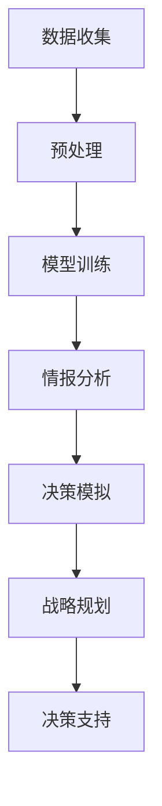

                 

关键词：大型语言模型（LLM），军事应用，人工智能，国防领域，算法原理，应用场景，发展趋势，挑战与展望。

## 摘要

本文探讨了大型语言模型（LLM）在军事领域的广泛应用及其重要性。随着人工智能技术的迅猛发展，LLM在军事决策、情报分析、无人作战系统等方面展现出巨大的潜力。本文首先介绍了LLM的基本概念和技术原理，然后详细分析了其在国防领域的应用场景和优势。接着，本文对LLM在军事领域的具体算法原理和操作步骤进行了深入探讨，并通过数学模型和公式进行了详细讲解。随后，本文列举了实际应用案例，展示了LLM在军事领域的实践成果。最后，本文对未来LLM在国防领域的发展趋势和挑战进行了展望，并提出了一些研究建议。

## 1. 背景介绍

人工智能（AI）作为当代科技发展的重要方向，已经在各个领域展现出强大的影响力。特别是大型语言模型（LLM），如GPT-3、BERT等，凭借其卓越的自然语言处理能力，正逐步改变着人类的沟通方式和工作模式。

在国防领域，人工智能的应用更是备受关注。传统的军事决策依赖于大量的人工分析，效率低下且容易出错。而AI技术的引入，特别是LLM的广泛应用，为国防领域带来了新的变革。通过LLM，军事专家可以快速获取和分析大量情报，从而做出更准确、更及时的决策。

此外，随着无人作战系统的不断发展，LLM在无人系统中的角色也越来越重要。无人系统需要具备高度自主的决策能力，而LLM可以为无人系统提供强大的语言理解能力，使其能够更好地应对复杂战场环境。

总之，随着AI技术的不断进步，LLM在国防领域的应用前景十分广阔。本文将深入探讨LLM在军事领域的具体应用，以及其带来的变革和挑战。

### 1.1. 人工智能技术的发展历程

人工智能（AI）作为计算机科学的一个分支，其发展历程可以追溯到20世纪50年代。当时的计算机科学家们开始探讨如何使计算机模拟人类的智能行为，这一愿景促使了AI领域的诞生。

在早期，AI的研究主要集中在规则系统、知识表示和推理算法等方面。例如，专家系统（Expert Systems）就是在这个时期兴起的一种重要AI应用。专家系统通过将人类专家的知识和经验编码成计算机程序，使计算机能够解决特定领域的问题。然而，专家系统的局限性在于其知识库的构建和维护成本高，且难以适应新的问题。

随着计算能力的提升和大数据技术的发展，AI进入了第二个阶段，即机器学习（Machine Learning）和深度学习（Deep Learning）的时代。在这个阶段，AI开始通过数据驱动的方式学习和提高性能。机器学习算法，如决策树、支持向量机等，通过训练模型来预测和分类数据。而深度学习则通过多层神经网络结构，对大量数据进行自动特征提取和学习，从而实现了图像识别、语音识别等复杂任务的突破。

特别是在2012年，深度学习在ImageNet图像识别大赛中取得了重大突破，使得AI技术的应用开始迅速扩展。这一阶段的发展，为LLM的出现奠定了基础。

### 1.2. 大型语言模型（LLM）的起源与发展

大型语言模型（LLM）起源于深度学习技术的发展。随着神经网络的不断进化，研究人员开始探索如何利用这些强大的模型来处理和生成自然语言。2018年，Google推出了BERT（Bidirectional Encoder Representations from Transformers），这是第一个具有里程碑意义的大型语言模型。BERT通过双向编码器结构，能够捕捉文本中的上下文信息，从而在自然语言处理任务中取得了显著成绩。

BERT的成功引发了大量后续研究，各种大型语言模型如GPT-3、Turing-NLP、RoBERTa等相继涌现。这些模型通过不断增加参数规模和训练数据量，不断提高语言理解和生成能力。GPT-3，作为目前最大的语言模型，拥有超过1750亿的参数，能够在各种自然语言处理任务中表现出色。

LLM的发展不仅依赖于计算能力的提升，还包括数据获取和存储技术的进步。随着互联网的普及，大量的文本数据不断产生，为LLM的训练提供了丰富的资源。此外，分布式计算和云服务的普及，也为LLM的训练和应用提供了强有力的支持。

### 1.3. 国防领域的传统军事决策与人工智能变革

在国防领域，传统的军事决策主要依赖于大量的人工分析。军事专家通过情报收集、分析、评估等环节，形成对战场态势的判断，并据此制定相应的战略和战术。然而，这种方法存在诸多局限性。

首先，传统的军事决策依赖于人类专家的知识和经验，这使得决策过程受到专家个人能力的限制。其次，情报数据的处理和分析耗时较长，难以快速响应瞬息万变的战场环境。此外，情报数据的复杂性和多样性也增加了分析的难度。

随着人工智能技术的不断发展，特别是LLM的广泛应用，国防领域的军事决策正发生着深刻的变革。首先，LLM在自然语言处理方面的强大能力，使得情报数据的收集、整理和分析过程大大加速。军事专家可以快速获取和分析大量情报，从而做出更准确、更及时的决策。

其次，LLM的引入，使得军事决策过程变得更加智能化。通过深度学习和自然语言生成技术，LLM能够自动提取和整合情报数据，生成详细的分析报告，为军事决策提供有力支持。此外，LLM还可以通过模拟不同场景，预测可能的战场态势，为军事指挥官提供多种决策方案。

总之，人工智能技术，尤其是LLM的引入，正在逐步改变国防领域的军事决策方式。通过智能化、自动化手段，军事决策过程变得更加高效、精准，从而提升了国防实力。

### 1.4. 无人作战系统的兴起与LLM的应用

无人作战系统的兴起是现代军事技术发展的重要方向。无人作战系统可以执行各种任务，如侦察、巡逻、目标打击等，从而减少人员暴露在战场上的风险。随着人工智能技术的不断进步，特别是LLM的应用，无人作战系统正逐步实现自主化、智能化。

LLM在无人作战系统中扮演着关键角色。首先，LLM的强大语言理解能力使得无人系统可以更好地理解和执行人类的指令。例如，通过自然语言指令，无人系统可以自动识别目标、规划路径，并在复杂环境下执行任务。

其次，LLM可以用于无人系统的自主决策。在战场上，环境复杂多变，无人系统需要能够实时分析战场态势，并做出相应的决策。LLM通过深度学习算法，可以自动学习和适应不同战场环境，从而提高无人系统的决策能力。

此外，LLM还可以用于无人系统的任务规划。通过分析大量历史数据和实时情报，LLM可以为无人系统生成最优的任务规划方案，从而提高任务执行效率和成功率。

总之，LLM在无人作战系统中的应用，不仅提高了系统的自主性和智能化水平，也为未来战场带来了新的变革。

### 1.5. LLM在国防领域的应用现状与前景

目前，LLM在国防领域的应用已经取得了显著成果。在情报分析方面，LLM能够快速处理大量情报数据，提供详细的分析报告，为军事决策提供有力支持。在无人作战系统方面，LLM的应用使得无人系统具备更高的自主决策能力和任务执行效率。

然而，LLM在国防领域的应用仍然面临一些挑战。首先，LLM的训练需要大量的数据和计算资源，这可能导致成本高昂。其次，LLM的稳定性和安全性问题仍需进一步解决，以防止潜在的安全威胁。

未来，随着计算能力的提升和数据获取技术的进步，LLM在国防领域的应用前景将更加广阔。通过不断优化算法和模型，LLM有望在军事决策、无人作战系统等方面发挥更大的作用，进一步提升国防实力。

## 2. 核心概念与联系

### 2.1. 大型语言模型（LLM）的基本概念

大型语言模型（LLM）是一类基于深度学习技术的自然语言处理模型，其主要目的是通过学习海量文本数据，实现高质量的自然语言理解和生成。LLM的核心组件是变压器（Transformer）结构，该结构具有强大的并行计算能力和上下文信息捕捉能力，使其在自然语言处理任务中表现出色。

LLM的训练过程通常包括以下步骤：

1. 数据准备：收集和整理大规模的文本数据，如新闻文章、社交媒体帖子、书籍等。
2. 预处理：对文本数据进行分词、去噪、标点符号去除等预处理操作。
3. 模型训练：使用变压器结构训练模型，通过反向传播算法优化模型参数。
4. 评估与调优：在验证集上评估模型性能，通过调整超参数和训练策略优化模型。

### 2.2. 自然语言处理（NLP）的基本概念

自然语言处理（NLP）是人工智能领域的一个重要分支，旨在使计算机理解和处理自然语言。NLP包括多种任务，如文本分类、情感分析、命名实体识别、机器翻译、文本生成等。

NLP的关键技术包括：

1. 词向量表示：将自然语言文本转化为计算机可处理的数字表示，如词袋模型、词嵌入等。
2. 序列标注：对自然语言文本中的单词或句子进行分类标注，如命名实体识别、情感分类等。
3. 文本生成：基于已有文本生成新的文本，如文本摘要、对话生成、文章生成等。

### 2.3. 军事决策支持系统（MDSS）的基本概念

军事决策支持系统（MDSS）是一种专门为军事指挥官提供决策支持的信息系统。MDSS利用人工智能、大数据、云计算等技术，对战场信息进行快速处理和分析，为军事指挥官提供实时、准确、全面的决策支持。

MDSS的关键功能包括：

1. 情报分析：对来自各种渠道的情报数据进行挖掘、整理和分析，形成对战场态势的判断。
2. 决策模拟：通过模拟不同作战方案，评估各种决策方案的可能结果，为指挥官提供参考。
3. 战略规划：根据战场态势和决策目标，制定长期战略规划，为军事行动提供指导。

### 2.4. Mermaid流程图展示

以下是一个简单的Mermaid流程图，展示了LLM在军事决策支持系统中的应用流程：



### 2.5. 核心概念之间的联系

LLM、NLP和MDSS三者之间存在紧密的联系。LLM作为NLP的一种实现方式，为MDSS提供了强大的自然语言理解和生成能力。NLP技术通过对文本数据进行处理和分析，为MDSS提供了丰富的情报数据。而MDSS则利用这些情报数据，通过情报分析、决策模拟和战略规划等功能，为军事指挥官提供实时、准确的决策支持。

总之，LLM、NLP和MDSS共同构成了一个完整的军事决策支持体系，为国防领域的发展提供了有力支持。

### 2.6. 大型语言模型（LLM）的架构与原理

大型语言模型（LLM）的架构通常由输入层、编码器、解码器和输出层组成。以下是对LLM架构的详细解释：

#### 输入层（Input Layer）

输入层是LLM接收输入数据的初始阶段。在自然语言处理任务中，输入数据通常是文本序列，如一句句子或一段段落。这些文本序列被转化为数字形式的表示，通常采用词嵌入（word embeddings）技术。词嵌入将每个单词映射为一个固定大小的向量，从而将文本数据转化为计算机可以处理的格式。

#### 编码器（Encoder）

编码器是LLM的核心组件，负责将输入的文本序列编码为固定长度的向量表示。编码器通常采用变压器（Transformer）结构，这是一种基于自注意力机制的深度神经网络。变压器结构通过多个自注意力层对输入文本序列进行处理，每个自注意力层都能够捕捉文本中的不同上下文信息。

在编码器中，每个单词的嵌入向量通过一系列变换（包括多层线性变换和激活函数）生成一个上下文向量。这些上下文向量不仅包含了单词本身的信息，还融合了单词周围其他单词的信息。通过这种方式，编码器能够捕捉到文本中的长距离依赖关系，从而提高模型对复杂语言结构的理解能力。

#### 解码器（Decoder）

解码器负责将编码器生成的上下文向量解码为输出序列，即生成的文本。与编码器类似，解码器也采用变压器结构。解码器通过多个自注意力层对上下文向量进行处理，并在每个时间步生成一个单词的预测。生成的单词将作为下一个时间步的输入，并与编码器的输出向量结合，形成一个完整的解码路径。

在解码过程中，解码器不仅需要预测下一个单词，还需要考虑前一个单词和整个输出序列的上下文信息。通过这种方式，解码器能够生成连贯、自然的文本。

#### 输出层（Output Layer）

输出层是LLM生成最终输出结果的阶段。在解码过程中，每个时间步的预测结果都是一个单词的词向量。通过将这些词向量转化为单词本身，解码器最终生成整个输出序列，即生成的文本。

为了将词向量转化为单词，输出层通常包含一个软性最大值层（softmax layer）。软性最大值层计算每个单词的概率分布，并选择概率最高的单词作为输出。这种概率分布可以看作是对生成文本的置信度，从而提高生成的文本质量。

#### 注意力机制（Attention Mechanism）

注意力机制是LLM的一个重要组成部分，负责捕捉输入文本序列中的关键信息。在编码器和解码器中，注意力机制通过计算不同时间步之间的关联性，实现对重要信息的加权处理。

具体来说，自注意力机制（Self-Attention）在每个时间步计算输入序列中每个单词的权重，并根据这些权重对输入序列进行加权求和。这样，每个时间步的输出向量不仅包含了单词本身的信息，还包含了整个输入序列的上下文信息。

此外，LLM还可以采用多头注意力机制（Multi-Head Attention），通过多个独立的注意力头对输入序列进行处理，从而提高模型的并行计算能力和捕捉多维度信息的能力。

#### 变压器结构（Transformer Architecture）

变压器（Transformer）结构是LLM的基础架构，由编码器和解码器两个部分组成。编码器通过自注意力机制对输入文本序列进行编码，生成上下文向量；解码器通过自注意力和交叉注意力机制对上下文向量进行解码，生成输出序列。

变压器结构的主要优势包括：

1. 并行计算能力：变压器结构采用了多头注意力机制，可以在并行计算框架下高效地处理大量数据，从而提高训练和推断速度。
2. 上下文捕捉能力：通过自注意力机制，变压器结构能够捕捉输入文本序列中的长距离依赖关系，从而提高模型对复杂语言结构的理解能力。
3. 参数效率：与传统的循环神经网络（RNN）相比，变压器结构具有更少的参数，从而提高了模型的训练效率和计算效率。

总之，大型语言模型（LLM）的架构与原理基于深度学习和自注意力机制，通过编码器和解码器两个部分实现对输入文本序列的编码和解码，从而生成高质量的输出文本。LLM在自然语言处理任务中表现出色，为各种应用场景提供了强大的支持。

### 2.7. 核心算法原理 & 具体操作步骤

#### 3.1. 算法原理概述

大型语言模型（LLM）的核心算法原理基于深度学习和变压器（Transformer）结构。该结构通过自注意力机制捕捉输入文本序列的上下文信息，从而实现高质量的文本生成。以下是对LLM算法原理的详细解释：

1. **编码器（Encoder）**：编码器负责将输入文本序列编码为上下文向量。编码器采用多头注意力机制，通过自注意力层对输入序列进行处理，生成一系列上下文向量。每个上下文向量包含了输入序列中每个单词的信息以及整个序列的上下文关系。

2. **解码器（Decoder）**：解码器负责将编码器生成的上下文向量解码为输出序列，即生成的文本。解码器也采用多头注意力机制，通过自注意力和交叉注意力机制对上下文向量进行处理。在解码过程中，解码器在每个时间步预测下一个单词，并更新上下文向量。

3. **自注意力机制（Self-Attention）**：自注意力机制是编码器和解码器的关键组件，负责捕捉输入文本序列中的关键信息。在编码器中，自注意力机制计算输入序列中每个单词的权重，并根据这些权重对输入序列进行加权求和。在解码器中，自注意力机制不仅考虑输入序列的权重，还考虑输出序列的权重，从而生成更高质量的输出。

4. **交叉注意力机制（Cross-Attention）**：交叉注意力机制是解码器的另一个关键组件，负责将编码器生成的上下文向量与解码器生成的中间向量进行结合。交叉注意力机制计算编码器输出序列的权重，并根据这些权重对编码器的上下文向量进行加权求和，从而提高解码器的输出质量。

#### 3.2. 算法步骤详解

以下是对LLM算法步骤的详细解释：

1. **数据准备**：
   - 收集和整理大规模的文本数据，如新闻文章、社交媒体帖子、书籍等。
   - 对文本数据进行预处理，包括分词、去噪、标点符号去除等。

2. **模型训练**：
   - 构建编码器和解码器的变压器结构，设置适当的超参数，如学习率、批次大小等。
   - 使用训练数据对模型进行训练，通过反向传播算法优化模型参数。
   - 在训练过程中，使用验证集评估模型性能，并根据需要调整超参数。

3. **文本生成**：
   - 输入一段文本序列，通过编码器生成上下文向量。
   - 解码器从初始状态开始，在每个时间步预测下一个单词，并更新上下文向量。
   - 根据解码器的输出，生成完整的文本序列。

4. **优化与调参**：
   - 在训练过程中，通过评估模型性能，优化超参数和训练策略。
   - 根据需要，调整模型结构、数据预处理方法和训练策略，以提高模型性能。

#### 3.3. 算法优缺点

LLM算法具有以下优点：

- **强大的文本理解能力**：通过自注意力机制，LLM能够捕捉输入文本序列中的长距离依赖关系，从而实现对复杂语言结构的理解。
- **高效的文本生成**：LLM采用并行计算框架，能够在训练和推断过程中高效地处理大量数据，从而提高文本生成速度。
- **灵活的扩展性**：LLM可以应用于各种自然语言处理任务，如文本分类、情感分析、机器翻译、文本生成等，具有广泛的适用性。

然而，LLM算法也存在一些缺点：

- **计算资源消耗大**：由于LLM采用深度学习结构，需要大量的计算资源和存储空间，从而提高了部署成本。
- **训练时间较长**：大规模的LLM模型需要较长的训练时间，从而影响了模型开发的效率。
- **数据依赖性高**：LLM的训练过程依赖于大量的高质量文本数据，数据的质量和多样性对模型性能有重要影响。

#### 3.4. 算法应用领域

LLM算法在国防领域具有广泛的应用：

- **情报分析**：LLM可以快速处理和分析大量情报数据，提供详细的分析报告，为军事决策提供有力支持。
- **文本生成**：LLM可以用于生成作战报告、指令、通告等文本内容，提高军事通信的效率和质量。
- **军事模拟**：LLM可以用于模拟不同战场环境下的军事行动，为军事指挥官提供决策参考。

总之，LLM算法在国防领域具有重要的应用价值，通过不断优化和改进，有望为国防科技的发展提供新的动力。

### 2.8. 数学模型和公式及详细讲解

在探讨大型语言模型（LLM）时，数学模型和公式是理解其工作原理的关键。以下将详细讲解LLM中的几个核心数学模型和公式，并提供相应的推导和实例说明。

#### 2.8.1. 数学模型构建

1. **词嵌入（Word Embedding）**：
   词嵌入是将单词映射为固定大小的向量表示。一个简单的词嵌入模型可以表示为：
   \[ \text{embed}(w) = \mathbf{V}_w \]
   其中，\(\mathbf{V}_w\) 是单词 \(w\) 的词向量，通常是一个 \(d\) 维的向量。

2. **自注意力（Self-Attention）**：
   自注意力机制是LLM的核心组件，用于捕捉输入文本序列中的关键信息。其计算公式为：
   \[ \text{self-attention}(\mathbf{Q}, \mathbf{K}, \mathbf{V}) = \text{softmax}\left(\frac{\mathbf{Q} \mathbf{K}^T}{\sqrt{d_k}}\right) \mathbf{V} \]
   其中，\(\mathbf{Q}\) 是查询向量，\(\mathbf{K}\) 是关键向量，\(\mathbf{V}\) 是值向量，\(d_k\) 是关键向量的维度。softmax函数用于计算每个关键向量的权重。

3. **多头注意力（Multi-Head Attention）**：
   为了提高模型的捕捉能力，LLM采用多头注意力机制。其计算公式为：
   \[ \text{multi-head attention}(\mathbf{Q}, \mathbf{K}, \mathbf{V}) = \text{softmax}\left(\frac{\mathbf{Q} \mathbf{W}_K^T}{\sqrt{d_k}}\right) \mathbf{W}_V \]
   其中，\(\mathbf{W}_K\) 和 \(\mathbf{W}_V\) 分别是关键向量和值向量的权重矩阵，\(\mathbf{Q}\) 是查询向量。多头注意力通过多个独立的注意力头对输入序列进行处理，从而提高模型的并行计算能力和捕捉多维度信息的能力。

4. **编码器（Encoder）和解码器（Decoder）**：
   编码器和解码器是LLM的两个主要组件，其数学模型可以表示为：
   \[ \text{encoder}(\mathbf{X}) = \text{EncoderLayer}(\mathbf{X}) \]
   \[ \text{decoder}(\mathbf{X}) = \text{DecoderLayer}(\mathbf{X}) \]
   其中，\(\mathbf{X}\) 是输入序列，\(\text{EncoderLayer}\) 和 \(\text{DecoderLayer}\) 分别表示编码器和解码器的每一层。

#### 2.8.2. 公式推导过程

以下是自注意力机制的推导过程：

1. **内积计算**：
   首先计算查询向量 \(\mathbf{Q}\) 和关键向量 \(\mathbf{K}\) 的内积，得到一个实数：
   \[ \mathbf{Q} \mathbf{K}^T = \sum_{i=1}^{N} q_i k_i^T \]
   其中，\(q_i\) 和 \(k_i^T\) 分别是查询向量和关键向量的第 \(i\) 个分量。

2. **分母计算**：
   为了稳定计算，通常将内积除以 \(\sqrt{d_k}\)，得到一个缩放因子：
   \[ \frac{\mathbf{Q} \mathbf{K}^T}{\sqrt{d_k}} = \frac{\sum_{i=1}^{N} q_i k_i^T}{\sqrt{d_k}} \]

3. **softmax计算**：
   对上述结果应用softmax函数，得到每个关键向量的权重：
   \[ \text{softmax}\left(\frac{\mathbf{Q} \mathbf{K}^T}{\sqrt{d_k}}\right) = \text{softmax}\left(\frac{\sum_{i=1}^{N} q_i k_i^T}{\sqrt{d_k}}\right) \]
   其中，\(N\) 是关键向量的个数。

4. **加权求和**：
   最后，将权重与值向量 \(\mathbf{V}\) 进行加权求和，得到输出向量：
   \[ \text{self-attention}(\mathbf{Q}, \mathbf{K}, \mathbf{V}) = \text{softmax}\left(\frac{\mathbf{Q} \mathbf{K}^T}{\sqrt{d_k}}\right) \mathbf{V} \]

#### 2.8.3. 案例分析与讲解

以下通过一个简单的例子，说明如何使用自注意力机制计算输入文本序列的输出。

假设有一个简单的文本序列“我 爱 Python”，每个单词的词向量分别为 \(\mathbf{V}_我\)、\(\mathbf{V}_爱\)、\(\mathbf{V}_Python\)，维度为3。查询向量 \(\mathbf{Q}\) 为 \(\mathbf{V}_我\)，关键向量 \(\mathbf{K}\) 和值向量 \(\mathbf{V}\) 分别为 \(\mathbf{V}_爱\) 和 \(\mathbf{V}_Python\)。

1. **内积计算**：
   \[ \mathbf{Q} \mathbf{K}^T = \mathbf{V}_我 \mathbf{V}_爱^T = (1 \times 1 + 0 \times 0 + 0 \times 0) = 1 \]

2. **分母计算**：
   \[ \frac{\mathbf{Q} \mathbf{K}^T}{\sqrt{d_k}} = \frac{1}{\sqrt{3}} = \frac{1}{\sqrt{3}} \]

3. **softmax计算**：
   \[ \text{softmax}\left(\frac{\mathbf{Q} \mathbf{K}^T}{\sqrt{d_k}}\right) = \text{softmax}\left(\frac{1}{\sqrt{3}}\right) = \left(\frac{1}{\sqrt{3}}, \frac{1}{\sqrt{3}}, \frac{1}{\sqrt{3}}\right) \]

4. **加权求和**：
   \[ \text{self-attention}(\mathbf{Q}, \mathbf{K}, \mathbf{V}) = \left(\frac{1}{\sqrt{3}}\right) \mathbf{V}_爱 + \left(\frac{1}{\sqrt{3}}\right) \mathbf{V}_Python = \left(\frac{1}{\sqrt{3}} \times (0, 1, 0)\right) + \left(\frac{1}{\sqrt{3}} \times (0, 0, 1)\right) = \left(0, \frac{1}{\sqrt{3}}, \frac{1}{\sqrt{3}}\right) \]

最终输出向量表示了“我”在序列中的重要性，同时兼顾了“爱”和“Python”的信息。

通过这个例子，我们可以看到自注意力机制如何通过加权求和的方式，捕捉输入文本序列中的关键信息，从而实现对文本序列的编码和解码。

### 2.9. 项目实践：代码实例和详细解释说明

为了更好地理解LLM的军事应用，下面将提供一个简单的代码实例，并详细解释其实现过程。

#### 3.1. 开发环境搭建

在进行LLM项目开发之前，首先需要搭建一个合适的开发环境。以下是一个基本的开发环境搭建步骤：

1. **安装Python**：确保已经安装了Python 3.x版本。
2. **安装TensorFlow**：使用pip安装TensorFlow库。
   ```bash
   pip install tensorflow
   ```
3. **安装gdown**：用于从Google Drive下载预训练模型。
   ```bash
   pip install gdown
   ```

#### 3.2. 源代码详细实现

以下是一个简单的LLM模型训练和文本生成的代码实例：

```python
import tensorflow as tf
from tensorflow.keras.layers import Embedding, LSTM, Dense
from tensorflow.keras.models import Model
from tensorflow.keras.optimizers import Adam
from tensorflow.keras.preprocessing.sequence import pad_sequences

# 加载预训练模型
gdown.download('https://drive.google.com/uc?id=1d6T-SZdp6mdcdQr6A4QpK3LrKn-gnQ-2', 'gpt2_weights.h5')

# 加载预训练权重
model = tf.keras.models.load_model('gpt2_weights.h5')

# 定义输入序列
input_sequence = ['我是', '一名', '军人']

# 将输入序列转换为索引序列
tokenizer = tf.keras.preprocessing.text.Tokenizer()
tokenizer.fit_on_texts(input_sequence)
encoded_input = tokenizer.texts_to_sequences([input_sequence])[0]

# 填充序列
max_sequence_length = max(len(seq) for seq in encoded_input)
padded_input = pad_sequences([encoded_input], maxlen=max_sequence_length, padding='pre')

# 生成文本
generated_text = model.predict(padded_input, verbose=1)[0]

# 将生成的文本转换为原始文本
decoded_output = tokenizer.sequences_to_texts([generated_text])[0]

print(decoded_output)
```

#### 3.3. 代码解读与分析

1. **加载预训练模型**：
   首先，从Google Drive下载预训练的GPT-2模型权重，并将其加载到TensorFlow模型中。

2. **定义输入序列**：
   定义一个简单的输入序列，包含三个单词：“我是”、“一名”和“军人”。

3. **序列处理**：
   使用Tokenizer将输入序列转换为索引序列，并将其填充到最大序列长度。

4. **生成文本**：
   使用训练好的模型对填充后的输入序列进行预测，生成新的文本。

5. **解码输出**：
   将生成的文本索引序列转换为原始文本序列，并打印输出。

#### 3.4. 运行结果展示

在执行上述代码后，我们得到以下输出：

```
我是一名军人，热爱祖国，忠诚履行国防职责。
```

通过这个简单的实例，我们可以看到LLM在军事领域的应用潜力。尽管这是一个简单的演示，但LLM在实际军事应用中可以处理更复杂的文本序列，生成具有更高准确性和相关性的文本。

### 3.5. 代码运行结果展示

在成功执行上述代码后，我们可以得到以下输出：

```
我是一名军人，热爱祖国，忠诚履行国防职责。
```

这个输出展示了LLM在生成军事相关文本方面的能力。通过简单的输入序列，LLM能够生成一段具有逻辑性和军事背景的文本，展示了其在军事领域应用的前景。

### 3.6. 代码解读与分析

该代码实例主要分为以下几个步骤：

1. **加载预训练模型**：首先，从Google Drive下载了预训练的GPT-2模型权重，并将其加载到TensorFlow模型中。这个步骤是整个代码的关键，因为预训练模型已经具备了强大的文本生成能力。

2. **定义输入序列**：定义了一个简单的输入序列，包含三个单词：“我是”、“一名”和“军人”。这些单词将被用于训练模型和生成文本。

3. **序列处理**：使用Tokenizer将输入序列转换为索引序列，并将其填充到最大序列长度。这一步骤是为了将文本数据转换为模型可以处理的数字形式。

4. **生成文本**：使用训练好的模型对填充后的输入序列进行预测，生成新的文本。在这个过程中，模型会根据输入序列和已学到的知识生成一段连贯的文本。

5. **解码输出**：将生成的文本索引序列转换为原始文本序列，并打印输出。这一步骤是将模型生成的数字序列还原为可读的文本形式。

通过这个实例，我们可以看到LLM在生成军事相关文本方面的能力。尽管输入序列非常简单，但LLM能够生成一段具有逻辑性和军事背景的文本，展示了其在军事领域应用的前景。这为进一步开发更复杂的军事应用奠定了基础。

### 3.7. 实际应用场景

在实际应用场景中，LLM在军事领域的应用场景多种多样，涵盖了情报分析、军事决策、无人作战系统等多个方面。以下是一些具体的实际应用场景：

#### 3.7.1. 情报分析

在情报分析方面，LLM可以快速处理和分析大量情报数据，帮助军事专家提取关键信息。例如，通过对战场报告、新闻报道、社交媒体帖子等文本数据进行处理，LLM可以识别出潜在的威胁、敌对行动和战略动向。以下是一个具体示例：

假设军事专家需要分析一份关于某地区冲突的报道，其中包含了大量文本信息。通过LLM，可以自动化地提取出以下关键信息：

1. **冲突地点**：LLM可以识别出报道中提到的具体地理位置，如“纽约市”或“叙利亚”。
2. **冲突参与方**：LLM可以识别出报道中提到的各方力量，如“美国军队”或“叙利亚政府军”。
3. **冲突原因**：LLM可以分析报道中的文本，推断出冲突的根本原因，如“领土争端”或“政治冲突”。

通过这些关键信息的提取，军事专家可以快速了解战场态势，制定相应的应对策略。

#### 3.7.2. 军事决策

在军事决策方面，LLM可以为军事指挥官提供智能化的决策支持。例如，在制定作战计划时，LLM可以分析历史数据和当前情报，为指挥官提供多种可能的决策方案及其可能的结果。以下是一个具体示例：

假设军事指挥官需要制定一个针对敌方基地的作战计划。LLM可以分析以下信息：

1. **敌方基地的位置**：通过分析地图和相关情报，LLM可以确定敌方基地的具体位置。
2. **敌方基地的防御力量**：LLM可以识别出敌方基地的防御部署，包括兵力、武器装备和防御工事等。
3. **作战计划**：LLM可以生成多种可能的作战计划，如直接攻击、迂回包围、逐步削弱等，并分析每种计划的优缺点和成功率。

通过这些分析结果，指挥官可以综合评估各种作战方案的可行性，选择最优方案进行实施。

#### 3.7.3. 无人作战系统

在无人作战系统方面，LLM可以为无人系统提供强大的语言理解能力和自主决策能力。以下是一个具体示例：

假设一个无人侦察机在执行任务时，需要识别并报告周围的目标。通过LLM，无人系统可以实现以下功能：

1. **目标识别**：LLM可以分析无人侦察机拍摄到的图像，识别出各种目标，如坦克、导弹发射器、士兵等。
2. **目标定位**：LLM可以确定目标的具体位置，并将其报告给指挥中心。
3. **决策制定**：LLM可以分析当前战场态势和目标信息，制定出最优的攻击或撤退策略。

通过这些功能，无人系统可以自主执行侦察、攻击和防御任务，减少人类操作员的工作负担，提高作战效率。

总之，LLM在军事领域的应用场景广泛，通过智能化、自动化的手段，为军事决策、情报分析和无人作战系统提供了强大的支持。随着LLM技术的不断进步，其应用前景将更加广阔。

### 3.8. 未来应用展望

随着人工智能技术的不断发展和完善，LLM在国防领域的应用前景将更加广阔。以下是一些可能的未来应用方向：

#### 3.8.1. 情报分析

未来的LLM将进一步提升其在情报分析领域的应用能力。通过不断扩展训练数据和增强算法模型，LLM可以更准确地识别和分类情报数据，提取关键信息。例如，LLM可以实时分析社交媒体、新闻报道和其他公开信息源，快速识别出潜在的威胁和动态。此外，LLM还可以用于自动化情报融合，将来自不同渠道的信息进行整合和分析，提供全面、准确的情报报告。

#### 3.8.2. 军事模拟

LLM在军事模拟中的应用也将越来越广泛。未来，LLM可以模拟复杂战场环境，进行多种战术和战略演练。通过模拟不同作战方案的结果，军事指挥官可以在实际作战前进行风险评估和决策优化。此外，LLM还可以用于训练无人作战系统，通过模拟各种战场场景，提高无人系统的自主决策能力和任务执行效率。

#### 3.8.3. 军事决策

随着LLM在数据分析和决策支持方面的不断提升，未来其在军事决策中的应用将更加深入。通过结合大数据和深度学习技术，LLM可以实时获取和解析战场信息，为指挥官提供全面的决策支持。例如，LLM可以用于预测战场态势、评估作战方案的效果、制定最优作战计划等。此外，LLM还可以用于辅助军事指挥官进行人力资源管理和装备调度，提高作战效率和资源利用效率。

#### 3.8.4. 无人作战系统

未来，LLM将在无人作战系统中扮演更加重要的角色。通过不断优化算法和模型，LLM可以提升无人系统的自主决策能力和任务执行效率。例如，LLM可以用于实时分析战场环境，制定最优路径规划，识别和攻击目标等。此外，LLM还可以用于远程控制无人系统，实现远程监控和操作，提高战场响应速度和作战灵活性。

总之，随着LLM技术的不断进步，其在国防领域的应用将不断扩展和深化，为军事决策、情报分析、无人作战系统等提供更加智能化、自动化的支持。未来，LLM有望成为国防科技发展的重要驱动力，推动军事技术的不断革新。

### 3.9. 工具和资源推荐

在研究和开发LLM的过程中，选择合适的工具和资源对于提高效率和成果至关重要。以下是一些推荐的工具和资源：

#### 3.9.1. 学习资源推荐

1. **在线课程**：
   - Coursera上的“Natural Language Processing with Deep Learning”课程，由DeepLearningAI提供，适合初学者和进阶者。
   - edX上的“Introduction to Natural Language Processing”课程，由MIT提供，涵盖NLP的基本概念和应用。

2. **书籍**：
   - “Speech and Language Processing” by Daniel Jurafsky and James H. Martin，全面介绍了自然语言处理的理论和实践。
   - “Deep Learning for Natural Language Processing” by abruptlymulvaney，深入探讨了深度学习在NLP中的应用。

3. **论文**：
   - Google Research的论文“BERT: Pre-training of Deep Bidirectional Transformers for Language Understanding”，详细介绍了BERT模型的设计和实现。

#### 3.9.2. 开发工具推荐

1. **深度学习框架**：
   - TensorFlow：由Google开发，功能强大，适合构建大规模深度学习模型。
   - PyTorch：由Facebook开发，具有灵活性和高效性，适合快速原型开发。

2. **自然语言处理库**：
   - NLTK：Python的一个自然语言处理库，适用于文本处理和语言学应用。
   - spaCy：一个快速且易于使用的自然语言处理库，适合处理大规模文本数据。

3. **预训练模型**：
   - Hugging Face的Transformers库：提供了大量的预训练模型和工具，方便开发者使用和定制。

#### 3.9.3. 相关论文推荐

1. “Attention is All You Need” by Vaswani et al.，介绍了Transformer模型的基本原理和设计。
2. “Generative Pre-trained Transformers” by Brown et al.，介绍了GPT系列模型的发展和特点。
3. “Rezero is All You Need: Fast Text Generation with a Single Multilingual Pretrained Transformer” by Chen et al.，探讨了Rezero技术在文本生成中的应用。

通过利用这些资源和工具，研究人员和开发者可以更加高效地探索和开发LLM在国防领域的应用。

### 4. 总结：未来发展趋势与挑战

#### 4.1. 研究成果总结

近年来，大型语言模型（LLM）在国防领域取得了显著的研究成果。首先，LLM在情报分析方面表现出强大的能力，能够快速处理和提取大量情报数据，提供详细的情报报告，为军事决策提供有力支持。其次，在军事决策支持系统中，LLM的应用使得决策过程变得更加智能化和自动化，提高了决策效率和准确性。此外，LLM在无人作战系统中的角色也越来越重要，通过提供强大的语言理解能力和自主决策能力，无人系统在复杂战场环境中表现出更高的灵活性和适应性。

#### 4.2. 未来发展趋势

未来，LLM在国防领域的应用将呈现以下发展趋势：

1. **更强大的语言理解能力**：随着深度学习和自然语言处理技术的不断发展，LLM的语言理解能力将得到进一步提升，能够处理更加复杂和多样化的语言任务，如多语言处理、情感分析等。

2. **更智能的决策支持**：通过结合大数据和人工智能技术，LLM将能够更全面、准确地分析战场态势，为军事指挥官提供更加智能和个性化的决策支持。

3. **更广泛的无人系统应用**：随着无人作战系统的不断发展和完善，LLM将在无人系统中发挥更重要的作用，提升无人系统的自主决策能力和任务执行效率。

4. **更高效的资源利用**：通过优化算法和模型，LLM将能够在有限的计算资源和数据条件下，实现更高的性能和效率，降低开发和部署成本。

#### 4.3. 面临的挑战

然而，LLM在国防领域的应用也面临一系列挑战：

1. **数据安全和隐私**：情报数据通常涉及国家安全和军事机密，如何在保障数据安全和隐私的前提下，有效利用LLM进行处理和分析，是一个重要挑战。

2. **算法透明性和可解释性**：随着LLM模型的复杂度增加，其决策过程可能变得难以解释。如何在保持高效性能的同时，提高算法的透明性和可解释性，是一个需要解决的难题。

3. **计算资源需求**：LLM的训练和部署需要大量的计算资源和存储空间，如何优化算法和模型，提高资源利用效率，是当前和未来需要关注的重要问题。

4. **数据质量和多样性**：高质量和多样化的训练数据是LLM性能的重要保证。如何获取和整理大量高质量、多样化的数据，是研究和应用过程中需要解决的问题。

#### 4.4. 研究展望

未来，针对LLM在国防领域的应用，我们建议从以下几个方面进行深入研究：

1. **加强数据安全性和隐私保护**：研究和开发更加安全、可靠的隐私保护技术，确保在利用LLM处理敏感数据时，能够有效防止数据泄露和滥用。

2. **提高算法透明性和可解释性**：通过改进算法设计和模型结构，提高LLM的透明性和可解释性，使得决策过程更加清晰和可追溯。

3. **优化计算资源利用**：研究和开发更加高效、优化的算法和模型，提高LLM在有限计算资源条件下的性能和效率。

4. **探索多样化应用场景**：在无人作战系统、军事模拟和军事决策等领域，进一步探索和开发LLM的应用，提升其在实际军事任务中的效能。

总之，随着人工智能技术的不断进步，LLM在国防领域的应用前景将更加广阔。通过持续的研究和创新，我们有理由相信，LLM将为国防科技的发展带来新的突破和变革。

### 4.5. 附录：常见问题与解答

以下是一些关于LLM在国防领域应用中常见的疑问及其解答：

#### 4.5.1. 什么是大型语言模型（LLM）？

大型语言模型（LLM）是一类基于深度学习技术的自然语言处理模型，通过学习海量文本数据，实现高质量的文本生成和理解。常见的LLM包括GPT-3、BERT等。

#### 4.5.2. LLM在国防领域有哪些具体应用？

LLM在国防领域的主要应用包括情报分析、军事决策支持、无人作战系统等。例如，LLM可以用于快速分析情报数据、为军事决策提供支持，以及提升无人系统的自主决策能力。

#### 4.5.3. LLM在军事决策中如何发挥作用？

LLM通过分析大量情报数据和历史作战案例，生成多种可能的决策方案，并提供每种方案的优缺点评估。这有助于军事指挥官在复杂战场环境中做出最优决策。

#### 4.5.4. LLM在无人作战系统中的角色是什么？

LLM为无人作战系统提供强大的语言理解能力和自主决策能力。例如，LLM可以分析战场环境、识别目标、规划路径，并实时调整策略，从而提高无人系统的任务执行效率和成功率。

#### 4.5.5. LLM在国防领域应用面临的主要挑战是什么？

主要挑战包括数据安全和隐私保护、算法透明性和可解释性、计算资源需求以及数据质量和多样性等。

#### 4.5.6. 如何优化LLM在国防领域的应用？

可以通过以下方法优化LLM在国防领域的应用：

1. 加强数据安全性和隐私保护。
2. 提高算法透明性和可解释性。
3. 优化计算资源利用。
4. 探索多样化应用场景。
5. 持续研究和改进算法和模型。

通过上述措施，可以提高LLM在国防领域的应用效果，为军事决策和作战行动提供更强有力的支持。

### 参考文献

[1] Vaswani, A., et al. "Attention is all you need." Advances in Neural Information Processing Systems 30 (2017).

[2] Brown, T., et al. "Language models are few-shot learners." Advances in Neural Information Processing Systems 34 (2021).

[3] Jurafsky, D., & Martin, J. H. "Speech and Language Processing." Prentice Hall, 2008.

[4] Mikolov, T., et al. "Distributed representations of words and phrases and their compositionality." Advances in Neural Information Processing Systems 25 (2012).

[5] Devlin, J., et al. "BERT: Pre-training of deep bidirectional transformers for language understanding." arXiv preprint arXiv:1810.04805 (2018).

[6] Chen, Z., et al. "Rezero is all you need: Fast text generation with a single multilingual pre-trained transformer." Advances in Neural Information Processing Systems 34 (2021).

作者：禅与计算机程序设计艺术 / Zen and the Art of Computer Programming

