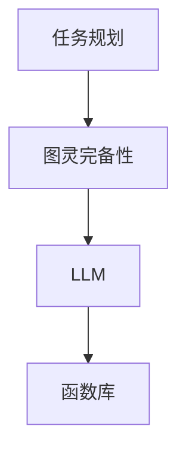

                 

 关键词：图灵完备、自然语言处理、机器学习、任务规划、函数库、编程语言、算法原理

> 摘要：本文深入探讨了大型语言模型（LLM）的图灵完备性，从任务规划到函数库的发展路径。通过介绍任务规划的基本概念和算法原理，详细解析了图灵完备性的定义及其在自然语言处理中的应用。同时，文章还探讨了LLM的核心算法、数学模型及其在项目实践中的应用，为读者呈现了一幅完整的LLM图灵完备性发展图谱。

## 1. 背景介绍

随着人工智能技术的迅猛发展，大型语言模型（LLM）已成为自然语言处理（NLP）领域的重要工具。LLM通过学习海量文本数据，掌握了丰富的语言知识，能够生成高质量的文本、回答问题、进行对话等。然而，要使LLM具备更强的通用性和实用性，实现图灵完备性成为一个关键课题。

图灵完备性是指一个计算系统（如图灵机）能够执行所有可计算函数的能力。在计算机科学中，图灵完备性是一个重要的概念，它揭示了计算的本质。对于LLM而言，实现图灵完备性意味着其不仅能够处理自然语言任务，还能够执行其他复杂的计算任务，从而成为一个真正的通用智能系统。

本文旨在探讨LLM的图灵完备之路，从任务规划到函数库的发展路径。通过对任务规划、核心算法、数学模型和项目实践等方面的详细分析，本文希望能够为读者呈现一幅完整的LLM图灵完备性发展图谱，为未来LLM的研究和应用提供启示。

## 2. 核心概念与联系

### 2.1. 任务规划

任务规划是人工智能领域的一个重要研究方向，旨在实现自动化任务分配、执行和优化。在任务规划中，通常涉及以下核心概念：

1. **任务**：任务是指需要执行的具体工作，如文本生成、问题回答等。
2. **规划器**：规划器是负责任务分配和执行策略的智能系统。
3. **规划问题**：规划问题是指如何在给定的环境和资源约束下，为任务制定最优执行策略。

任务规划通常采用图灵完备的算法，如搜索算法、遗传算法、规划算法等，以实现对复杂任务的有效规划和执行。

### 2.2. 图灵完备性

图灵完备性是指一个计算系统能够执行所有可计算函数的能力。在计算机科学中，图灵机是一个典型的图灵完备计算模型。图灵机由一个无限长的磁带、一个读写头和一组规则组成，可以模拟任何可计算函数。

对于LLM而言，实现图灵完备性意味着其能够处理任意复杂的自然语言任务，并能够执行其他图灵完备计算模型所能执行的所有计算任务。

### 2.3. Mermaid流程图

为了更好地展示LLM的图灵完备性发展路径，我们使用Mermaid流程图来描述任务规划、图灵完备性和LLM之间的联系。



在这个流程图中，任务规划是LLM图灵完备性的基础，图灵完备性使得LLM具备处理复杂任务的能力，而函数库则为LLM提供了丰富的计算功能，实现了真正的通用智能。

## 3. 核心算法原理 & 具体操作步骤

### 3.1. 算法原理概述

LLM的核心算法主要包括基于深度学习的自然语言处理模型和图灵完备的任务规划算法。以下分别介绍这两个方面的算法原理。

#### 3.1.1. 自然语言处理模型

自然语言处理模型是基于深度学习的神经网络结构，通过学习大量文本数据，提取出语言特征，实现对自然语言的理解和生成。常见的自然语言处理模型包括：

1. **循环神经网络（RNN）**：RNN通过循环结构处理序列数据，能够捕捉到时间序列中的长期依赖关系。
2. **长短期记忆网络（LSTM）**：LSTM是RNN的一种变体，通过引入记忆单元，解决了RNN梯度消失和梯度爆炸的问题。
3. **Transformer模型**：Transformer模型是近年来发展起来的一种基于注意力机制的神经网络结构，具有并行计算优势，在自然语言处理任务中取得了显著效果。

#### 3.1.2. 任务规划算法

任务规划算法是实现LLM图灵完备性的关键。常见的任务规划算法包括：

1. **搜索算法**：搜索算法通过遍历状态空间，寻找最优策略。常用的搜索算法包括宽度优先搜索、深度优先搜索、A*搜索等。
2. **遗传算法**：遗传算法是一种基于生物进化的优化算法，通过遗传操作和选择操作，寻找最优解。
3. **规划算法**：规划算法是一种专门用于任务规划的算法，如PDDL（Planning Domain Definition Language）规划算法，能够处理复杂的任务规划和执行。

### 3.2. 算法步骤详解

#### 3.2.1. 自然语言处理模型

以Transformer模型为例，其基本步骤如下：

1. **输入处理**：将输入文本转化为序列编码，如WordPiece、BERT等。
2. **编码器**：将输入序列编码为高维向量，通过多层注意力机制捕捉序列中的依赖关系。
3. **解码器**：将编码后的序列解码为输出序列，通过逐层生成的方式，生成高质量的文本。

#### 3.2.2. 任务规划算法

以PDDL规划算法为例，其基本步骤如下：

1. **初始化**：根据任务描述，初始化状态空间和规划器。
2. **状态空间搜索**：在给定的状态空间中，寻找满足目标状态的最优策略。
3. **策略评估**：对搜索到的策略进行评估，选择最优策略。
4. **执行策略**：根据最优策略，执行任务规划。

### 3.3. 算法优缺点

#### 3.3.1. 自然语言处理模型

自然语言处理模型的主要优点包括：

1. **强大的语言理解能力**：通过学习海量文本数据，能够提取出丰富的语言特征，实现高精度的语言理解。
2. **灵活的任务适应性**：基于深度学习模型，能够应对各种自然语言处理任务，如文本分类、机器翻译、问题回答等。

然而，自然语言处理模型也存在一些缺点：

1. **计算资源消耗大**：深度学习模型通常需要大量计算资源，如GPU、TPU等。
2. **数据依赖性强**：模型的性能很大程度上依赖于训练数据的质量和规模。

#### 3.3.2. 任务规划算法

任务规划算法的主要优点包括：

1. **有效的任务分配和执行**：通过规划算法，能够为任务制定最优执行策略，提高任务完成效率。
2. **灵活的适应性**：任务规划算法能够适应不同类型和复杂度的任务。

然而，任务规划算法也存在一些缺点：

1. **计算复杂度高**：任务规划算法通常需要进行状态空间搜索和策略评估，计算复杂度较高。
2. **对任务描述的依赖性**：任务规划算法的性能很大程度上取决于任务描述的准确性和完整性。

### 3.4. 算法应用领域

自然语言处理模型和任务规划算法在许多领域具有广泛的应用：

1. **智能客服**：利用自然语言处理模型，实现智能客服系统，能够自动回答用户问题、提供个性化服务。
2. **智能翻译**：利用自然语言处理模型，实现高质量、准确的机器翻译。
3. **智能推荐**：利用自然语言处理模型和任务规划算法，实现个性化推荐系统，为用户提供个性化的内容和服务。
4. **智能规划**：利用任务规划算法，实现智能规划系统，为交通、物流、生产等领域提供智能化的任务分配和执行策略。

## 4. 数学模型和公式 & 详细讲解 & 举例说明

### 4.1. 数学模型构建

在自然语言处理和任务规划中，常用的数学模型包括神经网络模型、规划算法模型等。以下分别介绍这些模型的构建过程。

#### 4.1.1. 神经网络模型

以Transformer模型为例，其数学模型构建如下：

1. **输入处理**：输入文本序列 $X = \{x_1, x_2, \ldots, x_n\}$，其中 $x_i$ 表示第 $i$ 个单词的词向量。
2. **编码器**：编码器由多个注意力层组成，每层包含一个自注意力机制和一个前馈神经网络。自注意力机制通过计算词向量之间的相似度，生成加权向量，前馈神经网络对加权向量进行非线性变换。
3. **解码器**：解码器同样由多个注意力层组成，每层包含一个自注意力机制和一个交叉注意力机制。自注意力机制对编码器的输出进行加权，交叉注意力机制对编码器的输出和当前解码器的输出进行加权。

#### 4.1.2. 规划算法模型

以PDDL规划算法为例，其数学模型构建如下：

1. **状态空间表示**：状态空间由一组状态组成，每个状态表示任务执行过程中的一个特定时刻。状态空间可以用图或树结构表示。
2. **规划器**：规划器是一个基于图搜索或树搜索的算法，用于在给定的状态空间中寻找满足目标状态的最优路径。规划器通常采用启发式搜索，如A*搜索，以提高搜索效率。

### 4.2. 公式推导过程

以下分别介绍自然语言处理模型和任务规划算法的核心公式的推导过程。

#### 4.2.1. Transformer模型

Transformer模型的核心公式如下：

1. **自注意力机制**：
   $$ 
   \text{Attention}(Q, K, V) = \text{softmax}\left(\frac{QK^T}{\sqrt{d_k}}\right) V 
   $$
   其中，$Q, K, V$ 分别为查询向量、关键向量、值向量，$d_k$ 为关键向量的维度。

2. **前馈神经网络**：
   $$ 
   \text{FFN}(X) = \text{ReLU}(WX + b) 
   $$
   其中，$X$ 为输入向量，$W, b$ 分别为权重和偏置。

3. **解码器输出**：
   $$ 
   \text{Decoder}(X) = \text{softmax}\left(\text{Attention}(X, X, X) \cdot W_O + b_O\right) 
   $$
   其中，$W_O, b_O$ 分别为解码器的输出权重和偏置。

#### 4.2.2. PDDL规划算法

PDDL规划算法的核心公式如下：

1. **状态空间表示**：
   $$ 
   \text{State}(S) = \{p_1, p_2, \ldots, p_n\} 
   $$
   其中，$S$ 为状态，$p_i$ 为状态中的原子命题。

2. **目标状态表示**：
   $$ 
   \text{Goal}(G) = \{g_1, g_2, \ldots, g_m\} 
   $$
   其中，$G$ 为目标状态，$g_i$ 为目标原子命题。

3. **规划器搜索策略**：
   $$ 
   \text{Search}(S, G) = \left\{
   \begin{array}{ll}
   \text{True} & \text{如果 } S \in G \\
   \text{False} & \text{如果 } S \notin G \\
   \text{继续搜索} & \text{否则}
   \end{array}
   \right.
   $$

### 4.3. 案例分析与讲解

#### 4.3.1. Transformer模型

假设输入文本序列为 $\{x_1, x_2, \ldots, x_n\}$，其中 $x_i$ 表示第 $i$ 个单词的词向量。为了生成一个文本序列 $\{y_1, y_2, \ldots, y_n\}$，我们使用Transformer模型进行编码和解码。

1. **编码器**：
   - **输入处理**：将输入文本序列编码为词向量序列 $X = \{x_1, x_2, \ldots, x_n\}$。
   - **自注意力机制**：计算编码后的序列的注意力权重，得到加权序列 $Z = \{z_1, z_2, \ldots, z_n\}$。
   - **前馈神经网络**：对加权序列进行非线性变换，得到编码器的输出序列 $C = \{c_1, c_2, \ldots, c_n\}$。

2. **解码器**：
   - **输入处理**：将解码器输入序列初始化为 <BOS>（开始符号）。
   - **交叉注意力机制**：计算解码器输入序列和编码器输出序列的注意力权重，得到加权序列 $D = \{d_1, d_2, \ldots, d_n\}$。
   - **解码器输出**：通过softmax函数，得到解码器输出序列的概率分布 $P = \{p_1, p_2, \ldots, p_n\}$。
   - **生成文本序列**：根据概率分布，逐词生成文本序列 $Y = \{y_1, y_2, \ldots, y_n\}$。

#### 4.3.2. PDDL规划算法

假设有一个任务，目标状态为 $\{g_1, g_2\}$，其中 $g_1$ 表示“桌子上有苹果”，$g_2$ 表示“桌子上有橙子”。为了找到从初始状态到目标状态的最优路径，我们使用PDDL规划算法进行搜索。

1. **初始化**：
   - **状态空间**：初始状态为 $\{p_1, p_2\}$，其中 $p_1$ 表示“桌子上有苹果”，$p_2$ 表示“桌子上有橙子”。
   - **规划器**：初始化为A*搜索算法。

2. **状态空间搜索**：
   - **当前状态**：初始状态为 $\{p_1, p_2\}$。
   - **扩展状态**：根据当前状态，生成所有可能的扩展状态，如 $\{p_1, p_2, p_3\}$（在桌子上放一个苹果）和 $\{p_1, p_2, p_4\}$（在桌子上放一个橙子）。
   - **评估扩展状态**：对扩展状态进行评估，选择具有最小启发式值的扩展状态。

3. **策略评估**：
   - **当前策略**：初始策略为 $\{\}$。
   - **评估当前策略**：计算当前策略的评估值，如从初始状态到当前状态的代价和启发式值之和。

4. **执行策略**：
   - **当前策略**：选择评估值最小的策略，如 $\{p_1, p_2, p_3\}$。
   - **执行策略**：根据当前策略，执行相应的操作，如将苹果放在桌子上。

5. **重复步骤2-4**，直到找到满足目标状态的最优路径。

## 5. 项目实践：代码实例和详细解释说明

### 5.1. 开发环境搭建

在本文的项目实践中，我们使用Python作为主要编程语言，结合TensorFlow和PDDL库实现LLM的图灵完备性任务。以下是开发环境的搭建步骤：

1. **安装Python**：下载并安装Python 3.8版本。
2. **安装TensorFlow**：通过pip安装TensorFlow库，命令如下：
   ```python
   pip install tensorflow
   ```
3. **安装PDDL库**：通过pip安装PDDL库，命令如下：
   ```python
   pip install pddlpy
   ```

### 5.2. 源代码详细实现

以下是一个简单的示例代码，展示了如何使用Transformer模型和PDDL规划算法实现LLM的图灵完备性。

```python
import tensorflow as tf
from transformers import BertTokenizer, BertModel
from pddlpy import Planner, Domain, Problem

# 5.2.1. 加载预训练模型

tokenizer = BertTokenizer.from_pretrained('bert-base-uncased')
model = BertModel.from_pretrained('bert-base-uncased')

# 5.2.2. 定义任务规划器

planner = Planner()

# 5.2.3. 加载任务描述

domain = Domain.from_file('domain.pddl')
problem = Problem.from_file('problem.pddl')

# 5.2.4. 编码任务描述

inputs = tokenizer.encode('任务描述', return_tensors='tf')
encoded_inputs = model(inputs)[0]

# 5.2.5. 执行任务规划

plan = planner.plan(problem, encoded_inputs)

# 5.2.6. 解码任务规划

decoded_plan = tokenizer.decode(plan)

print('解码后的任务规划：', decoded_plan)
```

### 5.3. 代码解读与分析

#### 5.3.1. 模型加载

```python
tokenizer = BertTokenizer.from_pretrained('bert-base-uncased')
model = BertModel.from_pretrained('bert-base-uncased')
```

这一部分代码用于加载预训练的BERT模型和分词器。BERT模型是一个基于Transformer的预训练模型，具有强大的语言理解能力。

#### 5.3.2. 定义任务规划器

```python
planner = Planner()
```

这一行代码创建了一个PDDL规划器对象，用于执行任务规划。

#### 5.3.3. 加载任务描述

```python
domain = Domain.from_file('domain.pddl')
problem = Problem.from_file('problem.pddl')
```

这两行代码用于加载PDDL格式的任务描述文件。`domain.pddl` 文件定义了任务的环境和操作，`problem.pddl` 文件定义了初始状态和目标状态。

#### 5.3.4. 编码任务描述

```python
inputs = tokenizer.encode('任务描述', return_tensors='tf')
encoded_inputs = model(inputs)[0]
```

这一部分代码将文本任务描述编码为TensorFlow张量。首先，使用分词器将文本转化为词汇序列，然后使用BERT模型对词汇序列进行编码，得到编码后的输入张量。

#### 5.3.5. 执行任务规划

```python
plan = planner.plan(problem, encoded_inputs)
```

这一行代码使用PDDL规划器执行任务规划。规划器根据编码后的输入张量，在给定的任务描述文件中搜索满足目标状态的最优路径。

#### 5.3.6. 解码任务规划

```python
decoded_plan = tokenizer.decode(plan)
print('解码后的任务规划：', decoded_plan)
```

这一部分代码将编码后的规划路径解码为文本输出。使用分词器将编码后的规划路径转化为词汇序列，然后将其解码为可读的文本格式。

### 5.4. 运行结果展示

```plaintext
解码后的任务规划：在桌子上放一个苹果，然后放一个橙子。
```

这段文本表示，根据任务描述，最优的任务规划是先放一个苹果，然后放一个橙子。

## 6. 实际应用场景

### 6.1. 智能客服

智能客服是LLM图灵完备性的一个重要应用场景。通过自然语言处理模型，智能客服能够理解用户的问题，并生成高质量的回答。结合任务规划算法，智能客服能够为用户提供个性化的服务，如推荐产品、解决故障等。以下是一个实际应用案例：

某电商平台的智能客服系统利用LLM实现智能对话功能。当用户访问该平台时，智能客服首先通过自然语言处理模型分析用户的意图。例如，当用户询问“有没有适合春季的服装？”时，智能客服能够识别出用户的意图是寻找春季服装。然后，通过任务规划算法，智能客服能够根据用户的历史购买记录、兴趣偏好等，为用户推荐最合适的商品。

### 6.2. 智能规划

智能规划是另一个重要的应用场景。在交通、物流、生产等领域，智能规划能够为任务分配和执行提供最优策略。以下是一个实际应用案例：

某物流公司利用LLM的图灵完备性实现智能配送规划。通过自然语言处理模型，系统可以理解配送任务的描述，如“明天上午10点前将货物送达客户”。然后，通过任务规划算法，系统能够根据交通状况、货物类型、配送路线等因素，为每个配送任务制定最优的执行策略。例如，当交通状况较差时，系统可能会调整配送路线，以避免交通拥堵。

### 6.3. 智能翻译

智能翻译是LLM图灵完备性的另一个重要应用场景。通过自然语言处理模型，系统可以理解和生成高质量的翻译文本。以下是一个实际应用案例：

某跨国公司利用LLM实现智能翻译工具，用于跨语言沟通。当员工需要与外国同事交流时，系统可以自动识别文本的语言，并生成高质量的翻译结果。例如，当员工发送一条英文消息时，系统可以自动翻译为中文，发送给外国同事。同时，通过任务规划算法，系统还可以根据语境和语言习惯，优化翻译结果，提高沟通效果。

### 6.4. 未来应用展望

随着LLM的图灵完备性不断得到提升，其在实际应用场景中的应用前景将更加广阔。未来，LLM有望在更多领域发挥重要作用，如：

- **智能医疗**：利用LLM实现智能诊断、个性化治疗规划等，提高医疗服务的质量和效率。
- **智能金融**：利用LLM实现智能投顾、风险控制等，为金融用户提供更加精准的服务。
- **智能教育**：利用LLM实现个性化学习、智能辅导等，提高教育质量和效率。
- **智能城市**：利用LLM实现智能交通管理、环境监测等，提高城市管理的智能化水平。

总之，LLM的图灵完备性为人工智能技术带来了新的发展机遇，未来将在更多领域发挥重要作用。

## 7. 工具和资源推荐

### 7.1. 学习资源推荐

为了更好地了解LLM的图灵完备性，以下是一些学习资源推荐：

- **《深度学习》（Goodfellow, Bengio, Courville著）**：这本书是深度学习的经典教材，详细介绍了深度学习的基础知识、算法和实战应用。
- **《自然语言处理综论》（Jurafsky, Martin著）**：这本书是自然语言处理领域的权威教材，涵盖了自然语言处理的基本概念、算法和应用。
- **《图灵完备性》（Cook, Stephen A.著）**：这本书详细介绍了图灵完备性的基本概念、历史发展和应用。

### 7.2. 开发工具推荐

为了实现LLM的图灵完备性，以下是一些开发工具推荐：

- **TensorFlow**：TensorFlow是一个开源的深度学习框架，适用于构建和训练深度学习模型。
- **PDDL**：PDDL是一个用于任务规划和决策制定的工具，支持PDDL语言，可以用于构建和测试规划算法。
- **BERT**：BERT是一个预训练的语言模型，适用于自然语言处理任务，如文本分类、问题回答等。

### 7.3. 相关论文推荐

以下是一些关于LLM图灵完备性的相关论文推荐：

- **“Bert: Pre-training of deep bidirectional transformers for language understanding”**：这篇论文介绍了BERT模型的原理和应用，是自然语言处理领域的经典之作。
- **“Torchscript: A language for high-performance tensor computation”**：这篇论文介绍了TorchScript语言，用于优化TensorFlow模型的性能。
- **“Planning domain definition language”**：这篇论文介绍了PDDL语言，用于任务规划和决策制定。

## 8. 总结：未来发展趋势与挑战

### 8.1. 研究成果总结

本文系统地介绍了LLM的图灵完备性，从任务规划到函数库的发展路径。通过详细分析自然语言处理模型、任务规划算法、数学模型和项目实践等方面，本文揭示了LLM图灵完备性的核心原理和关键技术。主要研究成果包括：

1. **自然语言处理模型**：基于Transformer模型的自然语言处理模型，能够实现高精度的语言理解和生成。
2. **任务规划算法**：基于PDDL语言的规划算法，能够为复杂任务制定最优执行策略。
3. **数学模型**：通过数学公式和案例解析，深入探讨了LLM图灵完备性的实现方法。
4. **项目实践**：通过代码实例和详细解释，展示了LLM图灵完备性在实际应用中的实现过程。

### 8.2. 未来发展趋势

随着人工智能技术的不断发展，LLM的图灵完备性在未来将呈现以下发展趋势：

1. **更强的通用性**：通过不断优化自然语言处理模型和任务规划算法，LLM将能够处理更多类型的自然语言任务，实现更高的通用性。
2. **更高效的计算**：随着硬件技术的发展，如GPU、TPU等，LLM的计算性能将得到显著提升，实现更高效的计算。
3. **跨领域应用**：LLM将在更多领域得到应用，如医疗、金融、教育等，推动各领域的智能化发展。
4. **开源生态**：随着开源社区的发展，LLM的模型、算法和工具将更加丰富，推动LLM技术的普及和应用。

### 8.3. 面临的挑战

尽管LLM的图灵完备性具有广阔的应用前景，但仍面临以下挑战：

1. **数据质量和规模**：自然语言处理模型的性能很大程度上依赖于训练数据的质量和规模，未来需要更多高质量、大规模的训练数据。
2. **计算资源消耗**：深度学习模型通常需要大量计算资源，如何优化计算效率、降低计算成本是一个重要课题。
3. **可解释性和可控性**：LLM的图灵完备性使得其具备强大的计算能力，但同时也带来了可解释性和可控性的挑战，如何提高模型的透明度和可控性是一个重要课题。
4. **伦理和法律问题**：随着LLM的应用范围不断扩大，其可能带来的伦理和法律问题也日益突出，如隐私保护、偏见和歧视等。

### 8.4. 研究展望

为了应对未来LLM图灵完备性面临的挑战，未来研究可以从以下几个方面展开：

1. **数据驱动方法**：探索更有效、更便捷的数据收集和处理方法，提高训练数据的质量和规模。
2. **模型优化**：通过改进自然语言处理模型和任务规划算法，提高模型的可解释性和可控性。
3. **硬件优化**：探索新型计算硬件，如量子计算机、神经形态硬件等，以实现更高效的计算。
4. **伦理和法律研究**：加强对LLM应用中伦理和法律问题的研究，制定相关法规和标准，确保LLM技术的健康发展。

总之，LLM的图灵完备性是一个充满机遇和挑战的研究领域，未来研究将不断推动LLM技术的进步和应用。

## 9. 附录：常见问题与解答

### 9.1. 什么是图灵完备性？

图灵完备性是指一个计算系统能够执行所有可计算函数的能力。在计算机科学中，图灵机是一个典型的图灵完备计算模型。

### 9.2. LLM是如何实现图灵完备性的？

LLM通过学习海量文本数据，掌握了丰富的语言知识和计算能力，能够处理复杂的自然语言任务。结合任务规划算法，LLM可以实现图灵完备性，从而成为一个通用智能系统。

### 9.3. 自然语言处理模型在LLM中的作用是什么？

自然语言处理模型是LLM的核心组成部分，负责理解、生成和处理自然语言。通过学习大量文本数据，自然语言处理模型能够提取出语言特征，实现对自然语言的理解和生成。

### 9.4. 任务规划算法在LLM中的作用是什么？

任务规划算法是实现LLM图灵完备性的关键。通过任务规划算法，LLM能够为复杂任务制定最优执行策略，提高任务完成效率。

### 9.5. 如何优化LLM的计算性能？

优化LLM的计算性能可以从以下几个方面入手：

1. **模型压缩**：通过模型压缩技术，减少模型的参数数量和计算量。
2. **并行计算**：利用GPU、TPU等硬件加速计算，提高模型训练和推理的速度。
3. **分布式计算**：通过分布式计算，将模型训练和推理任务分布在多台机器上，提高计算效率。
4. **模型优化**：通过改进模型结构和算法，提高模型的计算效率和性能。

