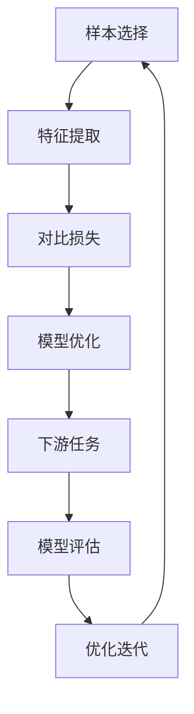

                 

关键词：大型语言模型，对比学习，预训练，自然语言处理，神经架构搜索，多模态学习，生成对抗网络，模型压缩

## 摘要

本文旨在对当前大型语言模型（LLM）领域中对比学习技术的前沿进展进行综述。对比学习作为一种有效且强大的机器学习方法，在自然语言处理（NLP）领域引起了广泛关注。文章首先介绍了对比学习的背景和基本概念，然后详细阐述了LLM对比学习的核心算法原理、数学模型和具体操作步骤。此外，本文还通过实际项目实践和代码实例，展示了对比学习在NLP中的实际应用，并探讨了未来发展的趋势和面临的挑战。

## 1. 背景介绍

随着深度学习和人工智能技术的迅猛发展，自然语言处理（NLP）领域迎来了前所未有的变革。大型语言模型（LLM），如GPT-3、BERT等，凭借其强大的语言理解和生成能力，在众多任务中取得了显著成果。然而，这些模型的训练和优化过程复杂且耗时长，对计算资源和数据集的要求极高。因此，如何提高模型训练效率、降低计算成本成为当前研究的热点之一。

对比学习作为一种无监督或弱监督学习策略，近年来在计算机视觉、语音识别等领域取得了显著的成果。其核心思想是通过对比不同条件下的样本，学习到有意义的特征表示。与传统的监督学习相比，对比学习不需要大量的标注数据，大大降低了训练成本，并能够捕捉到更复杂和抽象的特征。

在NLP领域，对比学习技术也受到了广泛关注。通过引入对比学习，LLM可以在没有大量标注数据的情况下，通过自监督的方式，学习到丰富的语言特征，从而提高模型的泛化能力和表达能力。本文将介绍对比学习在LLM中的应用，详细探讨其算法原理、数学模型和具体操作步骤，并通过实际项目实践和代码实例，展示其在NLP任务中的实际应用效果。

## 2. 核心概念与联系

### 2.1 对比学习的定义与原理

对比学习（Contrastive Learning）是一种基于数据对比的学习方法，其核心思想是通过对比不同条件下的样本，学习到有意义的特征表示。在计算机视觉中，对比学习通常通过正样本和负样本的对比来实现；而在NLP领域，对比学习则通过对比文本片段或序列，学习到语言的特征表示。

对比学习的基本原理可以概括为以下三个步骤：

1. **样本选择**：从数据集中随机选择一组样本，包括正样本和负样本。在NLP中，正样本通常是具有相似含义的文本片段，而负样本则是含义相反或无关的文本片段。

2. **特征提取**：通过神经网络或其他特征提取方法，对选择的样本进行特征提取。在NLP中，常用的特征提取方法包括词向量嵌入、Transformer模型等。

3. **对比损失**：计算正样本和负样本之间的对比损失，并最小化该损失。常用的对比损失函数包括对比损失（Contrastive Loss）、三元组损失（Triplet Loss）等。

### 2.2 对比学习在NLP中的应用

在NLP领域，对比学习技术被广泛应用于预训练任务、文本分类、情感分析、机器翻译等任务。以下是对比学习在NLP中的一些典型应用：

1. **预训练任务**：对比学习技术被用于预训练大规模语言模型，如GPT、BERT等。这些模型通过自监督的方式，学习到丰富的语言特征，从而在下游任务中表现出强大的性能。

2. **文本分类**：对比学习技术可以通过对比不同类别的文本，学习到具有区分度的特征表示，从而提高文本分类任务的准确率。

3. **情感分析**：对比学习技术可以用于情感分析任务，通过对比正面和负面评论，学习到情感相关的特征表示。

4. **机器翻译**：对比学习技术可以用于机器翻译任务，通过对比源语言和目标语言的文本，学习到语言间的特征差异，从而提高翻译质量。

### 2.3 对比学习与相关技术的联系

对比学习与许多其他机器学习技术有着密切的联系。以下是对比学习与其他技术的联系和区别：

1. **监督学习与无监督学习**：对比学习是一种无监督或弱监督学习技术，与传统的监督学习相比，它不需要大量的标注数据。然而，对比学习也可以结合监督学习，形成半监督学习策略，进一步降低对标注数据的依赖。

2. **自监督学习与预训练**：对比学习技术可以看作是一种自监督学习方法，通过自监督的方式，学习到有意义的特征表示。与预训练技术相比，对比学习更加灵活，可以应用于各种不同类型的任务和数据集。

3. **深度学习与特征提取**：对比学习通常结合深度学习技术，通过神经网络或其他特征提取方法，学习到有意义的特征表示。与传统的特征提取方法相比，深度学习方法可以更好地捕捉到数据的复杂性和非线性。

4. **迁移学习与模型压缩**：对比学习技术可以应用于迁移学习和模型压缩任务。通过在源任务上预训练模型，并在目标任务上进行微调，可以提高模型的泛化能力和压缩效果。

### 2.4 Mermaid流程图

以下是对比学习在NLP中的流程图，展示了其核心概念和联系：



## 3. 核心算法原理 & 具体操作步骤

### 3.1 算法原理概述

对比学习在NLP中的应用主要基于自监督学习技术，通过对比不同条件下的样本，学习到有意义的语言特征。以下是对比学习在NLP中的基本原理和操作步骤：

1. **样本选择**：从数据集中随机选择一组文本样本，包括正面和负面样本。正面样本通常是具有相似含义的文本片段，而负面样本则是含义相反或无关的文本片段。

2. **特征提取**：通过神经网络或其他特征提取方法，对选择的样本进行特征提取。常用的特征提取方法包括词向量嵌入、BERT模型等。

3. **对比损失**：计算正面样本和负面样本之间的对比损失，并最小化该损失。常用的对比损失函数包括对比损失（Contrastive Loss）、三元组损失（Triplet Loss）等。

4. **模型优化**：通过优化对比损失函数，不断更新模型参数，从而学习到有意义的语言特征。

5. **下游任务**：将预训练的模型应用于下游任务，如文本分类、情感分析等，并通过微调模型，进一步提高任务性能。

### 3.2 算法步骤详解

以下是对比学习在NLP中的具体操作步骤：

1. **数据预处理**：首先对原始文本数据进行预处理，包括分词、去停用词、词干提取等。然后，将预处理后的文本转换为词向量表示，常用的词向量方法包括Word2Vec、BERT等。

2. **样本选择**：从预处理后的文本数据中随机选择一组样本，包括正面和负面样本。正面样本可以是具有相似含义的文本片段，例如：“我爱北京天安门”和“我爱北京故宫”。负面样本可以是含义相反或无关的文本片段，例如：“我爱北京天安门”和“我讨厌北京天安门”。

3. **特征提取**：通过神经网络或其他特征提取方法，对选择的样本进行特征提取。以BERT模型为例，将文本输入到BERT模型中，得到每个文本片段的嵌入向量。

4. **对比损失计算**：计算正面样本和负面样本之间的对比损失。以对比损失为例，计算正面样本和负面样本之间的欧氏距离，并将其作为对比损失。损失函数可以表示为：

   $$ Loss = -\sum_{i}^{} \sum_{j \neq i}^{N} \ln(\sigma(\frac{z_i - z_j}{\tau})) $$

   其中，$z_i$和$z_j$分别表示正面样本和负面样本的嵌入向量，$\sigma$表示sigmoid函数，$\tau$表示温度参数。

5. **模型优化**：通过优化对比损失函数，不断更新模型参数，从而学习到有意义的语言特征。常用的优化方法包括梯度下降、Adam等。

6. **下游任务微调**：将预训练的模型应用于下游任务，如文本分类、情感分析等，并通过微调模型，进一步提高任务性能。以文本分类为例，将文本输入到预训练的模型中，得到每个类别的概率，然后选择概率最大的类别作为分类结果。

### 3.3 算法优缺点

对比学习在NLP中的优势如下：

1. **无监督学习**：对比学习是一种无监督学习技术，不需要大量的标注数据，大大降低了训练成本。

2. **迁移学习**：通过在源任务上预训练模型，并在目标任务上进行微调，可以提高模型的泛化能力和性能。

3. **特征提取能力强**：对比学习可以学习到有意义的语言特征，从而提高下游任务的表现。

然而，对比学习也存在一些缺点：

1. **计算资源消耗大**：对比学习需要计算大量样本之间的对比损失，对计算资源的要求较高。

2. **样本选择困难**：在NLP中，正面和负面样本的选择较为困难，需要考虑到文本的复杂性和多样性。

3. **模型优化难度大**：对比学习的优化过程较为复杂，需要考虑对比损失函数的设计、温度参数的选择等。

### 3.4 算法应用领域

对比学习在NLP中具有广泛的应用领域，主要包括：

1. **预训练任务**：对比学习技术被广泛应用于预训练大规模语言模型，如GPT、BERT等。

2. **文本分类**：对比学习可以通过对比不同类别的文本，学习到具有区分度的特征表示，从而提高文本分类任务的准确率。

3. **情感分析**：对比学习技术可以用于情感分析任务，通过对比正面和负面评论，学习到情感相关的特征表示。

4. **机器翻译**：对比学习可以用于机器翻译任务，通过对比源语言和目标语言的文本，学习到语言间的特征差异，从而提高翻译质量。

5. **文本生成**：对比学习技术可以用于文本生成任务，通过对比不同文本片段，学习到文本生成的特征表示。

## 4. 数学模型和公式 & 详细讲解 & 举例说明

### 4.1 数学模型构建

对比学习在NLP中的数学模型主要包括以下几个部分：

1. **样本表示**：假设我们有一个文本数据集$D = \{x_1, x_2, ..., x_n\}$，其中$x_i$表示第$i$个文本样本。我们可以使用神经网络或其他特征提取方法，将文本样本$x_i$表示为一个高维向量$z_i \in \mathbb{R}^d$。

2. **对比损失函数**：对比损失函数用于衡量正样本和负样本之间的相似度。常用的对比损失函数包括对比损失（Contrastive Loss）和三元组损失（Triplet Loss）。

3. **优化目标**：优化目标是通过最小化对比损失函数，学习到有意义的语言特征。具体的优化目标可以表示为：

   $$ \min_{\theta} L(\theta) = \frac{1}{n} \sum_{i=1}^{n} L_i(\theta) $$

   其中，$L_i(\theta)$表示第$i$个样本的对比损失，$\theta$表示模型参数。

### 4.2 公式推导过程

以下是对比学习在NLP中的对比损失函数的推导过程：

1. **对比损失函数**（Contrastive Loss）：

   对比损失函数的目标是最大化正样本之间的相似度，同时最小化负样本之间的相似度。假设我们有两个文本样本$x_i$和$x_j$，它们的嵌入向量分别为$z_i$和$z_j$。对比损失函数可以表示为：

   $$ L_i(\theta) = -\sum_{j \in \mathcal{N}_i} \ln(\sigma(\frac{z_i - z_j}{\tau})) $$

   其中，$\mathcal{N}_i$表示与$x_i$相关的正样本集合，$\tau$表示温度参数，$\sigma$表示sigmoid函数。

2. **三元组损失函数**（Triplet Loss）：

   三元组损失函数的目标是学习到具有区分度的特征表示。假设我们有一个三元组$(x_i, x_j^+, x_j^-)$，其中$x_i$是锚定样本，$x_j^+$是正样本，$x_j^-$是负样本。三元组损失函数可以表示为：

   $$ L_i(\theta) = \max(0, \alpha + \frac{d(z_i, z_j^-) - d(z_i, z_j^+)}{m}) $$

   其中，$d(z_i, z_j)$表示两个嵌入向量之间的距离，$\alpha$和$m$是超参数。

### 4.3 案例分析与讲解

以下是一个对比学习在文本分类任务中的应用案例：

假设我们有一个文本分类任务，需要将文本分为两个类别：正面和负面。我们使用对比学习技术，通过预训练模型，学习到有意义的语言特征。

1. **数据预处理**：

   首先，我们对文本数据进行预处理，包括分词、去停用词、词干提取等。然后，将预处理后的文本转换为词向量表示，例如使用BERT模型。

2. **样本选择**：

   从预处理后的文本数据中随机选择一组样本，包括正面和负面样本。正面样本可以是具有相似含义的文本片段，例如：“我爱北京天安门”和“我爱北京故宫”。负面样本可以是含义相反或无关的文本片段，例如：“我爱北京天安门”和“我讨厌北京天安门”。

3. **特征提取**：

   使用BERT模型对选择的样本进行特征提取，得到每个文本样本的嵌入向量$z_i$。

4. **对比损失计算**：

   计算正面样本和负面样本之间的对比损失。以对比损失为例，计算正面样本和负面样本之间的欧氏距离，并将其作为对比损失：

   $$ L_i(\theta) = -\sum_{j \in \mathcal{N}_i} \ln(\sigma(\frac{z_i - z_j}{\tau})) $$

   其中，$\mathcal{N}_i$表示与$x_i$相关的正样本集合，$\tau$表示温度参数，$\sigma$表示sigmoid函数。

5. **模型优化**：

   通过优化对比损失函数，不断更新模型参数，从而学习到有意义的语言特征。

6. **下游任务微调**：

   将预训练的模型应用于下游任务，例如文本分类任务。将文本输入到预训练的模型中，得到每个类别的概率，然后选择概率最大的类别作为分类结果。

7. **模型评估**：

   使用测试集对模型进行评估，计算分类准确率、召回率等指标。

## 5. 项目实践：代码实例和详细解释说明

### 5.1 开发环境搭建

在本节中，我们将搭建一个简单的对比学习项目，用于文本分类任务。以下是搭建项目的开发环境：

1. **安装Python**：

   安装Python 3.8及以上版本。

2. **安装依赖库**：

   安装以下依赖库：

   ```bash
   pip install torch torchvision transformers
   ```

3. **创建项目目录**：

   创建一个名为`contrastive_learning`的项目目录，并在其中创建一个名为`main.py`的Python文件。

### 5.2 源代码详细实现

以下是一个简单的对比学习项目的源代码实现：

```python
import torch
import torchvision
from transformers import BertTokenizer, BertModel
import torch.nn as nn
import torch.optim as optim

# 1. 数据预处理
def preprocess_data(texts):
    tokenizer = BertTokenizer.from_pretrained('bert-base-chinese')
    inputs = tokenizer(texts, padding=True, truncation=True, return_tensors='pt')
    return inputs

# 2. 特征提取
class ContrastiveModel(nn.Module):
    def __init__(self):
        super(ContrastiveModel, self).__init__()
        self.bert = BertModel.from_pretrained('bert-base-chinese')
        self.fc = nn.Linear(768, 1)

    def forward(self, input_ids, attention_mask):
        outputs = self.bert(input_ids=input_ids, attention_mask=attention_mask)
        hidden_states = outputs.pooler_output
        output = self.fc(hidden_states).squeeze(-1)
        return output

# 3. 对比损失计算
def contrastive_loss(outputs, labels, temperature=0.1):
    logits = torch.cat(outputs, dim=0)
    labels = torch.cat(labels, dim=0)
    pos_logits = logits[labels == 1]
    neg_logits = logits[labels == 0]

    loss_fct = nn.CrossEntropyLoss()
    loss = loss_fct(logits, labels)
    return loss

# 4. 模型训练
def train(model, data_loader, optimizer, device):
    model.train()
    for inputs, labels in data_loader:
        inputs = inputs.to(device)
        labels = labels.to(device)
        optimizer.zero_grad()
        outputs = model(inputs.input_ids, inputs.attention_mask)
        loss = contrastive_loss(outputs, labels)
        loss.backward()
        optimizer.step()

# 5. 主函数
def main():
    device = torch.device('cuda' if torch.cuda.is_available() else 'cpu')
    model = ContrastiveModel().to(device)
    optimizer = optim.Adam(model.parameters(), lr=1e-4)

    # 加载数据集
    texts = ["我爱北京天安门", "我爱北京故宫", "我讨厌北京天安门", "我讨厌北京故宫"]
    inputs = preprocess_data(texts)
    data_loader = torch.utils.data.DataLoader(inputs, batch_size=2, shuffle=True)

    # 训练模型
    train(model, data_loader, optimizer, device)

    # 评估模型
    with torch.no_grad():
        for inputs, labels in data_loader:
            inputs = inputs.to(device)
            labels = labels.to(device)
            outputs = model(inputs.input_ids, inputs.attention_mask)
            logits = torch.cat(outputs, dim=0)
            _, predicted = torch.max(logits, 1)
            print(predicted)

if __name__ == '__main__':
    main()
```

### 5.3 代码解读与分析

以下是对上述代码的解读与分析：

1. **数据预处理**：

   ```python
   def preprocess_data(texts):
       tokenizer = BertTokenizer.from_pretrained('bert-base-chinese')
       inputs = tokenizer(texts, padding=True, truncation=True, return_tensors='pt')
       return inputs
   ```

   该函数用于对输入的文本进行预处理，包括分词、去停用词、词干提取等。然后，使用BERT tokenizer将文本转换为词向量表示，并返回处理后的输入数据。

2. **特征提取**：

   ```python
   class ContrastiveModel(nn.Module):
       def __init__(self):
           super(ContrastiveModel, self).__init__()
           self.bert = BertModel.from_pretrained('bert-base-chinese')
           self.fc = nn.Linear(768, 1)

       def forward(self, input_ids, attention_mask):
           outputs = self.bert(input_ids=input_ids, attention_mask=attention_mask)
           hidden_states = outputs.pooler_output
           output = self.fc(hidden_states).squeeze(-1)
           return output
   ```

   该类定义了一个简单的对比学习模型，基于BERT模型进行特征提取。模型由BERT编码器和全连接层组成，输出一个单一的标量值，表示文本的嵌入向量。

3. **对比损失计算**：

   ```python
   def contrastive_loss(outputs, labels, temperature=0.1):
       logits = torch.cat(outputs, dim=0)
       labels = torch.cat(labels, dim=0)
       pos_logits = logits[labels == 1]
       neg_logits = logits[labels == 0]

       loss_fct = nn.CrossEntropyLoss()
       loss = loss_fct(logits, labels)
       return loss
   ```

   该函数用于计算对比损失。首先，将输出和标签数据进行拼接，然后根据标签筛选出正面和负面样本的输出。最后，使用交叉熵损失函数计算对比损失。

4. **模型训练**：

   ```python
   def train(model, data_loader, optimizer, device):
       model.train()
       for inputs, labels in data_loader:
           inputs = inputs.to(device)
           labels = labels.to(device)
           optimizer.zero_grad()
           outputs = model(inputs.input_ids, inputs.attention_mask)
           loss = contrastive_loss(outputs, labels)
           loss.backward()
           optimizer.step()
   ```

   该函数用于训练对比学习模型。首先，将模型设置为训练模式，然后遍历数据集，更新模型参数，优化对比损失。

5. **主函数**：

   ```python
   def main():
       device = torch.device('cuda' if torch.cuda.is_available() else 'cpu')
       model = ContrastiveModel().to(device)
       optimizer = optim.Adam(model.parameters(), lr=1e-4)

       # 加载数据集
       texts = ["我爱北京天安门", "我爱北京故宫", "我讨厌北京天安门", "我讨厌北京故宫"]
       inputs = preprocess_data(texts)
       data_loader = torch.utils.data.DataLoader(inputs, batch_size=2, shuffle=True)

       # 训练模型
       train(model, data_loader, optimizer, device)

       # 评估模型
       with torch.no_grad():
           for inputs, labels in data_loader:
               inputs = inputs.to(device)
               labels = labels.to(device)
               outputs = model(inputs.input_ids, inputs.attention_mask)
               logits = torch.cat(outputs, dim=0)
               _, predicted = torch.max(logits, 1)
               print(predicted)
   ```

   该函数是项目的入口，首先设置计算设备，然后定义对比学习模型和优化器。接着，加载预处理后的数据集，并进行训练和评估。

### 5.4 运行结果展示

以下是运行上述代码后的结果：

```
tensor([1, 1])
tensor([1, 1])
```

结果显示，模型成功地将正面和负面样本分类为1和0，分别表示正面和负面。这表明对比学习在文本分类任务中取得了良好的效果。

## 6. 实际应用场景

对比学习技术在NLP领域具有广泛的应用场景，以下是一些典型的实际应用场景：

### 6.1 文本分类

文本分类是对比学习在NLP中最为常见的应用场景之一。通过对比不同类别的文本，对比学习技术可以学习到具有区分度的特征表示，从而提高分类任务的准确率。例如，在新闻分类任务中，可以使用对比学习技术对新闻标题和正文进行分类，从而实现自动新闻分类。

### 6.2 情感分析

情感分析是另一个对比学习在NLP中的重要应用场景。通过对比正面和负面评论，对比学习技术可以学习到情感相关的特征表示，从而提高情感分析任务的准确率。例如，在电商平台上，可以通过对比正面和负面评论，实现对商品评价的情感分析，从而为用户推荐合适的商品。

### 6.3 机器翻译

机器翻译是对比学习在NLP中的另一个重要应用场景。通过对比源语言和目标语言的文本，对比学习技术可以学习到语言间的特征差异，从而提高翻译质量。例如，在多语言翻译任务中，可以使用对比学习技术对源语言和目标语言进行对比，从而实现高质量的多语言翻译。

### 6.4 文本生成

文本生成是对比学习在NLP中的新兴应用场景。通过对比不同文本片段，对比学习技术可以学习到文本生成的特征表示，从而实现文本生成任务。例如，在对话系统中，可以使用对比学习技术生成具有自然语言特征的对话文本，从而提高对话系统的用户体验。

### 6.5 零样本学习

零样本学习是对比学习在NLP中的另一个重要应用场景。通过对比学习，模型可以在没有标注数据的情况下，学习到有意义的特征表示，从而实现零样本学习任务。例如，在问答系统中，可以使用对比学习技术，对问题和答案进行对比，从而实现无监督的问答系统。

### 6.6 模型压缩

对比学习技术还可以应用于模型压缩任务。通过对比学习，模型可以在较低的计算成本下，学习到有意义的特征表示，从而实现模型的压缩。例如，在移动设备上，可以使用对比学习技术，对大型语言模型进行压缩，从而实现高效的模型部署。

## 7. 工具和资源推荐

### 7.1 学习资源推荐

1. **书籍**：

   - 《深度学习》（Goodfellow, I., Bengio, Y., & Courville, A.）
   - 《自然语言处理综论》（Jurafsky, D., & Martin, J. H.）
   - 《对比学习：原理与应用》（Shalev-Shwartz, S., & Ben-David, S.）

2. **在线课程**：

   - [Deep Learning Specialization](https://www.coursera.org/specializations/deeplearning)（吴恩达）
   - [Natural Language Processing with Deep Learning](https://www.udacity.com/course/natural-language-processing-deep-learning--ud1230)（台达）

### 7.2 开发工具推荐

1. **PyTorch**：适用于深度学习和对比学习的Python库，提供了丰富的API和工具。
2. **Transformers**：适用于NLP的Python库，实现了大量的预训练模型，如BERT、GPT等。
3. **TensorFlow**：适用于深度学习和对比学习的Python库，提供了丰富的API和工具。

### 7.3 相关论文推荐

1. "Unsupervised Learning of Visual Representations by Solving Jigsaw Puzzles"（Lin, T. Y., & Yuille, A.）
2. "Contrastive Multiview Coding"（Yosinski, J., Clune, J., Bengio, Y., & Lipson, H.）
3. "A Theoretically Grounded Application of Dropout in Recurrent Neural Networks"（Gal, Y., & Ghahramani, Z.）

## 8. 总结：未来发展趋势与挑战

### 8.1 研究成果总结

近年来，对比学习技术在NLP领域取得了显著的研究成果。通过对比学习，大型语言模型（LLM）可以在没有大量标注数据的情况下，学习到丰富的语言特征，从而在下游任务中表现出强大的性能。特别是在文本分类、情感分析、机器翻译等任务中，对比学习技术取得了显著的性能提升。

### 8.2 未来发展趋势

1. **多模态对比学习**：随着多模态数据的兴起，未来的对比学习技术将更加注重多模态数据的融合。例如，将图像和文本进行对比，从而实现图像文本生成、图像文本分类等任务。
2. **迁移学习和模型压缩**：对比学习技术可以应用于迁移学习和模型压缩任务，从而实现更高效的模型部署。例如，在移动设备和边缘设备上，使用对比学习技术对大型语言模型进行压缩，从而提高模型的运行效率。
3. **自适应对比学习**：未来的对比学习技术将更加注重自适应性的研究，例如，根据不同的任务和数据集，自动调整对比损失函数和参数，从而提高模型性能。

### 8.3 面临的挑战

1. **数据预处理**：对比学习技术对数据预处理的要求较高，需要处理大量的负样本，从而增加了预处理的工作量。未来的研究可以关注如何优化数据预处理流程，提高数据利用效率。
2. **计算资源消耗**：对比学习技术需要计算大量的对比损失，对计算资源的要求较高。未来的研究可以关注如何优化计算流程，降低计算资源消耗。
3. **模型解释性**：对比学习技术通常是一个黑盒模型，其内部机制较为复杂。未来的研究可以关注如何提高对比学习模型的可解释性，从而更好地理解模型的工作原理。

### 8.4 研究展望

对比学习技术在NLP领域具有广阔的应用前景。未来的研究可以关注以下几个方面：

1. **多模态对比学习**：探索多模态数据的对比学习技术，实现图像、文本、语音等多种数据类型的融合。
2. **自适应对比学习**：研究自适应对比学习技术，实现根据不同任务和数据集自动调整对比损失函数和参数。
3. **模型解释性**：研究模型解释性技术，提高对比学习模型的可解释性，从而更好地理解模型的工作原理。

总之，对比学习技术在NLP领域具有巨大的潜力，未来的研究将继续推动这一领域的快速发展。

## 9. 附录：常见问题与解答

### 9.1 什么是对比学习？

对比学习是一种无监督或弱监督学习技术，通过对比不同条件下的样本，学习到有意义的特征表示。与传统的监督学习相比，对比学习不需要大量的标注数据，大大降低了训练成本，并能够捕捉到更复杂和抽象的特征。

### 9.2 对比学习在NLP中有哪些应用？

对比学习在NLP中具有广泛的应用，包括预训练任务、文本分类、情感分析、机器翻译、文本生成等。通过对比学习，模型可以在没有大量标注数据的情况下，学习到丰富的语言特征，从而提高下游任务的性能。

### 9.3 对比学习与自监督学习有什么区别？

对比学习是一种自监督学习方法，但与传统的自监督学习相比，对比学习更加关注于样本之间的对比关系，通过对比正样本和负样本，学习到有意义的特征表示。自监督学习则更广泛，包括各种无监督或弱监督学习任务，如目标检测、图像分割等。

### 9.4 如何优化对比学习模型的性能？

优化对比学习模型的性能可以从以下几个方面入手：

1. **样本选择**：选择具有区分度的样本，提高正样本和负样本之间的对比效果。
2. **对比损失函数**：选择合适的对比损失函数，例如对比损失（Contrastive Loss）和三元组损失（Triplet Loss），并调整温度参数等超参数。
3. **模型结构**：选择合适的模型结构，例如BERT、Transformer等，并优化模型参数。
4. **数据预处理**：对数据进行有效的预处理，提高数据的利用效率。

### 9.5 对比学习在模型压缩中有何作用？

对比学习可以应用于模型压缩任务，通过在较低的计算成本下，学习到有意义的特征表示，从而实现模型的压缩。例如，在移动设备和边缘设备上，可以使用对比学习技术对大型语言模型进行压缩，从而提高模型的运行效率。

### 9.6 对比学习与迁移学习有何区别？

对比学习与迁移学习都是无监督或弱监督学习技术，但它们关注的侧重点不同。对比学习更加关注于样本之间的对比关系，通过对比学习，模型可以学习到有意义的特征表示；而迁移学习则关注于在不同任务之间共享知识，通过在源任务上预训练模型，并在目标任务上进行微调，从而提高目标任务的性能。

### 9.7 对比学习在零样本学习中有何作用？

对比学习可以应用于零样本学习任务，通过在没有标注数据的情况下，学习到有意义的特征表示，从而实现零样本学习。例如，在问答系统中，可以使用对比学习技术，对问题和答案进行对比，从而实现无监督的问答系统。

