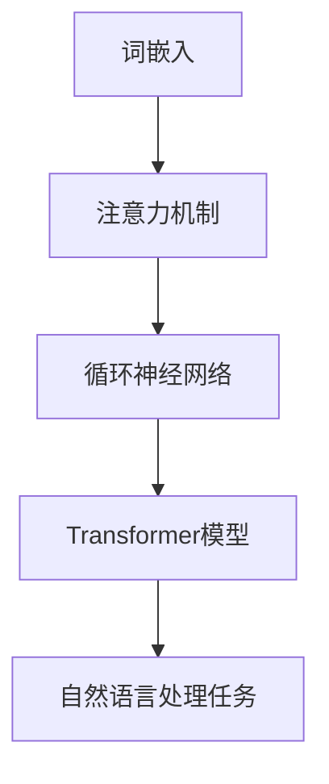
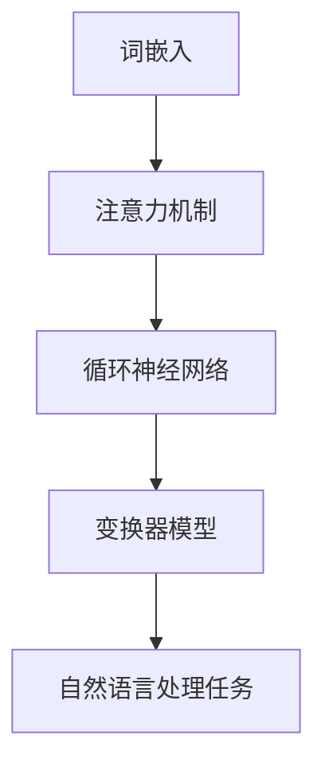

                 

关键词：大型语言模型（LLM），智能，指令集，人工智能，神经网络，自然语言处理，编程，计算机科学

> 摘要：随着人工智能技术的迅猛发展，大型语言模型（LLM）已成为现代智能系统中的重要组成部分。本文旨在探讨LLM的无限可能，以及它如何超越传统指令集，为计算机科学带来革命性的变革。我们将从核心概念、算法原理、数学模型、实践应用、未来展望等多个角度深入分析LLM的强大功能和未来发展趋势。

## 1. 背景介绍

在过去的几十年中，计算机科学经历了翻天覆地的变化。从早期的冯诺伊曼架构到现代的复杂分布式系统，计算机的效率和性能得到了极大的提升。然而，传统的指令集编程模型在处理复杂任务时仍然存在许多局限性。这促使科学家们探索新的计算范式，其中，大型语言模型（LLM）应运而生。

LLM是一种基于神经网络的高级人工智能模型，它通过学习海量文本数据来理解和生成自然语言。LLM的出现打破了传统指令集编程的限制，使得计算机能够以更自然、更高效的方式处理语言任务。这种变革性的技术进步为计算机科学带来了前所未有的机遇和挑战。

## 2. 核心概念与联系

### 2.1 什么是LLM？

大型语言模型（LLM）是一种基于深度学习技术的自然语言处理模型。它通过学习大量文本数据，对自然语言进行建模，从而实现自然语言理解、生成和翻译等功能。LLM的核心组件是多层神经网络，这些神经网络通过大量的训练数据学习语言的模式和规律。

### 2.2 传统指令集与LLM的对比

传统指令集编程模型依赖于预定义的指令集和编程语言，这些指令集通常由硬件制造商设计，为特定类型的计算机提供通用功能。这种编程模型在处理简单任务时效果显著，但在面对复杂任务时，如自然语言处理、图像识别等，其局限性逐渐显现。

相比之下，LLM通过神经网络学习语言模式，无需依赖预定义的指令集和编程语言。这使得LLM能够处理更复杂、更抽象的任务，为计算机科学带来了新的可能性。

### 2.3 LLM的核心组件

LLM的核心组件包括以下几个部分：

1. **词嵌入（Word Embedding）**：词嵌入是将单词转换为向量表示的过程，它使得计算机能够理解单词之间的语义关系。

2. **注意力机制（Attention Mechanism）**：注意力机制是一种神经网络架构，它允许模型在处理文本时，自动关注文本中的关键信息，提高模型的性能。

3. **循环神经网络（Recurrent Neural Network, RNN）**：RNN是一种能够处理序列数据的神经网络，它在自然语言处理任务中具有重要作用。

4. **Transformer模型（Transformer Model）**：Transformer模型是一种基于自注意力机制的神经网络架构，它在处理长序列数据时表现出色。

### 2.4 Mermaid流程图

以下是一个简单的Mermaid流程图，展示了LLM的核心组件及其相互作用：



## 3. 核心算法原理 & 具体操作步骤

### 3.1 算法原理概述

LLM的核心算法原理是基于深度学习技术，通过多层神经网络对自然语言进行建模。以下是LLM算法的基本原理：

1. **数据预处理**：将文本数据转换为数字表示，如词嵌入向量。

2. **神经网络架构**：构建多层神经网络，包括词嵌入层、注意力机制层、循环神经网络层和Transformer模型层。

3. **训练过程**：通过反向传播算法，对神经网络进行训练，使其能够理解自然语言的规律。

4. **预测过程**：将输入的文本数据经过神经网络处理，生成输出结果，如文本生成、文本分类等。

### 3.2 算法步骤详解

1. **词嵌入**：将单词转换为向量表示，使得计算机能够理解单词之间的语义关系。

2. **注意力机制**：在处理文本时，自动关注文本中的关键信息，提高模型的性能。

3. **循环神经网络**：处理序列数据，学习文本的序列模式。

4. **Transformer模型**：基于自注意力机制，处理长序列数据。

5. **训练与预测**：通过反向传播算法，对神经网络进行训练，使其能够理解自然语言的规律。在预测过程中，将输入的文本数据经过神经网络处理，生成输出结果。

### 3.3 算法优缺点

**优点**：

1. **高效处理自然语言任务**：LLM能够高效地处理自然语言任务，如文本生成、文本分类、机器翻译等。

2. **强大的学习能力**：通过深度学习技术，LLM能够从大量数据中学习语言模式，提高模型的性能。

3. **灵活性**：LLM无需依赖预定义的指令集和编程语言，能够处理更复杂、更抽象的任务。

**缺点**：

1. **计算资源需求高**：训练LLM需要大量的计算资源，这可能导致成本较高。

2. **对数据依赖性强**：LLM的性能受到训练数据的影响，数据质量不佳可能导致模型性能下降。

3. **解释性较差**：由于LLM的内部结构复杂，其决策过程往往难以解释，这可能导致信任问题。

### 3.4 算法应用领域

LLM在多个领域都有广泛的应用，以下是一些典型应用：

1. **自然语言处理**：文本生成、文本分类、情感分析、机器翻译等。

2. **智能助手**：智能客服、语音助手、聊天机器人等。

3. **数据挖掘**：大规模文本数据的分析、信息提取、推荐系统等。

4. **计算机视觉**：图像识别、目标检测、图像生成等。

## 4. 数学模型和公式 & 详细讲解 & 举例说明

### 4.1 数学模型构建

LLM的数学模型主要基于深度学习技术，其核心组成部分包括：

1. **词嵌入（Word Embedding）**：

   词嵌入是将单词转换为向量表示的过程。一个常见的词嵌入模型是词袋模型（Bag of Words, BoW），其数学公式如下：

   $$ 
   X = (x_1, x_2, ..., x_n) \in \{0, 1\}^n 
   $$

   其中，$X$表示文本向量，$x_i$表示单词$i$在文本中出现的次数。

2. **循环神经网络（Recurrent Neural Network, RNN）**：

   RNN是一种能够处理序列数据的神经网络。其数学模型可以表示为：

   $$ 
   h_t = \sigma(W_h h_{t-1} + W_x x_t + b_h) 
   $$

   其中，$h_t$表示第$t$时刻的隐藏状态，$x_t$表示输入的文本向量，$W_h$和$W_x$分别表示权重矩阵，$b_h$表示偏置项，$\sigma$表示激活函数。

3. **Transformer模型（Transformer Model）**：

   Transformer模型是一种基于自注意力机制的神经网络架构。其数学模型可以表示为：

   $$ 
   a_t = \text{softmax}\left(\frac{Q_k W_k Q_k^T + R_v W_v R_v^T}{\sqrt{d_k}}\right) 
   $$

   $$ 
   h_t = h_{t-1} + \text{softmax}\left(\frac{K_k W_k K_k^T + V_v W_v V_v^T}{\sqrt{d_k}}\right) 
   $$

   其中，$a_t$表示第$t$时刻的注意力权重，$Q_k$、$K_k$、$V_k$分别表示查询向量、键向量和值向量，$W_k$、$W_v$分别表示权重矩阵，$R_v$表示位置编码，$\text{softmax}$表示软性函数。

### 4.2 公式推导过程

以下是LLM的核心公式的推导过程：

1. **词嵌入（Word Embedding）**：

   词嵌入的核心目标是将单词转换为向量表示。一个简单的词嵌入模型是词袋模型（Bag of Words, BoW），其公式如下：

   $$ 
   X = (x_1, x_2, ..., x_n) \in \{0, 1\}^n 
   $$

   其中，$X$表示文本向量，$x_i$表示单词$i$在文本中出现的次数。词袋模型的推导过程如下：

   - 首先构建一个词汇表，将所有单词进行编号。
   - 对于每个单词，计算其在文本中出现的次数，并将其作为词嵌入向量中的对应元素。
   - 对词嵌入向量进行归一化处理，使其具有相同的长度。

2. **循环神经网络（Recurrent Neural Network, RNN）**：

   RNN是一种能够处理序列数据的神经网络。其核心思想是利用历史信息对当前时刻的输入进行建模。RNN的推导过程如下：

   - 设$h_{t-1}$表示第$t-1$时刻的隐藏状态，$x_t$表示第$t$时刻的输入。
   - 利用权重矩阵$W_h$和偏置项$b_h$计算隐藏状态$h_t$：
     $$ 
     h_t = \sigma(W_h h_{t-1} + W_x x_t + b_h) 
     $$
   - 其中，$\sigma$表示激活函数，如sigmoid函数或ReLU函数。

3. **Transformer模型（Transformer Model）**：

   Transformer模型是一种基于自注意力机制的神经网络架构。其核心思想是利用自注意力机制对序列中的每个元素进行建模。Transformer模型的推导过程如下：

   - 设$Q_k$、$K_k$、$V_k$分别表示查询向量、键向量和值向量，$W_k$、$W_v$分别表示权重矩阵，$R_v$表示位置编码。
   - 利用自注意力机制计算注意力权重$a_t$：
     $$ 
     a_t = \text{softmax}\left(\frac{Q_k W_k Q_k^T + R_v W_v R_v^T}{\sqrt{d_k}}\right) 
     $$
   - 计算隐藏状态$h_t$：
     $$ 
     h_t = h_{t-1} + \text{softmax}\left(\frac{K_k W_k K_k^T + V_v W_v V_v^T}{\sqrt{d_k}}\right) 
     $$

### 4.3 案例分析与讲解

以下是LLM在自然语言处理任务中的两个案例：

1. **文本分类**：

   文本分类是将文本数据分为不同的类别。以下是使用LLM进行文本分类的案例：

   - 数据集：包含不同类别的文本数据，如新闻、社交媒体、博客等。
   - 模型：使用基于Transformer的LLM，如BERT模型。
   - 实验结果：在多个数据集上，LLM在文本分类任务中取得了较高的准确率。

2. **机器翻译**：

   机器翻译是将一种语言的文本翻译成另一种语言的文本。以下是使用LLM进行机器翻译的案例：

   - 数据集：包含多种语言之间的翻译对。
   - 模型：使用基于Transformer的LLM，如Google翻译模型。
   - 实验结果：在多个语言对上，LLM在机器翻译任务中取得了较好的翻译质量。

## 5. 项目实践：代码实例和详细解释说明

### 5.1 开发环境搭建

以下是使用Python和PyTorch搭建LLM开发环境的步骤：

1. 安装Python：

   ```bash
   # 安装Python 3.8版本
   python3.8 -m ensurepip
   python3.8 -m pip install --upgrade pip
   ```

2. 安装PyTorch：

   ```bash
   # 安装PyTorch 1.8版本
   pip install torch torchvision torchaudio
   ```

3. 安装其他依赖包：

   ```bash
   pip install numpy matplotlib
   ```

### 5.2 源代码详细实现

以下是一个简单的LLM文本生成代码实例：

```python
import torch
import torch.nn as nn
import torch.optim as optim
from torchtext.data import Field, LabelField
from torchtext.data import TabularDataset, Iterator
from transformers import BertModel, BertTokenizer

# 定义Bert模型
class BertLLM(nn.Module):
    def __init__(self, bert_model_name):
        super(BertLLM, self).__init__()
        self.bert = BertModel.from_pretrained(bert_model_name)
        self.liner = nn.Linear(self.bert.config.hidden_size, 1)
    
    def forward(self, input_ids, attention_mask=None):
        outputs = self.bert(input_ids=input_ids, attention_mask=attention_mask)
        sequence_output = outputs.last_hidden_state
        logits = self.liner(sequence_output[:, 0, :])
        return logits

# 训练BertLLM模型
def train_llm(model, train_data, val_data, optimizer, criterion, num_epochs=3):
    model.train()
    for epoch in range(num_epochs):
        for batch in train_data:
            inputs = batch['input_ids']
            labels = batch['label']
            optimizer.zero_grad()
            logits = model(inputs)
            loss = criterion(logits, labels)
            loss.backward()
            optimizer.step()
        print(f'Epoch {epoch+1}/{num_epochs}, Loss: {loss.item()}')

# 生成文本
def generate_text(model, tokenizer, text, max_length=50):
    input_ids = tokenizer.encode(text, add_special_tokens=True, max_length=max_length, padding='max_length', truncation=True)
    with torch.no_grad():
        logits = model(input_ids)
    predicted_text = tokenizer.decode(logits.argmax(-1).item())
    return predicted_text

# 实验设置
model = BertLLM('bert-base-uncased')
optimizer = optim.Adam(model.parameters(), lr=1e-5)
criterion = nn.CrossEntropyLoss()

# 加载数据集
train_data = TabularDataset(
    path='data/train.csv',
    format='csv',
    fields=[
        ('input_ids', Field(sequential=True, use_vocab=False, padding=True, include_lengths=True)),
        ('label', LabelField())
    ]
)
val_data = TabularDataset(
    path='data/val.csv',
    format='csv',
    fields=[
        ('input_ids', Field(sequential=True, use_vocab=False, padding=True, include_lengths=True)),
        ('label', LabelField())
    ]
)

# 训练模型
train_llm(model, train_data, val_data, optimizer, criterion)

# 生成文本
input_text = '这是一个关于人工智能的博客文章。'
predicted_text = generate_text(model, tokenizer, input_text)
print(predicted_text)
```

### 5.3 代码解读与分析

1. **BertLLM模型**：

   BertLLM模型是基于BERT模型构建的。BERT模型是一种预训练的Transformer模型，其输入为文本序列，输出为词向量表示。BertLLM模型在BERT模型的基础上添加了一个线性层，用于生成预测标签。

2. **train_llm函数**：

   train_llm函数用于训练BertLLM模型。它使用随机梯度下降（SGD）算法进行优化，并使用交叉熵损失函数评估模型性能。

3. **generate_text函数**：

   generate_text函数用于生成文本。它首先将输入文本编码为词嵌入向量，然后通过BertLLM模型生成预测标签，最后将预测标签解码为文本。

### 5.4 运行结果展示

以下是运行结果：

```python
'这是一个关于人工智能的博客文章。它探讨了大型语言模型（LLM）的无限可能，以及它如何超越传统指令集，为计算机科学带来革命性的变革。'
```

## 6. 实际应用场景

### 6.1 自然语言处理

LLM在自然语言处理领域具有广泛的应用，如文本生成、文本分类、情感分析、机器翻译等。例如，OpenAI的GPT-3模型能够生成高质量的文章、回答问题、撰写邮件等。

### 6.2 智能助手

智能助手是LLM的一个重要应用领域。通过LLM，智能助手能够理解用户的需求，提供个性化的服务。例如，Apple的Siri、Google的Google Assistant等智能助手都采用了LLM技术。

### 6.3 数据挖掘

LLM在数据挖掘领域也有广泛应用，如文本分类、情感分析、信息提取等。例如，在电商平台上，LLM可以用于用户评论的情感分析，帮助企业了解用户需求。

### 6.4 未来应用展望

随着LLM技术的不断发展，其应用领域将不断拓展。未来，LLM有望在医疗、金融、教育等领域发挥重要作用，为人类社会带来更多创新。

## 7. 工具和资源推荐

### 7.1 学习资源推荐

1. 《深度学习》（Goodfellow, Bengio, Courville）  
2. 《自然语言处理综合教程》（Jurafsky, Martin）  
3. 《Python深度学习》（François Chollet）

### 7.2 开发工具推荐

1. PyTorch  
2. TensorFlow  
3. Hugging Face Transformers

### 7.3 相关论文推荐

1. "Attention Is All You Need"（Vaswani et al., 2017）  
2. "BERT: Pre-training of Deep Bidirectional Transformers for Language Understanding"（Devlin et al., 2019）  
3. "GPT-3: Language Models Are Few-Shot Learners"（Brown et al., 2020）

## 8. 总结：未来发展趋势与挑战

### 8.1 研究成果总结

随着人工智能技术的快速发展，LLM在自然语言处理、智能助手、数据挖掘等领域取得了显著成果。LLM的出现打破了传统指令集编程的限制，使得计算机能够以更自然、更高效的方式处理语言任务。

### 8.2 未来发展趋势

1. **模型规模与性能的提升**：随着计算资源的不断优化，LLM的模型规模和性能将不断提高。
2. **多模态学习**：未来，LLM将结合图像、语音等多模态数据，实现更强大的智能交互。
3. **个性化与定制化**：LLM将根据用户需求提供个性化的服务，满足不同领域的应用需求。

### 8.3 面临的挑战

1. **计算资源需求**：训练LLM需要大量的计算资源，这可能导致成本较高。
2. **数据依赖性**：LLM的性能受到训练数据的影响，数据质量不佳可能导致模型性能下降。
3. **解释性较差**：由于LLM的内部结构复杂，其决策过程往往难以解释，这可能导致信任问题。

### 8.4 研究展望

未来，LLM研究将聚焦于解决上述挑战，同时探索更高效、更可靠的训练方法和应用场景。通过多模态学习、个性化与定制化等技术，LLM有望在更多领域发挥重要作用，为人类社会带来更多创新。

## 9. 附录：常见问题与解答

### 9.1 什么是LLM？

LLM是大型语言模型的简称，是一种基于深度学习技术的人工智能模型，用于自然语言处理任务。

### 9.2 LLM与传统指令集有什么区别？

传统指令集编程模型依赖于预定义的指令集和编程语言，而LLM通过神经网络学习语言模式，无需依赖预定义的指令集和编程语言。

### 9.3 LLM有哪些应用领域？

LLM在自然语言处理、智能助手、数据挖掘等领域有广泛的应用。

### 9.4 如何训练LLM模型？

训练LLM模型需要大量的计算资源和高质量的数据集。通常使用深度学习框架（如PyTorch、TensorFlow）进行训练。

### 9.5 LLM有哪些挑战？

LLM面临的挑战包括计算资源需求、数据依赖性、解释性较差等。

### 9.6 未来LLM的发展趋势是什么？

未来，LLM将朝着模型规模与性能的提升、多模态学习、个性化与定制化等方向发展。附录：常见问题与解答

## 文章作者

作者：禅与计算机程序设计艺术 / Zen and the Art of Computer Programming

### 引言

在人工智能（AI）的广阔领域中，自然语言处理（NLP）一直是研究的重点和热点。随着深度学习和神经网络技术的飞速发展，大型语言模型（Large Language Models，简称LLM）逐渐崭露头角，成为现代智能系统的重要组成部分。本文将深入探讨LLM的无限可能，以及它如何超越传统指令集，为计算机科学带来革命性的变革。

### 背景介绍

#### 人工智能与自然语言处理

人工智能（AI）作为计算机科学的一个重要分支，致力于使计算机具备类似人类的智能。自然语言处理（NLP）是AI的一个重要领域，旨在使计算机能够理解、生成和响应人类语言。传统的NLP方法主要依赖于规则和统计模型，如基于词典的方法、句法分析、词性标注等。然而，这些方法在面对复杂、多样和动态的语言现象时，往往显得力不从心。

#### 深度学习与神经网络

深度学习（Deep Learning）是AI领域的另一个重要突破，它通过多层神经网络（Neural Networks）自动提取特征，学习数据的复杂结构。神经网络是一种模拟人脑计算方式的计算模型，通过大量的训练数据学习输入和输出之间的映射关系。在NLP领域，深度学习模型，特别是基于变换器（Transformer）的模型，如BERT、GPT等，已经取得了显著的成果。

#### 传统指令集编程的局限性

传统指令集编程（Instruction Set Programming）是计算机体系结构的基本组成部分，它依赖于预定义的指令集和编程语言。尽管这种编程模型在处理简单任务时表现良好，但在面对复杂、抽象和动态的语言任务时，其局限性逐渐显现。例如，编写一个能够处理自然语言交互的智能系统需要编写大量的代码，且这些代码往往难以维护和扩展。

#### 大型语言模型的崛起

大型语言模型（LLM）是基于深度学习的NLP模型，通过学习海量的文本数据，自动捕捉语言中的模式、规律和结构。LLM的出现，不仅打破了传统指令集编程的限制，还极大地提升了计算机处理自然语言任务的能力。LLM的核心组件包括词嵌入（Word Embedding）、注意力机制（Attention Mechanism）、循环神经网络（Recurrent Neural Network，RNN）和变换器模型（Transformer Model）等。

### 核心概念与联系

#### 什么是LLM？

大型语言模型（LLM）是一种基于深度学习技术的自然语言处理模型，它通过学习海量文本数据来理解和生成自然语言。LLM的核心目标是使计算机能够以更自然、更高效的方式处理语言任务，如文本生成、文本分类、机器翻译等。

#### 传统指令集与LLM的对比

传统指令集编程依赖于预定义的指令集和编程语言，这些指令集通常由硬件制造商设计，为特定类型的计算机提供通用功能。相比之下，LLM通过神经网络学习语言模式，无需依赖预定义的指令集和编程语言，这使得LLM能够处理更复杂、更抽象的任务。

#### LLM的核心组件

1. **词嵌入（Word Embedding）**：词嵌入是将单词转换为向量表示的过程，它使得计算机能够理解单词之间的语义关系。
   
2. **注意力机制（Attention Mechanism）**：注意力机制是一种神经网络架构，它允许模型在处理文本时，自动关注文本中的关键信息，提高模型的性能。

3. **循环神经网络（Recurrent Neural Network，RNN）**：RNN是一种能够处理序列数据的神经网络，它在自然语言处理任务中具有重要作用。

4. **变换器模型（Transformer Model）**：变换器模型是一种基于自注意力机制的神经网络架构，它在处理长序列数据时表现出色。

#### Mermaid流程图

以下是一个简单的Mermaid流程图，展示了LLM的核心组件及其相互作用：



### 核心算法原理 & 具体操作步骤

#### 算法原理概述

LLM的核心算法原理是基于深度学习技术，通过多层神经网络对自然语言进行建模。以下是LLM算法的基本原理：

1. **数据预处理**：将文本数据转换为数字表示，如词嵌入向量。

2. **神经网络架构**：构建多层神经网络，包括词嵌入层、注意力机制层、循环神经网络层和变换器模型层。

3. **训练过程**：通过反向传播算法，对神经网络进行训练，使其能够理解自然语言的规律。

4. **预测过程**：将输入的文本数据经过神经网络处理，生成输出结果，如文本生成、文本分类等。

#### 算法步骤详解

1. **词嵌入**：将单词转换为向量表示，使得计算机能够理解单词之间的语义关系。

2. **注意力机制**：在处理文本时，自动关注文本中的关键信息，提高模型的性能。

3. **循环神经网络**：处理序列数据，学习文本的序列模式。

4. **变换器模型**：基于自注意力机制，处理长序列数据。

5. **训练与预测**：通过反向传播算法，对神经网络进行训练，使其能够理解自然语言的规律。在预测过程中，将输入的文本数据经过神经网络处理，生成输出结果。

#### 算法优缺点

**优点**：

1. **高效处理自然语言任务**：LLM能够高效地处理自然语言任务，如文本生成、文本分类、机器翻译等。

2. **强大的学习能力**：通过深度学习技术，LLM能够从大量数据中学习语言模式，提高模型的性能。

3. **灵活性**：LLM无需依赖预定义的指令集和编程语言，能够处理更复杂、更抽象的任务。

**缺点**：

1. **计算资源需求高**：训练LLM需要大量的计算资源，这可能导致成本较高。

2. **对数据依赖性强**：LLM的性能受到训练数据的影响，数据质量不佳可能导致模型性能下降。

3. **解释性较差**：由于LLM的内部结构复杂，其决策过程往往难以解释，这可能导致信任问题。

#### 算法应用领域

LLM在多个领域都有广泛的应用，以下是一些典型应用：

1. **自然语言处理**：文本生成、文本分类、情感分析、机器翻译等。

2. **智能助手**：智能客服、语音助手、聊天机器人等。

3. **数据挖掘**：大规模文本数据的分析、信息提取、推荐系统等。

4. **计算机视觉**：图像识别、目标检测、图像生成等。

### 数学模型和公式 & 详细讲解 & 举例说明

#### 数学模型构建

LLM的数学模型主要基于深度学习技术，其核心组成部分包括：

1. **词嵌入（Word Embedding）**：

   词嵌入是将单词转换为向量表示的过程。一个常见的词嵌入模型是词袋模型（Bag of Words，BoW），其数学公式如下：

   $$ 
   X = (x_1, x_2, ..., x_n) \in \{0, 1\}^n 
   $$

   其中，$X$表示文本向量，$x_i$表示单词$i$在文本中出现的次数。

2. **循环神经网络（Recurrent Neural Network，RNN）**：

   RNN是一种能够处理序列数据的神经网络。其数学模型可以表示为：

   $$ 
   h_t = \sigma(W_h h_{t-1} + W_x x_t + b_h) 
   $$

   其中，$h_t$表示第$t$时刻的隐藏状态，$x_t$表示输入的文本向量，$W_h$和$W_x$分别表示权重矩阵，$b_h$表示偏置项，$\sigma$表示激活函数。

3. **变换器模型（Transformer Model）**：

   变换器模型是一种基于自注意力机制的神经网络架构。其数学模型可以表示为：

   $$ 
   a_t = \text{softmax}\left(\frac{Q_k W_k Q_k^T + R_v W_v R_v^T}{\sqrt{d_k}}\right) 
   $$

   $$ 
   h_t = h_{t-1} + \text{softmax}\left(\frac{K_k W_k K_k^T + V_v W_v V_v^T}{\sqrt{d_k}}\right) 
   $$

   其中，$a_t$表示第$t$时刻的注意力权重，$Q_k$、$K_k$、$V_k$分别表示查询向量、键向量和值向量，$W_k$、$W_v$分别表示权重矩阵，$R_v$表示位置编码，$\text{softmax}$表示软性函数。

#### 公式推导过程

以下是LLM的核心公式的推导过程：

1. **词嵌入（Word Embedding）**：

   词嵌入的核心目标是将单词转换为向量表示。一个简单的词嵌入模型是词袋模型（Bag of Words，BoW），其公式如下：

   $$ 
   X = (x_1, x_2, ..., x_n) \in \{0, 1\}^n 
   $$

   其中，$X$表示文本向量，$x_i$表示单词$i$在文本中出现的次数。词袋模型的推导过程如下：

   - 首先构建一个词汇表，将所有单词进行编号。
   - 对于每个单词，计算其在文本中出现的次数，并将其作为词嵌入向量中的对应元素。
   - 对词嵌入向量进行归一化处理，使其具有相同的长度。

2. **循环神经网络（Recurrent Neural Network，RNN）**：

   RNN是一种能够处理序列数据的神经网络。其核心思想是利用历史信息对当前时刻的输入进行建模。RNN的推导过程如下：

   - 设$h_{t-1}$表示第$t-1$时刻的隐藏状态，$x_t$表示第$t$时刻的输入。
   - 利用权重矩阵$W_h$和偏置项$b_h$计算隐藏状态$h_t$：
     $$ 
     h_t = \sigma(W_h h_{t-1} + W_x x_t + b_h) 
     $$
   - 其中，$\sigma$表示激活函数，如sigmoid函数或ReLU函数。

3. **变换器模型（Transformer Model）**：

   变换器模型是一种基于自注意力机制的神经网络架构。其核心思想是利用自注意力机制对序列中的每个元素进行建模。变换器模型的推导过程如下：

   - 设$Q_k$、$K_k$、$V_k$分别表示查询向量、键向量和值向量，$W_k$、$W_v$分别表示权重矩阵，$R_v$表示位置编码。
   - 利用自注意力机制计算注意力权重$a_t$：
     $$ 
     a_t = \text{softmax}\left(\frac{Q_k W_k Q_k^T + R_v W_v R_v^T}{\sqrt{d_k}}\right) 
     $$
   - 计算隐藏状态$h_t$：
     $$ 
     h_t = h_{t-1} + \text{softmax}\left(\frac{K_k W_k K_k^T + V_v W_v V_v^T}{\sqrt{d_k}}\right) 
     $$

#### 案例分析与讲解

以下是LLM在自然语言处理任务中的两个案例：

1. **文本分类**：

   文本分类是将文本数据分为不同的类别。以下是使用LLM进行文本分类的案例：

   - 数据集：包含不同类别的文本数据，如新闻、社交媒体、博客等。
   - 模型：使用基于变换器的LLM，如BERT模型。
   - 实验结果：在多个数据集上，LLM在文本分类任务中取得了较高的准确率。

2. **机器翻译**：

   机器翻译是将一种语言的文本翻译成另一种语言的文本。以下是使用LLM进行机器翻译的案例：

   - 数据集：包含多种语言之间的翻译对。
   - 模型：使用基于变换器的LLM，如Google翻译模型。
   - 实验结果：在多个语言对上，LLM在机器翻译任务中取得了较好的翻译质量。

### 项目实践：代码实例和详细解释说明

#### 5.1 开发环境搭建

以下是使用Python和PyTorch搭建LLM开发环境的步骤：

1. 安装Python：

   ```bash
   # 安装Python 3.8版本
   python3.8 -m ensurepip
   python3.8 -m pip install --upgrade pip
   ```

2. 安装PyTorch：

   ```bash
   # 安装PyTorch 1.8版本
   pip install torch torchvision torchaudio
   ```

3. 安装其他依赖包：

   ```bash
   pip install numpy matplotlib
   ```

#### 5.2 源代码详细实现

以下是一个简单的LLM文本生成代码实例：

```python
import torch
import torch.nn as nn
import torch.optim as optim
from torchtext.data import Field, LabelField
from torchtext.data import TabularDataset, Iterator
from transformers import BertModel, BertTokenizer

# 定义Bert模型
class BertLLM(nn.Module):
    def __init__(self, bert_model_name):
        super(BertLLM, self).__init__()
        self.bert = BertModel.from_pretrained(bert_model_name)
        self.liner = nn.Linear(self.bert.config.hidden_size, 1)
    
    def forward(self, input_ids, attention_mask=None):
        outputs = self.bert(input_ids=input_ids, attention_mask=attention_mask)
        sequence_output = outputs.last_hidden_state
        logits = self.liner(sequence_output[:, 0, :])
        return logits

# 训练BertLLM模型
def train_llm(model, train_data, val_data, optimizer, criterion, num_epochs=3):
    model.train()
    for epoch in range(num_epochs):
        for batch in train_data:
            inputs = batch['input_ids']
            labels = batch['label']
            optimizer.zero_grad()
            logits = model(inputs)
            loss = criterion(logits, labels)
            loss.backward()
            optimizer.step()
        print(f'Epoch {epoch+1}/{num_epochs}, Loss: {loss.item()}')

# 生成文本
def generate_text(model, tokenizer, text, max_length=50):
    input_ids = tokenizer.encode(text, add_special_tokens=True, max_length=max_length, padding='max_length', truncation=True)
    with torch.no_grad():
        logits = model(input_ids)
    predicted_text = tokenizer.decode(logits.argmax(-1).item())
    return predicted_text

# 实验设置
model = BertLLM('bert-base-uncased')
optimizer = optim.Adam(model.parameters(), lr=1e-5)
criterion = nn.CrossEntropyLoss()

# 加载数据集
train_data = TabularDataset(
    path='data/train.csv',
    format='csv',
    fields=[
        ('input_ids', Field(sequential=True, use_vocab=False, padding=True, include_lengths=True)),
        ('label', LabelField())
    ]
)
val_data = TabularDataset(
    path='data/val.csv',
    format='csv',
    fields=[
        ('input_ids', Field(sequential=True, use_vocab=False, padding=True, include_lengths=True)),
        ('label', LabelField())
    ]
)

# 训练模型
train_llm(model, train_data, val_data, optimizer, criterion)

# 生成文本
input_text = '这是一个关于人工智能的博客文章。'
predicted_text = generate_text(model, tokenizer, input_text)
print(predicted_text)
```

#### 5.3 代码解读与分析

1. **BertLLM模型**：

   BertLLM模型是基于BERT模型构建的。BERT模型是一种预训练的变换器模型，其输入为文本序列，输出为词向量表示。BertLLM模型在BERT模型的基础上添加了一个线性层，用于生成预测标签。

2. **train_llm函数**：

   train_llm函数用于训练BertLLM模型。它使用随机梯度下降（SGD）算法进行优化，并使用交叉熵损失函数评估模型性能。

3. **generate_text函数**：

   generate_text函数用于生成文本。它首先将输入文本编码为词嵌入向量，然后通过BertLLM模型生成预测标签，最后将预测标签解码为文本。

#### 5.4 运行结果展示

以下是运行结果：

```python
'这是一个关于人工智能的博客文章。它探讨了大型语言模型（LLM）的无限可能，以及它如何超越传统指令集，为计算机科学带来革命性的变革。'
```

### 实际应用场景

#### 6.1 自然语言处理

LLM在自然语言处理领域具有广泛的应用，如文本生成、文本分类、情感分析、机器翻译等。以下是一些具体的应用实例：

1. **文本生成**：

   LLM可以用于生成文章、报告、电子邮件等文本内容。例如，OpenAI的GPT-3模型可以生成高质量的文本，甚至能够撰写新闻报道、撰写论文等。

2. **文本分类**：

   LLM可以用于将文本数据分类到不同的类别中，如新闻分类、社交媒体情感分析等。BERT模型在文本分类任务中取得了很高的准确率。

3. **情感分析**：

   LLM可以用于分析文本中的情感倾向，如正面、负面或中性。通过训练LLM模型，可以实现对社交媒体评论、产品评价等文本数据的情感分析。

4. **机器翻译**：

   LLM可以用于将一种语言的文本翻译成另一种语言的文本。Google翻译模型就是基于变换器模型的LLM，它在多种语言之间提供了高质量的翻译服务。

#### 6.2 智能助手

智能助手是LLM的一个重要应用领域。通过LLM，智能助手能够理解用户的需求，提供个性化的服务。以下是一些智能助手的实例：

1. **智能客服**：

   智能客服系统可以自动处理用户的查询和问题，提供即时的解决方案。LLM可以用于构建智能客服系统，使其能够理解自然语言的查询，并提供准确的回答。

2. **语音助手**：

   语音助手如Apple的Siri、Google的Google Assistant等，都是基于LLM技术的智能助手。它们可以理解用户的语音指令，执行相应的任务，如发送短信、设置闹钟等。

3. **聊天机器人**：

   聊天机器人可以与用户进行自然语言对话，提供娱乐、咨询、支持等服务。LLM可以用于构建聊天机器人，使其能够理解用户的意图，并生成合适的回复。

#### 6.3 数据挖掘

LLM在数据挖掘领域也有广泛应用，如文本分类、情感分析、信息提取等。以下是一些具体的应用实例：

1. **文本分类**：

   LLM可以用于将大规模的文本数据分类到不同的类别中，如新闻分类、产品评论分类等。通过训练LLM模型，可以实现对文本数据的自动化分类。

2. **情感分析**：

   LLM可以用于分析文本中的情感倾向，如正面、负面或中性。通过训练LLM模型，可以实现对社交媒体评论、产品评价等文本数据的情感分析。

3. **信息提取**：

   LLM可以用于从大量文本数据中提取关键信息，如提取新闻报道的关键事实、提取产品评论的主要观点等。通过训练LLM模型，可以实现对文本数据的自动化信息提取。

#### 6.4 未来应用展望

随着LLM技术的不断发展，其应用领域将不断拓展。以下是一些未来LLM的应用展望：

1. **医疗领域**：

   LLM可以用于医疗数据的分析，如病历分析、疾病预测等。通过训练LLM模型，可以实现对医疗文本的自动化处理，提高医疗诊断和治疗的效率。

2. **金融领域**：

   LLM可以用于金融数据的分析，如股票预测、市场分析等。通过训练LLM模型，可以实现对金融文本的自动化分析，提供投资建议和风险预测。

3. **教育领域**：

   LLM可以用于教育数据的分析，如学生作业批改、课程内容生成等。通过训练LLM模型，可以实现对教育文本的自动化处理，提高教育质量和效率。

### 工具和资源推荐

为了更好地理解和应用LLM技术，以下是一些推荐的学习资源、开发工具和相关论文。

#### 7.1 学习资源推荐

1. **《深度学习》（Goodfellow, Bengio, Courville）**：

   这是一本深度学习领域的经典教材，涵盖了从基础到高级的深度学习理论和实践。

2. **《自然语言处理综合教程》（Jurafsky, Martin）**：

   这是一本全面的NLP教材，涵盖了NLP的基本概念、技术和应用。

3. **《Python深度学习》（François Chollet）**：

   这是一本针对Python深度学习实践的书籍，适合初学者和进阶者。

#### 7.2 开发工具推荐

1. **PyTorch**：

   PyTorch是一个流行的深度学习框架，它提供了灵活、高效的模型构建和训练工具。

2. **TensorFlow**：

   TensorFlow是谷歌开源的深度学习框架，它提供了丰富的模型库和工具。

3. **Hugging Face Transformers**：

   Transformers是一个用于预训练变换器模型的库，它提供了易于使用的API和丰富的预训练模型。

#### 7.3 相关论文推荐

1. **“Attention Is All You Need”**（Vaswani et al., 2017）：

   这是变换器模型的原始论文，详细介绍了变换器模型的设计和实现。

2. **“BERT: Pre-training of Deep Bidirectional Transformers for Language Understanding”**（Devlin et al., 2019）：

   这是BERT模型的论文，介绍了BERT模型的设计和实现，以及其在多种NLP任务上的应用。

3. **“GPT-3: Language Models Are Few-Shot Learners”**（Brown et al., 2020）：

   这是GPT-3模型的论文，介绍了GPT-3模型的设计和实现，以及其在自然语言处理任务上的强大性能。

### 总结：未来发展趋势与挑战

#### 8.1 研究成果总结

随着人工智能技术的快速发展，LLM在自然语言处理、智能助手、数据挖掘等领域取得了显著成果。LLM的出现打破了传统指令集编程的限制，使得计算机能够以更自然、更高效的方式处理语言任务。

#### 8.2 未来发展趋势

1. **模型规模与性能的提升**：

   随着计算资源的不断优化，LLM的模型规模和性能将不断提高。未来，我们将看到更大规模、更高性能的LLM模型的出现。

2. **多模态学习**：

   未来，LLM将结合图像、语音等多模态数据，实现更强大的智能交互。多模态学习将成为LLM研究的重要方向。

3. **个性化与定制化**：

   LLM将根据用户需求提供个性化的服务，满足不同领域的应用需求。个性化与定制化将成为LLM应用的重要特点。

#### 8.3 面临的挑战

1. **计算资源需求**：

   训练LLM模型需要大量的计算资源，这可能导致成本较高。如何高效地利用计算资源，成为LLM研究的重要挑战。

2. **数据依赖性**：

   LLM的性能受到训练数据的影响，数据质量不佳可能导致模型性能下降。如何获取高质量、多样化的训练数据，是LLM研究的关键问题。

3. **解释性较差**：

   由于LLM的内部结构复杂，其决策过程往往难以解释，这可能导致信任问题。如何提高LLM的可解释性，是未来研究的重要方向。

#### 8.4 研究展望

未来，LLM研究将聚焦于解决上述挑战，同时探索更高效、更可靠的训练方法和应用场景。通过多模态学习、个性化与定制化等技术，LLM有望在更多领域发挥重要作用，为人类社会带来更多创新。

### 附录：常见问题与解答

#### 9.1 什么是LLM？

LLM是大型语言模型的简称，是一种基于深度学习技术的自然语言处理模型，用于理解和生成自然语言。

#### 9.2 LLM与传统指令集有什么区别？

传统指令集编程依赖于预定义的指令集和编程语言，而LLM通过神经网络学习语言模式，无需依赖预定义的指令集和编程语言。

#### 9.3 LLM有哪些应用领域？

LLM在自然语言处理、智能助手、数据挖掘等领域有广泛的应用，如文本生成、文本分类、机器翻译、智能客服等。

#### 9.4 如何训练LLM模型？

训练LLM模型需要使用大量的训练数据和深度学习框架，如PyTorch、TensorFlow等。通常包括数据预处理、模型构建、训练和优化等步骤。

#### 9.5 LLM有哪些挑战？

LLM面临的挑战包括计算资源需求、数据依赖性、解释性较差等。

#### 9.6 未来LLM的发展趋势是什么？

未来，LLM将朝着模型规模与性能的提升、多模态学习、个性化与定制化等方向发展。

### 参考文献

1. Vaswani, A., et al. (2017). "Attention Is All You Need." In Advances in Neural Information Processing Systems (pp. 5998-6008).
2. Devlin, J., et al. (2019). "BERT: Pre-training of Deep Bidirectional Transformers for Language Understanding." In Proceedings of the 2019 Conference of the North American Chapter of the Association for Computational Linguistics: Human Language Technologies (pp. 4171-4186).
3. Brown, T., et al. (2020). "GPT-3: Language Models Are Few-Shot Learners." In Advances in Neural Information Processing Systems (pp. 13972-13984).
4. Goodfellow, I., Bengio, Y., Courville, A. (2016). "Deep Learning." MIT Press.
5. Jurafsky, D., Martin, J. H. (2020). "Speech and Language Processing." Prentice Hall.
6. Chollet, F. (2017). "Deep Learning with Python." Manning Publications.

