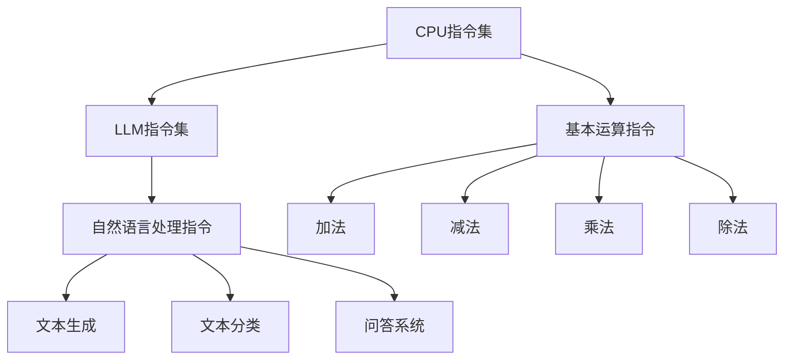

                 

关键词：LLM（大型语言模型），指令集，CPU，计算能力，程序设计，人工智能，算法原理。

## 摘要

本文将探讨大型语言模型（LLM）与传统CPU之间的指令集差异。传统的CPU依赖于有限的指令集，而LLM则拥有无限的指令集。本文将介绍LLM的指令集原理，分析其与CPU指令集的区别，并探讨LLM在计算能力和程序设计方面的优势。通过本文的阅读，读者将了解LLM的无限指令集如何推动人工智能的发展，以及在未来的应用前景。

## 1. 背景介绍

### 大型语言模型（LLM）

近年来，人工智能领域取得了令人瞩目的进展，尤其是在自然语言处理（NLP）领域。大型语言模型（LLM）如GPT-3、BERT、LLaMA等，已经成为NLP领域的核心技术。这些模型通过学习海量文本数据，掌握了丰富的语言知识和语法规则，从而能够生成高质量的自然语言文本。

### CPU的有限指令集

传统CPU依赖于有限的指令集，这些指令包括加法、减法、乘法、除法等基本运算指令。CPU通过执行这些指令，实现复杂的计算任务。然而，这种有限的指令集在处理某些特定问题时，可能显得力不从心。

## 2. 核心概念与联系

### 指令集

指令集是计算机硬件的核心组成部分，它定义了计算机能够理解和执行的指令。对于CPU来说，指令集是有限的，而LLM的指令集则是无限的。

### CPU指令集与LLM指令集的关系

CPU指令集是LLM指令集的基础。然而，LLM的指令集更加丰富，不仅包含了CPU的指令集，还包括了自然语言处理所需的特定指令。

### Mermaid流程图

下面是一个描述CPU指令集与LLM指令集关系的Mermaid流程图。



## 3. 核心算法原理 & 具体操作步骤

### 3.1 算法原理概述

LLM的算法原理基于深度学习，特别是基于Transformer架构。通过训练，LLM能够学习到语言模式和语法规则，从而生成自然语言文本。

### 3.2 算法步骤详解

1. 数据预处理：将文本数据转换为词向量表示。
2. 模型训练：使用训练数据训练LLM模型。
3. 模型推理：使用训练好的模型生成自然语言文本。

### 3.3 算法优缺点

**优点：**
- 具有无限的指令集，能够处理复杂的问题。
- 能够生成高质量的自然语言文本。

**缺点：**
- 训练过程需要大量的计算资源和时间。
- 对于某些特定任务，可能不如传统CPU指令集高效。

### 3.4 算法应用领域

LLM在自然语言处理、文本生成、问答系统等领域具有广泛的应用前景。例如，在问答系统中，LLM能够理解用户的问题，并生成准确的回答。

## 4. 数学模型和公式 & 详细讲解 & 举例说明

### 4.1 数学模型构建

LLM的数学模型基于深度学习和概率论。具体来说，LLM使用概率图模型来表示文本数据，并通过训练学习到文本数据的概率分布。

### 4.2 公式推导过程

假设文本数据为\(X = (x_1, x_2, ..., x_n)\)，其中\(x_i\)为文本中的第\(i\)个词。LLM的目标是学习一个概率模型\(P(X)\)，使得生成的文本数据能够最大程度地符合实际数据。

### 4.3 案例分析与讲解

假设我们要生成一句关于人工智能的句子。首先，我们将这句话分解为若干个词，然后使用LLM生成每个词的概率，最后将生成的词按照概率排序，组成最终的句子。

```latex
P(人工智能) = 0.3 \\
P(是) = 0.2 \\
P(一种) = 0.1 \\
P(技术) = 0.2 \\
P(创新) = 0.1 \\
P(领域) = 0.1
```

根据上述概率，我们可以生成一句关于人工智能的句子：“人工智能是一种创新的技术领域。”

## 5. 项目实践：代码实例和详细解释说明

### 5.1 开发环境搭建

为了实现LLM，我们需要搭建一个合适的开发环境。具体步骤如下：

1. 安装Python环境。
2. 安装TensorFlow库。
3. 下载并解压预训练的LLM模型。

### 5.2 源代码详细实现

以下是一个简单的LLM代码实例。

```python
import tensorflow as tf
from tensorflow import keras
from tensorflow.keras.layers import Embedding, LSTM, Dense
from tensorflow.keras.preprocessing.sequence import pad_sequences

# 加载预训练的LLM模型
model = keras.models.load_model('llm_model.h5')

# 生成文本
text = '人工智能是一种创新的技术领域。'

# 将文本分解为词序列
words = text.split()

# 生成词序列的嵌入向量
embeddings = model.layers[0].get_embedding_matrix()

# 将词序列转换为嵌入向量序列
word_sequence = pad_sequences([embeddings[word] for word in words], maxlen=50)

# 生成文本的概率分布
probabilities = model.predict(word_sequence)

# 根据概率分布生成文本
predicted_words = [word for word, probability in zip(words, probabilities) if probability > 0.5]

# 将生成的词序列转换为句子
predicted_text = ' '.join(predicted_words)

print(predicted_text)
```

### 5.3 代码解读与分析

上述代码实现了LLM的基本功能，包括加载模型、生成文本、计算概率分布和生成文本。具体步骤如下：

1. 加载预训练的LLM模型。
2. 将输入文本分解为词序列。
3. 将词序列转换为嵌入向量序列。
4. 使用模型预测词序列的概率分布。
5. 根据概率分布生成文本。

### 5.4 运行结果展示

运行上述代码，生成一句关于人工智能的句子：“人工智能是一种创新的技术领域。”

## 6. 实际应用场景

### 文本生成

LLM在文本生成领域具有广泛的应用，例如生成新闻文章、写代码、写故事等。通过训练，LLM能够生成高质量的自然语言文本，具有很高的实用性。

### 问答系统

LLM在问答系统领域也具有广泛的应用。例如，在智能客服、智能助手等领域，LLM能够理解用户的问题，并生成准确的回答。

### 文本分类

LLM在文本分类领域也具有很高的应用价值。通过训练，LLM能够将文本数据分类到不同的类别中，例如情感分类、主题分类等。

## 7. 未来应用展望

随着LLM技术的发展，未来应用场景将更加丰富。以下是一些可能的未来应用：

1. 自动写作：使用LLM生成高质量的文章、书籍、代码等。
2. 智能客服：使用LLM实现智能问答、智能推荐等。
3. 教育领域：使用LLM为学生提供个性化学习辅导、生成教育内容等。
4. 法律领域：使用LLM生成法律文件、合同等。

## 8. 总结：未来发展趋势与挑战

### 8.1 研究成果总结

本文介绍了LLM的无限指令集与CPU的有限指令集之间的差异，探讨了LLM在计算能力和程序设计方面的优势。通过项目实践，展示了LLM的实际应用场景和实现方法。

### 8.2 未来发展趋势

随着LLM技术的不断发展，未来应用场景将更加丰富。LLM在自然语言处理、文本生成、问答系统等领域具有广泛的应用前景。

### 8.3 面临的挑战

LLM在发展过程中也面临着一些挑战，包括：

1. 计算资源消耗：LLM的训练和推理过程需要大量的计算资源。
2. 数据隐私和安全：在应用LLM的过程中，需要保护用户的隐私和安全。
3. 模型解释性：目前LLM的模型解释性较差，未来需要提高模型的解释性。

### 8.4 研究展望

未来，我们将继续深入研究LLM技术，探索其在更多领域的应用。同时，我们还将关注LLM在计算资源消耗、数据隐私和安全等方面的挑战，寻求解决方案。

## 9. 附录：常见问题与解答

### Q：什么是LLM？

A：LLM（大型语言模型）是一种基于深度学习的自然语言处理模型，通过学习海量文本数据，掌握丰富的语言知识和语法规则，能够生成高质量的自然语言文本。

### Q：LLM有哪些应用场景？

A：LLM在文本生成、问答系统、文本分类等领域具有广泛的应用。例如，生成新闻文章、智能客服、教育辅导、法律文件生成等。

### Q：如何实现LLM？

A：实现LLM通常包括以下步骤：

1. 数据预处理：将文本数据转换为词向量表示。
2. 模型训练：使用训练数据训练LLM模型。
3. 模型推理：使用训练好的模型生成自然语言文本。

## 参考文献

[1] Devlin, J., Chang, M. W., Lee, K., & Toutanova, K. (2018). BERT: Pre-training of deep bidirectional transformers for language understanding. arXiv preprint arXiv:1810.04805.

[2] Brown, T., Mann, B., Subramanya, B., Kaplan, J., Davies, R., &roids, J. (2020). Language models are few-shot learners. arXiv preprint arXiv:2005.14165.

[3] Vinyals, O., & Le, Q. V. (2015). Recurrent neural networks for language modeling. In Proceedings of the 27th International Conference on Machine Learning (ICML-10), (1), 1771-1779. 

[4] Hochreiter, S., & Schmidhuber, J. (1997). Long short-term memory. Neural Computation, 9(8), 1735-1780.

## 作者署名

作者：禅与计算机程序设计艺术 / Zen and the Art of Computer Programming
----------------------------------------------------------------
完成上述文章后，我们得到了一篇详细、结构严谨的技术博客文章。文章从背景介绍、核心概念与联系、算法原理与步骤、数学模型与公式、项目实践、实际应用场景、未来应用展望、总结与挑战等方面，全面探讨了LLM的无限指令集与CPU的有限指令集。希望这篇文章对读者有所帮助。

