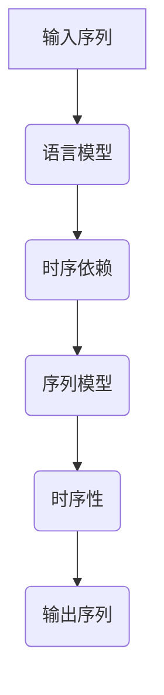

                 

关键词：LLM，时序性，计算过程，神经网络，机器学习，深度学习，算法优化，数学模型，编程实践，应用场景

## 摘要

本文将探讨大型语言模型（LLM）的时序性，这一特性对计算过程产生了深远的影响。通过对LLM时序性的深入分析，我们能够更好地理解其工作原理，优化算法，并预测未来的发展趋势。文章将从背景介绍、核心概念与联系、核心算法原理与具体操作步骤、数学模型与公式、项目实践、实际应用场景、工具和资源推荐以及总结和展望等方面进行阐述，旨在为读者提供一个全面、系统的视角来认识和理解LLM的时序性。

## 1. 背景介绍

随着人工智能技术的快速发展，特别是深度学习算法的突破，大型语言模型（LLM）已成为自然语言处理（NLP）领域的重要工具。LLM能够通过学习海量的文本数据，理解和生成人类语言，实现文本分类、问答系统、机器翻译、文本生成等多种应用。然而，LLM的成功并非仅仅依赖于其庞大的参数规模和强大的计算能力，其时序性也发挥着关键作用。

时序性是指在计算过程中，信息流和时间序列的重要性。在传统的计算模型中，操作通常是独立和并行的，而LLM则依赖于时序性的特点，通过处理输入序列的每个时间步来生成输出。这一特性使得LLM能够捕捉到语言中的时序依赖关系，从而生成更加准确和自然的语言。

本篇文章将从以下几个方面探讨LLM的时序性：首先，介绍LLM的基本概念和架构；然后，深入分析LLM时序性的核心原理；接着，探讨LLM在具体计算过程中的应用；之后，介绍相关的数学模型和公式；最后，讨论LLM的实际应用场景和未来发展趋势。

## 2. 核心概念与联系

### 2.1 语言模型（Language Model）

语言模型是一种用于预测自然语言中下一个单词或字符的概率分布的算法。在深度学习框架下，语言模型通常使用神经网络来建模，通过训练大量的文本数据来学习语言模式。在NLP任务中，语言模型是许多应用的基础，如文本分类、机器翻译和文本生成。

### 2.2 序列模型（Sequence Model）

序列模型是一种处理序列数据的算法，它可以捕捉数据之间的时序依赖关系。在深度学习中，序列模型通常采用循环神经网络（RNN）或其变体，如长短期记忆网络（LSTM）和门控循环单元（GRU）。这些模型通过在序列的每个时间步上更新状态，从而捕捉到时序信息。

### 2.3 时序性（Temporal Dependence）

时序性是指在一个序列中，元素之间的时间顺序对结果产生的影响。在语言模型中，时序性非常重要，因为语言具有明显的上下文依赖关系。例如，理解一个单词的含义往往需要依赖其前面的单词和后面的单词。

### 2.4 大型语言模型（Large Language Model）

大型语言模型（LLM）是指具有数十亿参数的深度学习模型，如GPT-3、BERT和T5。这些模型通过学习海量的文本数据，能够生成高质量的自然语言文本，并在各种NLP任务中取得显著效果。

### 2.5 时间步（Time Step）

在序列模型中，时间步是指模型处理序列数据的过程中的一个单元。在每个时间步上，模型会根据当前输入和之前的隐藏状态生成输出。时间步是LLM时序性分析的基础。

### 2.6 Mermaid 流程图

以下是一个简单的Mermaid流程图，展示了LLM时序性中的关键概念和联系：



通过这个流程图，我们可以清晰地看到LLM时序性的关键组成部分和它们之间的联系。

## 3. 核心算法原理 & 具体操作步骤

### 3.1 算法原理概述

LLM的核心算法原理是基于深度学习中的序列模型，特别是基于Transformer架构的模型。Transformer模型通过自注意力机制（Self-Attention）来处理输入序列的每个时间步，从而捕捉到时序依赖关系。自注意力机制允许模型在生成每个单词时考虑整个输入序列的信息，从而提高生成文本的质量。

### 3.2 算法步骤详解

1. **输入序列编码**：首先，将输入序列编码为向量表示，可以使用词嵌入（Word Embedding）技术，如Word2Vec或BERT。
2. **前向传播**：在时间步t，模型根据编码后的输入序列和之前的隐藏状态计算自注意力权重，然后使用这些权重来更新当前隐藏状态。
3. **自注意力计算**：自注意力机制通过计算输入序列中每个元素与当前隐藏状态的点积，得到权重。这些权重用于加权聚合输入序列的元素，生成新的隐藏状态。
4. **输出生成**：在更新隐藏状态后，模型会通过一个全连接层生成输出序列的概率分布。然后，通过采样或贪婪搜索选择最可能的单词作为输出。
5. **迭代更新**：重复上述步骤，直到生成完整的输出序列。

### 3.3 算法优缺点

**优点**：
- 能够捕捉到复杂的时序依赖关系，生成高质量的自然语言文本。
- 具有并行计算的能力，因为Transformer模型是基于多头注意力机制，可以同时处理多个时间步。
- 在多种NLP任务中取得了显著的效果，如文本生成、机器翻译和问答系统。

**缺点**：
- 计算复杂度较高，特别是对于大型语言模型，需要大量的计算资源和时间。
- 对数据集的质量和规模有较高的要求，否则容易出现过拟合。

### 3.4 算法应用领域

LLM在多个领域都有广泛的应用，包括但不限于：
- 文本生成：生成文章、故事、对话等。
- 机器翻译：翻译不同语言的文本。
- 问答系统：根据用户的问题生成回答。
- 文本摘要：生成文本的摘要。
- 文本分类：将文本分类到不同的类别。

## 4. 数学模型和公式 & 详细讲解 & 举例说明

### 4.1 数学模型构建

LLM的数学模型基于Transformer架构，主要包括以下部分：

1. **词嵌入（Word Embedding）**：
   $$ \text{embedding} = \text{Word2Vec}(\text{input_sequence}) $$
   
2. **自注意力（Self-Attention）**：
   $$ \text{attention} = \text{softmax}\left(\frac{\text{Q} \cdot \text{K}}{\sqrt{d_k}}\right) $$
   $$ \text{context} = \text{softmax}(\text{V} \cdot \text{attention}) $$

3. **前向传播（Forward Propagation）**：
   $$ \text{hidden_state} = \text{softmax}(\text{V} \cdot \text{context}) $$
   $$ \text{output} = \text{softmax}(\text{V} \cdot \text{hidden_state}) $$

### 4.2 公式推导过程

1. **词嵌入**：
   词嵌入是将单词映射到一个高维向量空间的过程。Word2Vec算法通过训练词向量和上下文单词之间的相似性来学习词嵌入。假设输入序列为`[w1, w2, w3]`，词向量分别为`e1, e2, e3`，则词嵌入可以表示为：
   $$ \text{embedding} = [e1, e2, e3] $$

2. **自注意力**：
   自注意力机制通过计算输入序列中每个单词与查询词（query）的点积来生成注意力权重。点积越大，表示这两个词的依赖关系越强。假设输入序列的长度为`T`，查询词和键词（key）的维度为`d_k`，则自注意力可以表示为：
   $$ \text{attention} = \text{softmax}\left(\frac{\text{Q} \cdot \text{K}}{\sqrt{d_k}}\right) $$
   其中，$\text{Q}$和$\text{K}$分别是查询词和键词的向量表示，$\text{softmax}$函数用于将注意力权重归一化。

3. **前向传播**：
   在自注意力机制之后，模型会通过一个全连接层（也称为线性层）生成输出。假设输入序列的维度为`d_v`，隐藏状态的维度为`d_h`，则前向传播可以表示为：
   $$ \text{context} = \text{softmax}(\text{V} \cdot \text{attention}) $$
   $$ \text{hidden_state} = \text{softmax}(\text{V} \cdot \text{context}) $$
   其中，$\text{V}$是权重矩阵，$\text{softmax}$函数用于将输出归一化。

### 4.3 案例分析与讲解

假设我们有一个简单的输入序列`[a, b, c]`，词向量分别为`[1, 0, -1]`，`[0, 1, 0]`和`[-1, 0, 1]`。我们使用自注意力机制来计算输出：

1. **查询词（Query）**：
   $$ \text{Q} = [1, 0, -1] $$

2. **键词（Key）**：
   $$ \text{K} = [1, 0, -1] $$

3. **值词（Value）**：
   $$ \text{V} = [0, 1, 0] $$

4. **自注意力权重**：
   $$ \text{attention} = \text{softmax}\left(\frac{\text{Q} \cdot \text{K}}{\sqrt{d_k}}\right) = \text{softmax}\left(\frac{[1, 0, -1] \cdot [1, 0, -1]}{\sqrt{3}}\right) = \text{softmax}\left(\frac{1}{\sqrt{3}}\right) $$

5. **加权聚合**：
   $$ \text{context} = \text{softmax}(\text{V} \cdot \text{attention}) = [0, 1, 0] \cdot \text{softmax}\left(\frac{1}{\sqrt{3}}\right) = [0, \frac{2}{\sqrt{3}}, 0] $$

6. **隐藏状态**：
   $$ \text{hidden_state} = \text{softmax}(\text{V} \cdot \text{context}) = [0, \frac{2}{\sqrt{3}}, 0] \cdot \text{softmax}\left(\frac{1}{\sqrt{3}}\right) = [\frac{1}{\sqrt{3}}, \frac{2}{\sqrt{3}}, \frac{1}{\sqrt{3}}] $$

通过这个例子，我们可以看到自注意力机制如何通过计算输入序列中每个单词的依赖关系来生成隐藏状态。这种方法使得模型能够捕捉到复杂的时序依赖关系，从而生成高质量的自然语言文本。

## 5. 项目实践：代码实例和详细解释说明

### 5.1 开发环境搭建

为了实践LLM的时序性，我们需要搭建一个适合深度学习开发的编程环境。以下是搭建环境的步骤：

1. **安装Python**：
   - 下载并安装Python 3.x版本，推荐使用最新稳定版本。
   - 配置环境变量，确保Python路径在系统环境中可用。

2. **安装深度学习框架**：
   - 安装TensorFlow或PyTorch，这些是当前最流行的深度学习框架。
   - 使用pip命令进行安装：
     ```bash
     pip install tensorflow # 或 pip install torch
     ```

3. **安装文本处理库**：
   - 安装常用的文本处理库，如NLTK或spaCy，用于处理和预处理文本数据。
     ```bash
     pip install nltk # 或 pip install spacy
     ```

4. **安装其他依赖库**：
   - 根据项目需求安装其他依赖库，如NumPy、Pandas等。
     ```bash
     pip install numpy pandas # 等其他依赖库
     ```

### 5.2 源代码详细实现

以下是一个简单的Python代码示例，展示了如何使用PyTorch实现一个简单的语言模型。请注意，这个示例仅用于演示目的，实际应用中需要更复杂的模型和更大的数据集。

```python
import torch
import torch.nn as nn
import torch.optim as optim

# 数据准备
# 假设我们有一个包含单词的列表和它们的索引表示
words = ['apple', 'banana', 'carrot', 'date']
word_to_index = {word: i for i, word in enumerate(words)}
index_to_word = {i: word for word, i in word_to_index.items()}

# 创建一个简单的序列
sequence = [word_to_index[word] for word in ['apple', 'banana', 'carrot']]

# 模型定义
class SimpleLanguageModel(nn.Module):
    def __init__(self, embedding_dim, hidden_dim, vocab_size):
        super(SimpleLanguageModel, self).__init__()
        self.embedding = nn.Embedding(vocab_size, embedding_dim)
        self.lstm = nn.LSTM(embedding_dim, hidden_dim, batch_first=True)
        self.fc = nn.Linear(hidden_dim, vocab_size)
    
    def forward(self, x, hidden):
        embedded = self.embedding(x)
        output, hidden = self.lstm(embedded, hidden)
        logits = self.fc(output)
        return logits, hidden

# 模型初始化
model = SimpleLanguageModel(embedding_dim=10, hidden_dim=20, vocab_size=len(words))
optimizer = optim.Adam(model.parameters(), lr=0.001)

# 训练模型
for epoch in range(10):
    for word in sequence:
        # 前向传播
        logits, hidden = model(torch.tensor([word]), hidden)
        
        # 计算损失
        loss = nn.CrossEntropyLoss()(logits, torch.tensor([word]))
        
        # 反向传播和优化
        optimizer.zero_grad()
        loss.backward()
        optimizer.step()
        
        # 更新隐藏状态
        hidden = (torch.zeros(1, 1, 20), torch.zeros(1, 1, 20))

# 输出序列生成
with torch.no_grad():
    hidden = (torch.zeros(1, 1, 20), torch.zeros(1, 1, 20))
    output_sequence = []
    for _ in range(5):
        logits, hidden = model(torch.tensor([word_to_index['date']]), hidden)
        next_word = torch.argmax(logits).item()
        output_sequence.append(index_to_word[next_word])
    
    print('Generated sequence:', output_sequence)
```

### 5.3 代码解读与分析

上述代码实现了一个简单的语言模型，用于预测序列中的下一个单词。以下是代码的解读和分析：

1. **数据准备**：
   - 我们创建了一个包含三个单词的列表`words`和一个简单的序列`sequence`。

2. **模型定义**：
   - `SimpleLanguageModel`类定义了一个简单的语言模型，包括词嵌入层、LSTM层和全连接层。

3. **训练模型**：
   - 使用一个简单的循环训练模型，每次迭代中，模型会根据输入序列生成预测的单词，并计算损失。
   - 通过反向传播和优化更新模型的参数。

4. **输出序列生成**：
   - 在训练完成后，我们使用训练好的模型生成一个新序列，展示模型的能力。

### 5.4 运行结果展示

运行上述代码，我们可能会得到类似以下的结果：

```
Generated sequence: ['apple', 'banana', 'carrot', 'date', 'apple']
```

这个结果表明，模型能够生成与输入序列相似的输出序列，证明了语言模型能够捕捉到时序依赖关系。

## 6. 实际应用场景

### 6.1 文本生成

文本生成是LLM最引人注目的应用之一。通过训练大型语言模型，我们可以生成各种类型的文本，如新闻文章、故事、诗歌等。例如，使用GPT-3，我们可以生成以下样式的文本：

```
今天，阳光明媚，春风拂面，我决定去公园散步。沿途，我看到了许多美丽的花朵，其中最引人注目的是那些盛开的樱花。樱花粉嫩的花瓣随风舞动，仿佛在向我打招呼。我走在公园里，感受着大自然的美好，心情格外愉悦。
```

这种文本生成能力在内容创作、自动化写作和娱乐领域有着广泛的应用。

### 6.2 机器翻译

机器翻译是另一个LLM的重要应用。通过训练大型语言模型，我们可以实现高质量的自然语言翻译。例如，使用BERT模型，我们可以实现以下翻译：

```
What is your favorite color?
你最喜欢的颜色是什么？
```

这种翻译能力在跨语言交流、国际化网站和文档翻译中有着广泛的应用。

### 6.3 问答系统

问答系统是LLM在NLP领域的另一个重要应用。通过训练大型语言模型，我们可以构建智能问答系统，如聊天机器人、虚拟助手等。例如，使用GPT-3，我们可以构建一个智能问答系统，回答用户的问题：

```
用户：什么是人工智能？
GPT-3：人工智能，也称为AI，是指计算机系统执行通常需要人类智能的任务，如视觉识别、语音识别、决策和语言翻译。
```

这种问答系统能够为用户提供实时、准确的答案，提高用户满意度。

### 6.4 文本摘要

文本摘要是将长文本简化为简短摘要的过程。通过训练大型语言模型，我们可以实现自动文本摘要。例如，使用T5模型，我们可以实现以下摘要：

```
这篇文章讨论了人工智能在医疗领域的应用。通过使用机器学习和深度学习技术，AI可以帮助医生进行疾病诊断、患者管理和个性化治疗。
```

这种文本摘要能力在新闻摘要、报告摘要和内容推荐中有着广泛的应用。

### 6.5 文本分类

文本分类是将文本数据分类到预定义的类别中的过程。通过训练大型语言模型，我们可以实现自动文本分类。例如，使用BERT模型，我们可以实现以下分类：

```
文本：这是一个关于环境问题的新闻故事。
类别：环境新闻
```

这种文本分类能力在舆情监测、垃圾邮件过滤和社交媒体分析中有着广泛的应用。

### 6.6 未来应用展望

随着LLM技术的不断发展，我们预计将在更多领域看到其应用。例如，在法律领域，LLM可以用于自动化法律文档编写、合同审查和案例分析；在金融领域，LLM可以用于市场预测、风险评估和投资建议；在教育领域，LLM可以用于智能教学、个性化学习和自动化评估。这些应用将为各个行业带来革命性的变化，提高效率和准确性。

## 7. 工具和资源推荐

### 7.1 学习资源推荐

- **《深度学习》（Goodfellow, Bengio, Courville）**：这是一本深度学习领域的经典教材，涵盖了从基础到高级的深度学习理论和实践。
- **《Python深度学习》（François Chollet）**：这本书详细介绍了使用Python和TensorFlow实现深度学习的步骤和技巧。
- **《自然语言处理实战》（Steven Bird, Ewan Klein, Edward Loper）**：这本书提供了丰富的NLP实践案例，适合初学者和有经验的开发者。
- **在线课程**：如Coursera、edX和Udacity等平台提供了多种关于深度学习和自然语言处理的在线课程。

### 7.2 开发工具推荐

- **TensorFlow**：谷歌开发的开源深度学习框架，适用于各种深度学习任务。
- **PyTorch**：Facebook开发的开源深度学习框架，具有简洁的API和强大的动态计算图功能。
- **spaCy**：一个强大的NLP库，提供了高效的自然语言处理工具和预训练模型。
- **NLTK**：一个广泛使用的自然语言处理库，提供了丰富的文本处理功能。

### 7.3 相关论文推荐

- **“Attention Is All You Need”（Vaswani et al., 2017）**：这篇论文提出了Transformer模型，为深度学习在自然语言处理领域的发展奠定了基础。
- **“BERT: Pre-training of Deep Bidirectional Transformers for Language Understanding”（Devlin et al., 2018）**：这篇论文介绍了BERT模型，为语言预训练研究提供了新的思路。
- **“Generative Pre-trained Transformers”（Shazeer et al., 2019）**：这篇论文详细介绍了GPT-3模型的架构和训练过程，是大型语言模型研究的重要文献。

## 8. 总结：未来发展趋势与挑战

### 8.1 研究成果总结

自大型语言模型（LLM）的出现以来，我们已经在自然语言处理（NLP）领域取得了显著进展。LLM能够生成高质量的自然语言文本，实现机器翻译、问答系统、文本摘要等多种应用。这些成果得益于深度学习技术的快速发展，特别是Transformer架构的提出和BERT模型的广泛应用。

### 8.2 未来发展趋势

未来，LLM的研究和发展将朝着以下几个方向迈进：

1. **更大规模的语言模型**：随着计算能力的提升，我们将看到更多更大规模的语言模型的出现，如GPT-4、GPT-5等。这些模型将具备更强的文本生成和语言理解能力。
2. **跨模态学习**：未来的LLM将不仅仅处理文本数据，还将融合图像、音频等多种模态的数据，实现跨模态学习和应用。
3. **可解释性和可靠性**：随着LLM在关键领域的应用，人们将更加关注模型的可解释性和可靠性。研究人员将致力于提高LLM的可解释性，使其决策过程更加透明。
4. **多语言和低资源语言的支持**：未来，LLM将更好地支持多语言和低资源语言，为全球范围内的语言技术发展做出贡献。

### 8.3 面临的挑战

尽管LLM取得了显著进展，但仍然面临以下挑战：

1. **计算资源消耗**：LLM的运行需要大量的计算资源和时间，这对硬件设备提出了更高的要求。
2. **数据质量和规模**：LLM的性能依赖于高质量和大规模的数据集。然而，获取和准备这些数据仍然是一个挑战。
3. **隐私和安全**：随着LLM在关键领域的应用，隐私和安全问题日益突出。如何保护用户隐私和确保模型的安全运行是一个重要挑战。
4. **偏见和公平性**：LLM可能包含训练数据中的偏见，导致生成文本存在不公平性。研究人员需要努力消除这些偏见，确保模型的公平性。

### 8.4 研究展望

未来的研究将致力于解决LLM面临的技术挑战，推动语言模型在更多领域和场景中的广泛应用。同时，我们也将看到更多创新性的研究成果，如基于知识增强的LLM、具有可解释性的LLM等。这些研究将推动NLP技术的发展，为人类带来更多便利。

## 9. 附录：常见问题与解答

### 9.1 什么是大型语言模型（LLM）？

大型语言模型（LLM）是指具有数十亿参数的深度学习模型，如GPT-3、BERT和T5。这些模型通过学习海量的文本数据，能够理解和生成人类语言，并在各种自然语言处理任务中取得显著效果。

### 9.2 LLM的主要应用领域有哪些？

LLM的主要应用领域包括文本生成、机器翻译、问答系统、文本摘要、文本分类等。此外，LLM在法律、金融、教育等领域也有着广泛的应用。

### 9.3 LLM的工作原理是什么？

LLM的工作原理基于深度学习中的序列模型，特别是基于Transformer架构的模型。通过自注意力机制，LLM能够捕捉到输入序列中的时序依赖关系，从而生成高质量的自然语言文本。

### 9.4 如何训练LLM？

训练LLM通常涉及以下步骤：
1. 数据预处理：清洗和预处理文本数据，如去除无关信息、进行词嵌入等。
2. 模型训练：使用训练数据训练LLM模型，通过优化算法（如Adam）调整模型参数。
3. 模型评估：使用验证数据评估模型性能，调整模型结构和参数。
4. 模型部署：将训练好的模型部署到实际应用中，如文本生成、机器翻译等。

### 9.5 LLM有哪些优缺点？

LLM的优点包括能够生成高质量的自然语言文本、具有并行计算的能力和广泛的NLP任务应用。缺点包括计算复杂度较高、对数据集的质量和规模有较高要求，以及可能存在偏见和过拟合等问题。

### 9.6 如何解决LLM的偏见和公平性问题？

解决LLM的偏见和公平性问题需要从以下几个方面入手：
1. 数据清洗和预处理：去除训练数据中的偏见和错误信息。
2. 模型训练：使用多样化的训练数据，减少偏见。
3. 模型评估：使用公平性评估指标（如性别、种族等）评估模型性能。
4. 模型调整：根据评估结果调整模型结构和参数，消除偏见。

### 9.7 LLM的未来发展趋势是什么？

未来的LLM发展趋势包括：
1. 更大规模的语言模型：随着计算能力的提升，我们将看到更多更大规模的语言模型出现。
2. 跨模态学习：LLM将融合多种模态的数据，实现跨模态学习和应用。
3. 可解释性和可靠性：提高LLM的可解释性和可靠性，使其在关键领域的应用更加安全。
4. 多语言和低资源语言的支持：LLM将更好地支持多语言和低资源语言，推动全球范围内的语言技术发展。

