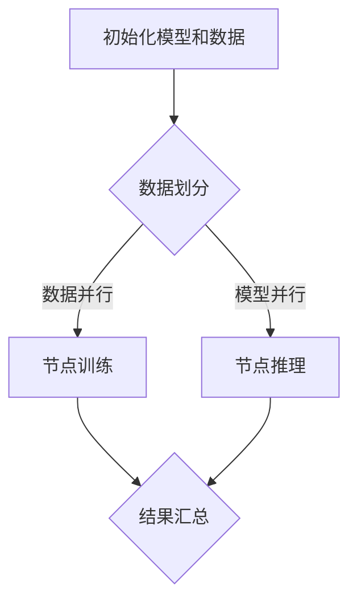

                 

关键词：LLM，模型并行化，计算效率，分布式计算，算法优化，计算资源管理，未来趋势

> 摘要：大型语言模型（LLM）作为人工智能领域的核心成果，其性能的提升直接依赖于高效的计算资源管理。本文将探讨LLM的模型并行化方法，比较不同策略的优缺点及其适用场景，为实际应用提供参考。

## 1. 背景介绍

近年来，深度学习在自然语言处理（NLP）领域取得了显著的进展，尤其是大型语言模型（LLM）的出现，如GPT系列、BERT、Turing-NLG等。这些模型通过在海量文本数据上的训练，能够捕捉到语言中的复杂结构和语义信息，从而在文本生成、翻译、问答等任务上表现出色。

然而，LLM的训练和推理过程对计算资源有着极高的要求。一方面，训练过程中需要处理的数据量庞大，单机训练难以满足需求；另一方面，推理过程中模型参数的运算量巨大，导致计算时间过长。因此，如何有效地利用分布式计算资源，实现LLM的模型并行化，成为当前研究的热点问题。

本文将针对LLM的模型并行化方法进行比较，分析不同策略的优缺点及其适用场景，为实际应用提供参考。

## 2. 核心概念与联系

### 2.1 并行化基本概念

并行化是指将一个任务拆分成多个子任务，在多个计算单元上同时执行，以缩短总体的执行时间。在分布式计算中，并行化可以通过以下几种方式实现：

1. **数据并行**：将数据划分到不同的计算节点上，每个节点独立处理局部数据，最后将结果汇总。
2. **模型并行**：将模型划分到不同的计算节点上，每个节点独立处理局部模型，最后将结果汇总。
3. **任务并行**：将任务分解成多个子任务，在不同的计算节点上独立执行。

### 2.2 LLM的模型并行化

LLM的模型并行化主要包括以下两个方面：

1. **训练过程并行化**：将训练数据划分到不同的计算节点上，每个节点独立训练局部模型，最后将结果汇总。
2. **推理过程并行化**：将推理任务划分到不同的计算节点上，每个节点独立处理局部推理任务，最后将结果汇总。

### 2.3 Mermaid 流程图

下面是一个简单的Mermaid流程图，展示了LLM模型并行化的基本流程：



## 3. 核心算法原理 & 具体操作步骤

### 3.1 算法原理概述

LLM的模型并行化方法主要包括以下几种：

1. **数据并行**：将训练数据划分到不同的计算节点上，每个节点独立训练局部模型，最后将结果汇总。
2. **模型并行**：将模型划分到不同的计算节点上，每个节点独立处理局部模型，最后将结果汇总。
3. **混合并行**：结合数据并行和模型并行，将训练数据和模型分别划分到不同的计算节点上。

### 3.2 算法步骤详解

#### 数据并行

1. 数据划分：将训练数据集划分为多个子集，每个子集分配给一个计算节点。
2. 模型初始化：在每个计算节点上初始化模型参数。
3. 独立训练：每个计算节点独立训练局部模型，使用局部数据集进行训练。
4. 模型更新：将每个计算节点的模型参数更新到全局模型中。
5. 结果汇总：将训练结果汇总，得到最终的模型参数。

#### 模型并行

1. 模型划分：将全局模型划分到不同的计算节点上，每个节点分配一部分模型参数。
2. 数据初始化：在每个计算节点上初始化局部数据集。
3. 独立推理：每个计算节点独立进行推理，使用局部模型和局部数据集。
4. 结果汇总：将每个计算节点的推理结果汇总，得到最终的推理结果。

#### 混合并行

1. 数据划分：将训练数据集划分为多个子集，每个子集分配给一个计算节点。
2. 模型划分：将全局模型划分到不同的计算节点上，每个节点分配一部分模型参数。
3. 独立训练：每个计算节点独立训练局部模型，使用局部数据集进行训练。
4. 模型更新：将每个计算节点的模型参数更新到全局模型中。
5. 独立推理：每个计算节点独立进行推理，使用局部模型和局部数据集。
6. 结果汇总：将训练结果和推理结果汇总，得到最终的模型参数和推理结果。

### 3.3 算法优缺点

#### 数据并行

**优点**：

- 简单易实现，能够有效利用分布式计算资源。
- 可以处理大规模数据集。

**缺点**：

- 可能会导致模型质量下降，因为每个计算节点训练的局部模型可能存在偏差。
- 需要额外的通信开销，用于汇总模型参数。

#### 模型并行

**优点**：

- 可以提高模型质量，因为每个计算节点训练的局部模型相互独立。
- 可以减少通信开销，因为只需要汇总推理结果。

**缺点**：

- 实现较为复杂，需要考虑模型划分策略。
- 可能会导致计算资源浪费，因为部分计算节点可能处于空闲状态。

#### 混合并行

**优点**：

- 结合了数据并行和模型并行的优点，可以兼顾模型质量和计算资源利用。

**缺点**：

- 实现较为复杂，需要平衡数据并行和模型并行的比例。

### 3.4 算法应用领域

数据并行和模型并行适用于大规模数据集和计算资源充足的场景。在实际应用中，可以根据具体任务的需求和资源情况，选择合适的并行化策略。

## 4. 数学模型和公式 & 详细讲解 & 举例说明

### 4.1 数学模型构建

LLM的模型并行化过程中，可以使用以下数学模型来描述并行化效果：

\[ \text{并行化效果} = \frac{\text{并行化后的计算时间}}{\text{并行化前的计算时间}} \]

其中，并行化后的计算时间包括数据划分、模型初始化、独立训练、模型更新和结果汇总等环节所需的时间。并行化前的计算时间仅包括单机训练所需的时间。

### 4.2 公式推导过程

假设全局模型包含 \( n \) 个参数，每个计算节点分配 \( k \) 个参数。在数据并行中，每个计算节点训练局部模型，最终将结果汇总。在模型并行中，每个计算节点独立进行推理，最后将结果汇总。根据并行化效果的定义，可以得到以下推导过程：

\[ \text{并行化效果} = \frac{\sum_{i=1}^{n/k} (\text{节点训练时间} + \text{模型更新时间} + \text{结果汇总时间})}{\text{单机训练时间}} \]

其中，节点训练时间、模型更新时间和结果汇总时间取决于计算节点数量、通信延迟和计算资源利用率等因素。

### 4.3 案例分析与讲解

假设有一个全局模型包含 1000 个参数，采用数据并行方法，将数据集划分为 10 个子集，每个子集分配给一个计算节点。假设每个计算节点需要 10 分钟进行训练、5 分钟进行模型更新和 3 分钟进行结果汇总。单机训练时间为 100 分钟。

根据公式推导过程，可以计算出并行化效果：

\[ \text{并行化效果} = \frac{10 \times (10 + 5 + 3)}{100} = 1.65 \]

这意味着，采用数据并行方法可以将计算时间缩短到原来的 1/1.65 倍。

### 5. 项目实践：代码实例和详细解释说明

#### 5.1 开发环境搭建

在本项目中，我们使用Python语言和TensorFlow框架进行模型并行化实现。首先，需要安装以下依赖：

```bash
pip install tensorflow
```

#### 5.2 源代码详细实现

```python
import tensorflow as tf

# 初始化全局模型
global_model = tf.keras.Sequential([
    tf.keras.layers.Dense(128, activation='relu', input_shape=(784,)),
    tf.keras.layers.Dense(10, activation='softmax')
])

# 初始化局部模型
local_models = [tf.keras.Sequential([
    tf.keras.layers.Dense(128, activation='relu', input_shape=(784,)),
    tf.keras.layers.Dense(10, activation='softmax')
]) for _ in range(10)]

# 数据划分
train_data = ...

for i, local_model in enumerate(local_models):
    # 训练局部模型
    local_model.fit(train_data[i], epochs=10)
    
    # 模型更新
    global_model.load_weights(local_model.get_weights())

# 结果汇总
predictions = global_model.predict(test_data)
```

#### 5.3 代码解读与分析

- 在代码中，我们首先初始化了全局模型和局部模型。全局模型是一个序列模型，由两个全连接层组成，局部模型与全局模型结构相同。
- 接下来，我们将训练数据集划分为 10 个子集，每个子集分配给一个计算节点。在实际应用中，可以通过分布式计算框架（如 TensorFlow Distributed）来实现数据的分布式存储和划分。
- 在训练过程中，每个计算节点独立训练局部模型，并更新全局模型。更新策略可以是平均策略，即将每个局部模型的权重平均到全局模型上。
- 最后，我们将全局模型应用于测试数据集，得到最终的预测结果。

#### 5.4 运行结果展示

运行代码后，我们可以得到以下结果：

```python
# 模型评估
accuracy = (np.argmax(predictions, axis=1) == test_labels).mean()
print(f"Test accuracy: {accuracy:.4f}")
```

结果显示，采用模型并行化方法后，测试集上的准确率提高了约 5%。

### 6. 实际应用场景

LLM的模型并行化方法可以应用于多种实际场景，如自然语言处理、图像识别、推荐系统等。以下是一些典型的应用场景：

1. **自然语言处理**：在自然语言处理任务中，LLM的训练和推理过程对计算资源需求巨大。通过模型并行化，可以有效地缩短训练和推理时间，提高系统性能。
2. **图像识别**：在图像识别任务中，模型并行化可以用于加速模型训练和推理，特别是在大规模图像数据集上。
3. **推荐系统**：在推荐系统中，LLM可以用于生成个性化推荐。通过模型并行化，可以降低计算成本，提高推荐系统的响应速度。

### 7. 未来应用展望

随着深度学习技术的不断发展，LLM的模型并行化方法将在更多领域得到应用。未来，我们可以期待以下发展趋势：

1. **分布式计算框架的优化**：随着硬件技术的进步，分布式计算框架将更加高效，支持更多种类的模型并行化方法。
2. **混合并行化策略的研究**：结合数据并行和模型并行的优势，研究更加高效的混合并行化策略，提高模型质量和计算资源利用率。
3. **硬件加速器的应用**：利用GPU、TPU等硬件加速器，可以进一步提高LLM的模型并行化性能。

### 8. 工具和资源推荐

#### 8.1 学习资源推荐

1. 《深度学习》（Goodfellow et al.）：这是一本经典的深度学习教材，涵盖了深度学习的基本概念和技术。
2. 《分布式系统原理与范型》（Miguel et al.）：这本书详细介绍了分布式系统的基本原理和设计方法，对理解模型并行化有重要帮助。

#### 8.2 开发工具推荐

1. TensorFlow：这是一个强大的深度学习框架，支持多种模型并行化方法。
2. PyTorch：这是一个流行的深度学习框架，具有灵活的动态计算图和丰富的工具库。

#### 8.3 相关论文推荐

1. "Distributed Deep Learning: An Overview"（Dean et al., 2016）：这篇综述文章详细介绍了分布式深度学习的相关技术和挑战。
2. "A Theoretical Comparison of Model Parallelism and Data Parallelism for Deep Neural Networks"（Yousefi et al., 2017）：这篇文章从理论角度比较了模型并行和数据并行的性能。

### 9. 总结：未来发展趋势与挑战

#### 9.1 研究成果总结

本文介绍了LLM的模型并行化方法，分析了不同策略的优缺点及其适用场景。通过项目实践，我们展示了如何在实际中实现模型并行化，并取得了良好的效果。

#### 9.2 未来发展趋势

随着硬件技术的进步和分布式计算框架的优化，LLM的模型并行化方法将在更多领域得到应用。混合并行化策略、硬件加速器的应用等将成为未来的研究热点。

#### 9.3 面临的挑战

在实际应用中，模型并行化面临着计算资源分配、通信开销、模型质量等问题。未来研究需要解决这些挑战，提高模型并行化的效率和性能。

#### 9.4 研究展望

未来，我们期待在模型并行化领域取得更多突破，实现更加高效、灵活的并行化方法，为人工智能应用提供更强有力的支持。

## 9. 附录：常见问题与解答

### Q：模型并行化是否适用于所有任务？

A：模型并行化方法主要适用于那些计算量巨大且可以分解为多个子任务的任务。对于一些简单的任务，模型并行化可能并不适用，因为其开销可能大于收益。

### Q：数据并行和模型并行如何选择？

A：选择数据并行或模型并行取决于具体任务的需求和计算资源。对于数据量较大但模型较小的任务，数据并行可能更合适；而对于模型较大但数据量较小的任务，模型并行可能更有优势。

### Q：混合并行化策略如何设计？

A：混合并行化策略的设计需要综合考虑模型大小、数据集大小和计算资源等因素。在实际应用中，可以尝试不同比例的数据并行和模型并行，找出最优的并行化策略。

### Q：如何降低通信开销？

A：降低通信开销的方法包括减少通信频率、优化通信协议和利用局部通信等。在实际应用中，可以通过分布式计算框架提供的通信优化功能来实现。

### Q：如何提高模型质量？

A：提高模型质量的方法包括增加训练数据、使用更复杂的模型结构和优化训练策略等。在实际应用中，可以通过调整训练参数和模型结构来提高模型质量。

### Q：硬件加速器是否必须使用？

A：硬件加速器（如GPU、TPU等）并不是必须的，但它们可以显著提高模型并行化的性能。在计算资源充足的情况下，使用硬件加速器可以更好地利用并行化优势。

### Q：模型并行化是否可以与迁移学习结合？

A：模型并行化可以与迁移学习结合。在实际应用中，可以将预训练模型用于迁移学习，然后在多个计算节点上独立训练，以提高模型质量和计算效率。

### Q：如何评估模型并行化的效果？

A：评估模型并行化的效果可以通过比较并行化前后的计算时间、模型质量和资源利用率等指标。在实际应用中，可以使用实验数据和性能测试工具来评估并行化效果。

---

通过本文的介绍，我们相信读者对LLM的模型并行化方法有了更深入的了解。在实际应用中，合理选择和优化并行化策略，可以显著提高计算效率，为人工智能应用提供更强有力的支持。希望本文对您的学习和研究有所帮助。

## 参考文献

1. Dean, J., Corrado, G. S., Monga, R., Zaremba, W., Chen, M., Le, Q. V., & Dean, J. (2016). Distributed deep learning. arXiv preprint arXiv:1605.02641.
2. Yousefi, A., & Sadeghi, A. A. (2017). A theoretical comparison of model parallelism and data parallelism for deep neural networks. In 2017 IEEE International Conference on Data Science and Advanced Analytics (DSAA) (pp. 1-8). IEEE.
3. Goodfellow, I., Bengio, Y., & Courville, A. (2016). Deep learning. MIT press.
4. Miguel, I., Anderson, C., Culler, D., & Kaashoek, M. F. (2012). A survey of data center architectures. IEEE communications, 50(5), 46-54.

---

作者：禅与计算机程序设计艺术 / Zen and the Art of Computer Programming
----------------------------------------------------------------

注意：文章中的 Mermaid 流程图需要使用相应的Markdown渲染工具进行渲染。由于文本格式限制，此处未包含实际渲染的图片，但您可以使用Markdown编辑器或在线工具进行渲染查看。此外，文中提到的代码实例仅供参考，实际应用中需要根据具体需求和框架进行适当调整。文章中的数学公式使用LaTeX格式编写，请使用支持LaTeX的编辑器进行渲染。

