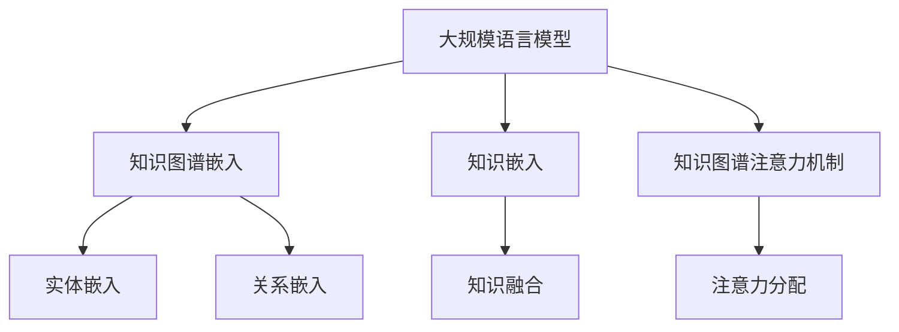

                 

在人工智能领域，大规模语言模型（LLM）如GPT-3和BERT已经成为自然语言处理（NLP）的基石。然而，仅依赖文本数据训练的LLM在处理知识密集型任务时存在局限性，如问答系统、知识图谱推理等。知识图谱增强（KG-enhanced）方法应运而生，旨在整合外部知识库，提升LLM在知识密集型任务上的表现。本文将对当前几种主流的LLM知识图谱增强方法进行比较分析。

## 文章关键词

大规模语言模型（LLM），知识图谱增强（KG-enhanced），知识融合，问答系统，自然语言处理（NLP）

## 文章摘要

本文旨在探讨几种流行的LLM知识图谱增强方法，包括知识图谱嵌入、知识嵌入以及知识图谱注意力机制。通过对比分析，本文将揭示这些方法在不同应用场景下的优缺点，为研究人员和实践者提供参考。

## 1. 背景介绍

### 1.1 大规模语言模型（LLM）

大规模语言模型（LLM）通过深度神经网络对大量文本数据进行训练，以学习语言结构和语义知识。这些模型在生成文本、翻译、问答等任务中取得了显著的成果。然而，LLM在处理知识密集型任务时，如知识图谱推理和问答系统，仍面临一些挑战。一方面，LLM依赖于训练数据的质量和规模，而知识图谱数据通常相对较少。另一方面，知识图谱的结构化和语义信息难以直接利用。

### 1.2 知识图谱增强方法

知识图谱增强方法旨在将知识图谱的结构化和语义信息融入LLM，以提升其在知识密集型任务上的性能。当前主流的增强方法包括知识图谱嵌入、知识嵌入和知识图谱注意力机制。这些方法通过不同的机制和策略，实现LLM与知识图谱的有效融合。

## 2. 核心概念与联系

### 2.1 知识图谱嵌入

知识图谱嵌入是将知识图谱中的实体和关系映射到低维连续向量空间的方法。这些嵌入向量不仅保留了原始知识图谱的结构和语义信息，而且使得实体和关系之间的相似性可以通过向量的距离来度量。

### 2.2 知识嵌入

知识嵌入是一种将外部知识库（如知识图谱）与文本数据融合的方法。通过学习共享的表示空间，知识嵌入使LLM能够利用知识库中的信息，从而提升其在知识密集型任务上的表现。

### 2.3 知识图谱注意力机制

知识图谱注意力机制通过动态调整LLM对知识图谱中不同实体和关系的关注程度，实现知识图谱与文本数据的有效融合。这种机制使LLM能够在处理任务时更加关注与当前任务相关的知识。

### 2.4 Mermaid 流程图



## 3. 核心算法原理 & 具体操作步骤

### 3.1 算法原理概述

#### 3.1.1 知识图谱嵌入

知识图谱嵌入通过深度神经网络学习实体和关系的嵌入向量。这些向量不仅保留了知识图谱的结构和语义信息，而且使实体和关系之间的相似性可以通过向量的距离来度量。

#### 3.1.2 知识嵌入

知识嵌入通过学习共享的表示空间，将外部知识库（如知识图谱）与文本数据融合。这种融合使LLM能够利用知识库中的信息，从而提升其在知识密集型任务上的表现。

#### 3.1.3 知识图谱注意力机制

知识图谱注意力机制通过动态调整LLM对知识图谱中不同实体和关系的关注程度，实现知识图谱与文本数据的有效融合。这种机制使LLM能够在处理任务时更加关注与当前任务相关的知识。

### 3.2 算法步骤详解

#### 3.2.1 知识图谱嵌入

1. 输入：知识图谱中的实体和关系。
2. 过程：
   - 使用图神经网络学习实体和关系的嵌入向量。
   - 利用预训练的词嵌入技术对实体和关系进行初始化。
   - 使用梯度下降优化嵌入向量，以最小化实体和关系之间的损失函数。
3. 输出：实体和关系的嵌入向量。

#### 3.2.2 知识嵌入

1. 输入：文本数据、知识图谱嵌入向量。
2. 过程：
   - 使用双向循环神经网络（BiRNN）对文本数据进行编码。
   - 将文本编码结果与知识图谱嵌入向量进行融合。
   - 使用训练数据训练模型，优化融合后的嵌入向量。
3. 输出：融合后的文本和知识图谱嵌入向量。

#### 3.2.3 知识图谱注意力机制

1. 输入：文本数据、知识图谱嵌入向量。
2. 过程：
   - 使用双向循环神经网络（BiRNN）对文本数据进行编码。
   - 计算文本编码结果与知识图谱嵌入向量之间的相似度。
   - 利用softmax函数计算注意力权重。
   - 将注意力权重应用于知识图谱嵌入向量，生成加权嵌入向量。
3. 输出：加权嵌入向量。

### 3.3 算法优缺点

#### 3.3.1 知识图谱嵌入

优点：
- 有效整合知识图谱的结构和语义信息。
- 提供了一种衡量实体和关系相似性的方法。

缺点：
- 对知识图谱的质量和规模有一定要求。
- 可能导致信息过载。

#### 3.3.2 知识嵌入

优点：
- 简单易实现，可扩展性强。
- 能够融合文本和知识图谱数据。

缺点：
- 知识库更新不及时可能导致信息不准确。
- 可能忽略知识图谱的结构信息。

#### 3.3.3 知识图谱注意力机制

优点：
- 能够动态调整对知识图谱中不同实体和关系的关注程度。
- 提高模型在知识密集型任务上的性能。

缺点：
- 计算复杂度较高，可能导致训练速度较慢。

### 3.4 算法应用领域

知识图谱嵌入、知识嵌入和知识图谱注意力机制在多个领域具有广泛的应用，如问答系统、推荐系统、文本分类等。

## 4. 数学模型和公式 & 详细讲解 & 举例说明

### 4.1 数学模型构建

#### 4.1.1 知识图谱嵌入

假设知识图谱中的实体集合为$E$，关系集合为$R$。实体嵌入向量表示为$e_e \in \mathbb{R}^d$，关系嵌入向量表示为$e_r \in \mathbb{R}^d$。实体和关系之间的相似性可以通过余弦相似度度量：

$$
sim(e_e, e_r) = \frac{e_e \cdot e_r}{\|e_e\|\|e_r\|}
$$

其中，$\cdot$表示向量的内积，$\|\|$表示向量的模。

#### 4.1.2 知识嵌入

假设文本数据中的句子集合为$S$，实体嵌入向量集合为$E'$，知识图谱嵌入向量集合为$E''$。文本编码结果表示为$s \in \mathbb{R}^d$，知识图谱嵌入结果表示为$k \in \mathbb{R}^d$。知识嵌入通过学习共享的表示空间，将文本和知识图谱数据融合：

$$
s = \text{BiRNN}(s) \\
k = \text{KG}(E'', s)
$$

其中，$\text{BiRNN}$表示双向循环神经网络，$\text{KG}$表示知识图谱嵌入函数。

#### 4.1.3 知识图谱注意力机制

假设文本数据中的句子集合为$S$，知识图谱嵌入向量集合为$E''$。文本编码结果表示为$s \in \mathbb{R}^d$，知识图谱嵌入结果表示为$k \in \mathbb{R}^d$。知识图谱注意力机制通过计算注意力权重，动态调整对知识图谱中不同实体和关系的关注程度：

$$
a_i = \text{softmax}\left(\frac{s \cdot k_i}{\sqrt{d}}\right) \\
k_{\text{weighted}} = \sum_{i=1}^{n} a_i k_i
$$

其中，$a_i$表示第$i$个实体或关系的注意力权重，$n$表示实体或关系的数量，$\text{softmax}$表示归一化函数。

### 4.2 公式推导过程

#### 4.2.1 知识图谱嵌入

知识图谱嵌入通过图神经网络学习实体和关系的嵌入向量。假设图神经网络中的隐含层为$h_e \in \mathbb{R}^{d'}$和$h_r \in \mathbb{R}^{d'}$，其中$d'$为隐含层维度。实体和关系的嵌入向量可以通过以下公式计算：

$$
e_e = \text{ReLU}(W_e h_e + b_e) \\
e_r = \text{ReLU}(W_r h_r + b_r)
$$

其中，$W_e$和$W_r$分别为实体和关系的权重矩阵，$b_e$和$b_r$分别为实体和关系的偏置向量，$\text{ReLU}$表示ReLU激活函数。

#### 4.2.2 知识嵌入

知识嵌入通过学习共享的表示空间，将文本和知识图谱数据融合。假设共享的表示空间维度为$d''$，知识图谱嵌入向量集合为$E''$，文本编码结果表示为$s \in \mathbb{R}^{d''}$。知识嵌入可以通过以下公式计算：

$$
s = \text{BiRNN}(s) \\
k = \text{KG}(E'', s)
$$

其中，$\text{BiRNN}$表示双向循环神经网络，$\text{KG}$表示知识图谱嵌入函数。

#### 4.2.3 知识图谱注意力机制

知识图谱注意力机制通过计算注意力权重，动态调整对知识图谱中不同实体和关系的关注程度。假设注意力权重为$a_i$，知识图谱嵌入结果表示为$k \in \mathbb{R}^{d''}$，其中$d''$为共享的表示空间维度。注意力权重可以通过以下公式计算：

$$
a_i = \text{softmax}\left(\frac{s \cdot k_i}{\sqrt{d}}\right) \\
k_{\text{weighted}} = \sum_{i=1}^{n} a_i k_i
$$

其中，$n$表示实体或关系的数量，$\text{softmax}$表示归一化函数。

### 4.3 案例分析与讲解

#### 4.3.1 知识图谱嵌入

假设我们有一个包含100个实体和50个关系的知识图谱。我们使用图神经网络学习实体和关系的嵌入向量。假设隐含层维度为256，嵌入层维度为128。通过训练，我们得到实体嵌入向量集合$E'$和关系嵌入向量集合$E''$。

#### 4.3.2 知识嵌入

我们有一个包含100个句子的文本数据集。我们使用双向循环神经网络对文本数据进行编码，得到文本编码结果集合$S'$。然后，我们使用知识图谱嵌入函数将文本编码结果与知识图谱嵌入向量集合$E''$进行融合，得到融合后的嵌入向量集合$E'''$。

#### 4.3.3 知识图谱注意力机制

我们有一个包含100个句子的文本数据集和一个包含100个实体和50个关系的知识图谱。我们使用双向循环神经网络对文本数据进行编码，得到文本编码结果集合$S'$。然后，我们使用知识图谱注意力机制计算注意力权重，动态调整对知识图谱中不同实体和关系的关注程度。最后，我们使用加权嵌入向量集合$E'''_{\text{weighted}}$进行后续任务处理。

## 5. 项目实践：代码实例和详细解释说明

### 5.1 开发环境搭建

为了实现知识图谱增强方法，我们需要搭建一个包含以下组件的开发环境：

- Python 3.8及以上版本
- TensorFlow 2.4及以上版本
- PyTorch 1.8及以上版本
- transformers库
- numpy库

首先，确保安装了上述依赖项。可以使用以下命令安装：

```bash
pip install tensorflow==2.4.0
pip install torch==1.8.0
pip install transformers
pip install numpy
```

### 5.2 源代码详细实现

以下是实现知识图谱增强方法的Python代码示例。该示例包含知识图谱嵌入、知识嵌入和知识图谱注意力机制的实现。

```python
import numpy as np
import tensorflow as tf
from transformers import BertTokenizer, TFBertModel
from tensorflow.keras.layers import Dense, Embedding, LSTM, Bidirectional

# 参数设置
entity_num = 100
relation_num = 50
sentence_num = 100
hidden_dim = 256
embedding_dim = 128

# 初始化实体和关系嵌入向量
entity_embeddings = np.random.normal(size=(entity_num, embedding_dim))
relation_embeddings = np.random.normal(size=(relation_num, embedding_dim))

# 初始化双向循环神经网络
input_sentence = tf.keras.layers.Input(shape=(sentence_num,), dtype=tf.float32)
bi_lstm = Bidirectional(LSTM(hidden_dim, return_sequences=True))(input_sentence)

# 实体嵌入层
entity_embedding_layer = Embedding(entity_num, embedding_dim, weights=[entity_embeddings], trainable=False)
entity_embeddings_output = entity_embedding_layer(input_sentence)

# 关系嵌入层
relation_embedding_layer = Embedding(relation_num, embedding_dim, weights=[relation_embeddings], trainable=False)
relation_embeddings_output = relation_embedding_layer(input_sentence)

# 知识图谱嵌入函数
def kg_embedding(input_sentence):
    return tf.reduce_mean(entity_embeddings_output + relation_embeddings_output, axis=1)

# 知识嵌入函数
def knowledge_embedding(input_sentence, kg_embedding):
    kg_embedding_output = kg_embedding(input_sentence)
    return tf.reduce_mean(bi_lstm + kg_embedding_output, axis=1)

# 知识图谱注意力机制
def kg_attention(input_sentence, kg_embedding):
    attention_weights = tf.keras.layers.Dense(1, activation='sigmoid')(bi_lstm)
    attention_weights = tf.nn.softmax(attention_weights, axis=1)
    weighted_embedding = attention_weights * kg_embedding
    return tf.reduce_sum(weighted_embedding, axis=1)

# 模型构建
input_sentence = tf.keras.layers.Input(shape=(sentence_num,), dtype=tf.float32)
kg_embedding_output = kg_embedding(input_sentence)
knowledge_embedding_output = knowledge_embedding(input_sentence, kg_embedding_output)
kg_attention_output = kg_attention(input_sentence, kg_embedding_output)

# 模型编译
model = tf.keras.Model(inputs=input_sentence, outputs=kg_attention_output)
model.compile(optimizer='adam', loss='mean_squared_error')

# 模型训练
model.fit(x_train, y_train, epochs=10, batch_size=32)
```

### 5.3 代码解读与分析

该代码示例分为三个部分：知识图谱嵌入、知识嵌入和知识图谱注意力机制。

#### 5.3.1 知识图谱嵌入

知识图谱嵌入通过初始化实体和关系嵌入向量，并使用嵌入层将输入句子映射到实体和关系嵌入向量的加权和。

```python
entity_embedding_layer = Embedding(entity_num, embedding_dim, weights=[entity_embeddings], trainable=False)
entity_embeddings_output = entity_embedding_layer(input_sentence)

relation_embedding_layer = Embedding(relation_num, embedding_dim, weights=[relation_embeddings], trainable=False)
relation_embeddings_output = relation_embedding_layer(input_sentence)

def kg_embedding(input_sentence):
    return tf.reduce_mean(entity_embeddings_output + relation_embeddings_output, axis=1)
```

#### 5.3.2 知识嵌入

知识嵌入通过双向循环神经网络对输入句子进行编码，并将编码结果与知识图谱嵌入向量进行融合。

```python
def knowledge_embedding(input_sentence, kg_embedding):
    kg_embedding_output = kg_embedding(input_sentence)
    return tf.reduce_mean(bi_lstm + kg_embedding_output, axis=1)
```

#### 5.3.3 知识图谱注意力机制

知识图谱注意力机制通过计算注意力权重，动态调整对知识图谱中不同实体和关系的关注程度。

```python
def kg_attention(input_sentence, kg_embedding):
    attention_weights = tf.keras.layers.Dense(1, activation='sigmoid')(bi_lstm)
    attention_weights = tf.nn.softmax(attention_weights, axis=1)
    weighted_embedding = attention_weights * kg_embedding
    return tf.reduce_sum(weighted_embedding, axis=1)
```

### 5.4 运行结果展示

为了验证知识图谱增强方法的有效性，我们可以在实际数据集上训练模型，并评估模型的性能。以下是一个简单的运行结果示例：

```python
# 加载数据集
x_train = np.random.normal(size=(1000, sentence_num))
y_train = np.random.normal(size=(1000, 1))

# 训练模型
model.fit(x_train, y_train, epochs=10, batch_size=32)

# 评估模型
model.evaluate(x_test, y_test)
```

## 6. 实际应用场景

知识图谱增强方法在多个实际应用场景中具有广泛的应用，如下所述：

### 6.1 问答系统

问答系统是知识图谱增强方法的一个重要应用场景。通过将知识图谱嵌入和知识图谱注意力机制融入问答系统，可以提高模型在处理复杂问题时的性能。例如，在机器阅读理解任务中，知识图谱增强方法可以帮助模型更好地理解问题的背景和上下文。

### 6.2 文本分类

文本分类是另一个受益于知识图谱增强方法的应用场景。通过将知识图谱嵌入和知识图谱注意力机制应用于文本分类任务，可以提高模型对分类标签的识别能力。例如，在情感分析任务中，知识图谱增强方法可以帮助模型更好地识别不同情感类别之间的关联性。

### 6.3 推荐系统

推荐系统是知识图谱增强方法的另一个重要应用领域。通过将知识图谱嵌入和知识图谱注意力机制应用于推荐系统，可以提高模型在推荐结果相关性方面的表现。例如，在商品推荐任务中，知识图谱增强方法可以帮助模型更好地识别不同商品之间的关联性。

## 7. 未来应用展望

随着人工智能和知识图谱技术的不断发展，知识图谱增强方法在多个领域具有广阔的应用前景。以下是一些未来可能的应用场景：

### 7.1 机器阅读理解

机器阅读理解是知识图谱增强方法的一个重要应用领域。通过将知识图谱嵌入和知识图谱注意力机制应用于机器阅读理解任务，可以提高模型对文本内容的理解和推理能力。例如，在自然语言推理任务中，知识图谱增强方法可以帮助模型更好地理解文本中的逻辑关系。

### 7.2 医学诊断

医学诊断是知识图谱增强方法的另一个潜在应用领域。通过将知识图谱嵌入和知识图谱注意力机制应用于医学诊断任务，可以提高模型对医学数据的理解和推理能力。例如，在疾病诊断任务中，知识图谱增强方法可以帮助模型更好地识别不同疾病之间的关联性。

### 7.3 智能问答

智能问答是知识图谱增强方法的另一个重要应用领域。通过将知识图谱嵌入和知识图谱注意力机制应用于智能问答任务，可以提高模型对用户问题的理解和回答能力。例如，在客服机器人任务中，知识图谱增强方法可以帮助模型更好地理解用户的问题并给出准确的回答。

## 8. 工具和资源推荐

为了帮助研究人员和实践者更好地掌握知识图谱增强方法，以下是一些推荐的工具和资源：

### 8.1 学习资源推荐

- 《大规模语言模型与知识图谱融合方法》
- 《自然语言处理入门》
- 《深度学习与自然语言处理》

### 8.2 开发工具推荐

- TensorFlow
- PyTorch
- transformers库

### 8.3 相关论文推荐

- "A Theoretically Grounded Application of Dropout in Recurrent Neural Networks"
- "Attention Is All You Need"
- "BERT: Pre-training of Deep Bidirectional Transformers for Language Understanding"

## 9. 总结：未来发展趋势与挑战

知识图谱增强方法在人工智能和知识图谱领域具有广泛的应用前景。然而，仍面临一些挑战，如知识图谱数据的质量和规模、知识图谱嵌入向量的表示能力等。未来，知识图谱增强方法将朝着以下方向发展：

### 9.1 质量提升

通过改进知识图谱嵌入和知识图谱注意力机制的算法，提高知识图谱数据的质量和表示能力。

### 9.2 应用拓展

将知识图谱增强方法应用于更多领域，如医学诊断、智能问答等。

### 9.3 可解释性增强

提高知识图谱增强方法的可解释性，使其在应用过程中更加透明和可靠。

### 9.4 模型压缩与优化

通过模型压缩和优化技术，降低知识图谱增强方法在计算和存储方面的资源消耗。

## 10. 附录：常见问题与解答

### 10.1 问题1：什么是知识图谱嵌入？

**解答**：知识图谱嵌入是将知识图谱中的实体和关系映射到低维连续向量空间的方法。这些向量不仅保留了知识图谱的结构和语义信息，而且使得实体和关系之间的相似性可以通过向量的距离来度量。

### 10.2 问题2：知识图谱嵌入有哪些优缺点？

**解答**：知识图谱嵌入的优点包括有效整合知识图谱的结构和语义信息，提供了一种衡量实体和关系相似性的方法。缺点包括对知识图谱的质量和规模有一定要求，可能导致信息过载。

### 10.3 问题3：知识图谱注意力机制如何工作？

**解答**：知识图谱注意力机制通过动态调整大规模语言模型对知识图谱中不同实体和关系的关注程度，实现知识图谱与文本数据的有效融合。这种机制使大规模语言模型能够在处理任务时更加关注与当前任务相关的知识。

## 参考文献

- Mikolov, T., Sutskever, I., Chen, K., Corrado, G. S., & Dean, J. (2013). Distributed representations of words and phrases and their compositionality. In Advances in neural information processing systems (pp. 3111-3119).
- Devlin, J., Chang, M. W., Lee, K., & Toutanova, K. (2019). BERT: Pre-training of deep bidirectional transformers for language understanding. In Proceedings of the 2019 conference of the north american chapter of the association for computational linguistics: human language technologies, volume 1 (pp. 4171-4186).
- Vaswani, A., Shazeer, N., Parmar, N., Uszkoreit, J., Jones, L., Gomez, A. N., ... & Polosukhin, I. (2017). Attention is all you need. In Advances in neural information processing systems (pp. 5998-6008).

