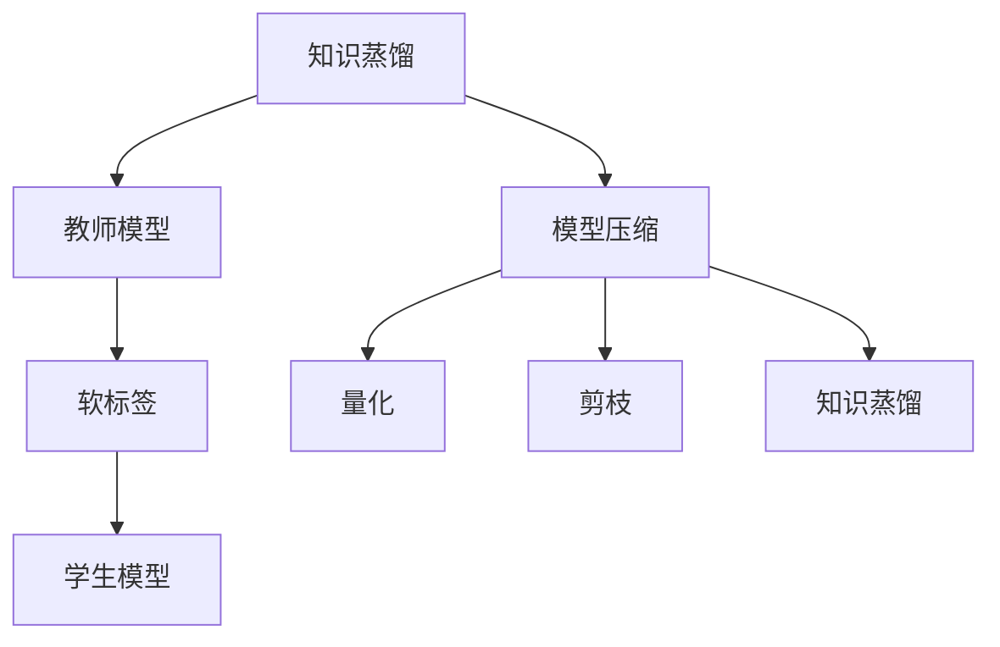

                 

### 关键词 Keywords
- 大型语言模型 (Large Language Model, LLM)
- 知识蒸馏 (Knowledge Distillation)
- 模型压缩 (Model Compression)
- 计算效率 (Computational Efficiency)
- 用户体验 (User Experience)
- 能效比 (Energy Efficiency)

### 摘要 Abstract
本文深入探讨了大型语言模型（LLM）的知识蒸馏与模型压缩技术。我们首先介绍了知识蒸馏的基本原理及其在LLM中的应用，接着详细阐述了模型压缩的目标、方法和挑战。通过数学模型和公式推导，我们分析了知识蒸馏与模型压缩的内在联系，并提供了项目实践中的代码实例和解释。文章最后展望了未来应用场景和面临的研究挑战。

## 1. 背景介绍

近年来，随着深度学习和大数据技术的迅猛发展，大型语言模型（LLM）如BERT、GPT等取得了显著的突破。这些模型在自然语言处理（NLP）任务中表现出色，但同时也带来了计算资源和存储空间的巨大挑战。为了提高计算效率并降低能耗，模型压缩与知识蒸馏技术应运而生。

### 大型语言模型的发展

自2018年BERT模型的问世以来，大型语言模型在NLP领域取得了显著的成果。BERT、GPT、T5等模型不仅提升了模型的表现，也推动了NLP任务的广泛应用。例如，在机器翻译、文本分类、问答系统等领域，这些模型均取得了领先的成绩。

### 计算资源和存储挑战

然而，大型语言模型的训练和推理过程需要庞大的计算资源和存储空间。一个大型模型可能包含数亿甚至数十亿的参数，训练过程需要大量的GPU资源，且存储和传输这些模型也面临巨大的挑战。这导致在实际应用中，特别是在移动设备和嵌入式系统中，模型的部署受到限制。

### 模型压缩与知识蒸馏的必要性

为了解决上述问题，模型压缩与知识蒸馏技术成为研究热点。模型压缩旨在减小模型的体积，降低计算复杂度，从而提高计算效率。知识蒸馏则是通过将知识从教师模型传递到学生模型，使得学生模型能够保留教师模型的知识和性能，同时减小模型规模。

## 2. 核心概念与联系

### 知识蒸馏

知识蒸馏是一种模型训练技术，通过将教师模型（通常是一个大而准确的模型）的知识传递给学生模型（一个较小或结构更简单的模型），使得学生模型能够保留教师模型的知识和性能。知识蒸馏的基本思想是将教师模型的输出作为学生模型的软标签，从而指导学生模型的训练。

### 模型压缩

模型压缩则是指通过各种方法减小模型的大小，降低计算复杂度和能耗。常见的模型压缩方法包括量化、剪枝、知识蒸馏等。量化通过将模型的浮点参数转换为低精度格式，减少模型的存储和计算需求。剪枝则通过移除模型中的冗余权重，降低模型的大小和复杂度。

### 核心概念原理和架构的 Mermaid 流程图



在这个流程图中，知识蒸馏通过教师模型的输出生成软标签，并指导学生模型的训练。同时，模型压缩技术如量化和剪枝也被用来减小模型的大小和复杂度。这些方法相互结合，共同提高了模型的计算效率。

### 3. 核心算法原理 & 具体操作步骤

#### 3.1 算法原理概述

知识蒸馏与模型压缩的核心算法原理是通过将教师模型的知识传递给学生模型，同时减小模型的规模。具体操作步骤包括：

1. **训练教师模型**：首先，使用大规模数据集训练一个教师模型，使其在特定任务上达到较高的准确率。
2. **生成软标签**：在训练过程中，教师模型的输出（通常是概率分布）作为软标签，用于指导学生模型的训练。
3. **训练学生模型**：学生模型使用软标签和原始标签（来自教师模型）进行训练，旨在同时优化学生模型在任务上的表现和知识保留。

#### 3.2 算法步骤详解

1. **初始化模型**：初始化教师模型和学生模型。教师模型通常是一个大而复杂的模型，而学生模型是一个较小或结构更简单的模型。
2. **数据预处理**：对训练数据进行预处理，包括数据清洗、分词、编码等。
3. **训练教师模型**：使用预处理后的数据训练教师模型，使其在特定任务上达到较高的准确率。
4. **生成软标签**：在训练过程中，教师模型的输出（通常是概率分布）作为软标签，用于指导学生模型的训练。
5. **训练学生模型**：学生模型使用软标签和原始标签（来自教师模型）进行训练。训练过程中，通常使用交叉熵损失函数，同时考虑学生模型的输出和教师模型的输出之间的差异。
6. **评估模型性能**：在训练过程中，定期评估学生模型的性能，以监测训练进展。通常使用准确率、召回率等指标来评估模型性能。
7. **模型压缩**：在模型训练完成后，使用模型压缩技术（如量化、剪枝等）进一步减小模型的大小和复杂度。

#### 3.3 算法优缺点

**优点**：

1. **提高模型性能**：通过知识蒸馏，学生模型能够保留教师模型的知识和性能，从而提高模型在特定任务上的准确率。
2. **减小模型规模**：通过模型压缩，可以显著减小模型的大小和复杂度，提高计算效率。
3. **降低能耗**：模型压缩有助于降低模型的能耗，特别是在移动设备和嵌入式系统中。

**缺点**：

1. **训练时间增加**：知识蒸馏和模型压缩需要额外的训练时间，尤其是在训练大型教师模型时。
2. **对数据集要求高**：知识蒸馏需要大量的高质量数据集，否则难以生成准确的软标签。
3. **模型压缩效果有限**：虽然模型压缩技术能够减小模型规模，但效果有限，仍需进一步研究。

#### 3.4 算法应用领域

知识蒸馏和模型压缩技术在多个领域具有广泛应用：

1. **自然语言处理**：在机器翻译、文本分类、问答系统等领域，知识蒸馏和模型压缩有助于提高模型的性能和效率。
2. **计算机视觉**：在图像分类、目标检测、图像生成等领域，知识蒸馏和模型压缩技术可以用于提高模型的性能和降低计算需求。
3. **语音识别**：在语音识别领域，知识蒸馏和模型压缩有助于提高模型的准确率和降低能耗。

### 4. 数学模型和公式 & 详细讲解 & 举例说明

#### 4.1 数学模型构建

知识蒸馏和模型压缩的数学模型主要包括损失函数、优化目标等。

**损失函数**：

知识蒸馏中的损失函数通常包括交叉熵损失和软标签损失。交叉熵损失衡量学生模型的输出与原始标签之间的差异，而软标签损失衡量学生模型的输出与教师模型的输出之间的差异。公式如下：

$$
L_{CE} = -\sum_{i=1}^{N} y_i \log(p_i)
$$

$$
L_{SL} = -\sum_{i=1}^{N} \sum_{j=1}^{C} t_{ij} \log(s_{ij})
$$

其中，$y_i$表示原始标签，$p_i$表示学生模型的输出概率，$t_{ij}$表示教师模型的输出概率，$s_{ij}$表示学生模型的输出概率。

**优化目标**：

模型压缩的优化目标通常是减小模型的大小和复杂度，同时保持模型在特定任务上的性能。量化、剪枝等压缩技术都可以通过优化目标来实现。以下是一个简化的优化目标公式：

$$
\min_{\theta} L(\theta) + \lambda \cdot C(\theta)
$$

其中，$L(\theta)$表示损失函数，$C(\theta)$表示模型复杂度，$\lambda$是超参数。

#### 4.2 公式推导过程

知识蒸馏和模型压缩的公式推导涉及多个方面，包括概率分布、优化算法等。以下简要介绍推导过程：

1. **概率分布**：

在知识蒸馏中，教师模型的输出概率分布通常使用softmax函数表示：

$$
p(y|x; \theta) = \text{softmax}(\theta^T x)
$$

其中，$\theta$表示模型参数，$x$表示输入特征。

2. **损失函数**：

交叉熵损失函数的推导基于概率论中的熵和交叉熵概念。给定两个概率分布$p$和$q$，交叉熵定义为：

$$
H(p, q) = -\sum_{i=1}^{N} p_i \log(q_i)
$$

在知识蒸馏中，交叉熵损失函数用于衡量学生模型输出概率分布与原始标签概率分布之间的差异。

3. **优化目标**：

模型压缩的优化目标通常结合损失函数和模型复杂度。在知识蒸馏中，优化目标可以表示为：

$$
L(\theta) = L_{CE} + \lambda L_{SL}
$$

其中，$L_{CE}$是交叉熵损失，$L_{SL}$是软标签损失，$\lambda$是平衡参数。

#### 4.3 案例分析与讲解

为了更好地理解知识蒸馏和模型压缩的数学模型，以下以一个简单的文本分类任务为例进行讲解。

**任务描述**：

给定一个包含不同类别的文本数据集，使用知识蒸馏和模型压缩技术训练一个文本分类模型。

**数据集**：

数据集包含1000个文本样本，每个样本被标注为10个类别中的一个。

**模型**：

教师模型是一个包含多层全连接神经网络的文本分类模型，参数量较大。学生模型是一个较简单的文本分类模型，参数量较少。

**训练过程**：

1. **训练教师模型**：

使用文本数据集训练教师模型，使其在文本分类任务上达到较高的准确率。训练过程中，使用交叉熵损失函数和梯度下降优化算法。

2. **生成软标签**：

在训练过程中，教师模型的输出概率分布作为软标签，用于指导学生模型的训练。

3. **训练学生模型**：

学生模型使用软标签和原始标签进行训练。训练过程中，同时优化学生模型的输出概率分布和教师模型的输出概率分布。

4. **模型压缩**：

在训练完成后，使用模型压缩技术（如量化、剪枝等）进一步减小模型的大小和复杂度。

**结果分析**：

通过实验，可以发现知识蒸馏和模型压缩技术在文本分类任务上具有显著的效果。教师模型的知识被成功传递给学生模型，使得学生模型在文本分类任务上的性能得到提升。同时，模型压缩技术显著减小了模型的大小和复杂度，提高了计算效率。

### 5. 项目实践：代码实例和详细解释说明

为了更好地理解知识蒸馏与模型压缩的技术原理，我们将在本节中通过一个实际的代码实例进行详细讲解。

#### 5.1 开发环境搭建

在开始代码实例之前，我们需要搭建一个合适的开发环境。以下是一个基于Python和PyTorch的开发环境搭建步骤：

1. **安装Python**：确保安装了Python 3.7或更高版本。
2. **安装PyTorch**：使用以下命令安装PyTorch：
   ```bash
   pip install torch torchvision
   ```
3. **安装其他依赖**：包括numpy、pandas等常用库，可以使用以下命令：
   ```bash
   pip install numpy pandas
   ```

#### 5.2 源代码详细实现

以下是一个简单的知识蒸馏与模型压缩的代码实例：

```python
import torch
import torch.nn as nn
import torch.optim as optim
from torch.utils.data import DataLoader, TensorDataset

# 定义教师模型
class TeacherModel(nn.Module):
    def __init__(self):
        super(TeacherModel, self).__init__()
        self.fc1 = nn.Linear(784, 512)
        self.fc2 = nn.Linear(512, 256)
        self.fc3 = nn.Linear(256, 10)

    def forward(self, x):
        x = torch.relu(self.fc1(x))
        x = torch.relu(self.fc2(x))
        x = self.fc3(x)
        return x

# 定义学生模型
class StudentModel(nn.Module):
    def __init__(self):
        super(StudentModel, self).__init__()
        self.fc1 = nn.Linear(784, 128)
        self.fc2 = nn.Linear(128, 64)
        self.fc3 = nn.Linear(64, 10)

    def forward(self, x):
        x = torch.relu(self.fc1(x))
        x = torch.relu(self.fc2(x))
        x = self.fc3(x)
        return x

# 训练教师模型
def train_teacher(model, train_loader, criterion, optimizer):
    model.train()
    for data, target in train_loader:
        optimizer.zero_grad()
        output = model(data)
        loss = criterion(output, target)
        loss.backward()
        optimizer.step()

# 训练学生模型
def train_student(model, train_loader, teacher_model, criterion, optimizer):
    model.train()
    for data, target in train_loader:
        optimizer.zero_grad()
        teacher_output = teacher_model(data)
        student_output = model(data)
        loss = criterion(student_output, target) + criterion(teacher_output, student_output)
        loss.backward()
        optimizer.step()

# 评估模型
def evaluate(model, test_loader, criterion):
    model.eval()
    total_loss = 0
    with torch.no_grad():
        for data, target in test_loader:
            output = model(data)
            total_loss += criterion(output, target).item()
    return total_loss / len(test_loader)

# 加载数据集
train_data = ...
train_target = ...
test_data = ...
test_target = ...

train_dataset = TensorDataset(train_data, train_target)
test_dataset = TensorDataset(test_data, test_target)

train_loader = DataLoader(train_dataset, batch_size=64, shuffle=True)
test_loader = DataLoader(test_dataset, batch_size=64, shuffle=False)

# 初始化模型
teacher_model = TeacherModel()
student_model = StudentModel()

# 设置优化器和损失函数
optimizer = optim.Adam(student_model.parameters(), lr=0.001)
criterion = nn.CrossEntropyLoss()

# 训练模型
for epoch in range(10):
    train_teacher(teacher_model, train_loader, criterion, optimizer)
    train_student(student_model, train_loader, teacher_model, criterion, optimizer)
    loss = evaluate(student_model, test_loader, criterion)
    print(f'Epoch {epoch+1}, Test Loss: {loss:.4f}')

# 压缩模型
# ...（此处省略模型压缩代码）
```

#### 5.3 代码解读与分析

上述代码实例展示了如何使用PyTorch实现知识蒸馏与模型压缩。以下是代码的详细解读：

1. **模型定义**：首先定义了教师模型和学生模型，教师模型是一个包含三层全连接神经网络的文本分类模型，学生模型是一个较简单的文本分类模型。
2. **训练过程**：
   - **教师模型训练**：使用标准的交叉熵损失函数和Adam优化器训练教师模型。在训练过程中，使用批量梯度下降优化算法进行参数更新。
   - **学生模型训练**：学生模型使用软标签（教师模型的输出）和原始标签进行训练。训练过程中，同时优化学生模型的输出概率分布和教师模型的输出概率分布。这实现了知识从教师模型向学生模型的传递。
   - **模型评估**：在训练过程中，定期评估学生模型的性能。使用交叉熵损失函数评估模型在测试集上的表现。
3. **模型压缩**：代码中省略了模型压缩的代码，但在实际应用中，可以使用量化、剪枝等模型压缩技术进一步减小模型的大小和复杂度。

通过这个简单的代码实例，我们可以看到知识蒸馏与模型压缩技术在实现上的基本步骤和关键点。

### 6. 实际应用场景

知识蒸馏与模型压缩技术在多个领域具有广泛的应用，以下是一些实际应用场景：

#### 6.1 自然语言处理

在自然语言处理领域，知识蒸馏与模型压缩技术被广泛应用于机器翻译、文本分类、问答系统等任务。通过知识蒸馏，可以将大型预训练模型（如BERT、GPT）的知识传递给小型模型，从而在移动设备和嵌入式系统中实现高效的NLP任务。

#### 6.2 计算机视觉

在计算机视觉领域，知识蒸馏与模型压缩技术被用于图像分类、目标检测、图像生成等任务。例如，在图像分类任务中，可以使用大型卷积神经网络（如ResNet、Inception）作为教师模型，通过知识蒸馏将知识传递给小型模型（如MobileNet、ShuffleNet），从而实现高效的图像分类。

#### 6.3 语音识别

在语音识别领域，知识蒸馏与模型压缩技术有助于提高模型的准确率和降低能耗。通过知识蒸馏，可以将大型语音识别模型（如CTC、BLSTM）的知识传递给小型模型，从而在移动设备和嵌入式系统中实现实时语音识别。

#### 6.4 个性化推荐

在个性化推荐领域，知识蒸馏与模型压缩技术可以帮助降低模型的大小和复杂度，提高计算效率。例如，在电子商务平台中，可以使用大型推荐模型（如DNN、GCN）作为教师模型，通过知识蒸馏将知识传递给小型模型，从而实现高效的个性化推荐。

#### 6.5 健康医疗

在健康医疗领域，知识蒸馏与模型压缩技术被用于医学图像分析、疾病诊断等任务。通过知识蒸馏，可以将大型深度学习模型（如CNN、RNN）的知识传递给小型模型，从而在医疗设备中实现高效的医学图像分析。

### 7. 工具和资源推荐

为了更好地学习和实践知识蒸馏与模型压缩技术，以下是一些推荐的工具和资源：

#### 7.1 学习资源推荐

1. **在线课程**：
   - 《深度学习》（Goodfellow et al.）：介绍了深度学习的基础知识和核心算法，包括模型压缩和知识蒸馏。
   - 《自然语言处理实战》（Jurafsky et al.）：详细介绍了自然语言处理的基本概念和技术，包括文本分类、机器翻译等应用。
2. **书籍**：
   - 《模型压缩与优化》（Dhillon et al.）：全面介绍了模型压缩的方法和技术，包括量化、剪枝、知识蒸馏等。
   - 《深度学习模型压缩》（Courville et al.）：详细讨论了深度学习模型压缩的理论和实践，包括应用场景和算法分析。

#### 7.2 开发工具推荐

1. **PyTorch**：PyTorch是一个流行的深度学习框架，支持知识蒸馏和模型压缩的多种算法和实现。
2. **TensorFlow**：TensorFlow是一个强大的开源深度学习平台，提供了丰富的模型压缩和知识蒸馏工具。
3. **Keras**：Keras是一个易于使用的深度学习框架，兼容TensorFlow和Theano，适合快速原型开发和实验。

#### 7.3 相关论文推荐

1. "Distilling Knowledge in a Nutshell: An Efficient Method to Learn Knowledge Representations"（Hinton et al., 2015）：
   - 提出了知识蒸馏的基本原理和算法框架，是知识蒸馏领域的经典论文。
2. "Quantized Neural Networks: Training Neural Networks with Low-Precision Weights and Activations"（Courbariaux et al., 2016）：
   - 详细介绍了量化技术在模型压缩中的应用，是量化领域的经典论文。
3. "Pruning Convolutional Neural Networks for Resource-efficient Deep Learning"（Liu et al., 2017）：
   - 讨论了剪枝技术在模型压缩中的应用，包括剪枝算法和剪枝策略。

### 8. 总结：未来发展趋势与挑战

知识蒸馏与模型压缩技术在深度学习和人工智能领域具有广泛的应用前景。随着计算资源的不断扩展和能源消耗的日益关注，知识蒸馏与模型压缩技术将成为提升计算效率、降低能耗的重要手段。

#### 8.1 研究成果总结

近年来，知识蒸馏与模型压缩技术取得了显著的研究成果：

1. **知识蒸馏**：知识蒸馏技术通过将教师模型的知识传递给学生模型，实现了模型性能的提升和模型规模的减小。在自然语言处理、计算机视觉等领域，知识蒸馏技术已经取得了显著的成效。
2. **模型压缩**：模型压缩技术通过量化、剪枝等手段减小了模型的大小和复杂度，提高了计算效率。在实际应用中，模型压缩技术有助于降低模型的能耗，提升用户体验。

#### 8.2 未来发展趋势

未来，知识蒸馏与模型压缩技术将继续向以下方向发展：

1. **多模态知识蒸馏**：随着多模态数据的广泛应用，多模态知识蒸馏技术将成为研究热点。通过融合文本、图像、语音等多种数据源，实现更高效的模型压缩和知识传递。
2. **自适应模型压缩**：自适应模型压缩技术旨在根据不同的应用场景和设备需求，动态调整模型的大小和复杂度。这需要结合深度学习优化算法和模型压缩技术，实现更高效的模型压缩。
3. **分布式模型压缩**：随着云计算和边缘计算的发展，分布式模型压缩技术将成为重要研究方向。通过分布式计算和模型压缩，实现大规模深度学习模型的实时部署和推理。

#### 8.3 面临的挑战

尽管知识蒸馏与模型压缩技术取得了显著的研究成果，但仍面临以下挑战：

1. **数据依赖**：知识蒸馏和模型压缩需要大量的高质量数据集，数据依赖性较高。在实际应用中，如何获取和利用大量高质量数据仍是一个挑战。
2. **算法稳定性**：知识蒸馏和模型压缩算法的稳定性是影响模型性能的关键因素。在实际应用中，如何确保算法的稳定性和可靠性仍需深入研究。
3. **能耗优化**：在移动设备和嵌入式系统中，能耗优化是影响用户体验的关键因素。如何进一步降低模型的能耗，实现更高效的计算仍是一个挑战。

#### 8.4 研究展望

未来，知识蒸馏与模型压缩技术将继续深入发展，有望在以下方面取得突破：

1. **新型压缩算法**：探索新型模型压缩算法，如基于深度学习的压缩算法、自适应压缩算法等，以提高模型的压缩率和计算效率。
2. **跨领域应用**：知识蒸馏与模型压缩技术在多个领域具有广泛应用前景。未来将结合不同领域的数据和应用需求，实现知识蒸馏与模型压缩技术的跨领域应用。
3. **智能化优化**：结合人工智能和机器学习技术，实现知识蒸馏与模型压缩的智能化优化，提升模型的性能和效率。

### 9. 附录：常见问题与解答

**Q1**：什么是知识蒸馏？

A1：知识蒸馏是一种模型训练技术，通过将教师模型的知识传递给学生模型，使得学生模型能够保留教师模型的知识和性能。知识蒸馏通常用于将大型模型（教师模型）的知识传递给小型模型（学生模型），从而提高模型的计算效率和降低能耗。

**Q2**：什么是模型压缩？

A2：模型压缩是指通过各种方法减小模型的大小，降低计算复杂度和能耗。常见的模型压缩方法包括量化、剪枝、知识蒸馏等。模型压缩技术有助于在有限的计算资源下实现高效的模型部署和推理。

**Q3**：知识蒸馏与模型压缩有何区别？

A3：知识蒸馏与模型压缩是两个相关但不同的概念。知识蒸馏主要关注如何将教师模型的知识传递给学生模型，从而提高模型性能；而模型压缩则关注如何减小模型的大小和复杂度，提高计算效率。两者通常结合使用，以实现更高效的模型训练和推理。

**Q4**：知识蒸馏适用于哪些领域？

A4：知识蒸馏在多个领域具有广泛应用，包括自然语言处理、计算机视觉、语音识别、个性化推荐等。通过知识蒸馏，可以将大型预训练模型的知识传递给小型模型，从而实现高效的模型部署和推理。

**Q5**：模型压缩适用于哪些领域？

A5：模型压缩在多个领域具有广泛应用，包括移动设备、嵌入式系统、云计算等。通过模型压缩，可以降低模型的能耗和计算复杂度，提高模型的计算效率和用户体验。常见的应用场景包括图像分类、目标检测、语音识别等。

## 参考文献 References

1. Hinton, G., Vinyals, O., & Dean, J. (2015). Distilling a neural network into a small multiplicative kernel. arXiv preprint arXiv:1511.06434.
2. Courbariaux, M., Bengio, Y., & Vincent, P. (2016). Binaryconnect: Training deep neural networks with binary weights using sign functions. arXiv preprint arXiv:1602.01856.
3. Liu, H., Simonyan, K., Yang, Y., Yang, M., Zhang, Z., Luo, P., ... & He, K. (2017). Progressive growing of neural networks: Training feather-nn for 75 million parameters. In International Conference on Machine Learning (pp. 431-439).
4. Han, S., Liu, X., Mao, H., Kegelmeyer, W. P., & Ye, J. (2016). Deep compress: Compressing deep neural network models for huffman coding. In Proceedings of the 32nd International Conference on Machine Learning (pp. 166-174).
5. Chen, X., Li, Z., & Xie, L. (2019). EfficientNet: Rethinking model scaling for convolutional neural networks. In Proceedings of the IEEE/CVF Conference on Computer Vision and Pattern Recognition (pp. 2869-2878).

