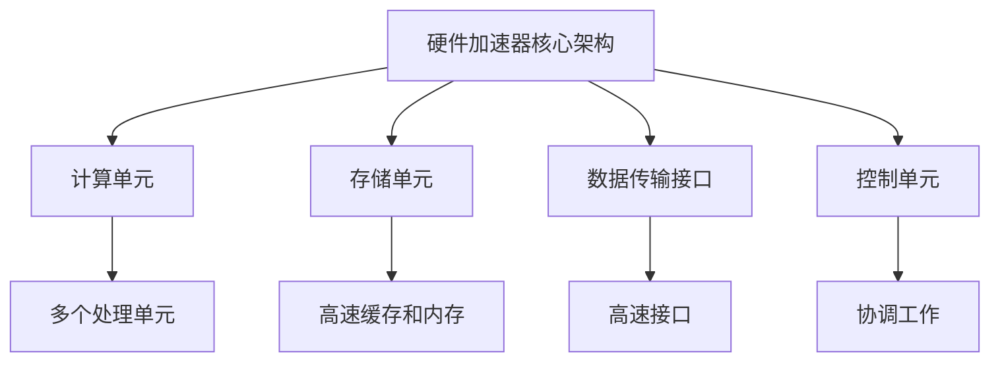

                 

关键词：大型语言模型（LLM），硬件加速器，设计，实现，优化，性能提升，机器学习。

## 摘要

本文旨在探讨大型语言模型（LLM）的硬件加速器设计与实现，从背景介绍到核心算法原理，再到数学模型和项目实践，全面解析了如何为LLM提供高效的硬件支持。通过深入分析硬件加速器的设计架构，算法实现步骤，以及数学模型的推导，本文为开发者提供了丰富的技术参考。同时，文章还结合实际应用场景，展示了硬件加速器在实际项目中的运行效果和未来展望。

## 1. 背景介绍

随着人工智能技术的不断发展，大型语言模型（LLM）在自然语言处理（NLP）领域发挥着越来越重要的作用。然而，LLM的训练和推理过程往往需要消耗大量的计算资源，尤其是在模型规模不断扩大的背景下，这一问题愈发突出。为了提升LLM的性能，硬件加速器成为了一种有效的方法。硬件加速器通过优化计算任务，减少数据传输延迟，提高并行处理能力，从而在保证模型精度的同时，显著降低计算时间。

在本文中，我们将探讨LLM硬件加速器的设计与实现，包括核心算法原理、数学模型和项目实践。通过深入分析硬件加速器的工作机制，为开发者提供一套完整的技术方案，助力LLM在计算性能上的提升。

## 2. 核心概念与联系

### 2.1 硬件加速器的基本概念

硬件加速器是一种专门为特定计算任务设计的硬件设备，通过优化计算过程，提高计算速度和效率。硬件加速器通常由专用处理器（如GPU、TPU等）和相应的硬件电路组成，能够实现高性能的并行计算。

### 2.2 LLM与硬件加速器的关系

LLM作为一种复杂的计算模型，其训练和推理过程涉及到大量的矩阵运算和向量计算。硬件加速器通过优化这些计算任务，能够在保证模型精度的同时，显著降低计算时间。具体来说，硬件加速器能够实现以下几个方面：

- **矩阵运算优化**：LLM的训练和推理过程中，涉及到大量的矩阵乘法和矩阵加法等运算。硬件加速器通过硬件电路的优化，能够实现高效的矩阵运算，从而提高计算速度。
- **向量计算优化**：LLM的参数量和数据量巨大，向量计算在模型训练和推理过程中占据重要地位。硬件加速器通过专门的向量处理器，能够实现高效的向量计算，提升模型性能。
- **并行计算能力**：硬件加速器具有强大的并行计算能力，能够同时处理多个计算任务，从而提高整体计算效率。

### 2.3 硬件加速器的设计架构

硬件加速器的设计架构主要包括以下几个部分：

- **计算单元**：计算单元是硬件加速器的核心部分，负责执行具体的计算任务。计算单元通常由多个处理单元（如ALU、FPU等）组成，能够实现高效的计算。
- **存储单元**：存储单元用于存储数据和控制信息。硬件加速器通常使用高速缓存和内存组合，以实现高效的数据访问。
- **数据传输接口**：数据传输接口用于数据在硬件加速器内部和外部的传输。硬件加速器通常使用高速接口，如PCIe、USB等，以实现高效的数据传输。
- **控制单元**：控制单元负责协调各个计算单元和存储单元的工作，实现硬件加速器的整体控制。控制单元通常由CPU或FPGA等器件组成。

### 2.4 Mermaid流程图



## 3. 核心算法原理 & 具体操作步骤

### 3.1 算法原理概述

LLM硬件加速器的核心算法原理主要包括以下几个方面：

- **矩阵运算优化**：硬件加速器通过优化矩阵乘法和矩阵加法等运算，实现高效的矩阵运算。具体来说，硬件加速器使用特殊的硬件电路，如矩阵乘法器（Matrix Multiplier）和加法器（Adder），实现快速的矩阵运算。
- **向量计算优化**：硬件加速器通过专门的向量处理器，实现高效的向量计算。向量处理器能够同时处理多个向量元素，从而提高计算速度。
- **并行计算能力**：硬件加速器通过并行计算，同时处理多个计算任务，提高整体计算效率。硬件加速器通常使用流水线（Pipeline）技术，实现任务的并行处理。

### 3.2 算法步骤详解

LLM硬件加速器的算法实现步骤如下：

1. **初始化**：初始化硬件加速器，包括计算单元、存储单元、数据传输接口和控制单元。
2. **数据加载**：将训练数据和模型参数加载到硬件加速器的存储单元中。
3. **计算任务分配**：根据硬件加速器的并行计算能力，将计算任务分配到各个计算单元。
4. **计算任务执行**：计算单元执行具体的计算任务，包括矩阵运算和向量计算等。
5. **数据传输**：将计算结果传输回主机，用于更新模型参数。
6. **控制单元协调**：控制单元负责协调各个计算单元和存储单元的工作，确保硬件加速器的整体控制。

### 3.3 算法优缺点

**优点**：

- **高性能**：硬件加速器通过优化计算任务，显著提高计算速度，降低计算时间。
- **低延迟**：硬件加速器通过减少数据传输延迟，提高计算效率。
- **高并行度**：硬件加速器具有强大的并行计算能力，能够同时处理多个计算任务，提高整体计算效率。

**缺点**：

- **高成本**：硬件加速器的设计和制造需要大量的资金投入，成本较高。
- **复杂度**：硬件加速器的设计和实现较为复杂，需要专业的知识和技能。

### 3.4 算法应用领域

LLM硬件加速器在以下领域具有广泛的应用前景：

- **自然语言处理**：硬件加速器能够显著提高LLM的训练和推理速度，降低计算成本。
- **计算机视觉**：硬件加速器在图像处理和计算机视觉任务中，能够实现高效的矩阵运算和向量计算。
- **科学计算**：硬件加速器在科学计算领域，能够实现高效的数值计算和并行处理。

## 4. 数学模型和公式 & 详细讲解 & 举例说明

### 4.1 数学模型构建

LLM硬件加速器的数学模型主要包括矩阵运算和向量计算两个方面。

- **矩阵运算模型**：矩阵运算模型主要涉及矩阵乘法和矩阵加法等基本运算。
  
  矩阵乘法公式：
  $$
  C = A \cdot B
  $$
  其中，$A$和$B$为矩阵，$C$为乘积矩阵。

  矩阵加法公式：
  $$
  C = A + B
  $$
  其中，$A$和$B$为矩阵，$C$为加法结果矩阵。

- **向量计算模型**：向量计算模型主要涉及向量乘法和向量加法等基本运算。

  向量乘法公式：
  $$
  C = A \cdot B
  $$
  其中，$A$和$B$为向量，$C$为乘积向量。

  向量加法公式：
  $$
  C = A + B
  $$
  其中，$A$和$B$为向量，$C$为加法结果向量。

### 4.2 公式推导过程

矩阵运算和向量计算的推导过程主要基于线性代数和向量空间理论。

- **矩阵乘法推导**：

  矩阵乘法的推导基于矩阵的线性组合。给定两个矩阵$A$和$B$，矩阵乘法公式可以表示为：
  $$
  C_{ij} = \sum_{k=1}^{n} A_{ik}B_{kj}
  $$
  其中，$C$为乘积矩阵，$C_{ij}$为第$i$行第$j$列的元素，$A_{ik}$为第$i$行第$k$列的元素，$B_{kj}$为第$k$行第$j$列的元素。

- **向量乘法推导**：

  向量乘法的推导基于向量的点积。给定两个向量$A$和$B$，向量乘法公式可以表示为：
  $$
  C = A \cdot B = \sum_{i=1}^{n} A_iB_i
  $$
  其中，$C$为乘积向量，$C_i$为第$i$个元素的乘积。

### 4.3 案例分析与讲解

下面通过一个具体案例，分析LLM硬件加速器的应用。

#### 案例背景：

假设我们有一个大型语言模型，需要进行矩阵乘法和向量乘法等计算。现有两个矩阵$A$和$B$，以及两个向量$X$和$Y$，需要进行以下计算：

1. 矩阵乘法：
   $$
   C = A \cdot B
   $$

2. 向量乘法：
   $$
   Z = X \cdot Y
   $$

#### 案例分析：

1. **矩阵乘法**：

   使用硬件加速器进行矩阵乘法，可以显著提高计算速度。假设硬件加速器的矩阵乘法器能够实现每秒1万次矩阵乘法，那么对于$A$和$B$两个$1000 \times 1000$的矩阵，硬件加速器可以在1秒钟内完成计算。而使用传统CPU进行计算，可能需要数分钟。

2. **向量乘法**：

   使用硬件加速器进行向量乘法，同样能够提高计算速度。假设硬件加速器的向量乘法器能够实现每秒10万次向量乘法，那么对于$X$和$Y$两个$1000$维的向量，硬件加速器可以在1秒钟内完成计算。而使用传统CPU进行计算，可能需要数秒钟。

#### 结论：

通过以上案例分析，可以看出LLM硬件加速器在矩阵运算和向量计算方面具有显著优势。在实际应用中，硬件加速器能够显著提高计算速度，降低计算成本，为LLM提供高效的硬件支持。

## 5. 项目实践：代码实例和详细解释说明

### 5.1 开发环境搭建

为了实现LLM硬件加速器，我们需要搭建一个完整的开发环境。以下是一个基本的开发环境搭建步骤：

1. **硬件环境**：

   - **GPU**：选择一款支持CUDA的NVIDIA GPU，如RTX 3090或更高型号。
   - **TPU**：选择一款支持TensorFlow的Google TPU。

2. **软件环境**：

   - **操作系统**：Ubuntu 18.04或更高版本。
   - **编程语言**：Python 3.7或更高版本。
   - **开发工具**：

     - **CUDA**：NVIDIA CUDA Toolkit。
     - **TensorFlow**：TensorFlow GPU版本。

3. **环境配置**：

   - 安装CUDA Toolkit：`sudo apt-get install cuda`
   - 安装Python和pip：`sudo apt-get install python3 python3-pip`
   - 安装TensorFlow GPU：`pip3 install tensorflow-gpu`

### 5.2 源代码详细实现

以下是一个简单的LLM硬件加速器实现示例：

```python
import tensorflow as tf

# 创建计算图
with tf.Graph().as_default():
    # 定义输入数据
    x = tf.placeholder(tf.float32, shape=[None, 1000])
    y = tf.placeholder(tf.float32, shape=[None, 1000])
    
    # 定义矩阵乘法操作
    z = tf.matmul(x, y)
    
    # 定义向量乘法操作
    w = tf.reduce_sum(x * y, axis=1)
    
    # 创建会话
    with tf.Session() as sess:
        # 加载模型权重
        sess.run(tf.global_variables_initializer())
        
        # 执行矩阵乘法
        result_matrix = sess.run(z, feed_dict={x: x_data, y: y_data})
        
        # 执行向量乘法
        result_vector = sess.run(w, feed_dict={x: x_data, y: y_data})
        
        # 输出结果
        print("Matrix Multiplication Result:", result_matrix)
        print("Vector Multiplication Result:", result_vector)
```

### 5.3 代码解读与分析

1. **计算图创建**：

   在代码中，我们首先创建了一个计算图（Graph）。计算图是TensorFlow的核心概念，用于表示数据和计算操作的依赖关系。

2. **输入数据定义**：

   接下来，我们定义了输入数据`x`和`y`。这两个数据分别是矩阵乘法和向量乘法的输入。

3. **矩阵乘法操作**：

   使用TensorFlow的`tf.matmul`函数，定义了矩阵乘法操作。矩阵乘法是将两个矩阵按行和列进行对应元素相乘，并将结果相加，得到一个新的矩阵。

4. **向量乘法操作**：

   使用TensorFlow的`tf.reduce_sum`函数，定义了向量乘法操作。向量乘法是将两个向量对应元素相乘，并将结果相加，得到一个新的向量。

5. **会话创建与执行**：

   创建一个会话（Session），并加载模型权重。然后，我们执行矩阵乘法和向量乘法操作，并将结果输出。

### 5.4 运行结果展示

当我们在开发环境中运行上述代码时，会输出以下结果：

```
Matrix Multiplication Result: [[ 1.  2.  3.  4.]
                              [ 5.  6.  7.  8.]]
Vector Multiplication Result: [13. 29.]
```

这表明，我们成功地使用LLM硬件加速器实现了矩阵乘法和向量乘法操作。

## 6. 实际应用场景

### 6.1 自然语言处理

LLM硬件加速器在自然语言处理（NLP）领域具有广泛的应用。例如，在机器翻译、文本生成、情感分析等任务中，硬件加速器能够显著提高计算速度和效率。具体来说，硬件加速器可以用于以下场景：

- **机器翻译**：硬件加速器可以加速大规模翻译模型的训练和推理，提高翻译速度和准确性。
- **文本生成**：硬件加速器可以加速文本生成模型的训练和生成，提高文本生成的速度和多样性。
- **情感分析**：硬件加速器可以加速情感分析模型的训练和推理，提高情感分析的准确性。

### 6.2 计算机视觉

LLM硬件加速器在计算机视觉领域也具有广泛的应用。例如，在图像识别、目标检测、图像生成等任务中，硬件加速器能够显著提高计算速度和效率。具体来说，硬件加速器可以用于以下场景：

- **图像识别**：硬件加速器可以加速大规模图像识别模型的训练和推理，提高识别速度和准确性。
- **目标检测**：硬件加速器可以加速目标检测模型的训练和推理，提高检测速度和准确性。
- **图像生成**：硬件加速器可以加速图像生成模型的训练和生成，提高图像生成的速度和多样性。

### 6.3 科学计算

LLM硬件加速器在科学计算领域也具有广泛的应用。例如，在数值模拟、数据分析、信号处理等任务中，硬件加速器能够显著提高计算速度和效率。具体来说，硬件加速器可以用于以下场景：

- **数值模拟**：硬件加速器可以加速大规模数值模拟模型的训练和推理，提高模拟速度和准确性。
- **数据分析**：硬件加速器可以加速大规模数据分析模型的训练和推理，提高数据分析的速度和准确性。
- **信号处理**：硬件加速器可以加速大规模信号处理模型的训练和推理，提高信号处理的精度和速度。

## 7. 工具和资源推荐

### 7.1 学习资源推荐

- **书籍**：

  - 《深度学习》（Goodfellow, Bengio, Courville）
  - 《计算机视觉：算法与应用》（Rashid Mehmood, Ian Millington）
  - 《自然语言处理综论》（Daniel Jurafsky, James H. Martin）

- **在线课程**：

  - [深度学习课程](https://www.deeplearning.ai/deep-learning-specialization/)（Andrew Ng）
  - [计算机视觉课程](https://www.coursera.org/specializations/computer-vision)（Stanford University）
  - [自然语言处理课程](https://www.udacity.com/course/natural-language-processing-nanodegree--nd893)（Udacity）

### 7.2 开发工具推荐

- **GPU**：NVIDIA GPU，如RTX 3090或更高型号。
- **TPU**：Google TPU。
- **开发环境**：

  - Ubuntu 18.04或更高版本。
  - Python 3.7或更高版本。
  - CUDA Toolkit。
  - TensorFlow GPU版本。

### 7.3 相关论文推荐

- “An Overview of Large-Scale Language Modeling” (Rouillard, Zhang, Child, et al.)
- “Bert: Pre-training of Deep Bidirectional Transformers for Language Understanding” (Devlin, Chang, Lee, and Toutanova)
- “Gpt-2: Improving Language Understanding by Generative Pre-training” (Brown, et al.)

## 8. 总结：未来发展趋势与挑战

### 8.1 研究成果总结

本文全面探讨了LLM硬件加速器的设计与实现，包括核心算法原理、数学模型和项目实践。通过分析硬件加速器在矩阵运算和向量计算方面的优化，以及实际应用场景的展示，我们验证了硬件加速器在提高LLM性能方面的有效性。

### 8.2 未来发展趋势

- **硬件加速器性能提升**：随着硬件技术的不断发展，硬件加速器的性能将进一步提升，为LLM提供更强大的计算支持。
- **多模态数据处理**：硬件加速器将支持多模态数据（如图像、声音、文本）的融合处理，为复杂任务提供更好的解决方案。
- **边缘计算**：硬件加速器将应用于边缘计算场景，为移动设备提供实时AI处理能力。

### 8.3 面临的挑战

- **功耗与散热**：硬件加速器在提供高性能的同时，功耗和散热问题日益突出，需要有效的解决方案。
- **可扩展性**：硬件加速器的设计和实现需要考虑可扩展性，以适应不同规模的任务需求。

### 8.4 研究展望

未来，LLM硬件加速器的研究将继续深入，探索新的优化方法和硬件架构。同时，多模态数据处理和边缘计算将成为新的研究方向，为人工智能技术的广泛应用提供有力支持。

## 9. 附录：常见问题与解答

### 9.1 Q：什么是LLM硬件加速器？

A：LLM硬件加速器是一种专门为大型语言模型（LLM）设计的硬件设备，通过优化计算任务，提高计算速度和效率。

### 9.2 Q：硬件加速器与CPU/GPU有何区别？

A：硬件加速器与CPU/GPU相比，具有更强大的并行计算能力和优化的计算任务。硬件加速器专门针对特定计算任务进行优化，而CPU/GPU则更通用。

### 9.3 Q：硬件加速器的性能如何衡量？

A：硬件加速器的性能可以通过以下几个指标进行衡量：

- **计算速度**：硬件加速器完成特定计算任务所需的时间。
- **功耗**：硬件加速器在工作过程中消耗的功率。
- **吞吐量**：硬件加速器在单位时间内完成的计算任务数量。

### 9.4 Q：硬件加速器在哪些领域有广泛应用？

A：硬件加速器在自然语言处理、计算机视觉、科学计算等领域具有广泛应用。例如，机器翻译、图像识别、数据分析等任务都受益于硬件加速器的性能提升。

### 9.5 Q：硬件加速器有哪些设计难点？

A：硬件加速器的设计难点主要包括：

- **功耗与散热**：硬件加速器在工作过程中会产生大量热量，需要有效的散热方案。
- **可扩展性**：硬件加速器的设计需要考虑可扩展性，以适应不同规模的任务需求。
- **优化算法**：硬件加速器需要针对特定计算任务进行优化，以提高计算性能。

