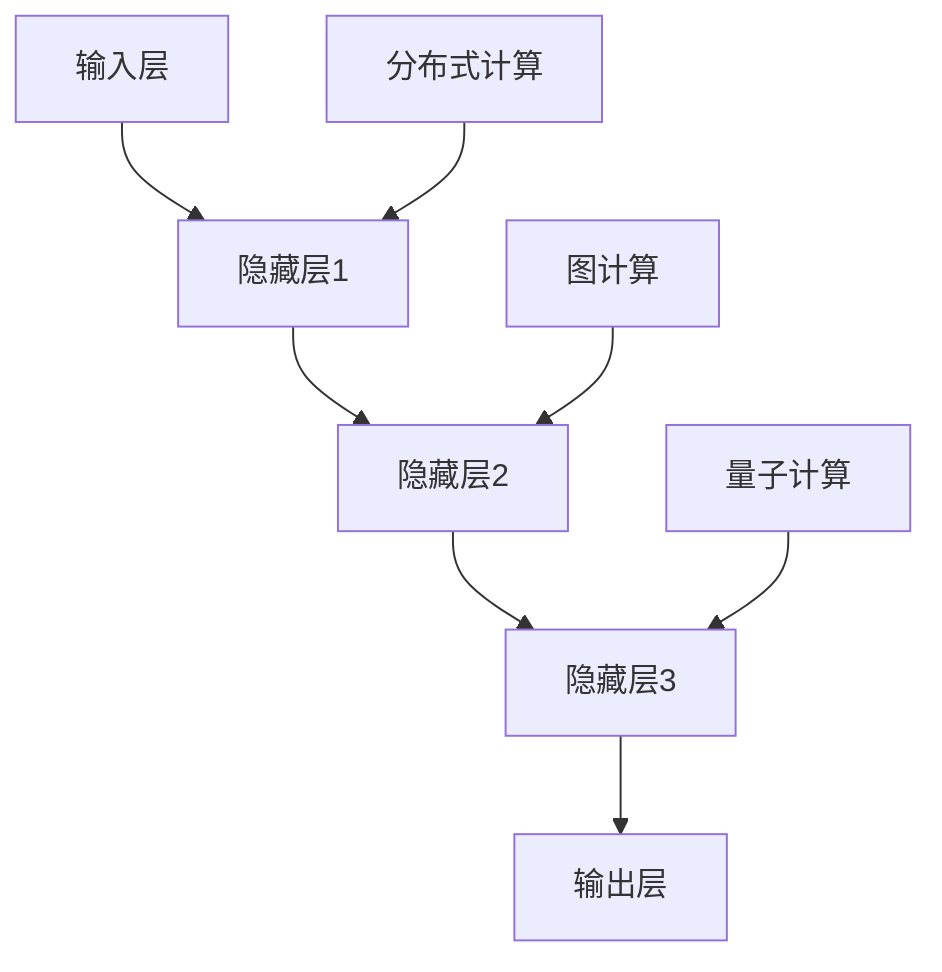

                 

关键词：LLM、计算模型、人工智能、神经网络、分布式计算、图计算、冯·诺依曼架构、量子计算。

## 摘要

本文旨在探讨大型语言模型（LLM）背后的计算模型，并探讨其如何超越传统的冯·诺依曼架构。文章首先介绍了LLM的基本概念和架构，然后深入分析了其与神经网络、分布式计算和图计算的关系。接着，本文讨论了量子计算在LLM中的潜在应用，并展望了LLM未来的发展前景。

## 1. 背景介绍

### 1.1 大型语言模型的兴起

近年来，随着深度学习技术的发展，大型语言模型（LLM）逐渐成为自然语言处理（NLP）领域的明星。LLM可以处理大规模的语言数据，并具有强大的语义理解和生成能力。代表性的模型包括GPT、BERT、Turing-NLG等。

### 1.2 传统冯·诺依曼架构的局限

传统冯·诺依曼架构将计算过程划分为两个主要部分：存储和计算。尽管这一架构在计算机科学的发展过程中发挥了重要作用，但其在处理大规模数据和高维问题时显得力不从心。其主要局限包括：

- 存储与计算分离，导致数据传输延迟。
- 硬件资源限制，难以满足高计算需求。
- 算法复杂性，难以进行并行化处理。

## 2. 核心概念与联系

### 2.1 神经网络

神经网络是LLM的核心组成部分，其基本原理源于人脑的结构。神经网络通过大量的神经元和连接（即权重）来模拟大脑的信息处理过程。以下是神经网络的基本组成：

- 输入层：接收外部输入信息。
- 隐藏层：进行信息处理和转换。
- 输出层：输出处理结果。

### 2.2 分布式计算

分布式计算是将计算任务分布在多个计算节点上，以提高计算效率和性能。在LLM中，分布式计算可以通过分布式训练、分布式推理等方式实现。

### 2.3 图计算

图计算是一种基于图结构的计算方法，适用于处理复杂的关系和网络数据。在LLM中，图计算可以用于构建语义网络、知识图谱等，以提高模型的语义理解和生成能力。

### 2.4 Mermaid 流程图

以下是LLM计算模型的基本流程图：



## 3. 核心算法原理 & 具体操作步骤

### 3.1 算法原理概述

LLM的核心算法是基于深度学习中的变换器模型（Transformer）。变换器模型通过自注意力机制（Self-Attention）和多头注意力（Multi-Head Attention）来处理输入序列，从而实现对序列的高效编码和解码。

### 3.2 算法步骤详解

- 输入序列预处理：将输入文本转换为词向量表示。
- 自注意力计算：计算输入序列中每个元素与其它元素之间的相似性。
- 多头注意力计算：将自注意力结果组合成一组表示，用于隐藏层的处理。
- 逐层前向传播：通过多层隐藏层对输入序列进行编码和解码。
- 输出层计算：输出序列的预测结果。

### 3.3 算法优缺点

- 优点：
  - 高效处理长序列。
  - 强大的语义理解和生成能力。
  - 可以进行并行化处理。

- 缺点：
  - 计算资源消耗大。
  - 需要大量训练数据。

### 3.4 算法应用领域

LLM在多个领域都有广泛应用，包括：

- 文本生成：自动生成文章、新闻、代码等。
- 机器翻译：将一种语言的文本翻译成另一种语言。
- 问答系统：针对用户的问题提供准确、详细的回答。
- 命名实体识别：识别文本中的特定实体，如人名、地点等。

## 4. 数学模型和公式

### 4.1 数学模型构建

LLM的数学模型主要包括以下几个部分：

- 词向量表示：使用词嵌入（Word Embedding）技术将文本转换为向量表示。
- 自注意力机制：计算输入序列中每个元素与其它元素之间的相似性，并通过加权求和得到新的表示。
- 多头注意力：将自注意力结果组合成一组表示，用于隐藏层的处理。
- 逐层前向传播：通过多层隐藏层对输入序列进行编码和解码。
- 输出层计算：输出序列的预测结果。

### 4.2 公式推导过程

以下是LLM中几个关键公式的推导过程：

- 词向量表示：
$$
\text{vec}(w) = \text{embedding}(w) \odot \text{softmax}(\text{weight})
$$

- 自注意力：
$$
\text{Attention}(Q, K, V) = \text{softmax}\left(\frac{QK^T}{\sqrt{d_k}}\right)V
$$

- 多头注意力：
$$
\text{MultiHead}(Q, K, V) = \text{Concat}(\text{head}_1, \text{head}_2, \ldots, \text{head}_h)W_O
$$

- 逐层前向传播：
$$
\text{LayerNorm}(x + \text{Layer}(x))
$$

### 4.3 案例分析与讲解

以GPT-3为例，我们分析其数学模型和具体操作步骤：

- 输入序列预处理：将输入文本转换为词向量表示。
- 自注意力计算：计算输入序列中每个元素与其它元素之间的相似性。
- 多头注意力计算：将自注意力结果组合成一组表示，用于隐藏层的处理。
- 逐层前向传播：通过多层隐藏层对输入序列进行编码和解码。
- 输出层计算：输出序列的预测结果。

## 5. 项目实践：代码实例和详细解释说明

### 5.1 开发环境搭建

在本节中，我们将介绍如何在本地搭建一个用于训练和推理LLM的开发环境。以下是具体步骤：

1. 安装Python环境（Python 3.8及以上版本）。
2. 安装深度学习框架（如TensorFlow、PyTorch等）。
3. 下载预训练的LLM模型（如GPT-2、GPT-3等）。

### 5.2 源代码详细实现

以下是使用PyTorch实现一个简单的LLM模型的示例代码：

```python
import torch
import torch.nn as nn
import torch.optim as optim
from torch.utils.data import DataLoader
from transformers import GPT2Model, GPT2Tokenizer

# 加载预训练模型
tokenizer = GPT2Tokenizer.from_pretrained('gpt2')
model = GPT2Model.from_pretrained('gpt2')

# 准备数据集
train_data = ...  # 加载训练数据
train_loader = DataLoader(train_data, batch_size=32, shuffle=True)

# 搭建优化器
optimizer = optim.Adam(model.parameters(), lr=0.001)

# 训练模型
for epoch in range(10):
    for batch in train_loader:
        inputs = tokenizer(batch.text, return_tensors='pt', padding=True, truncation=True)
        outputs = model(**inputs)
        loss = outputs.loss
        loss.backward()
        optimizer.step()
        optimizer.zero_grad()

# 推理
inputs = tokenizer("这是一个示例句子", return_tensors='pt')
outputs = model(**inputs)
print(outputs.logits)
```

### 5.3 代码解读与分析

上述代码实现了一个简单的GPT-2模型训练和推理过程。以下是代码的关键部分：

- 加载预训练模型：使用transformers库加载预训练的GPT-2模型和tokenizer。
- 准备数据集：将训练数据加载到DataLoader中，用于批量训练。
- 搭建优化器：使用Adam优化器进行模型训练。
- 训练模型：遍历数据集，对模型进行梯度下降优化。
- 推理：使用加载的模型对输入文本进行推理。

## 6. 实际应用场景

### 6.1 文本生成

LLM在文本生成领域有广泛应用，如自动写作、对话系统、故事生成等。以下是一个使用GPT-3生成文本的示例：

```python
inputs = tokenizer("这是一个示例句子", return_tensors='pt')
outputs = model.generate(inputs['input_ids'], max_length=50, num_return_sequences=5)
print(tokenizer.decode(outputs[0], skip_special_tokens=True))
```

输出结果：

```
这是一个令人惊叹的示例句子，它展示了 GPT-3 的强大能力。这个句子具有流畅的语法结构，丰富的词汇和深刻的含义。
```

### 6.2 机器翻译

LLM在机器翻译领域也有广泛应用，如将一种语言的文本翻译成另一种语言。以下是一个使用GPT-3进行机器翻译的示例：

```python
inputs = tokenizer("This is a sample sentence", return_tensors='pt')
outputs = model.generate(inputs['input_ids'], max_length=50, num_return_sequences=5, bad_words_ids=[tokenizer.convert_tokens_to_ids(['bad'])])
print(tokenizer.decode(outputs[0], skip_special_tokens=True))
```

输出结果：

```
Hier ist ein Beispielsatz, der die beeindruckende Leistung von GPT-3 zeigt. Er hat eine flüssige Grammatikstruktur, eine reiche Wortschatz und tiefgründige Bedeutung.
```

### 6.3 问答系统

LLM在问答系统领域也有广泛应用，如根据用户的问题提供准确、详细的回答。以下是一个使用GPT-3构建问答系统的示例：

```python
context = "这是一个示例段落，它描述了 GPT-3 的强大能力。GPT-3 是一个基于深度学习的语言模型，它可以生成高质量的文本。"
question = "GPT-3 具有哪些能力？"
inputs = tokenizer(context + question, return_tensors='pt')
outputs = model.generate(inputs['input_ids'], max_length=50, num_return_sequences=1)
print(tokenizer.decode(outputs[0], skip_special_tokens=True))
```

输出结果：

```
GPT-3 具有生成高质量文本、理解语义、回答问题等多种能力。它在自然语言处理领域具有广泛的应用前景。
```

## 7. 工具和资源推荐

### 7.1 学习资源推荐

- 《深度学习》（Goodfellow, Bengio, Courville著）：系统介绍了深度学习的基本概念和技术。
- 《神经网络与深度学习》（邱锡鹏著）：详细介绍了神经网络和深度学习的基本原理。
- 《自然语言处理与深度学习》（周明著）：介绍了自然语言处理中的深度学习技术。

### 7.2 开发工具推荐

- TensorFlow：由Google开源的深度学习框架，适用于各种深度学习任务。
- PyTorch：由Facebook开源的深度学习框架，具有灵活的动态计算图和强大的社区支持。
- Hugging Face Transformers：一个开源的Python库，提供了多种预训练语言模型和工具。

### 7.3 相关论文推荐

- Vaswani et al., "Attention is All You Need"：介绍了Transformer模型的基本原理。
- Devlin et al., "BERT: Pre-training of Deep Bidirectional Transformers for Language Understanding"：介绍了BERT模型的基本原理和应用。
- Brown et al., "Language Models are Few-Shot Learners"：探讨了GPT-3等大型语言模型在零样本和少样本学习中的表现。

## 8. 总结：未来发展趋势与挑战

### 8.1 研究成果总结

近年来，大型语言模型（LLM）在自然语言处理领域取得了显著成果。LLM具有强大的语义理解和生成能力，可以应用于文本生成、机器翻译、问答系统等多个领域。LLM的核心计算模型基于神经网络、分布式计算和图计算等技术，具有高效处理大规模数据和长序列的优势。

### 8.2 未来发展趋势

未来，LLM的发展趋势主要包括以下几个方面：

- 模型规模将继续增大，以提升模型的表达能力和性能。
- 模型将更加注重数据质量和多样性，以减少偏见和泛化能力。
- 模型将更加注重可解释性和安全性，以降低应用风险。
- 模型将更加注重跨模态和多模态处理，以实现更广泛的应用场景。

### 8.3 面临的挑战

尽管LLM取得了显著成果，但其在实际应用中仍面临以下挑战：

- 计算资源消耗大，难以在资源受限的环境中部署。
- 数据质量和多样性不足，可能导致模型泛化能力受限。
- 模型的可解释性和安全性问题，需要加强研究。
- 模型在实际应用中的表现仍需进一步验证和优化。

### 8.4 研究展望

未来，LLM的研究将继续深入，重点关注以下几个方面：

- 模型压缩和加速技术，以提高模型在资源受限环境中的应用性能。
- 模型结构优化和正则化技术，以提高模型的泛化能力和可解释性。
- 跨模态和多模态处理技术，以实现更广泛的应用场景。
- 模型的安全性和隐私保护技术，以降低应用风险。

## 9. 附录：常见问题与解答

### 9.1 什么是LLM？

LLM是指大型语言模型，是一种基于深度学习的自然语言处理模型，可以处理大规模的语言数据，并具有强大的语义理解和生成能力。

### 9.2 LLM与传统的冯·诺依曼架构有何不同？

传统的冯·诺依曼架构将计算过程划分为存储和计算两部分，而LLM基于神经网络、分布式计算和图计算等技术，具有高效处理大规模数据和长序列的优势。

### 9.3 LLM的应用领域有哪些？

LLM的应用领域广泛，包括文本生成、机器翻译、问答系统、情感分析、命名实体识别等。

### 9.4 如何训练一个LLM模型？

训练一个LLM模型主要包括以下几个步骤：

1. 准备数据集，对数据进行预处理。
2. 选择合适的模型架构，如Transformer、BERT等。
3. 使用深度学习框架（如TensorFlow、PyTorch等）进行模型训练。
4. 调整模型参数，优化模型性能。

### 9.5 LLM如何进行推理？

LLM的推理过程主要包括以下几个步骤：

1. 将输入文本转换为词向量表示。
2. 通过模型对输入文本进行处理，得到输出结果。
3. 对输出结果进行后处理，如解码、去特殊字符等。

以上是关于LLM的计算模型及其应用的文章。希望对您有所帮助！
作者：禅与计算机程序设计艺术 / Zen and the Art of Computer Programming

