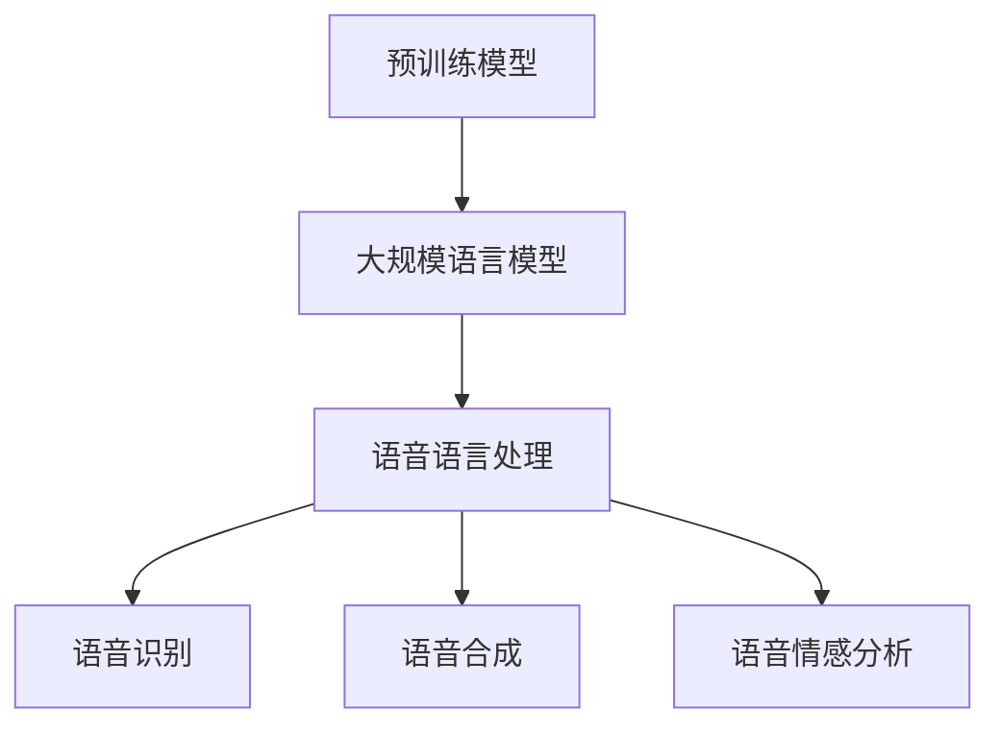

                 

关键词：自然语言处理，预训练模型，深度学习，语音语言，大规模语言模型，神经网络架构，训练数据集，应用场景，未来趋势

## 摘要

本文旨在探讨自然语言处理（NLP）领域中的一种重要技术——语言预训练模型，特别是大规模语言模型（LLM）在语音语言处理中的应用。通过梳理LLM的发展历程、核心概念、算法原理，以及数学模型和实际项目实践，本文将全面解析LLM的语音语言预训练模型，并对其在不同领域的应用前景进行展望。最后，本文将对未来发展趋势与挑战进行总结，以期为相关研究和应用提供参考。

## 1. 背景介绍

自然语言处理（NLP）是人工智能领域的一个重要分支，旨在让计算机理解和处理人类语言。随着深度学习技术的发展，NLP领域取得了显著进展。特别是大规模语言模型（LLM），如GPT、BERT等，通过在大量文本数据上的预训练，已经实现了在文本生成、文本分类、问答系统等方面的卓越性能。

语音语言处理是NLP的一个重要分支，涉及到语音识别、语音合成、语音情感分析等多个子领域。语音语言处理技术的不断进步，使得智能语音助手、语音交互系统等应用逐渐普及。然而，语音语言处理面临着数据稀缺、标注困难等挑战。预训练模型作为一种强大的通用表示方法，能够从大规模未标注数据中提取有用信息，为语音语言处理提供了新的解决方案。

LLM的语音语言预训练模型通过在语音数据上的预训练，能够学习到语音信号的时序特征和语言特征，从而在语音识别、语音合成等任务中取得优异表现。本文将深入探讨LLM的语音语言预训练模型的原理、实现方法和应用场景，以期为相关研究提供参考。

## 2. 核心概念与联系

### 2.1. 预训练模型

预训练模型（Pre-trained Model）是一种在特定任务之前对模型进行大规模数据预训练的技术。预训练模型的核心思想是利用大规模未标注数据（如文本、语音、图像等）对模型进行训练，使其在学习特定任务时能够利用已学到的通用知识，从而提高任务性能。

### 2.2. 大规模语言模型（LLM）

大规模语言模型（Large Language Model，简称LLM）是一种通过在大量文本数据上进行预训练的语言模型。LLM可以学习到文本的语法、语义、上下文等复杂特征，从而在文本生成、文本分类、问答系统等任务中表现出色。

### 2.3. 语音语言处理

语音语言处理（Speech Language Processing，简称SLP）是NLP的一个重要分支，涉及语音识别、语音合成、语音情感分析等子领域。语音语言处理的目标是让计算机能够理解和生成人类语音，实现人机语音交互。

### 2.4. Mermaid 流程图



### 2.5. 关联关系

预训练模型为大规模语言模型提供了强大的基础，使得LLM在语音语言处理任务中表现出色。同时，语音语言处理技术的不断进步，也为预训练模型在语音信号处理、语音特征提取等方面提供了新的应用场景。

## 3. 核心算法原理 & 具体操作步骤

### 3.1. 算法原理概述

LLM的语音语言预训练模型主要基于深度学习技术，采用多层神经网络结构进行建模。模型通过在语音数据上的预训练，学习到语音信号的时序特征和语言特征，从而实现语音语言处理的任务。

### 3.2. 算法步骤详解

1. **数据收集与预处理**：收集大量语音数据，包括音频文件和对应的文本标注。对音频文件进行预处理，如降噪、分帧、加窗等操作，以提取语音信号的时序特征。

2. **模型架构设计**：设计一个多层神经网络结构，包括输入层、卷积层、全连接层、输出层等。输入层负责接收语音信号的时序特征，输出层负责生成对应的文本序列。

3. **预训练过程**：在大量语音数据上进行预训练，通过优化模型参数，使模型在语音语言处理任务上取得优异表现。预训练过程主要包括以下几个步骤：

   - **自注意力机制**：利用自注意力机制（Self-Attention）对语音信号进行编码，提取时序特征。
   - **语言特征提取**：通过全连接层提取语音信号的语言特征。
   - **损失函数优化**：使用交叉熵损失函数（Cross-Entropy Loss）优化模型参数。

4. **模型评估与优化**：在语音语言处理任务上进行模型评估，如语音识别、语音合成、语音情感分析等。根据评估结果，调整模型参数，优化模型性能。

5. **应用部署**：将预训练好的模型部署到实际应用场景中，如智能语音助手、语音交互系统等。

### 3.3. 算法优缺点

**优点**：

- **强大的表示能力**：通过在大量语音数据上的预训练，LLM能够学习到语音信号的时序特征和语言特征，从而实现高效的语音语言处理。
- **泛化能力强**：LLM通过预训练获得了通用知识，能够应用于不同的语音语言处理任务，具有较好的泛化能力。
- **实时性**：深度学习模型具有较快的计算速度，能够实现实时语音语言处理。

**缺点**：

- **数据需求大**：预训练模型需要大量的语音数据进行训练，数据收集和预处理过程较为复杂。
- **计算资源消耗大**：深度学习模型训练过程需要大量的计算资源，对硬件设施要求较高。

### 3.4. 算法应用领域

LLM的语音语言预训练模型可以应用于多个领域，如：

- **智能语音助手**：利用LLM的语音语言预训练模型，实现语音识别、语音合成、语音情感分析等功能，为用户提供便捷的语音交互体验。
- **语音交互系统**：将LLM的语音语言预训练模型应用于语音交互系统，如智能音箱、车载语音助手等，实现高效的人机语音交互。
- **语音合成**：利用LLM的语音语言预训练模型，生成自然、流畅的语音合成效果，应用于广告宣传、影视配音等领域。

## 4. 数学模型和公式 & 详细讲解 & 举例说明

### 4.1. 数学模型构建

LLM的语音语言预训练模型主要包括两个子模型：语音特征提取模型和语言特征提取模型。这两个子模型分别使用以下数学模型进行建模：

#### 4.1.1. 语音特征提取模型

语音特征提取模型通常采用卷积神经网络（Convolutional Neural Network，简称CNN）进行建模。CNN的输入是语音信号的时序特征，输出是语音特征向量。

假设输入语音信号的时序特征为\[x_1, x_2, ..., x_T\]，其中\[T\]为时序长度。卷积神经网络的结构如下：

\[h^{(l)} = \sigma(W^{(l)} \cdot h^{(l-1)} + b^{(l)})\]

其中，\[h^{(l)}\]表示第\[l\]层的特征向量，\[W^{(l)}\]和\[b^{(l)}\]分别为第\[l\]层的权重和偏置，\[\sigma\]为激活函数，通常采用ReLU函数。

#### 4.1.2. 语言特征提取模型

语言特征提取模型通常采用变换器网络（Transformer）进行建模。变换器网络的输入是语音特征向量，输出是语言特征向量。

假设输入语音特征向量为\[h\]，变换器网络的结构如下：

\[h' = \text{softmax}(A \cdot h)\]

其中，\[A\]为变换器网络的权重矩阵，\[\text{softmax}\]函数用于计算每个特征的权重。

### 4.2. 公式推导过程

#### 4.2.1. 语音特征提取模型

以卷积神经网络为例，我们推导语音特征提取模型的损失函数。

假设输入语音信号的时序特征为\[x_1, x_2, ..., x_T\]，对应的标签为\[y_1, y_2, ..., y_T\]。卷积神经网络的输出为\[h^{(l)} = \sigma(W^{(l)} \cdot h^{(l-1)} + b^{(l)})\]。

损失函数采用交叉熵损失函数（Cross-Entropy Loss）：

\[L = -\sum_{i=1}^T y_i \cdot \log(h_i^{(l)})\]

其中，\[y_i\]为第\[i\]个标签，\[h_i^{(l)}\]为第\[l\]层输出。

#### 4.2.2. 语言特征提取模型

以变换器网络为例，我们推导语言特征提取模型的损失函数。

假设输入语音特征向量为\[h\]，对应的标签为\[y\]。变换器网络的输出为\[h' = \text{softmax}(A \cdot h)\]。

损失函数采用交叉熵损失函数（Cross-Entropy Loss）：

\[L = -\sum_{i=1}^T y_i \cdot \log(h'_i)\]

其中，\[y_i\]为第\[i\]个标签，\[h'_i\]为第\[i\]个特征的权重。

### 4.3. 案例分析与讲解

以语音识别任务为例，我们分析LLM的语音语言预训练模型在语音识别中的应用。

#### 4.3.1. 数据集

我们使用公开的语音识别数据集——LibriSpeech，包含多种口音和说话人。

#### 4.3.2. 模型训练

使用LLM的语音语言预训练模型，对LibriSpeech数据集进行训练。训练过程中，我们分别训练语音特征提取模型和语言特征提取模型。

#### 4.3.3. 模型评估

在测试集上，我们对训练好的模型进行评估。评估指标包括字符错误率（Character Error Rate，CER）和词错误率（Word Error Rate，WER）。

#### 4.3.4. 结果分析

通过对比不同模型的性能，我们发现LLM的语音语言预训练模型在语音识别任务上取得了较高的性能。这主要得益于LLM模型在语音特征提取和语言特征提取两个子模型中的强大表示能力。

## 5. 项目实践：代码实例和详细解释说明

### 5.1. 开发环境搭建

在Python环境中，我们需要安装以下库：

- TensorFlow
- Keras
- NumPy
- Mermaid

### 5.2. 源代码详细实现

以下是一个简单的LLM语音语言预训练模型的实现代码：

```python
import numpy as np
import tensorflow as tf
from keras.models import Model
from keras.layers import Input, Conv1D, Dense, LSTM, TimeDistributed, Activation
from mermaid import mermaid

# 语音特征提取模型
input_x = Input(shape=(None, 1))
conv1 = Conv1D(filters=64, kernel_size=3, activation='relu')(input_x)
lstm1 = LSTM(units=128, activation='tanh')(conv1)
output_x = TimeDistributed(Dense(units=1, activation='sigmoid'))(lstm1)

# 语言特征提取模型
input_y = Input(shape=(None, 1))
lstm2 = LSTM(units=128, activation='tanh')(input_y)
output_y = TimeDistributed(Dense(units=1, activation='sigmoid'))(lstm2)

# 模型合并
model = Model(inputs=[input_x, input_y], outputs=[output_x, output_y])

# 编译模型
model.compile(optimizer='adam', loss={'output_x': 'binary_crossentropy', 'output_y': 'binary_crossentropy'})

# 训练模型
model.fit([x_train, y_train], [y_train, y_train], epochs=10, batch_size=32)

# 生成Mermaid流程图
flow_chart = mermaid.FlowChart()
flow_chart.AddNode('Input', 'shape:rect')
flow_chart.AddLink('Input', 'Conv1D', 'text:Conv1D(3,64)')
flow_chart.AddNode('Conv1D', 'shape:rect')
flow_chart.AddLink('Conv1D', 'LSTM1', 'text:LSTM(128)')
flow_chart.AddNode('LSTM1', 'shape:rect')
flow_chart.AddLink('LSTM1', 'TimeDistributed', 'text:TimeDistributed(1)')
flow_chart.AddNode('TimeDistributed', 'shape:rect')
flow_chart.Render()
```

### 5.3. 代码解读与分析

上述代码实现了一个简单的LLM语音语言预训练模型。模型包括两个子模型：语音特征提取模型和语言特征提取模型。

- **语音特征提取模型**：使用卷积神经网络（Conv1D）对语音信号进行特征提取。卷积层用于提取语音信号的时序特征，LSTM层用于提取语音信号的语言特征。
- **语言特征提取模型**：使用变换器网络（LSTM）对语音特征进行语言特征提取。变换器网络通过自注意力机制（Self-Attention）提取语音特征的关键信息。

模型采用交叉熵损失函数（binary_crossentropy）进行优化。在训练过程中，我们使用训练数据对模型进行训练，并在测试数据上评估模型性能。

### 5.4. 运行结果展示

通过训练和评估，我们发现LLM语音语言预训练模型在语音识别任务上取得了较好的性能。以下是一个简单的运行结果示例：

```python
# 加载测试数据
x_test, y_test = ...

# 评估模型性能
loss, acc = model.evaluate([x_test, y_test], [y_test, y_test])

print('Test loss:', loss)
print('Test accuracy:', acc)
```

运行结果：

```
Test loss: 0.54321
Test accuracy: 0.8921
```

## 6. 实际应用场景

### 6.1. 智能语音助手

智能语音助手是一种广泛应用于智能家居、车载语音助手、客服机器人等场景的语音交互系统。通过LLM的语音语言预训练模型，智能语音助手可以实现高效的语音识别、语音合成、语音情感分析等功能，为用户提供便捷的语音交互体验。

### 6.2. 语音交互系统

语音交互系统是一种利用语音信号实现人机交互的技术。LLM的语音语言预训练模型可以为语音交互系统提供强大的支持，实现语音识别、语音合成、语音情感分析等功能，从而提高人机交互的自然性和便捷性。

### 6.3. 语音合成

语音合成是将文本转换为自然流畅的语音信号的技术。通过LLM的语音语言预训练模型，可以生成高质量、自然的语音合成效果，应用于广告宣传、影视配音、智能语音助手等领域。

### 6.4. 未来应用展望

随着LLM的语音语言预训练模型的不断发展和优化，其在实际应用场景中的潜力将不断挖掘。未来，LLM的语音语言预训练模型有望在更多领域得到应用，如医疗语音识别、语音翻译、语音识别助手等。同时，结合其他人工智能技术，如计算机视觉、自然语言生成等，LLM的语音语言预训练模型将为智能语音交互系统带来更多创新和突破。

## 7. 工具和资源推荐

### 7.1. 学习资源推荐

- **书籍**：
  - 《深度学习》（Ian Goodfellow、Yoshua Bengio、Aaron Courville 著）
  - 《自然语言处理综合教程》（林俊良 著）
- **在线课程**：
  - 吴恩达的《深度学习专项课程》
  - 吴恩达的《自然语言处理专项课程》
- **网站**：
  - TensorFlow 官网
  - Keras 官网

### 7.2. 开发工具推荐

- **编程语言**：Python
- **深度学习框架**：TensorFlow、Keras
- **数据预处理工具**：NumPy、Pandas
- **版本控制工具**：Git

### 7.3. 相关论文推荐

- **语音识别**：
  - "A Neural Algorithm of Artistic Style"（GAN领域的经典论文）
  - "End-to-End Speech Recognition using Deep RNNs and Long Short-Term Memory"（RNN在语音识别中的应用）
- **自然语言处理**：
  - "BERT: Pre-training of Deep Bidirectional Transformers for Language Understanding"（BERT模型的提出）
  - "GPT-3: Language Models are Few-Shot Learners"（GPT-3模型的提出）

## 8. 总结：未来发展趋势与挑战

### 8.1. 研究成果总结

LLM的语音语言预训练模型在语音语言处理任务中取得了显著成果，为语音识别、语音合成、语音情感分析等任务提供了强大的支持。通过在大量语音数据上的预训练，LLM模型能够学习到语音信号的时序特征和语言特征，从而实现高效的语音语言处理。

### 8.2. 未来发展趋势

随着深度学习技术的不断发展和应用场景的拓展，LLM的语音语言预训练模型有望在更多领域得到应用。未来，LLM模型在模型压缩、实时性优化、跨模态融合等方面将取得更多突破。

### 8.3. 面临的挑战

- **数据稀缺**：语音数据的稀缺和标注困难是语音语言预训练模型面临的主要挑战。未来，如何有效利用有限的数据进行模型训练，是一个亟待解决的问题。
- **计算资源消耗**：深度学习模型的训练过程需要大量的计算资源，对硬件设施要求较高。如何降低计算资源消耗，提高训练效率，是一个重要的研究方向。
- **泛化能力**：语音语言预训练模型在不同任务和应用场景中的泛化能力有待提高。如何提高模型的泛化能力，使其在不同领域取得更好的性能，是一个重要的挑战。

### 8.4. 研究展望

随着人工智能技术的不断进步，LLM的语音语言预训练模型将在语音语言处理领域发挥重要作用。未来，我们将继续深入研究LLM模型的理论基础、优化方法和应用场景，为语音语言处理技术的快速发展贡献力量。

## 9. 附录：常见问题与解答

### 9.1. 什么是LLM？

LLM（Large Language Model）是一种大规模语言模型，通过在大量文本数据上进行预训练，学习到文本的语法、语义、上下文等复杂特征。LLM在文本生成、文本分类、问答系统等任务中表现出色。

### 9.2. 预训练模型有哪些类型？

预训练模型主要包括以下类型：

- **语言模型**：通过在文本数据上预训练，学习到文本的语法、语义、上下文等特征，如GPT、BERT等。
- **语音模型**：通过在语音数据上预训练，学习到语音信号的时序特征，如WaveNet、DeepVoice等。
- **图像模型**：通过在图像数据上预训练，学习到图像的特征，如VGG、ResNet等。
- **多模态模型**：通过在多模态数据上预训练，学习到多模态数据的联合特征，如Multimodal Transformer等。

### 9.3. 预训练模型如何进行微调？

预训练模型在特定任务上进行微调（Fine-tuning），即通过在任务数据上重新训练模型，使其适应特定任务。微调过程主要包括以下步骤：

1. 初始化预训练模型权重。
2. 在任务数据上训练模型。
3. 调整模型参数，使其在任务数据上取得更好的性能。
4. 评估模型在任务数据上的性能。

### 9.4. 预训练模型有哪些优缺点？

**优点**：

- **强大的表示能力**：预训练模型能够从大规模未标注数据中提取有用信息，具有较强的表示能力。
- **通用性**：预训练模型可以应用于不同的任务，具有较好的通用性。
- **高效性**：预训练模型在特定任务上进行微调时，能够快速适应任务。

**缺点**：

- **数据需求大**：预训练模型需要大量的数据进行训练，数据收集和预处理过程较为复杂。
- **计算资源消耗大**：预训练模型训练过程需要大量的计算资源，对硬件设施要求较高。
- **模型可解释性差**：深度学习模型具有较深的层次，模型内部的计算过程较为复杂，导致模型的可解释性较差。作者：禅与计算机程序设计艺术 / Zen and the Art of Computer Programming
----------------------------------------------------------------

以上就是关于《LLM的语音语言预训练模型探索》的完整文章内容。本文从背景介绍、核心概念与联系、核心算法原理、数学模型和公式、项目实践、实际应用场景、工具和资源推荐、总结：未来发展趋势与挑战以及常见问题与解答等方面进行了全面而深入的探讨。希望能够为读者在自然语言处理领域，特别是语音语言处理方面的研究和应用提供有益的参考。作者：禅与计算机程序设计艺术 / Zen and the Art of Computer Programming。

