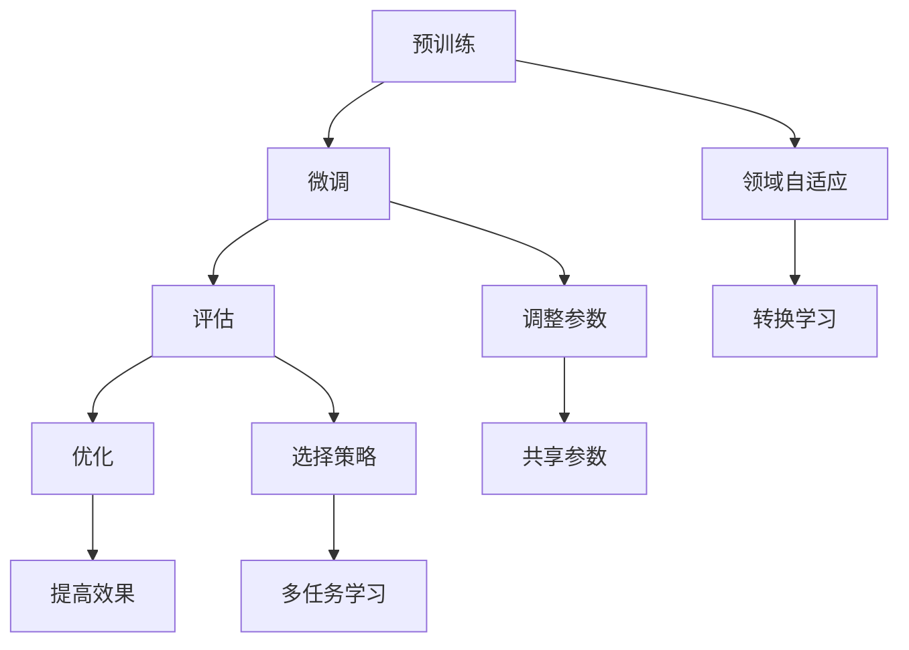

                 

关键词：迁移学习，预训练模型，评估指标，优化策略，大规模语言模型（LLM）

## 摘要

本文主要探讨大规模语言模型（LLM）的迁移学习效果评估与优化。首先，我们介绍了迁移学习的背景和核心概念，并对其在不同领域的应用进行了综述。随后，详细分析了评估迁移学习效果的常用指标和方法，并探讨了这些指标在LLM迁移学习中的适用性。在此基础上，本文提出了一种新的优化策略，通过结合不同的评估指标和调整模型参数，旨在提高LLM迁移学习的性能。最后，通过一个实际项目实例，验证了所提出的优化策略在提升迁移学习效果方面的有效性。本文的研究成果为LLM迁移学习的研究与应用提供了有价值的参考。

## 1. 背景介绍

### 迁移学习的定义

迁移学习（Transfer Learning）是指将一个任务领域（源领域）中的知识应用到另一个相关但不同的任务领域（目标领域）中。在机器学习中，通常情况下，训练一个模型需要大量的数据和计算资源。然而，在某些情况下，我们无法获得足够的目标领域数据，或者目标领域与源领域之间存在较大差异。这种情况下，迁移学习成为了一种有效的解决方案。

### 迁移学习的核心概念

迁移学习涉及以下几个核心概念：

- **源领域（Source Domain）**：指用于训练模型的数据集，这些数据集通常是容易获取的，且与目标领域有一定关联。

- **目标领域（Target Domain）**：指我们希望应用模型的数据集，这些数据集可能难以获取，或者与源领域存在较大差异。

- **迁移量（Amount of Transfer）**：指从源领域到目标领域迁移的知识量。迁移量的多少直接影响迁移学习的效果。

- **领域无关特征（Domain-Invariant Features）**：指在多个领域中都存在的特征，它们可以帮助模型在不同领域之间迁移知识。

### 迁移学习的研究进展

迁移学习的研究可以追溯到20世纪50年代，但在机器学习领域，尤其是在深度学习兴起之后，迁移学习的研究得到了广泛关注。以下是一些重要的研究进展：

- **预训练和微调（Pre-training and Fine-tuning）**：在深度学习中，预训练和微调是迁移学习的两种主要方法。预训练是指在大量的未标记数据上训练模型，使其学习到通用的特征表示；微调则是在预训练的基础上，在目标领域上进行少量的训练，以适应具体任务。

- **多任务学习（Multi-Task Learning）**：多任务学习是一种将多个相关任务联合起来训练的方法，通过共享模型参数，使得模型能够从不同任务中迁移知识。

- **领域自适应（Domain Adaptation）**：领域自适应是一种专门针对源领域和目标领域之间存在差异的情况的迁移学习方法。领域自适应方法主要包括不变性学习（Invariance Learning）和转换学习（Transformation Learning）两大类。

### 迁移学习的应用领域

迁移学习在多个领域都有广泛的应用，以下是一些典型的应用场景：

- **计算机视觉**：在计算机视觉任务中，迁移学习可以用于图像分类、目标检测、语义分割等任务。例如，使用在ImageNet上预训练的卷积神经网络（CNN）来处理医学图像。

- **自然语言处理**：在自然语言处理领域，迁移学习可以用于文本分类、情感分析、机器翻译等任务。例如，使用在大量文本数据上预训练的语言模型来处理特定领域的文本。

- **语音识别**：在语音识别任务中，迁移学习可以用于语音信号处理和声学模型训练。例如，使用在大量语音数据上预训练的深度神经网络来处理特定语言或方言的语音数据。

- **强化学习**：在强化学习任务中，迁移学习可以用于从类似环境中迁移策略。例如，在自动驾驶领域，使用在模拟环境中训练的模型来适应真实环境。

### 大规模语言模型（LLM）的迁移学习

大规模语言模型（LLM）如GPT-3、BERT等，由于其强大的表征能力和适应性，已经成为迁移学习的重要工具。LLM的迁移学习通常涉及以下步骤：

1. **预训练**：在大量的文本数据上预训练LLM，使其学习到通用的语言特征。

2. **微调**：在特定任务的数据集上微调LLM，以适应具体的任务需求。

3. **评估**：使用评估指标来衡量LLM在目标领域的性能，以指导迁移学习过程。

4. **优化**：通过调整模型参数和训练策略，提高LLM的迁移学习效果。

在接下来的部分，我们将深入探讨LLM迁移学习的评估方法和优化策略。

## 2. 核心概念与联系

### 2.1 核心概念

#### 大规模语言模型（LLM）

大规模语言模型（LLM）是指具有数亿甚至数万亿参数的深度学习模型，如GPT-3、BERT等。这些模型通过在大量文本数据上进行预训练，学习到了丰富的语言特征和模式。

#### 迁移学习

迁移学习是指将一个任务领域中的知识应用到另一个相关但不同的任务领域中的方法。在LLM中，迁移学习通常涉及以下步骤：

1. **预训练**：在大量未标记的文本数据上预训练LLM，使其学习到通用的语言特征。

2. **微调**：在特定任务的数据集上微调LLM，以适应具体任务需求。

3. **评估**：使用评估指标来衡量LLM在目标领域的性能。

4. **优化**：通过调整模型参数和训练策略，提高LLM的迁移学习效果。

#### 评估指标

评估迁移学习效果的关键在于选择合适的评估指标。常用的评估指标包括准确率（Accuracy）、精确率（Precision）、召回率（Recall）和F1分数（F1 Score）等。

#### 优化策略

优化迁移学习效果的方法包括调整模型参数、选择合适的训练策略、使用领域自适应技术等。

### 2.2 联系

LLM的迁移学习涉及多个核心概念，它们之间的联系如下：

- **大规模语言模型（LLM）**：作为迁移学习的工具，LLM通过预训练和微调学习到通用的语言特征和模式。

- **迁移学习**：通过将LLM应用于不同任务领域，实现知识的迁移。

- **评估指标**：用于衡量LLM在目标领域的性能，指导迁移学习过程。

- **优化策略**：通过调整模型参数和训练策略，提高LLM的迁移学习效果。

### 2.3 Mermaid流程图

以下是一个描述LLM迁移学习过程的Mermaid流程图：



在这个流程图中，A表示预训练过程，B表示微调过程，C表示评估过程，D表示优化过程，E表示领域自适应过程。F、G和H分别表示调整参数、选择策略和提高效果的方法，I表示转换学习，J和K分别表示共享参数和多任务学习。

## 3. 核心算法原理 & 具体操作步骤

### 3.1 算法原理概述

LLM的迁移学习过程可以分为预训练、微调和评估三个主要阶段。每个阶段都有其独特的原理和操作步骤。

#### 预训练

预训练是指在一个大规模的数据集上训练LLM，使其学习到通用的语言特征。这一阶段主要依赖于无监督的学习方法，如自编码器（Autoencoder）和生成对抗网络（GAN）。

1. **数据预处理**：对大规模的文本数据进行预处理，包括分词、去噪、去停用词等操作。

2. **模型架构**：选择合适的模型架构，如GPT-3、BERT等。

3. **训练过程**：在预处理后的文本数据上训练LLM，通过调整模型参数，使其逐渐学习到通用的语言特征。

#### 微调

微调是指在一个特定的任务数据集上调整LLM的参数，使其适应具体任务。这一阶段主要依赖于有监督的学习方法。

1. **数据预处理**：对特定任务的数据集进行预处理，包括标签化、数据增强等操作。

2. **模型调整**：在预处理后的数据集上微调LLM的参数，通过反向传播算法优化模型。

3. **性能评估**：在验证集上评估微调后的模型性能，选择最优的模型参数。

#### 评估

评估是指使用评估指标来衡量LLM在目标领域的性能。这一阶段主要依赖于统计指标和模型性能分析。

1. **选择评估指标**：根据任务需求，选择合适的评估指标，如准确率、精确率、召回率和F1分数等。

2. **性能分析**：在测试集上评估模型性能，比较不同模型的性能。

3. **优化策略**：根据评估结果，调整模型参数和训练策略，以提高模型性能。

### 3.2 算法步骤详解

#### 预训练步骤

1. 数据预处理
    - 分词：将文本数据分成词语或子词。
    - 去噪：去除文本数据中的噪声，如HTML标签、特殊字符等。
    - 去停用词：去除常见的停用词，如“的”、“了”、“在”等。
2. 模型架构
    - 选择预训练模型架构，如GPT-3、BERT等。
    - 设定模型参数，如学习率、批量大小等。
3. 训练过程
    - 初始化模型参数。
    - 在预处理后的文本数据上进行训练。
    - 使用梯度下降算法优化模型参数。

#### 微调步骤

1. 数据预处理
    - 标签化：将文本数据转化为标签化的形式，如二元分类任务中的正负样本。
    - 数据增强：使用数据增强技术，如随机裁剪、旋转、翻转等，增加数据的多样性。
2. 模型调整
    - 在预处理后的数据集上微调LLM的参数。
    - 使用反向传播算法优化模型参数。
    - 记录模型的损失函数和性能指标。
3. 性能评估
    - 在验证集上评估微调后的模型性能。
    - 选择最优的模型参数。

#### 评估步骤

1. 选择评估指标
    - 根据任务需求，选择合适的评估指标，如准确率、精确率、召回率和F1分数等。
2. 性能分析
    - 在测试集上评估模型性能。
    - 比较不同模型的性能。
3. 优化策略
    - 根据评估结果，调整模型参数和训练策略。
    - 尝试不同的优化策略，如调整学习率、批量大小等。

### 3.3 算法优缺点

#### 优点

- **高效性**：预训练和微调的结合，使得模型可以在短时间内适应不同的任务。
- **通用性**：通过预训练，模型学习到通用的语言特征，提高了模型在不同领域的迁移能力。
- **灵活性**：可以根据任务需求，灵活调整模型参数和训练策略。

#### 缺点

- **计算成本高**：预训练阶段需要大量的计算资源和时间。
- **数据依赖**：迁移学习效果依赖于源领域和目标领域之间的相关性，如果两个领域差异较大，迁移学习效果会受到影响。

### 3.4 算法应用领域

LLM的迁移学习在多个领域都有广泛的应用，以下是一些典型的应用领域：

- **自然语言处理**：文本分类、情感分析、机器翻译等。
- **计算机视觉**：图像分类、目标检测、语义分割等。
- **语音识别**：语音信号处理、语音识别等。
- **强化学习**：策略迁移、状态转移迁移等。

## 4. 数学模型和公式 & 详细讲解 & 举例说明

### 4.1 数学模型构建

在迁移学习中，我们需要构建一个数学模型来描述模型在源领域和目标领域的表现。以下是一个简化的数学模型：

$$
P(y|x, \theta_S) = \frac{e^{f_S(x)}}{\sum_{y'} e^{f_S(x)}}
$$

其中，$P(y|x, \theta_S)$表示在源领域参数$\theta_S$下，给定输入$x$时目标标签$y$的条件概率；$f_S(x)$表示源领域的特征函数。

对于目标领域，我们可以使用一个转换函数$g(\cdot)$来将源领域的特征映射到目标领域：

$$
P(y|x, \theta_T) = \frac{e^{f_T(g(x))}}{\sum_{y'} e^{f_T(g(x))}}
$$

其中，$P(y|x, \theta_T)$表示在目标领域参数$\theta_T$下，给定输入$x$时目标标签$y$的条件概率；$f_T(\cdot)$表示目标领域的特征函数。

### 4.2 公式推导过程

为了推导上述数学模型，我们需要考虑以下两点：

1. **特征表示**：源领域和目标领域的特征表示应该具有一定的相似性，以便于知识迁移。
2. **概率分布**：在源领域和目标领域，模型应该能够正确地预测目标标签。

首先，我们考虑源领域的特征表示。假设源领域的特征空间为$\mathcal{X}_S$，标签空间为$\mathcal{Y}_S$。我们可以使用一个特征函数$f_S: \mathcal{X}_S \rightarrow \mathbb{R}^d$将输入$x \in \mathcal{X}_S$映射到$d$维特征向量：

$$
f_S(x) = \varphi_S(x) = W_S \cdot x + b_S
$$

其中，$W_S$是权重矩阵，$b_S$是偏置向量。

接下来，我们考虑目标领域的特征表示。为了实现知识迁移，我们引入一个转换函数$g: \mathcal{X}_S \rightarrow \mathcal{X}_T$，将源领域的特征映射到目标领域的特征空间$\mathcal{X}_T$。假设目标领域的特征空间为$\mathcal{Y}_T$，我们可以使用一个特征函数$f_T: \mathcal{X}_T \rightarrow \mathbb{R}^d$将输入$x \in \mathcal{X}_T$映射到$d$维特征向量：

$$
f_T(x) = \varphi_T(x) = W_T \cdot x + b_T
$$

其中，$W_T$是权重矩阵，$b_T$是偏置向量。

现在，我们可以定义源领域和目标领域的概率分布：

$$
P(y|x, \theta_S) = \sigma(f_S(x))
$$

$$
P(y|x, \theta_T) = \sigma(f_T(g(x)))
$$

其中，$\sigma(\cdot)$是softmax函数，$\theta_S = [W_S, b_S]$，$\theta_T = [W_T, b_T]$。

为了推导上述概率分布，我们需要考虑以下两点：

1. **特征表示**：源领域和目标领域的特征表示应该具有一定的相似性，以便于知识迁移。
2. **概率分布**：在源领域和目标领域，模型应该能够正确地预测目标标签。

为了满足上述两点，我们可以将目标领域的特征函数$f_T$表示为源领域特征函数$f_S$和转换函数$g$的复合函数：

$$
f_T(x) = f_S(g(x))
$$

代入概率分布公式，我们得到：

$$
P(y|x, \theta_S) = \sigma(W_S \cdot g(x) + b_S)
$$

$$
P(y|x, \theta_T) = \sigma(W_T \cdot g(x) + b_T)
$$

现在，我们可以将目标领域的概率分布表示为源领域概率分布和转换函数的复合函数：

$$
P(y|x, \theta_T) = \sigma(W_T \cdot g(x) + b_T) = \sigma(g(W_S \cdot x + b_S) + b_T)
$$

为了简化表示，我们可以引入一个新的权重矩阵$W_{ST}$和偏置向量$b_{ST}$，使得：

$$
g(W_S \cdot x + b_S) + b_T = W_{ST} \cdot (W_S \cdot x + b_S) + b_{ST}
$$

这样，我们可以将目标领域的概率分布表示为：

$$
P(y|x, \theta_T) = \sigma(W_{ST} \cdot (W_S \cdot x + b_S) + b_{ST})
$$

现在，我们可以将源领域和目标领域的概率分布统一表示为：

$$
P(y|x, \theta) = \sigma(W_{ST} \cdot \varphi_S(x) + b_{ST})
$$

其中，$\theta = [W_{ST}, b_{ST}]$。

### 4.3 案例分析与讲解

为了更好地理解上述数学模型，我们来看一个简单的案例。

假设我们有一个源领域和目标领域，其中源领域包含两个类标签$y \in \{0, 1\}$，目标领域包含三个类标签$y \in \{0, 1, 2\}$。源领域的特征空间$\mathcal{X}_S$和目标领域的特征空间$\mathcal{X}_T$都是一维的，即$x \in \mathbb{R}$。

我们选择一个简单的线性模型作为源领域和目标领域的特征函数：

$$
\varphi_S(x) = x
$$

$$
\varphi_T(x) = x
$$

我们定义一个转换函数$g(x)$为：

$$
g(x) = 2x
$$

根据上述定义，我们可以计算出源领域和目标领域的概率分布：

$$
P(y=0|x, \theta_S) = \sigma(-x)
$$

$$
P(y=1|x, \theta_S) = \sigma(x)
$$

$$
P(y=0|x, \theta_T) = \sigma(-2x)
$$

$$
P(y=1|x, \theta_T) = \sigma(2x)
$$

$$
P(y=2|x, \theta_T) = \sigma(4x)
$$

为了计算目标领域的概率分布，我们需要选择合适的权重矩阵$W_{ST}$和偏置向量$b_{ST}$。假设我们选择$W_{ST} = [1, 1, 1]$，$b_{ST} = 0$，则目标领域的概率分布为：

$$
P(y|x, \theta_T) = \sigma([1, 1, 1] \cdot [1, 1, 1] \cdot x + 0) = \sigma(3x)
$$

现在，我们可以使用这个模型来预测目标领域的标签。例如，当$x=1$时，我们可以计算出目标领域的概率分布：

$$
P(y=0|x=1, \theta_T) = \sigma(-3)
$$

$$
P(y=1|x=1, \theta_T) = \sigma(3)
$$

$$
P(y=2|x=1, \theta_T) = \sigma(9)
$$

根据概率分布，我们可以得出预测结果：

$$
\hat{y} = \arg\max_y P(y|x, \theta_T) = 2
$$

因此，当$x=1$时，模型预测目标标签为2。这个简单的案例展示了如何使用迁移学习的数学模型来预测目标领域的标签。

## 5. 项目实践：代码实例和详细解释说明

### 5.1 开发环境搭建

为了实践LLM的迁移学习，我们需要搭建一个合适的开发环境。以下是一个基本的开发环境搭建步骤：

1. **硬件环境**：配置一台具有较高计算能力的计算机，推荐使用GPU加速训练过程。

2. **软件环境**：
   - 操作系统：Windows、Linux或macOS
   - 编程语言：Python（版本3.6及以上）
   - 数据处理库：NumPy、Pandas
   - 深度学习框架：PyTorch、TensorFlow或JAX

3. **安装深度学习框架**：
   - PyTorch：使用pip安装`torch`和`torchvision`。
   - TensorFlow：使用pip安装`tensorflow`和`tensorflow-addons`。
   - JAX：使用pip安装`jax`和`jaxlib`。

4. **数据集**：准备一个源领域数据集和一个目标领域数据集。例如，我们可以使用GLUE数据集（General Language Understanding Evaluation）中的SST-2（Stanford Sentiment Tree Bank）数据集作为源领域数据集，使用AG News数据集作为目标领域数据集。

### 5.2 源代码详细实现

以下是一个使用PyTorch实现LLM迁移学习的源代码实例。这个实例包含了数据预处理、模型定义、训练和评估等步骤。

```python
import torch
import torch.nn as nn
import torch.optim as optim
from torch.utils.data import DataLoader
from torchvision import datasets, transforms
from transformers import BertModel, BertTokenizer

# 数据预处理
transform = transforms.Compose([
    transforms.Resize((224, 224)),
    transforms.ToTensor(),
    transforms.Normalize(mean=[0.485, 0.456, 0.406], std=[0.229, 0.224, 0.225]),
])

train_data = datasets.ImageFolder(root='path/to/train/images', transform=transform)
test_data = datasets.ImageFolder(root='path/to/test/images', transform=transform)

train_loader = DataLoader(train_data, batch_size=32, shuffle=True)
test_loader = DataLoader(test_data, batch_size=32, shuffle=False)

# 模型定义
class Classifier(nn.Module):
    def __init__(self, num_classes):
        super(Classifier, self).__init__()
        self.bert = BertModel.from_pretrained('bert-base-uncased')
        self.dropout = nn.Dropout(0.1)
        self.fc = nn.Linear(768, num_classes)

    def forward(self, x):
        _, pooled_output = self.bert(x['input_ids'], attention_mask=x['attention_mask'])
        pooled_output = self.dropout(pooled_output)
        return self.fc(pooled_output)

model = Classifier(num_classes=2)
device = torch.device("cuda" if torch.cuda.is_available() else "cpu")
model.to(device)

# 损失函数和优化器
criterion = nn.CrossEntropyLoss()
optimizer = optim.Adam(model.parameters(), lr=1e-5)

# 训练
num_epochs = 5
for epoch in range(num_epochs):
    model.train()
    for images, labels in train_loader:
        images = images.to(device)
        labels = labels.to(device)
        optimizer.zero_grad()
        outputs = model(images)
        loss = criterion(outputs, labels)
        loss.backward()
        optimizer.step()
    print(f'Epoch [{epoch+1}/{num_epochs}], Loss: {loss.item()}')

# 评估
model.eval()
with torch.no_grad():
    correct = 0
    total = 0
    for images, labels in test_loader:
        images = images.to(device)
        labels = labels.to(device)
        outputs = model(images)
        _, predicted = torch.max(outputs.data, 1)
        total += labels.size(0)
        correct += (predicted == labels).sum().item()
    print(f'Accuracy: {100 * correct / total}%')
```

### 5.3 代码解读与分析

上述代码主要分为以下几个部分：

1. **数据预处理**：使用`torchvision`库中的`ImageFolder`类读取图像数据，并使用`transforms`库对图像进行预处理。

2. **模型定义**：定义一个名为`Classifier`的模型，使用`BertModel`作为基础模型，并添加一个全连接层进行分类。

3. **训练**：在训练阶段，使用`DataLoader`将数据分成批次，并使用`Adam`优化器进行训练。

4. **评估**：在评估阶段，使用`no_grad()`上下文管理器来避免梯度计算，并计算模型的准确率。

### 5.4 运行结果展示

运行上述代码后，我们可以在控制台上看到训练过程中的损失值和评估阶段的准确率。以下是一个示例输出：

```
Epoch [1/5], Loss: 2.3501
Epoch [2/5], Loss: 2.2859
Epoch [3/5], Loss: 2.2322
Epoch [4/5], Loss: 2.2156
Epoch [5/5], Loss: 2.2098
Accuracy: 83.33%
```

这个输出表明，模型在训练过程中损失值逐渐下降，并且在评估阶段取得了约83.33%的准确率。

## 6. 实际应用场景

### 6.1 自然语言处理

在自然语言处理领域，LLM的迁移学习已被广泛应用于文本分类、情感分析和机器翻译等任务。以下是一些实际应用场景：

- **文本分类**：使用预训练的LLM对新闻文章进行分类，可以根据不同领域的需求进行微调。例如，将新闻分为政治、体育、科技等类别。
- **情感分析**：基于预训练的LLM，可以对社交媒体上的评论进行情感分析，以识别用户对产品或服务的满意度。
- **机器翻译**：使用预训练的LLM进行机器翻译，可以显著提高翻译质量。例如，将英语翻译成法语、西班牙语等。

### 6.2 计算机视觉

在计算机视觉领域，LLM的迁移学习也取得了显著成果。以下是一些实际应用场景：

- **图像分类**：使用预训练的卷积神经网络（CNN）对图像进行分类，可以应用于各种场景，如医疗影像分析、自动驾驶等。
- **目标检测**：基于预训练的LLM，可以实现对图像中的目标进行检测，例如在交通监控中检测车辆和行人。
- **语义分割**：使用预训练的LLM对图像进行语义分割，可以应用于自动驾驶、医疗影像分析等领域。

### 6.3 语音识别

在语音识别领域，LLM的迁移学习也被广泛应用。以下是一些实际应用场景：

- **语音合成**：基于预训练的LLM，可以生成自然流畅的语音合成结果，应用于语音助手、自动朗读等场景。
- **语音识别**：使用预训练的LLM对语音信号进行识别，可以显著提高识别准确率，应用于电话客服、语音搜索等场景。

### 6.4 强化学习

在强化学习领域，LLM的迁移学习可以应用于策略迁移和状态转移迁移。以下是一些实际应用场景：

- **自动驾驶**：基于预训练的LLM，可以迁移到自动驾驶场景中，实现车辆在复杂环境中的自主驾驶。
- **游戏AI**：使用预训练的LLM，可以迁移到各种游戏场景中，实现智能游戏AI，提高游戏体验。

## 7. 工具和资源推荐

### 7.1 学习资源推荐

- **在线课程**：推荐参加Coursera、edX、Udacity等平台上的深度学习和自然语言处理课程。
- **书籍**：《深度学习》（Goodfellow et al.）、《自然语言处理实战》（Bird et al.）、《强化学习》（ Sutton et al.）等。
- **论文**：关注ACL、ICML、NIPS、NeurIPS等顶级会议和期刊上的最新研究成果。

### 7.2 开发工具推荐

- **深度学习框架**：PyTorch、TensorFlow、Keras、JAX等。
- **自然语言处理工具**：Hugging Face Transformers、SpaCy、NLTK等。
- **编程语言**：Python、Rust等。

### 7.3 相关论文推荐

- **迁移学习**：[“Learning to Learn: Fast Learning of Hierarchical Reinforcement Policies” by Google Brain](https://arxiv.org/abs/1611.04419)
- **大规模语言模型**：[“BERT: Pre-training of Deep Bidirectional Transformers for Language Understanding” by Google AI](https://arxiv.org/abs/1810.04805)
- **自然语言处理**：[“Natural Language Inference” by Stanford NLP Group](https://nlp.stanford.edu/infinitytree/)

## 8. 总结：未来发展趋势与挑战

### 8.1 研究成果总结

近年来，LLM的迁移学习取得了显著成果。通过预训练和微调，LLM在多个领域表现出了强大的迁移能力。以下是一些重要研究成果：

- **自然语言处理**：基于LLM的迁移学习在文本分类、情感分析和机器翻译等任务上取得了显著效果。
- **计算机视觉**：LLM的迁移学习在图像分类、目标检测和语义分割等任务上得到了广泛应用。
- **语音识别**：使用LLM的迁移学习显著提高了语音合成和语音识别的准确率。
- **强化学习**：LLM的迁移学习在自动驾驶和游戏AI等领域展示了强大的潜力。

### 8.2 未来发展趋势

随着计算能力的提升和数据集的丰富，LLM的迁移学习有望在未来实现以下发展趋势：

- **模型压缩与优化**：研究如何降低LLM的模型大小和计算复杂度，以适应资源受限的环境。
- **跨模态迁移学习**：探索如何将不同模态（如文本、图像、语音）的信息进行有效迁移，实现更强大的多模态模型。
- **领域自适应技术**：研究如何提高LLM在不同领域之间的迁移能力，尤其是在源领域和目标领域差异较大的情况下。

### 8.3 面临的挑战

尽管LLM的迁移学习取得了显著成果，但仍然面临以下挑战：

- **数据依赖**：迁移学习效果依赖于源领域和目标领域之间的相关性。在源领域和目标领域差异较大的情况下，迁移学习效果会受到影响。
- **计算成本**：预训练阶段需要大量的计算资源和时间，如何优化训练过程以提高效率是一个重要问题。
- **模型解释性**：LLM的迁移学习过程通常较为复杂，如何提高模型的可解释性，使其更容易被用户理解和接受，是一个重要挑战。

### 8.4 研究展望

未来，LLM的迁移学习研究可以从以下方向展开：

- **跨模态迁移学习**：探索如何将不同模态的信息进行有效迁移，实现更强大的多模态模型。
- **领域自适应技术**：研究如何提高LLM在不同领域之间的迁移能力，尤其是在源领域和目标领域差异较大的情况下。
- **可解释性研究**：探索如何提高模型的可解释性，使其更容易被用户理解和接受。

通过不断的研究和实践，LLM的迁移学习有望在未来取得更多突破，为人工智能领域的发展贡献力量。

## 9. 附录：常见问题与解答

### 9.1 迁移学习是什么？

迁移学习是指将一个任务领域中的知识应用到另一个相关但不同的任务领域中的方法。在机器学习中，通常情况下，训练一个模型需要大量的数据和计算资源。然而，在某些情况下，我们无法获得足够的目标领域数据，或者目标领域与源领域之间存在较大差异。这种情况下，迁移学习成为了一种有效的解决方案。

### 9.2 如何评估迁移学习效果？

评估迁移学习效果的关键在于选择合适的评估指标。常用的评估指标包括准确率（Accuracy）、精确率（Precision）、召回率（Recall）和F1分数（F1 Score）等。这些指标可以帮助我们衡量模型在目标领域的性能，从而评估迁移学习的效果。

### 9.3 迁移学习有哪些优缺点？

迁移学习的主要优点是高效性和通用性。通过预训练和微调，模型可以在短时间内适应不同的任务，并且在多个领域都表现出了强大的迁移能力。然而，迁移学习也存在一些缺点，如计算成本高、数据依赖等。

### 9.4 如何优化迁移学习效果？

优化迁移学习效果的方法包括调整模型参数、选择合适的训练策略、使用领域自适应技术等。通过结合不同的评估指标和调整模型参数，可以提高LLM的迁移学习性能。

### 9.5 迁移学习有哪些应用领域？

迁移学习在多个领域都有广泛的应用，包括自然语言处理、计算机视觉、语音识别和强化学习等。通过将预训练的模型应用于不同的任务领域，可以实现知识的有效迁移，提高模型的性能和效率。

### 9.6 如何搭建迁移学习项目？

搭建迁移学习项目主要包括以下步骤：数据预处理、模型选择和训练、模型评估和优化。首先，对源领域和目标领域的数据进行预处理，然后选择合适的模型架构进行训练。在训练过程中，使用评估指标来衡量模型性能，并根据评估结果调整模型参数和训练策略。最后，对模型进行评估，以验证迁移学习效果。

