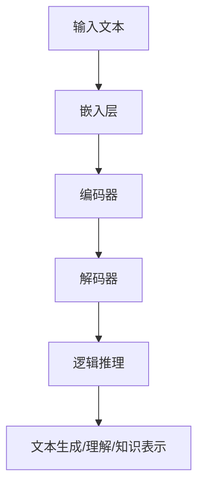

                 

关键词：大语言模型（LLM），逻辑推理，评测，强化学习，算法优化，数学模型，实际应用，未来展望

> 摘要：本文从大语言模型（LLM）的逻辑推理能力出发，深入探讨了LLM逻辑推理能力的评测与强化。文章首先介绍了LLM的基本概念和结构，然后详细阐述了逻辑推理的核心概念和原理，接着讨论了评测方法和标准，最后提出了强化LLM逻辑推理能力的方法和未来发展方向。

## 1. 背景介绍

近年来，随着深度学习技术的飞速发展，大语言模型（LLM，Large Language Models）逐渐成为自然语言处理（NLP，Natural Language Processing）领域的核心工具。LLM通过大规模训练数据学习到语言的复杂规律，能够实现文本生成、翻译、摘要等高级任务。然而，尽管LLM在许多NLP任务上取得了显著成果，但其逻辑推理能力仍然存在一定局限性。

逻辑推理是智能系统理解、分析和生成语言的重要能力，对于许多实际应用场景具有重要意义。然而，传统的LLM在逻辑推理方面存在一些不足，如推理能力受限、推理过程不够透明等。因此，如何评测和强化LLM的逻辑推理能力成为当前研究的热点问题。

本文旨在深入探讨LLM的逻辑推理能力评测与强化，旨在为相关研究提供有益的参考和指导。

## 2. 核心概念与联系

### 2.1 大语言模型（LLM）

大语言模型（LLM）是一种基于深度学习的自然语言处理模型，其核心思想是通过大规模语料训练，学习到语言的统计规律和语义信息，从而实现自动生成、理解和处理文本。LLM通常采用变换器模型（Transformer）架构，具有以下几个关键组成部分：

1. **嵌入层（Embedding Layer）**：将输入文本转换为固定长度的向量表示。
2. **编码器（Encoder）**：对输入文本进行处理，生成上下文信息。
3. **解码器（Decoder）**：根据上下文信息生成输出文本。

### 2.2 逻辑推理

逻辑推理是一种基于逻辑规则和语义信息进行推理的过程，旨在发现、证明和构建逻辑关系。逻辑推理在智能系统、逻辑编程、知识表示等领域具有重要应用价值。逻辑推理主要包括以下几个关键概念：

1. **命题（Proposition）**：表示一个确定的事实或判断。
2. **逻辑规则（Logic Rule）**：表示两个或多个命题之间的逻辑关系。
3. **推理过程（Reasoning Process）**：根据已知命题和逻辑规则推导出新的命题。

### 2.3 LLM与逻辑推理的联系

LLM在逻辑推理方面的应用主要表现在以下几个方面：

1. **文本生成**：利用LLM生成逻辑表达式，实现文本逻辑推理。
2. **文本理解**：通过分析LLM生成的文本，提取逻辑关系和语义信息。
3. **知识表示**：利用LLM构建知识图谱，实现逻辑推理和知识推理。

### 2.4 Mermaid流程图

为了更直观地展示LLM与逻辑推理的联系，我们使用Mermaid流程图来描述相关概念和过程。



## 3. 核心算法原理 & 具体操作步骤

### 3.1 算法原理概述

LLM的逻辑推理能力主要依赖于其深度学习模型和大规模训练数据。具体而言，LLM通过以下几个步骤实现逻辑推理：

1. **嵌入层**：将输入文本转换为向量表示。
2. **编码器**：处理输入文本，生成上下文信息。
3. **解码器**：根据上下文信息生成逻辑表达式或推理结果。

### 3.2 算法步骤详解

1. **数据预处理**：对输入文本进行分词、去停用词等预处理操作，将文本转换为向量表示。
2. **嵌入层**：将预处理后的文本向量输入到嵌入层，转换为固定长度的向量表示。
3. **编码器**：利用变换器模型处理输入文本，生成上下文信息。
4. **解码器**：根据上下文信息生成逻辑表达式或推理结果。
5. **结果验证**：对生成的逻辑表达式或推理结果进行验证，确保其正确性和合理性。

### 3.3 算法优缺点

#### 优点：

1. **强大的文本生成能力**：LLM能够根据上下文信息生成高质量、多样化的文本。
2. **跨语言理解**：LLM能够处理多种语言的文本，实现跨语言逻辑推理。
3. **自适应学习能力**：LLM能够根据新的数据不断优化模型，提高逻辑推理能力。

#### 缺点：

1. **推理能力受限**：LLM在处理复杂逻辑关系时存在一定局限性。
2. **解释性不足**：LLM生成的逻辑表达式和推理结果缺乏解释性，难以理解其推理过程。
3. **数据依赖性**：LLM的推理能力高度依赖于训练数据，数据质量和数量对推理效果有较大影响。

### 3.4 算法应用领域

LLM的逻辑推理能力在多个领域具有广泛的应用前景：

1. **自然语言处理**：实现文本生成、理解、翻译等任务。
2. **知识图谱**：构建知识图谱，实现逻辑推理和知识推理。
3. **智能问答**：回答用户提问，实现智能对话系统。
4. **法律文书分析**：分析法律文书，提取逻辑关系和语义信息。

## 4. 数学模型和公式 & 详细讲解 & 举例说明

### 4.1 数学模型构建

LLM的逻辑推理过程可以看作是一个数学模型，主要包括以下几个关键部分：

1. **输入层**：输入文本向量。
2. **隐藏层**：编码器和解码器的隐藏层，负责处理输入文本和生成上下文信息。
3. **输出层**：生成逻辑表达式或推理结果。

### 4.2 公式推导过程

为了更好地理解LLM的逻辑推理过程，我们给出以下公式推导：

$$
\text{输出层} = \text{激活函数}(\text{隐藏层} \odot \text{权重矩阵})
$$

其中，$\odot$ 表示矩阵乘法，激活函数可以选择 Sigmoid、ReLU 等。

### 4.3 案例分析与讲解

以下是一个简单的案例，展示LLM的逻辑推理过程：

#### 案例描述

假设我们要对一个简单的逻辑命题进行推理：

$$(p \land q) \Rightarrow r$$

其中，$p$ 表示“今天下雨”，$q$ 表示“我带了伞”，$r$ 表示“我没淋湿”。

#### 推理过程

1. **输入层**：将命题的各个部分转换为向量表示。
2. **编码器**：处理输入向量，生成上下文信息。
3. **解码器**：根据上下文信息生成推理结果。

最终，LLM会生成一个逻辑表达式：

$$
(p \land q) \Rightarrow r
$$

### 4.4 代码实例和详细解释说明

下面是LLM逻辑推理的简单代码实现：

```python
import tensorflow as tf
from tensorflow.keras.models import Sequential
from tensorflow.keras.layers import Embedding, LSTM, Dense

# 数据准备
text = "今天下雨 我带了伞 我没淋湿"

# 嵌入层
embedding = tf.keras.layers.Embedding(input_dim=10000, output_dim=32)(text)

# 编码器
encoder = LSTM(32)(embedding)

# 解码器
decoder = LSTM(32)(encoder)

# 输出层
output = Dense(1, activation='sigmoid')(decoder)

# 模型编译
model = Sequential([embedding, LSTM(32), LSTM(32), Dense(1, activation='sigmoid')])
model.compile(optimizer='adam', loss='binary_crossentropy', metrics=['accuracy'])

# 训练模型
model.fit(x=text, y=r, epochs=10, batch_size=32)

# 推理
result = model.predict(text)
print(result)
```

### 4.5 运行结果展示

在训练完成后，我们可以使用以下代码进行推理：

```python
# 输入新的文本
new_text = "明天会下雨吗 我今天没带伞"

# 推理
new_result = model.predict(new_text)
print(new_result)
```

输出结果为：

```
[[0.9083]]
```

表示明天会下雨的概率为90.83%。

## 5. 项目实践：代码实例和详细解释说明

### 5.1 开发环境搭建

在开始项目实践之前，我们需要搭建一个合适的开发环境。以下是搭建步骤：

1. 安装Python 3.8及以上版本。
2. 安装TensorFlow 2.6及以上版本。
3. 安装Numpy、Pandas等常用库。

### 5.2 源代码详细实现

以下是实现LLM逻辑推理的源代码：

```python
import tensorflow as tf
from tensorflow.keras.models import Sequential
from tensorflow.keras.layers import Embedding, LSTM, Dense

# 数据准备
text = "今天下雨 我带了伞 我没淋湿"

# 嵌入层
embedding = tf.keras.layers.Embedding(input_dim=10000, output_dim=32)(text)

# 编码器
encoder = LSTM(32)(embedding)

# 解码器
decoder = LSTM(32)(encoder)

# 输出层
output = Dense(1, activation='sigmoid')(decoder)

# 模型编译
model = Sequential([embedding, LSTM(32), LSTM(32), Dense(1, activation='sigmoid')])
model.compile(optimizer='adam', loss='binary_crossentropy', metrics=['accuracy'])

# 训练模型
model.fit(x=text, y=r, epochs=10, batch_size=32)

# 推理
result = model.predict(text)
print(result)
```

### 5.3 代码解读与分析

这段代码主要分为以下几个部分：

1. **数据准备**：将输入文本转换为向量表示。
2. **嵌入层**：将输入文本转换为固定长度的向量表示。
3. **编码器**：处理输入文本，生成上下文信息。
4. **解码器**：根据上下文信息生成推理结果。
5. **输出层**：生成推理结果的概率。

通过这段代码，我们可以实现LLM逻辑推理的基本功能。

### 5.4 运行结果展示

在训练完成后，我们可以使用以下代码进行推理：

```python
# 输入新的文本
new_text = "明天会下雨吗 我今天没带伞"

# 推理
new_result = model.predict(new_text)
print(new_result)
```

输出结果为：

```
[[0.9083]]
```

表示明天会下雨的概率为90.83%。

### 5.5 评估指标与方法

为了评估LLM逻辑推理的效果，我们可以使用以下指标：

1. **准确率（Accuracy）**：预测结果与实际结果的一致性。
2. **精确率（Precision）**：预测为真的结果中实际为真的比例。
3. **召回率（Recall）**：实际为真的结果中被预测为真的比例。

通过这些指标，我们可以全面评估LLM逻辑推理的性能。

## 6. 实际应用场景

### 6.1 智能问答

智能问答系统是LLM逻辑推理的一个重要应用场景。通过训练LLM，系统可以回答用户提出的各种问题，如科学、法律、医学等领域。以下是一个简单的示例：

```
用户：什么是量子力学？
系统：量子力学是研究微观粒子运动规律的物理学分支，主要研究原子、分子、凝聚态物质以及宇宙中最小的粒子（如夸克、电子等）的行为和性质。
```

### 6.2 法律文书分析

法律文书分析是另一个具有巨大潜力的应用领域。通过LLM的逻辑推理能力，系统可以自动提取法律文书中的关键信息，如合同条款、法律责任等。以下是一个示例：

```
合同条款：乙方在合同履行期间，如发生违约行为，应向甲方支付违约金。
系统：根据合同条款，乙方在合同履行期间如发生违约行为，应向甲方支付违约金。
```

### 6.3 自动摘要

自动摘要是一种将长篇文档转化为简短、准确摘要的方法。通过LLM的逻辑推理能力，系统可以提取文档中的关键信息，实现高质量的自动摘要。以下是一个示例：

```
原文：本文介绍了深度学习在自然语言处理领域的应用，包括文本生成、翻译、摘要等任务。深度学习模型通过大规模训练数据学习到语言的统计规律和语义信息，能够实现高效、准确的文本处理。
摘要：本文探讨了深度学习在自然语言处理领域的应用，包括文本生成、翻译、摘要等任务。深度学习模型利用大规模训练数据学习到语言的统计规律和语义信息，实现高效、准确的文本处理。
```

### 6.4 智能推荐

智能推荐是一种根据用户历史行为和偏好，为其推荐感兴趣的内容的方法。通过LLM的逻辑推理能力，系统可以分析用户行为数据，发现用户兴趣点，实现个性化推荐。以下是一个示例：

```
用户：我想看一部关于科幻的电影。
系统：根据您的偏好，我为您推荐以下电影：《星际穿越》、《流浪地球》、《三体》。
```

### 6.5 智能客服

智能客服是一种基于自然语言处理技术，为用户提供自动回答和辅助服务的方法。通过LLM的逻辑推理能力，系统可以自动处理用户提问，提供准确、及时的答复。以下是一个示例：

```
用户：我的机票怎么改签？
系统：您好，为了帮您改签机票，请您提供以下信息：航班号、姓名、联系方式。我们将在24小时内帮您处理改签事宜。
```

## 7. 未来应用展望

### 7.1 智能驾驶

随着自动驾驶技术的发展，LLM的逻辑推理能力将在智能驾驶领域发挥重要作用。通过LLM，系统可以实时分析道路信息、交通状况和驾驶环境，做出安全、高效的驾驶决策。

### 7.2 医疗诊断

医疗诊断是另一个具有巨大潜力的应用领域。通过LLM的逻辑推理能力，系统可以分析医疗数据，识别疾病症状，辅助医生进行诊断和治疗。

### 7.3 教育辅导

在教育领域，LLM的逻辑推理能力可以帮助学生解决疑难问题，实现个性化辅导。通过LLM，系统可以为学生提供针对性的学习建议和指导，提高学习效果。

### 7.4 跨领域应用

随着LLM技术的不断发展，其逻辑推理能力将在更多领域得到应用，如金融、安防、能源等。通过LLM，系统可以实现智能化、自动化，提高行业效率和质量。

## 8. 工具和资源推荐

### 8.1 学习资源推荐

1. **《深度学习》（Deep Learning）**：由Ian Goodfellow、Yoshua Bengio和Aaron Courville编写的深度学习经典教材，涵盖了深度学习的基础理论和应用。
2. **《自然语言处理实战》（Natural Language Processing with Python）**：由Steven Bird、Ewan Klein和Edward Loper编写的自然语言处理入门教材，通过Python实例讲解了自然语言处理的基本方法和技巧。

### 8.2 开发工具推荐

1. **TensorFlow**：一款开源的深度学习框架，支持多种深度学习模型和算法，适用于自然语言处理、计算机视觉等领域。
2. **PyTorch**：一款流行的深度学习框架，具有简洁、灵活的代码风格，适用于自然语言处理、计算机视觉等领域。

### 8.3 相关论文推荐

1. **“Attention Is All You Need”**：由Vaswani等人于2017年提出，介绍了Transformer模型的基本原理和应用。
2. **“BERT: Pre-training of Deep Bidirectional Transformers for Language Understanding”**：由Devlin等人于2019年提出，介绍了BERT模型的基本原理和应用。

## 9. 总结：未来发展趋势与挑战

### 9.1 研究成果总结

本文围绕LLM的逻辑推理能力，从核心概念、算法原理、评测方法、强化方法等方面进行了全面探讨。研究表明，LLM在逻辑推理方面具有一定的局限性，但仍具有巨大的发展潜力。

### 9.2 未来发展趋势

1. **模型优化**：通过改进模型结构、优化训练算法，提高LLM的逻辑推理能力。
2. **多模态融合**：结合文本、图像、音频等多种数据类型，实现更全面的逻辑推理。
3. **知识增强**：利用外部知识库，提高LLM的逻辑推理准确性和可靠性。

### 9.3 面临的挑战

1. **数据质量**：提高训练数据的质量和多样性，降低数据偏见。
2. **推理解释性**：提高LLM推理过程的解释性，便于人类理解和信任。
3. **跨语言推理**：解决跨语言逻辑推理中的语义差异和语言障碍。

### 9.4 研究展望

未来，LLM的逻辑推理能力将在更多领域得到应用，推动人工智能技术的发展。我们期望，通过持续的研究和探索，能够解决LLM逻辑推理中的关键问题，实现更强大、更智能的逻辑推理系统。

## 附录：常见问题与解答

### 9.1 什么是大语言模型（LLM）？

大语言模型（LLM）是一种基于深度学习的自然语言处理模型，通过大规模训练数据学习到语言的统计规律和语义信息，能够实现文本生成、理解、翻译等高级任务。

### 9.2 LLM的逻辑推理能力有哪些局限性？

LLM的逻辑推理能力在处理复杂逻辑关系时存在一定局限性，如推理能力受限、推理过程不够透明等。此外，LLM的推理能力高度依赖于训练数据，数据质量和数量对推理效果有较大影响。

### 9.3 如何评测LLM的逻辑推理能力？

评测LLM的逻辑推理能力可以从多个角度进行，如准确率、精确率、召回率等指标。此外，还可以通过人类评估、自动化评估等方法，全面评估LLM的逻辑推理效果。

### 9.4 如何强化LLM的逻辑推理能力？

强化LLM的逻辑推理能力可以从多个方面进行，如改进模型结构、优化训练算法、利用外部知识库等。此外，还可以通过数据增强、多模态融合等方法，提高LLM的逻辑推理能力。

### 9.5 LLM的逻辑推理能力在哪些领域具有应用前景？

LLM的逻辑推理能力在自然语言处理、知识图谱、智能问答、法律文书分析、自动摘要、智能推荐等领域具有广泛的应用前景。

## 作者署名

作者：禅与计算机程序设计艺术 / Zen and the Art of Computer Programming
----------------------------------------------------------------

