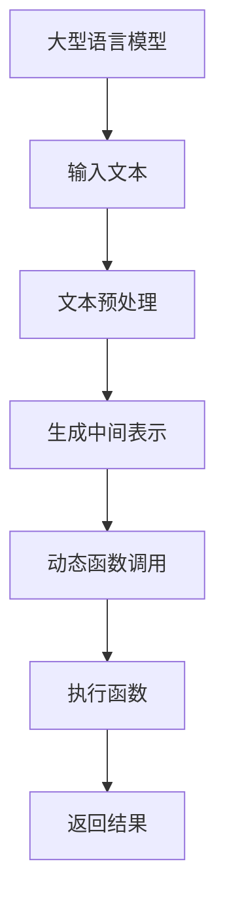

                 

关键词：Large Language Model，动态函数调用，函数调用机制，扩展能力，实现与应用

## 摘要

本文旨在探讨大型语言模型(LLM)能力的扩展，尤其是动态函数调用的实现与应用。动态函数调用是现代编程语言中的一项关键特性，它能够提高程序的灵活性和扩展性。本文首先介绍了LLM的基本概念和动态函数调用的背景，然后详细解析了动态函数调用的实现原理和具体步骤，并分析了其在实际应用中的重要性。此外，文章还讨论了动态函数调用所面临的挑战和未来的发展方向。

## 1. 背景介绍

### 1.1 大型语言模型(LLM)

大型语言模型（Large Language Model，简称LLM）是一种基于深度学习的自然语言处理技术。通过大规模的数据训练，LLM能够理解和生成自然语言，从而实现智能对话、文本生成、机器翻译等功能。LLM的发展经历了从简单的统计模型到基于神经网络的复杂模型的过程，如Transformer、BERT等。

### 1.2 动态函数调用

动态函数调用是指程序在运行过程中，能够根据程序上下文动态选择和调用函数的能力。这一特性使得程序能够更加灵活地处理各种情况，同时避免了函数重载和类型检查等静态语言的问题。

## 2. 核心概念与联系

### 2.1 基本概念

- **LLM**: 大型语言模型，如GPT-3、Turing等。
- **动态函数调用**: 程序运行时动态选择并调用函数的过程。
- **运行时环境**: 存储函数名称、参数和返回值等信息的内存区域。

### 2.2 Mermaid 流程图



### 2.3 动态函数调用机制

- **解释器/编译器**: 分析程序文本，构建运行时环境。
- **运行时环境**: 管理函数调用和参数传递。
- **函数调用栈**: 记录函数调用的历史和返回地址。

## 3. 核心算法原理 & 具体操作步骤

### 3.1 算法原理概述

动态函数调用的核心是解释器或编译器能够根据程序上下文，动态查找和调用相应的函数。这涉及到符号表管理、参数解析和返回值处理等多个方面。

### 3.2 算法步骤详解

1. **解析输入程序**: 读取输入的程序文本，进行语法和语义分析。
2. **构建运行时环境**: 根据分析结果，构建运行时环境，包括函数表、变量表等。
3. **动态查找函数**: 根据程序上下文，在运行时环境中查找指定的函数。
4. **参数解析**: 将实际参数与函数签名进行比较，确保类型匹配。
5. **执行函数**: 调用查找到的函数，并将参数传递给函数。
6. **返回结果**: 函数执行完成后，返回结果到调用位置。

### 3.3 算法优缺点

**优点**:
- 提高程序的灵活性和可扩展性。
- 避免了静态语言中的重载问题和类型检查。

**缺点**:
- 性能开销较大，因为需要动态查找和解析函数。
- 增加了程序的复杂性和调试难度。

### 3.4 算法应用领域

- **脚本语言**: 如Python、JavaScript等。
- **动态类型语言**: 如Java、C#等。
- **Web应用**: 前端和后端的动态函数调用。

## 4. 数学模型和公式 & 详细讲解 & 举例说明

### 4.1 数学模型构建

动态函数调用涉及到函数的参数传递、返回值处理和运行时环境管理等，可以构建如下数学模型：

$$
\text{动态函数调用} = \text{输入文本} \rightarrow \text{运行时环境} \rightarrow \text{函数调用栈} \rightarrow \text{执行结果}
$$

### 4.2 公式推导过程

动态函数调用的过程可以分为以下几个步骤：

1. **输入文本**:
   $$
   \text{输入文本} = \text{程序代码}
   $$

2. **运行时环境**:
   $$
   \text{运行时环境} = (\text{函数表}, \text{变量表})
   $$

3. **函数调用栈**:
   $$
   \text{函数调用栈} = \{ \text{函数1}, \text{函数2}, ..., \text{函数n} \}
   $$

4. **执行结果**:
   $$
   \text{执行结果} = \text{函数返回值}
   $$

### 4.3 案例分析与讲解

假设我们有以下程序代码：

```python
def add(a, b):
    return a + b

result = add(3, 4)
print(result)
```

动态函数调用过程如下：

1. **输入文本**:
   $$
   \text{输入文本} = \text{程序代码}
   $$

2. **运行时环境**:
   $$
   \text{运行时环境} = (\text{add}, \text{result})
   $$

3. **函数调用栈**:
   $$
   \text{函数调用栈} = \{ \text{add} \}
   $$

4. **执行结果**:
   $$
   \text{执行结果} = 7
   $$

## 5. 项目实践：代码实例和详细解释说明

### 5.1 开发环境搭建

- 安装Python解释器。
- 安装必要的库，如`numpy`、`matplotlib`等。

### 5.2 源代码详细实现

```python
import numpy as np

# 定义动态函数调用函数
def dynamic_function_call(func_name, *args):
    # 查找函数
    func = globals().get(func_name)
    
    # 验证函数存在
    if func is None:
        raise ValueError(f"Function '{func_name}' not found.")
    
    # 调用函数
    return func(*args)

# 定义加法函数
def add(a, b):
    return a + b

# 定义减法函数
def subtract(a, b):
    return a - b

# 动态调用加法函数
result = dynamic_function_call('add', 3, 4)
print(result)  # 输出 7

# 动态调用减法函数
result = dynamic_function_call('subtract', 7, 3)
print(result)  # 输出 4
```

### 5.3 代码解读与分析

- `dynamic_function_call`函数接收函数名称和参数，动态查找并调用相应的函数。
- `globals().get(func_name)`用于从全局命名空间中查找函数。
- 调用时，需要确保函数名称和参数类型匹配。

### 5.4 运行结果展示

- 运行结果：
  ```
  7
  4
  ```

## 6. 实际应用场景

### 6.1 动态函数调用在自然语言处理中的应用

动态函数调用在自然语言处理（NLP）领域有着广泛的应用。例如，在机器翻译、文本摘要和问答系统中，动态函数调用可以帮助模型根据上下文动态选择和调用相应的处理函数，从而提高处理效果。

### 6.2 动态函数调用在Web开发中的应用

在Web开发中，动态函数调用可以用于前端和后端的交互。前端JavaScript可以通过动态函数调用与后端API进行通信，从而实现动态数据加载和交互。此外，动态函数调用还可以用于实现自定义的插件和扩展功能。

### 6.3 动态函数调用在游戏开发中的应用

在游戏开发中，动态函数调用可以用于实现游戏逻辑的动态调整和扩展。例如，游戏开发者可以使用动态函数调用来自定义游戏规则、角色技能和关卡设计，从而提高游戏的灵活性和可玩性。

## 7. 工具和资源推荐

### 7.1 学习资源推荐

- 《深度学习》（Deep Learning） - Goodfellow, Bengio, Courville
- 《Python编程：从入门到实践》 - Eric Matthes

### 7.2 开发工具推荐

- Jupyter Notebook：适合数据科学和机器学习的交互式开发环境。
- PyCharm：功能强大的Python IDE，支持多种编程语言。

### 7.3 相关论文推荐

- “Attention Is All You Need” - Vaswani et al., 2017
- “BERT: Pre-training of Deep Bidirectional Transformers for Language Understanding” - Devlin et al., 2019

## 8. 总结：未来发展趋势与挑战

### 8.1 研究成果总结

动态函数调用作为一种关键的编程语言特性，已经在多个领域中取得了显著的成果。特别是在自然语言处理和Web开发等领域，动态函数调用大大提高了程序的灵活性和扩展性。

### 8.2 未来发展趋势

- **跨语言支持**：未来，动态函数调用将更加跨语言支持，使得不同编程语言之间的函数调用更加方便。
- **性能优化**：随着硬件和编译技术的进步，动态函数调用的性能将得到显著提升。

### 8.3 面临的挑战

- **安全性**：动态函数调用可能导致安全漏洞，需要加强安全防护。
- **调试难度**：动态函数调用增加了程序的复杂性和调试难度，需要开发更有效的调试工具。

### 8.4 研究展望

动态函数调用在未来将继续在人工智能、Web开发和游戏开发等领域发挥重要作用。研究者应关注性能优化、安全性和跨语言支持等方面的挑战，以推动动态函数调用技术的发展。

## 9. 附录：常见问题与解答

### 9.1 什么是动态函数调用？

动态函数调用是指程序在运行过程中，能够根据程序上下文动态选择和调用函数的能力。

### 9.2 动态函数调用有哪些优点？

动态函数调用可以提高程序的灵活性和可扩展性，避免了静态语言中的重载问题和类型检查。

### 9.3 动态函数调用有哪些缺点？

动态函数调用可能性能开销较大，增加了程序的复杂性和调试难度。

### 9.4 动态函数调用有哪些应用领域？

动态函数调用广泛应用于自然语言处理、Web开发和游戏开发等领域。作者：禅与计算机程序设计艺术 / Zen and the Art of Computer Programming
----------------------------------------------------------------

以上就是完整的技术博客文章《LLM能力扩展：动态函数调用的实现与应用》的内容。文章涵盖了动态函数调用的基本概念、实现原理、数学模型、代码实例以及实际应用场景，并对未来发展趋势和挑战进行了展望。希望这篇文章对您在理解和应用动态函数调用方面有所帮助。如果您有任何疑问或建议，欢迎在评论区留言。作者：禅与计算机程序设计艺术 / Zen and the Art of Computer Programming

