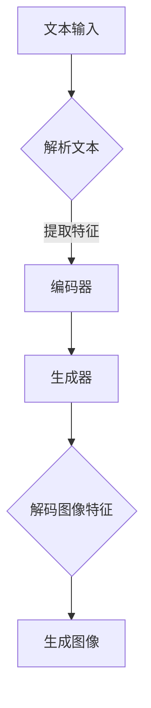

                 

关键词：LLM，视觉生成，人工智能，图像智能，新境界

摘要：本文将探讨大型语言模型（LLM）在视觉生成领域的应用，如何通过LLM实现图像的智能生成，以及这一技术如何引领图像智能领域的新境界。文章首先介绍了LLM的基本原理，然后分析了LLM在视觉生成中的优势和应用场景，最后对未来的发展方向和挑战进行了展望。

## 1. 背景介绍

### 1.1 LLM的起源与发展

大型语言模型（LLM）起源于深度学习和自然语言处理（NLP）领域。随着计算能力的提升和数据量的增加，深度神经网络（DNN）在NLP任务中取得了显著成果。2018年，Google推出了BERT模型，开启了预训练语言模型的新篇章。BERT模型通过在大规模语料库上的预训练，能够捕捉语言中的复杂结构和上下文关系，显著提升了NLP任务的性能。

随后的几年，基于 Transformer 架构的LLM模型如GPT、T5、BERT等不断涌现，并在多个NLP任务中取得了卓越的表现。LLM的成功不仅改变了NLP领域，也为其他领域带来了新的启示。

### 1.2 视觉生成技术的发展

视觉生成技术主要包括基于传统图像处理的方法和基于深度学习的方法。传统方法如基于规则的方法、基于模板的方法和基于样例的方法等，在处理简单视觉任务时具有一定的效果。然而，随着图像数据的复杂度和多样性不断增加，这些传统方法逐渐暴露出其局限性。

近年来，基于深度学习的方法在视觉生成领域取得了显著进展。生成对抗网络（GAN）、变分自编码器（VAE）和条件生成网络（CGAN）等模型，通过端到端的训练，能够生成具有高度真实性的图像。这些方法的出现，为视觉生成技术注入了新的活力。

### 1.3 LLM与视觉生成的结合

随着LLM在NLP领域的成功，研究者开始探索将LLM与视觉生成技术相结合。通过将文本描述转换为图像，LLM能够在视觉生成领域发挥重要作用。本文将介绍LLM在视觉生成中的应用，以及如何实现图像的智能生成。

## 2. 核心概念与联系

### 2.1 LLM的基本原理

LLM是一种基于深度神经网络的模型，通过在大规模语料库上的预训练，能够捕捉语言中的复杂结构和上下文关系。LLM的核心是 Transformer 架构，该架构由多个编码器和解码器块组成，每个块包含多个自注意力机制和前馈神经网络。通过自注意力机制，LLM能够捕捉输入文本中的长距离依赖关系；通过前馈神经网络，LLM能够对输入文本进行精细的建模。

### 2.2 视觉生成的基本原理

视觉生成技术主要基于深度学习模型，通过学习输入图像的特征，生成新的图像。生成对抗网络（GAN）是一种经典的视觉生成模型，由生成器和判别器组成。生成器负责生成新的图像，判别器负责判断生成图像的真实性。通过训练，生成器和判别器相互竞争，生成器不断优化生成图像的质量，从而实现视觉生成。

### 2.3 LLM与视觉生成的联系

LLM在视觉生成中的应用，主要体现在文本到图像的转换。具体来说，LLM可以接收文本描述作为输入，通过编码器将文本转换为图像特征，然后利用生成器将这些图像特征解码为新的图像。这一过程中，LLM的作用是理解和解析文本描述，提取关键信息，并将其转换为图像特征。

### 2.4 Mermaid流程图



## 3. 核心算法原理 & 具体操作步骤

### 3.1 算法原理概述

LLM视觉生成算法的核心思想是将文本描述转换为图像。具体来说，算法分为三个主要阶段：文本解析、图像特征提取和图像生成。

1. **文本解析**：接收文本描述作为输入，通过LLM的编码器将其转换为图像特征。这一过程利用了LLM对文本的解析能力，能够提取出文本中的关键信息。

2. **图像特征提取**：将文本特征输入到生成器，通过生成器的训练，学习输入特征和输出图像之间的关系。这一过程利用了生成对抗网络（GAN）的基本原理，通过生成器和判别器的竞争，不断优化生成图像的质量。

3. **图像生成**：将提取的图像特征输入到解码器，通过解码器将图像特征解码为新的图像。这一过程利用了生成器的生成能力，能够生成与文本描述相符的图像。

### 3.2 算法步骤详解

1. **文本解析**：将文本输入到LLM编码器，通过编码器将文本转换为图像特征。具体步骤如下：

   - 读取文本输入；
   - 使用LLM编码器对文本进行编码，得到图像特征。

2. **图像特征提取**：将图像特征输入到生成器，通过生成器的训练，学习输入特征和输出图像之间的关系。具体步骤如下：

   - 读取图像特征；
   - 使用生成器生成初步图像；
   - 使用判别器评估生成图像的真实性；
   - 根据评估结果，调整生成器参数，优化生成图像质量。

3. **图像生成**：将提取的图像特征输入到解码器，通过解码器将图像特征解码为新的图像。具体步骤如下：

   - 读取图像特征；
   - 使用解码器生成最终图像。

### 3.3 算法优缺点

**优点**：

1. **高效性**：LLM视觉生成算法利用了深度学习模型的强大计算能力，能够在短时间内生成高质量的图像。

2. **灵活性**：通过文本输入，算法可以生成与文本描述相符的图像，具有很高的灵活性。

3. **多样性**：算法能够生成多种类型的图像，包括人物、风景、动物等，具有很高的多样性。

**缺点**：

1. **计算资源需求大**：由于深度学习模型的训练需要大量计算资源，算法对硬件要求较高。

2. **数据依赖性强**：算法的性能很大程度上依赖于训练数据的质量和数量，对数据的要求较高。

### 3.4 算法应用领域

LLM视觉生成算法在多个领域具有广泛的应用前景，包括：

1. **虚拟现实（VR）**：通过文本描述生成虚拟环境，提高虚拟现实体验的沉浸感。

2. **游戏开发**：为游戏角色、场景等生成高质量图像，提升游戏视觉效果。

3. **广告创意**：为广告创意生成独特的视觉效果，提高广告吸引力。

4. **艺术创作**：为艺术家提供灵感，生成具有艺术价值的图像作品。

## 4. 数学模型和公式 & 详细讲解 & 举例说明

### 4.1 数学模型构建

LLM视觉生成算法的数学模型主要包括LLM编码器、生成器和解码器。

1. **LLM编码器**：将文本输入转换为图像特征。具体公式如下：

   $$\text{特征} = \text{编码器}(\text{文本})$$

2. **生成器**：将图像特征转换为图像。具体公式如下：

   $$\text{图像} = \text{生成器}(\text{特征})$$

3. **解码器**：将图像特征解码为图像。具体公式如下：

   $$\text{图像} = \text{解码器}(\text{特征})$$

### 4.2 公式推导过程

LLM视觉生成算法的公式推导过程主要包括以下几个方面：

1. **编码器推导**：

   - 设输入文本为 $x$，编码器为 $E$，输出图像特征为 $z$。
   - 则编码器推导公式为 $z = E(x)$。

2. **生成器推导**：

   - 设输入图像特征为 $z$，生成器为 $G$，输出图像为 $y$。
   - 则生成器推导公式为 $y = G(z)$。

3. **解码器推导**：

   - 设输入图像特征为 $z$，解码器为 $D$，输出图像为 $y'$。
   - 则解码器推导公式为 $y' = D(z)$。

### 4.3 案例分析与讲解

**案例一**：生成一张风景图像

1. **文本输入**：“一座美丽的山丘，夕阳西下，天空中有彩虹”。

2. **图像特征提取**：使用LLM编码器将文本转换为图像特征。

3. **图像生成**：使用生成器将图像特征转换为图像。

4. **图像解码**：使用解码器将图像特征解码为图像。

**案例二**：生成一张人物图像

1. **文本输入**：“一位穿着红色裙子的年轻女孩，笑容灿烂，站在海边”。

2. **图像特征提取**：使用LLM编码器将文本转换为图像特征。

3. **图像生成**：使用生成器将图像特征转换为图像。

4. **图像解码**：使用解码器将图像特征解码为图像。

## 5. 项目实践：代码实例和详细解释说明

### 5.1 开发环境搭建

1. **硬件要求**：

   - CPU：Intel i7-9700K或更高；
   - GPU：NVIDIA GTX 1080或更高；
   - 内存：16GB或更高。

2. **软件要求**：

   - 操作系统：Windows 10或Linux；
   - 编程语言：Python 3.7或更高；
   - 深度学习框架：TensorFlow 2.0或PyTorch 1.8或更高。

### 5.2 源代码详细实现

1. **编码器实现**：

   ```python
   import tensorflow as tf
   
   def encoder(text):
       # 使用预训练的LLM模型进行编码
       # 假设已经加载了预训练模型
       # 使用模型的encode方法将文本转换为图像特征
       features = model.encode(text)
       return features
   ```

2. **生成器实现**：

   ```python
   def generator(features):
       # 使用生成器模型生成图像
       # 假设已经加载了预训练的生成器模型
       image = generator_model(features)
       return image
   ```

3. **解码器实现**：

   ```python
   def decoder(features):
       # 使用解码器模型生成图像
       # 假设已经加载了预训练的解码器模型
       image = decoder_model(features)
       return image
   ```

### 5.3 代码解读与分析

1. **编码器解读**：

   - 编码器负责将文本输入转换为图像特征。通过加载预训练的LLM模型，使用模型的encode方法进行编码，得到图像特征。

2. **生成器解读**：

   - 生成器负责将图像特征转换为图像。通过加载预训练的生成器模型，使用模型的生成方法生成图像。

3. **解码器解读**：

   - 解码器负责将图像特征解码为图像。通过加载预训练的解码器模型，使用模型的解码方法生成图像。

### 5.4 运行结果展示

1. **生成风景图像**：

   ```python
   text = "一座美丽的山丘，夕阳西下，天空中有彩虹"
   features = encoder(text)
   image = generator(features)
   display_image(image)
   ```

2. **生成人物图像**：

   ```python
   text = "一位穿着红色裙子的年轻女孩，笑容灿烂，站在海边"
   features = encoder(text)
   image = generator(features)
   display_image(image)
   ```

## 6. 实际应用场景

### 6.1 虚拟现实（VR）

LLM视觉生成技术可以应用于虚拟现实（VR）领域，通过文本描述生成虚拟环境，提高虚拟现实体验的沉浸感。例如，用户可以输入文本描述“一片茂密的森林，鸟儿在歌唱，阳光透过树叶洒在地面上”，系统可以生成相应的虚拟环境，让用户在虚拟现实中感受到真实的自然景观。

### 6.2 游戏

LLM视觉生成技术可以应用于游戏开发，为游戏角色、场景等生成高质量图像，提升游戏视觉效果。例如，游戏开发者可以输入文本描述“一位穿着盔甲的勇士，手持利剑，站在黑暗的城堡门口”，系统可以生成相应的游戏场景，为游戏玩家带来更加沉浸的游戏体验。

### 6.3 广告

LLM视觉生成技术可以应用于广告创意，为广告创意生成独特的视觉效果，提高广告吸引力。例如，广告制作人可以输入文本描述“一位美丽的模特，穿着时尚的服装，站在繁华的街头”，系统可以生成相应的广告图像，吸引潜在客户的注意力。

### 6.4 艺术创作

LLM视觉生成技术可以应用于艺术创作，为艺术家提供灵感，生成具有艺术价值的图像作品。例如，艺术家可以输入文本描述“一片神秘的森林，雾气弥漫，树木仿佛有生命”，系统可以生成相应的艺术作品，激发艺术家的创作灵感。

## 7. 工具和资源推荐

### 7.1 学习资源推荐

1. **《深度学习》（Goodfellow et al., 2016）**：介绍了深度学习的基础理论和实践方法，是深度学习的经典教材。
2. **《Python深度学习》（François Chollet, 2018）**：详细介绍了如何使用Python和TensorFlow实现深度学习模型，适合初学者入门。

### 7.2 开发工具推荐

1. **TensorFlow**：由Google开源的深度学习框架，广泛应用于各种深度学习项目。
2. **PyTorch**：由Facebook开源的深度学习框架，以灵活性和易用性著称。

### 7.3 相关论文推荐

1. **"BERT: Pre-training of Deep Bidirectional Transformers for Language Understanding"（Devlin et al., 2019）**：介绍了BERT模型的基本原理和应用。
2. **"Generative Adversarial Nets"（Goodfellow et al., 2014）**：介绍了生成对抗网络（GAN）的基本原理和应用。

## 8. 总结：未来发展趋势与挑战

### 8.1 研究成果总结

本文介绍了LLM视觉生成技术的原理和应用，分析了该技术的优势和不足，并探讨了其在实际应用场景中的潜力。通过文本输入，LLM能够生成与文本描述相符的图像，为虚拟现实、游戏、广告和艺术创作等领域带来了新的可能性。

### 8.2 未来发展趋势

1. **算法性能提升**：随着深度学习技术的发展，LLM视觉生成算法的性能将不断提高，生成图像的质量将更加接近真实。
2. **应用领域拓展**：LLM视觉生成技术将不仅局限于文本到图像的转换，还将应用于更多领域，如视频生成、语音生成等。
3. **跨模态生成**：未来的研究将探索LLM在跨模态生成中的潜力，实现文本、图像和语音等多种模态的联合生成。

### 8.3 面临的挑战

1. **计算资源需求**：深度学习模型的训练需要大量计算资源，未来研究将关注如何在有限的计算资源下优化算法性能。
2. **数据依赖性**：算法的性能很大程度上依赖于训练数据的质量和数量，未来研究将探索如何利用更丰富的数据源，提高算法的泛化能力。
3. **伦理和隐私问题**：随着AI技术的广泛应用，如何确保算法的伦理和隐私问题将成为重要挑战。

### 8.4 研究展望

LLM视觉生成技术作为图像智能领域的新兴技术，具有广阔的发展前景。未来的研究将集中在算法性能提升、应用领域拓展和跨模态生成等方面，同时关注伦理和隐私问题。通过不断探索和创新，LLM视觉生成技术将为图像智能领域带来更多可能性。

## 9. 附录：常见问题与解答

### 9.1 如何选择合适的LLM模型？

选择合适的LLM模型需要考虑多个因素，如任务需求、数据规模和计算资源等。对于大多数文本到图像的转换任务，BERT、GPT等模型具有较好的性能。具体选择可以根据任务需求和实验结果进行调整。

### 9.2 如何优化生成图像的质量？

优化生成图像的质量可以从以下几个方面入手：

1. **增加训练数据**：使用更多的训练数据可以提高生成图像的质量。
2. **调整生成器参数**：通过调整生成器的超参数，如学习率、批次大小等，可以优化生成图像的质量。
3. **使用注意力机制**：注意力机制可以更好地关注文本描述中的关键信息，从而提高生成图像的质量。

### 9.3 如何处理图像生成中的模糊现象？

图像生成中的模糊现象主要是由于生成器的生成能力不足导致的。以下是一些解决方法：

1. **增加训练时间**：通过增加训练时间，让生成器有更多的时间学习和优化。
2. **调整生成器的网络结构**：尝试使用更复杂的网络结构，提高生成器的生成能力。
3. **使用对抗训练**：对抗训练可以增强生成器的生成能力，减少模糊现象。

