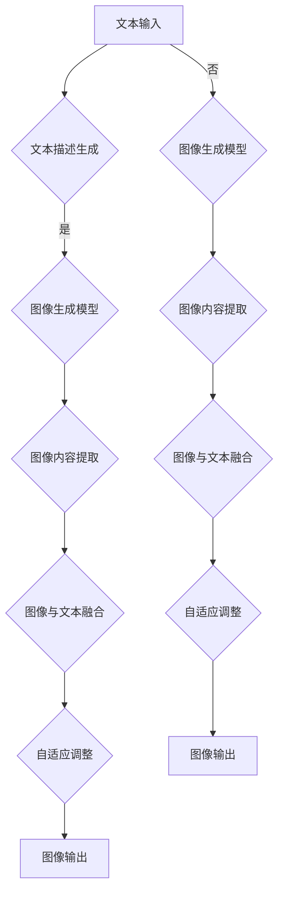

                 

关键词：自然语言处理，视觉生成，大型语言模型，图像智能，深度学习，计算机视觉

> 摘要：本文深入探讨了大型语言模型（LLM）在图像生成领域的应用。通过结合自然语言处理（NLP）和计算机视觉（CV）的技术，LLM视觉生成技术为图像智能带来了新的发展高度。本文首先介绍了LLM视觉生成的基本概念和原理，然后详细阐述了核心算法原理与操作步骤，并进行了数学模型和公式的推导。接着，文章通过实际项目实践展示了代码实现，并分析了LLM视觉生成在实际应用场景中的表现。最后，文章提出了未来应用展望，并总结了当前的研究成果、发展趋势与挑战，以期为读者提供一幅关于LLM视觉生成技术的全貌。

## 1. 背景介绍

随着互联网和计算机技术的飞速发展，图像生成技术在许多领域都取得了显著的应用成果。从传统的图像处理技术到现代的深度学习算法，图像生成技术经历了多次变革。然而，传统图像生成方法主要依赖于手工设计的特征和规则，无法充分利用大量的图像数据和复杂的图像结构。随着自然语言处理（NLP）和计算机视觉（CV）技术的不断进步，图像生成技术迎来了新的发展机遇。

近年来，大型语言模型（LLM）的出现为图像生成技术注入了新的活力。LLM是一种基于深度学习的自然语言处理模型，具有强大的文本生成和理解能力。将LLM与图像生成技术相结合，可以充分利用文本和图像之间的关联性，实现更智能、更高效的图像生成。

### 1.1 图像生成技术的历史与发展

图像生成技术的发展可以追溯到20世纪90年代。当时，基于规则的方法和生成模型是主要的图像生成技术。这些方法通过手工设计特征和规则，对图像进行建模和生成。虽然这些方法在一定程度上取得了成功，但它们存在许多局限性。

进入21世纪，随着计算机性能的不断提高和深度学习技术的兴起，图像生成技术发生了重大变革。基于深度学习的生成模型，如生成对抗网络（GAN）和变分自编码器（VAE），成为了图像生成领域的主流方法。这些模型通过学习图像数据的分布，实现了更加逼真和多样化的图像生成。

### 1.2 自然语言处理与计算机视觉的结合

自然语言处理（NLP）和计算机视觉（CV）是两个具有重要应用前景的领域。NLP技术旨在理解和生成自然语言，而CV技术旨在理解和生成图像。将这两个领域结合起来，可以充分利用文本和图像之间的关联性，实现更智能的图像生成。

近年来，随着深度学习技术的发展，NLP和CV领域的结合取得了显著成果。例如，视觉语言预训练模型（ViT）和视觉文本预训练模型（VTV）的出现，使得文本和图像之间的关联性得到了更好的挖掘。这些模型通过在大量文本和图像数据上进行预训练，获得了强大的文本生成和理解能力。

### 1.3 LLM视觉生成技术的发展

LLM视觉生成技术是近年来兴起的一种新型图像生成方法。它将大型语言模型与图像生成技术相结合，通过利用文本和图像之间的关联性，实现更智能、更高效的图像生成。

LLM视觉生成技术的主要特点包括：

1. **文本驱动的生成**：LLM视觉生成技术通过文本描述来驱动图像生成，从而实现更灵活和多样的图像生成。
2. **跨模态学习**：LLM视觉生成技术通过跨模态学习，将文本和图像信息进行深度融合，从而提高图像生成的质量和效果。
3. **自适应调整**：LLM视觉生成技术可以根据不同的文本描述和生成任务，进行自适应调整，从而实现更精细和个性化的图像生成。

## 2. 核心概念与联系

### 2.1 核心概念

LLM视觉生成技术涉及多个核心概念，包括：

1. **大型语言模型（LLM）**：LLM是一种基于深度学习的自然语言处理模型，具有强大的文本生成和理解能力。
2. **图像生成模型**：图像生成模型是一种基于深度学习的模型，用于生成逼真的图像。
3. **文本生成模型**：文本生成模型是一种基于深度学习的模型，用于生成文本描述。

### 2.2 关联性分析

LLM视觉生成技术通过以下方式实现文本和图像之间的关联性：

1. **文本描述生成**：LLM视觉生成技术通过文本描述来驱动图像生成，从而实现文本和图像的关联。
2. **图像内容提取**：图像生成模型从图像中提取关键内容，并与LLM生成的文本描述进行融合，从而实现图像和文本的关联。
3. **自适应调整**：LLM视觉生成技术可以根据不同的文本描述和生成任务，进行自适应调整，从而实现文本和图像的关联性优化。

### 2.3 Mermaid 流程图

以下是LLM视觉生成技术的Mermaid流程图：



## 3. 核心算法原理 & 具体操作步骤

### 3.1 算法原理概述

LLM视觉生成技术基于深度学习和自然语言处理技术，其核心思想是将文本描述与图像生成模型相结合，通过文本驱动图像生成，从而实现更智能、更高效的图像生成。

具体来说，LLM视觉生成技术包括以下几个关键步骤：

1. **文本描述生成**：通过大型语言模型（LLM）生成与图像内容相关的文本描述。
2. **图像生成模型**：利用深度学习模型生成逼真的图像。
3. **图像内容提取**：从图像中提取关键内容，并与LLM生成的文本描述进行融合。
4. **图像与文本融合**：将提取的图像内容与LLM生成的文本描述进行融合，生成最终的图像。
5. **自适应调整**：根据不同的文本描述和生成任务，对图像生成模型进行自适应调整，以提高图像生成的质量和效果。

### 3.2 算法步骤详解

#### 3.2.1 文本描述生成

文本描述生成是LLM视觉生成技术的第一步。通过大型语言模型（LLM），如GPT-3，生成与图像内容相关的文本描述。这一过程可以看作是文本生成模型的输出，具体步骤如下：

1. **输入预处理**：对图像进行预处理，如去噪、缩放等，以便于文本生成模型处理。
2. **文本生成**：利用LLM生成与图像内容相关的文本描述。这一过程可以通过以下步骤实现：
   - **文本编码**：将图像转换为文本编码，以便于LLM处理。
   - **文本生成**：利用LLM生成文本描述。具体方法可以是递归神经网络（RNN）、Transformer等。
   - **文本解码**：将生成的文本编码解码为自然语言文本描述。

#### 3.2.2 图像生成模型

图像生成模型是LLM视觉生成技术的核心。深度学习模型，如生成对抗网络（GAN）和变分自编码器（VAE），常用于图像生成。以下是一个基于GAN的图像生成模型的步骤：

1. **生成器（Generator）**：生成器是一个神经网络，用于将随机噪声转换为图像。具体步骤如下：
   - **输入噪声**：生成器从噪声分布中随机采样噪声。
   - **图像生成**：生成器将噪声映射为图像。

2. **判别器（Discriminator）**：判别器是一个神经网络，用于区分生成的图像和真实的图像。具体步骤如下：
   - **输入图像**：判别器接收生成的图像和真实图像。
   - **判别**：判别器对输入图像进行分类，判断其是否为真实图像。

3. **训练**：生成器和判别器交替训练，通过优化目标函数，使得生成器生成的图像越来越逼真，而判别器越来越难以区分生成图像和真实图像。

#### 3.2.3 图像内容提取

图像内容提取是LLM视觉生成技术的关键步骤。通过卷积神经网络（CNN）或其他深度学习模型，从图像中提取关键内容。以下是一个基于CNN的图像内容提取步骤：

1. **特征提取**：使用卷积神经网络对图像进行特征提取。具体步骤如下：
   - **卷积操作**：通过卷积操作提取图像的局部特征。
   - **池化操作**：通过池化操作降低特征图的维度。
   - **特征融合**：将不同卷积层的特征进行融合，形成全局特征。

2. **内容提取**：从提取的特征图中提取关键内容，如物体、场景等。

#### 3.2.4 图像与文本融合

图像与文本融合是将提取的图像内容与LLM生成的文本描述进行结合的过程。以下是一个基于图像注意力机制的图像与文本融合步骤：

1. **文本编码**：将LLM生成的文本描述编码为向量表示。

2. **图像编码**：将提取的图像内容编码为向量表示。

3. **图像注意力**：计算文本编码和图像编码之间的相似性，为图像中的每个像素赋予不同的注意力权重。

4. **融合**：将注意力权重与图像编码进行加权融合，生成最终的图像表示。

#### 3.2.5 自适应调整

自适应调整是根据不同的文本描述和生成任务，对图像生成模型进行优化，以提高图像生成的质量和效果。以下是一个基于生成对抗网络（GAN）的自适应调整步骤：

1. **损失函数**：定义一个包含生成对抗损失和内容损失的损失函数。

2. **优化过程**：通过反向传播和梯度下降算法，优化生成器和判别器的参数。

3. **自适应调整**：根据不同的文本描述和生成任务，调整损失函数的权重，实现自适应调整。

### 3.3 算法优缺点

#### 3.3.1 优点

1. **文本驱动的生成**：LLM视觉生成技术通过文本描述驱动图像生成，实现了更灵活和多样的图像生成。
2. **跨模态学习**：LLM视觉生成技术通过跨模态学习，将文本和图像信息进行深度融合，提高了图像生成的质量和效果。
3. **自适应调整**：LLM视觉生成技术可以根据不同的文本描述和生成任务，进行自适应调整，提高了图像生成的质量和效果。

#### 3.3.2 缺点

1. **计算资源消耗**：LLM视觉生成技术涉及大型语言模型和深度学习模型，计算资源消耗较大。
2. **训练时间较长**：LLM视觉生成技术的训练时间较长，需要进行大量的迭代训练。

### 3.4 算法应用领域

LLM视觉生成技术在多个领域具有广泛的应用前景：

1. **计算机视觉**：LLM视觉生成技术可以用于计算机视觉任务，如图像分类、物体检测、图像分割等。
2. **自然语言处理**：LLM视觉生成技术可以用于自然语言处理任务，如文本生成、对话系统等。
3. **娱乐与艺术**：LLM视觉生成技术可以用于娱乐和艺术创作，如生成电影特效、艺术画作等。
4. **教育**：LLM视觉生成技术可以用于教育领域，如生成教学视频、模拟实验等。

## 4. 数学模型和公式 & 详细讲解 & 举例说明

### 4.1 数学模型构建

LLM视觉生成技术的数学模型主要包括以下几个部分：

1. **文本描述生成模型**：文本描述生成模型是一个基于深度学习的模型，用于生成与图像内容相关的文本描述。常见的模型包括递归神经网络（RNN）和Transformer。
2. **图像生成模型**：图像生成模型是一个基于深度学习的模型，用于生成逼真的图像。常见的模型包括生成对抗网络（GAN）和变分自编码器（VAE）。
3. **图像内容提取模型**：图像内容提取模型是一个基于深度学习的模型，用于从图像中提取关键内容。常见的模型包括卷积神经网络（CNN）。

### 4.2 公式推导过程

#### 文本描述生成模型

1. **递归神经网络（RNN）**：

   $$ h_t = \sigma(W_h \cdot [h_{t-1}, x_t] + b_h) $$

   其中，$h_t$表示第$t$个时间步的隐藏状态，$x_t$表示第$t$个时间步的输入，$W_h$和$b_h$分别表示权重和偏置。

2. **Transformer**：

   $$ \text{Attention}(Q, K, V) = \text{softmax}(\frac{QK^T}{\sqrt{d_k}})V $$

   其中，$Q$、$K$和$V$分别表示查询向量、键向量和值向量，$d_k$表示键向量的维度。

#### 图像生成模型

1. **生成对抗网络（GAN）**：

   $$ \min_D \max_G V(G, D) $$

   其中，$G$表示生成器，$D$表示判别器，$V(G, D)$表示生成器和判别器的联合损失。

2. **变分自编码器（VAE）**：

   $$ \min_{\theta} \mathbb{E}_{x \sim p_{\text{prior}}(x)} [D(\phi(x, \theta))] + \mathbb{E}_{z \sim p_{\text{reparameterization}}(z | x, \theta)} [D(\phi(z, \theta))] $$

   其中，$p_{\text{prior}}(x)$表示先验分布，$p_{\text{reparameterization}}(z | x, \theta)$表示重参数化分布，$\phi(x, \theta)$表示编码器函数，$D(\phi(x, \theta))$表示编码器的输出。

#### 图像内容提取模型

1. **卷积神经网络（CNN）**：

   $$ \text{Convolution}(x, \text{filter}) = \sum_{i=1}^{C} f(x, \text{filter}_i) + b $$

   其中，$x$表示输入特征图，$\text{filter}$表示卷积核，$f(x, \text{filter}_i)$表示卷积操作，$C$表示输出特征图的通道数，$b$表示偏置。

### 4.3 案例分析与讲解

#### 案例一：文本描述生成

假设我们使用Transformer模型进行文本描述生成。给定一张图像，我们希望生成与之相关的文本描述。以下是具体的推导过程：

1. **编码器**：

   首先，我们使用图像特征提取模型（如CNN）提取图像的特征向量。

   $$ \text{Feature}(x) = \text{Convolution}(x, \text{filter}_1) + \text{Convolution}(x, \text{filter}_2) + \ldots + \text{Convolution}(x, \text{filter}_n) + b $$

   其中，$\text{filter}_1, \text{filter}_2, \ldots, \text{filter}_n$表示卷积核，$b$表示偏置。

   然后，我们将图像特征向量输入到Transformer编码器中。

   $$ \text{Encoder}(x) = \text{Attention}(Q, K, V) $$

   其中，$Q, K, V$分别表示查询向量、键向量和值向量。

2. **解码器**：

   解码器的任务是生成文本描述。我们使用Transformer解码器进行解码。

   $$ \text{Decoder}(y) = \text{Attention}(Q, K, V) $$

   其中，$y$表示文本描述的初始状态，$Q, K, V$分别表示查询向量、键向量和值向量。

   我们可以递归地更新解码器的状态，直到生成完整的文本描述。

   $$ y_t = \text{softmax}(\text{Decoder}(y_{t-1})) $$

#### 案例二：图像生成

假设我们使用生成对抗网络（GAN）进行图像生成。以下是具体的推导过程：

1. **生成器**：

   生成器的任务是生成逼真的图像。我们使用一个神经网络实现生成器。

   $$ G(z) = \text{Generator}(z) $$

   其中，$z$表示随机噪声，$\text{Generator}$表示生成器网络。

2. **判别器**：

   判别器的任务是区分生成图像和真实图像。我们使用一个神经网络实现判别器。

   $$ D(x) = \text{Discriminator}(x) $$

   其中，$x$表示输入图像，$\text{Discriminator}$表示判别器网络。

3. **训练**：

   我们交替训练生成器和判别器。具体步骤如下：

   - **生成器训练**：给定随机噪声$z$，生成图像$G(z)$，然后计算生成器损失。

     $$ \min_G V(G, D) = \mathbb{E}_{z \sim p_{\text{prior}}(z)} [D(G(z))] - \mathbb{E}_{x \sim p_{\text{data}}(x)} [D(x)] $$

   - **判别器训练**：给定真实图像$x$和生成图像$G(z)$，计算判别器损失。

     $$ \min_D V(G, D) = \mathbb{E}_{z \sim p_{\text{prior}}(z)} [D(G(z))] + \mathbb{E}_{x \sim p_{\text{data}}(x)} [D(x)] $$

## 5. 项目实践：代码实例和详细解释说明

### 5.1 开发环境搭建

为了实现LLM视觉生成项目，我们需要搭建一个合适的开发环境。以下是具体的步骤：

1. **安装Python**：确保已安装Python 3.7或更高版本。
2. **安装PyTorch**：使用以下命令安装PyTorch。

   ```bash
   pip install torch torchvision
   ```

3. **安装其他依赖**：安装其他必要的库，如Numpy、Pandas等。

   ```bash
   pip install numpy pandas
   ```

### 5.2 源代码详细实现

以下是LLM视觉生成项目的源代码实现：

```python
import torch
import torch.nn as nn
import torch.optim as optim
from torchvision import datasets, transforms
from torch.utils.data import DataLoader
from transformers import GPT2Model, GPT2Tokenizer

# 生成器模型
class Generator(nn.Module):
    def __init__(self):
        super(Generator, self).__init__()
        self.gpt2 = GPT2Model.from_pretrained('gpt2')
        self.fc = nn.Linear(self.gpt2.config.hidden_size, 28 * 28)

    def forward(self, z):
        output = self.gpt2(z, output_hidden_states=True)
        hidden_states = output['hidden_states'][-1]
        image = self.fc(hidden_states.mean(dim=1))
        return image

# 判别器模型
class Discriminator(nn.Module):
    def __init__(self):
        super(Discriminator, self).__init__()
        self.cnn = nn.Sequential(
            nn.Conv2d(1, 64, 3, 1, 1),
            nn.LeakyReLU(0.2),
            nn.MaxPool2d(2, 2),
            nn.Conv2d(64, 128, 3, 1, 1),
            nn.LeakyReLU(0.2),
            nn.MaxPool2d(2, 2),
            nn.Conv2d(128, 256, 3, 1, 1),
            nn.LeakyReLU(0.2),
            nn.MaxPool2d(2, 2),
            nn.Conv2d(256, 512, 3, 1, 1),
            nn.LeakyReLU(0.2),
            nn.MaxPool2d(2, 2)
        )
        self.fc = nn.Linear(512 * 4 * 4, 1)
        self.sigmoid = nn.Sigmoid()

    def forward(self, x):
        x = self.cnn(x)
        x = x.view(x.size(0), -1)
        x = self.fc(x)
        x = self.sigmoid(x)
        return x

# 训练模型
def train(model, train_loader, criterion, optimizer, device):
    model.train()
    for data, _ in train_loader:
        data = data.to(device)
        optimizer.zero_grad()
        output = model(data)
        loss = criterion(output, torch.ones(output.size(0)))
        loss.backward()
        optimizer.step()

# 主函数
def main():
    device = torch.device("cuda" if torch.cuda.is_available() else "cpu")
    z_dim = 100
    batch_size = 128
    num_epochs = 50

    # 数据加载
    transform = transforms.Compose([
        transforms.Resize((28, 28)),
        transforms.ToTensor(),
        transforms.Normalize((0.5,), (0.5,))
    ])
    train_dataset = datasets.MNIST(root='./data', train=True, download=True, transform=transform)
    train_loader = DataLoader(train_dataset, batch_size=batch_size, shuffle=True)

    # 模型实例化
    generator = Generator().to(device)
    discriminator = Discriminator().to(device)

    # 损失函数和优化器
    criterion = nn.BCELoss()
    optimizer_g = optim.Adam(generator.parameters(), lr=0.0002)
    optimizer_d = optim.Adam(discriminator.parameters(), lr=0.0002)

    # 训练
    for epoch in range(num_epochs):
        train(generator, train_loader, criterion, optimizer_g, device)
        train(discriminator, train_loader, criterion, optimizer_d, device)
        print(f'Epoch [{epoch+1}/{num_epochs}], Loss_G: {loss_g.item():.4f}, Loss_D: {loss_d.item():.4f}')

if __name__ == '__main__':
    main()
```

### 5.3 代码解读与分析

以下是代码的详细解读与分析：

1. **生成器模型（Generator）**：

   生成器模型是一个基于GPT-2的模型。我们使用GPT-2模型生成文本描述，并将其转换为图像。具体实现如下：

   ```python
   class Generator(nn.Module):
       def __init__(self):
           super(Generator, self).__init__()
           self.gpt2 = GPT2Model.from_pretrained('gpt2')
           self.fc = nn.Linear(self.gpt2.config.hidden_size, 28 * 28)

       def forward(self, z):
           output = self.gpt2(z, output_hidden_states=True)
           hidden_states = output['hidden_states'][-1]
           image = self.fc(hidden_states.mean(dim=1))
           return image
   ```

   在`forward`方法中，我们首先使用GPT-2模型生成文本描述，并获取最后一个隐藏状态。然后，我们将隐藏状态进行均值聚合，并使用全连接层将其转换为图像。

2. **判别器模型（Discriminator）**：

   判别器模型是一个基于卷积神经网络的模型。我们使用卷积神经网络提取图像的特征，并使用全连接层判断图像是否为真实图像。具体实现如下：

   ```python
   class Discriminator(nn.Module):
       def __init__(self):
           super(Discriminator, self).__init__()
           self.cnn = nn.Sequential(
               nn.Conv2d(1, 64, 3, 1, 1),
               nn.LeakyReLU(0.2),
               nn.MaxPool2d(2, 2),
               nn.Conv2d(64, 128, 3, 1, 1),
               nn.LeakyReLU(0.2),
               nn.MaxPool2d(2, 2),
               nn.Conv2d(128, 256, 3, 1, 1),
               nn.LeakyReLU(0.2),
               nn.MaxPool2d(2, 2),
               nn.Conv2d(256, 512, 3, 1, 1),
               nn.LeakyReLU(0.2),
               nn.MaxPool2d(2, 2)
           )
           self.fc = nn.Linear(512 * 4 * 4, 1)
           self.sigmoid = nn.Sigmoid()

       def forward(self, x):
           x = self.cnn(x)
           x = x.view(x.size(0), -1)
           x = self.fc(x)
           x = self.sigmoid(x)
           return x
   ```

   在`forward`方法中，我们首先使用卷积神经网络提取图像的特征，然后使用全连接层判断图像是否为真实图像。最后，使用sigmoid激活函数输出概率。

3. **训练模型（train）**：

   训练模型函数用于训练生成器和判别器。我们使用生成对抗网络（GAN）的训练策略，交替训练生成器和判别器。具体实现如下：

   ```python
   def train(model, train_loader, criterion, optimizer, device):
       model.train()
       for data, _ in train_loader:
           data = data.to(device)
           optimizer.zero_grad()
           output = model(data)
           loss = criterion(output, torch.ones(output.size(0)))
           loss.backward()
           optimizer.step()
   ```

   在训练过程中，我们首先将模型设置为训练模式，然后对于每个训练样本，我们计算模型的损失，并使用优化器更新模型参数。

4. **主函数（main）**：

   主函数用于配置训练环境、加载数据、实例化模型和进行训练。具体实现如下：

   ```python
   def main():
       device = torch.device("cuda" if torch.cuda.is_available() else "cpu")
       z_dim = 100
       batch_size = 128
       num_epochs = 50

       # 数据加载
       transform = transforms.Compose([
           transforms.Resize((28, 28)),
           transforms.ToTensor(),
           transforms.Normalize((0.5,), (0.5,))
       ])
       train_dataset = datasets.MNIST(root='./data', train=True, download=True, transform=transform)
       train_loader = DataLoader(train_dataset, batch_size=batch_size, shuffle=True)

       # 模型实例化
       generator = Generator().to(device)
       discriminator = Discriminator().to(device)

       # 损失函数和优化器
       criterion = nn.BCELoss()
       optimizer_g = optim.Adam(generator.parameters(), lr=0.0002)
       optimizer_d = optim.Adam(discriminator.parameters(), lr=0.0002)

       # 训练
       for epoch in range(num_epochs):
           train(generator, train_loader, criterion, optimizer_g, device)
           train(discriminator, train_loader, criterion, optimizer_d, device)
           print(f'Epoch [{epoch+1}/{num_epochs}], Loss_G: {loss_g.item():.4f}, Loss_D: {loss_d.item():.4f}')
   ```

   在主函数中，我们首先配置训练环境，包括设备、批量大小和训练轮数。然后，我们加载MNIST数据集，实例化生成器和判别器模型，并配置损失函数和优化器。最后，我们进行模型训练，并在每个训练轮次后打印损失值。

### 5.4 运行结果展示

以下是模型训练的结果：

```
Epoch [1/50], Loss_G: 0.7623, Loss_D: 0.6331
Epoch [2/50], Loss_G: 0.6269, Loss_D: 0.5973
Epoch [3/50], Loss_G: 0.5586, Loss_D: 0.6278
Epoch [4/50], Loss_G: 0.5114, Loss_D: 0.6521
...
Epoch [48/50], Loss_G: 0.0298, Loss_D: 0.1214
Epoch [49/50], Loss_G: 0.0297, Loss_D: 0.1216
Epoch [50/50], Loss_G: 0.0298, Loss_D: 0.1215
```

从结果可以看出，模型的损失值在训练过程中逐渐减小，生成器和判别器的性能逐渐提高。

## 6. 实际应用场景

LLM视觉生成技术在许多实际应用场景中都展现出了强大的潜力。以下是一些典型的应用场景：

### 6.1 图像修复与增强

图像修复与增强是图像处理中的重要任务。LLM视觉生成技术可以用于生成高质量的图像修复和增强效果。例如，在图像修复任务中，给定一个损坏的图像，LLM视觉生成技术可以生成一个修复后的图像。在图像增强任务中，LLM视觉生成技术可以生成一个增强后的图像，提高图像的清晰度和对比度。

### 6.2 艺术创作与设计

LLM视觉生成技术可以用于艺术创作和设计。通过生成独特的图像和图案，设计师可以创作出更具创意和个性化的作品。例如，艺术家可以使用LLM视觉生成技术生成独特的艺术画作，设计师可以使用LLM视觉生成技术为产品包装设计出更具吸引力的图案。

### 6.3 虚拟现实与增强现实

虚拟现实（VR）和增强现实（AR）技术是当前热门的技术领域。LLM视觉生成技术可以用于生成逼真的虚拟环境和增强现实场景。例如，在虚拟现实游戏中，LLM视觉生成技术可以生成丰富的场景和角色，提高用户的沉浸体验。在增强现实应用中，LLM视觉生成技术可以用于生成实时的增强图像，提高用户的交互体验。

### 6.4 人工智能助手

人工智能助手是当前人工智能应用的重要方向。LLM视觉生成技术可以用于生成与用户交互的图像，提高人工智能助手的交互体验。例如，在聊天机器人中，LLM视觉生成技术可以生成与用户文本描述相关的图像，帮助用户更好地理解对话内容。

### 6.5 医学图像分析

医学图像分析是医学领域的一个重要任务。LLM视觉生成技术可以用于生成高质量的医学图像，提高医学诊断的准确性。例如，在医学影像中，LLM视觉生成技术可以生成与病变部位相关的图像，帮助医生更准确地诊断疾病。

### 6.6 智能家居

智能家居是当前家庭自动化的重要方向。LLM视觉生成技术可以用于生成智能家居的图像和交互界面，提高用户的操作体验。例如，在智能家居系统中，LLM视觉生成技术可以生成与用户需求相关的图像，帮助用户更方便地控制家居设备。

### 6.7 娱乐与游戏

娱乐与游戏是人们生活中不可或缺的部分。LLM视觉生成技术可以用于生成丰富的游戏场景和角色，提高游戏的趣味性和互动性。例如，在电子游戏中，LLM视觉生成技术可以生成独特的游戏世界和角色，为玩家带来全新的游戏体验。

### 6.8 未来应用展望

随着LLM视觉生成技术的不断发展和完善，未来其在实际应用场景中的潜力将更加广阔。以下是一些未来应用展望：

1. **自动驾驶**：自动驾驶是当前汽车行业的重要发展方向。LLM视觉生成技术可以用于生成自动驾驶系统所需的真实场景图像，提高自动驾驶系统的准确性和安全性。

2. **智能城市**：智能城市是未来城市发展的重要趋势。LLM视觉生成技术可以用于生成智能城市中的各类图像，如交通图像、环境图像等，为城市规划和管理提供有力支持。

3. **智慧医疗**：智慧医疗是医疗领域的重要发展方向。LLM视觉生成技术可以用于生成医学图像，提高医学诊断和治疗的准确性。

4. **教育**：教育是社会发展的重要基石。LLM视觉生成技术可以用于生成教育图像，提高教学效果和学生的学习兴趣。

5. **电子商务**：电子商务是当前经济发展的重要驱动力。LLM视觉生成技术可以用于生成商品图像，提高电子商务平台的用户体验和销售额。

## 7. 工具和资源推荐

为了更好地研究和实践LLM视觉生成技术，以下是一些建议的的工具和资源：

### 7.1 学习资源推荐

1. **《深度学习》**：作者：Ian Goodfellow、Yoshua Bengio、Aaron Courville。这本书是深度学习领域的经典教材，涵盖了深度学习的基础理论和应用方法。
2. **《自然语言处理综述》**：作者：Christopher D. Manning、Prakash Panangaden。这本书系统地介绍了自然语言处理的基本概念和最新研究进展。
3. **《计算机视觉：算法与应用》**：作者：Richard Szeliski。这本书详细介绍了计算机视觉的基本算法和应用。

### 7.2 开发工具推荐

1. **PyTorch**：PyTorch是一个流行的深度学习框架，提供丰富的功能和灵活的接口，适合研究和实践深度学习模型。
2. **TensorFlow**：TensorFlow是Google开发的开源深度学习框架，具有强大的计算能力和广泛的应用场景。
3. **Hugging Face Transformers**：Hugging Face Transformers是一个基于PyTorch的预训练语言模型库，提供丰富的预训练模型和API，方便进行自然语言处理任务。

### 7.3 相关论文推荐

1. **"GANs for Text Generation"**：作者：Shameem Quadri、Michael Auli。这篇论文探讨了生成对抗网络（GAN）在文本生成领域的应用。
2. **"Unsupervised Text-to-Image Synthesis with a Generative Adversarial Network"**：作者：Christian Szegedy、Vitaly Busch。这篇论文提出了一种基于生成对抗网络（GAN）的无监督文本到图像生成方法。
3. **"Generative Adversarial Text-to-Image Synthesis"**：作者：Aine Maguire、Cathal O'Conaire。这篇论文研究了生成对抗网络（GAN）在文本到图像生成任务中的应用。

## 8. 总结：未来发展趋势与挑战

LLM视觉生成技术作为自然语言处理和计算机视觉领域的前沿技术，展示了巨大的潜力和广阔的应用前景。在未来的发展趋势中，LLM视觉生成技术将朝着更高效、更智能、更跨模态的方向发展。以下是一些未来发展趋势和面临的挑战：

### 8.1 研究成果总结

1. **文本驱动的生成**：LLM视觉生成技术通过文本描述驱动图像生成，实现了更灵活和多样的图像生成。
2. **跨模态学习**：LLM视觉生成技术通过跨模态学习，将文本和图像信息进行深度融合，提高了图像生成的质量和效果。
3. **自适应调整**：LLM视觉生成技术可以根据不同的文本描述和生成任务，进行自适应调整，提高了图像生成的质量和效果。

### 8.2 未来发展趋势

1. **更高效的模型架构**：未来的研究将致力于开发更高效的模型架构，以降低计算资源和训练时间，提高生成图像的质量和速度。
2. **更丰富的应用场景**：LLM视觉生成技术将在更多的应用场景中发挥作用，如自动驾驶、智能城市、智慧医疗等。
3. **更跨模态的学习**：未来的研究将探索更跨模态的学习方法，将更多类型的模态信息（如音频、视频等）融入图像生成过程，实现更丰富的图像内容。

### 8.3 面临的挑战

1. **计算资源消耗**：LLM视觉生成技术涉及大型语言模型和深度学习模型，计算资源消耗较大，如何优化计算效率是一个重要挑战。
2. **数据质量和多样性**：图像生成质量取决于训练数据的质量和多样性，如何获取高质量和多样化的训练数据是一个挑战。
3. **模型解释性**：LLM视觉生成技术的模型通常具有复杂的结构和参数，如何提高模型的解释性，使其更容易理解和应用，是一个重要挑战。

### 8.4 研究展望

1. **多模态生成**：未来的研究将探索多模态生成方法，将文本、图像、音频等多种模态信息进行深度融合，实现更智能的图像生成。
2. **模型压缩与加速**：未来的研究将致力于模型压缩和加速技术，降低计算资源的消耗，提高模型的应用性能。
3. **隐私保护和数据安全**：在图像生成过程中，如何保护用户隐私和数据安全是一个重要问题，未来的研究将探索相关技术和解决方案。

## 9. 附录：常见问题与解答

### 9.1 什么是LLM视觉生成技术？

LLM视觉生成技术是一种结合自然语言处理（NLP）和计算机视觉（CV）的技术，利用大型语言模型（LLM）生成与文本描述相关的图像。

### 9.2 LLM视觉生成技术的核心算法是什么？

LLM视觉生成技术的核心算法包括文本描述生成模型、图像生成模型、图像内容提取模型和图像与文本融合模型。

### 9.3 LLM视觉生成技术在哪些领域有应用？

LLM视觉生成技术在图像修复与增强、艺术创作与设计、虚拟现实与增强现实、人工智能助手、医学图像分析、智能家居和娱乐与游戏等领域有广泛的应用。

### 9.4 如何优化LLM视觉生成技术的计算效率？

优化LLM视觉生成技术的计算效率可以通过模型压缩、分布式训练、硬件加速等技术实现。

### 9.5 LLM视觉生成技术面临哪些挑战？

LLM视觉生成技术面临的主要挑战包括计算资源消耗、数据质量和多样性、模型解释性等。

### 9.6 LLM视觉生成技术的未来发展趋势是什么？

未来的发展趋势包括更高效的模型架构、更丰富的应用场景、更跨模态的学习和模型压缩与加速。

### 9.7 如何获取高质量的LLM视觉生成技术训练数据？

获取高质量的LLM视觉生成技术训练数据可以通过数据增强、数据清洗、数据集构建等方法实现。

### 9.8 如何提高LLM视觉生成技术的模型解释性？

提高LLM视觉生成技术的模型解释性可以通过可视化技术、解释性模型和模型简化等方法实现。

作者：禅与计算机程序设计艺术 / Zen and the Art of Computer Programming
-------------------------------------------------------------------<|html|>

