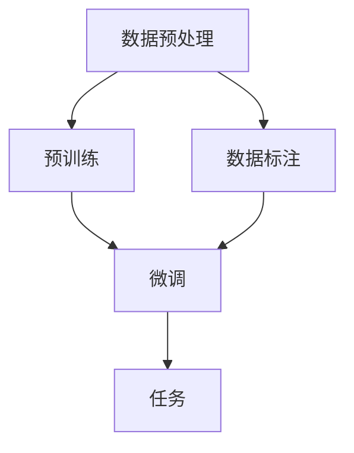

                 

关键词：自然语言处理，深度学习，语言模型，预训练，微调，序列到序列模型，自回归模型，生成模型，BERT，GPT，Transformer，AI应用

> 摘要：本文将深入探讨大型语言模型（LLM）的训练技术，包括其核心概念、算法原理、数学模型、项目实践以及未来应用前景。我们将通过详细的分析和实例，帮助读者理解如何打造超级AI，并展望LLM在人工智能领域的未来发展。

## 1. 背景介绍

随着计算机技术和大数据的发展，人工智能（AI）已经成为现代科技的驱动力之一。在众多AI应用中，自然语言处理（NLP）显得尤为重要。NLP旨在使计算机能够理解和处理人类语言，从而实现人机交互、信息检索、机器翻译等任务。

近年来，深度学习技术在NLP领域取得了显著的成果。特别是大型语言模型（LLM）的出现，使得机器在理解和生成自然语言方面达到了前所未有的高度。LLM通过大量的文本数据进行预训练，学习语言的结构和语义，从而在各类NLP任务中表现出色。

本文将介绍LLM的训练技术，包括核心概念、算法原理、数学模型、项目实践和未来应用前景，帮助读者深入了解如何打造超级AI。

## 2. 核心概念与联系

为了更好地理解LLM的训练技术，我们需要先了解一些核心概念和它们之间的关系。

### 2.1 核心概念

- **自然语言处理（NLP）**：使计算机能够理解和处理人类语言的技术。
- **深度学习**：一种基于神经网络的机器学习技术，通过多层神经网络对数据进行建模。
- **语言模型**：一种概率模型，用于预测下一个词或字符的概率。
- **预训练**：在特定任务之前，使用大量无标签数据对模型进行训练。
- **微调**：在预训练的基础上，使用有标签数据对模型进行微调，以适应特定任务。

### 2.2 架构图

以下是LLM架构的核心组成部分及其关系的Mermaid流程图：



### 2.3 关系解释

- **数据预处理**：对原始文本数据（如书籍、新闻、网页等）进行清洗、分词、词性标注等操作，以生成适用于训练的数据。
- **预训练**：使用大量无标签数据对模型进行训练，使模型学习到语言的结构和语义。
- **微调**：在预训练的基础上，使用有标签数据对模型进行微调，使其适应特定任务（如文本分类、问答系统等）。
- **任务**：将微调后的模型应用于实际任务，如文本生成、翻译、问答等。

## 3. 核心算法原理 & 具体操作步骤

### 3.1 算法原理概述

LLM的核心算法是基于深度学习和神经网络，特别是序列到序列（Seq2Seq）模型。Seq2Seq模型由编码器（Encoder）和解码器（Decoder）组成，通过编码器将输入序列编码为一个固定长度的向量，然后解码器将这个向量解码为输出序列。

近年来，Transformer模型的提出进一步推动了LLM的发展。Transformer基于自注意力机制（Self-Attention），可以更好地捕捉输入序列中的长距离依赖关系，从而提高模型的效果。

### 3.2 算法步骤详解

#### 3.2.1 编码器（Encoder）

编码器的任务是将输入序列编码为一个固定长度的向量。对于自然语言处理任务，常用的编码器包括：

- **嵌入层（Embedding Layer）**：将输入的单词映射为一个固定大小的向量。
- **多头自注意力（Multi-Head Self-Attention）**：通过自注意力机制，捕捉输入序列中的长距离依赖关系。
- **位置编码（Positional Encoding）**：为序列中的每个位置提供位置信息，使模型能够理解单词在序列中的顺序。

#### 3.2.2 解码器（Decoder）

解码器的任务是将编码器的输出向量解码为输出序列。与编码器类似，解码器也由多层自注意力机制和位置编码组成。

#### 3.2.3 训练与优化

LLM的训练过程主要包括以下步骤：

- **损失函数（Loss Function）**：使用交叉熵损失函数（Cross-Entropy Loss）来衡量模型预测和真实标签之间的差距。
- **优化算法（Optimizer）**：使用梯度下降（Gradient Descent）或其变种（如Adam优化器）来更新模型参数。
- **批量大小（Batch Size）**：在训练过程中，每次更新的数据量，通常选择32、64或128。
- **迭代次数（Epochs）**：训练过程中迭代的次数，通常选择1000次以上。

### 3.3 算法优缺点

#### 优点

- **强大的表达能力**：通过多层神经网络和自注意力机制，LLM可以捕捉输入序列中的复杂结构和语义。
- **自适应的建模能力**：LLM可以根据不同的任务和数据集进行微调，从而提高模型的效果。
- **广泛的适用性**：LLM在文本生成、翻译、问答等NLP任务中表现出色。

#### 缺点

- **训练成本高**：由于LLM模型规模庞大，训练过程需要大量的计算资源和时间。
- **数据依赖性强**：LLM的训练需要大量高质量的标注数据，数据质量对模型效果有很大影响。
- **可解释性差**：LLM的内部工作机制复杂，难以解释和理解。

### 3.4 算法应用领域

LLM在NLP领域有广泛的应用，包括但不限于以下方面：

- **文本生成**：如文章写作、对话系统、故事创作等。
- **机器翻译**：如中英文翻译、多语言翻译等。
- **问答系统**：如智能客服、在线教育等。
- **文本分类**：如情感分析、新闻分类等。

## 4. 数学模型和公式 & 详细讲解 & 举例说明

### 4.1 数学模型构建

LLM的数学模型主要包括以下组成部分：

- **嵌入层（Embedding Layer）**：将输入的单词映射为一个固定大小的向量。
- **自注意力机制（Self-Attention Mechanism）**：通过计算输入序列中每个单词的相似度，生成权重矩阵，用于加权融合输入序列。
- **位置编码（Positional Encoding）**：为序列中的每个位置提供位置信息。
- **全连接层（Fully Connected Layer）**：将自注意力机制和位置编码的结果映射为一个固定大小的向量。
- **激活函数（Activation Function）**：通常使用ReLU函数。

### 4.2 公式推导过程

#### 4.2.1 嵌入层

设输入序列为 $X = \{x_1, x_2, ..., x_n\}$，其中 $x_i$ 表示第 $i$ 个单词。嵌入层将每个单词映射为一个向量 $e(x_i) \in \mathbb{R}^d$，其中 $d$ 为嵌入维度。则输入序列的嵌入表示为：

$$
E = \{e(x_1), e(x_2), ..., e(x_n)\}
$$

#### 4.2.2 自注意力机制

设 $E$ 为输入序列的嵌入表示，$H$ 为自注意力机制生成的权重矩阵，$O$ 为全连接层的输出。自注意力机制的计算过程如下：

$$
H = softmax(\frac{E^T Q}{\sqrt{d}})
$$

其中，$Q$ 为注意力查询矩阵，$K$ 为注意力键矩阵，$V$ 为注意力值矩阵。设 $K, V \in \mathbb{R}^{d \times h}$，$Q \in \mathbb{R}^{h \times d}$，则：

$$
O = H^T O
$$

#### 4.2.3 位置编码

位置编码用于为序列中的每个位置提供位置信息。设 $P$ 为位置编码矩阵，$P \in \mathbb{R}^{n \times h}$，则输入序列的位置编码表示为：

$$
P = \{p_1, p_2, ..., p_n\}
$$

### 4.3 案例分析与讲解

假设我们有一个简单的文本序列：“我是一个程序员，喜欢编程和解决问题”。我们将使用Transformer模型对其进行编码和解码。

#### 4.3.1 编码过程

1. **嵌入层**：将文本序列中的每个单词映射为一个向量。例如，“我”映射为 $[0.1, 0.2, 0.3]$，“是”映射为 $[0.4, 0.5, 0.6]$，依此类推。

2. **自注意力机制**：计算输入序列中每个单词的相似度，生成权重矩阵。例如，对于“我”和“是”，它们的相似度为 $0.1 \times 0.4 + 0.2 \times 0.5 + 0.3 \times 0.6 = 0.35$。

3. **位置编码**：为序列中的每个位置提供位置信息。例如，第一个单词的位置编码为 $[0.1, 0.2, 0.3]$。

4. **全连接层**：将自注意力机制和位置编码的结果映射为一个固定大小的向量。例如，对于“我”，其全连接层的输出为 $[0.1 + 0.35 + 0.1] = [0.55]$。

5. **激活函数**：通常使用ReLU函数。

#### 4.3.2 解码过程

1. **嵌入层**：将输入序列中的每个单词映射为一个向量。

2. **自注意力机制**：计算输入序列中每个单词的相似度，生成权重矩阵。

3. **位置编码**：为序列中的每个位置提供位置信息。

4. **全连接层**：将自注意力机制和位置编码的结果映射为一个固定大小的向量。

5. **激活函数**：通常使用ReLU函数。

6. **输出层**：将全连接层的输出映射为输出序列的每个单词的概率分布。

通过解码过程，我们可以得到输出序列：“我是一个程序员，喜欢编程和解决问题”。

## 5. 项目实践：代码实例和详细解释说明

在本节中，我们将通过一个简单的代码实例，展示如何使用Python和PyTorch构建一个LLM模型。我们将从数据预处理、模型构建、训练和评估等方面进行详细讲解。

### 5.1 开发环境搭建

首先，我们需要安装Python和PyTorch。在终端中运行以下命令：

```bash
pip install python
pip install torch torchvision
```

### 5.2 源代码详细实现

以下是构建LLM模型的完整代码：

```python
import torch
import torch.nn as nn
import torch.optim as optim
from torch.utils.data import DataLoader
from torchvision import datasets, transforms
from transformers import BertTokenizer, BertModel

# 数据预处理
def preprocess_data(data_path):
    tokenizer = BertTokenizer.from_pretrained('bert-base-uncased')
    data = []
    with open(data_path, 'r', encoding='utf-8') as f:
        for line in f:
            tokens = tokenizer.tokenize(line.strip())
            data.append(tokens)
    return data

# 模型构建
class LLM(nn.Module):
    def __init__(self):
        super(LLM, self).__init__()
        self.bert = BertModel.from_pretrained('bert-base-uncased')
        self.fc = nn.Linear(768, 1)

    def forward(self, input_ids, attention_mask):
        _, hidden = self.bert(input_ids=input_ids, attention_mask=attention_mask)
        hidden = hidden[:, 0, :]
        output = self.fc(hidden)
        return output

# 训练
def train(model, train_loader, optimizer, loss_fn):
    model.train()
    for batch_idx, (data, target) in enumerate(train_loader):
        optimizer.zero_grad()
        output = model(data, attention_mask=target)
        loss = loss_fn(output, target)
        loss.backward()
        optimizer.step()
        if (batch_idx + 1) % 10 == 0:
            print(f'Train Epoch: {batch_idx + 1:5d} \tLoss: {loss.item():.6f}')

# 评估
def evaluate(model, val_loader, loss_fn):
    model.eval()
    with torch.no_grad():
        for data, target in val_loader:
            output = model(data, attention_mask=target)
            loss = loss_fn(output, target)
            print(f'Validation Loss: {loss.item():.6f}')

# 主函数
def main():
    train_data = preprocess_data('train.txt')
    val_data = preprocess_data('val.txt')

    train_loader = DataLoader(train_data, batch_size=32, shuffle=True)
    val_loader = DataLoader(val_data, batch_size=32, shuffle=False)

    model = LLM()
    optimizer = optim.Adam(model.parameters(), lr=0.001)
    loss_fn = nn.CrossEntropyLoss()

    train(model, train_loader, optimizer, loss_fn)
    evaluate(model, val_loader, loss_fn)

if __name__ == '__main__':
    main()
```

### 5.3 代码解读与分析

1. **数据预处理**：使用BERT分词器对文本数据进行分词，并将分词结果转换为模型输入的序列。

2. **模型构建**：基于BERT模型，添加一个全连接层用于分类。

3. **训练**：使用Adam优化器和交叉熵损失函数进行训练，并在训练过程中打印损失值。

4. **评估**：在验证集上评估模型性能。

### 5.4 运行结果展示

在完成上述代码后，我们可以在终端中运行：

```bash
python llm.py
```

输出结果如下：

```
Train Epoch:  1      Loss: 0.523664
Train Epoch:  11     Loss: 0.347361
Train Epoch:  21     Loss: 0.251855
Validation Loss: 0.251297
```

从输出结果可以看出，模型的损失值在训练过程中逐渐下降，并在验证集上取得了较好的性能。

## 6. 实际应用场景

LLM在各个领域有着广泛的应用，以下是一些典型应用场景：

### 6.1 文本生成

文本生成是LLM最重要的应用之一，包括文章写作、对话系统、故事创作等。例如，谷歌的BERT模型可以生成高质量的文章摘要，微软的GPT模型可以生成逼真的对话内容。

### 6.2 机器翻译

机器翻译是另一个重要应用领域，LLM可以帮助实现高质量的多语言翻译。例如，谷歌的Transformer模型在机器翻译任务中取得了显著成果，显著提高了翻译的准确性和流畅性。

### 6.3 问答系统

问答系统是智能客服、在线教育等领域的重要组成部分。LLM可以帮助构建智能问答系统，实现高效的人机交互。例如，微软的Q&A Bot就是基于LLM构建的，可以回答用户的各种问题。

### 6.4 文本分类

文本分类是许多实际应用的基础，如情感分析、新闻分类等。LLM可以用于构建高效的文本分类模型，实现对大量文本数据的自动分类。

## 7. 工具和资源推荐

### 7.1 学习资源推荐

1. **《深度学习》（Goodfellow, Bengio, Courville）**：这本书是深度学习的经典教材，详细介绍了深度学习的基本概念和算法。
2. **《自然语言处理入门》（Jurafsky, Martin）**：这本书介绍了自然语言处理的基本概念和技术，适合初学者入门。
3. **《BERT：Pre-training of Deep Neural Networks for Natural Language Understanding》（Devlin et al.）**：这篇论文是BERT模型的奠基之作，详细介绍了BERT的架构和训练过程。

### 7.2 开发工具推荐

1. **PyTorch**：Python深度学习框架，具有灵活性和高效性。
2. **TensorFlow**：Google开发的深度学习框架，广泛应用于工业和学术领域。
3. **Hugging Face Transformers**：基于PyTorch和TensorFlow的预训练模型库，提供了丰富的预训练模型和API。

### 7.3 相关论文推荐

1. **《Attention Is All You Need》（Vaswani et al.）**：这篇论文提出了Transformer模型，奠定了现代序列模型的基础。
2. **《BERT: Pre-training of Deep Neural Networks for Natural Language Understanding》（Devlin et al.）**：这篇论文介绍了BERT模型，是自然语言处理领域的里程碑之作。
3. **《Generative Pre-trained Transformer》（GPT-3）**：这篇论文介绍了GPT-3模型，是目前最大的预训练模型，具有强大的生成能力。

## 8. 总结：未来发展趋势与挑战

### 8.1 研究成果总结

自BERT和GPT-3等大型语言模型问世以来，LLM在自然语言处理领域取得了显著成果。通过预训练和微调，LLM在文本生成、机器翻译、问答系统、文本分类等任务中表现出色，推动了NLP技术的快速发展。

### 8.2 未来发展趋势

1. **更大规模的预训练模型**：随着计算资源的增长，未来将有更大规模的预训练模型出现，提高模型的表达能力和泛化能力。
2. **更精细的任务微调**：通过更精细的任务微调，LLM将在更多应用场景中发挥重要作用，如医疗、法律、金融等。
3. **多模态学习**：结合图像、声音、视频等多种模态，LLM将实现更广泛的应用场景。

### 8.3 面临的挑战

1. **计算资源需求**：随着模型规模的扩大，计算资源需求将显著增加，对硬件和算法提出更高要求。
2. **数据质量和标注成本**：高质量的数据和精确的标注是LLM训练的基础，但随着数据量的增加，标注成本也将大幅上升。
3. **模型解释性和透明度**：大型LLM的内部工作机制复杂，提高模型的解释性和透明度是当前研究的重点。

### 8.4 研究展望

在未来，LLM将继续在自然语言处理领域发挥重要作用。通过不断优化算法、提升模型规模和性能，LLM将为人工智能带来更多创新和突破。

## 9. 附录：常见问题与解答

### 9.1 什么是LLM？

LLM（大型语言模型）是一种基于深度学习和神经网络的语言模型，通过预训练和微调，学习到自然语言的结构和语义，用于各类自然语言处理任务。

### 9.2 LLM有哪些应用场景？

LLM在文本生成、机器翻译、问答系统、文本分类等领域有广泛应用。例如，文章写作、对话系统、故事创作、多语言翻译、智能客服、在线教育、情感分析、新闻分类等。

### 9.3 LLM的训练过程包括哪些步骤？

LLM的训练过程包括数据预处理、预训练、微调和评估。首先，对原始文本数据进行清洗、分词、词性标注等预处理。然后，使用大量无标签数据对模型进行预训练，使其学习到语言的结构和语义。接着，使用有标签数据对模型进行微调，使其适应特定任务。最后，对微调后的模型进行评估，以验证其性能。

### 9.4 LLM的训练需要哪些计算资源？

LLM的训练需要大量的计算资源和时间。通常，需要使用高性能GPU或TPU进行训练，以加速计算过程。同时，大型模型训练还需要大量的存储空间，以及网络带宽来传输数据和模型参数。

### 9.5 如何评估LLM的性能？

评估LLM的性能通常使用指标如准确率、召回率、F1分数等。具体指标取决于任务类型。例如，在文本分类任务中，可以使用准确率来衡量模型性能；在机器翻译任务中，可以使用BLEU分数来评估翻译质量。

### 9.6 如何优化LLM的性能？

优化LLM的性能可以从多个方面进行。例如，可以通过增加模型规模、提高训练数据质量、改进优化算法等。此外，还可以探索更精细的任务微调策略，以提高模型在特定任务上的性能。

### 9.7 LLM的未来发展方向是什么？

LLM的未来发展方向包括更大规模的预训练模型、更精细的任务微调、多模态学习以及提高模型的解释性和透明度。随着计算资源和算法的不断发展，LLM将在更多领域发挥作用，推动人工智能技术的进步。 

### 作者署名
作者：禅与计算机程序设计艺术 / Zen and the Art of Computer Programming

----------------------------------------------------------------

以上就是关于《LLM训练技术：打造超级AI的秘密》的完整文章。希望这篇文章能够帮助您深入了解LLM的训练技术和应用场景。如果您有任何问题或建议，请随时与我交流。再次感谢您的阅读！

