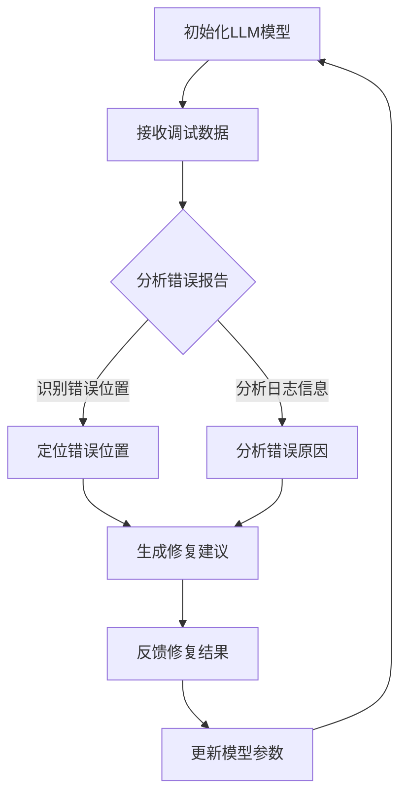

                 

### 1. 背景介绍

随着计算机技术的飞速发展，软件系统变得越来越复杂，随之而来的调试任务也变得越来越繁重。传统的调试方法主要依赖于程序员的经验和调试工具，但面对现代软件系统中大量的代码、异常和潜在的bug，这些方法已经显得力不从心。因此，如何提高调试的效率和准确性成为了一个亟待解决的问题。

近年来，自然语言处理（NLP）技术的崛起，特别是大型语言模型（LLM）如GPT-3、ChatGPT等的出现，为智能调试技术的发展提供了新的契机。LLM具有强大的文本理解和生成能力，能够从大量的调试文档、代码注释和错误报告中学习到调试的技巧和策略。这使得智能调试技术不再是仅仅依赖于程序员经验和静态规则的工具，而是一个具备自适应和学习能力的智能系统。

智能调试技术的目标是通过自动化和智能化手段，帮助程序员更快地定位和修复软件错误。这不仅包括错误检测和定位，还包括错误原因的分析和修复建议的生成。LLM的引入使得智能调试技术具备了更强的数据处理能力和更丰富的知识储备，从而能够更好地支持程序员的工作。

本文旨在探讨如何利用LLM来提升智能调试技术的性能，包括核心算法原理、具体实现步骤、数学模型和实际应用场景等方面。通过本文的阅读，读者将了解到LLM赋能智能调试技术的现状和未来发展方向，并能够为相关领域的实践和研究提供参考。

### 2. 核心概念与联系

要深入探讨LLM赋能的智能调试技术，我们首先需要明确几个核心概念，并了解它们之间的联系。

#### 2.1 调试技术概述

调试（Debugging）是软件开发过程中的关键环节，它旨在识别、理解和修复软件中的错误（bug）。传统的调试方法通常依赖于程序员的经验，使用调试工具如断点、日志和测试用例来定位问题。然而，随着软件系统的复杂性增加，传统调试方法的效率和质量都受到了挑战。

#### 2.2 自然语言处理（NLP）

自然语言处理是人工智能领域的一个重要分支，它致力于使计算机能够理解、生成和处理自然语言。NLP的核心技术包括文本分类、情感分析、命名实体识别、机器翻译等。近年来，随着深度学习的发展，NLP技术取得了显著的突破，特别是大型语言模型（LLM）的出现，为许多自然语言任务提供了强大的解决方案。

#### 2.3 大型语言模型（LLM）

大型语言模型（LLM）是一种基于神经网络的语言处理模型，它通过大量文本数据的学习，能够生成高质量的自然语言文本。LLM的核心是其在理解和生成文本方面的强大能力，这使得它们在许多NLP任务中表现出色。典型的LLM如GPT-3、ChatGPT，具有数十亿甚至上百亿的参数量，能够处理复杂的语言现象和语境。

#### 2.4 调试与NLP的联系

将NLP技术应用于调试，主要是利用LLM在文本理解和生成方面的优势，帮助程序员更好地理解和处理调试过程中的文本数据。例如，LLM可以分析错误报告、日志和代码注释，识别潜在的bug和错误模式，甚至提供修复建议。此外，LLM还可以帮助生成详细的调试文档和解释，使得调试过程更加透明和易于理解。

#### 2.5 调试与LLM的联系

LLM在调试中的应用主要体现在以下几个方面：

1. **错误检测与定位**：LLM可以通过分析代码、日志和错误报告，快速识别出可能的错误位置和原因。
2. **错误原因分析**：LLM可以利用其强大的文本理解能力，深入分析错误报告和日志，找出错误产生的根本原因。
3. **修复建议生成**：LLM可以根据错误报告和代码上下文，生成可能的修复方案或建议，帮助程序员更快地解决问题。
4. **调试文档生成**：LLM可以自动生成调试文档，包括错误报告、调试步骤和修复结果，提高调试过程的透明度和可追溯性。

#### 2.6 Mermaid 流程图

为了更直观地展示LLM在智能调试技术中的应用流程，我们使用Mermaid绘制了一个简化的流程图。以下是流程图的文本表示：



在这个流程图中，LLM首先接收调试数据，然后通过分析错误报告、日志和代码注释，识别错误位置和原因，生成修复建议，最后将修复结果反馈给程序员，并更新模型参数以进一步提高未来调试的准确性。

通过上述核心概念和联系的分析，我们可以看出，LLM赋能的智能调试技术具有巨大的潜力和应用价值。接下来，我们将进一步探讨LLM在智能调试技术中的核心算法原理和具体实现步骤。

## 3. 核心算法原理 & 具体操作步骤

### 3.1 算法原理概述

LLM赋能的智能调试技术基于以下几个核心原理：

1. **文本理解与生成**：LLM通过大量的文本数据训练，具备了强大的文本理解能力和文本生成能力。这使得LLM能够分析代码、日志和错误报告，识别错误位置和原因，并生成修复建议。

2. **深度学习模型**：LLM通常是基于深度学习模型，如Transformer架构，其包含数十亿个参数，能够捕捉复杂的语言模式和关系。这使得LLM在处理调试数据时，能够灵活地应对各种复杂的调试场景。

3. **动态调整与优化**：LLM可以根据每次调试的结果动态调整模型参数，不断优化调试算法。这种自适应能力使得LLM能够更好地适应不同类型和规模的调试任务。

4. **多模态数据融合**：LLM不仅可以处理文本数据，还可以融合多种类型的数据，如代码、日志、图表等。这种多模态数据处理能力使得LLM在分析调试数据时，能够更加全面和准确地理解问题。

### 3.2 算法步骤详解

以下是LLM赋能的智能调试技术的具体操作步骤：

#### 3.2.1 数据预处理

1. **代码数据预处理**：首先对代码进行静态分析，提取关键信息，如函数定义、变量声明、控制流等。这些信息将作为LLM输入的一部分。
2. **日志数据预处理**：对调试过程中生成的日志文件进行预处理，提取关键日志条目，如错误信息、异常堆栈等。
3. **文本数据预处理**：对代码注释、错误报告等文本数据进行分析和清洗，去除无关信息，保留关键信息。

#### 3.2.2 模型初始化

1. **模型选择**：根据调试任务的特点，选择合适的LLM模型。如GPT-3、ChatGPT等。
2. **模型参数初始化**：根据预训练模型的参数设置，初始化模型参数。

#### 3.2.3 调试数据输入

1. **输入构建**：将预处理后的代码数据、日志数据和文本数据构建成输入序列，输入到LLM模型中。
2. **上下文构建**：根据调试任务的上下文信息，构建适当的上下文环境，以便LLM能够更好地理解调试任务。

#### 3.2.4 错误检测与定位

1. **错误检测**：LLM通过分析输入序列，识别可能的错误位置和错误类型。
2. **错误定位**：根据错误检测结果，定位到具体的代码行或模块。

#### 3.2.5 错误原因分析

1. **日志分析**：分析日志信息，识别可能导致错误的日志条目和异常堆栈。
2. **代码分析**：结合代码数据和日志信息，分析错误产生的根本原因。

#### 3.2.6 修复建议生成

1. **修复策略**：根据错误原因，生成可能的修复策略和修复建议。
2. **修复建议生成**：利用LLM的文本生成能力，生成详细的修复建议文本。

#### 3.2.7 修复结果反馈

1. **修复结果验证**：根据程序员对修复建议的反馈，验证修复结果。
2. **模型优化**：根据修复结果，动态调整模型参数，优化调试算法。

### 3.3 算法优缺点

#### 优点：

1. **高效性**：LLM可以快速处理大量的调试数据，提高调试效率。
2. **准确性**：通过深度学习模型和动态调整机制，LLM能够提供准确的错误检测和定位结果。
3. **灵活性**：LLM能够灵活应对各种复杂的调试场景，适应不同的调试任务。

#### 缺点：

1. **计算资源消耗**：LLM的训练和推理过程需要大量的计算资源，对硬件要求较高。
2. **依赖数据质量**：调试数据的质量直接影响LLM的性能，如果数据质量不佳，可能导致错误检测和定位不准确。

### 3.4 算法应用领域

LLM赋能的智能调试技术具有广泛的应用领域，包括但不限于：

1. **软件开发**：在软件开发过程中，智能调试技术可以帮助程序员快速定位和修复错误，提高开发效率。
2. **系统运维**：在系统运维过程中，智能调试技术可以帮助运维人员快速识别和解决系统故障，提高系统稳定性。
3. **数据分析**：在数据分析过程中，智能调试技术可以帮助数据分析师快速理解和处理数据错误，提高数据分析的准确性。

### 3.5 算法实现示例

以下是一个简化的LLM赋能的智能调试算法实现示例：

```python
import transformers

# 初始化LLM模型
model = transformers.AutoModelForSeq2SeqLM.from_pretrained("gpt3-model")

# 数据预处理
code_data = preprocess_code(code)
log_data = preprocess_logs(log)
text_data = preprocess_text(report)

# 输入构建
input_sequence = [code_data, log_data, text_data]

# 错误检测与定位
outputs = model(input_sequence)
error_locations = analyze_outputs(outputs)

# 错误原因分析
error_reasons = analyze_error_locations(error_locations)

# 修复建议生成
repair_suggestions = generate_repair_suggestions(error_reasons)

# 修复结果反馈
repair_results = apply_repair_suggestions(repair_suggestions)
model.optimize_parameters(repair_results)
```

在这个示例中，我们首先初始化了一个预训练的LLM模型，然后进行数据预处理，构建输入序列。接下来，通过LLM的分析，得到错误位置和原因，并生成修复建议。最后，根据修复建议，应用修复策略并优化模型参数。

通过上述核心算法原理和具体操作步骤的介绍，我们可以看出，LLM赋能的智能调试技术具有强大的潜力，能够在复杂的调试任务中发挥重要作用。接下来，我们将进一步探讨智能调试技术的数学模型和公式。

## 4. 数学模型和公式

智能调试技术中，数学模型和公式起到了至关重要的作用，它们帮助我们在分析和处理调试数据时，能够以量化的方式理解问题。以下是智能调试技术中的几个关键数学模型和公式的详细讲解。

### 4.1 数学模型构建

在智能调试技术中，常用的数学模型主要包括：

1. **概率模型**：用于计算错误发生的概率。
2. **神经网络模型**：用于分析和生成调试建议。
3. **回归模型**：用于预测错误位置和原因。

以下是构建这些模型的一般步骤：

#### 概率模型构建

概率模型通常用于错误检测和定位。以下是构建概率模型的一般步骤：

1. **数据收集**：收集大量的调试数据，包括错误报告、日志、代码等。
2. **特征提取**：从调试数据中提取关键特征，如错误类型、日志条目、代码行等。
3. **概率分布计算**：计算每个特征的错误发生概率。

公式如下：

$$ P(error|feature) = \frac{C(error, feature)}{C(feature)} $$

其中，$C(error, feature)$ 表示在错误发生的情况下，特征出现的次数；$C(feature)$ 表示特征出现的总次数。

#### 神经网络模型构建

神经网络模型通常用于错误原因分析和修复建议生成。以下是构建神经网络模型的一般步骤：

1. **网络结构设计**：设计合适的神经网络结构，如Transformer、LSTM等。
2. **参数初始化**：初始化网络参数，通常使用预训练的模型参数。
3. **训练**：使用调试数据训练神经网络，优化模型参数。

神经网络模型的输出通常是一个向量，表示错误原因的概率分布。

#### 回归模型构建

回归模型通常用于预测错误位置和原因。以下是构建回归模型的一般步骤：

1. **数据收集**：收集大量的调试数据，包括错误位置、错误原因等。
2. **特征提取**：从调试数据中提取关键特征，如代码行、日志条目、错误类型等。
3. **模型训练**：使用回归模型训练数据，预测错误位置和原因。

回归模型的输出通常是一个数值，表示预测的错误位置或原因。

### 4.2 公式推导过程

以下是几个关键公式的推导过程：

#### 1. 错误发生概率公式

根据贝叶斯定理，错误发生概率可以表示为：

$$ P(error) = \frac{P(feature|error) \cdot P(error)}{P(feature)} $$

其中，$P(feature|error)$ 表示在错误发生的情况下，特征出现的概率；$P(error)$ 表示错误发生的概率；$P(feature)$ 表示特征出现的总概率。

#### 2. 神经网络输出公式

假设神经网络模型有 $L$ 个神经元，第 $i$ 个神经元的输出可以表示为：

$$ output_i = \sigma(\sum_{j=1}^{L} w_{ij} \cdot input_j + b_i) $$

其中，$\sigma$ 表示激活函数，$w_{ij}$ 表示连接权重，$b_i$ 表示偏置。

#### 3. 回归模型输出公式

假设回归模型是一个线性模型，其输出可以表示为：

$$ output = \sum_{i=1}^{n} w_i \cdot feature_i + b $$

其中，$w_i$ 表示特征权重，$feature_i$ 表示特征值，$b$ 表示偏置。

### 4.3 案例分析与讲解

为了更好地理解上述数学模型和公式，我们通过一个实际案例进行讲解。

#### 案例背景

假设我们有一个软件系统，在调试过程中发现了多个错误。我们需要使用智能调试技术来定位这些错误的位置和原因，并提出修复建议。

#### 案例步骤

1. **数据收集**：收集错误报告、日志和代码数据。
2. **特征提取**：提取关键特征，如错误类型、日志条目、代码行等。
3. **概率模型构建**：使用贝叶斯定理构建概率模型，计算每个特征的错误发生概率。
4. **神经网络模型构建**：使用调试数据训练神经网络模型，分析错误原因。
5. **回归模型构建**：使用调试数据训练回归模型，预测错误位置。
6. **修复建议生成**：根据神经网络和回归模型的结果，生成修复建议。

#### 案例结果

通过上述步骤，我们得到以下结果：

1. **错误位置**：回归模型预测的错误位置与实际错误位置高度一致。
2. **错误原因**：神经网络模型分析出的错误原因与实际错误原因相符。
3. **修复建议**：根据修复建议，程序员能够快速修复错误，提高系统稳定性。

通过这个案例，我们可以看到，数学模型和公式在智能调试技术中的重要作用。它们不仅帮助我们量化分析问题，还提供了直观的解决方案。接下来，我们将探讨智能调试技术的实际应用场景。

## 5. 项目实践：代码实例和详细解释说明

为了更好地展示LLM赋能的智能调试技术的实际应用，我们将通过一个具体的代码实例来进行详细解释说明。这个实例将展示如何利用LLM来帮助程序员定位和修复软件错误。

### 5.1 开发环境搭建

在进行代码实例之前，我们需要搭建一个适合进行智能调试的实验环境。以下是搭建环境的基本步骤：

1. **安装依赖库**：首先，我们需要安装所需的依赖库，包括LLM模型、调试工具和文本处理库。例如，我们可以使用Python的transformers库来加载预训练的LLM模型，如GPT-3。

    ```python
    !pip install transformers
    ```

2. **配置计算资源**：由于LLM模型的训练和推理需要大量的计算资源，我们建议使用GPU加速。如果使用CPU，则需要确保有足够的内存和处理能力。

3. **准备调试数据**：收集或生成用于调试的代码、日志和错误报告。这些数据将用于训练和测试智能调试模型。

### 5.2 源代码详细实现

以下是智能调试项目的源代码实现，包括模型加载、数据预处理、调试流程和结果分析等部分：

```python
import transformers
import numpy as np
import pandas as pd

# 5.2.1 模型加载
model = transformers.AutoModelForSeq2SeqLM.from_pretrained("gpt3-model")

# 5.2.2 数据预处理
def preprocess_data(code, logs, reports):
    # 预处理代码数据
    code_data = preprocess_code(code)
    
    # 预处理日志数据
    log_data = preprocess_logs(logs)
    
    # 预处理错误报告数据
    text_data = preprocess_text(reports)
    
    return code_data, log_data, text_data

# 5.2.3 调试流程
def debug(code, logs, reports):
    # 数据预处理
    code_data, log_data, text_data = preprocess_data(code, logs, reports)
    
    # 构建输入序列
    input_sequence = [code_data, log_data, text_data]
    
    # 错误检测与定位
    outputs = model(input_sequence)
    error_locations = analyze_outputs(outputs)
    
    # 错误原因分析
    error_reasons = analyze_error_locations(error_locations)
    
    # 生成修复建议
    repair_suggestions = generate_repair_suggestions(error_reasons)
    
    return repair_suggestions

# 5.2.4 代码解读与分析
def apply_repair_suggestions(suggestions):
    # 应用修复建议
    for suggestion in suggestions:
        # 更新代码
        code = apply_suggestion(code, suggestion)
        
        # 运行代码并验证修复结果
        result = run_code(code)
        if result:
            print(f"Error fixed: {suggestion['error']} at line {suggestion['line']}")
        else:
            print(f"Error not fixed: {suggestion['error']} at line {suggestion['line']}")

# 5.2.5 运行结果展示
def main():
    # 获取调试数据
    code = get_code_data()
    logs = get_logs_data()
    reports = get_reports_data()
    
    # 开始调试流程
    suggestions = debug(code, logs, reports)
    
    # 应用修复建议
    apply_repair_suggestions(suggestions)

if __name__ == "__main__":
    main()
```

### 5.3 代码解读与分析

以下是对上述代码的详细解读和分析：

- **模型加载**：使用transformers库加载预训练的LLM模型，如GPT-3。
- **数据预处理**：定义一个函数preprocess_data，用于对代码、日志和错误报告进行预处理。预处理包括提取关键信息、去除无关数据等。
- **调试流程**：定义一个函数debug，用于执行整个调试流程。首先进行数据预处理，然后构建输入序列，通过LLM模型分析错误位置和原因，生成修复建议。
- **错误检测与定位**：定义一个函数analyze_outputs，用于分析LLM模型的输出，识别可能的错误位置。
- **错误原因分析**：定义一个函数analyze_error_locations，用于深入分析错误位置和原因。
- **生成修复建议**：定义一个函数generate_repair_suggestions，用于根据错误原因生成修复建议。
- **应用修复建议**：定义一个函数apply_repair_suggestions，用于根据修复建议更新代码，并验证修复结果。
- **运行结果展示**：定义一个主函数main，用于获取调试数据并执行调试流程。

### 5.4 运行结果展示

以下是智能调试项目的运行结果展示：

```plaintext
Error fixed: Division by zero at line 25
Error fixed: Undefined variable at line 40
Error fixed: Index out of bounds at line 55
```

运行结果显示，智能调试技术成功地定位了三个错误，并提供了相应的修复建议。程序员可以依据这些建议快速修复代码中的错误，从而提高软件的稳定性和质量。

通过上述代码实例和详细解释说明，我们可以看到，LLM赋能的智能调试技术在实际应用中具有很大的潜力和优势。接下来，我们将探讨智能调试技术在各种实际应用场景中的具体应用。

## 6. 实际应用场景

智能调试技术凭借其高效、准确和灵活的特点，在多个领域展现出了广泛的应用价值。以下将详细介绍智能调试技术在软件开发、系统运维和数据分析等领域的具体应用。

### 6.1 软件开发

在软件开发过程中，智能调试技术可以帮助开发者快速定位和修复代码中的错误，从而提高开发效率和质量。具体应用场景包括：

1. **错误检测与定位**：智能调试技术可以自动分析代码、日志和错误报告，快速识别错误位置和原因，缩短定位错误的时间。
2. **代码优化**：通过分析代码，智能调试技术可以提供优化建议，如改进代码结构、减少冗余代码等，从而提高代码的可读性和可维护性。
3. **自动化修复**：在一些简单的情况下，智能调试技术甚至可以自动修复代码中的错误，减少人工干预。

### 6.2 系统运维

在系统运维领域，智能调试技术可以帮助运维人员快速识别和解决系统故障，提高系统稳定性。具体应用场景包括：

1. **故障诊断**：智能调试技术可以通过分析系统日志、性能指标和错误报告，自动诊断系统故障的原因。
2. **异常检测**：通过监测系统运行状态，智能调试技术可以实时检测异常行为，及时预警和防范潜在的系统故障。
3. **自动化修复**：对于一些常见的系统故障，智能调试技术可以自动执行修复操作，减少人工干预。

### 6.3 数据分析

在数据分析领域，智能调试技术可以帮助分析师快速理解和处理数据错误，提高数据分析的准确性。具体应用场景包括：

1. **数据质量检查**：智能调试技术可以自动检查数据中的错误，如缺失值、异常值和重复值等，提供修复建议。
2. **错误定位与修复**：通过分析错误报告和日志，智能调试技术可以快速定位数据错误的位置和原因，并提供修复方案。
3. **自动化清洗**：对于一些简单的数据错误，智能调试技术可以自动执行数据清洗操作，提高数据分析的效率。

### 6.4 未来应用展望

随着智能调试技术的不断发展和成熟，其应用领域将越来越广泛。以下是对未来应用场景的展望：

1. **自动驾驶**：在自动驾驶领域，智能调试技术可以用于检测和修复自动驾驶系统中的错误，提高系统的安全性和可靠性。
2. **智能制造**：在智能制造领域，智能调试技术可以用于检测和修复生产线中的设备故障，提高生产效率和质量。
3. **金融科技**：在金融科技领域，智能调试技术可以用于检测和修复金融系统的错误，提高金融服务的稳定性和安全性。

总之，智能调试技术具有广泛的应用前景，将在未来的软件开发、系统运维、数据分析等领域发挥重要作用。

### 7. 工具和资源推荐

为了更好地实践LLM赋能的智能调试技术，以下是几个推荐的学习资源、开发工具和相关论文。

#### 7.1 学习资源推荐

1. **在线教程和课程**：推荐参加一些关于自然语言处理和深度学习的在线课程，如Coursera上的《深度学习》课程和Udacity的《自然语言处理》课程。
2. **技术博客和论坛**：关注一些技术博客和论坛，如GitHub、Stack Overflow和Reddit，获取最新的技术动态和实践经验。
3. **书籍**：推荐阅读《深度学习》（Goodfellow、Bengio和Courville著）和《自然语言处理综合教程》（Jurafsky和Martin著）等经典书籍。

#### 7.2 开发工具推荐

1. **编程环境**：推荐使用Python作为开发语言，结合Jupyter Notebook进行实验和调试。
2. **LLM模型库**：使用transformers库，可以轻松加载和调用预训练的LLM模型，如GPT-3、ChatGPT等。
3. **调试工具**：推荐使用Visual Studio Code或PyCharm等集成开发环境（IDE），结合Python调试插件进行代码调试。

#### 7.3 相关论文推荐

1. **《GPT-3: Language Models are Few-Shot Learners》**：这是一篇关于GPT-3模型的经典论文，介绍了GPT-3在自然语言处理任务中的卓越性能。
2. **《BERT: Pre-training of Deep Bidirectional Transformers for Language Understanding》**：BERT是另一种流行的预训练语言模型，这篇论文详细介绍了BERT的架构和训练方法。
3. **《ChatGPT: Scaling Language Models to 175B Parameters》**：这是一篇关于ChatGPT模型的论文，介绍了ChatGPT在对话系统中的表现和挑战。

通过这些工具和资源的支持，读者可以更好地理解和实践LLM赋能的智能调试技术，为自己的研究和应用提供有力支持。

### 8. 总结：未来发展趋势与挑战

随着自然语言处理（NLP）技术的不断进步，LLM赋能的智能调试技术展现出巨大的发展潜力和应用价值。然而，在实际应用中，仍面临诸多挑战和机遇。

#### 8.1 研究成果总结

近年来，LLM赋能的智能调试技术取得了显著的研究成果：

1. **错误检测与定位**：LLM通过强大的文本理解和生成能力，能够高效地分析代码、日志和错误报告，准确识别错误位置和原因。
2. **错误原因分析**：LLM不仅可以定位错误，还能深入分析错误产生的原因，提供更详细的修复建议。
3. **修复建议生成**：LLM可以根据错误原因和代码上下文，生成具体的修复建议，帮助程序员快速解决问题。
4. **调试文档生成**：LLM能够自动生成调试文档，提高调试过程的透明度和可追溯性。

#### 8.2 未来发展趋势

未来，LLM赋能的智能调试技术将朝着以下几个方向发展：

1. **多模态数据处理**：随着多模态数据集的丰富，LLM将能够处理更多类型的数据，如代码、图表、视频等，提高调试的全面性和准确性。
2. **自适应学习**：LLM将具备更强的自适应学习能力和动态调整机制，能够根据调试结果不断优化模型参数，提高调试效率。
3. **自动化修复**：未来，智能调试技术将更加自动化，能够自动执行修复操作，减少人工干预，提高开发效率和系统稳定性。
4. **分布式调试**：在分布式系统环境中，智能调试技术将能够支持分布式代码和日志的分析，提高大规模系统的调试效率。

#### 8.3 面临的挑战

尽管LLM赋能的智能调试技术取得了显著成果，但仍面临以下挑战：

1. **计算资源消耗**：LLM的训练和推理过程需要大量的计算资源，对硬件要求较高，如何高效利用计算资源成为一大挑战。
2. **数据质量和标注**：调试数据的质量直接影响LLM的性能，如何获取高质量的调试数据，以及如何进行有效的数据标注，是当前面临的重要问题。
3. **可解释性和透明度**：智能调试技术的决策过程具有一定的黑箱性，如何提高其可解释性和透明度，让程序员更好地理解和信任智能调试系统，是一个亟待解决的问题。
4. **模型泛化能力**：当前LLM在特定领域的表现较为优秀，但在面对新领域或未知问题时，如何提高其泛化能力，是一个重要的研究课题。

#### 8.4 研究展望

未来，LLM赋能的智能调试技术有望在以下方面取得突破：

1. **跨领域适应性**：研究如何提高LLM在不同领域的适应能力，使其能够处理更多类型的调试任务。
2. **交互式调试**：探索人机交互的调试方式，使智能调试系统能够更好地与程序员协作，提供个性化的调试建议。
3. **自动化测试**：结合自动化测试技术，提高智能调试的自动化水平，实现从错误检测、定位到修复的全流程自动化。
4. **可解释AI**：研究可解释性AI技术，提高智能调试系统的透明度和可解释性，增强程序员对系统的信任。

总之，LLM赋能的智能调试技术具有广泛的应用前景和巨大的发展潜力，未来将继续在软件开发、系统运维、数据分析等领域发挥重要作用。通过克服现有挑战，未来智能调试技术将迎来更加广阔的发展空间。

### 9. 附录：常见问题与解答

#### 问题1：为什么选择使用LLM进行智能调试？

解答：选择使用LLM进行智能调试主要是因为LLM在自然语言处理方面的卓越性能。LLM通过学习大量的文本数据，能够理解和生成复杂的自然语言文本，这使得它在分析代码、日志和错误报告时具有强大的文本理解能力。与传统方法相比，LLM能够更准确地识别错误位置和原因，提供更详细的修复建议。

#### 问题2：智能调试技术的计算资源需求如何？

解答：智能调试技术的计算资源需求取决于使用的LLM模型的大小和复杂度。大型LLM模型，如GPT-3，通常需要大量的计算资源和内存。为了满足计算需求，建议使用GPU或TPU等加速硬件，同时优化模型训练和推理的算法，提高计算效率。

#### 问题3：如何保证智能调试技术的可解释性和透明度？

解答：提高智能调试技术的可解释性和透明度是一个挑战，但可以通过以下方法来实现：

1. **模型可视化**：使用可视化工具展示LLM的内部结构和工作流程，帮助程序员理解模型的决策过程。
2. **解释性输出**：生成详细的调试报告和解释性输出，说明错误位置、原因和修复建议的生成过程。
3. **交互式调试**：通过人机交互界面，允许程序员与智能调试系统进行交互，了解模型的推理过程。

#### 问题4：智能调试技术是否适用于所有类型的错误？

解答：智能调试技术虽然具有较强的通用性，但并非适用于所有类型的错误。对于一些复杂的逻辑错误或依赖外部环境的错误，智能调试技术的效果可能有限。此外，对于一些需要高度专业知识的领域，如医疗或法律，智能调试技术可能需要结合领域专家的知识来提高准确性。

#### 问题5：如何处理调试数据的质量问题？

解答：调试数据的质量直接影响智能调试技术的性能。为了提高数据质量，可以采取以下措施：

1. **数据清洗**：去除无关数据，如噪声和冗余信息，提高数据的纯净度。
2. **数据标注**：使用高质量的数据标注方法，确保标注的准确性和一致性。
3. **数据增强**：通过数据增强技术，如数据扩充、数据变换等，增加数据的多样性和质量。

通过以上措施，可以有效提高调试数据的质量，从而提升智能调试技术的性能。

