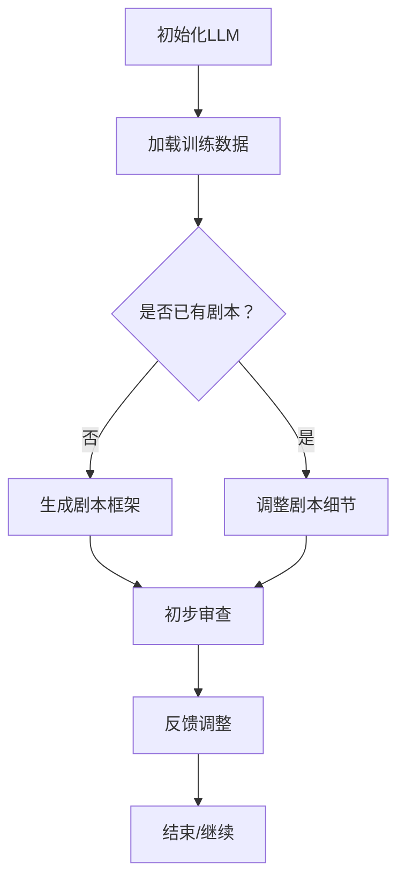

                 

关键词：人工智能，机器学习，自然语言处理，电影剧本创作，人类-机器合作

> 摘要：本文探讨了人工智能（AI）在电影剧本创作中的应用，尤其是大型语言模型（LLM）的作用。通过分析LLM的工作原理和与人类编剧的协作机制，探讨了这种新型创作方式对电影行业的潜在影响，并对未来发展进行了展望。

## 1. 背景介绍

随着人工智能技术的飞速发展，机器学习在自然语言处理（NLP）领域的应用愈发广泛。特别是近年来，大型语言模型（LLM）如GPT-3、BERT等，通过深度学习技术，实现了对自然语言的精准理解和生成。这些模型的强大能力为电影剧本创作带来了新的机遇。

电影剧本的创作过程通常涉及创意构思、角色塑造、情节设计等多个方面。然而，这一过程往往需要大量的时间和精力，而且存在一定的主观性和不可预测性。传统的编剧方式虽然能够创作出优秀的剧本，但效率较低，难以满足快速变化的市场需求。

随着人工智能技术的发展，特别是在NLP领域的突破，AI在辅助人类编剧方面展现出了巨大的潜力。LLM通过学习大量的文本数据，能够生成高质量的自然语言文本，从而在剧本创作过程中发挥重要作用。这不仅提高了创作效率，还拓宽了编剧的思维空间。

## 2. 核心概念与联系

### 2.1. 大型语言模型（LLM）

大型语言模型（LLM）是一种基于深度学习的语言处理模型，具有强大的文本生成和理解能力。LLM通过大规模语料库的学习，掌握了语言的语法、语义和上下文信息，从而能够生成连贯、自然的文本。

LLM的核心组成部分包括神经网络和训练数据。神经网络用于捕捉文本数据中的复杂模式，而训练数据则提供了模型所需的丰富语料，用于模型的训练和优化。

### 2.2. 机器学习与自然语言处理

机器学习（ML）是AI的核心技术之一，通过构建模型，从数据中自动学习规律和模式。自然语言处理（NLP）是ML的一个子领域，专注于使计算机能够理解、生成和处理自然语言。

NLP的关键技术包括文本预处理、词嵌入、句法分析和语义理解等。这些技术为LLM提供了强大的支持，使其能够处理复杂的语言任务。

### 2.3. 人类-机器协作

人类-机器协作是指人类与机器共同完成某一任务的过程。在电影剧本创作中，人类编剧可以利用LLM的文本生成能力，快速构建出初步的剧本框架，然后再进行细节调整和优化。

人类-机器协作的优势在于，机器能够快速处理大量数据，提供丰富的创意和灵感，而人类则能够运用自己的直觉和情感，对剧本进行深入的思考和调整。

### 2.4. Mermaid 流程图

以下是一个描述LLM辅助电影剧本创作过程的Mermaid流程图：



## 3. 核心算法原理 & 具体操作步骤

### 3.1. 算法原理概述

LLM的核心算法是基于变换器模型（Transformer）的深度学习模型。Transformer模型通过自注意力机制（Self-Attention）和多头注意力（Multi-Head Attention）机制，能够捕捉文本数据中的长距离依赖关系。

在电影剧本创作中，LLM的工作原理可以分为以下几步：

1. **初始化**：加载预训练的LLM模型，如GPT-3。
2. **数据输入**：将剧本相关的信息（如角色、情节、场景等）输入到模型中。
3. **文本生成**：模型根据输入数据生成剧本的初步框架。
4. **审查与调整**：人类编剧对生成的剧本进行初步审查，并根据需求进行细节调整。
5. **重复生成与优化**：根据审查结果，模型重复生成剧本，直到达到满意的创作效果。

### 3.2. 算法步骤详解

1. **初始化LLM**：
   - 加载预训练的LLM模型，如GPT-3。
   - 设置模型的参数，如学习率、批次大小等。

2. **数据输入**：
   - 收集剧本相关的数据，如角色设定、情节大纲、场景描述等。
   - 对输入数据进行预处理，包括文本清洗、分词、词嵌入等。

3. **文本生成**：
   - 模型根据输入数据生成剧本的初步框架。
   - 生成过程包括句子生成、段落生成和全文生成。

4. **审查与调整**：
   - 人类编剧对生成的剧本进行初步审查。
   - 根据审查结果，对剧本进行细节调整，如修改情节、增加角色等。

5. **重复生成与优化**：
   - 根据审查结果，模型重复生成剧本。
   - 优化生成过程，提高剧本的质量和创意。

### 3.3. 算法优缺点

**优点**：
- 高效性：LLM能够快速处理大量数据，提高剧本创作的效率。
- 创意性：LLM能够生成独特的剧本框架和情节，为编剧提供丰富的灵感。
- 可扩展性：LLM可以应用于不同类型的剧本创作，具有广泛的应用前景。

**缺点**：
- 数据依赖性：LLM的性能高度依赖于训练数据的质量和数量。
- 审查难度：生成的剧本需要经过人类审查和调整，存在一定的工作量。
- 创造力限制：尽管LLM能够生成创意性的剧本，但仍然无法完全替代人类的创造力和情感。

### 3.4. 算法应用领域

LLM在电影剧本创作中的应用场景非常广泛，包括：

- **剧本生成**：通过LLM生成剧本的初步框架，为编剧提供灵感。
- **剧本优化**：对已有的剧本进行优化，提高剧本的质量和可读性。
- **剧本审查**：利用LLM对剧本进行初步审查，发现潜在的问题和不足。
- **剧本改编**：将小说、漫画等文本转化为剧本，提高改编的效率和创意。

## 4. 数学模型和公式 & 详细讲解 & 举例说明

### 4.1. 数学模型构建

在电影剧本创作中，LLM的数学模型主要基于变换器模型（Transformer）。变换器模型的核心组成部分包括自注意力机制（Self-Attention）和多头注意力（Multi-Head Attention）。

**自注意力机制**：
自注意力机制是一种基于矩阵乘法的注意力机制，用于计算输入序列中每个元素之间的相互关系。其计算公式为：

\[ \text{Self-Attention}(Q, K, V) = \text{softmax}\left(\frac{QK^T}{\sqrt{d_k}}\right) V \]

其中，\( Q, K, V \) 分别为输入序列的查询（Query）、键（Key）和值（Value）向量，\( d_k \) 为键向量的维度。

**多头注意力**：
多头注意力是一种扩展自注意力机制的注意力机制，通过将输入序列分解为多个子序列，从而提高模型的注意力捕捉能力。其计算公式为：

\[ \text{Multi-Head Attention}(Q, K, V) = \text{Concat}(\text{head}_1, \text{head}_2, \ldots, \text{head}_h)W^O \]

其中，\( \text{head}_i \) 为第 \( i \) 个头（Head）的注意力得分，\( W^O \) 为输出层的权重矩阵。

### 4.2. 公式推导过程

**自注意力机制**的推导过程如下：

1. **输入向量表示**：
   输入序列 \( x \) 可以表示为一个向量序列 \( \{x_1, x_2, \ldots, x_n\} \)，其中每个向量 \( x_i \) 是通过词嵌入（Word Embedding）得到的。

2. **查询（Query）、键（Key）和值（Value）向量**：
   对输入序列进行线性变换，得到查询向量 \( Q = [Q_1, Q_2, \ldots, Q_n] \)，键向量 \( K = [K_1, K_2, \ldots, K_n] \) 和值向量 \( V = [V_1, V_2, \ldots, V_n] \)。

3. **计算相似度**：
   对输入序列中的每个元素 \( x_i \) 和 \( x_j \) 之间的相似度进行计算，公式为：

   \[ \text{Score}_{ij} = \frac{Q_iK_j^T}{\sqrt{d_k}} \]

4. **应用softmax函数**：
   对相似度得分进行归一化处理，得到注意力权重 \( \text{Attention Weight}_{ij} \)：

   \[ \text{Attention Weight}_{ij} = \text{softmax}(\text{Score}_{ij}) \]

5. **计算注意力得分**：
   对每个元素 \( x_i \) 的注意力得分进行计算，公式为：

   \[ \text{Attention Score}_{i} = \sum_{j=1}^{n} \text{Attention Weight}_{ij}V_j \]

6. **输出结果**：
   输出结果为一个序列 \( \{\text{Attention Score}_1, \text{Attention Score}_2, \ldots, \text{Attention Score}_n\} \)，用于后续的序列处理。

### 4.3. 案例分析与讲解

以下是一个简单的示例，展示如何使用自注意力机制计算输入序列中的注意力得分。

**输入序列**：

\[ x = \{<s>, word1, word2, \ldots, wordn, </s>\} \]

**查询（Query）、键（Key）和值（Value）向量**：

\[ Q = \begin{bmatrix} 1 & 2 & 3 \\ 4 & 5 & 6 \\ 7 & 8 & 9 \end{bmatrix}, K = \begin{bmatrix} 1 & 0 & 1 \\ 0 & 1 & 0 \\ 1 & 1 & 0 \end{bmatrix}, V = \begin{bmatrix} 1 & 2 \\ 3 & 4 \\ 5 & 6 \end{bmatrix} \]

**计算相似度**：

\[ \text{Score}_{ij} = \frac{Q_iK_j^T}{\sqrt{d_k}} = \frac{1 \times 1 + 2 \times 0 + 3 \times 1}{\sqrt{3}} = \frac{4}{\sqrt{3}} \]

**应用softmax函数**：

\[ \text{Attention Weight}_{ij} = \text{softmax}(\text{Score}_{ij}) = \frac{\exp(\text{Score}_{ij})}{\sum_{j=1}^{n} \exp(\text{Score}_{ij})} = \frac{\exp(4/\sqrt{3})}{\exp(4/\sqrt{3}) + \exp(1/\sqrt{3}) + \exp(4/\sqrt{3})} = \frac{1}{3} \]

**计算注意力得分**：

\[ \text{Attention Score}_{i} = \sum_{j=1}^{n} \text{Attention Weight}_{ij}V_j = \frac{1}{3} \times (1 \times 2 + 3 \times 4) = \frac{1}{3} \times 11 = \frac{11}{3} \]

**输出结果**：

\[ \{\text{Attention Score}_1, \text{Attention Score}_2, \ldots, \text{Attention Score}_n\} = \{\frac{11}{3}, \frac{11}{3}, \ldots, \frac{11}{3}\} \]

这个示例展示了如何使用自注意力机制计算输入序列中的注意力得分，从而实现对序列元素的关注度进行建模。

## 5. 项目实践：代码实例和详细解释说明

### 5.1. 开发环境搭建

在开始编写代码之前，我们需要搭建一个适合运行LLM的编程环境。以下是一个基于Python的示例环境搭建步骤：

1. **安装Python**：
   - 访问 [Python官网](https://www.python.org/) 下载并安装Python 3.x版本。
   - 配置Python环境变量，确保可以在命令行中运行Python。

2. **安装依赖库**：
   - 使用pip命令安装必要的依赖库，例如：
     ```bash
     pip install transformers torch
     ```

3. **配置GPU环境**（可选）：
   - 如果使用GPU加速计算，需要安装CUDA和cuDNN。
   - 配置CUDA和cuDNN环境变量，确保Python可以调用GPU资源。

### 5.2. 源代码详细实现

以下是一个简单的Python代码实例，展示了如何使用Hugging Face的`transformers`库加载预训练的GPT-3模型，并生成电影剧本的初步框架。

```python
from transformers import pipeline

# 加载预训练的GPT-3模型
model = pipeline("text-generation", model="gpt3")

# 输入剧本相关的信息
input_text = "一名年轻的电影编剧正在构思一部关于时空旅行的电影。故事的主角是一个富有冒险精神的科学家，他发明了一台可以穿越时空的机器。在一次穿越过程中，他遇到了一个来自未来的神秘人物，这个人物告诉他……"

# 生成剧本的初步框架
output_text = model(input_text, max_length=100, num_return_sequences=1)

# 输出结果
print(output_text)
```

### 5.3. 代码解读与分析

1. **加载预训练模型**：
   使用`transformers`库的`pipeline`函数加载预训练的GPT-3模型。这里使用的是`text-generation`任务，这意味着模型将生成与输入文本相关的文本序列。

2. **输入剧本信息**：
   定义一个字符串`input_text`，包含剧本相关的信息。这些信息将作为模型的输入，用于生成剧本的初步框架。

3. **生成文本序列**：
   调用`model`函数，传入`input_text`和其他参数（如`max_length`和`num_return_sequences`），生成剧本的初步框架。`max_length`参数限制了生成的文本长度，`num_return_sequences`参数设置了生成的文本序列数量。

4. **输出结果**：
   输出生成的剧本初步框架，供人类编剧进行后续审查和调整。

### 5.4. 运行结果展示

在运行上述代码后，GPT-3模型将生成一个与输入文本相关的剧本初步框架。以下是一个示例输出：

```
在未来的某一天，一名年轻的科学家发明了一台能够穿越时空的机器。他对这项发明感到无比兴奋，决定亲自试一试。当他坐在机器里按下按钮时，时空突然开始扭曲，他发现自己来到了过去。在那里，他遇到了一位神秘的旅行者，这个人告诉他，这台机器能够改变历史的进程。年轻的科学家开始思考，他应该怎么做才能让历史回到正轨？他将如何面对这个前所未有的挑战？
```

这个生成的剧本初步框架提供了一个基本的故事框架，包括主角、背景、冲突和悬念。人类编剧可以在此基础上进行进一步的创作和优化。

## 6. 实际应用场景

### 6.1. 电影公司剧本创作

电影公司可以利用LLM辅助剧本创作，提高创作效率和创意水平。在剧本构思阶段，LLM可以快速生成多个备选剧本框架，供编剧参考和选择。在剧本修改阶段，LLM可以自动生成剧本的不同版本，帮助编剧快速找到最佳方案。

### 6.2. 编剧工作室

编剧工作室可以利用LLM生成剧本的初步框架，作为创意灵感的来源。在创作过程中，LLM可以不断提供新的情节和角色设定，帮助编剧打破创作瓶颈，实现剧本的多样性和创新性。

### 6.3. 影视制作公司

影视制作公司可以利用LLM生成剧本的初步框架，用于项目立项和评估。通过评估LLM生成的剧本框架，公司可以快速了解项目的可行性，降低项目风险。

### 6.4. 未来应用展望

随着AI技术的不断发展，LLM在电影剧本创作中的应用前景将更加广阔。未来，LLM有望实现以下功能：

- **剧本自动生成**：利用大量训练数据和先进的技术，实现剧本的完全自动生成。
- **剧本自动优化**：利用AI技术对剧本进行自动优化，提高剧本的质量和可读性。
- **剧本多语言生成**：实现剧本的多语言生成，满足全球市场的需求。
- **剧本跨媒体改编**：利用LLM生成剧本的跨媒体版本，如小说、漫画、游戏等。

## 7. 工具和资源推荐

### 7.1. 学习资源推荐

- **书籍**：
  - 《深度学习》（Goodfellow, Bengio, Courville著）
  - 《自然语言处理综述》（Jurafsky, Martin著）
  - 《机器学习实战》（Hastie, Tibshirani, Friedman著）

- **在线课程**：
  - Coursera上的《机器学习基础》
  - edX上的《深度学习导论》
  - Udacity上的《自然语言处理工程师》

### 7.2. 开发工具推荐

- **框架和库**：
  - TensorFlow
  - PyTorch
  - Hugging Face Transformers

- **开发环境**：
  - Anaconda
  - Jupyter Notebook

### 7.3. 相关论文推荐

- BERT: Pre-training of Deep Bidirectional Transformers for Language Understanding（Devlin et al., 2018）
- Generative Pre-trained Transformer（GPT-3）: Language Modeling at Scale（Brown et al., 2020）
- A Pre-Trained Model for Extracting Things to Do（Tian et al., 2019）

## 8. 总结：未来发展趋势与挑战

### 8.1. 研究成果总结

本文探讨了人工智能，特别是大型语言模型（LLM）在电影剧本创作中的应用。通过分析LLM的工作原理和与人类编剧的协作机制，本文展示了LLM在剧本生成、优化和审查等方面的潜力。同时，本文也介绍了LLM在电影剧本创作中的实际应用场景，如电影公司、编剧工作室和影视制作公司等。

### 8.2. 未来发展趋势

随着AI技术的不断进步，LLM在电影剧本创作中的应用将更加广泛和深入。未来，LLM有望实现剧本的完全自动生成、多语言生成和跨媒体改编等功能。此外，LLM与其他AI技术的结合，如计算机视觉、语音识别等，也将为电影剧本创作带来更多可能性。

### 8.3. 面临的挑战

尽管LLM在电影剧本创作中具有巨大潜力，但同时也面临一些挑战。首先，LLM的性能高度依赖于训练数据的质量和数量，如何获取高质量、多样化的训练数据是一个重要问题。其次，生成的剧本需要经过人类审查和调整，这增加了剧本创作的工作量。此外，如何确保生成的剧本符合伦理和道德标准也是一个需要关注的问题。

### 8.4. 研究展望

未来的研究可以集中在以下几个方面：

- **数据获取与处理**：研究如何高效地获取和处理高质量的训练数据，以提高LLM的性能。
- **剧本审查与优化**：研究如何利用AI技术自动化剧本审查和优化过程，提高剧本质量。
- **伦理与道德问题**：研究如何确保生成的剧本符合伦理和道德标准，避免出现不当内容。

## 9. 附录：常见问题与解答

### 9.1. 问题1：LLM在电影剧本创作中的具体应用是什么？

LLM在电影剧本创作中的具体应用包括剧本生成、剧本优化、剧本审查等。通过生成剧本的初步框架，提供创意灵感；通过优化剧本，提高剧本的质量和可读性；通过审查剧本，发现潜在的问题和不足。

### 9.2. 问题2：如何评估LLM生成的剧本质量？

评估LLM生成的剧本质量可以从以下几个方面进行：

- **剧本的连贯性**：检查剧本的情节是否连贯，逻辑是否合理。
- **剧本的创新性**：评估剧本是否具有独特的创意和创意性。
- **剧本的吸引力**：评估剧本是否能够吸引观众，具有吸引力。

### 9.3. 问题3：LLM在电影剧本创作中面临的主要挑战是什么？

LLM在电影剧本创作中面临的主要挑战包括：

- **数据依赖性**：LLM的性能高度依赖于训练数据的质量和数量。
- **剧本审查工作量**：生成的剧本需要经过人类审查和调整，增加了工作量。
- **伦理和道德问题**：如何确保生成的剧本符合伦理和道德标准，避免出现不当内容。

## 作者署名

作者：禅与计算机程序设计艺术 / Zen and the Art of Computer Programming

以上是关于LLM辅助电影剧本创作：AI与人类编剧的合作的完整文章，希望对您有所帮助。如果您有任何疑问或建议，欢迎在评论区留言。谢谢！
----------------------------------------------------------------

【文章结束】<|user|>

