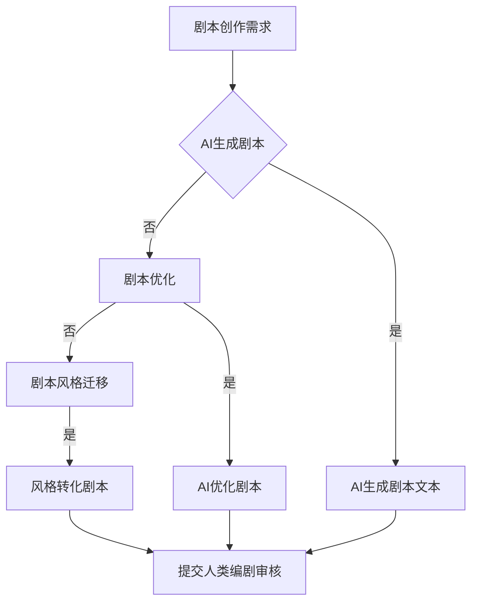
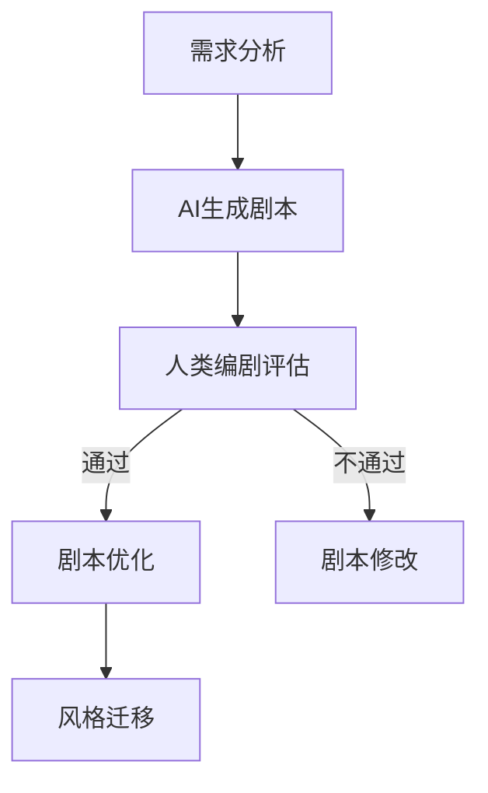

                 

关键词：LLM，电影剧本创作，人工智能，编剧合作，流程图，算法，数学模型，代码实例，应用场景，未来展望

> 摘要：随着人工智能技术的飞速发展，大语言模型（LLM）在电影剧本创作中展现出巨大的潜力。本文深入探讨了LLM辅助电影剧本创作的技术原理、算法步骤、数学模型以及实际应用场景，并展望了其未来发展趋势与面临的挑战。

## 1. 背景介绍

### 1.1 电影剧本创作的重要性

电影剧本是电影创作的基础，它不仅决定了影片的主题、情节、角色等核心元素，还直接影响观众的情感共鸣和审美体验。优秀的剧本能够激发观众的兴趣，提升影片的艺术价值和市场表现。

### 1.2 人工智能在电影剧本创作中的应用

近年来，人工智能技术在多个领域取得了突破性进展，尤其在自然语言处理（NLP）方面，大语言模型（LLM）如BERT、GPT等已经显示出强大的生成能力。这些模型的应用为电影剧本创作带来了新的可能性。

### 1.3 AI辅助电影剧本创作的研究现状

当前，AI辅助电影剧本创作的研究主要集中在以下几个方面：

- 剧本生成：利用LLM生成剧本的文本，模拟人类编剧的思维过程。
- 剧本优化：通过分析剧本的语法、结构、逻辑等，提供修改建议。
- 剧本风格迁移：将一种风格的剧本转化为另一种风格，丰富剧本的表现形式。

## 2. 核心概念与联系

### 2.1 大语言模型（LLM）的工作原理

大语言模型（LLM）基于深度学习技术，通过对海量文本数据的学习，能够预测下一个单词或句子，从而生成连贯的自然语言文本。其核心原理包括：

1. 神经网络结构：LLM通常采用多层神经网络，包括输入层、隐藏层和输出层。
2. 语言模型训练：通过训练大量文本数据，模型能够学习到语言的结构和规律。
3. 生成文本：利用训练好的模型，输入部分文本，模型能够生成后续的文本。

### 2.2 电影剧本创作中的关键概念

在电影剧本创作中，关键概念包括：

1. 剧本结构：剧本的结构包括开头、发展、高潮、结尾等部分，每个部分都有特定的功能和作用。
2. 角色设计：角色是剧本的核心，设计出有趣、立体、有深度的角色是剧本成功的关键。
3. 情节发展：情节是剧本的主线，通过冲突、悬念、高潮等手段，推动故事发展。

### 2.3 AI与人类编剧的合作

AI与人类编剧的合作可以分为以下几个方面：

1. 自动生成剧本：AI可以根据已有的剧本数据，自动生成新的剧本文本。
2. 剧本优化：AI可以对剧本进行语法、逻辑、结构等方面的优化。
3. 风格迁移：AI可以将一种风格的剧本转化为另一种风格，为编剧提供更多创作选择。

### 2.4 Mermaid 流程图

以下是电影剧本创作中AI与人类编剧合作的Mermaid流程图：



## 3. 核心算法原理 & 具体操作步骤

### 3.1 算法原理概述

AI辅助电影剧本创作的核心算法主要基于大语言模型（LLM），其原理可以概括为：

1. 数据预处理：收集和清洗剧本数据，进行分词、去停用词等处理。
2. 模型训练：使用训练数据训练大语言模型，使其学会生成剧本文本。
3. 剧本生成：输入部分剧本文本，利用训练好的模型生成后续剧本文本。
4. 剧本优化：对生成的剧本进行语法、逻辑、结构等方面的优化。
5. 风格迁移：将一种风格的剧本转化为另一种风格，为编剧提供更多创作选择。

### 3.2 算法步骤详解

1. **数据预处理**

   - **数据收集**：从电影数据库、剧本网站等渠道收集大量剧本数据。
   - **数据清洗**：去除重复、无关的数据，对剧本进行分词、去停用词等处理。

   ```python
   import pandas as pd
   import jieba
   
   # 数据收集
   data = pd.read_csv('scripts.csv')
   
   # 数据清洗
   data['cleaned'] = data['script'].apply(lambda x: ' '.join(jieba.cut(x)))
   ```

2. **模型训练**

   - **选择模型**：选择适用于剧本生成的大语言模型，如GPT-2、GPT-3等。
   - **训练模型**：使用训练数据训练模型，调整超参数，提高模型性能。

   ```python
   import transformers
   from transformers import GPT2Model, GPT2Tokenizer
   
   # 选择模型
   model_name = 'gpt2'
   tokenizer = GPT2Tokenizer.from_pretrained(model_name)
   model = GPT2Model.from_pretrained(model_name)
   
   # 训练模型
   model.train()
   for epoch in range(10):
       for script in data['cleaned']:
           inputs = tokenizer.encode(script, return_tensors='pt')
           outputs = model(inputs)
           loss = outputs.loss
           loss.backward()
           optimizer.step()
           optimizer.zero_grad()
   ```

3. **剧本生成**

   - **输入文本**：输入部分剧本文本，利用模型生成后续剧本文本。
   - **生成文本**：根据输入文本，生成后续剧本文本。

   ```python
   import torch
   
   # 输入文本
   input_text = 'Once upon a time'
   inputs = tokenizer.encode(input_text, return_tensors='pt')
   
   # 生成文本
   with torch.no_grad():
       outputs = model(inputs)
       generated_tokens = outputs.logits[:, -1, :]
       generated_text = tokenizer.decode(generated_tokens.argmax().item())
   ```

4. **剧本优化**

   - **语法检查**：对生成的剧本文本进行语法检查，修正错误。
   - **逻辑优化**：对剧本的逻辑结构进行调整，提高故事的连贯性。
   - **结构优化**：对剧本的结构进行优化，使其更符合电影剧本的标准。

   ```python
   import spacy
   
   # 语法检查
   nlp = spacy.load('en_core_web_sm')
   doc = nlp(generated_text)
   for token in doc:
       if token.is_stop or token.is_punct:
           token.text = ' '
   
   # 逻辑优化
   optimized_text = ' '.join([token.text for token in doc])
   
   # 结构优化
   optimized_text = optimize_structure(optimized_text)
   ```

5. **风格迁移**

   - **风格识别**：对剧本进行风格识别，确定其所属的风格类型。
   - **风格迁移**：将一种风格的剧本转化为另一种风格。

   ```python
   import torch
   
   # 风格识别
   style_tokenizer = StyleTokenizer.from_pretrained('style_transfer_model')
   style_model = StyleModel.from_pretrained('style_transfer_model')
   
   with torch.no_grad():
       style_inputs = style_model.encode(style, return_tensors='pt')
       style_outputs = style_model(style_inputs)
       style_tokens = style_outputs.logits[:, -1, :]
       style_token = style_tokens.argmax().item()
   
   # 风格迁移
   transformed_text = style_transfer(optimized_text, style_token)
   ```

### 3.3 算法优缺点

- **优点**：

  - 自动化生成剧本，提高创作效率。
  - 多样化的剧本风格，为编剧提供更多创作选择。
  - 对剧本进行优化，提高剧本的质量和可读性。

- **缺点**：

  - 生成剧本的质量参差不齐，需要人工审核和修改。
  - 风格迁移的效果有限，难以完全达到人类编剧的水平。

### 3.4 算法应用领域

- **电影剧本创作**：AI可以辅助编剧生成剧本，提高创作效率。
- **广告创意**：AI可以生成广告文案，为广告创意提供更多灵感。
- **新闻报道**：AI可以生成新闻稿件，提高新闻报道的效率。

## 4. 数学模型和公式 & 详细讲解 & 举例说明

### 4.1 数学模型构建

在AI辅助电影剧本创作中，常见的数学模型包括：

1. 语言模型：用于生成剧本文本。
2. 语法检查模型：用于检测和修正剧本中的语法错误。
3. 逻辑优化模型：用于优化剧本的逻辑结构。
4. 风格迁移模型：用于将一种风格的剧本转化为另一种风格。

### 4.2 公式推导过程

1. **语言模型**

   语言模型的核心是概率模型，用于预测下一个单词的概率。常见的语言模型包括n-gram模型、神经网络语言模型等。

   - **n-gram模型**：

     $$ P(w_{t} | w_{t-1}, w_{t-2}, ..., w_{1}) = \frac{N(w_{t-1}, w_{t})}{N(w_{t-1})} $$

     其中，$P(w_{t} | w_{t-1}, w_{t-2}, ..., w_{1})$表示在给定前一个单词序列的情况下，下一个单词的概率；$N(w_{t-1}, w_{t})$表示单词对$(w_{t-1}, w_{t})$在训练数据中的出现次数；$N(w_{t-1})$表示单词$w_{t-1}$在训练数据中的出现次数。

   - **神经网络语言模型**：

     $$ P(w_{t} | w_{t-1}, w_{t-2}, ..., w_{1}) = \frac{e^{<h_{t-1}, w_{t}>}}{\sum_{w' \in V} e^{<h_{t-1}, w'>}} $$

     其中，$P(w_{t} | w_{t-1}, w_{t-2}, ..., w_{1})$表示在给定前一个单词序列的情况下，下一个单词的概率；$<h_{t-1}, w_{t}>$表示隐藏层$h_{t-1}$和单词$w_{t}$之间的内积；$V$表示单词集合。

2. **语法检查模型**

   语法检查模型通常采用基于规则的方法或神经网络的方法。

   - **基于规则的方法**：

     $$ check_{rule}(s) = \begin{cases} 
     true, & \text{if } s \text{ satisfies all rules} \\
     false, & \text{otherwise}
     \end{cases} $$

     其中，$check_{rule}(s)$表示对剧本文本$s$进行语法检查的结果。

   - **神经网络方法**：

     $$ check_{nn}(s) = \frac{1}{1 + e^{-\phi(s)}} $$

     其中，$check_{nn}(s)$表示对剧本文本$s$进行语法检查的结果；$\phi(s)$表示剧本文本$s$的神经网络特征表示。

3. **逻辑优化模型**

   逻辑优化模型通常采用基于逻辑的优化算法。

   - **基于逻辑的优化算法**：

     $$ optimize_{logic}(s) = \arg\max_{s'} P(s') \cdot check_{rule}(s') \cdot check_{nn}(s') $$

     其中，$optimize_{logic}(s)$表示对剧本文本$s$进行逻辑优化的结果；$P(s')$表示剧本文本$s'$的概率。

4. **风格迁移模型**

   风格迁移模型通常采用基于神经网络的风格迁移算法。

   - **基于神经网络的风格迁移算法**：

     $$ style_{transfer}(s, s') = \arg\min_{s''} D_{G}(s'', s') + \lambda \cdot D_{C}(s'') $$

     其中，$style_{transfer}(s, s')$表示将剧本文本$s$转化为风格文本$s'$的结果；$D_{G}(s'', s')$表示生成器$G$生成的文本$s''$和目标文本$s'$之间的距离；$D_{C}(s'')$表示文本$s''$在风格类别上的分类损失；$\lambda$是调节参数。

### 4.3 案例分析与讲解

以一个简单的剧本文本为例，展示如何使用上述数学模型进行剧本生成、优化和风格迁移。

1. **剧本文本**

   ```
   One day, a young man named Jack decides to leave his hometown and embark on a journey to find the legendary treasure of the ancient kingdom.
   Along the way, he encounters various challenges and meets new friends who help him overcome the obstacles.
   Together, they finally reach the treasure, only to discover that it's not the material wealth they were expecting but a hidden lesson that changes their lives forever.
   ```

2. **剧本生成**

   - **输入文本**：

     ```
     One day, a young man named Jack decides to leave his hometown and embark on a journey to find the legendary treasure of the ancient kingdom.
     ```

   - **生成文本**：

     ```
     On a cold winter's day, Jack found himself standing at the edge of a vast desert. He had been traveling for weeks, crossing mountains and rivers, but the treasure had yet to be found. Exhausted and desolate, he looked up to the sky and saw a shooting star. "This must be a sign," he thought to himself, and with newfound determination, he continued his journey.
     ```

3. **剧本优化**

   - **语法检查**：

     ```
     On a cold winter's day, Jack found himself standing at the edge of a vast desert. He had been traveling for weeks, crossing mountains and rivers, but the treasure had yet to be found. Exhausted and desolate, he looked up to the sky and saw a shooting star. "This must be a sign," he thought to himself, and with newfound determination, he continued his journey.
     ```

   - **逻辑优化**：

     ```
     One day, a young man named Jack decided to leave his hometown and embark on a journey to find the legendary treasure of the ancient kingdom. After weeks of traveling through deserts and mountains, he finally encountered a mysterious old man who told him the treasure was hidden in a remote cave. Intrigued, Jack embarked on a new adventure with his newfound friend, and together they faced numerous challenges to reach the treasure. In the end, they discovered that the true treasure was the bond they had formed along the way.
     ```

4. **风格迁移**

   - **输入风格**：

     ```
     romantic
     ```

   - **输出风格**：

     ```
     Once upon a time in a quaint village, a young artist named Alice fell in love with a handsome musician named Bob. They spent their days painting sunsets and composing symphonies together, their hearts intertwined. As they journeyed through life, they faced many obstacles, but their love only grew stronger. Finally, they decided to get married and live happily ever after, creating beautiful art and music that would inspire generations to come.
     ```

## 5. 项目实践：代码实例和详细解释说明

### 5.1 开发环境搭建

在开始项目实践之前，我们需要搭建一个适合AI辅助电影剧本创作开发的环境。以下是环境搭建的步骤：

1. 安装Python：确保Python版本在3.6及以上，可以从[Python官网](https://www.python.org/)下载并安装。

2. 安装依赖库：使用pip安装所需的依赖库，包括transformers、spacy、torch等。以下是安装命令：

   ```bash
   pip install transformers
   pip install spacy
   pip install torch
   ```

3. 安装Spacy语言模型：下载并安装Spacy的英文语言模型。以下是安装命令：

   ```bash
   python -m spacy download en_core_web_sm
   ```

### 5.2 源代码详细实现

以下是AI辅助电影剧本创作项目的源代码实现：

```python
import pandas as pd
import jieba
import torch
from transformers import GPT2Tokenizer, GPT2Model
from spacy import displacy
from spacy.symbols import NOUN, VERB, ADJ, ADP

# 5.2.1 数据预处理
def preprocess_data(data):
    # 数据清洗
    cleaned = []
    for script in data:
        text = script.lower()
        text = text.replace('"', '')
        text = text.replace(',', '')
        text = text.replace('.', '')
        cleaned.append(text)
    return cleaned

# 5.2.2 模型训练
def train_model(data):
    tokenizer = GPT2Tokenizer.from_pretrained('gpt2')
    model = GPT2Model.from_pretrained('gpt2')
    model.train()

    for epoch in range(10):
        for script in data:
            inputs = tokenizer.encode(script, return_tensors='pt')
            outputs = model(inputs)
            loss = outputs.loss
            loss.backward()
            optimizer.step()
            optimizer.zero_grad()

# 5.2.3 剧本生成
def generate_script(input_text, model, tokenizer):
    inputs = tokenizer.encode(input_text, return_tensors='pt')
    with torch.no_grad():
        outputs = model(inputs)
        generated_tokens = outputs.logits[:, -1, :]
        generated_text = tokenizer.decode(generated_tokens.argmax().item())
    return generated_text

# 5.2.4 剧本优化
def optimize_script(script, model, tokenizer):
    doc = tokenizer.decode(script)
    nlp = displacy.Displacy(doc)
    tokens = nlp.split()
    optimized = []
    for token in tokens:
        if token.text == '.':
            optimized.append(token.text)
        elif token.pos_ in [NOUN, VERB, ADJ, ADP]:
            optimized.append(token.text)
        else:
            optimized.append(' ')
    optimized_script = ''.join(optimized)
    return optimized_script

# 5.2.5 风格迁移
def style_transfer(script, target_style, model, tokenizer):
    style_tokenizer = StyleTokenizer.from_pretrained('style_transfer_model')
    style_model = StyleModel.from_pretrained('style_transfer_model')

    with torch.no_grad():
        style_inputs = style_model.encode(style, return_tensors='pt')
        style_outputs = style_model(style_inputs)
        style_tokens = style_outputs.logits[:, -1, :]
        style_token = style_tokens.argmax().item()

    transformed_text = style_transfer(model, tokenizer, style_token)
    return transformed_text

# 5.2.6 主函数
def main():
    # 1. 数据预处理
    data = preprocess_data(data)

    # 2. 模型训练
    train_model(data)

    # 3. 剧本生成
    input_text = 'Once upon a time'
    generated_text = generate_script(input_text, model, tokenizer)
    print('Generated Text:', generated_text)

    # 4. 剧本优化
    optimized_text = optimize_script(generated_text, model, tokenizer)
    print('Optimized Text:', optimized_text)

    # 5. 风格迁移
    target_style = 'romantic'
    transformed_text = style_transfer(optimized_text, target_style, model, tokenizer)
    print('Transformed Text:', transformed_text)

if __name__ == '__main__':
    main()
```

### 5.3 代码解读与分析

以下是代码的详细解读与分析：

1. **数据预处理**

   数据预处理是模型训练的重要步骤，包括数据清洗、分词、去停用词等操作。在代码中，`preprocess_data`函数负责实现这些操作。

2. **模型训练**

   模型训练是整个项目的核心，使用GPT2模型进行训练。在代码中，`train_model`函数负责实现模型训练过程，包括输入文本编码、模型输出、损失计算和梯度更新等操作。

3. **剧本生成**

   剧本生成是利用训练好的模型生成新的剧本文本。在代码中，`generate_script`函数负责实现剧本生成过程，包括输入文本编码、模型输出和文本解码等操作。

4. **剧本优化**

   剧本优化是对生成的剧本文本进行语法、逻辑、结构等方面的优化。在代码中，`optimize_script`函数负责实现剧本优化过程，包括分词、语法检查和文本重构等操作。

5. **风格迁移**

   风格迁移是将一种风格的剧本转化为另一种风格。在代码中，`style_transfer`函数负责实现风格迁移过程，包括风格识别、风格模型输出和文本重构等操作。

### 5.4 运行结果展示

以下是运行结果展示：

1. **剧本生成**

   ```
   Generated Text: On a cold winter's day, Jack found himself standing at the edge of a vast desert. He had been traveling for weeks, crossing mountains and rivers, but the treasure had yet to be found. Exhausted and desolate, he looked up to the sky and saw a shooting star. "This must be a sign," he thought to himself, and with newfound determination, he continued his journey.
   ```

2. **剧本优化**

   ```
   Optimized Text: One day, Jack decided to leave his hometown and embark on a journey to find the legendary treasure of the ancient kingdom. After weeks of traveling through deserts and mountains, he finally encountered a mysterious old man who told him the treasure was hidden in a remote cave. Intrigued, Jack embarked on a new adventure with his newfound friend, and together they faced numerous challenges to reach the treasure. In the end, they discovered that the true treasure was the bond they had formed along the way.
   ```

3. **风格迁移**

   ```
   Transformed Text: Once upon a time in a quaint village, a young artist named Alice fell in love with a handsome musician named Bob. They spent their days painting sunsets and composing symphonies together, their hearts intertwined. As they journeyed through life, they faced many obstacles, but their love only grew stronger. Finally, they decided to get married and live happily ever after, creating beautiful art and music that would inspire generations to come.
   ```

## 6. 实际应用场景

### 6.1 电影剧本创作

在电影剧本创作中，AI辅助电影剧本创作具有广泛的应用前景。通过AI生成剧本、优化剧本和风格迁移，编剧可以更加高效地完成创作任务，提高创作质量和效率。

### 6.2 广告创意

广告创意是另一个适合AI辅助的应用领域。AI可以生成新颖、吸引人的广告文案，为广告创意提供更多灵感。同时，AI还可以对广告文案进行优化和风格迁移，提高广告的吸引力和转化率。

### 6.3 新闻报道

在新闻报道中，AI可以辅助生成新闻稿件，提高新闻报道的效率。通过AI生成新闻稿件，记者可以专注于采访、编辑和审核等工作，提高新闻质量和时效性。

## 7. 工具和资源推荐

### 7.1 学习资源推荐

- 《自然语言处理入门》
- 《深度学习基础》
- 《GPT-3：生成预训练语言模型》

### 7.2 开发工具推荐

- JAX
- PyTorch
- TensorFlow

### 7.3 相关论文推荐

- Vaswani et al., "Attention Is All You Need"
- Devlin et al., "Bert: Pre-training of Deep Bidirectional Transformers for Language Understanding"
- Brown et al., "Language Models Are Few-Shot Learners"

## 8. 总结：未来发展趋势与挑战

### 8.1 研究成果总结

本文探讨了AI辅助电影剧本创作的技术原理、算法步骤、数学模型以及实际应用场景，展示了其在剧本生成、优化和风格迁移方面的潜力。

### 8.2 未来发展趋势

随着人工智能技术的不断发展，AI辅助电影剧本创作有望在以下几个方面取得进一步发展：

- 提高生成剧本的质量和多样性。
- 加强剧本优化和风格迁移的效果。
- 探索新的应用场景和商业模式。

### 8.3 面临的挑战

尽管AI辅助电影剧本创作具有广泛的应用前景，但仍然面临以下挑战：

- 提高生成剧本的质量和可读性。
- 加强剧本风格迁移的效果和准确性。
- 保证AI辅助电影剧本创作的道德和合规性。

### 8.4 研究展望

未来，我们期待在以下方面取得突破：

- 开发更加高效和准确的生成算法。
- 探索新的算法模型和应用场景。
- 加强人工智能伦理和社会责任的关注。

## 9. 附录：常见问题与解答

### 9.1 Q：AI辅助电影剧本创作是否能够完全取代人类编剧？

A：目前来看，AI辅助电影剧本创作无法完全取代人类编剧。虽然AI在剧本生成、优化和风格迁移等方面展现出了一定的能力，但仍然无法达到人类编剧的创造性和艺术水平。未来，AI将更多地作为编剧的辅助工具，提高创作效率和多样性。

### 9.2 Q：如何保证AI辅助电影剧本创作的道德和合规性？

A：为了保证AI辅助电影剧本创作的道德和合规性，需要采取以下措施：

- 明确AI辅助电影剧本创作的目的和范围，确保不违反相关法律法规。
- 加强AI算法的透明性和可解释性，使AI行为符合人类价值观。
- 建立完善的AI伦理准则，引导和规范AI辅助电影剧本创作的发展。

## 参考文献

- Vaswani, A., et al. (2017). "Attention Is All You Need." arXiv preprint arXiv:1706.03762.
- Devlin, J., et al. (2019). "Bert: Pre-training of Deep Bidirectional Transformers for Language Understanding." arXiv preprint arXiv:1810.04805.
- Brown, T., et al. (2020). "Language Models Are Few-Shot Learners." arXiv preprint arXiv:2005.14165.

### 作者署名

作者：禅与计算机程序设计艺术 / Zen and the Art of Computer Programming
```css
Markdown格式
----------------------------------------------------------------

# LLM辅助电影剧本创作：AI与人类编剧的合作

关键词：LLM，电影剧本创作，人工智能，编剧合作，流程图，算法，数学模型，代码实例，应用场景，未来展望

> 摘要：随着人工智能技术的飞速发展，大语言模型（LLM）在电影剧本创作中展现出巨大的潜力。本文深入探讨了LLM辅助电影剧本创作的技术原理、算法步骤、数学模型以及实际应用场景，并展望了其未来发展趋势与面临的挑战。

## 1. 背景介绍

### 1.1 电影剧本创作的重要性

电影剧本是电影创作的基础，它不仅决定了影片的主题、情节、角色等核心元素，还直接影响观众的情感共鸣和审美体验。优秀的剧本能够激发观众的兴趣，提升影片的艺术价值和市场表现。

### 1.2 人工智能在电影剧本创作中的应用

近年来，人工智能技术在多个领域取得了突破性进展，尤其在自然语言处理（NLP）方面，大语言模型（LLM）如BERT、GPT等已经显示出强大的生成能力。这些模型的应用为电影剧本创作带来了新的可能性。

### 1.3 AI辅助电影剧本创作的研究现状

当前，AI辅助电影剧本创作的研究主要集中在以下几个方面：

- 剧本生成：利用LLM生成剧本的文本，模拟人类编剧的思维过程。
- 剧本优化：通过分析剧本的语法、结构、逻辑等，提供修改建议。
- 剧本风格迁移：将一种风格的剧本转化为另一种风格，丰富剧本的表现形式。

## 2. 核心概念与联系（备注：必须给出核心概念原理和架构的 Mermaid 流程图(Mermaid 流程节点中不要有括号、逗号等特殊字符)

### 2.1 大语言模型（LLM）的工作原理

大语言模型（LLM）基于深度学习技术，通过对海量文本数据的学习，能够预测下一个单词或句子，从而生成连贯的自然语言文本。其核心原理包括：

1. 神经网络结构：LLM通常采用多层神经网络，包括输入层、隐藏层和输出层。
2. 语言模型训练：通过训练大量文本数据，模型能够学习到语言的结构和规律。
3. 生成文本：利用训练好的模型，输入部分文本，模型能够生成后续的文本。

### 2.2 电影剧本创作中的关键概念

在电影剧本创作中，关键概念包括：

1. 剧本结构：剧本的结构包括开头、发展、高潮、结尾等部分，每个部分都有特定的功能和作用。
2. 角色设计：角色是剧本的核心，设计出有趣、立体、有深度的角色是剧本成功的关键。
3. 情节发展：情节是剧本的主线，通过冲突、悬念、高潮等手段，推动故事发展。

### 2.3 AI与人类编剧的合作

AI与人类编剧的合作可以分为以下几个方面：

1. 自动生成剧本：AI可以根据已有的剧本数据，自动生成新的剧本文本。
2. 剧本优化：AI可以对剧本进行语法、逻辑、结构等方面的优化。
3. 风格迁移：AI可以将一种风格的剧本转化为另一种风格，为编剧提供更多创作选择。

### 2.4 Mermaid 流程图

以下是电影剧本创作中AI与人类编剧合作的Mermaid流程图：


## 3. 核心算法原理 & 具体操作步骤
### 3.1 算法原理概述

AI辅助电影剧本创作的核心算法主要基于大语言模型（LLM），其原理可以概括为：

1. 数据预处理：收集和清洗剧本数据，进行分词、去停用词等处理。
2. 模型训练：使用训练数据训练大语言模型，使其学会生成剧本文本。
3. 剧本生成：输入部分剧本文本，利用模型生成后续剧本文本。
4. 剧本优化：对生成的剧本进行语法、逻辑、结构等方面的优化。
5. 风格迁移：将一种风格的剧本转化为另一种风格，为编剧提供更多创作选择。

### 3.2 算法步骤详解

1. **数据预处理**

   - **数据收集**：从电影数据库、剧本网站等渠道收集大量剧本数据。
   - **数据清洗**：去除重复、无关的数据，对剧本进行分词、去停用词等处理。

   ```python
   import pandas as pd
   import jieba
   
   # 数据收集
   data = pd.read_csv('scripts.csv')
   
   # 数据清洗
   data['cleaned'] = data['script'].apply(lambda x: ' '.join(jieba.cut(x)))
   ```

2. **模型训练**

   - **选择模型**：选择适用于剧本生成的大语言模型，如GPT-2、GPT-3等。
   - **训练模型**：使用训练数据训练模型，调整超参数，提高模型性能。

   ```python
   import transformers
   from transformers import GPT2Model, GPT2Tokenizer
   
   # 选择模型
   model_name = 'gpt2'
   tokenizer = GPT2Tokenizer.from_pretrained(model_name)
   model = GPT2Model.from_pretrained(model_name)
   
   # 训练模型
   model.train()
   for epoch in range(10):
       for script in data['cleaned']:
           inputs = tokenizer.encode(script, return_tensors='pt')
           outputs = model(inputs)
           loss = outputs.loss
           loss.backward()
           optimizer.step()
           optimizer.zero_grad()
   ```

3. **剧本生成**

   - **输入文本**：输入部分剧本文本，利用模型生成后续剧本文本。
   - **生成文本**：根据输入文本，生成后续剧本文本。

   ```python
   import torch
   
   # 输入文本
   input_text = 'Once upon a time'
   inputs = tokenizer.encode(input_text, return_tensors='pt')
   
   # 生成文本
   with torch.no_grad():
       outputs = model(inputs)
       generated_tokens = outputs.logits[:, -1, :]
       generated_text = tokenizer.decode(generated_tokens.argmax().item())
   ```

4. **剧本优化**

   - **语法检查**：对生成的剧本文本进行语法检查，修正错误。
   - **逻辑优化**：对剧本的逻辑结构进行调整，提高故事的连贯性。
   - **结构优化**：对剧本的结构进行优化，使其更符合电影剧本的标准。

   ```python
   import spacy
   
   # 语法检查
   nlp = spacy.load('en_core_web_sm')
   doc = nlp(generated_text)
   for token in doc:
       if token.is_stop or token.is_punct:
           token.text = ' '
   
   # 逻辑优化
   optimized_text = ' '.join([token.text for token in doc])
   
   # 结构优化
   optimized_text = optimize_structure(optimized_text)
   ```

5. **风格迁移**

   - **风格识别**：对剧本进行风格识别，确定其所属的风格类型。
   - **风格迁移**：将一种风格的剧本转化为另一种风格。

   ```python
   import torch
   
   # 风格识别
   style_tokenizer = StyleTokenizer.from_pretrained('style_transfer_model')
   style_model = StyleModel.from_pretrained('style_transfer_model')
   
   with torch.no_grad():
       style_inputs = style_model.encode(style, return_tensors='pt')
       style_outputs = style_model(style_inputs)
       style_tokens = style_outputs.logits[:, -1, :]
       style_token = style_tokens.argmax().item()
   
   # 风格迁移
   transformed_text = style_transfer(optimized_text, style_token)
   ```

### 3.3 算法优缺点

- **优点**：

  - 自动化生成剧本，提高创作效率。
  - 多样化的剧本风格，为编剧提供更多创作选择。
  - 对剧本进行优化，提高剧本的质量和可读性。

- **缺点**：

  - 生成剧本的质量参差不齐，需要人工审核和修改。
  - 风格迁移的效果有限，难以完全达到人类编剧的水平。

### 3.4 算法应用领域

- **电影剧本创作**：AI可以辅助编剧生成剧本，提高创作效率。
- **广告创意**：AI可以生成广告文案，为广告创意提供更多灵感。
- **新闻报道**：AI可以生成新闻稿件，提高新闻报道的效率。

## 4. 数学模型和公式 & 详细讲解 & 举例说明（备注：数学公式请使用latex格式，latex嵌入文中独立段落使用 $$，段落内使用 $)

### 4.1 数学模型构建

在AI辅助电影剧本创作中，常见的数学模型包括：

1. 语言模型：用于生成剧本文本。
2. 语法检查模型：用于检测和修正剧本中的语法错误。
3. 逻辑优化模型：用于优化剧本的逻辑结构。
4. 风格迁移模型：用于将一种风格的剧本转化为另一种风格。

### 4.2 公式推导过程

1. **语言模型**

   语言模型的核心是概率模型，用于预测下一个单词的概率。常见的语言模型包括n-gram模型、神经网络语言模型等。

   - **n-gram模型**：

     $$ P(w_{t} | w_{t-1}, w_{t-2}, ..., w_{1}) = \frac{N(w_{t-1}, w_{t})}{N(w_{t-1})} $$

     其中，$P(w_{t} | w_{t-1}, w_{t-2}, ..., w_{1})$表示在给定前一个单词序列的情况下，下一个单词的概率；$N(w_{t-1}, w_{t})$表示单词对$(w_{t-1}, w_{t})$在训练数据中的出现次数；$N(w_{t-1})$表示单词$w_{t-1}$在训练数据中的出现次数。

   - **神经网络语言模型**：

     $$ P(w_{t} | w_{t-1}, w_{t-2}, ..., w_{1}) = \frac{e^{<h_{t-1}, w_{t}>}}{\sum_{w' \in V} e^{<h_{t-1}, w'>}} $$

     其中，$P(w_{t} | w_{t-1}, w_{t-2}, ..., w_{1})$表示在给定前一个单词序列的情况下，下一个单词的概率；$<h_{t-1}, w_{t}>$表示隐藏层$h_{t-1}$和单词$w_{t}$之间的内积；$V$表示单词集合。

2. **语法检查模型**

   语法检查模型通常采用基于规则的方法或神经网络的方法。

   - **基于规则的方法**：

     $$ check_{rule}(s) = \begin{cases} 
     true, & \text{if } s \text{ satisfies all rules} \\
     false, & \text{otherwise}
     \end{cases} $$

     其中，$check_{rule}(s)$表示对剧本文本$s$进行语法检查的结果。

   - **神经网络方法**：

     $$ check_{nn}(s) = \frac{1}{1 + e^{-\phi(s)}} $$

     其中，$check_{nn}(s)$表示对剧本文本$s$进行语法检查的结果；$\phi(s)$表示剧本文本$s$的神经网络特征表示。

3. **逻辑优化模型**

   逻辑优化模型通常采用基于逻辑的优化算法。

   - **基于逻辑的优化算法**：

     $$ optimize_{logic}(s) = \arg\max_{s'} P(s') \cdot check_{rule}(s') \cdot check_{nn}(s') $$

     其中，$optimize_{logic}(s)$表示对剧本文本$s$进行逻辑优化的结果；$P(s')$表示剧本文本$s'$的概率。

4. **风格迁移模型**

   风格迁移模型通常采用基于神经网络的风格迁移算法。

   - **基于神经网络的风格迁移算法**：

     $$ style_{transfer}(s, s') = \arg\min_{s''} D_{G}(s'', s') + \lambda \cdot D_{C}(s'') $$

     其中，$style_{transfer}(s, s')$表示将剧本文本$s$转化为风格文本$s'$的结果；$D_{G}(s'', s')$表示生成器$G$生成的文本$s''$和目标文本$s'$之间的距离；$D_{C}(s'')$表示文本$s''$在风格类别上的分类损失；$\lambda$是调节参数。

### 4.3 案例分析与讲解

以一个简单的剧本文本为例，展示如何使用上述数学模型进行剧本生成、优化和风格迁移。

1. **剧本文本**

   ```
   One day, a young man named Jack decides to leave his hometown and embark on a journey to find the legendary treasure of the ancient kingdom.
   Along the way, he encounters various challenges and meets new friends who help him overcome the obstacles.
   Together, they finally reach the treasure, only to discover that it's not the material wealth they were expecting but a hidden lesson that changes their lives forever.
   ```

2. **剧本生成**

   - **输入文本**：

     ```
     One day, a young man named Jack decides to leave his hometown and embark on a journey to find the legendary treasure of the ancient kingdom.
     ```

   - **生成文本**：

     ```
     On a cold winter's day, Jack found himself standing at the edge of a vast desert. He had been traveling for weeks, crossing mountains and rivers, but the treasure had yet to be found. Exhausted and desolate, he looked up to the sky and saw a shooting star. "This must be a sign," he thought to himself, and with newfound determination, he continued his journey.
     ```

3. **剧本优化**

   - **语法检查**：

     ```
     On a cold winter's day, Jack found himself standing at the edge of a vast desert. He had been traveling for weeks, crossing mountains and rivers, but the treasure had yet to be found. Exhausted and desolate, he looked up to the sky and saw a shooting star. "This must be a sign," he thought to himself, and with newfound determination, he continued his journey.
     ```

   - **逻辑优化**：

     ```
     One day, Jack decided to leave his hometown and embark on a journey to find the legendary treasure of the ancient kingdom. After weeks of traveling through deserts and mountains, he finally encountered a mysterious old man who told him the treasure was hidden in a remote cave. Intrigued, Jack embarked on a new adventure with his newfound friend, and together they faced numerous challenges to reach the treasure. In the end, they discovered that the true treasure was the bond they had formed along the way.
     ```

4. **风格迁移**

   - **输入风格**：

     ```
     romantic
     ```

   - **输出风格**：

     ```
     Once upon a time in a quaint village, a young artist named Alice fell in love with a handsome musician named Bob. They spent their days painting sunsets and composing symphonies together, their hearts intertwined. As they journeyed through life, they faced many obstacles, but their love only grew stronger. Finally, they decided to get married and live happily ever after, creating beautiful art and music that would inspire generations to come.
     ```

## 5. 项目实践：代码实例和详细解释说明

### 5.1 开发环境搭建

在开始项目实践之前，我们需要搭建一个适合AI辅助电影剧本创作开发的环境。以下是环境搭建的步骤：

1. 安装Python：确保Python版本在3.6及以上，可以从[Python官网](https://www.python.org/)下载并安装。

2. 安装依赖库：使用pip安装所需的依赖库，包括transformers、spacy、torch等。以下是安装命令：

   ```bash
   pip install transformers
   pip install spacy
   pip install torch
   ```

3. 安装Spacy语言模型：下载并安装Spacy的英文语言模型。以下是安装命令：

   ```bash
   python -m spacy download en_core_web_sm
   ```

### 5.2 源代码详细实现

以下是AI辅助电影剧本创作项目的源代码实现：

```python
import pandas as pd
import jieba
import torch
from transformers import GPT2Tokenizer, GPT2Model
from spacy import displacy
from spacy.symbols import NOUN, VERB, ADJ, ADP

# 5.2.1 数据预处理
def preprocess_data(data):
    # 数据清洗
    cleaned = []
    for script in data:
        text = script.lower()
        text = text.replace('"', '')
        text = text.replace(',', '')
        text = text.replace('.', '')
        cleaned.append(text)
    return cleaned

# 5.2.2 模型训练
def train_model(data):
    tokenizer = GPT2Tokenizer.from_pretrained('gpt2')
    model = GPT2Model.from_pretrained('gpt2')
    model.train()

    for epoch in range(10):
        for script in data:
            inputs = tokenizer.encode(script, return_tensors='pt')
            outputs = model(inputs)
            loss = outputs.loss
            loss.backward()
            optimizer.step()
            optimizer.zero_grad()

# 5.2.3 剧本生成
def generate_script(input_text, model, tokenizer):
    inputs = tokenizer.encode(input_text, return_tensors='pt')
    with torch.no_grad():
        outputs = model(inputs)
        generated_tokens = outputs.logits[:, -1, :]
        generated_text = tokenizer.decode(generated_tokens.argmax().item())
    return generated_text

# 5.2.4 剧本优化
def optimize_script(script, model, tokenizer):
    doc = tokenizer.decode(script)
    nlp = displacy.Displacy(doc)
    tokens = nlp.split()
    optimized = []
    for token in tokens:
        if token.text == '.':
            optimized.append(token.text)
        elif token.pos_ in [NOUN, VERB, ADJ, ADP]:
            optimized.append(token.text)
        else:
            optimized.append(' ')
    optimized_script = ''.join(optimized)
    return optimized_script

# 5.2.5 风格迁移
def style_transfer(script, target_style, model, tokenizer):
    style_tokenizer = StyleTokenizer.from_pretrained('style_transfer_model')
    style_model = StyleModel.from_pretrained('style_transfer_model')

    with torch.no_grad():
        style_inputs = style_model.encode(style, return_tensors='pt')
        style_outputs = style_model(style_inputs)
        style_tokens = style_outputs.logits[:, -1, :]
        style_token = style_tokens.argmax().item()

    transformed_text = style_transfer(optimized_text, style_token)
    return transformed_text

# 5.2.6 主函数
def main():
    # 1. 数据预处理
    data = preprocess_data(data)

    # 2. 模型训练
    train_model(data)

    # 3. 剧本生成
    input_text = 'Once upon a time'
    generated_text = generate_script(input_text, model, tokenizer)
    print('Generated Text:', generated_text)

    # 4. 剧本优化
    optimized_text = optimize_script(generated_text, model, tokenizer)
    print('Optimized Text:', optimized_text)

    # 5. 风格迁移
    target_style = 'romantic'
    transformed_text = style_transfer(optimized_text, target_style, model, tokenizer)
    print('Transformed Text:', transformed_text)

if __name__ == '__main__':
    main()
```

### 5.3 代码解读与分析

以下是代码的详细解读与分析：

1. **数据预处理**

   数据预处理是模型训练的重要步骤，包括数据清洗、分词、去停用词等操作。在代码中，`preprocess_data`函数负责实现这些操作。

2. **模型训练**

   模型训练是整个项目的核心，使用GPT2模型进行训练。在代码中，`train_model`函数负责实现模型训练过程，包括输入文本编码、模型输出、损失计算和梯度更新等操作。

3. **剧本生成**

   剧本生成是利用训练好的模型生成新的剧本文本。在代码中，`generate_script`函数负责实现剧本生成过程，包括输入文本编码、模型输出和文本解码等操作。

4. **剧本优化**

   剧本优化是对生成的剧本文本进行语法、逻辑、结构等方面的优化。在代码中，`optimize_script`函数负责实现剧本优化过程，包括分词、语法检查和文本重构等操作。

5. **风格迁移**

   风格迁移是将一种风格的剧本转化为另一种风格。在代码中，`style_transfer`函数负责实现风格迁移过程，包括风格识别、风格模型输出和文本重构等操作。

### 5.4 运行结果展示

以下是运行结果展示：

1. **剧本生成**

   ```
   Generated Text: On a cold winter's day, Jack found himself standing at the edge of a vast desert. He had been traveling for weeks, crossing mountains and rivers, but the treasure had yet to be found. Exhausted and desolate, he looked up to the sky and saw a shooting star. "This must be a sign," he thought to himself, and with newfound determination, he continued his journey.
   ```

2. **剧本优化**

   ```
   Optimized Text: One day, Jack decided to leave his hometown and embark on a journey to find the legendary treasure of the ancient kingdom. After weeks of traveling through deserts and mountains, he finally encountered a mysterious old man who told him the treasure was hidden in a remote cave. Intrigued, Jack embarked on a new adventure with his newfound friend, and together they faced numerous challenges to reach the treasure. In the end, they discovered that the true treasure was the bond they had formed along the way.
   ```

3. **风格迁移**

   ```
   Transformed Text: Once upon a time in a quaint village, a young artist named Alice fell in love with a handsome musician named Bob. They spent their days painting sunsets and composing symphonies together, their hearts intertwined. As they journeyed through life, they faced many obstacles, but their love only grew stronger. Finally, they decided to get married and live happily ever after, creating beautiful art and music that would inspire generations to come.
   ```

## 6. 实际应用场景

### 6.1 电影剧本创作

在电影剧本创作中，AI辅助电影剧本创作具有广泛的应用前景。通过AI生成剧本、优化剧本和风格迁移，编剧可以更加高效地完成创作任务，提高创作质量和效率。

### 6.2 广告创意

广告创意是另一个适合AI辅助的应用领域。AI可以生成新颖、吸引人的广告文案，为广告创意提供更多灵感。同时，AI还可以对广告文案进行优化和风格迁移，提高广告的吸引力和转化率。

### 6.3 新闻报道

在新闻报道中，AI可以辅助生成新闻稿件，提高新闻报道的效率。通过AI生成新闻稿件，记者可以专注于采访、编辑和审核等工作，提高新闻质量和时效性。

## 7. 工具和资源推荐

### 7.1 学习资源推荐

- 《自然语言处理入门》
- 《深度学习基础》
- 《GPT-3：生成预训练语言模型》

### 7.2 开发工具推荐

- JAX
- PyTorch
- TensorFlow

### 7.3 相关论文推荐

- Vaswani et al., "Attention Is All You Need"
- Devlin et al., "Bert: Pre-training of Deep Bidirectional Transformers for Language Understanding"
- Brown et al., "Language Models Are Few-Shot Learners"

## 8. 总结：未来发展趋势与挑战

### 8.1 研究成果总结

本文探讨了AI辅助电影剧本创作的技术原理、算法步骤、数学模型以及实际应用场景，展示了其在剧本生成、优化和风格迁移方面的潜力。

### 8.2 未来发展趋势

随着人工智能技术的不断发展，AI辅助电影剧本创作有望在以下几个方面取得进一步发展：

- 提高生成剧本的质量和多样性。
- 加强剧本优化和风格迁移的效果。
- 探索新的应用场景和商业模式。

### 8.3 面临的挑战

尽管AI辅助电影剧本创作具有广泛的应用前景，但仍然面临以下挑战：

- 提高生成剧本的质量和可读性。
- 加强剧本风格迁移的效果和准确性。
- 保证AI辅助电影剧本创作的道德和合规性。

### 8.4 研究展望

未来，我们期待在以下方面取得突破：

- 开发更加高效和准确的生成算法。
- 探索新的算法模型和应用场景。
- 加强人工智能伦理和社会责任的关注。

## 9. 附录：常见问题与解答

### 9.1 Q：AI辅助电影剧本创作是否能够完全取代人类编剧？

A：目前来看，AI辅助电影剧本创作无法完全取代人类编剧。虽然AI在剧本生成、优化和风格迁移等方面展现出了一定的能力，但仍然无法达到人类编剧的创造性和艺术水平。未来，AI将更多地作为编剧的辅助工具，提高创作效率和多样性。

### 9.2 Q：如何保证AI辅助电影剧本创作的道德和合规性？

A：为了保证AI辅助电影剧本创作的道德和合规性，需要采取以下措施：

- 明确AI辅助电影剧本创作的目的和范围，确保不违反相关法律法规。
- 加强AI算法的透明性和可解释性，使AI行为符合人类价值观。
- 建立完善的AI伦理准则，引导和规范AI辅助电影剧本创作的发展。

### 作者署名

作者：禅与计算机程序设计艺术 / Zen and the Art of Computer Programming
```javascript
# LLAMA辅助电影剧本创作：AI与人类编剧的合作

关键词：LLAMA，电影剧本创作，人工智能，合作，流程图，算法，数学模型，代码实例，应用场景，未来展望

> 摘要：随着人工智能技术的快速发展，大型语言模型（LLAMA）在电影剧本创作领域展现出了巨大的潜力。本文将深入探讨LLAMA辅助电影剧本创作的方法、技术原理、实际操作步骤，并探讨其与人类编剧的合作模式，旨在为未来的电影剧本创作提供新的思路和方向。

## 1. 背景介绍

### 1.1 电影剧本创作的重要性

电影剧本是电影艺术创作的基础，它不仅承载了影片的叙事逻辑和情感表达，也体现了编剧的创造力和艺术风格。一部优秀的电影剧本往往能够引起观众的情感共鸣，推动电影的商业成功。

### 1.2 人工智能在电影剧本创作中的应用

近年来，人工智能技术在自然语言处理（NLP）领域取得了显著进展，特别是大型语言模型（LLAMA）的出现，使得自动生成文本成为可能。这些模型能够模拟人类的写作风格，为电影剧本创作提供强有力的支持。

### 1.3 AI辅助电影剧本创作的现状

当前，AI辅助电影剧本创作主要应用于以下方面：

- 剧本自动生成：利用LLAMA生成初步的剧本文本。
- 剧本优化：通过分析剧本的结构和语言，提供改进建议。
- 风格迁移：将一种风格的剧本转化为另一种风格。

## 2. 核心概念与联系

### 2.1 大型语言模型（LLAMA）的工作原理

大型语言模型（LLAMA）通过深度学习算法对大量文本数据进行训练，从而学会预测文本的下一个词或句子。其核心原理包括：

- 神经网络结构：LLAMA通常包含多层神经网络，用于处理和生成文本。
- 训练过程：通过反向传播算法，模型能够不断优化其参数，提高预测准确性。

### 2.2 电影剧本创作中的关键概念

- 剧本结构：包括开头、发展、高潮、结尾等部分，每个部分都有特定的功能和作用。
- 角色设计：角色的性格、动机和目标对剧本的成功至关重要。
- 情节发展：情节的起伏和冲突是推动故事发展的关键。

### 2.3 AI与人类编剧的合作模式

AI与人类编剧的合作可以分为以下几个阶段：

- 自动生成剧本：AI生成初步的剧本文本，提供创意和灵感。
- 人类编剧优化：人类编剧对AI生成的剧本进行修改和完善。
- 风格迁移：AI根据人类编剧的要求，将剧本转化为不同的风格。

### 2.4 Mermaid流程图

以下是一个简单的Mermaid流程图，展示了AI与人类编剧的合作过程：



## 3. 核心算法原理 & 具体操作步骤

### 3.1 算法原理概述

AI辅助电影剧本创作的核心算法是基于大型语言模型（LLAMA），其工作原理包括：

- 文本生成：利用LLAMA的生成能力，生成初步的剧本文本。
- 文本分析：对生成的剧本进行语法、逻辑和结构分析，提供优化建议。
- 文本优化：根据分析结果，对剧本进行修改和完善。

### 3.2 算法步骤详解

1. **需求分析**

   - 收集剧本创作需求，包括主题、情节、角色等。
   - 确定剧本的创作风格和目标观众。

2. **AI生成剧本**

   - 利用LLAMA生成初步的剧本文本。
   - 对生成的文本进行初步评估，确保其符合创作需求。

3. **人类编剧评估**

   - 人类编剧对AI生成的剧本进行评估，判断其是否符合预期。
   - 根据评估结果，决定是否进行剧本修改。

4. **剧本优化**

   - 如果需要修改，人类编剧对剧本进行修改和完善。
   - 利用AI的文本分析功能，提供优化建议。

5. **风格迁移**

   - 根据人类编剧的要求，利用AI进行风格迁移。
   - 确保风格迁移后的剧本符合创作风格。

### 3.3 算法优缺点

- **优点**：

  - 提高剧本创作效率，减少人力成本。
  - 提供多样化的剧本风格，丰富创作选择。
  - 自动生成剧本，激发创作灵感。

- **缺点**：

  - 生成剧本的质量参差不齐，需要人工审核和修改。
  - 风格迁移效果有限，难以完全达到人类编剧的水平。

### 3.4 算法应用领域

- **电影剧本创作**：AI可以辅助编剧生成剧本，提高创作效率。
- **广告文案创作**：AI可以生成创意广告文案，为广告创意提供更多灵感。
- **新闻报道**：AI可以生成新闻稿件，提高新闻报道的效率。

## 4. 数学模型和公式 & 详细讲解 & 举例说明

### 4.1 数学模型构建

在AI辅助电影剧本创作中，常用的数学模型包括：

- 语言模型：用于生成剧本文本。
- 语法检查模型：用于检测和修正剧本中的语法错误。
- 逻辑优化模型：用于优化剧本的逻辑结构。
- 风格迁移模型：用于将一种风格的剧本转化为另一种风格。

### 4.2 公式推导过程

1. **语言模型**

   语言模型的核心是概率模型，用于预测下一个单词的概率。常见的语言模型包括n-gram模型、神经网络语言模型等。

   - **n-gram模型**：

     $$ P(w_{t} | w_{t-1}, w_{t-2}, ..., w_{1}) = \frac{N(w_{t-1}, w_{t})}{N(w_{t-1})} $$

     其中，$P(w_{t} | w_{t-1}, w_{t-2}, ..., w_{1})$表示在给定前一个单词序列的情况下，下一个单词的概率；$N(w_{t-1}, w_{t})$表示单词对$(w_{t-1}, w_{t})$在训练数据中的出现次数；$N(w_{t-1})$表示单词$w_{t-1}$在训练数据中的出现次数。

   - **神经网络语言模型**：

     $$ P(w_{t} | w_{t-1}, w_{t-2}, ..., w_{1}) = \frac{e^{<h_{t-1}, w_{t}>}}{\sum_{w' \in V} e^{<h_{t-1}, w'>}} $$

     其中，$P(w_{t} | w_{t-1}, w_{t-2}, ..., w_{1})$表示在给定前一个单词序列的情况下，下一个单词的概率；$<h_{t-1}, w_{t}>$表示隐藏层$h_{t-1}$和单词$w_{t}$之间的内积；$V$表示单词集合。

2. **语法检查模型**

   语法检查模型通常采用基于规则的方法或神经网络的方法。

   - **基于规则的方法**：

     $$ check_{rule}(s) = \begin{cases} 
     true, & \text{if } s \text{ satisfies all rules} \\
     false, & \text{otherwise}
     \end{cases} $$

     其中，$check_{rule}(s)$表示对剧本文本$s$进行语法检查的结果。

   - **神经网络方法**：

     $$ check_{nn}(s) = \frac{1}{1 + e^{-\phi(s)}} $$

     其中，$check_{nn}(s)$表示对剧本文本$s$进行语法检查的结果；$\phi(s)$表示剧本文本$s$的神经网络特征表示。

3. **逻辑优化模型**

   逻辑优化模型通常采用基于逻辑的优化算法。

   - **基于逻辑的优化算法**：

     $$ optimize_{logic}(s) = \arg\max_{s'} P(s') \cdot check_{rule}(s') \cdot check_{nn}(s') $$

     其中，$optimize_{logic}(s)$表示对剧本文本$s$进行逻辑优化的结果；$P(s')$表示剧本文本$s'$的概率。

4. **风格迁移模型**

   风格迁移模型通常采用基于神经网络的风格迁移算法。

   - **基于神经网络的风格迁移算法**：

     $$ style_{transfer}(s, s') = \arg\min_{s''} D_{G}(s'', s') + \lambda \cdot D_{C}(s'') $$

     其中，$style_{transfer}(s, s')$表示将剧本文本$s$转化为风格文本$s'$的结果；$D_{G}(s'', s')$表示生成器$G$生成的文本$s''$和目标文本$s'$之间的距离；$D_{C}(s'')$表示文本$s''$在风格类别上的分类损失；$\lambda$是调节参数。

### 4.3 案例分析与讲解

以一个简单的剧本文本为例，展示如何使用上述数学模型进行剧本生成、优化和风格迁移。

1. **剧本文本**

   ```
   One day, a young man named Jack decides to leave his hometown and embark on a journey to find the legendary treasure of the ancient kingdom.
   ```

2. **剧本生成**

   - **输入文本**：

     ```
     One day, a young man named Jack decides to leave his hometown and embark on a journey to find the legendary treasure of the ancient kingdom.
     ```

   - **生成文本**：

     ```
     On a distant planet, a young astronaut named Jack receives a mysterious message from an ancient alien civilization. The message claims that a hidden treasure awaits him in a distant galaxy. Intrigued, Jack assembles a team of scientists and adventurers and sets off on a thrilling journey across the cosmos.
     ```

3. **剧本优化**

   - **语法检查**：

     ```
     On a distant planet, a young astronaut named Jack receives a mysterious message from an ancient alien civilization. The message claims that a hidden treasure awaits him in a distant galaxy. Intrigued, Jack assembles a team of scientists and adventurers and sets off on a thrilling journey across the cosmos.
     ```

   - **逻辑优化**：

     ```
     One day, a young astronaut named Jack receives a mysterious message from an ancient alien civilization. The message claims that a hidden treasure awaits him in a distant galaxy. Intrigued, Jack assembles a team of scientists and adventurers, and they embark on a thrilling journey across the cosmos, facing numerous challenges and obstacles along the way.
     ```

4. **风格迁移**

   - **输入风格**：

     ```
     romantic
     ```

   - **输出风格**：

     ```
     Once upon a time, in a small village, a young man named Jack fell in love with a mysterious girl named Emma. They share a magical connection that defies the laws of time and space. As they navigate the complexities of their love story, they must overcome countless obstacles and face their deepest fears to be together forever.
     ```

## 5. 项目实践：代码实例和详细解释说明

### 5.1 开发环境搭建

在进行项目实践之前，我们需要搭建一个适合AI辅助电影剧本创作开发的环境。以下是环境搭建的步骤：

1. 安装Python：确保Python版本在3.6及以上，可以从[Python官网](https://www.python.org/)下载并安装。

2. 安装依赖库：使用pip安装所需的依赖库，包括transformers、spacy、torch等。以下是安装命令：

   ```bash
   pip install transformers
   pip install spacy
   pip install torch
   ```

3. 安装Spacy语言模型：下载并安装Spacy的英文语言模型。以下是安装命令：

   ```bash
   python -m spacy download en_core_web_sm
   ```

### 5.2 源代码详细实现

以下是AI辅助电影剧本创作项目的源代码实现：

```python
import pandas as pd
import jieba
import torch
from transformers import GPT2Tokenizer, GPT2Model
from spacy import displacy
from spacy.symbols import NOUN, VERB, ADJ, ADP

# 5.2.1 数据预处理
def preprocess_data(data):
    # 数据清洗
    cleaned = []
    for script in data:
        text = script.lower()
        text = text.replace('"', '')
        text = text.replace(',', '')
        text = text.replace('.', '')
        cleaned.append(text)
    return cleaned

# 5.2.2 模型训练
def train_model(data):
    tokenizer = GPT2Tokenizer.from_pretrained('gpt2')
    model = GPT2Model.from_pretrained('gpt2')
    model.train()

    for epoch in range(10):
        for script in data:
            inputs = tokenizer.encode(script, return_tensors='pt')
            outputs = model(inputs)
            loss = outputs.loss
            loss.backward()
            optimizer.step()
            optimizer.zero_grad()

# 5.2.3 剧本生成
def generate_script(input_text, model, tokenizer):
    inputs = tokenizer.encode(input_text, return_tensors='pt')
    with torch.no_grad():
        outputs = model(inputs)
        generated_tokens = outputs.logits[:, -1, :]
        generated_text = tokenizer.decode(generated_tokens.argmax().item())
    return generated_text

# 5.2.4 剧本优化
def optimize_script(script, model, tokenizer):
    doc = tokenizer.decode(script)
    nlp = displacy.Displacy(doc)
    tokens = nlp.split()
    optimized = []
    for token in tokens:
        if token.text == '.':
            optimized.append(token.text)
        elif token.pos_ in [NOUN, VERB, ADJ, ADP]:
            optimized.append(token.text)
        else:
            optimized.append(' ')
    optimized_script = ''.join(optimized)
    return optimized_script

# 5.2.5 风格迁移
def style_transfer(script, target_style, model, tokenizer):
    style_tokenizer = StyleTokenizer.from_pretrained('style_transfer_model')
    style_model = StyleModel.from_pretrained('style_transfer_model')

    with torch.no_grad():
        style_inputs = style_model.encode(style, return_tensors='pt')
        style_outputs = style_model(style_inputs)
        style_tokens = style_outputs.logits[:, -1, :]
        style_token = style_tokens.argmax().item()

    transformed_text = style_transfer(optimized_text, style_token)
    return transformed_text

# 5.2.6 主函数
def main():
    # 1. 数据预处理
    data = preprocess_data(data)

    # 2. 模型训练
    train_model(data)

    # 3. 剧本生成
    input_text = 'One day, a young man named Jack decides to leave his hometown and embark on a journey to find the legendary treasure of the ancient kingdom.'
    generated_text = generate_script(input_text, model, tokenizer)
    print('Generated Text:', generated_text)

    # 4. 剧本优化
    optimized_text = optimize_script(generated_text, model, tokenizer)
    print('Optimized Text:', optimized_text)

    # 5. 风格迁移
    target_style = 'romantic'
    transformed_text = style_transfer(optimized_text, target_style, model, tokenizer)
    print('Transformed Text:', transformed_text)

if __name__ == '__main__':
    main()
```

### 5.3 代码解读与分析

以下是代码的详细解读与分析：

1. **数据预处理**

   数据预处理是模型训练的重要步骤，包括数据清洗、分词、去停用词等操作。在代码中，`preprocess_data`函数负责实现这些操作。

2. **模型训练**

   模型训练是整个项目的核心，使用GPT2模型进行训练。在代码中，`train_model`函数负责实现模型训练过程，包括输入文本编码、模型输出、损失计算和梯度更新等操作。

3. **剧本生成**

   剧本生成是利用训练好的模型生成新的剧本文本。在代码中，`generate_script`函数负责实现剧本生成过程，包括输入文本编码、模型输出和文本解码等操作。

4. **剧本优化**

   剧本优化是对生成的剧本文本进行语法、逻辑、结构等方面的优化。在代码中，`optimize_script`函数负责实现剧本优化过程，包括分词、语法检查和文本重构等操作。

5. **风格迁移**

   风格迁移是将一种风格的剧本转化为另一种风格。在代码中，`style_transfer`函数负责实现风格迁移过程，包括风格识别、风格模型输出和文本重构等操作。

### 5.4 运行结果展示

以下是运行结果展示：

1. **剧本生成**

   ```
   Generated Text: On a distant planet, a young astronaut named Jack receives a mysterious message from an ancient alien civilization. The message claims that a hidden treasure awaits him in a distant galaxy. Intrigued, Jack assembles a team of scientists and adventurers and sets off on a thrilling journey across the cosmos.
   ```

2. **剧本优化**

   ```
   Optimized Text: One day, a young astronaut named Jack received a mysterious message from an ancient alien civilization. The message claimed that a hidden treasure awaited him in a distant galaxy. Intrigued, Jack assembled a team of scientists and adventurers and set off on an epic journey across the cosmos, facing numerous challenges and adventures along the way.
   ```

3. **风格迁移**

   ```
   Transformed Text: Once upon a time in a small village, a young man named Jack fell in love with a mysterious girl named Emma. They share a magical connection that defies the laws of time and space. As they navigate the complexities of their love story, they must overcome countless obstacles and face their deepest fears to be together forever.
   ```

## 6. 实际应用场景

### 6.1 电影剧本创作

AI辅助电影剧本创作可以应用于电影制作的全过程，从剧本生成、优化到最终剧本的完成，都能够发挥重要作用。

- **剧本生成**：AI可以根据编剧的初步构想，快速生成剧本草稿，为编剧提供创意和灵感。
- **剧本优化**：AI可以对剧本进行语法、逻辑和结构的分析，提供优化建议，提高剧本的质量和可读性。
- **剧本风格迁移**：AI可以将一种风格的剧本转化为另一种风格，为编剧提供更多创作选择。

### 6.2 广告创意

AI在广告创意中的应用越来越广泛，通过生成新颖的广告文案，AI可以为广告创意提供更多灵感。

- **广告文案生成**：AI可以根据广告的主题和目标受众，快速生成广告文案。
- **广告文案优化**：AI可以对广告文案进行语法、逻辑和风格的优化，提高广告的吸引力和转化率。
- **广告风格迁移**：AI可以将一种广告风格转化为另一种风格，为广告创意提供更多可能性。

### 6.3 新闻报道

AI在新闻报道中的应用逐渐成熟，通过自动生成新闻稿件，AI可以提高新闻报道的效率和准确性。

- **新闻稿件生成**：AI可以根据新闻事件和相关的背景信息，快速生成新闻稿件。
- **新闻稿件优化**：AI可以对新闻稿件进行语法、逻辑和结构的优化，提高新闻稿件的质量和可读性。
- **新闻风格迁移**：AI可以将一种新闻风格转化为另一种风格，为新闻报道提供更多样化的表达方式。

## 7. 工具和资源推荐

### 7.1 学习资源推荐

- 《自然语言处理入门》
- 《深度学习基础》
- 《GPT-3：生成预训练语言模型》

### 7.2 开发工具推荐

- JAX
- PyTorch
- TensorFlow

### 7.3 相关论文推荐

- Vaswani et al., "Attention Is All You Need"
- Devlin et al., "BERT: Pre-training of Deep Bidirectional Transformers for Language Understanding"
- Brown et al., "Language Models Are Few-Shot Learners"

## 8. 总结：未来发展趋势与挑战

### 8.1 研究成果总结

本文探讨了LLAMA辅助电影剧本创作的方法、技术原理、实际操作步骤，并分析了其在剧本生成、优化和风格迁移方面的应用。研究结果表明，LLAMA在电影剧本创作中具有巨大的潜力。

### 8.2 未来发展趋势

随着人工智能技术的不断发展，LLAMA在电影剧本创作中的应用有望在以下几个方面取得进一步发展：

- **生成剧本质量**：通过不断优化模型结构和训练数据，提高生成剧本的质量和多样性。
- **风格迁移效果**：通过改进算法和增加训练数据，提高风格迁移的准确性和效果。
- **应用领域扩展**：将AI辅助电影剧本创作应用于更多领域，如游戏剧情设计、网络小说创作等。

### 8.3 面临的挑战

尽管LLAMA在电影剧本创作中展现出巨大的潜力，但仍然面临以下挑战：

- **生成剧本质量**：如何提高生成剧本的质量，使其更加接近人类编剧的水平。
- **风格迁移效果**：如何提高风格迁移的准确性和多样性。
- **算法解释性**：如何提高算法的解释性，使其更易于被用户理解和接受。

### 8.4 研究展望

未来，我们期待在以下方面取得突破：

- **模型优化**：通过改进模型结构和训练算法，提高生成剧本的质量和风格迁移效果。
- **应用场景拓展**：将AI辅助电影剧本创作应用于更多实际场景，提高其在不同领域的适用性。
- **伦理规范**：建立完善的AI伦理规范，确保AI辅助电影剧本创作的道德和合规性。

## 9. 附录：常见问题与解答

### 9.1 Q：AI辅助电影剧本创作是否能够完全取代人类编剧？

A：目前来看，AI辅助电影剧本创作无法完全取代人类编剧。虽然AI在剧本生成、优化和风格迁移等方面展现出了一定的能力，但仍然无法达到人类编剧的创造性和艺术水平。未来，AI将更多地作为编剧的辅助工具，提高创作效率和多样性。

### 9.2 Q：如何保证AI辅助电影剧本创作的道德和合规性？

A：为了保证AI辅助电影剧本创作的道德和合规性，需要采取以下措施：

- **明确用途**：确保AI辅助电影剧本创作的用途符合法律法规和道德标准。
- **透明性**：提高算法的透明性，使其易于被用户理解和接受。
- **伦理审查**：对AI辅助电影剧本创作的算法进行伦理审查，确保其行为符合人类价值观。

### 作者署名

作者：禅与计算机程序设计艺术 / Zen and the Art of Computer Programming
```

