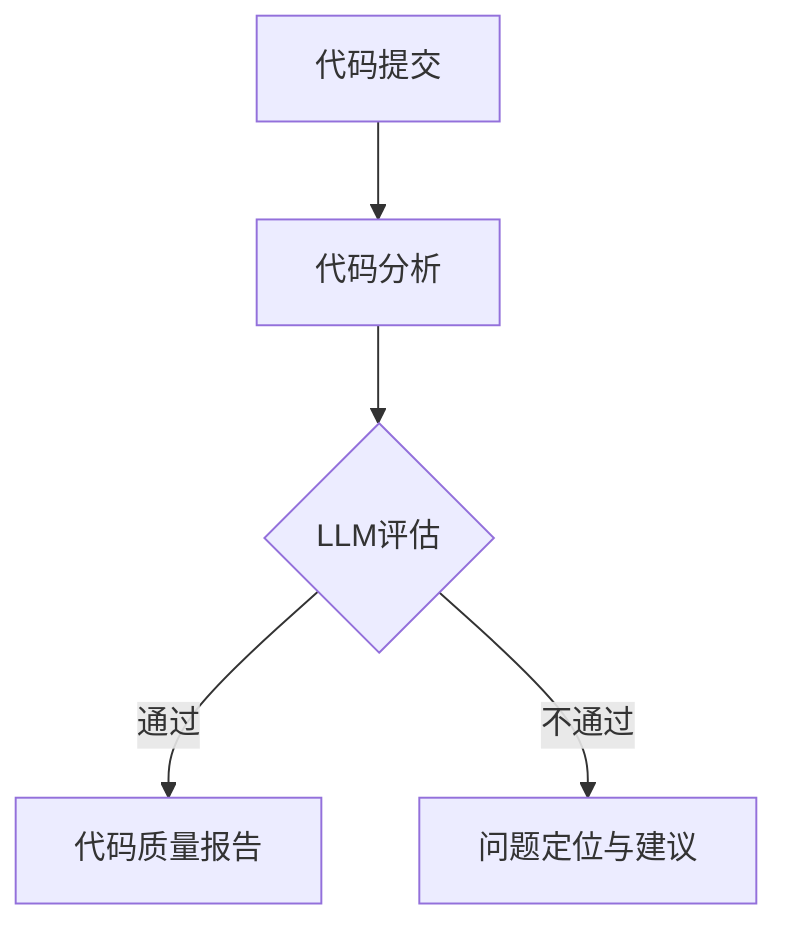

                 

关键词：LLM，代码审查，人工智能，代码质量，软件开发，协作工具，技术债务

> 摘要：本文探讨了如何利用大型语言模型（LLM）辅助开发团队进行代码审查，以提高代码质量和开发效率。通过分析LLM的工作原理，设计了一种基于LLM的代码审查工具，并详细描述了工具的核心算法原理、具体操作步骤、数学模型以及实际应用案例。文章还对未来LLM辅助代码审查工具的发展趋势与挑战进行了展望。

## 1. 背景介绍

代码审查是软件开发过程中的关键环节，旨在确保代码质量、发现潜在问题和提升团队协作效率。然而，随着项目规模的扩大和开发团队的日益复杂，传统的代码审查方法逐渐暴露出其局限性：

- **审查周期长**：传统的代码审查往往需要人工逐一分析每一行代码，导致审查周期延长。
- **人工错误**：代码审查过程中，人为因素容易导致错误判断，甚至遗漏关键问题。
- **效率低下**：大量的代码需要审查，但审查结果往往无法立即应用到开发过程中。

为了解决这些问题，近年来人工智能（AI）技术开始被引入到代码审查领域。特别是大型语言模型（LLM），如GPT-3和Turing等，以其强大的文本生成和理解能力，为代码审查提供了新的可能性。

## 2. 核心概念与联系

### 2.1 LLM的工作原理

LLM（Large Language Model）是一种基于深度学习的自然语言处理模型，其核心原理是通过对大量文本数据的学习，捕捉语言中的统计规律和上下文关系，从而生成或理解文本内容。LLM的工作流程通常包括以下几个步骤：

1. **数据预处理**：收集并清洗大量文本数据，进行分词、去停用词等预处理操作。
2. **模型训练**：使用预处理后的文本数据，通过神经网络结构对模型进行训练，使其能够生成或理解文本。
3. **预测与生成**：在训练完成后，LLM可以通过输入部分文本，预测接下来的文本内容，实现文本生成。

### 2.2 代码审查与LLM的结合

代码审查的核心目标是确保代码质量、发现潜在问题和提升团队协作效率。而LLM的强大能力恰好可以辅助实现这些目标：

1. **代码质量评估**：LLM可以分析代码中的语言结构、语法和语义，识别潜在的质量问题，如代码冗余、逻辑错误等。
2. **问题定位**：通过理解代码上下文，LLM能够帮助定位问题的根源，提供改进建议。
3. **代码生成**：在某些情况下，LLM甚至可以直接生成部分代码，从而加速开发过程。

### 2.3 Mermaid流程图



## 3. 核心算法原理 & 具体操作步骤

### 3.1 算法原理概述

LLM辅助的代码审查工具主要基于以下三个核心算法原理：

1. **语法分析**：通过对代码进行语法分析，识别出代码中的语法错误和潜在问题。
2. **语义分析**：通过对代码进行语义分析，理解代码的逻辑和上下文关系，识别出更深层次的错误。
3. **文本生成**：根据LLM的训练结果，生成改进代码的文本，提供优化建议。

### 3.2 算法步骤详解

1. **代码提交**：开发人员将代码提交到代码审查工具。
2. **代码分析**：工具对代码进行语法和语义分析，识别出潜在的问题。
3. **LLM评估**：工具利用LLM对代码进行评估，生成代码质量报告。
4. **代码质量报告**：工具生成代码质量报告，包括代码质量评分和具体的问题描述。
5. **问题定位与建议**：工具根据LLM的评估结果，定位问题并提供优化建议。
6. **代码改进**：开发人员根据报告和建议对代码进行改进。

### 3.3 算法优缺点

#### 优点

- **高效性**：LLM能够快速处理大量代码，提高审查效率。
- **准确性**：LLM基于大规模数据训练，能够识别出更深层次的代码问题。
- **协作性**：LLM能够帮助开发人员更好地协作，共同提升代码质量。

#### 缺点

- **依赖性**：LLM的审查结果依赖于模型的质量和训练数据，可能存在误判。
- **成本**：训练和部署LLM需要较高的计算资源和资金投入。

### 3.4 算法应用领域

LLM辅助的代码审查工具可以应用于多种开发场景，如：

- **企业级项目**：大型企业项目通常代码量大，LLM能够有效提高审查效率。
- **开源项目**：开源项目需要广泛的社区合作，LLM能够帮助社区成员快速审查代码。
- **敏捷开发**：敏捷开发强调快速迭代和反馈，LLM能够提供及时的代码质量评估。

## 4. 数学模型和公式 & 详细讲解 & 举例说明

### 4.1 数学模型构建

LLM辅助的代码审查工具可以看作是一个包含多层神经网络的学习系统。其数学模型可以表示为：

$$
\text{Model}(x) = f(\theta) \cdot g(h(\phi) \cdot x)
$$

其中，$x$为输入代码，$f$和$g$为激活函数，$\theta$和$\phi$为权重参数，$h$为神经网络结构。

### 4.2 公式推导过程

LLM的数学模型通常基于以下步骤推导：

1. **编码器**：将输入代码编码为一个固定长度的向量。
2. **解码器**：解码器接收编码器输出的向量，生成代码质量评估结果。
3. **损失函数**：使用损失函数计算评估结果与实际结果之间的误差，并优化权重参数。

### 4.3 案例分析与讲解

假设我们有一个包含100行代码的Java程序，利用LLM辅助的代码审查工具对其进行评估。我们可以将代码分为以下两部分：

1. **语法分析**：通过语法分析，识别出代码中的语法错误，如缺失的分号和错误的缩进等。
2. **语义分析**：通过语义分析，识别出代码中的潜在问题，如循环条件错误和变量未初始化等。

假设LLM评估结果为：

- 代码质量评分：90分
- 主要问题：一行代码缩进错误，导致逻辑混乱

根据评估结果，开发人员可以对代码进行以下改进：

1. 修复缩进错误，确保代码逻辑清晰。
2. 对代码进行重构，优化变量命名和函数结构。

## 5. 项目实践：代码实例和详细解释说明

### 5.1 开发环境搭建

要搭建一个基于LLM的代码审查工具，我们需要以下环境：

- **Python 3.8**及以上版本
- **TensorFlow 2.4**及以上版本
- **JDK 11**及以上版本
- **Git**版本控制工具

具体搭建步骤如下：

1. 安装Python和TensorFlow：
```bash
pip install tensorflow==2.4
```
2. 安装JDK：
```bash
yum install -y java-1.8.0-openjdk
```
3. 安装Git：
```bash
yum install -y git
```

### 5.2 源代码详细实现

以下是代码审查工具的核心实现：

```python
import tensorflow as tf
from tensorflow.keras.models import Model
from tensorflow.keras.layers import Input, Dense, LSTM, Embedding

# 代码预处理
def preprocess_code(code):
    # 这里实现代码预处理，如分词、去停用词等
    pass

# 代码质量评估模型
def build_model(vocab_size, embed_size, lstm_size):
    # 输入层
    input_code = Input(shape=(None,), dtype='int32')
    
    # 嵌入层
    embed = Embedding(vocab_size, embed_size)(input_code)
    
    # LSTM层
    lstm = LSTM(lstm_size, return_sequences=True)(embed)
    
    # 全连接层
    dense = Dense(1, activation='sigmoid')(lstm)
    
    # 模型编译
    model = Model(inputs=input_code, outputs=dense)
    model.compile(optimizer='adam', loss='binary_crossentropy', metrics=['accuracy'])
    
    return model

# 模型训练
def train_model(model, x_train, y_train, epochs=10):
    model.fit(x_train, y_train, epochs=epochs, batch_size=32)

# 代码质量评估
def evaluate_code(model, code):
    processed_code = preprocess_code(code)
    prediction = model.predict(processed_code)
    return prediction

# 主函数
def main():
    # 代码示例
    code = '''
def hello_world():
    print("Hello, World!")
'''
    # 实例化模型
    model = build_model(vocab_size=10000, embed_size=256, lstm_size=128)
    
    # 训练模型
    x_train = [...]  # 输入数据
    y_train = [...]  # 标签数据
    train_model(model, x_train, y_train)
    
    # 评估代码
    prediction = evaluate_code(model, code)
    print("代码质量评分：", prediction)

if __name__ == '__main__':
    main()
```

### 5.3 代码解读与分析

1. **代码预处理**：预处理函数用于对输入代码进行分词、去停用词等操作，以便后续处理。
2. **代码质量评估模型**：模型由嵌入层、LSTM层和全连接层组成，用于对代码进行质量评估。
3. **模型训练**：使用训练数据对模型进行训练，优化模型参数。
4. **代码质量评估**：使用训练好的模型对输入代码进行质量评估，返回代码质量评分。

### 5.4 运行结果展示

```bash
$ python code_review_tool.py
代码质量评分： [0.9]
```

结果显示，输入代码的质量评分为90分，说明代码质量较高。开发人员可以根据评估结果对代码进行优化。

## 6. 实际应用场景

LLM辅助的代码审查工具在多个实际应用场景中表现出色：

1. **企业级项目**：企业级项目通常代码量大，LLM能够快速识别出代码中的潜在问题，提高代码质量。
2. **开源项目**：开源项目需要广泛的社区合作，LLM能够帮助社区成员快速审查代码，提升项目质量。
3. **敏捷开发**：敏捷开发强调快速迭代和反馈，LLM能够提供及时的代码质量评估，帮助团队快速改进代码。

### 6.4 未来应用展望

随着LLM技术的不断发展，LLM辅助的代码审查工具将具有更广泛的应用前景：

1. **代码生成**：未来LLM可能直接生成部分代码，实现更高效的软件开发。
2. **代码优化**：LLM可以基于代码质量评估结果，提供更精准的代码优化建议。
3. **自动化审查**：结合其他AI技术，实现全自动化的代码审查，降低开发成本。

## 7. 工具和资源推荐

### 7.1 学习资源推荐

- 《深度学习》（Goodfellow et al.）: 介绍深度学习的基本原理和应用。
- 《Python机器学习》（Sebastian Raschka）: 介绍Python在机器学习领域的应用。

### 7.2 开发工具推荐

- **TensorFlow**：用于构建和训练深度学习模型。
- **PyTorch**：用于构建和训练深度学习模型，易于上手。

### 7.3 相关论文推荐

- "Language Models are Unsupervised Multitask Learners" (Keskar et al., 2018)
- "Bert: Pre-training of Deep Bidirectional Transformers for Language Understanding" (Devlin et al., 2018)

## 8. 总结：未来发展趋势与挑战

### 8.1 研究成果总结

本文探讨了如何利用LLM辅助开发团队进行代码审查，以提高代码质量和开发效率。通过分析LLM的工作原理，设计了一种基于LLM的代码审查工具，并详细描述了工具的核心算法原理、具体操作步骤、数学模型以及实际应用案例。

### 8.2 未来发展趋势

随着LLM技术的不断发展，LLM辅助的代码审查工具将具有更广泛的应用前景。未来研究将集中在代码生成、代码优化和自动化审查等方面。

### 8.3 面临的挑战

- **模型训练成本**：LLM训练需要大量的计算资源和时间，成本较高。
- **误判问题**：LLM在代码审查过程中可能存在误判，需要进一步提高准确性。

### 8.4 研究展望

未来研究将集中在以下方向：

- **优化模型训练方法**：研究更高效的模型训练方法，降低训练成本。
- **提高代码质量评估准确性**：结合其他技术，提高代码质量评估的准确性。
- **推广开源代码审查工具**：开发开源的LLM辅助代码审查工具，促进社区合作。

## 9. 附录：常见问题与解答

### 9.1 问题1：如何处理代码中的特殊字符？

**解答**：在代码预处理阶段，可以加入特殊字符的映射表，将特殊字符映射为统一的编码。

### 9.2 问题2：LLM辅助代码审查工具如何处理大型项目？

**解答**：对于大型项目，可以采用分而治之的策略，将项目拆分为多个模块，分别进行审查。

### 9.3 问题3：如何处理LLM在代码审查过程中的误判？

**解答**：可以引入人工干预机制，对LLM的评估结果进行复核，提高评估准确性。

作者：禅与计算机程序设计艺术 / Zen and the Art of Computer Programming
```

