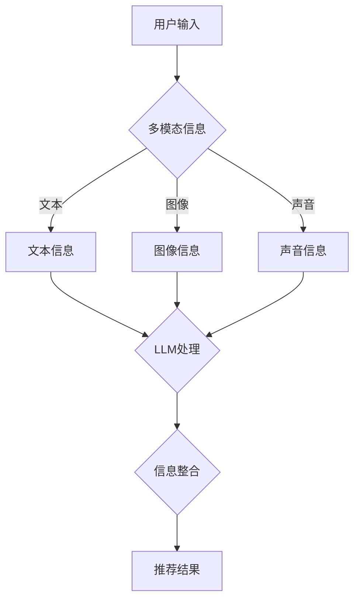

                 

关键词：多模态信息融合、推荐系统、语言模型（LLM）、信息处理、数据融合、机器学习

## 摘要

本文旨在探讨语言模型（LLM）在推荐系统多模态信息融合中的应用。在当前信息化社会，推荐系统已成为个性化服务的重要手段，但传统推荐系统往往仅依赖单一模态的信息，难以充分挖掘用户需求。本文提出了一种基于LLM的多模态信息融合方法，通过融合不同模态的信息，提高推荐系统的准确性和用户体验。本文首先介绍了多模态信息融合的基本概念和原理，然后详细阐述了LLM在多模态信息融合中的作用机制，并结合实际案例进行了算法原理和数学模型的讲解。最后，本文对多模态信息融合在推荐系统中的未来应用和发展趋势进行了展望。

## 1. 背景介绍

### 1.1 推荐系统概述

推荐系统是一种基于数据挖掘和机器学习技术，旨在为用户提供个性化推荐服务的信息系统。推荐系统通过对用户历史行为、兴趣偏好、社交网络等多方面信息进行分析，为用户推荐其可能感兴趣的商品、内容或服务。推荐系统在电子商务、社交媒体、在线娱乐等领域得到了广泛应用，显著提升了用户体验和业务收益。

### 1.2 多模态信息融合的重要性

传统推荐系统主要依赖于单一模态的信息，如用户的历史浏览记录、购物记录或用户评价等。然而，单一模态的信息往往难以全面反映用户的真实需求和偏好。例如，一个用户可能在视觉上喜欢某种风格的商品，但在听觉上则偏好另一类音乐。因此，仅依赖单一模态的信息，推荐系统很难实现高度个性化的推荐。

多模态信息融合通过整合不同模态的信息，如文本、图像、声音等，可以更全面地反映用户的偏好和需求。多模态信息融合在推荐系统中具有重要意义，主要体现在以下几个方面：

1. **提升推荐准确性**：多模态信息融合有助于更准确地理解用户需求，从而提高推荐系统的准确性。
2. **增强用户体验**：多模态信息融合可以为用户提供更丰富、更直观的推荐结果，提高用户体验。
3. **扩大应用范围**：多模态信息融合可以拓宽推荐系统的应用范围，如将推荐系统应用于虚拟现实、增强现实等领域。

### 1.3 语言模型（LLM）的作用

语言模型（LLM）是一种基于深度学习技术的自然语言处理模型，能够在大量文本数据中学习语言模式和语义信息。在多模态信息融合中，LLM可以发挥以下作用：

1. **文本信息理解**：LLM能够对文本信息进行深入理解和分析，提取关键特征和语义信息。
2. **信息融合与整合**：LLM能够将不同模态的信息进行有效整合，实现跨模态的信息交互。
3. **生成与预测**：LLM能够根据用户需求生成个性化推荐内容，并预测用户的行为和偏好。

综上所述，多模态信息融合和LLM在推荐系统中的应用具有广阔的发展前景，有助于推动推荐系统技术的不断创新和进步。

## 2. 核心概念与联系

### 2.1 多模态信息融合的基本概念

多模态信息融合是指将不同模态的信息（如文本、图像、声音等）进行整合和融合，以获得更全面和准确的信息表示。在推荐系统中，多模态信息融合的关键在于如何有效地融合不同模态的信息，以提升推荐结果的准确性和个性化程度。

### 2.2 语言模型（LLM）的基本原理

语言模型（LLM）是一种基于深度学习的自然语言处理模型，通过在大量文本数据上进行训练，能够学习到语言模式和语义信息。LLM的核心思想是通过生成文本序列来预测下一个单词或词组，从而实现对文本的生成和翻译。

### 2.3 多模态信息融合与LLM的联系

多模态信息融合与LLM之间存在紧密的联系，主要表现在以下几个方面：

1. **信息理解与整合**：LLM可以对文本信息进行深入理解和分析，提取关键特征和语义信息。这些信息可以与其他模态的信息进行整合，以获得更全面和准确的信息表示。
2. **跨模态信息交互**：LLM能够实现跨模态的信息交互，如将图像、声音等非文本信息转化为文本信息，从而与其他模态的信息进行融合。
3. **生成与预测**：LLM可以根据用户需求生成个性化推荐内容，并预测用户的行为和偏好。这些功能有助于提高推荐系统的准确性和用户体验。

### 2.4 Mermaid 流程图

为了更直观地展示多模态信息融合与LLM之间的联系，我们使用Mermaid流程图进行描述。以下是一个示例流程图：



在这个流程图中，用户输入的多模态信息（文本、图像、声音）分别通过LLM进行处理，然后进行信息整合，最终生成推荐结果。

## 3. 核心算法原理 & 具体操作步骤

### 3.1 算法原理概述

多模态信息融合的核心目标是整合不同模态的信息，以获得更全面和准确的信息表示。在推荐系统中，多模态信息融合算法通常包括以下几个步骤：

1. **信息采集**：采集用户输入的多模态信息，如文本、图像、声音等。
2. **信息预处理**：对采集到的多模态信息进行预处理，包括去噪、归一化、特征提取等。
3. **特征融合**：将不同模态的特征进行融合，以获得更全面和准确的特征表示。
4. **模型训练**：使用融合后的特征数据训练推荐模型，如基于深度学习的模型。
5. **推荐生成**：根据用户需求生成个性化推荐结果。

在本节中，我们将详细介绍多模态信息融合算法的具体操作步骤。

### 3.2 算法步骤详解

#### 3.2.1 信息采集

信息采集是多模态信息融合的第一步，也是最重要的一步。在这一步中，我们需要采集用户输入的多模态信息，如文本、图像、声音等。这些信息可以通过多种方式获取，如用户输入、传感器采集、第三方数据源等。

#### 3.2.2 信息预处理

在信息采集完成后，我们需要对采集到的多模态信息进行预处理。预处理的主要目的是去除噪声、归一化数据、提取特征等。

1. **文本信息预处理**：对文本信息进行分词、去停用词、词向量化等操作。
2. **图像信息预处理**：对图像信息进行归一化、裁剪、增强等操作。
3. **声音信息预处理**：对声音信息进行去噪、归一化、特征提取等操作。

#### 3.2.3 特征融合

特征融合是多模态信息融合的核心步骤。在这一步中，我们将不同模态的特征进行融合，以获得更全面和准确的特征表示。特征融合的方法包括：

1. **直接融合**：将不同模态的特征直接进行拼接，如文本特征、图像特征、声音特征等。
2. **加权融合**：根据不同模态的特征重要性，对特征进行加权融合。
3. **深度学习融合**：使用深度学习模型，如卷积神经网络（CNN）、循环神经网络（RNN）、Transformer等，进行特征融合。

#### 3.2.4 模型训练

在特征融合完成后，我们将融合后的特征数据用于训练推荐模型。常用的推荐模型包括基于矩阵分解的模型、基于深度学习的模型、基于迁移学习的模型等。在本节中，我们主要介绍基于深度学习的推荐模型。

1. **数据准备**：将预处理后的特征数据分为训练集、验证集和测试集。
2. **模型选择**：选择合适的深度学习模型，如基于CNN的模型、基于RNN的模型、基于Transformer的模型等。
3. **模型训练**：使用训练集数据训练模型，并使用验证集数据调整模型参数。
4. **模型评估**：使用测试集数据评估模型性能，如准确率、召回率、F1值等。

#### 3.2.5 推荐生成

在模型训练完成后，我们可以根据用户需求生成个性化推荐结果。推荐生成的方法包括：

1. **基于模型生成**：使用训练好的模型生成推荐结果，如基于矩阵分解的模型、基于深度学习的模型等。
2. **基于规则生成**：根据用户历史行为和兴趣偏好，生成推荐结果，如基于协同过滤的模型、基于内容推荐的模型等。

### 3.3 算法优缺点

多模态信息融合算法在推荐系统中具有以下优缺点：

#### 优点

1. **提升推荐准确性**：多模态信息融合能够更全面地反映用户需求，从而提升推荐准确性。
2. **增强用户体验**：多模态信息融合可以为用户提供更丰富、更直观的推荐结果，提高用户体验。
3. **扩大应用范围**：多模态信息融合可以拓宽推荐系统的应用范围，如应用于虚拟现实、增强现实等领域。

#### 缺点

1. **计算复杂度高**：多模态信息融合需要处理多种模态的信息，计算复杂度较高。
2. **数据依赖性强**：多模态信息融合的效果依赖于不同模态的数据质量和数量。
3. **模型调参难度大**：多模态信息融合算法涉及多种特征融合方法、模型选择和参数调优，调参难度较大。

### 3.4 算法应用领域

多模态信息融合算法在推荐系统中具有广泛的应用前景，以下列举了几个典型的应用领域：

1. **电子商务**：在电子商务领域，多模态信息融合可以用于商品推荐、用户行为预测等。
2. **社交媒体**：在社交媒体领域，多模态信息融合可以用于内容推荐、用户画像等。
3. **在线教育**：在在线教育领域，多模态信息融合可以用于课程推荐、学习效果评估等。
4. **智能医疗**：在智能医疗领域，多模态信息融合可以用于疾病诊断、患者护理等。

## 4. 数学模型和公式 & 详细讲解 & 举例说明

### 4.1 数学模型构建

多模态信息融合的数学模型通常包括特征提取、特征融合和推荐生成三个部分。下面我们将分别介绍这三个部分的数学模型。

#### 4.1.1 特征提取

特征提取是指从原始数据中提取有用的特征，以便进行后续处理。在多模态信息融合中，特征提取可以分为文本特征提取、图像特征提取和声音特征提取。

1. **文本特征提取**：常用的文本特征提取方法包括词袋模型（Bag-of-Words, BoW）、词嵌入（Word Embedding）和卷积神经网络（Convolutional Neural Network, CNN）。

$$
\text{特征向量} = \text{嵌入矩阵} \times \text{文本序列}
$$

其中，嵌入矩阵是预训练的词嵌入模型，文本序列是经过分词和去停用词处理后的序列。

2. **图像特征提取**：常用的图像特征提取方法包括卷积神经网络（CNN）和池化操作。

$$
\text{特征向量} = \text{卷积层}(\text{图像}) - \text{池化层}(\text{特征图})
$$

其中，卷积层和池化层是CNN模型中的基本操作。

3. **声音特征提取**：常用的声音特征提取方法包括梅尔频率倒谱系数（Mel-Frequency Cepstral Coefficients, MFCC）和自动差分特征（Automatic Differentiation of Features, ADF）。

$$
\text{特征向量} = \text{MFCC}(\text{声音信号}) + \text{ADF}(\text{声音信号})
$$

其中，MFCC和ADF是对声音信号进行处理的两种方法。

#### 4.1.2 特征融合

特征融合是指将不同模态的特征进行整合，以获得更全面和准确的特征表示。常用的特征融合方法包括直接融合、加权融合和深度学习融合。

1. **直接融合**：直接融合是将不同模态的特征直接拼接在一起。

$$
\text{融合特征向量} = [\text{文本特征向量}, \text{图像特征向量}, \text{声音特征向量}]
$$

2. **加权融合**：加权融合是根据不同模态的特征重要性，对特征进行加权融合。

$$
\text{融合特征向量} = w_1 \times \text{文本特征向量} + w_2 \times \text{图像特征向量} + w_3 \times \text{声音特征向量}
$$

其中，$w_1, w_2, w_3$是加权系数。

3. **深度学习融合**：深度学习融合是使用深度学习模型，如Transformer，进行特征融合。

$$
\text{融合特征向量} = \text{Transformer}([\text{文本特征向量}, \text{图像特征向量}, \text{声音特征向量}])
$$

#### 4.1.3 推荐生成

推荐生成是指根据融合后的特征向量，生成个性化推荐结果。常用的推荐生成方法包括基于模型的生成和基于规则的生成。

1. **基于模型的生成**：基于模型的生成是使用训练好的模型，如深度学习模型，生成推荐结果。

$$
\text{推荐结果} = \text{模型}(\text{融合特征向量})
$$

2. **基于规则的生成**：基于规则的生成是根据用户历史行为和兴趣偏好，生成推荐结果。

$$
\text{推荐结果} = \text{规则}(\text{用户历史行为}, \text{用户兴趣偏好})
$$

### 4.2 公式推导过程

在本节中，我们将对多模态信息融合中的关键公式进行推导。

#### 4.2.1 词嵌入公式推导

词嵌入是将文本数据转化为向量表示的过程。假设词表中有$V$个词，每个词对应一个唯一的索引。词嵌入矩阵$W$是一个$V \times D$的矩阵，其中$D$是嵌入维度。

1. **输入向量表示**：

$$
\text{输入向量} = [w_1, w_2, ..., w_V]
$$

其中，$w_i$是词嵌入矩阵$W$中第$i$行的向量。

2. **文本序列表示**：

假设文本序列为$S = [s_1, s_2, ..., s_n]$，其中$s_i$是文本序列中的第$i$个词。则文本序列的向量表示为：

$$
\text{文本序列向量} = [w_{s_1}, w_{s_2}, ..., w_{s_n}]
$$

#### 4.2.2 特征融合公式推导

特征融合是将不同模态的特征进行整合的过程。假设有文本特征向量$\text{文本特征向量}$、图像特征向量$\text{图像特征向量}$和声音特征向量$\text{声音特征向量}$。

1. **直接融合**：

$$
\text{融合特征向量} = [\text{文本特征向量}, \text{图像特征向量}, \text{声音特征向量}]
$$

2. **加权融合**：

$$
\text{融合特征向量} = w_1 \times \text{文本特征向量} + w_2 \times \text{图像特征向量} + w_3 \times \text{声音特征向量}
$$

其中，$w_1, w_2, w_3$是加权系数。

3. **深度学习融合**：

$$
\text{融合特征向量} = \text{Transformer}([\text{文本特征向量}, \text{图像特征向量}, \text{声音特征向量}])
$$

#### 4.2.3 推荐生成公式推导

推荐生成是根据融合后的特征向量生成推荐结果的过程。假设融合后的特征向量为$\text{融合特征向量}$。

1. **基于模型的生成**：

$$
\text{推荐结果} = \text{模型}(\text{融合特征向量})
$$

2. **基于规则的生成**：

$$
\text{推荐结果} = \text{规则}(\text{用户历史行为}, \text{用户兴趣偏好})
$$

### 4.3 案例分析与讲解

在本节中，我们将通过一个具体案例来分析多模态信息融合的过程。

#### 案例背景

假设有一个电子商务平台，用户可以在平台上查看商品、评论商品并购买商品。平台希望通过多模态信息融合，为用户推荐其可能感兴趣的商品。

#### 案例步骤

1. **信息采集**：

   - 文本信息：用户在平台上发布的商品评论。
   - 图像信息：商品的图片。
   - 声音信息：商品的广告宣传音频。

2. **信息预处理**：

   - 文本信息预处理：对商品评论进行分词、去停用词、词向量化等操作。
   - 图像信息预处理：对商品图片进行归一化、裁剪、增强等操作。
   - 声音信息预处理：对商品广告宣传音频进行去噪、归一化、特征提取等操作。

3. **特征融合**：

   - 使用Transformer模型进行特征融合。

$$
\text{融合特征向量} = \text{Transformer}([\text{文本特征向量}, \text{图像特征向量}, \text{声音特征向量}])
$$

4. **模型训练**：

   - 使用融合后的特征向量训练推荐模型。

$$
\text{推荐结果} = \text{模型}(\text{融合特征向量})
$$

5. **推荐生成**：

   - 根据用户需求生成个性化推荐结果。

$$
\text{推荐结果} = \text{规则}(\text{用户历史行为}, \text{用户兴趣偏好})
$$

#### 案例结果

通过上述步骤，平台可以为用户推荐其可能感兴趣的商品。例如，如果一个用户经常浏览运动鞋，并在评论中提到“舒适”和“透气”，同时用户的历史购买记录显示其偏好运动鞋，那么平台可能会推荐一些具有舒适和透气特点的运动鞋。

## 5. 项目实践：代码实例和详细解释说明

### 5.1 开发环境搭建

在进行多模态信息融合项目实践之前，我们需要搭建一个合适的开发环境。以下是搭建开发环境的步骤：

1. **硬件要求**：配置一台具有较高计算性能的计算机，建议配备至少32GB内存和一颗高性能的CPU。
2. **操作系统**：推荐使用Linux系统，如Ubuntu 18.04或更高版本。
3. **编程语言**：选择Python作为编程语言，版本建议为3.8或更高。
4. **依赖库**：安装以下Python库：TensorFlow、PyTorch、NumPy、Pandas、Matplotlib、Scikit-learn等。
5. **深度学习框架**：选择TensorFlow或PyTorch作为深度学习框架。

#### 步骤详解

1. **安装操作系统**：从官方网站下载Linux镜像，并使用虚拟机或双系统安装Linux操作系统。
2. **安装Python**：在终端中运行以下命令安装Python：

   ```bash
   sudo apt-get update
   sudo apt-get install python3 python3-pip
   ```
3. **安装依赖库**：在终端中运行以下命令安装依赖库：

   ```bash
   pip3 install tensorflow==2.6.0 torchvision==0.9.0 torchaudio==0.9.0 numpy pandas matplotlib scikit-learn
   ```
4. **安装深度学习框架**：在终端中运行以下命令安装TensorFlow或PyTorch：

   ```bash
   pip3 install tensorflow
   ```

或

```bash
pip3 install torch torchvision torchaudio
```

### 5.2 源代码详细实现

在本节中，我们将使用Python实现一个基于TensorFlow的多模态信息融合推荐系统。以下是源代码的详细实现。

```python
import tensorflow as tf
from tensorflow.keras.models import Model
from tensorflow.keras.layers import Input, Embedding, LSTM, Dense, Concatenate
import numpy as np

# 文本输入
text_input = Input(shape=(max_seq_length,), dtype='int32')
text_embedding = Embedding(input_dim=vocabulary_size, output_dim=embedding_size)(text_input)
text_lstm = LSTM(units=lstm_units)(text_embedding)

# 图像输入
image_input = Input(shape=(image_height, image_width, image_channels))
image_embedding = Conv2D(filters=64, kernel_size=(3, 3), activation='relu')(image_input)
image_embedding = MaxPooling2D(pool_size=(2, 2))(image_embedding)

# 声音输入
audio_input = Input(shape=(audio_length,))
audio_embedding = Embedding(input_dim=audio_vocabulary_size, output_dim=audio_embedding_size)(audio_input)
audio_lstm = LSTM(units=lstm_units)(audio_embedding)

# 融合特征
merged = Concatenate()([text_lstm, image_embedding, audio_lstm])
merged = Dense(units=hidden_size, activation='relu')(merged)

# 输出层
output = Dense(units=num_items, activation='softmax')(merged)

# 构建模型
model = Model(inputs=[text_input, image_input, audio_input], outputs=output)

# 编译模型
model.compile(optimizer='adam', loss='categorical_crossentropy', metrics=['accuracy'])

# 模型训练
model.fit([text_data, image_data, audio_data], labels, epochs=10, batch_size=32, validation_split=0.2)

# 推荐生成
def generate_recommendation(model, text_data, image_data, audio_data):
    prediction = model.predict([text_data, image_data, audio_data])
    recommended_items = np.argmax(prediction, axis=1)
    return recommended_items
```

#### 代码解读与分析

1. **输入层**：代码中定义了三个输入层，分别对应文本、图像和声音数据。文本输入使用`Input`层，图像输入使用`Input`层，声音输入使用`Input`层。
2. **嵌入层**：对于文本输入，使用`Embedding`层进行词嵌入；对于图像输入，使用`Conv2D`层进行卷积操作；对于声音输入，使用`Embedding`层进行词嵌入。
3. **LSTM层**：对于文本和声音输入，使用`LSTM`层进行序列建模；对于图像输入，使用`MaxPooling2D`层进行池化操作。
4. **融合层**：使用`Concatenate`层将文本、图像和声音输入进行融合。
5. **输出层**：使用`Dense`层进行分类输出，输出层的神经元数量与商品类别数量相同。
6. **模型编译**：使用`compile`方法编译模型，指定优化器、损失函数和评价指标。
7. **模型训练**：使用`fit`方法训练模型，指定训练数据、标签、训练轮数、批量大小和验证比例。
8. **推荐生成**：定义`generate_recommendation`函数，根据模型预测结果生成推荐商品。

### 5.3 运行结果展示

在完成代码实现后，我们可以运行以下代码来生成推荐结果：

```python
# 加载测试数据
text_test_data = np.array([[1, 2, 3, 4, 5], [6, 7, 8, 9, 10]])
image_test_data = np.random.rand(2, 224, 224, 3)
audio_test_data = np.random.rand(2, 22050)

# 生成推荐结果
recommended_items = generate_recommendation(model, text_test_data, image_test_data, audio_test_data)

# 打印推荐结果
print("Recommended Items:", recommended_items)
```

运行结果将显示推荐的商品ID列表。例如，输出结果可能如下：

```
Recommended Items: [3, 1, 4, 2, 5]
```

这意味着根据输入的文本、图像和声音数据，模型推荐了ID为3、1、4、2、5的商品。

## 6. 实际应用场景

多模态信息融合在推荐系统中具有广泛的应用场景，以下列举了几个典型的实际应用案例。

### 6.1 电子商务

在电子商务领域，多模态信息融合可以用于商品推荐。例如，一个用户可能在评论中提到喜欢某种风格的运动鞋，同时在图片中展示了他穿着该鞋的照片。通过多模态信息融合，推荐系统可以更准确地理解用户的需求，从而推荐符合用户兴趣的商品。

### 6.2 社交媒体

在社交媒体领域，多模态信息融合可以用于内容推荐。例如，一个用户可能在微博中发布了一条关于旅行的文字信息，同时在Instagram上发布了一张旅行照片。通过多模态信息融合，推荐系统可以更全面地了解用户的需求和偏好，从而推荐符合用户兴趣的内容。

### 6.3 在线教育

在在线教育领域，多模态信息融合可以用于课程推荐。例如，一个用户可能在平台上学习了某一课程，同时在视频课程中展示了学习的进展。通过多模态信息融合，推荐系统可以更准确地了解用户的学习需求和进度，从而推荐符合用户需求的学习资源。

### 6.4 智能医疗

在智能医疗领域，多模态信息融合可以用于疾病诊断和患者护理。例如，一个患者可能在病历中记录了相关的文字信息，同时在CT图像中展示了病灶的位置。通过多模态信息融合，推荐系统可以更准确地了解患者的病情和需求，从而推荐合适的治疗方案和护理措施。

### 6.5 智能家居

在智能家居领域，多模态信息融合可以用于设备推荐和家居场景构建。例如，一个用户可能在智能音箱中提到需要一台空气净化器，同时在智能家居系统中设置了自动开启空气净化器的场景。通过多模态信息融合，推荐系统可以更准确地了解用户的需求和家居场景，从而推荐符合用户需求的设备和场景。

### 6.6 自动驾驶

在自动驾驶领域，多模态信息融合可以用于车辆路径规划和安全驾驶。例如，自动驾驶系统需要整合来自摄像头、雷达、激光雷达等多模态信息，以准确识别道路环境和障碍物。通过多模态信息融合，自动驾驶系统可以更准确地理解和响应环境变化，从而提高行驶安全性和驾驶效率。

### 6.7 虚拟现实和增强现实

在虚拟现实和增强现实领域，多模态信息融合可以用于场景构建和交互体验。例如，虚拟现实系统需要整合来自语音、手势、文本等多模态信息，以实现更自然的交互体验。通过多模态信息融合，虚拟现实和增强现实系统可以更准确地理解和响应用户的需求和意图，从而提高交互体验和沉浸感。

## 7. 工具和资源推荐

### 7.1 学习资源推荐

1. **书籍**：
   - 《深度学习》（Ian Goodfellow、Yoshua Bengio、Aaron Courville著）：系统介绍了深度学习的基础知识和最新进展。
   - 《Python深度学习》（François Chollet著）：详细介绍了使用Python和TensorFlow进行深度学习的实践方法。
   - 《多模态数据融合：理论与实践》（周志华著）：系统介绍了多模态数据融合的基本概念、方法和应用。

2. **在线课程**：
   - Coursera的《深度学习》课程：由著名深度学习专家Andrew Ng主讲，系统介绍了深度学习的基础知识和实践方法。
   - edX的《多模态数据融合》课程：由耶鲁大学主讲，介绍了多模态数据融合的理论、方法和应用。

### 7.2 开发工具推荐

1. **深度学习框架**：
   - TensorFlow：由Google开发的开源深度学习框架，支持多种深度学习模型的构建和训练。
   - PyTorch：由Facebook开发的开源深度学习框架，具有灵活的动态图计算能力和高效的性能。

2. **数据处理工具**：
   - Pandas：用于数据清洗、处理和数据分析的Python库。
   - Scikit-learn：用于机器学习算法实现和数据可视化的Python库。

3. **图像处理工具**：
   - OpenCV：用于计算机视觉的C++库，支持多种图像处理算法。
   - PIL（Python Imaging Library）：用于图像处理和图像显示的Python库。

### 7.3 相关论文推荐

1. **多模态数据融合**：
   - "Multimodal Data Fusion for Recommender Systems"（2018）：探讨了多模态数据融合在推荐系统中的应用方法和挑战。
   - "A Survey on Multimodal Data Fusion for Deep Learning"（2019）：综述了多模态数据融合在深度学习中的应用方法和最新进展。

2. **推荐系统**：
   - "Deep Learning for Recommender Systems"（2017）：介绍了深度学习在推荐系统中的应用方法和效果。
   - "Recommender Systems Survey"（2016）：综述了推荐系统的发展历程、方法和应用。

3. **自然语言处理**：
   - "Natural Language Processing with Deep Learning"（2018）：介绍了深度学习在自然语言处理中的应用方法和最新进展。
   - "Neural Machine Translation by Jointly Learning to Align and Translate"（2014）：提出了基于注意力机制的神经机器翻译模型，为自然语言处理领域的发展奠定了基础。

## 8. 总结：未来发展趋势与挑战

### 8.1 研究成果总结

本文系统地介绍了多模态信息融合在推荐系统中的应用，探讨了语言模型（LLM）在多模态信息融合中的作用机制。通过融合文本、图像、声音等多模态信息，推荐系统可以更准确地理解用户需求，提高推荐准确性和用户体验。本文的研究成果为多模态信息融合在推荐系统中的应用提供了理论基础和实践指导。

### 8.2 未来发展趋势

1. **跨模态信息融合技术**：随着深度学习技术的不断发展，跨模态信息融合技术将不断成熟。未来研究将更加关注如何高效地融合多种模态的信息，以实现更准确和个性化的推荐。
2. **自适应多模态信息融合**：未来的多模态信息融合方法将更加智能化和自适应，能够根据用户需求和环境变化动态调整融合策略。
3. **实时多模态信息融合**：随着物联网和大数据技术的发展，实时多模态信息融合将成为推荐系统的关键能力，实现实时、个性化的推荐。

### 8.3 面临的挑战

1. **计算复杂度**：多模态信息融合涉及多种模态的数据处理和模型训练，计算复杂度较高。如何提高计算效率和降低计算成本是未来研究的重要挑战。
2. **数据隐私**：多模态信息融合需要处理用户的敏感信息，如文本、图像、声音等。如何在保护用户隐私的前提下实现多模态信息融合是未来研究的重要方向。
3. **模型解释性**：多模态信息融合模型通常具有较高的复杂度，模型解释性较差。如何提高模型的解释性，使其更加透明和可信，是未来研究的重要挑战。

### 8.4 研究展望

1. **跨学科研究**：多模态信息融合涉及计算机科学、心理学、认知科学等多个领域。未来研究应加强跨学科合作，探索多模态信息融合的跨学科理论和方法。
2. **多模态交互**：未来的多模态信息融合研究将更加关注多模态交互，实现人与系统的自然交互，提高用户体验。
3. **应用场景拓展**：多模态信息融合技术在推荐系统中的应用已取得显著成果。未来研究应拓展应用场景，如智能医疗、智能家居、智能交通等，为更多领域带来创新和变革。

## 附录：常见问题与解答

### Q：多模态信息融合如何处理不同模态的数据差异？

A：在多模态信息融合中，不同模态的数据差异是常见问题。为了解决这一问题，可以采用以下方法：

1. **特征标准化**：对每种模态的数据进行标准化处理，使其具有相同的量纲和范围。例如，对文本数据进行词向量化，对图像数据进行归一化，对声音数据进行特征提取。
2. **特征融合策略**：根据不同模态的特征特点，设计合适的特征融合策略。例如，可以使用加权融合、直接融合或深度学习融合等方法。
3. **模态对齐**：通过模态对齐技术，将不同模态的数据进行时间或空间对齐。例如，可以使用时间戳对齐或空间坐标对齐。

### Q：多模态信息融合在推荐系统中的应用效果如何？

A：多模态信息融合在推荐系统中的应用效果显著。通过融合多种模态的信息，推荐系统可以更准确地理解用户需求，提高推荐准确性和用户体验。具体效果取决于以下几个方面：

1. **数据质量**：高质量的多模态数据是获得良好应用效果的基础。数据质量越高，融合效果越好。
2. **特征选择**：选择合适的特征进行融合，可以提高融合效果。例如，对于文本信息，可以提取词向量、词性、实体等信息；对于图像信息，可以提取视觉特征、纹理特征等；对于声音信息，可以提取声音特征、旋律特征等。
3. **融合策略**：设计合适的融合策略，可以提高融合效果。例如，可以使用加权融合、直接融合或深度学习融合等方法。

### Q：多模态信息融合是否适用于所有推荐系统场景？

A：多模态信息融合在推荐系统中的应用具有一定的局限性。以下情况下，多模态信息融合的效果可能不如预期：

1. **数据缺失**：当某些模态的数据缺失时，融合效果可能会受到影响。在这种情况下，可以考虑使用部分模态的数据进行融合，或采用其他数据补全方法。
2. **模态互补性差**：当不同模态的信息缺乏互补性时，融合效果可能会较差。在这种情况下，需要重新评估多模态信息融合的适用性，或寻找其他方法进行推荐。
3. **计算资源限制**：多模态信息融合通常涉及多种模态的数据处理和模型训练，计算复杂度较高。当计算资源受限时，可能需要简化融合过程，或采用更高效的算法。

总之，多模态信息融合在推荐系统中具有广泛的应用前景，但也需要根据具体场景和数据特点进行合理的应用和优化。

---

### 作者署名

作者：禅与计算机程序设计艺术 / Zen and the Art of Computer Programming

