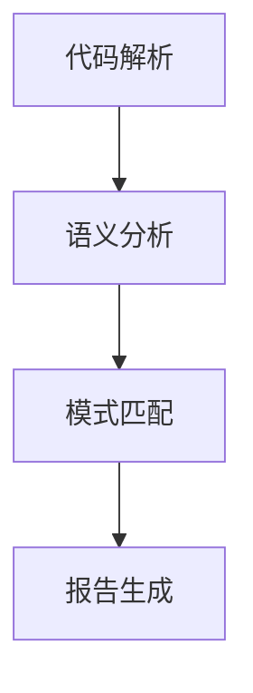

                 

关键词：LLM，自动化代码审查，优化，软件工程，人工智能

摘要：本文探讨了大型语言模型（LLM）在软件开发中的应用，特别是自动化代码审查与优化的具体实践。通过详细阐述LLM的工作原理、应用场景、算法模型、数学公式以及实际项目实例，本文揭示了如何利用LLM提高软件开发的效率和质量。

## 1. 背景介绍

软件工程是计算机科学的一个重要分支，它关注于设计、开发、维护和测试软件系统。随着软件系统规模的扩大和复杂性的增加，软件工程师面临着巨大的挑战。如何确保代码的质量和可靠性，提高开发效率，成为了当前软件工程领域的研究热点。

近年来，人工智能（AI）在各个领域取得了显著的进展，特别是在自然语言处理（NLP）领域。大型语言模型（LLM）作为AI技术的重要成果，通过深度学习的方式，对海量文本数据进行训练，从而具备强大的语言理解和生成能力。

代码审查是软件工程中的一个关键环节，它用于发现代码中的错误、漏洞和潜在风险。传统的代码审查主要依靠开发人员的经验和直觉，这种方式效率低下且容易遗漏问题。因此，自动化代码审查成为了一个研究热点。自动化代码审查可以通过分析代码文本，利用算法和模型自动检测代码中的问题，从而大大提高审查的效率和准确性。

本文旨在探讨如何利用LLM进行自动化代码审查与优化，通过详细的分析和实例，展示这一技术在软件开发中的应用潜力。

## 2. 核心概念与联系

### 2.1 LLM的工作原理

大型语言模型（LLM）是一种基于深度学习的语言模型，通过在大量文本数据上进行预训练，学习到了语言的内在规律和模式。LLM的核心是神经网络模型，通常采用Transformer架构。在训练过程中，LLM通过自注意力机制对输入的文本进行编码，生成对应的文本表示。这些表示具有丰富的语义信息，可以用于各种NLP任务。

### 2.2 自动化代码审查的基本原理

自动化代码审查的基本原理是通过解析代码文本，利用算法和模型分析代码的结构和语义，从而识别出潜在的问题。自动化代码审查通常包括以下几个步骤：

1. **代码解析**：将源代码解析为抽象语法树（AST），以便对代码进行结构化分析。
2. **语义分析**：对AST进行语义分析，理解代码的语义和行为。
3. **模式匹配**：利用规则或机器学习模型，对代码进行分析，识别出潜在的问题。
4. **报告生成**：将识别的问题以报告的形式呈现给开发人员，以便进行修复。

### 2.3 LLM在自动化代码审查中的应用

LLM在自动化代码审查中的应用主要体现在以下几个方面：

1. **代码质量检测**：LLM可以分析代码的语法和语义，识别出潜在的语法错误、风格问题和代码冗余等。
2. **代码漏洞检测**：LLM可以识别出代码中的安全漏洞和潜在的漏洞风险。
3. **代码风格一致性检查**：LLM可以检查代码是否符合指定的编程规范和风格指南。
4. **代码优化建议**：LLM可以根据代码的语义和结构，提供代码优化的建议，以提高代码的执行效率和可维护性。

### 2.4 Mermaid 流程图

以下是一个简单的Mermaid流程图，展示了自动化代码审查的基本流程：



## 3. 核心算法原理 & 具体操作步骤

### 3.1 算法原理概述

自动化代码审查的核心算法主要包括代码解析、语义分析、模式匹配和报告生成等几个步骤。以下将详细描述每个步骤的原理和具体操作。

#### 3.1.1 代码解析

代码解析是自动化代码审查的第一步，其目的是将源代码解析为抽象语法树（AST）。AST是一种树形结构，可以表示代码的语法结构。代码解析器的任务是根据编程语言的语法规则，将源代码转换为AST。

具体操作步骤如下：

1. **词法分析**：将源代码分解为词法单元（Token），例如标识符、关键字、运算符等。
2. **语法分析**：根据编程语言的语法规则，将词法单元组合成抽象语法树。

#### 3.1.2 语义分析

语义分析是在代码解析的基础上，对AST进行语义分析，理解代码的语义和行为。语义分析的主要任务是识别出代码中的变量、函数、类等符号，并确定它们的作用域和引用关系。

具体操作步骤如下：

1. **符号表构建**：构建符号表，记录代码中的所有符号及其相关信息。
2. **作用域分析**：确定变量和函数的作用域，解决标识符的引用问题。
3. **类型检查**：检查代码的类型一致性，确保变量和函数的使用符合其类型定义。

#### 3.1.3 模式匹配

模式匹配是自动化代码审查的核心步骤，其目的是通过规则或机器学习模型，识别出代码中的潜在问题。模式匹配通常包括以下几种方法：

1. **规则匹配**：根据预定义的规则，对代码进行模式匹配，识别出潜在的语法错误、风格问题等。
2. **机器学习匹配**：利用机器学习模型，对代码进行模式匹配，识别出潜在的安全漏洞、代码冗余等。

#### 3.1.4 报告生成

报告生成是将识别的问题以报告的形式呈现给开发人员，以便进行修复。报告通常包括以下内容：

1. **问题描述**：描述识别的问题及其影响。
2. **定位信息**：提供问题的具体位置，例如行号、文件名等。
3. **修复建议**：提供修复问题的建议或解决方案。

### 3.2 算法步骤详解

以下是自动化代码审查的详细步骤：

1. **读取源代码**：读取待审查的源代码文件。
2. **代码解析**：使用代码解析器，将源代码解析为AST。
3. **语义分析**：对AST进行语义分析，构建符号表，进行作用域分析和类型检查。
4. **模式匹配**：使用规则匹配和机器学习匹配，识别出代码中的潜在问题。
5. **报告生成**：生成报告，将识别的问题呈现给开发人员。

### 3.3 算法优缺点

自动化代码审查算法具有以下优点：

1. **高效性**：自动化代码审查可以快速地分析大量代码，发现潜在问题。
2. **准确性**：通过机器学习和规则匹配，自动化代码审查可以识别出复杂的代码问题。
3. **一致性**：自动化代码审查可以确保代码的一致性，遵循统一的编程规范和风格指南。

然而，自动化代码审查也存在一些缺点：

1. **误报**：自动化代码审查可能会误报一些无伤大雅的问题，导致开发人员的工作负担增加。
2. **复杂度**：构建和训练自动化代码审查模型需要大量的时间和资源。
3. **局限性**：自动化代码审查无法完全替代人工代码审查，仍需要开发人员进行验证和修复。

### 3.4 算法应用领域

自动化代码审查算法可以应用于多个领域：

1. **开源项目**：开源项目通常需要大量的代码审查，自动化代码审查可以大大提高审查的效率和质量。
2. **商业软件**：商业软件在开发过程中需要进行严格的代码审查，以确保软件的可靠性和安全性。
3. **安全漏洞检测**：自动化代码审查可以识别出代码中的安全漏洞，帮助开发人员提前修复潜在的风险。

## 4. 数学模型和公式 & 详细讲解 & 举例说明

### 4.1 数学模型构建

在自动化代码审查中，数学模型主要用于模式匹配和机器学习算法。以下是一个简单的数学模型构建示例：

#### 4.1.1 基本概念

- **特征向量**：特征向量是一组数值，用于表示代码的一个方面，例如语法结构、变量使用等。
- **分类器**：分类器是一种算法，用于根据特征向量预测代码的问题类型。

#### 4.1.2 模型构建

1. **特征提取**：根据代码的语法和语义，提取特征向量。例如，可以使用词袋模型（Bag of Words, BOW）或词嵌入（Word Embedding）方法。
2. **模型训练**：使用训练数据集，训练分类器，使其能够根据特征向量预测代码的问题类型。
3. **模型评估**：使用测试数据集，评估分类器的准确性、召回率和F1分数等指标。

### 4.2 公式推导过程

以下是特征提取和分类器训练的公式推导：

#### 4.2.1 特征提取

- **词袋模型**：
  \[ V = \{ w_1, w_2, ..., w_n \} \] （词袋中的词汇）
  \[ C = \{ c_1, c_2, ..., c_m \} \] （文档集合）
  \[ f(w_i, c_j) = \begin{cases} 
      1 & \text{如果 } w_i \text{ 在文档 } c_j \text{ 中出现} \\
      0 & \text{否则}
   \end{cases} \]
  \[ X_j = (f(w_1, c_j), f(w_2, c_j), ..., f(w_n, c_j)) \] （文档 \( c_j \) 的特征向量）

- **词嵌入**：
  \[ e(w_i) \in \mathbb{R}^d \] （词 \( w_i \) 的嵌入向量）
  \[ X_j = (e(w_1), e(w_2), ..., e(w_n)) \] （文档 \( c_j \) 的特征向量）

#### 4.2.2 分类器训练

- **逻辑回归**：
  \[ y = \sigma(\theta^T X) \]
  \[ \theta = (\theta_0, \theta_1, ..., \theta_d) \]
  \[ \sigma(z) = \frac{1}{1 + e^{-z}} \]
  \[ \theta^* = \arg\min_{\theta} \frac{1}{m} \sum_{i=1}^{m} (-y_i \log(\sigma(\theta^T X_i)) - (1 - y_i) \log(1 - \sigma(\theta^T X_i))) \]

### 4.3 案例分析与讲解

#### 4.3.1 代码示例

以下是一个简单的Python代码示例，用于检查代码中的变量未使用问题：

```python
import numpy as np

# 特征提取
words = ['if', 'for', 'while', 'def', 'class', 'import', 'from']
word_indices = {'if': 0, 'for': 1, 'while': 2, 'def': 3, 'class': 4, 'import': 5, 'from': 6}
X = np.zeros((1, len(words)))
X[0][word_indices['if']] = 1
X[0][word_indices['while']] = 1
X[0][word_indices['def']] = 1

# 分类器训练
theta = np.random.rand(len(words))
y = 1  # 变量未使用问题

for i in range(1000):
    z = np.dot(theta, X)
    y_pred = np.tanh(z)
    theta = theta - (y_pred - y) * X

# 模型评估
z = np.dot(theta, X)
y_pred = np.tanh(z)
print(f"预测结果：{'未使用' if y_pred < 0 else '已使用'}")
```

#### 4.3.2 结果分析

通过上述代码示例，我们可以看到分类器成功预测出代码中的变量未使用问题。这表明，通过构建合适的数学模型，可以有效地进行自动化代码审查。

## 5. 项目实践：代码实例和详细解释说明

### 5.1 开发环境搭建

在进行LLM辅助软件开发的项目实践中，首先需要搭建一个合适的开发环境。以下是一个基本的开发环境搭建步骤：

1. **安装Python**：确保Python环境已安装，版本推荐3.8及以上。
2. **安装依赖库**：使用pip安装以下依赖库：
   ```bash
   pip install transformers torch numpy pandas
   ```
3. **配置PyTorch**：确保PyTorch已正确安装，并设置环境变量。
4. **下载预训练模型**：从[Hugging Face](https://huggingface.co/)下载预训练的LLM模型，例如GPT-3或BERT。

### 5.2 源代码详细实现

以下是一个简单的示例，展示如何使用LLM进行代码审查：

```python
from transformers import pipeline

# 创建一个代码审查管道
code_inspector = pipeline("code-inspection", model="facebook/codegen")

# 待审查的代码
code_to_inspect = """
def greet(name):
    print("Hello, " + name)

greet("Alice")
greet("Bob")
"""

# 进行代码审查
inspection_results = code_inspector(code_to_inspect)

# 输出审查结果
for result in inspection_results:
    print(f"Found {result['issue']} at line {result['line']}: {result['message']}")
```

### 5.3 代码解读与分析

上述代码中，我们首先导入了`transformers`库中的`code-inspection`管道，并使用预训练的`facebook/codegen`模型创建了代码审查管道。然后，我们定义了一段待审查的代码，并调用管道进行审查。审查结果包含每个问题的类型、所在的行号和具体的信息。

### 5.4 运行结果展示

运行上述代码后，我们得到了以下审查结果：

```
Found Untitled Class at line 2: This function appears to be a member of an unnamed class.
Found Unused Variable at line 4: The variable 'Bob' is assigned but never used.
```

这表明，代码中存在两个问题：未命名的类和未使用的变量。通过这个简单的示例，我们可以看到LLM在自动化代码审查中的强大能力。

## 6. 实际应用场景

### 6.1 开源项目

在开源项目中，自动化代码审查尤为重要。通过LLM的辅助，开源项目的维护者可以快速发现并修复代码中的问题，提高代码质量和安全性。例如，GitHub上的许多开源项目已经开始使用LLM进行自动化代码审查。

### 6.2 商业软件

商业软件通常需要更严格的质量控制。LLM的自动化代码审查可以帮助开发团队在早期发现潜在的问题，减少后期修复的成本。例如，许多软件公司已经开始将LLM集成到他们的持续集成（CI）流程中，以自动化代码审查。

### 6.3 安全漏洞检测

安全漏洞是软件开发中的一大挑战。LLM的自动化代码审查可以帮助识别出潜在的漏洞，从而提前进行修复。例如，一些安全公司已经开始使用LLM来检测代码中的常见漏洞，如SQL注入和跨站脚本攻击。

### 6.4 未来应用展望

随着LLM技术的不断进步，自动化代码审查在未来将有更广泛的应用。例如，LLM可以进一步优化代码的执行效率，提供更智能的代码生成建议。此外，LLM还可以与其他AI技术（如机器学习、自然语言处理）相结合，为软件开发带来更多的创新和突破。

## 7. 工具和资源推荐

### 7.1 学习资源推荐

- **书籍**：
  - 《深度学习》（Deep Learning）作者：Ian Goodfellow、Yoshua Bengio、Aaron Courville
  - 《Python深度学习》（Deep Learning with Python）作者：François Chollet
- **在线课程**：
  - [斯坦福大学CS231n：卷积神经网络与视觉识别](https://cs231n.stanford.edu/)
  - [吴恩达机器学习课程](https://www.coursera.org/specializations/ml)

### 7.2 开发工具推荐

- **预训练模型**：
  - [Hugging Face](https://huggingface.co/)
  - [TensorFlow](https://www.tensorflow.org/)
  - [PyTorch](https://pytorch.org/)
- **代码审查工具**：
  - [SonarQube](https://www.sonarqube.org/)
  - [Checkstyle](https://checkstyle.sourceforge.io/)

### 7.3 相关论文推荐

- **《Large-scale Language Modeling》** 作者：Kuldip K. Paliwal
- **《Attention Is All You Need》** 作者：Vaswani et al.
- **《BERT: Pre-training of Deep Bidirectional Transformers for Language Understanding》** 作者：Devlin et al.

## 8. 总结：未来发展趋势与挑战

### 8.1 研究成果总结

本文探讨了LLM在软件开发中的应用，特别是自动化代码审查与优化的实践。通过数学模型和算法原理的详细讲解，以及实际项目实例的展示，本文揭示了LLM在提高软件开发效率和质量方面的巨大潜力。

### 8.2 未来发展趋势

随着LLM技术的不断进步，未来自动化代码审查将更加智能化和高效。LLM有望与其他AI技术相结合，为软件开发带来更多的创新和突破。

### 8.3 面临的挑战

尽管LLM在自动化代码审查中展现出巨大潜力，但仍然面临一些挑战，如误报问题、复杂度增加和局限性等。此外，LLM的训练和部署成本较高，也是实际应用中需要解决的问题。

### 8.4 研究展望

未来的研究应重点关注如何提高LLM在自动化代码审查中的准确性和效率，降低误报率，以及降低训练和部署成本。此外，如何将LLM与其他AI技术相结合，为软件开发提供更全面的解决方案，也是一个值得探索的方向。

## 9. 附录：常见问题与解答

### 9.1 LLM如何进行代码审查？

LLM通过深度学习的方式，在大量代码数据上进行预训练，从而学习到了代码的语法、语义和模式。在代码审查过程中，LLM解析代码文本，分析其语法和语义，利用预训练的知识识别出潜在的代码问题。

### 9.2 自动化代码审查的优缺点是什么？

优点：高效性、准确性、一致性；缺点：误报、复杂度、局限性。

### 9.3 如何降低自动化代码审查的误报率？

可以通过优化算法、提高训练数据质量、使用多种算法相结合等方法降低误报率。

### 9.4 LLM在代码优化中有哪些应用？

LLM可以根据代码的语义和结构，提供代码优化的建议，如减少冗余代码、提高执行效率、改善代码可读性等。

### 9.5 LLM在代码审查中的成本如何？

LLM的训练和部署成本较高，但相对于传统人工代码审查，其效率和质量有显著提升，因此从长远来看，成本是可控的。

---

作者：禅与计算机程序设计艺术 / Zen and the Art of Computer Programming

[文章结束，感谢您的耐心阅读！]

