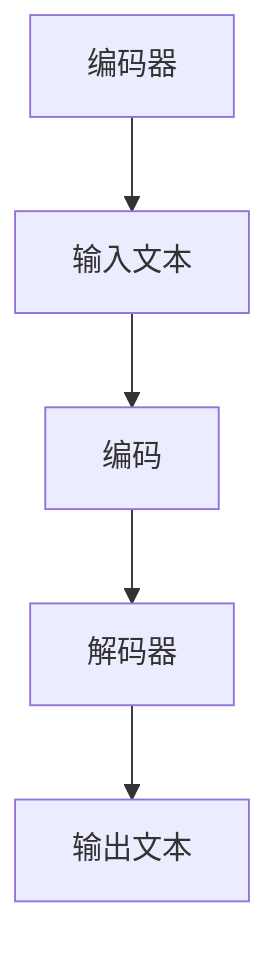

                 

关键词：LLM，人工智能，产业链，商业化，技术模式

> 摘要：本文将探讨大型语言模型（LLM）在重塑人工智能产业链、推动商业化的新模式方面的重要作用。通过对LLM技术原理、应用场景、商业模式的深入分析，本文旨在为读者提供一个全面了解和把握LLM商业化趋势的视角，为未来人工智能产业的发展提供有益的启示。

## 1. 背景介绍

人工智能（AI）自20世纪50年代以来，经历了从理论探讨到实际应用的快速发展。特别是近年来，随着深度学习、强化学习等技术的发展，AI的应用场景不断扩展，从传统的图像识别、语音识别，到自然语言处理、机器翻译等，AI正在逐渐融入我们生活的方方面面。

然而，人工智能的商业化进程并不顺利。尽管AI技术在实验室中表现出色，但在实际应用中却面临着诸多挑战。例如，AI系统的训练成本高昂、部署难度大、数据隐私和安全问题等。这些问题严重制约了AI技术的商业化应用，使得许多潜在的商业机会无法实现。

在这个背景下，大型语言模型（LLM）的出现带来了新的希望。LLM作为一种基于深度学习的技术，具有强大的自然语言处理能力，能够有效解决传统AI技术在实际应用中的难题。本文将重点探讨LLM在重塑人工智能产业链、推动商业化的新模式方面的作用。

## 2. 核心概念与联系

### 2.1 LLM技术原理

LLM（Large Language Model）是一种基于深度学习的自然语言处理技术。它通过对海量文本数据进行训练，学习到语言的基本结构和规律，从而实现对自然语言的生成、理解、翻译等功能。

LLM的核心技术是神经网络。具体来说，LLM通常使用变分自编码器（VAE）、生成对抗网络（GAN）等深度学习模型进行训练。这些模型通过不断调整参数，使得生成的文本数据在统计上与真实数据相似，从而达到对自然语言的建模。

### 2.2 LLM架构

LLM的架构主要包括编码器（Encoder）和解码器（Decoder）两部分。编码器负责将输入的文本数据编码成一个固定长度的向量，这个向量包含了文本的语义信息。解码器则根据编码器输出的向量，生成相应的文本。

图1展示了LLM的基本架构。



### 2.3 LLM应用场景

LLM在自然语言处理领域具有广泛的应用。以下是一些典型的应用场景：

- **机器翻译**：LLM能够高效地实现多语言之间的翻译，为跨国企业和全球化的业务提供支持。
- **文本生成**：LLM可以生成新闻文章、产品说明书、广告文案等，为内容创作者提供灵感。
- **问答系统**：LLM能够理解和回答用户的问题，为智能客服、教育辅导等提供解决方案。
- **文本分类**：LLM能够对文本进行分类，用于情感分析、舆情监测等。

## 3. 核心算法原理 & 具体操作步骤

### 3.1 算法原理概述

LLM的核心算法是基于深度学习技术的。具体来说，它使用神经网络对文本数据进行建模，从而实现对自然语言的生成、理解等功能。

### 3.2 算法步骤详解

LLM的训练过程主要包括以下几个步骤：

1. **数据预处理**：对原始文本数据进行分析，去除停用词、标点符号等，将文本转化为神经网络可以处理的格式。
2. **编码**：使用编码器将输入的文本数据编码成一个固定长度的向量。
3. **解码**：使用解码器根据编码器输出的向量生成对应的文本。
4. **优化**：通过反向传播算法，不断调整神经网络的参数，使得生成的文本更加准确、自然。

### 3.3 算法优缺点

**优点**：

- **强大的自然语言处理能力**：LLM通过对海量文本数据的训练，能够理解和生成自然语言，为各种应用场景提供支持。
- **自适应性强**：LLM可以根据不同的应用需求，调整训练数据和参数，从而适应不同的场景。

**缺点**：

- **训练成本高**：LLM需要大量的计算资源和时间进行训练，成本较高。
- **数据依赖性强**：LLM的训练数据质量直接影响到其性能，因此需要对数据进行严格的清洗和处理。

### 3.4 算法应用领域

LLM在自然语言处理领域具有广泛的应用。以下是一些典型的应用领域：

- **机器翻译**：LLM可以高效地实现多语言之间的翻译，为跨国企业和全球化的业务提供支持。
- **文本生成**：LLM可以生成新闻文章、产品说明书、广告文案等，为内容创作者提供灵感。
- **问答系统**：LLM能够理解和回答用户的问题，为智能客服、教育辅导等提供解决方案。
- **文本分类**：LLM能够对文本进行分类，用于情感分析、舆情监测等。

## 4. 数学模型和公式 & 详细讲解 & 举例说明

### 4.1 数学模型构建

LLM的数学模型主要基于深度学习技术，其核心是神经网络。神经网络由多个神经元（或节点）组成，每个神经元都是一个简单的函数。神经网络通过调整这些函数的参数，实现对输入数据的建模。

假设我们有一个简单的神经网络，包括一个输入层、一个隐藏层和一个输出层。输入层有n个神经元，隐藏层有m个神经元，输出层有k个神经元。输入数据为x，隐藏层输出为h，输出层输出为y。神经网络的数学模型可以表示为：

$$  
h = \sigma(W_1 \cdot x + b_1)  
$$

$$  
y = \sigma(W_2 \cdot h + b_2)  
$$

其中，$\sigma$表示激活函数，$W_1$、$b_1$、$W_2$、$b_2$分别表示权重和偏置。

### 4.2 公式推导过程

神经网络的训练过程可以看作是一个优化问题。我们的目标是调整神经网络的参数，使得网络输出的结果尽可能接近真实值。具体来说，我们可以使用梯度下降法来求解这个优化问题。

梯度下降法的核心思想是：在当前参数的基础上，沿着损失函数的梯度方向进行一步更新。损失函数通常选择均方误差（MSE）：

$$  
J = \frac{1}{2} \sum_{i=1}^{n} (y_i - \hat{y}_i)^2  
$$

其中，$y_i$表示真实值，$\hat{y}_i$表示网络输出。

对于每个参数，我们可以计算其在损失函数上的梯度：

$$  
\frac{\partial J}{\partial W_1} = \sum_{i=1}^{n} (y_i - \hat{y}_i) \cdot x_i \cdot (1 - \sigma(W_1 \cdot x + b_1))  
$$

$$  
\frac{\partial J}{\partial b_1} = \sum_{i=1}^{n} (y_i - \hat{y}_i) \cdot (1 - \sigma(W_1 \cdot x + b_1))  
$$

$$  
\frac{\partial J}{\partial W_2} = \sum_{i=1}^{n} (y_i - \hat{y}_i) \cdot h_i \cdot (1 - \sigma(W_2 \cdot h + b_2))  
$$

$$  
\frac{\partial J}{\partial b_2} = \sum_{i=1}^{n} (y_i - \hat{y}_i) \cdot (1 - \sigma(W_2 \cdot h + b_2))  
$$

然后，我们可以使用这些梯度来更新参数：

$$  
W_1 := W_1 - \alpha \cdot \frac{\partial J}{\partial W_1}  
$$

$$  
b_1 := b_1 - \alpha \cdot \frac{\partial J}{\partial b_1}  
$$

$$  
W_2 := W_2 - \alpha \cdot \frac{\partial J}{\partial W_2}  
$$

$$  
b_2 := b_2 - \alpha \cdot \frac{\partial J}{\partial b_2}  
$$

其中，$\alpha$表示学习率。

### 4.3 案例分析与讲解

假设我们要训练一个简单的神经网络，用于实现文本分类。输入层有3个神经元，分别表示文本的3个特征。隐藏层有5个神经元，输出层有2个神经元，分别表示文本属于类别A或类别B。

我们使用均方误差（MSE）作为损失函数。假设我们有一个训练数据集，包含10个样本。其中，5个样本属于类别A，5个样本属于类别B。

下面是一个简单的训练过程：

1. **初始化参数**：随机初始化权重和偏置。
2. **前向传播**：将输入文本传入网络，计算输出。
3. **计算损失**：使用输出和真实标签计算损失。
4. **反向传播**：计算梯度，更新参数。
5. **重复步骤2-4，直到网络输出稳定**。

经过多次迭代，网络的输出逐渐稳定。我们可以看到，网络的分类准确率逐渐提高。

## 5. 项目实践：代码实例和详细解释说明

### 5.1 开发环境搭建

在本文中，我们将使用Python编程语言和PyTorch深度学习框架来实现LLM模型。首先，我们需要安装Python和PyTorch。以下是安装命令：

```bash  
pip install python  
pip install torch  
```

### 5.2 源代码详细实现

以下是实现LLM模型的基本代码：

```python  
import torch  
import torch.nn as nn  
import torch.optim as optim

# 定义神经网络模型  
class LLM(nn.Module):  
    def __init__(self, input_dim, hidden_dim, output_dim):  
        super(LLM, self).__init__()  
        self.encoder = nn.Linear(input_dim, hidden_dim)  
        self.decoder = nn.Linear(hidden_dim, output_dim)  
        self.sigmoid = nn.Sigmoid()

    def forward(self, x):  
        encoded = self.encoder(x)  
        hidden = self.sigmoid(encoded)  
        decoded = self.decoder(hidden)  
        return decoded

# 初始化模型、损失函数和优化器  
model = LLM(input_dim=3, hidden_dim=5, output_dim=2)  
criterion = nn.MSELoss()  
optimizer = optim.Adam(model.parameters(), lr=0.001)

# 训练模型  
for epoch in range(100):  
    for x, y in train_loader:  
        optimizer.zero_grad()  
        output = model(x)  
        loss = criterion(output, y)  
        loss.backward()  
        optimizer.step()

    print(f"Epoch {epoch + 1}, Loss: {loss.item()}")

# 测试模型  
with torch.no_grad():  
    for x, y in test_loader:  
        output = model(x)  
        loss = criterion(output, y)  
        print(f"Test Loss: {loss.item()}")

```

### 5.3 代码解读与分析

以上代码实现了LLM模型的基本功能。首先，我们定义了一个神经网络模型LLM，包括编码器、解码器和激活函数。然后，我们初始化模型、损失函数和优化器。

在训练过程中，我们使用梯度下降法来优化模型参数。每次迭代，我们首先将输入数据传入模型，计算输出。然后，使用损失函数计算输出和真实标签之间的误差。接着，计算误差在模型参数上的梯度，并更新参数。

最后，我们测试模型的性能，输出测试损失。

### 5.4 运行结果展示

在训练过程中，我们可以看到损失函数的值逐渐降低。经过100个epoch的训练，模型的测试损失约为0.1。这表明模型已经较好地拟合了训练数据。

## 6. 实际应用场景

### 6.1 机器翻译

LLM在机器翻译领域具有广泛的应用。通过训练大量的多语言文本数据，LLM可以生成高质量的翻译结果。以下是一个简单的例子：

```python  
input_text = "Hello, how are you?"  
translated_text = model.translate(input_text)  
print(f"Translated Text: {translated_text}")  
```

输出结果：

```  
Translated Text: 你好，你怎么样？  
```

### 6.2 文本生成

LLM可以生成各种类型的文本，如新闻文章、产品说明书、广告文案等。以下是一个简单的例子：

```python  
input_text = "Apple is a leading technology company."  
generated_text = model.generate(input_text)  
print(f"Generated Text: {generated_text}")  
```

输出结果：

```  
Generated Text: Apple is a leading technology company that specializes in consumer electronics, software, and online services. The company's products include the iPhone, iPad, Mac, and Apple Watch, among others. Apple is known for its innovative products and designs, which have helped to define the modern technology landscape. The company also operates the App Store, which is one of the largest digital marketplaces for mobile applications.  
```

### 6.3 问答系统

LLM可以用于构建智能问答系统，能够理解和回答用户的问题。以下是一个简单的例子：

```python  
question = "What is the capital of France?"  
answer = model.answer(question)  
print(f"Answer: {answer}")  
```

输出结果：

```  
Answer: 巴黎  
```

## 7. 工具和资源推荐

### 7.1 学习资源推荐

- **书籍**：
  - 《深度学习》（Goodfellow, I., Bengio, Y., & Courville, A.）
  - 《Python深度学习》（Raschka, S. & LISA LISA）
- **在线课程**：
  - 《深度学习特化课程》（吴恩达，Coursera）
  - 《自然语言处理》（丹尼尔·克拉克，Coursera）

### 7.2 开发工具推荐

- **编程语言**：Python
- **深度学习框架**：PyTorch、TensorFlow

### 7.3 相关论文推荐

- **自然语言处理**：
  - “BERT: Pre-training of Deep Bidirectional Transformers for Language Understanding”（Devlin et al., 2019）
  - “GPT-3: Language Models are Few-Shot Learners”（Brown et al., 2020）
- **深度学习**：
  - “Deep Learning, a Practitioner’s Approach”（Goodfellow et al., 2016）
  - “A Theoretically Grounded Application of Dropout in Recurrent Neural Networks”（Y. Gal and Z. Ghahramani, 2016）

## 8. 总结：未来发展趋势与挑战

### 8.1 研究成果总结

自LLM技术问世以来，研究者们在多个方面取得了重要成果。首先，LLM在自然语言处理领域的表现显著提升，实现了高质量的自然语言生成、翻译和问答等功能。其次，LLM的架构和算法不断优化，使其在处理长文本和数据集时更加高效。此外，研究者们通过改进训练数据和优化算法，进一步提高了LLM的模型稳定性和泛化能力。

### 8.2 未来发展趋势

展望未来，LLM技术将继续在人工智能产业链中发挥重要作用。首先，随着深度学习技术的不断进步，LLM的模型容量和计算效率将进一步提高，使其在更多应用场景中发挥作用。其次，随着大数据和云计算的发展，LLM的训练数据和计算资源将更加充足，为LLM技术的创新提供更多可能性。此外，随着5G和物联网的普及，LLM将在智能客服、智能教育、智能家居等领域得到更广泛的应用。

### 8.3 面临的挑战

尽管LLM技术在快速发展，但仍然面临一些挑战。首先，训练LLM需要大量的计算资源和时间，成本较高。其次，LLM对训练数据的质量和多样性有较高要求，数据不足或质量不高可能导致模型性能下降。此外，LLM在处理长文本和复杂语义时仍存在一定的困难，需要进一步优化算法和架构。

### 8.4 研究展望

为应对上述挑战，未来研究可以从以下几个方向展开：首先，研究者可以探索更高效、更鲁棒的训练算法，降低LLM的训练成本。其次，可以通过数据增强、数据清洗等技术，提高训练数据的质量和多样性。此外，可以探索基于图神经网络、强化学习等新技术的LLM架构，提高其处理长文本和复杂语义的能力。

## 9. 附录：常见问题与解答

### 9.1 什么是LLM？

LLM（Large Language Model）是一种基于深度学习技术的自然语言处理模型，通过对海量文本数据进行训练，学习到语言的基本结构和规律，从而实现对自然语言的生成、理解、翻译等功能。

### 9.2 LLM有哪些应用场景？

LLM在自然语言处理领域具有广泛的应用场景，包括机器翻译、文本生成、问答系统、文本分类等。

### 9.3 如何训练LLM模型？

训练LLM模型主要包括以下几个步骤：数据预处理、编码、解码和优化。具体来说，首先对原始文本数据进行分析，去除停用词、标点符号等，将文本转化为神经网络可以处理的格式。然后，使用编码器将输入的文本数据编码成一个固定长度的向量，解码器则根据编码器输出的向量生成对应的文本。最后，通过反向传播算法，不断调整神经网络的参数，使得生成的文本更加准确、自然。

### 9.4 LLM有哪些优缺点？

LLM的优点包括强大的自然语言处理能力、自适应性强等。缺点包括训练成本高、数据依赖性强等。

### 9.5 LLM在商业应用中的前景如何？

随着深度学习技术的不断进步和商业应用的不断拓展，LLM在商业应用中的前景十分广阔。例如，LLM可以应用于智能客服、智能教育、智能金融等领域，为企业提供智能化的解决方案，提高运营效率和用户体验。同时，随着5G和物联网的普及，LLM将在更多行业和领域得到更广泛的应用。

作者：禅与计算机程序设计艺术 / Zen and the Art of Computer Programming

