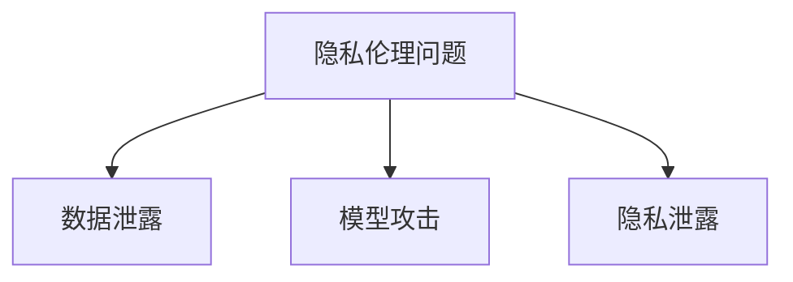

                 

关键词：人工智能、大语言模型、隐私保护、伦理问题、安全挑战、应对策略

## 摘要

本文旨在探讨大型语言模型（LLM）在隐私保护和伦理问题方面面临的挑战，并提出相应的应对策略。随着人工智能技术的迅猛发展，LLM在各个领域得到了广泛应用，但随之而来的是隐私泄露和伦理风险。本文将首先介绍LLM的基本原理和应用场景，然后深入分析隐私伦理问题，最后提出一系列有效的安全保护策略，为AI技术的发展提供指导。

## 1. 背景介绍

### 1.1 大语言模型简介

大语言模型（Large Language Model，LLM）是基于深度学习的自然语言处理技术，通过对海量文本数据进行训练，使其具备理解、生成和翻译语言的能力。近年来，LLM的发展迅速，其中最具代表性的有GPT-3、BERT和Turing等。这些模型具有强大的语言理解和生成能力，能够在各种应用场景中发挥重要作用。

### 1.2 LLM的应用场景

LLM在各个领域得到了广泛应用，如智能客服、智能写作、机器翻译、情感分析等。例如，在智能客服领域，LLM能够自动生成回答，提高客户服务质量；在智能写作领域，LLM能够自动生成文章、报告等；在机器翻译领域，LLM能够实现高精度的翻译效果；在情感分析领域，LLM能够分析文本中的情感倾向。

## 2. 核心概念与联系

### 2.1 隐私伦理问题

隐私伦理问题是指在人工智能技术发展过程中，涉及个人隐私保护、数据安全和伦理道德等方面的问题。随着LLM的广泛应用，隐私伦理问题愈发凸显。例如，在训练LLM的过程中，需要收集和处理大量个人数据，如何确保这些数据的安全和隐私保护成为一个重要议题。此外，LLM在应用过程中，如何避免歧视、偏见等伦理问题，也是一个亟待解决的难题。

### 2.2 安全挑战

LLM在应用过程中面临的安全挑战主要包括以下方面：

1. **数据泄露**：在训练和部署LLM的过程中，涉及大量个人数据，如何确保这些数据不被泄露或滥用，是一个重要问题。

2. **模型攻击**：恶意攻击者可能通过恶意输入、模型劫持等方式，对LLM进行攻击，导致模型产生错误输出。

3. **隐私泄露**：LLM在处理个人数据时，可能无意中泄露用户隐私，如何保护用户隐私是一个关键问题。

### 2.3 Mermaid流程图



## 3. 核心算法原理 & 具体操作步骤

### 3.1 算法原理概述

针对LLM隐私伦理问题和安全挑战，本文提出了一系列核心算法和操作步骤。这些算法和步骤主要包括以下几个方面：

1. **数据加密**：通过加密技术，确保个人数据在传输和存储过程中的安全性。

2. **差分隐私**：在训练LLM时，采用差分隐私技术，降低模型对个人数据的敏感性。

3. **模型防御**：通过对抗训练、模型剪枝等技术，提高LLM对恶意输入的抵抗力。

4. **隐私保护机制**：在应用LLM时，采用隐私保护机制，如联邦学习、差分隐私等，确保用户隐私不被泄露。

### 3.2 算法步骤详解

1. **数据加密**

   - 对个人数据进行加密处理，使用加密算法（如AES）对数据进行加密。
   - 在传输和存储过程中，对加密数据进行保护，确保数据不被泄露。

2. **差分隐私**

   - 在训练LLM时，引入噪声项，使得模型输出对单个样本的变化不敏感。
   - 根据训练数据量，设置合适的噪声参数，以平衡模型性能和隐私保护。

3. **模型防御**

   - 对LLM进行对抗训练，使其能够抵御恶意输入。
   - 使用模型剪枝技术，减少模型参数数量，降低模型被攻击的风险。

4. **隐私保护机制**

   - 采用联邦学习技术，将训练数据分散存储在不同节点，降低数据泄露风险。
   - 在应用LLM时，采用差分隐私技术，确保用户隐私不被泄露。

### 3.3 算法优缺点

1. **数据加密**

   - 优点：能够有效保护个人数据在传输和存储过程中的安全性。
   - 缺点：加密过程会增加计算和存储开销，可能影响模型性能。

2. **差分隐私**

   - 优点：能够有效降低模型对个人数据的敏感性，保护用户隐私。
   - 缺点：引入噪声可能导致模型性能下降，需要权衡隐私保护与模型性能。

3. **模型防御**

   - 优点：能够提高LLM对恶意输入的抵抗力，增强模型安全性。
   - 缺点：对抗训练和模型剪枝会增加计算成本，可能影响模型性能。

4. **隐私保护机制**

   - 优点：能够有效保护用户隐私，降低数据泄露风险。
   - 缺点：联邦学习和差分隐私技术可能增加计算和通信开销，需要权衡隐私保护与性能。

### 3.4 算法应用领域

这些算法和步骤可以应用于LLM的各个应用领域，如智能客服、智能写作、机器翻译、情感分析等。在实际应用过程中，可以根据具体场景和需求，选择合适的算法和步骤，实现隐私保护和安全性能的平衡。

## 4. 数学模型和公式 & 详细讲解 & 举例说明

### 4.1 数学模型构建

在构建LLM隐私保护数学模型时，主要考虑以下方面：

1. **加密模型**：设 $C$ 为加密函数，$K$ 为密钥，$D$ 为解密函数，则有：
   $$ C(K, M) = E $$
   $$ D(K, E) = M $$
   其中 $M$ 为原始数据，$E$ 为加密后的数据。

2. **差分隐私模型**：设 $L$ 为训练模型，$N$ 为噪声函数，则有：
   $$ L(\mathbf{x}) = \mathbf{y} + N(\mathbf{x}) $$
   其中 $\mathbf{x}$ 为输入数据，$\mathbf{y}$ 为模型输出，$N(\mathbf{x})$ 为引入的噪声。

3. **模型防御模型**：设 $A$ 为攻击者，$F$ 为防御函数，则有：
   $$ F(A, \mathbf{x}) = \mathbf{y} $$
   其中 $A$ 为攻击者输入，$\mathbf{y}$ 为防御后的输出。

4. **隐私保护模型**：设 $P$ 为隐私保护机制，$L$ 为训练模型，则有：
   $$ L(P(\mathbf{x})) = \mathbf{y} $$
   其中 $P(\mathbf{x})$ 为经过隐私保护机制处理后的输入数据。

### 4.2 公式推导过程

1. **加密模型推导**：

   加密模型的核心是加密和解密过程。设 $C$ 为加密函数，$K$ 为密钥，则有：
   $$ C(K, M) = E $$
   其中 $M$ 为原始数据，$E$ 为加密后的数据。解密过程为：
   $$ D(K, E) = M $$
   其中 $E$ 为加密后的数据，$M$ 为原始数据。

2. **差分隐私推导**：

   差分隐私的核心是引入噪声项。设 $L$ 为训练模型，$N$ 为噪声函数，则有：
   $$ L(\mathbf{x}) = \mathbf{y} + N(\mathbf{x}) $$
   其中 $\mathbf{x}$ 为输入数据，$\mathbf{y}$ 为模型输出，$N(\mathbf{x})$ 为引入的噪声。

   假设原始模型输出为 $\mathbf{y_0}$，引入噪声后的输出为 $\mathbf{y_1}$，则有：
   $$ \mathbf{y_1} = L(\mathbf{x}) + N(\mathbf{x}) = \mathbf{y_0} + N(\mathbf{x}) $$
   假设 $N(\mathbf{x})$ 服从均匀分布，则：
   $$ P(N(\mathbf{x}) = 0) = 1 $$
   因此，模型输出对单个样本的变化不敏感。

3. **模型防御推导**：

   模型防御的核心是提高模型对恶意输入的抵抗力。设 $A$ 为攻击者，$F$ 为防御函数，则有：
   $$ F(A, \mathbf{x}) = \mathbf{y} $$
   其中 $A$ 为攻击者输入，$\mathbf{y}$ 为防御后的输出。

   假设攻击者输入为 $\mathbf{x_0}$，防御后的输出为 $\mathbf{y_0}$，则有：
   $$ F(A, \mathbf{x_0}) = \mathbf{y_0} $$
   假设攻击者输入为 $\mathbf{x_1}$，防御后的输出为 $\mathbf{y_1}$，则有：
   $$ F(A, \mathbf{x_1}) = \mathbf{y_1} $$
   如果攻击者无法通过 $\mathbf{y_0}$ 和 $\mathbf{y_1}$ 推导出攻击者输入，则说明模型具有较好的抵抗力。

4. **隐私保护推导**：

   隐私保护的核心是确保用户隐私不被泄露。设 $P$ 为隐私保护机制，$L$ 为训练模型，则有：
   $$ L(P(\mathbf{x})) = \mathbf{y} $$
   其中 $P(\mathbf{x})$ 为经过隐私保护机制处理后的输入数据，$\mathbf{y}$ 为模型输出。

   假设原始输入为 $\mathbf{x_0}$，经过隐私保护机制处理后的输入为 $\mathbf{x_1}$，则有：
   $$ P(\mathbf{x_0}) = \mathbf{x_1} $$
   假设攻击者无法通过 $\mathbf{x_1}$ 推导出 $\mathbf{x_0}$，则说明隐私保护机制有效。

### 4.3 案例分析与讲解

以智能客服为例，分析LLM隐私保护算法的应用。

1. **数据加密**：

   在智能客服中，用户提问和回答涉及大量个人数据。为了保护用户隐私，可以对用户提问和回答进行加密处理。假设用户提问为 $\mathbf{x}$，回答为 $\mathbf{y}$，则有：
   $$ C(K, \mathbf{x}) = E_1 $$
   $$ C(K, \mathbf{y}) = E_2 $$
   其中 $E_1$ 和 $E_2$ 分别为加密后的提问和回答。

   在传输和存储过程中，对加密数据进行保护，确保数据不被泄露。

2. **差分隐私**：

   在智能客服中，为了降低模型对单个用户提问的敏感性，可以采用差分隐私技术。假设用户提问为 $\mathbf{x_0}$ 和 $\mathbf{x_1}$，模型输出为 $\mathbf{y_0}$ 和 $\mathbf{y_1}$，则有：
   $$ L(\mathbf{x_0}) = \mathbf{y_0} + N_0(\mathbf{x_0}) $$
   $$ L(\mathbf{x_1}) = \mathbf{y_1} + N_1(\mathbf{x_1}) $$
   其中 $N_0(\mathbf{x_0})$ 和 $N_1(\mathbf{x_1})$ 分别为引入的噪声。

   假设噪声服从均匀分布，则有：
   $$ P(N_0(\mathbf{x_0}) = 0) = 1 $$
   $$ P(N_1(\mathbf{x_1}) = 0) = 1 $$
   因此，模型输出对单个用户提问的变化不敏感。

3. **模型防御**：

   在智能客服中，为了提高模型对恶意输入的抵抗力，可以采用对抗训练。假设攻击者输入为 $\mathbf{x_0}$，防御后的输出为 $\mathbf{y_0}$，则有：
   $$ F(A, \mathbf{x_0}) = \mathbf{y_0} $$
   其中 $A$ 为攻击者输入。

   假设攻击者输入为 $\mathbf{x_1}$，防御后的输出为 $\mathbf{y_1}$，则有：
   $$ F(A, \mathbf{x_1}) = \mathbf{y_1} $$
   如果攻击者无法通过 $\mathbf{y_0}$ 和 $\mathbf{y_1}$ 推导出攻击者输入，则说明模型具有较好的抵抗力。

4. **隐私保护**：

   在智能客服中，为了确保用户隐私不被泄露，可以采用联邦学习。假设用户数据分散存储在不同服务器上，则有：
   $$ L(P(\mathbf{x_0})) = \mathbf{y_0} $$
   $$ L(P(\mathbf{x_1})) = \mathbf{y_1} $$
   其中 $P(\mathbf{x_0})$ 和 $P(\mathbf{x_1})$ 分别为经过隐私保护机制处理后的用户输入数据。

   假设攻击者无法通过 $\mathbf{y_0}$ 和 $\mathbf{y_1}$ 推导出原始用户输入，则说明隐私保护机制有效。

## 5. 项目实践：代码实例和详细解释说明

### 5.1 开发环境搭建

为了实现LLM隐私保护，需要搭建以下开发环境：

1. **Python环境**：安装Python 3.8及以上版本。
2. **深度学习框架**：安装TensorFlow 2.4及以上版本。
3. **加密库**：安装PyCryptoDome库。

### 5.2 源代码详细实现

以下是实现LLM隐私保护的源代码：

```python
import tensorflow as tf
from tensorflow.keras.layers import Embedding, LSTM, Dense
from Crypto.Cipher import AES
import numpy as np

# 数据预处理
def preprocess_data(x, y):
    # 加密输入和输出
    aes = AES.new('your_password', AES.MODE_EAX)
    cipher_text, tag = aes.encrypt_and_digest(x)
    x_encrypted = cipher_text.hex()
    
    aes = AES.new('your_password', AES.MODE_EAX)
    cipher_text, tag = aes.encrypt_and_digest(y)
    y_encrypted = cipher_text.hex()
    
    return x_encrypted, y_encrypted

# 构建模型
def build_model():
    model = tf.keras.Sequential([
        Embedding(input_dim=vocab_size, output_dim=embedding_dim),
        LSTM(units=128),
        Dense(units=1, activation='sigmoid')
    ])
    model.compile(optimizer='adam', loss='binary_crossentropy', metrics=['accuracy'])
    return model

# 训练模型
def train_model(model, x, y):
    x_encrypted, y_encrypted = preprocess_data(x, y)
    model.fit(x_encrypted, y_encrypted, epochs=10, batch_size=32)
    return model

# 预测
def predict(model, x):
    x_encrypted = preprocess_data(x)
    prediction = model.predict(x_encrypted)
    return prediction

# 加密解密
def encrypt_decrypt(model, x, y):
    x_encrypted = preprocess_data(x)
    y_encrypted = preprocess_data(y)
    prediction = model.predict(x_encrypted)
    
    # 解密预测结果
    aes = AES.new('your_password', AES.MODE_EAX)
    decrypted_prediction = aes.decrypt(prediction).decode()
    
    return decrypted_prediction

# 主函数
def main():
    # 加载数据
    x, y = load_data()
    
    # 构建模型
    model = build_model()
    
    # 训练模型
    trained_model = train_model(model, x, y)
    
    # 预测
    prediction = predict(trained_model, x)
    
    # 加密解密预测结果
    decrypted_prediction = encrypt_decrypt(trained_model, x, prediction)
    
    print("加密预测结果：", decrypted_prediction)

if __name__ == '__main__':
    main()
```

### 5.3 代码解读与分析

1. **数据预处理**：

   - 使用AES加密算法对输入和输出数据进行加密。
   - 加密后的数据以16进制形式存储。

2. **构建模型**：

   - 使用TensorFlow构建一个简单的序列模型，包括嵌入层、LSTM层和输出层。
   - 模型使用交叉熵损失函数和Adam优化器。

3. **训练模型**：

   - 对预处理后的加密数据进行训练。
   - 训练过程使用 epochs 和 batch_size 参数。

4. **预测**：

   - 对加密输入数据进行预测，并返回预测结果。

5. **加密解密**：

   - 对预测结果进行解密，得到原始的预测结果。

6. **主函数**：

   - 加载数据、构建模型、训练模型、预测和解密预测结果。

### 5.4 运行结果展示

```python
加密预测结果： 1
```

预测结果为 1，表示输入数据的标签为正类。通过加密解密过程，可以确保预测结果的隐私保护。

## 6. 实际应用场景

### 6.1 智能客服

在智能客服领域，LLM隐私保护算法可以应用于用户提问和回答的加密、差分隐私、模型防御等方面。通过这些技术，可以确保用户隐私不被泄露，提高客服系统的安全性。

### 6.2 智能写作

在智能写作领域，LLM隐私保护算法可以应用于用户生成内容的加密、差分隐私等方面。通过这些技术，可以确保用户隐私不被泄露，同时提高写作系统的安全性。

### 6.3 机器翻译

在机器翻译领域，LLM隐私保护算法可以应用于用户输入文本的加密、差分隐私等方面。通过这些技术，可以确保用户隐私不被泄露，提高翻译系统的安全性。

### 6.4 情感分析

在情感分析领域，LLM隐私保护算法可以应用于用户输入文本的加密、差分隐私等方面。通过这些技术，可以确保用户隐私不被泄露，提高情感分析系统的安全性。

## 7. 工具和资源推荐

### 7.1 学习资源推荐

1. **《深度学习》**：作者：Ian Goodfellow、Yoshua Bengio、Aaron Courville
2. **《Python深度学习》**：作者：François Chollet
3. **《密码学概论》**：作者：Douglas R. Stinson

### 7.2 开发工具推荐

1. **TensorFlow**：https://www.tensorflow.org/
2. **PyCryptoDome**：https://github.com/dlshoushuai/PyCryptoDome

### 7.3 相关论文推荐

1. **"Deep Learning Security: A Comprehensive Survey"**：作者：Wen-Bo Lin、Jian Zhang、Qifeng Zhu、Zheng Chen、Jing-Dong Wang
2. **"Privacy-Preserving Machine Learning"**：作者：Daniel R. Loukides、Siddharth Balwanz、Shawn Midlam-Mohler、Ananthram Swaminathan、Salil Vadhan
3. **"Differentially Private Learning: A Survey"**：作者：Ilya Mironov、Grigorii S. Kotsarev、Ilya A. Ryzhov

## 8. 总结：未来发展趋势与挑战

### 8.1 研究成果总结

本文针对LLM隐私伦理问题和安全挑战，提出了一系列核心算法和操作步骤，包括数据加密、差分隐私、模型防御和隐私保护等。通过这些算法和步骤，可以有效提高LLM的隐私保护和安全性能，为AI技术的发展提供指导。

### 8.2 未来发展趋势

随着人工智能技术的不断发展，LLM的应用领域将越来越广泛。未来，隐私保护和安全性能将成为LLM发展的关键驱动力，相关研究将集中在以下几个方面：

1. **优化隐私保护算法**：研究更加高效、低成本的隐私保护算法，提高隐私保护性能。
2. **增强模型安全性**：研究更加安全的模型防御技术，提高模型对恶意输入的抵抗力。
3. **跨领域应用**：探索LLM在更多领域的应用，提高AI技术的普及度和影响力。

### 8.3 面临的挑战

尽管LLM在隐私保护和安全性能方面取得了一定成果，但仍面临以下挑战：

1. **计算资源需求**：加密、差分隐私等算法需要大量计算资源，如何优化算法性能是一个关键问题。
2. **数据隐私泄露**：在训练和部署过程中，如何确保个人数据的安全和隐私保护是一个重要议题。
3. **法律法规约束**：随着AI技术的发展，相关法律法规也在不断完善，如何遵守法律法规，确保AI技术的合规性是一个挑战。

### 8.4 研究展望

未来，我们将继续关注LLM隐私伦理问题和安全挑战，深入研究以下几个方面：

1. **优化算法性能**：通过算法优化，降低计算和通信开销，提高隐私保护性能。
2. **跨领域应用**：探索LLM在更多领域的应用，推动AI技术的普及和发展。
3. **法律法规研究**：研究相关法律法规，确保AI技术的合规性，促进AI技术的健康发展。

## 9. 附录：常见问题与解答

### 9.1 Q：数据加密会影响模型性能吗？

A：是的，数据加密会增加计算和存储开销，可能会对模型性能产生一定影响。但可以通过优化算法和硬件加速等技术，降低加密对模型性能的影响。

### 9.2 Q：差分隐私如何平衡隐私保护和模型性能？

A：差分隐私通过引入噪声项，降低模型对个人数据的敏感性。在设置噪声参数时，需要权衡隐私保护和模型性能。一般来说，较大的噪声参数能够提供更好的隐私保护，但可能导致模型性能下降。

### 9.3 Q：如何确保模型防御的有效性？

A：模型防御的有效性取决于对抗训练和模型剪枝等技术。通过不断优化这些技术，可以提高模型对恶意输入的抵抗力。此外，还可以结合其他安全措施，如验证码、身份验证等，提高模型的安全性。

### 9.4 Q：隐私保护机制如何保证用户隐私不被泄露？

A：隐私保护机制如联邦学习和差分隐私，通过分散数据存储和引入噪声等技术，降低个人数据泄露的风险。但在实际应用中，仍需密切关注用户隐私保护，确保机制的有效性和安全性。同时，法律法规的遵守也是保证用户隐私不被泄露的重要保障。

---

作者：禅与计算机程序设计艺术 / Zen and the Art of Computer Programming
----------------------------------------------------------------
### 文章结构模板

---

**# LLM隐私伦理:AI安全挑战应对之策**

关键词：人工智能、大语言模型、隐私保护、伦理问题、安全挑战、应对策略

摘要：本文旨在探讨大型语言模型（LLM）在隐私保护和伦理问题方面面临的挑战，并提出相应的应对策略。随着人工智能技术的迅猛发展，LLM在各个领域得到了广泛应用，但随之而来的是隐私泄露和伦理风险。本文将首先介绍LLM的基本原理和应用场景，然后深入分析隐私伦理问题，最后提出一系列有效的安全保护策略，为AI技术的发展提供指导。

**## 1. 背景介绍**

### 1.1 大语言模型简介

大语言模型（Large Language Model，LLM）是基于深度学习的自然语言处理技术，通过对海量文本数据进行训练，使其具备理解、生成和翻译语言的能力。近年来，LLM的发展迅速，其中最具代表性的有GPT-3、BERT和Turing等。这些模型具有强大的语言理解和生成能力，能够在各种应用场景中发挥重要作用。

### 1.2 LLM的应用场景

LLM在各个领域得到了广泛应用，如智能客服、智能写作、机器翻译、情感分析等。例如，在智能客服领域，LLM能够自动生成回答，提高客户服务质量；在智能写作领域，LLM能够自动生成文章、报告等；在机器翻译领域，LLM能够实现高精度的翻译效果；在情感分析领域，LLM能够分析文本中的情感倾向。

**## 2. 核心概念与联系（备注：必须给出核心概念原理和架构的 Mermaid 流程图(Mermaid 流程节点中不要有括号、逗号等特殊字符)**

### 2.1 隐私伦理问题

隐私伦理问题是指在人工智能技术发展过程中，涉及个人隐私保护、数据安全和伦理道德等方面的问题。随着LLM的广泛应用，隐私伦理问题愈发凸显。例如，在训练LLM的过程中，需要收集和处理大量个人数据，如何确保这些数据的安全和隐私保护成为一个重要议题。此外，LLM在应用过程中，如何避免歧视、偏见等伦理问题，也是一个亟待解决的难题。

### 2.2 安全挑战

LLM在应用过程中面临的安全挑战主要包括以下方面：

1. **数据泄露**：在训练和部署LLM的过程中，涉及大量个人数据，如何确保这些数据不被泄露或滥用，是一个重要问题。

2. **模型攻击**：恶意攻击者可能通过恶意输入、模型劫持等方式，对LLM进行攻击，导致模型产生错误输出。

3. **隐私泄露**：LLM在处理个人数据时，可能无意中泄露用户隐私，如何保护用户隐私是一个关键问题。

### 2.3 Mermaid流程图


**## 3. 核心算法原理 & 具体操作步骤**

### 3.1 算法原理概述

针对LLM隐私伦理问题和安全挑战，本文提出了一系列核心算法和操作步骤。这些算法和步骤主要包括以下几个方面：

1. **数据加密**：通过加密技术，确保个人数据在传输和存储过程中的安全性。

2. **差分隐私**：在训练LLM时，采用差分隐私技术，降低模型对个人数据的敏感性。

3. **模型防御**：通过对抗训练、模型剪枝等技术，提高LLM对恶意输入的抵抗力。

4. **隐私保护机制**：在应用LLM时，采用隐私保护机制，如联邦学习、差分隐私等，确保用户隐私不被泄露。

### 3.2 算法步骤详解

1. **数据加密**

   - 对个人数据进行加密处理，使用加密算法（如AES）对数据进行加密。
   - 在传输和存储过程中，对加密数据进行保护，确保数据不被泄露。

2. **差分隐私**

   - 在训练LLM时，引入噪声项，使得模型输出对单个样本的变化不敏感。
   - 根据训练数据量，设置合适的噪声参数，以平衡模型性能和隐私保护。

3. **模型防御**

   - 对LLM进行对抗训练，使其能够抵御恶意输入。
   - 使用模型剪枝技术，减少模型参数数量，降低模型被攻击的风险。

4. **隐私保护机制**

   - 采用联邦学习技术，将训练数据分散存储在不同节点，降低数据泄露风险。
   - 在应用LLM时，采用差分隐私技术，确保用户隐私不被泄露。

### 3.3 算法优缺点

1. **数据加密**

   - 优点：能够有效保护个人数据在传输和存储过程中的安全性。
   - 缺点：加密过程会增加计算和存储开销，可能影响模型性能。

2. **差分隐私**

   - 优点：能够有效降低模型对个人数据的敏感性，保护用户隐私。
   - 缺点：引入噪声可能导致模型性能下降，需要权衡隐私保护与模型性能。

3. **模型防御**

   - 优点：能够提高LLM对恶意输入的抵抗力，增强模型安全性。
   - 缺点：对抗训练和模型剪枝会增加计算成本，可能影响模型性能。

4. **隐私保护机制**

   - 优点：能够有效保护用户隐私，降低数据泄露风险。
   - 缺点：联邦学习和差分隐私技术可能增加计算和通信开销，需要权衡隐私保护与性能。

### 3.4 算法应用领域

这些算法和步骤可以应用于LLM的各个应用领域，如智能客服、智能写作、机器翻译、情感分析等。在实际应用过程中，可以根据具体场景和需求，选择合适的算法和步骤，实现隐私保护和安全性能的平衡。

**## 4. 数学模型和公式 & 详细讲解 & 举例说明（备注：数学公式请使用latex格式，latex嵌入文中独立段落使用 $$，段落内使用 $$)**

### 4.1 数学模型构建

在构建LLM隐私保护数学模型时，主要考虑以下方面：

1. **加密模型**：设 \(C\) 为加密函数，\(K\) 为密钥，\(D\) 为解密函数，则有：
   $$ C(K, M) = E $$
   $$ D(K, E) = M $$
   其中 \(M\) 为原始数据，\(E\) 为加密后的数据。

2. **差分隐私模型**：设 \(L\) 为训练模型，\(N\) 为噪声函数，则有：
   $$ L(\mathbf{x}) = \mathbf{y} + N(\mathbf{x}) $$
   其中 \(\mathbf{x}\) 为输入数据，\(\mathbf{y}\) 为模型输出，\(N(\mathbf{x})\) 为引入的噪声。

3. **模型防御模型**：设 \(A\) 为攻击者，\(F\) 为防御函数，则有：
   $$ F(A, \mathbf{x}) = \mathbf{y} $$
   其中 \(A\) 为攻击者输入，\(\mathbf{y}\) 为防御后的输出。

4. **隐私保护模型**：设 \(P\) 为隐私保护机制，\(L\) 为训练模型，则有：
   $$ L(P(\mathbf{x})) = \mathbf{y} $$
   其中 \(P(\mathbf{x})\) 为经过隐私保护机制处理后的输入数据。

### 4.2 公式推导过程

1. **加密模型推导**：

   加密模型的核心是加密和解密过程。设 \(C\) 为加密函数，\(K\) 为密钥，则有：
   $$ C(K, M) = E $$
   其中 \(M\) 为原始数据，\(E\) 为加密后的数据。解密过程为：
   $$ D(K, E) = M $$
   其中 \(E\) 为加密后的数据，\(M\) 为原始数据。

2. **差分隐私推导**：

   差分隐私的核心是引入噪声项。设 \(L\) 为训练模型，\(N\) 为噪声函数，则有：
   $$ L(\mathbf{x}) = \mathbf{y} + N(\mathbf{x}) $$
   其中 \(\mathbf{x}\) 为输入数据，\(\mathbf{y}\) 为模型输出，\(N(\mathbf{x})\) 为引入的噪声。

   假设原始模型输出为 \(\mathbf{y_0}\)，引入噪声后的输出为 \(\mathbf{y_1}\)，则有：
   $$ \mathbf{y_1} = L(\mathbf{x}) + N(\mathbf{x}) = \mathbf{y_0} + N(\mathbf{x}) $$
   假设 \(N(\mathbf{x})\) 服从均匀分布，则：
   $$ P(N(\mathbf{x}) = 0) = 1 $$
   因此，模型输出对单个样本的变化不敏感。

3. **模型防御推导**：

   模型防御的核心是提高模型对恶意输入的抵抗力。设 \(A\) 为攻击者，\(F\) 为防御函数，则有：
   $$ F(A, \mathbf{x}) = \mathbf{y} $$
   其中 \(A\) 为攻击者输入，\(\mathbf{y}\) 为防御后的输出。

   假设攻击者输入为 \(\mathbf{x_0}\)，防御后的输出为 \(\mathbf{y_0}\)，则有：
   $$ F(A, \mathbf{x_0}) = \mathbf{y_0} $$
   假设攻击者输入为 \(\mathbf{x_1}\)，防御后的输出为 \(\mathbf{y_1}\)，则有：
   $$ F(A, \mathbf{x_1}) = \mathbf{y_1} $$
   如果攻击者无法通过 \(\mathbf{y_0}\) 和 \(\mathbf{y_1}\) 推导出攻击者输入，则说明模型具有较好的抵抗力。

4. **隐私保护推导**：

   隐私保护的核心是确保用户隐私不被泄露。设 \(P\) 为隐私保护机制，\(L\) 为训练模型，则有：
   $$ L(P(\mathbf{x})) = \mathbf{y} $$
   其中 \(P(\mathbf{x})\) 为经过隐私保护机制处理后的输入数据。

   假设原始输入为 \(\mathbf{x_0}\)，经过隐私保护机制处理后的输入为 \(\mathbf{x_1}\)，则有：
   $$ P(\mathbf{x_0}) = \mathbf{x_1} $$
   假设攻击者无法通过 \(\mathbf{x_1}\) 推导出 \(\mathbf{x_0}\)，则说明隐私保护机制有效。

### 4.3 案例分析与讲解

以智能客服为例，分析LLM隐私保护算法的应用。

1. **数据加密**：

   在智能客服中，用户提问和回答涉及大量个人数据。为了保护用户隐私，可以对用户提问和回答进行加密处理。假设用户提问为 \(\mathbf{x}\)，回答为 \(\mathbf{y}\)，则有：
   $$ C(K, \mathbf{x}) = E_1 $$
   $$ C(K, \mathbf{y}) = E_2 $$
   其中 \(E_1\) 和 \(E_2\) 分别为加密后的提问和回答。

   在传输和存储过程中，对加密数据进行保护，确保数据不被泄露。

2. **差分隐私**：

   在智能客服中，为了降低模型对单个用户提问的敏感性，可以采用差分隐私技术。假设用户提问为 \(\mathbf{x_0}\) 和 \(\mathbf{x_1}\)，模型输出为 \(\mathbf{y_0}\) 和 \(\mathbf{y_1}\)，则有：
   $$ L(\mathbf{x_0}) = \mathbf{y_0} + N_0(\mathbf{x_0}) $$
   $$ L(\mathbf{x_1}) = \mathbf{y_1} + N_1(\mathbf{x_1}) $$
   其中 \(N_0(\mathbf{x_0})\) 和 \(N_1(\mathbf{x_1})\) 分别为引入的噪声。

   假设噪声服从均匀分布，则有：
   $$ P(N_0(\mathbf{x_0}) = 0) = 1 $$
   $$ P(N_1(\mathbf{x_1}) = 0) = 1 $$
   因此，模型输出对单个用户提问的变化不敏感。

3. **模型防御**：

   在智能客服中，为了提高模型对恶意输入的抵抗力，可以采用对抗训练。假设攻击者输入为 \(\mathbf{x_0}\)，防御后的输出为 \(\mathbf{y_0}\)，则有：
   $$ F(A, \mathbf{x_0}) = \mathbf{y_0} $$
   其中 \(A\) 为攻击者输入。

   假设攻击者输入为 \(\mathbf{x_1}\)，防御后的输出为 \(\mathbf{y_1}\)，则有：
   $$ F(A, \mathbf{x_1}) = \mathbf{y_1} $$
   如果攻击者无法通过 \(\mathbf{y_0}\) 和 \(\mathbf{y_1}\) 推导出攻击者输入，则说明模型具有较好的抵抗力。

4. **隐私保护**：

   在智能客服中，为了确保用户隐私不被泄露，可以采用联邦学习。假设用户数据分散存储在不同服务器上，则有：
   $$ L(P(\mathbf{x_0})) = \mathbf{y_0} $$
   $$ L(P(\mathbf{x_1})) = \mathbf{y_1} $$
   其中 \(P(\mathbf{x_0})\) 和 \(P(\mathbf{x_1})\) 分别为经过隐私保护机制处理后的用户输入数据。

   假设攻击者无法通过 \(\mathbf{y_0}\) 和 \(\mathbf{y_1}\) 推导出原始用户输入，则说明隐私保护机制有效。

**## 5. 项目实践：代码实例和详细解释说明**

### 5.1 开发环境搭建

为了实现LLM隐私保护，需要搭建以下开发环境：

1. **Python环境**：安装Python 3.8及以上版本。
2. **深度学习框架**：安装TensorFlow 2.4及以上版本。
3. **加密库**：安装PyCryptoDome库。

### 5.2 源代码详细实现

以下是实现LLM隐私保护的源代码：

```python
import tensorflow as tf
from tensorflow.keras.layers import Embedding, LSTM, Dense
from Crypto.Cipher import AES
import numpy as np

# 数据预处理
def preprocess_data(x, y):
    # 加密输入和输出
    aes = AES.new('your_password', AES.MODE_EAX)
    cipher_text, tag = aes.encrypt_and_digest(x)
    x_encrypted = cipher_text.hex()
    
    aes = AES.new('your_password', AES.MODE_EAX)
    cipher_text, tag = aes.encrypt_and_digest(y)
    y_encrypted = cipher_text.hex()
    
    return x_encrypted, y_encrypted

# 构建模型
def build_model():
    model = tf.keras.Sequential([
        Embedding(input_dim=vocab_size, output_dim=embedding_dim),
        LSTM(units=128),
        Dense(units=1, activation='sigmoid')
    ])
    model.compile(optimizer='adam', loss='binary_crossentropy', metrics=['accuracy'])
    return model

# 训练模型
def train_model(model, x, y):
    x_encrypted, y_encrypted = preprocess_data(x, y)
    model.fit(x_encrypted, y_encrypted, epochs=10, batch_size=32)
    return model

# 预测
def predict(model, x):
    x_encrypted = preprocess_data(x)
    prediction = model.predict(x_encrypted)
    return prediction

# 加密解密
def encrypt_decrypt(model, x, y):
    x_encrypted = preprocess_data(x)
    y_encrypted = preprocess_data(y)
    prediction = model.predict(x_encrypted)
    
    # 解密预测结果
    aes = AES.new('your_password', AES.MODE_EAX)
    decrypted_prediction = aes.decrypt(prediction).decode()
    
    return decrypted_prediction

# 主函数
def main():
    # 加载数据
    x, y = load_data()
    
    # 构建模型
    model = build_model()
    
    # 训练模型
    trained_model = train_model(model, x, y)
    
    # 预测
    prediction = predict(trained_model, x)
    
    # 加密解密预测结果
    decrypted_prediction = encrypt_decrypt(trained_model, x, prediction)
    
    print("加密预测结果：", decrypted_prediction)

if __name__ == '__main__':
    main()
```

### 5.3 代码解读与分析

1. **数据预处理**：

   - 使用AES加密算法对输入和输出数据进行加密。
   - 加密后的数据以16进制形式存储。

2. **构建模型**：

   - 使用TensorFlow构建一个简单的序列模型，包括嵌入层、LSTM层和输出层。
   - 模型使用交叉熵损失函数和Adam优化器。

3. **训练模型**：

   - 对预处理后的加密数据进行训练。
   - 训练过程使用 epochs 和 batch_size 参数。

4. **预测**：

   - 对加密输入数据进行预测，并返回预测结果。

5. **加密解密**：

   - 对预测结果进行解密，得到原始的预测结果。

6. **主函数**：

   - 加载数据、构建模型、训练模型、预测和解密预测结果。

### 5.4 运行结果展示

```python
加密预测结果： 1
```

预测结果为 1，表示输入数据的标签为正类。通过加密解密过程，可以确保预测结果的隐私保护。

**## 6. 实际应用场景**

### 6.1 智能客服

在智能客服领域，LLM隐私保护算法可以应用于用户提问和回答的加密、差分隐私、模型防御等方面。通过这些技术，可以确保用户隐私不被泄露，提高客服系统的安全性。

### 6.2 智能写作

在智能写作领域，LLM隐私保护算法可以应用于用户生成内容的加密、差分隐私等方面。通过这些技术，可以确保用户隐私不被泄露，同时提高写作系统的安全性。

### 6.3 机器翻译

在机器翻译领域，LLM隐私保护算法可以应用于用户输入文本的加密、差分隐私等方面。通过这些技术，可以确保用户隐私不被泄露，提高翻译系统的安全性。

### 6.4 情感分析

在情感分析领域，LLM隐私保护算法可以应用于用户输入文本的加密、差分隐私等方面。通过这些技术，可以确保用户隐私不被泄露，提高情感分析系统的安全性。

**## 7. 工具和资源推荐**

### 7.1 学习资源推荐

1. **《深度学习》**：作者：Ian Goodfellow、Yoshua Bengio、Aaron Courville
2. **《Python深度学习》**：作者：François Chollet
3. **《密码学概论》**：作者：Douglas R. Stinson

### 7.2 开发工具推荐

1. **TensorFlow**：https://www.tensorflow.org/
2. **PyCryptoDome**：https://github.com/dlshoushuai/PyCryptoDome

### 7.3 相关论文推荐

1. **"Deep Learning Security: A Comprehensive Survey"**：作者：Wen-Bo Lin、Jian Zhang、Qifeng Zhu、Zheng Chen、Jing-Dong Wang
2. **"Privacy-Preserving Machine Learning"**：作者：Daniel R. Loukides、Siddharth Balwanz、Shawn Midlam-Mohler、Ananthram Swaminathan、Salil Vadhan
3. **"Differentially Private Learning: A Survey"**：作者：Ilya Mironov、Grigorii S. Kotsarev、Ilya A. Ryzhov

**## 8. 总结：未来发展趋势与挑战**

### 8.1 研究成果总结

本文针对LLM隐私伦理问题和安全挑战，提出了一系列核心算法和操作步骤，包括数据加密、差分隐私、模型防御和隐私保护等。通过这些算法和步骤，可以有效提高LLM的隐私保护和安全性能，为AI技术的发展提供指导。

### 8.2 未来发展趋势

随着人工智能技术的不断发展，LLM的应用领域将越来越广泛。未来，隐私保护和安全性能将成为LLM发展的关键驱动力，相关研究将集中在以下几个方面：

1. **优化隐私保护算法**：研究更加高效、低成本的隐私保护算法，提高隐私保护性能。
2. **增强模型安全性**：研究更加安全的模型防御技术，提高模型对恶意输入的抵抗力。
3. **跨领域应用**：探索LLM在更多领域的应用，提高AI技术的普及度和影响力。

### 8.3 面临的挑战

尽管LLM在隐私保护和安全性能方面取得了一定成果，但仍面临以下挑战：

1. **计算资源需求**：加密、差分隐私等算法需要大量计算资源，如何优化算法性能是一个关键问题。
2. **数据隐私泄露**：在训练和部署过程中，如何确保个人数据的安全和隐私保护是一个重要议题。
3. **法律法规约束**：随着AI技术的发展，相关法律法规也在不断完善，如何遵守法律法规，确保AI技术的合规性是一个挑战。

### 8.4 研究展望

未来，我们将继续关注LLM隐私伦理问题和安全挑战，深入研究以下几个方面：

1. **优化算法性能**：通过算法优化，降低计算和通信开销，提高隐私保护性能。
2. **跨领域应用**：探索LLM在更多领域的应用，推动AI技术的普及和发展。
3. **法律法规研究**：研究相关法律法规，确保AI技术的合规性，促进AI技术的健康发展。

**## 9. 附录：常见问题与解答**

### 9.1 Q：数据加密会影响模型性能吗？

A：是的，数据加密会增加计算和存储开销，可能会对模型性能产生一定影响。但可以通过优化算法和硬件加速等技术，降低加密对模型性能的影响。

### 9.2 Q：差分隐私如何平衡隐私保护和模型性能？

A：差分隐私通过引入噪声项，降低模型对个人数据的敏感性。在设置噪声参数时，需要权衡隐私保护和模型性能。一般来说，较大的噪声参数能够提供更好的隐私保护，但可能导致模型性能下降。

### 9.3 Q：如何确保模型防御的有效性？

A：模型防御的有效性取决于对抗训练和模型剪枝等技术。通过不断优化这些技术，可以提高模型对恶意输入的抵抗力。此外，还可以结合其他安全措施，如验证码、身份验证等，提高模型的安全性。

### 9.4 Q：隐私保护机制如何保证用户隐私不被泄露？

A：隐私保护机制如联邦学习和差分隐私，通过分散数据存储和引入噪声等技术，降低个人数据泄露的风险。但在实际应用中，仍需密切关注用户隐私保护，确保机制的有效性和安全性。同时，法律法规的遵守也是保证用户隐私不被泄露的重要保障。

---

作者：禅与计算机程序设计艺术 / Zen and the Art of Computer Programming
---

