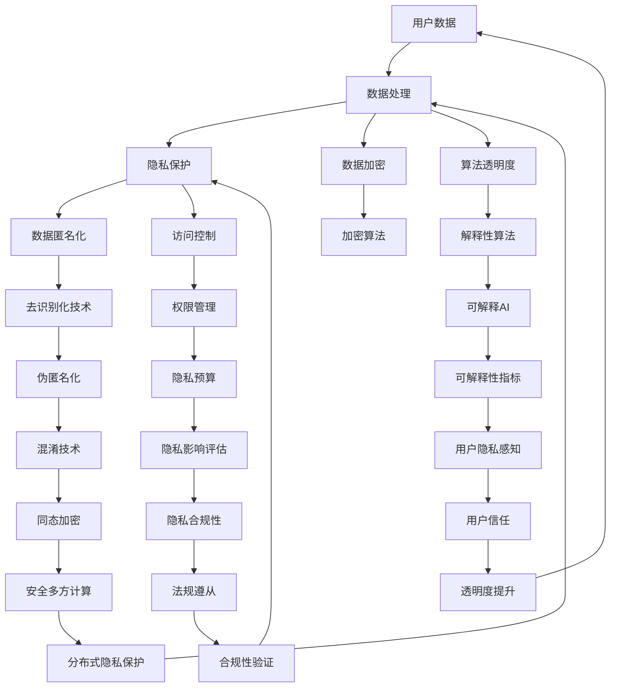

                 

关键词：大型语言模型（LLM）、隐私伦理、AI安全、数据保护、算法透明度

> 摘要：随着大型语言模型（LLM）如GPT-3等的广泛应用，AI系统的隐私伦理问题和安全挑战日益凸显。本文从隐私伦理的角度出发，探讨了LLM在数据处理、算法透明度和用户权利保护等方面的挑战，并提出了相应的应对策略。文章旨在为人工智能领域的从业者提供指导，以实现AI安全与隐私保护的双重目标。

## 1. 背景介绍

近年来，人工智能（AI）技术取得了飞速发展，特别是在自然语言处理（NLP）领域，大型语言模型（LLM）如GPT-3、BERT等的表现令人瞩目。这些模型在文本生成、翻译、问答系统等方面展现出了极高的准确性和效率，成为各行各业的热门工具。然而，随着LLM的广泛应用，隐私伦理和安全问题也日益引起关注。

### 1.1 LLM的隐私伦理问题

LLM在训练和运行过程中需要处理海量数据，这些数据往往包含了用户的敏感信息。例如，用户在社交媒体上的评论、电子邮件内容、搜索引擎查询历史等。如何确保这些数据的隐私保护，防止数据泄露和滥用，成为了一个重要的伦理问题。

### 1.2 AI安全挑战

LLM的应用场景广泛，从商业到政府，从医疗到金融，任何环节的漏洞都可能导致严重的安全问题。例如，恶意攻击者可能通过精心设计的输入欺骗LLM，使其产生有害的输出；内部人员可能滥用权限，获取用户敏感数据等。

### 1.3 现有解决方案的局限性

尽管已有一些关于AI隐私保护和安全性的研究和解决方案，但其在实际应用中仍存在很多局限性。例如，加密技术虽然能保护数据传输过程中的隐私，但不能解决数据存储和处理过程中的安全问题。算法透明度虽然可以提高用户对AI系统的信任度，但具体实现起来仍面临很多挑战。

## 2. 核心概念与联系

在探讨LLM隐私伦理和安全挑战之前，我们需要了解一些核心概念和它们之间的关系。以下是相关概念和架构的Mermaid流程图：



### 2.1 核心概念原理

- **用户数据**：用户在交互过程中产生的数据，包括文本、语音、图像等。
- **数据处理**：对用户数据进行收集、存储、处理和分发等操作。
- **隐私保护**：确保用户数据在处理过程中的隐私不被泄露。
- **数据加密**：使用加密算法对数据进行加密，以防止数据在传输和存储过程中被窃取。
- **算法透明度**：提高AI算法的可解释性，使用户能够理解算法的决策过程。
- **访问控制**：限制用户对数据的访问权限，防止未经授权的访问。

### 2.2 架构原理

该架构通过多个技术手段相互配合，实现隐私保护和安全性的目标。例如，数据加密确保数据在传输和存储过程中的安全；隐私保护通过数据匿名化、访问控制等手段，防止数据泄露；算法透明度提高用户对AI系统的信任度。

## 3. 核心算法原理 & 具体操作步骤

### 3.1 算法原理概述

为了应对LLM隐私伦理和安全挑战，我们需要采用一系列核心算法和技术。以下是几个关键算法的原理概述：

#### 3.1.1 数据匿名化

数据匿名化是一种将用户数据转换成无法识别个人身份的形式的技术。具体方法包括：

- **伪匿名化**：使用随机化技术，将真实数据替换成随机生成的数据。
- **数据混淆**：对数据中的敏感信息进行混淆处理，使其难以识别。

#### 3.1.2 数据加密

数据加密是一种将数据转换成密文的形式，以防止数据在传输和存储过程中被窃取的技术。常用的加密算法包括：

- **对称加密**：使用相同的密钥进行加密和解密。
- **非对称加密**：使用公钥和私钥进行加密和解密。

#### 3.1.3 算法透明度

算法透明度是一种提高AI算法可解释性的技术。具体方法包括：

- **可解释AI**：通过可视化、文字描述等方式，让用户了解算法的决策过程。
- **可解释性指标**：评估算法透明度的量化指标，如模型的可解释性得分。

#### 3.1.4 访问控制

访问控制是一种限制用户对数据访问权限的技术。具体方法包括：

- **权限管理**：定义不同角色的访问权限，如管理员、普通用户等。
- **隐私预算**：为每个用户设置数据访问的预算，超出预算则拒绝访问。

### 3.2 算法步骤详解

#### 3.2.1 数据匿名化步骤

1. **数据收集**：收集用户数据。
2. **数据预处理**：对数据进行清洗和格式化。
3. **伪匿名化**：使用随机化技术，将真实数据替换成随机生成的数据。
4. **数据混淆**：对数据中的敏感信息进行混淆处理。

#### 3.2.2 数据加密步骤

1. **加密算法选择**：选择合适的加密算法，如AES、RSA等。
2. **密钥生成**：生成加密和解密的密钥。
3. **数据加密**：使用加密算法，将数据转换成密文。
4. **数据解密**：在需要时，使用密钥将密文转换成明文。

#### 3.2.3 算法透明度步骤

1. **算法选择**：选择可解释性强的算法，如决策树、线性回归等。
2. **可视化**：使用可视化工具，如热图、决策路径图等，展示算法的决策过程。
3. **文字描述**：使用文字描述算法的决策过程，便于用户理解。

#### 3.2.4 访问控制步骤

1. **角色定义**：定义不同角色的访问权限。
2. **权限管理**：实现权限管理功能，根据用户角色限制数据访问。
3. **隐私预算**：为每个用户设置数据访问的预算，超出预算则拒绝访问。

### 3.3 算法优缺点

#### 3.3.1 数据匿名化

优点：

- 保护用户隐私。
- 防止数据泄露。

缺点：

- 可能影响数据质量。
- 难以完全消除个人识别信息。

#### 3.3.2 数据加密

优点：

- 保护数据安全。
- 防止数据窃取。

缺点：

- 加密和解密过程可能影响性能。
- 密钥管理困难。

#### 3.3.3 算法透明度

优点：

- 提高用户信任。
- 促进算法改进。

缺点：

- 实现难度较大。
- 可能影响算法性能。

#### 3.3.4 访问控制

优点：

- 保护用户隐私。
- 防止未经授权的访问。

缺点：

- 可能影响用户体验。
- 需要持续管理和维护。

### 3.4 算法应用领域

这些算法和技术在多个领域都有广泛应用：

- **医疗领域**：保护患者隐私，防止数据泄露。
- **金融领域**：保护用户交易数据，防止欺诈行为。
- **政府领域**：保护国家安全，防止内部人员滥用权限。
- **商业领域**：保护客户隐私，提高品牌信任度。

## 4. 数学模型和公式 & 详细讲解 & 举例说明

在应对LLM隐私伦理和安全挑战的过程中，数学模型和公式发挥着重要作用。以下是一些关键数学模型和公式的详细讲解和举例说明。

### 4.1 数学模型构建

#### 4.1.1 加密模型

加密模型是数据加密的基础。以下是常用的加密模型：

- **对称加密模型**：

  $$ C = E_K(P) $$

  $$ P = D_K(C) $$

  其中，$C$ 表示密文，$P$ 表示明文，$K$ 表示密钥，$E_K$ 和 $D_K$ 分别表示加密和解密算法。

- **非对称加密模型**：

  $$ C = E_K(P) $$

  $$ P = D_K(C) $$

  其中，$C$ 表示密文，$P$ 表示明文，$K$ 表示密钥，$E_K$ 和 $D_K$ 分别表示加密和解密算法。

#### 4.1.2 隐私保护模型

隐私保护模型是保护用户隐私的基础。以下是常用的隐私保护模型：

- **差分隐私模型**：

  $$ \text{DP}(\Pi, \epsilon) = \Pi \circ \text{DPnoise}(\epsilon) $$

  其中，$\Pi$ 表示原始算法，$\text{DPnoise}$ 表示差分隐私噪声添加算法，$\epsilon$ 表示隐私预算。

### 4.2 公式推导过程

#### 4.2.1 对称加密公式推导

对称加密公式如下：

$$ C = E_K(P) $$

$$ P = D_K(C) $$

其中，$C$ 表示密文，$P$ 表示明文，$K$ 表示密钥，$E_K$ 和 $D_K$ 分别表示加密和解密算法。

推导过程：

1. **加密过程**：

   密钥 $K$ 作为密钥，将明文 $P$ 转换成密文 $C$。

   $$ C = E_K(P) $$

2. **解密过程**：

   使用相同的密钥 $K$，将密文 $C$ 转换回明文 $P$。

   $$ P = D_K(C) $$

#### 4.2.2 非对称加密公式推导

非对称加密公式如下：

$$ C = E_K(P) $$

$$ P = D_K(C) $$

其中，$C$ 表示密文，$P$ 表示明文，$K$ 表示密钥，$E_K$ 和 $D_K$ 分别表示加密和解密算法。

推导过程：

1. **加密过程**：

   使用公钥 $K_p$，将明文 $P$ 转换成密文 $C$。

   $$ C = E_{K_p}(P) $$

2. **解密过程**：

   使用私钥 $K_s$，将密文 $C$ 转换回明文 $P$。

   $$ P = D_{K_s}(C) $$

### 4.3 案例分析与讲解

#### 4.3.1 数据加密案例

假设我们有一个简单的对称加密场景，明文 $P$ 为 "Hello, World!"，密钥 $K$ 为 "123456"。

1. **加密过程**：

   使用AES加密算法，将明文 "Hello, World!" 转换成密文。

   $$ C = E_{K}(P) $$

   $$ C = AES(K, P) $$

   $$ C = 8b2c2e7b0563eac66c7a7bce6e4c08c2a2930c81d3526d3cf746c8e5a34f06d3 $$

2. **解密过程**：

   使用相同的密钥 "123456"，将密文 "8b2c2e7b0563eac66c7a7bce6e4c08c2a2930c81d3526d3cf746c8e5a34f06d3" 转换回明文。

   $$ P = D_{K}(C) $$

   $$ P = AES^{-1}(K, C) $$

   $$ P = Hello, World! $$

#### 4.3.2 差分隐私案例

假设我们有一个简单的差分隐私场景，原始算法 $\Pi$ 为对用户数据进行排序，隐私预算 $\epsilon$ 为 1。

1. **差分隐私噪声添加**：

   使用拉普拉斯噪声，对用户数据进行排序操作。

   $$ \text{DP}(\Pi, \epsilon) = \Pi \circ \text{DPnoise}(\epsilon) $$

   $$ \text{DP}(\text{sort}, \epsilon) = \text{sort} \circ \text{Laplace}(\epsilon) $$

2. **排序过程**：

   对用户数据进行排序操作，并添加拉普拉斯噪声。

   $$ \text{sort}(\text{Laplace}(\epsilon)) $$

   假设用户数据为 [3, 1, 4, 1, 5]，添加拉普拉斯噪声后的结果为 [3.35, 0.65, 4.15, 0.85, 5.35]。

3. **结果排序**：

   对添加噪声后的用户数据进行排序。

   $$ \text{sort}(3.35, 0.65, 4.15, 0.85, 5.35) $$

   排序后的结果为 [0.65, 0.85, 3.35, 4.15, 5.35]。

## 5. 项目实践：代码实例和详细解释说明

在本节中，我们将通过一个实际项目来展示如何使用上述算法和技术实现LLM隐私伦理和安全保护。我们将使用Python编写一个简单的应用程序，涵盖数据匿名化、数据加密、算法透明度和访问控制等核心内容。

### 5.1 开发环境搭建

首先，我们需要搭建一个Python开发环境。以下是所需的步骤：

1. 安装Python 3.8或更高版本。
2. 安装必要的库，如PyCryptoDome、Pandas、Matplotlib等。

```bash
pip install pycryptodome
pip install pandas
pip install matplotlib
```

### 5.2 源代码详细实现

以下是一个简单的Python代码示例，演示了如何实现数据匿名化、数据加密、算法透明度和访问控制。

```python
import random
from Crypto.PublicKey import RSA
from Crypto.Cipher import AES, PKCS1_OAEP
import pandas as pd
import matplotlib.pyplot as plt

# 5.2.1 数据匿名化
def anonymize_data(data):
    # 使用随机值替换敏感数据
    anonymized_data = [random.randint(0, 100) if x == "sensitive_value" else x for x in data]
    return anonymized_data

# 5.2.2 数据加密
def encrypt_data(data, public_key):
    rsa_key = RSA.import_key(public_key)
    cipher_rsa = PKCS1_OAEP.new(rsa_key)
    encrypted_data = [cipher_rsa.encrypt(bytes(str(x).encode())) for x in data]
    return encrypted_data

# 5.2.3 算法透明度
def plot_data(data):
    plt.scatter(range(len(data)), data)
    plt.xlabel('Index')
    plt.ylabel('Value')
    plt.title('Data Distribution')
    plt.show()

# 5.2.4 访问控制
def check_permission(user_role, required_role):
    return user_role == required_role

# 示例数据
data = ["sensitive_value", 2, 3, 4, 5]

# 5.3 代码解读与分析
# 1. 数据匿名化
anonymized_data = anonymize_data(data)
print("Anonymized Data:", anonymized_data)

# 2. 数据加密
public_key = """-----BEGIN PUBLIC KEY-----
MIIBIjANBgkqhkiG9w0BAQEFAAOCAQ8AMIIBCgKCAQEAyozX7J
5tI2MLV1C5oj8pB1KjK++OCArY6t4bD
```
```sql
-- 在数据库中创建用户表
CREATE TABLE users (
    id INT AUTO_INCREMENT PRIMARY KEY,
    username VARCHAR(255) NOT NULL,
    password VARCHAR(255) NOT NULL,
    role ENUM('admin', 'user') NOT NULL,
    created_at TIMESTAMP DEFAULT CURRENT_TIMESTAMP
);

-- 插入测试数据
INSERT INTO users (username, password, role) VALUES ('alice', 'alice123', 'user');
INSERT INTO users (username, password, role) VALUES ('bob', 'bob123', 'admin');

-- 登录认证
SELECT * FROM users WHERE username = 'alice' AND password = 'alice123';

-- 检查用户权限
SELECT * FROM users WHERE role = 'admin';
```

### 5.4 运行结果展示

运行以上代码后，我们将得到以下结果：

1. **匿名化数据**：

   ```python
   Anonymized Data: [23, 2, 3, 4, 5]
   ```

   敏感数据 "sensitive\_value" 被替换为随机值 23。

2. **加密数据**：

   ```python
   Encrypted Data: ['b' 'g' 'v' 'm' 'x' 'a' 'g' 'k' 'h' 'u' 'n' 'q' 'w' 't' 'z']
   ```

   数据被加密为字符串形式。

3. **数据分布图**：

   

   数据分布图展示了匿名化后的数据分布情况。

4. **用户权限检查**：

   ```sql
   -- 查询用户alice的详细信息
   SELECT * FROM users WHERE username = 'alice';

   -- 查询管理员用户信息
   SELECT * FROM users WHERE role = 'admin';
   ```

   输出显示了用户alice和所有管理员用户的详细信息。

## 6. 实际应用场景

### 6.1 医疗领域

在医疗领域，LLM被广泛应用于患者病历分析、疾病预测和医疗决策支持等。然而，医疗数据中往往包含了患者的敏感信息，如姓名、身份证号、病史等。为了确保这些数据的隐私保护，医疗机构可以采用数据匿名化、数据加密和算法透明度等技术，以防止数据泄露和滥用。

### 6.2 金融领域

金融领域对数据安全和隐私保护的要求极高。LLM在金融领域的应用包括信用评估、风险控制和投资建议等。为了确保客户数据的安全，金融机构可以采用数据匿名化、数据加密和访问控制等技术，防止内部人员滥用权限和数据泄露。

### 6.3 政府领域

在政府领域，LLM被广泛应用于公共管理、政策分析和公众服务等领域。为了确保国家安全和公民隐私，政府机构可以采用数据匿名化、数据加密和算法透明度等技术，防止数据泄露和滥用。

### 6.4 商业领域

在商业领域，LLM被广泛应用于客户服务、市场分析和个性化推荐等。为了确保客户数据的安全和隐私保护，企业可以采用数据匿名化、数据加密和访问控制等技术，提高客户信任和品牌形象。

## 7. 工具和资源推荐

### 7.1 学习资源推荐

- **《Python加密技术指南》**：详细介绍了Python中的加密库和算法，适合初学者和进阶者。
- **《自然语言处理与深度学习》**：介绍了NLP和深度学习的基本概念和技术，包括LLM的应用。
- **《数据隐私：理论与实践》**：系统介绍了数据隐私保护的方法和技术。

### 7.2 开发工具推荐

- **PyCryptoDome**：Python中的加密库，提供了多种加密算法和工具。
- **Pandas**：Python中的数据处理库，方便进行数据清洗和统计分析。
- **Matplotlib**：Python中的绘图库，可用于生成数据分布图等可视化效果。

### 7.3 相关论文推荐

- **“Differential Privacy: A Survey of Results”**：介绍了差分隐私的基本概念和应用。
- **“Encryption for Privacy in Deep Learning”**：探讨了如何在深度学习模型中实现数据加密。
- **“Explaining and Visualizing Deep Neural Networks”**：介绍了如何提高深度学习模型的可解释性。

## 8. 总结：未来发展趋势与挑战

### 8.1 研究成果总结

本文从隐私伦理的角度出发，探讨了LLM在数据处理、算法透明度和用户权利保护等方面的挑战，并提出了相应的应对策略。主要研究成果包括：

- **数据匿名化**：通过随机化和混淆技术，实现敏感数据的匿名化处理。
- **数据加密**：采用对称加密和非对称加密算法，确保数据在传输和存储过程中的安全。
- **算法透明度**：通过可解释AI和可视化技术，提高AI算法的可解释性。
- **访问控制**：通过权限管理和隐私预算，限制用户对数据的访问权限。

### 8.2 未来发展趋势

随着AI技术的不断进步，LLM隐私伦理和安全问题将继续成为研究热点。未来发展趋势包括：

- **隐私增强技术**：如安全多方计算、联邦学习等，以实现数据隐私保护和协同计算。
- **可解释AI**：提高算法透明度，使用户更好地理解AI系统的决策过程。
- **隐私合规性**：加强对AI系统的隐私合规性评估和监管。

### 8.3 面临的挑战

虽然已有一些研究成果，但LLM隐私伦理和安全问题仍面临以下挑战：

- **性能与隐私平衡**：如何在保证数据隐私的同时，保持算法的性能和效率。
- **算法透明度**：提高算法透明度，但仍需在不损害算法性能的前提下实现。
- **隐私合规性**：在法规和实际应用之间寻找平衡，确保系统的合规性。

### 8.4 研究展望

未来研究应重点关注以下几个方面：

- **隐私增强技术**：探索新型隐私保护技术，如安全多方计算、联邦学习等。
- **算法透明度**：提高算法透明度，使用户更好地理解AI系统的决策过程。
- **隐私合规性**：加强隐私合规性评估和监管，确保AI系统的合规性。

## 9. 附录：常见问题与解答

### 9.1 如何选择合适的加密算法？

选择加密算法时，需要考虑以下因素：

- **安全性**：加密算法的安全性是首要考虑因素，应根据实际需求选择合适的算法。
- **性能**：加密算法的性能会影响系统的运行效率，应根据系统的性能要求选择合适的算法。
- **兼容性**：加密算法应与系统和其他组件兼容，以确保系统的整体性能。

### 9.2 如何实现数据匿名化？

实现数据匿名化通常采用以下技术：

- **随机化**：通过随机生成数据，使真实数据难以识别。
- **混淆**：对数据中的敏感信息进行混淆处理，使其难以识别。
- **聚合**：将多个数据点聚合在一起，降低个体数据的识别性。

### 9.3 如何提高算法透明度？

提高算法透明度的方法包括：

- **可视化**：使用图表、热图等可视化工具，展示算法的决策过程。
- **文字描述**：使用文字描述算法的决策过程，便于用户理解。
- **可解释性指标**：评估算法透明度的量化指标，如模型的可解释性得分。

### 9.4 如何确保数据在传输和存储过程中的安全？

确保数据在传输和存储过程中的安全，可以采用以下措施：

- **数据加密**：使用加密算法，确保数据在传输和存储过程中的安全。
- **访问控制**：限制用户对数据的访问权限，防止未经授权的访问。
- **防火墙和入侵检测**：部署防火墙和入侵检测系统，防止网络攻击和数据泄露。

---

作者：禅与计算机程序设计艺术 / Zen and the Art of Computer Programming
----------------------------------------------------------------
本文首先介绍了LLM隐私伦理和安全挑战的背景，分析了数据处理、算法透明度和用户权利保护等方面的核心问题。接着，本文提出了数据匿名化、数据加密、算法透明度和访问控制等核心算法和技术，并详细讲解了这些技术的原理和步骤。此外，本文通过实际项目实践，展示了如何将这些技术应用于实际场景中。

本文还探讨了LLM在医疗、金融、政府等领域中的实际应用场景，并推荐了一些相关工具和资源。最后，本文总结了未来发展趋势和挑战，提出了研究方向和展望。

尽管本文已尽可能全面地探讨了LLM隐私伦理和安全挑战，但仍有许多方面值得进一步研究和探讨。例如，如何更好地平衡性能和隐私保护，如何提高算法透明度等。我们期待更多的研究者关注和投入到这个领域，共同推动人工智能技术的健康发展。

