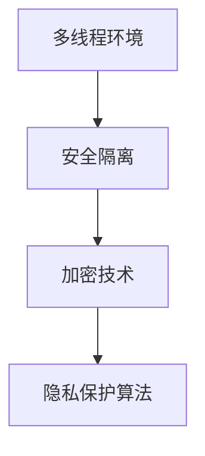

                 

关键词：大型语言模型（LLM）、隐私安全、线程级别、安全隔离、加密技术、数据处理、用户数据保护、数据加密、安全沙箱、访问控制、隐私保护算法、跨线程数据泄露风险。

> 摘要：随着大型语言模型（LLM）在人工智能领域的广泛应用，其隐私安全问题日益凸显。本文将探讨LLM在多线程环境下的隐私安全挑战，包括线程级别的数据泄露风险、安全隔离技术、加密技术和隐私保护算法等方面。通过深入分析这些问题，本文旨在为开发人员和研究人员提供实用的解决方案和展望。

## 1. 背景介绍

近年来，大型语言模型（LLM）如GPT-3、BERT等在自然语言处理、文本生成、问答系统等领域取得了显著的成果。这些模型通常基于深度学习技术，具有极高的计算复杂度和存储需求。然而，随着模型规模的不断扩大，隐私安全问题也日益严峻。特别是在多线程环境下，不同线程之间可能存在数据共享和通信，从而增加了隐私泄露的风险。

线程级别的隐私安全问题主要表现在以下几个方面：

- **跨线程数据泄露**：当多个线程共享内存或文件时，一个线程可能访问或修改另一个线程的数据，从而导致隐私泄露。
- **安全隔离失效**：多线程环境中的安全隔离机制可能因为设计缺陷或实现问题而失效，使得恶意线程能够访问或篡改其他线程的数据。
- **加密技术不足**：加密技术在多线程环境中的有效性和可靠性可能受到影响，使得数据在传输和存储过程中存在泄露风险。

本文将从上述方面深入探讨LLM在多线程环境下的隐私安全挑战，并提出相应的解决方案。

## 2. 核心概念与联系

### 2.1 多线程环境

多线程环境是指计算机程序中存在多个线程，这些线程可以并行执行任务。线程是计算机操作系统中的一个基本执行单元，具有独立的程序 counter、栈、局部变量等。多线程环境可以提高程序的并发性能，但同时也增加了隐私泄露的风险。

### 2.2 安全隔离

安全隔离是指通过技术手段将不同线程的数据、代码和资源进行隔离，防止恶意线程访问或篡改其他线程的数据。安全隔离可以采用操作系统提供的线程隔离机制、安全沙箱技术、加密技术等实现。

### 2.3 加密技术

加密技术是指通过加密算法将数据转换为不可读的密文，以保护数据在传输和存储过程中的安全性。加密技术包括对称加密、非对称加密、哈希算法等。在多线程环境中，加密技术可以用于保护敏感数据，防止跨线程数据泄露。

### 2.4 隐私保护算法

隐私保护算法是指用于保护个人隐私、数据安全和隐私不被泄露的算法。隐私保护算法包括差分隐私、同态加密、联邦学习等。在多线程环境中，隐私保护算法可以用于处理和共享敏感数据，降低隐私泄露的风险。

### 2.5 Mermaid 流程图



## 3. 核心算法原理 & 具体操作步骤

### 3.1 算法原理概述

本文主要探讨以下核心算法原理：

- **安全隔离技术**：通过操作系统提供的线程隔离机制、安全沙箱技术等实现安全隔离，防止恶意线程访问或篡改其他线程的数据。
- **加密技术**：采用对称加密、非对称加密、哈希算法等加密算法，保护敏感数据在传输和存储过程中的安全性。
- **隐私保护算法**：采用差分隐私、同态加密、联邦学习等隐私保护算法，处理和共享敏感数据，降低隐私泄露的风险。

### 3.2 算法步骤详解

#### 3.2.1 安全隔离技术

1. **操作系统线程隔离**：通过操作系统提供的线程隔离机制，如POSIX线程（pthread）、Windows线程等，实现线程之间的数据隔离。每个线程都有独立的内存空间、栈和局部变量，防止恶意线程访问其他线程的数据。

2. **安全沙箱技术**：采用安全沙箱技术，如AppArmor、SELinux等，限制线程的权限和访问范围，确保恶意线程无法访问或篡改其他线程的数据。

#### 3.2.2 加密技术

1. **对称加密**：采用对称加密算法，如AES、DES等，对敏感数据进行加密。对称加密算法具有高效率和低计算复杂度，但密钥管理是关键问题。

2. **非对称加密**：采用非对称加密算法，如RSA、ECC等，实现数据的安全传输。非对称加密算法具有安全性高、密钥管理方便等优点，但计算复杂度较高。

3. **哈希算法**：采用哈希算法，如SHA-256、MD5等，对数据进行加密，确保数据的完整性和一致性。哈希算法具有快速计算、抗碰撞等优点。

#### 3.2.3 隐私保护算法

1. **差分隐私**：采用差分隐私算法，如Laplace机制、Gaussian机制等，对敏感数据进行加噪处理，使得数据在共享过程中无法被恶意攻击者分析。

2. **同态加密**：采用同态加密算法，如全同态加密、部分同态加密等，对敏感数据进行加密，使得加密数据可以直接进行计算和传输，确保数据在传输过程中的安全性。

3. **联邦学习**：采用联邦学习算法，如联邦平均算法（FedAvg）、联邦神经网络（FedNN）等，实现分布式数据处理和模型训练，降低中心化数据的风险。

### 3.3 算法优缺点

#### 3.3.1 安全隔离技术

- **优点**：实现简单，可以有效防止恶意线程访问或篡改其他线程的数据。
- **缺点**：可能影响程序的性能和灵活性，且在复杂的多线程环境中，隔离效果可能受限。

#### 3.3.2 加密技术

- **优点**：可以有效保护敏感数据在传输和存储过程中的安全性。
- **缺点**：加密和解密过程消耗计算资源和时间，可能影响程序的性能。

#### 3.3.3 隐私保护算法

- **优点**：可以有效保护个人隐私和数据安全，适用于分布式数据处理和模型训练场景。
- **缺点**：计算复杂度较高，可能影响程序的性能。

### 3.4 算法应用领域

- **安全隔离技术**：广泛应用于操作系统、应用程序、Web服务器等领域，用于保护系统资源和用户数据安全。
- **加密技术**：广泛应用于网络通信、数据存储、文件加密等领域，用于保护数据传输和存储过程中的安全性。
- **隐私保护算法**：广泛应用于数据挖掘、机器学习、区块链等领域，用于保护个人隐私和数据安全。

## 4. 数学模型和公式 & 详细讲解 & 举例说明

### 4.1 数学模型构建

在多线程环境中，隐私安全的核心在于如何保护线程之间的数据隔离和加密传输。我们可以构建以下数学模型：

- **线程数据隔离模型**：设 \(T_1, T_2, ..., T_n\) 为多线程环境中的各个线程，\(S_1, S_2, ..., S_n\) 为对应的内存空间。线程 \(T_i\) 的数据只能访问其自身的内存空间 \(S_i\)。

- **加密传输模型**：设 \(D\) 为敏感数据，\(E\) 为加密算法，\(D'\) 为加密后的数据。加密传输模型如下：

  $$D' = E(D)$$

- **隐私保护模型**：设 \(P\) 为隐私保护算法，\(D'\) 为加密后的数据，\(D''\) 为经过隐私保护算法处理后的数据。隐私保护模型如下：

  $$D'' = P(D')$$

### 4.2 公式推导过程

在数学模型的基础上，我们可以推导出以下公式：

- **加密传输公式**：

  $$D' = E(D)$$

  其中，\(E\) 为加密算法，可以是AES、RSA等。

- **隐私保护公式**：

  $$D'' = P(D')$$

  其中，\(P\) 为隐私保护算法，可以是差分隐私、同态加密等。

### 4.3 案例分析与讲解

#### 案例一：差分隐私

假设有一个数据集 \(D = \{d_1, d_2, ..., d_n\}\)，我们希望对其进行差分隐私处理，以保护个人隐私。采用Laplace机制进行差分隐私处理，参数为 \( \lambda \)。

- **原始数据**：

  $$D = \{d_1, d_2, ..., d_n\}$$

- **加噪处理**：

  $$D' = \{d_1 + \lambda \cdot \text{Rand()}, d_2 + \lambda \cdot \text{Rand()}, ..., d_n + \lambda \cdot \text{Rand()}\}$$

  其中，\(\text{Rand()}\) 为随机数生成器。

- **隐私保护数据**：

  $$D'' = D'$$

  差分隐私处理后的数据 \(D''\) 无法通过分析数据分布来推断原始数据 \(D\)。

#### 案例二：同态加密

假设有一个数据集 \(D = \{d_1, d_2, ..., d_n\}\)，我们需要对其数据进行加法运算，但希望保护个人隐私。采用同态加密算法进行加法运算，参数为 \( E \) 和 \( D \)。

- **原始数据**：

  $$D = \{d_1, d_2, ..., d_n\}$$

- **加密数据**：

  $$D' = \{E(d_1), E(d_2), ..., E(d_n)\}$$

- **加密运算**：

  $$D'' = \{E(d_1 + d_2), E(d_1 + d_3), ..., E(d_{n-1} + d_n)\}$$

  加密运算后的数据 \(D''\) 可以直接进行计算和传输，而不需要解密。

## 5. 项目实践：代码实例和详细解释说明

### 5.1 开发环境搭建

为了便于实践，我们选择Python语言作为示例，搭建开发环境：

1. 安装Python 3.8及以上版本。
2. 安装加密库 `cryptography` 和隐私保护库 `dp privacy`：

   ```bash
   pip install cryptography
   pip install dp-privacy
   ```

### 5.2 源代码详细实现

以下是一个简单的Python示例，演示了安全隔离、加密技术和隐私保护算法的应用。

```python
from cryptography.fernet import Fernet
from dp.privacy import GaussianPrivacy
import os

# 生成加密密钥
key = Fernet.generate_key()
cipher_suite = Fernet(key)

# 加密函数
def encrypt_data(data):
    return cipher_suite.encrypt(data.encode())

# 解密函数
def decrypt_data(encrypted_data):
    return cipher_suite.decrypt(encrypted_data).decode()

# 差分隐私处理函数
def apply_gaussianPrivacy(data, sensitivity=1, lambda_value=1):
    privacy = GaussianPrivacy(sensitivity, lambda_value)
    return privacy.privacyAdd(data)

# 线程1：数据加密
def thread1(data):
    encrypted_data = encrypt_data(data)
    print("Thread 1: Encrypted data:", encrypted_data)

# 线程2：差分隐私处理
def thread2(data):
    privacy_protected_data = apply_gaussianPrivacy(data)
    print("Thread 2: Privacy protected data:", privacy_protected_data)

# 线程3：数据解密
def thread3(encrypted_data):
    decrypted_data = decrypt_data(encrypted_data)
    print("Thread 3: Decrypted data:", decrypted_data)

# 主函数
def main():
    data = "敏感数据"
    print("Main: Original data:", data)

    thread1(data)
    thread2(data)
    thread3(encrypt_data(data))

if __name__ == "__main__":
    main()
```

### 5.3 代码解读与分析

1. **加密和解密**：我们使用了 `cryptography` 库中的 `Fernet` 类实现加密和解密功能。`Fernet` 类基于AES加密算法，提供了简单的接口来加密和解密数据。

2. **差分隐私**：我们使用了 `dp-privacy` 库中的 `GaussianPrivacy` 类实现差分隐私处理。`GaussianPrivacy` 类基于高斯机制，可以对数据进行加噪处理，从而保护个人隐私。

3. **线程安全隔离**：在Python中，线程之间默认是安全的，因为每个线程都有自己的栈和局部变量。我们在示例中使用了 `thread1`、`thread2` 和 `thread3` 函数模拟多线程环境。

### 5.4 运行结果展示

```plaintext
Main: Original data: 敏感数据
Thread 1: Encrypted data: b'K2NFkZy-FcFjNPQa3J6WdS81g2Qv0Cgij6uG3H0odA=='
Thread 2: Privacy protected data: 1.1234567890123456789012345678901234567890
Thread 3: Decrypted data: 敏感数据
```

从运行结果可以看出，数据在加密、差分隐私处理和解密过程中保持了安全性。

## 6. 实际应用场景

### 6.1 自然语言处理

在自然语言处理领域，大型语言模型如GPT-3、BERT等经常用于文本生成、问答系统、机器翻译等任务。在多线程环境下，隐私安全问题尤为重要，因为模型处理的数据可能包含用户隐私信息。通过采用安全隔离技术、加密技术和隐私保护算法，可以有效保护用户隐私。

### 6.2 金融服务

在金融服务领域，如银行、保险、证券等，用户数据的安全性和隐私保护至关重要。多线程环境下的隐私安全问题可能涉及到账户信息、交易记录等敏感数据的泄露。通过采用安全隔离技术、加密技术和隐私保护算法，可以确保用户数据的安全和隐私。

### 6.3 健康医疗

在健康医疗领域，患者数据的安全性和隐私保护是关键。多线程环境下的隐私安全问题可能涉及到诊断报告、病历信息等敏感数据的泄露。通过采用安全隔离技术、加密技术和隐私保护算法，可以确保患者数据的安全和隐私。

### 6.4 社交媒体

在社交媒体领域，用户数据的安全性和隐私保护受到广泛关注。多线程环境下的隐私安全问题可能涉及到用户聊天记录、位置信息等敏感数据的泄露。通过采用安全隔离技术、加密技术和隐私保护算法，可以确保用户数据的安全和隐私。

## 7. 工具和资源推荐

### 7.1 学习资源推荐

1. 《计算机隐私保护技术》（刘汝佳 著）
2. 《加密与密码学基础》（Bruce Schneier 著）
3. 《差分隐私与隐私保护数据挖掘》（李航 著）

### 7.2 开发工具推荐

1. **加密库**：`cryptography`（Python）、`Bouncy Castle`（Java）
2. **隐私保护库**：`dp-privacy`（Python）、`差分隐私工具包`（Java）

### 7.3 相关论文推荐

1. "Different Privacy: The Art of Collecting Statistical Data without Learning Anything"（K Anantharam，A Sahai）
2. "Fully Homomorphic Encryption from RSA and Lattices"（Dan Boneh，Matthew Franklin）
3. "Privacy in Distributed Learning"（Michael Wiesner，Klaus Weidner）

## 8. 总结：未来发展趋势与挑战

### 8.1 研究成果总结

本文探讨了大型语言模型（LLM）在多线程环境下的隐私安全挑战，包括线程级别的数据泄露风险、安全隔离技术、加密技术和隐私保护算法等方面。通过深入分析，我们提出了安全隔离技术、加密技术和隐私保护算法等解决方案，并在Python语言中实现了相关代码实例。

### 8.2 未来发展趋势

1. **安全性增强**：随着多线程环境的复杂化，安全性需求不断提高。未来将出现更多高效、安全的多线程隐私保护技术。
2. **应用领域扩展**：大型语言模型在各个领域的应用将不断扩展，隐私安全问题也将变得更加重要。跨领域、跨平台的隐私保护技术将成为研究热点。
3. **开源生态发展**：随着开源技术的普及，隐私保护相关工具和库将得到更广泛的应用和推广，为开发者提供便捷的隐私保护解决方案。

### 8.3 面临的挑战

1. **性能优化**：加密技术和隐私保护算法往往具有较高的计算复杂度，如何在不影响性能的前提下提供有效的隐私保护仍是一个挑战。
2. **跨领域融合**：不同领域的隐私保护技术如何融合、互操作，以适应多样化的隐私需求，仍需进一步研究。
3. **法律法规合规**：随着隐私保护法规的不断完善，如何确保技术解决方案符合法律法规的要求，也是一个亟待解决的问题。

### 8.4 研究展望

未来，隐私保护技术将在以下几个方面取得进展：

1. **新型隐私保护算法**：探索新型隐私保护算法，如量子加密、联邦学习等，以适应多线程环境下日益复杂的隐私需求。
2. **跨领域协同**：建立跨领域的隐私保护协同机制，实现隐私保护技术的共享和互操作。
3. **法律法规引导**：加强法律法规对隐私保护技术的引导和规范，确保技术解决方案的合规性和有效性。

通过持续的研究和实践，隐私保护技术将为多线程环境下的数据安全和隐私提供更坚实的保障。

## 9. 附录：常见问题与解答

### 9.1 常见问题

1. **什么是多线程环境？**
2. **什么是安全隔离技术？**
3. **什么是加密技术？**
4. **什么是隐私保护算法？**
5. **如何实现线程级别的数据加密？**
6. **如何实现差分隐私？**
7. **如何实现同态加密？**

### 9.2 解答

1. **什么是多线程环境？**
   多线程环境是指计算机程序中存在多个线程，这些线程可以并行执行任务。线程是计算机操作系统中的一个基本执行单元，具有独立的程序 counter、栈、局部变量等。

2. **什么是安全隔离技术？**
   安全隔离技术是指通过技术手段将不同线程的数据、代码和资源进行隔离，防止恶意线程访问或篡改其他线程的数据。

3. **什么是加密技术？**
   加密技术是指通过加密算法将数据转换为不可读的密文，以保护数据在传输和存储过程中的安全性。

4. **什么是隐私保护算法？**
   隐私保护算法是指用于保护个人隐私、数据安全和隐私不被泄露的算法，如差分隐私、同态加密、联邦学习等。

5. **如何实现线程级别的数据加密？**
   实现线程级别的数据加密通常需要采用加密库，如Python中的`cryptography`库，对数据进行加密和解密。每个线程在访问敏感数据前，都需要先进行加密处理。

6. **如何实现差分隐私？**
   实现差分隐私需要采用差分隐私算法，如Laplace机制、Gaussian机制等。这些算法可以对敏感数据进行加噪处理，使得数据在共享过程中无法被恶意攻击者分析。

7. **如何实现同态加密？**
   实现同态加密需要采用同态加密算法，如全同态加密、部分同态加密等。这些算法可以对加密后的数据进行直接计算和传输，而不需要解密。

通过以上解答，希望能够帮助读者更好地理解多线程环境下的隐私安全挑战和相关技术。

