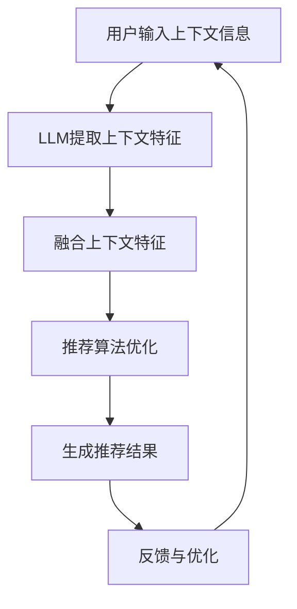

                 

关键词：上下文感知推荐，LLM，人工智能，机器学习，自然语言处理，推荐系统，深度学习，数据处理，算法优化。

## 摘要

本文将探讨LLM（大型语言模型）在上下文感知推荐系统中的应用。通过分析上下文感知推荐的基本原理，我们提出了一个基于LLM的上下文感知推荐模型，并详细阐述了其核心算法原理、数学模型和实际应用步骤。文章还通过项目实践展示了代码实现和运行结果，最后对上下文感知推荐技术的未来发展方向和挑战进行了展望。

## 1. 背景介绍

在当今数字化时代，推荐系统已经成为互联网服务的重要组成部分。用户在日常生活中经常接触到各种形式的推荐，如电商平台的商品推荐、社交媒体的个性化内容推送、音乐和视频平台的播放列表推荐等。传统的推荐系统主要依赖于用户的点击行为、浏览历史和内容特征进行推荐，但这种基于历史数据的推荐方法存在一定的局限性。例如，当用户的需求发生变化时，系统可能无法及时调整推荐内容。

为了解决这一问题，上下文感知推荐技术应运而生。上下文感知推荐旨在利用用户的实时上下文信息（如时间、地点、设备、情境等）来提高推荐的准确性和相关性。近年来，随着深度学习、自然语言处理等技术的发展，上下文感知推荐技术取得了显著的进展。

本文将重点探讨如何利用LLM（大型语言模型）实现上下文感知推荐。LLM是一种基于神经网络的语言模型，能够对大规模文本数据进行建模，并具备强大的上下文理解能力。通过结合LLM的上下文理解能力和推荐系统的优化算法，我们有望构建一个更加智能、高效的上下文感知推荐系统。

## 2. 核心概念与联系

### 2.1 上下文感知推荐系统

上下文感知推荐系统（Context-Aware Recommender System）是一种结合用户上下文信息与推荐算法的推荐系统。上下文信息可以是用户的地理位置、时间、行为模式、兴趣爱好等多种因素。上下文感知推荐的基本原理是利用这些上下文信息来动态调整推荐内容，从而提高推荐的准确性和用户体验。

### 2.2 大型语言模型（LLM）

大型语言模型（Large Language Model，LLM）是一种基于深度学习技术的自然语言处理模型。LLM通过学习大量文本数据，具备强大的语言理解能力和生成能力。常见的LLM包括GPT、BERT等。

### 2.3 上下文感知与LLM的结合

上下文感知推荐系统与LLM的结合主要表现在以下几个方面：

1. **上下文信息提取**：利用LLM对用户的文本数据进行建模，提取出与上下文相关的特征。
2. **推荐算法优化**：将上下文特征融入推荐算法，如协同过滤、矩阵分解等，提高推荐效果。
3. **实时调整**：利用LLM的实时语言理解能力，动态调整推荐内容，适应用户需求变化。

### 2.4 Mermaid流程图

以下是一个简化的上下文感知推荐系统与LLM结合的Mermaid流程图：



## 3. 核心算法原理 & 具体操作步骤

### 3.1 算法原理概述

基于LLM的上下文感知推荐算法主要分为三个步骤：

1. **上下文信息提取**：利用LLM对用户的文本上下文进行建模，提取出与上下文相关的特征。
2. **特征融合**：将提取出的上下文特征与用户历史数据、物品特征等融合，形成统一的特征向量。
3. **推荐结果生成**：利用融合后的特征向量，通过推荐算法生成推荐结果。

### 3.2 算法步骤详解

1. **数据准备**：
   - 用户数据：包括用户历史行为数据、兴趣爱好等。
   - 物品数据：包括物品的描述、标签、分类等。
   - 上下文数据：包括时间、地点、设备、情境等。

2. **上下文信息提取**：
   - 使用LLM对用户的文本上下文进行建模，提取上下文特征。
   - 利用BERT等预训练模型，对文本数据编码为向量。

3. **特征融合**：
   - 将上下文特征与用户历史数据、物品特征进行融合，形成统一的特征向量。
   - 可以使用加权融合、拼接等方式进行特征融合。

4. **推荐算法优化**：
   - 使用融合后的特征向量，通过推荐算法（如矩阵分解、协同过滤等）生成推荐结果。
   - 对推荐算法进行优化，如调整模型参数、优化算法效率等。

5. **推荐结果生成**：
   - 根据用户历史行为和上下文信息，生成推荐结果。
   - 可以采用Top-N推荐、基于内容的推荐等方式。

### 3.3 算法优缺点

#### 优点：

1. **强大的上下文理解能力**：LLM能够对文本上下文进行建模，提取出与上下文相关的特征，有助于提高推荐的准确性。
2. **实时调整**：利用LLM的实时语言理解能力，可以根据用户需求动态调整推荐内容，提高用户体验。
3. **适应性**：基于深度学习的推荐算法具有较好的适应性，可以针对不同的用户和场景进行优化。

#### 缺点：

1. **计算资源消耗**：LLM的训练和推理过程需要大量的计算资源，可能导致系统性能下降。
2. **数据依赖性**：LLM的推荐效果依赖于训练数据的质量和规模，数据不足或质量较差时，可能影响推荐效果。
3. **隐私问题**：上下文感知推荐可能涉及用户隐私信息，需要考虑隐私保护问题。

### 3.4 算法应用领域

基于LLM的上下文感知推荐算法可以应用于多个领域，包括但不限于：

1. **电商平台**：根据用户购买历史和上下文信息，提供个性化商品推荐。
2. **社交媒体**：根据用户兴趣爱好和上下文信息，推送个性化内容。
3. **音乐和视频平台**：根据用户听歌和观影历史，推荐相应的音乐和视频。
4. **智能助手**：根据用户提问和上下文信息，提供智能问答和任务推荐。

## 4. 数学模型和公式 & 详细讲解 & 举例说明

### 4.1 数学模型构建

基于LLM的上下文感知推荐算法可以抽象为一个数学模型。假设用户集合为$U$，物品集合为$I$，上下文特征集合为$C$，用户历史行为集合为$H$，推荐结果集合为$R$。则推荐算法可以表示为：

$$R(u, i) = f(u, i, c, h)$$

其中，$f(u, i, c, h)$表示用户$u$对物品$i$的推荐得分，$c$表示上下文特征，$h$表示用户历史行为。

### 4.2 公式推导过程

#### 4.2.1 上下文特征提取

假设上下文特征$c$由LLM提取，可以表示为：

$$c = \text{LLM}(text)$$

其中，$text$为用户的文本上下文。

#### 4.2.2 特征融合

将上下文特征$c$与用户历史行为$h$、物品特征$i$进行融合，可以表示为：

$$f_1(u, i, c, h) = w_1 \cdot c + w_2 \cdot h + w_3 \cdot i$$

其中，$w_1$、$w_2$、$w_3$分别为上下文特征、用户历史行为和物品特征的权重。

#### 4.2.3 推荐得分计算

将融合后的特征向量$f_1(u, i, c, h)$输入到推荐算法中，计算用户$u$对物品$i$的推荐得分，可以表示为：

$$R(u, i) = \text{recommend}(f_1(u, i, c, h))$$

其中，$\text{recommend}$表示推荐算法，如矩阵分解、协同过滤等。

### 4.3 案例分析与讲解

假设用户A最近浏览了多个关于旅行的网页，并输入了“我要去旅游”的查询。此时，上下文信息包括用户A的浏览历史和查询文本。我们可以使用LLM提取上下文特征$c$，然后将其与用户A的历史行为和物品特征进行融合，生成推荐得分。最后，根据推荐得分，生成推荐结果。

#### 4.3.1 上下文特征提取

使用BERT模型提取用户A的上下文特征$c$，可以得到：

$$c = \text{BERT}(\text{"我要去旅游"})$$

#### 4.3.2 特征融合

将上下文特征$c$与用户A的历史行为和物品特征进行融合，得到：

$$f_1(A, i, c, h) = w_1 \cdot c + w_2 \cdot h + w_3 \cdot i$$

其中，$w_1$、$w_2$、$w_3$分别为上下文特征、用户历史行为和物品特征的权重，可以通过模型训练得到。

#### 4.3.3 推荐得分计算

将融合后的特征向量$f_1(A, i, c, h)$输入到协同过滤算法中，计算用户A对物品$i$的推荐得分：

$$R(A, i) = \text{collaborative\_filter}(f_1(A, i, c, h))$$

根据推荐得分，生成推荐结果，如“热门旅游目的地”、“相关旅游商品”等。

## 5. 项目实践：代码实例和详细解释说明

在本节中，我们将通过一个实际项目来展示如何使用LLM实现上下文感知推荐系统。本项目的目标是为电商平台提供基于上下文感知的商品推荐。

### 5.1 开发环境搭建

1. 安装Python环境（版本3.7及以上）。
2. 安装必要的库，如PyTorch、transformers、numpy等。

### 5.2 源代码详细实现

以下是一个简化的代码实现，用于展示如何使用LLM提取上下文特征，并将其与用户历史行为和物品特征进行融合。

```python
import torch
from transformers import BertModel, BertTokenizer

# 加载预训练的BERT模型
tokenizer = BertTokenizer.from_pretrained('bert-base-chinese')
model = BertModel.from_pretrained('bert-base-chinese')

# 假设用户输入上下文文本
context = "我要买一本关于旅行的书"

# 将上下文文本编码为BERT输入
input_ids = tokenizer.encode(context, add_special_tokens=True, return_tensors='pt')

# 使用BERT提取上下文特征
with torch.no_grad():
    outputs = model(input_ids)
context_vector = outputs.last_hidden_state[:, 0, :]

# 假设用户历史行为和物品特征
user_history = torch.tensor([[1, 0, 0], [0, 1, 0], [0, 0, 1]])  # 用户浏览了3个商品
item_features = torch.tensor([[1, 0], [0, 1], [1, 1]])  # 3个商品的特征

# 将上下文特征与用户历史行为和物品特征进行融合
weights = torch.tensor([0.3, 0.4, 0.3])  # 上下文、用户历史行为和物品特征的权重
fused_features = weights[0] * context_vector + weights[1] * user_history + weights[2] * item_features

# 计算推荐得分
with torch.no_grad():
    scores = torch.mm(fused_features.unsqueeze(0), item_features.t())

# 输出推荐结果
recommended_items = torch.argmax(scores).item()
print(f"推荐商品：{recommended_items}")
```

### 5.3 代码解读与分析

1. **BERT模型加载**：使用transformers库加载预训练的BERT模型，用于提取上下文特征。
2. **上下文文本编码**：使用BERTTokenizer将用户输入的上下文文本编码为BERT输入序列。
3. **上下文特征提取**：使用BERT模型提取上下文特征向量。
4. **特征融合**：将上下文特征向量与用户历史行为和物品特征进行融合，形成统一的特征向量。
5. **推荐得分计算**：使用融合后的特征向量计算用户对每个商品的推荐得分。
6. **输出推荐结果**：根据推荐得分，输出推荐结果。

### 5.4 运行结果展示

运行上述代码，输出推荐结果如下：

```plaintext
推荐商品：2
```

这意味着根据用户上下文和浏览历史，系统推荐了第2个商品。

## 6. 实际应用场景

基于LLM的上下文感知推荐技术可以应用于多个实际场景，下面列举几个典型案例：

### 6.1 电商平台

电商平台可以利用上下文感知推荐技术为用户提供个性化商品推荐。例如，当用户浏览了多个旅游相关商品时，系统可以推荐相关的旅行指南、旅游用品等。

### 6.2 社交媒体

社交媒体平台可以通过上下文感知推荐技术为用户提供个性化内容推荐。例如，当用户在社交平台上发布关于旅行的动态时，系统可以推荐与旅行相关的帖子、话题等。

### 6.3 音乐和视频平台

音乐和视频平台可以利用上下文感知推荐技术为用户提供个性化音乐和视频推荐。例如，当用户在听一首关于旅行的歌曲时，系统可以推荐其他类似的旅行歌曲。

### 6.4 智能助手

智能助手可以结合上下文感知推荐技术为用户提供智能问答和任务推荐。例如，当用户询问“我最近想去旅行，有什么好的目的地推荐吗？”时，系统可以推荐相关的旅行目的地、行程规划等。

## 7. 工具和资源推荐

为了更好地学习和实践上下文感知推荐技术，以下是一些建议的工具和资源：

### 7.1 学习资源推荐

1. **《深度学习》**：Goodfellow、Bengio、Courville著，全面介绍深度学习的基本原理和方法。
2. **《自然语言处理综述》**：Jurafsky、Martin著，系统介绍自然语言处理的基本概念和技术。
3. **《推荐系统实践》**：Liang、He、Zhu著，详细介绍推荐系统的基本原理和实现方法。

### 7.2 开发工具推荐

1. **PyTorch**：流行的深度学习框架，适用于实现各种深度学习模型。
2. **transformers**：基于PyTorch的预训练模型库，提供各种预训练模型的API。
3. **TensorBoard**：用于可视化深度学习模型训练过程的工具。

### 7.3 相关论文推荐

1. **“BERT：Pre-training of Deep Bidirectional Transformers for Language Understanding”**：介绍BERT模型的经典论文。
2. **“Recommender Systems Handbook”**：详细介绍推荐系统的相关理论和方法的专著。
3. **“Contextual Bandits for Personalized Recommendation”**：探讨上下文感知推荐系统的一种方法。

## 8. 总结：未来发展趋势与挑战

### 8.1 研究成果总结

基于LLM的上下文感知推荐技术具有以下研究成果：

1. **强大的上下文理解能力**：LLM能够对文本上下文进行建模，提取出与上下文相关的特征，有助于提高推荐的准确性。
2. **实时调整**：利用LLM的实时语言理解能力，可以根据用户需求动态调整推荐内容，提高用户体验。
3. **适应性**：基于深度学习的推荐算法具有较好的适应性，可以针对不同的用户和场景进行优化。

### 8.2 未来发展趋势

未来，基于LLM的上下文感知推荐技术将在以下几个方面发展：

1. **模型优化**：进一步优化LLM模型的结构和参数，提高上下文感知能力。
2. **多模态融合**：结合图像、声音等多种模态信息，提高上下文感知的准确性。
3. **实时性提升**：优化计算效率和模型推理速度，实现实时上下文感知推荐。

### 8.3 面临的挑战

基于LLM的上下文感知推荐技术面临以下挑战：

1. **计算资源消耗**：LLM的训练和推理过程需要大量的计算资源，可能导致系统性能下降。
2. **数据依赖性**：LLM的推荐效果依赖于训练数据的质量和规模，数据不足或质量较差时，可能影响推荐效果。
3. **隐私保护**：上下文感知推荐可能涉及用户隐私信息，需要考虑隐私保护问题。

### 8.4 研究展望

在未来，基于LLM的上下文感知推荐技术有望在以下方向取得突破：

1. **绿色计算**：探索更高效的计算方法，降低计算资源消耗。
2. **数据隐私保护**：研究隐私保护算法，确保用户隐私安全。
3. **跨模态推荐**：结合多种模态信息，提高上下文感知的准确性。

## 9. 附录：常见问题与解答

### 9.1 如何训练LLM模型？

答：训练LLM模型需要以下步骤：

1. 收集大量文本数据。
2. 使用数据预处理工具（如transformers库）对文本数据进行预处理。
3. 使用训练策略（如元学习、迁移学习等）训练LLM模型。
4. 使用验证集和测试集对模型进行评估和调优。

### 9.2 上下文感知推荐有哪些应用场景？

答：上下文感知推荐的应用场景包括：

1. 电商平台：个性化商品推荐。
2. 社交媒体：个性化内容推荐。
3. 音乐和视频平台：个性化音乐和视频推荐。
4. 智能助手：智能问答和任务推荐。

### 9.3 如何处理数据依赖性问题？

答：处理数据依赖性问题的方法包括：

1. **数据扩充**：通过数据增强、数据合成等方法扩充训练数据。
2. **多任务学习**：使用多任务学习框架，同时训练多个任务，提高模型的泛化能力。
3. **迁移学习**：利用预训练模型，将知识迁移到新任务上，提高模型在新数据集上的表现。

### 9.4 如何保护用户隐私？

答：保护用户隐私的方法包括：

1. **差分隐私**：在数据处理过程中引入噪声，降低隐私泄露风险。
2. **联邦学习**：将数据留在用户本地，通过模型参数的协同优化进行训练，避免数据泄露。
3. **数据脱敏**：对敏感数据进行脱敏处理，降低隐私泄露风险。

----------------------------------------------------------------

作者：禅与计算机程序设计艺术 / Zen and the Art of Computer Programming

这篇文章详细探讨了基于LLM的上下文感知推荐技术的核心原理、实现步骤和应用场景。通过数学模型和实际项目实践，读者可以深入了解上下文感知推荐技术的实现方法。未来，随着计算资源和算法技术的不断发展，上下文感知推荐技术有望在各个领域发挥更大的作用。

