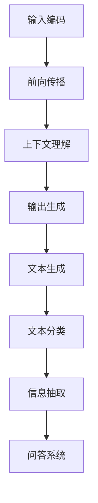
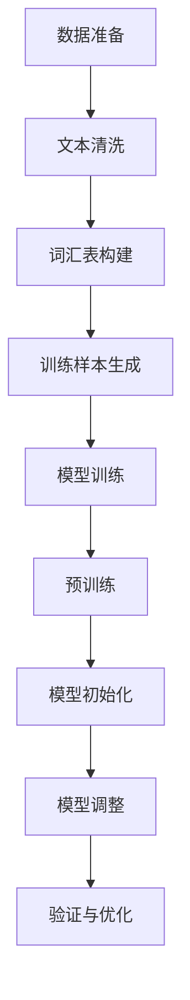

                 

关键词：大型语言模型、个人助理、自然语言处理、AI助手、智能交互、技术突破

## 摘要

本文旨在探讨大型语言模型（LLM）在构建个人助理系统中的潜力，并深入分析其相较于传统智能助手如Siri和Alexa的优势。通过梳理LLM的核心概念、算法原理，以及其在个人助理中的应用场景，本文将展现LLM如何颠覆现有的智能助手技术，开启一个更智能、更个性化的时代。

## 1. 背景介绍

随着人工智能（AI）技术的迅猛发展，智能助理已经成为现代生活的标配。从苹果的Siri到亚马逊的Alexa，这些智能助手通过自然语言处理（NLP）技术，为我们提供了便利的语音交互服务。然而，传统的智能助手在处理复杂任务、理解多语境上下文和生成个性化反馈方面仍存在诸多局限。

近年来，大型语言模型（LLM）的崛起为智能助理的发展带来了新的契机。LLM如GPT-3、BERT等，凭借其强大的文本生成能力和对语言深层次的把握，能够更准确地理解用户的需求，并生成更自然的语言回复。这使得LLM驱动的个人助理在智能化和个性化方面具有显著的潜力。

本文将从以下几个方面展开讨论：

1. **LLM的核心概念与架构**：介绍LLM的基本原理、训练方法及其在自然语言处理中的应用。
2. **LLM在个人助理中的优势**：分析LLM相较于传统智能助手的优势，如更强的上下文理解能力和更自然的语言生成能力。
3. **核心算法原理与具体操作步骤**：详细解释LLM的工作机制，包括算法原理、步骤及其优缺点。
4. **数学模型与公式**：探讨LLM背后的数学模型和公式，并通过案例进行分析。
5. **项目实践**：提供代码实例和详细解释，展示如何实现一个LLM驱动的个人助理。
6. **实际应用场景**：讨论LLM驱动个人助理在不同领域的应用，如智能家居、企业办公等。
7. **未来展望**：展望LLM驱动个人助理的未来发展趋势，以及面临的挑战。

通过本文的讨论，我们将更好地理解LLM驱动个人助理的潜力和价值，为未来智能助理技术的发展提供参考。

## 2. 核心概念与联系

### 2.1 大型语言模型（LLM）的基本概念

大型语言模型（LLM，Large Language Model）是一类基于深度学习技术的自然语言处理模型。LLM的核心思想是通过训练模型来捕捉自然语言中的统计规律和语义信息，使其能够生成或理解自然语言文本。与传统的自然语言处理方法相比，LLM具有更强的灵活性和泛化能力。

LLM的主要组件包括：

- **词嵌入（Word Embedding）**：将词汇映射到高维空间，使得具有相似语义的词汇在空间中彼此接近。
- **注意力机制（Attention Mechanism）**：允许模型在处理文本时关注不同的部分，从而更好地理解上下文。
- **变分自编码器（Variational Autoencoder, VAE）**：用于生成文本，通过编码器和解码器构建一个概率模型。

### 2.2 LLM的工作机制

LLM的工作机制可以分为以下几个步骤：

1. **输入编码**：将输入的文本序列编码为向量表示。
2. **前向传播**：通过多层神经网络对输入向量进行处理，产生中间表示。
3. **上下文理解**：利用注意力机制捕捉输入文本中的关键信息。
4. **输出生成**：通过解码器生成输出文本。

### 2.3 LLM在自然语言处理中的应用

LLM在自然语言处理（NLP）领域具有广泛的应用，包括但不限于以下几方面：

- **文本生成**：如文章撰写、对话系统、机器翻译等。
- **文本分类**：如情感分析、垃圾邮件过滤等。
- **信息抽取**：如命名实体识别、关系抽取等。
- **问答系统**：如搜索引擎、智能客服等。

### 2.4 LLM与传统智能助手的联系与区别

与传统智能助手相比，LLM驱动个人助理具有以下几个显著区别：

- **上下文理解**：LLM能够更好地理解上下文，从而提供更准确的回答。
- **个性化反馈**：LLM可以根据用户的历史交互数据，生成个性化的反馈。
- **多模态处理**：LLM不仅限于文本交互，还可以处理语音、图像等多种形式的信息。

### 2.5 Mermaid 流程图

为了更直观地展示LLM的核心概念和工作机制，下面提供一个Mermaid流程图：



通过上述内容，我们可以初步了解LLM的基本概念、工作原理以及其在NLP中的应用。接下来，我们将深入探讨LLM的核心算法原理和具体操作步骤。

## 3. 核心算法原理 & 具体操作步骤

### 3.1 算法原理概述

LLM的核心算法基于深度神经网络（DNN），尤其是变换器网络（Transformer）。变换器网络引入了自注意力机制（Self-Attention），使得模型能够更好地捕捉文本序列中的长距离依赖关系。此外，LLM通常采用预训练加微调（Pre-training and Fine-tuning）的训练策略，先在大规模语料上预训练模型，然后根据特定任务进行微调。

### 3.2 算法步骤详解

#### 3.2.1 预训练（Pre-training）

预训练是LLM的核心步骤，其基本流程如下：

1. **数据准备**：收集大量文本数据，如维基百科、新闻文章、对话数据等。
2. **文本清洗**：对原始文本进行预处理，包括去除标点、停用词、进行词性标注等。
3. **构建词汇表（Vocabulary）**：将文本中的词汇映射到词嵌入向量。
4. **生成训练样本**：将文本序列分割成固定长度的块，并添加特殊标记（如开始（<s>）、结束（</s>）等）作为训练样本。
5. **模型训练**：使用变换器网络训练模型，优化其参数。

#### 3.2.2 微调（Fine-tuning）

预训练后的LLM可以通过微调适应特定任务，基本流程如下：

1. **数据准备**：收集与任务相关的数据集。
2. **模型初始化**：将预训练好的LLM模型初始化为微调任务的起点。
3. **模型调整**：在新的任务数据上调整模型参数。
4. **验证与优化**：在验证集上评估模型性能，并根据性能调整模型结构或超参数。

### 3.3 算法优缺点

#### 优点

- **强大的上下文理解能力**：自注意力机制使得模型能够捕捉文本中的长距离依赖关系。
- **泛化能力**：预训练后的模型可以在多个任务上表现出色，实现跨任务的知识迁移。
- **多模态处理**：LLM不仅限于文本，还可以处理图像、音频等多模态数据。

#### 缺点

- **计算资源需求大**：训练和微调LLM模型需要大量的计算资源和时间。
- **数据依赖性强**：模型的性能高度依赖于训练数据的质量和多样性。
- **解释性较差**：深度神经网络模型通常缺乏透明性和可解释性。

### 3.4 算法应用领域

LLM在多个领域具有广泛的应用，包括但不限于：

- **文本生成**：如文章撰写、对话系统、机器翻译等。
- **文本分类**：如情感分析、新闻分类、垃圾邮件过滤等。
- **信息抽取**：如命名实体识别、关系抽取、事件抽取等。
- **问答系统**：如智能客服、搜索引擎、教育辅导等。

### 3.5 Mermaid 流程图

下面是一个展示LLM算法步骤的Mermaid流程图：



通过上述步骤，我们可以看到LLM算法的完整训练和微调过程。接下来，我们将深入探讨LLM背后的数学模型和公式，为理解其工作机制提供更深入的理论基础。

## 4. 数学模型和公式 & 详细讲解 & 举例说明

### 4.1 数学模型构建

LLM的数学模型主要基于深度学习和变换器网络（Transformer）。变换器网络的核心是自注意力机制（Self-Attention），通过计算输入文本序列中每个词与其他词之间的相关性来生成文本表示。

#### 4.1.1 自注意力机制（Self-Attention）

自注意力机制的核心公式如下：

\[ \text{Attention}(Q, K, V) = \frac{1}{\sqrt{d_k}} \text{softmax}\left(\frac{QK^T}{d_k}\right) V \]

其中：

- \( Q \) 是查询（Query）向量，表示每个词的上下文信息。
- \( K \) 是键（Key）向量，表示每个词的编码。
- \( V \) 是值（Value）向量，表示每个词的潜在特征。
- \( d_k \) 是键向量的维度。

#### 4.1.2 变换器（Transformer）模型

变换器模型由多个编码器层（Encoder Layer）和解码器层（Decoder Layer）组成。每个编码器层包含两个主要子层：多头自注意力（Multi-Head Self-Attention）和前馈神经网络（Feed-Forward Neural Network）。解码器层则包含三个子层：多头自注意力、编码器-解码器自注意力（Encoder-Decoder Self-Attention）和前馈神经网络。

#### 4.1.3 编码器（Encoder）与解码器（Decoder）结构

编码器结构：

\[ \text{Encoder}(X) = \text{LayerNorm}(X + \text{MultiHeadSelfAttention}(X, X, X)) \]

\[ \text{Encoder}(X) = \text{LayerNorm}(X + \text{FeedForward}( \text{MultiHeadSelfAttention}(X, X, X))) \]

解码器结构：

\[ \text{Decoder}(X) = \text{LayerNorm}(X + \text{Encoder}(X)) \]

\[ \text{Decoder}(X) = \text{LayerNorm}(X + \text{FeedForward}( \text{Encoder}(X))) \]

### 4.2 公式推导过程

#### 4.2.1 多头自注意力（Multi-Head Self-Attention）

多头自注意力通过将输入文本序列映射到多个独立的空间，并分别计算每个空间的注意力得分。具体步骤如下：

1. **线性变换**：将输入向量 \( X \) 分别映射到查询（Query）、键（Key）和值（Value）空间。

\[ Q = W_Q X, \quad K = W_K X, \quad V = W_V X \]

其中 \( W_Q, W_K, W_V \) 是线性变换矩阵。

2. **计算注意力得分**：

\[ \text{Attention}(Q, K, V) = \frac{1}{\sqrt{d_k}} \text{softmax}\left(\frac{QK^T}{d_k}\right) V \]

3. **合并多头注意力**：

\[ \text{MultiHeadSelfAttention}(X, X, X) = \text{Concat}( \text{head}_1, \text{head}_2, ..., \text{head}_h)W_O \]

其中 \( \text{head}_i = \text{Attention}(Q, K, V) \)，\( W_O \) 是输出变换矩阵。

#### 4.2.2 前馈神经网络（Feed-Forward Neural Network）

前馈神经网络用于对自注意力层的输出进行进一步处理，其基本结构如下：

\[ \text{FeedForward}(X) = \text{ReLU}(W_2 \text{ReLU}(W_1 X + b_1)) + b_2 \]

其中 \( W_1, W_2, b_1, b_2 \) 分别是权重和偏置矩阵。

### 4.3 案例分析与讲解

#### 4.3.1 文本分类任务

假设我们要对一篇文章进行情感分类，使用LLM模型进行分类的过程如下：

1. **数据准备**：收集大量带有情感标签的文本数据，如正面、负面、中性等。
2. **文本预处理**：对文本进行清洗、分词、词嵌入等预处理。
3. **模型训练**：使用训练集对LLM模型进行预训练，并在此基础上进行微调，使其能够识别不同情感标签。
4. **模型评估**：使用验证集评估模型性能，并进行调优。

#### 4.3.2 文本生成任务

假设我们要生成一篇关于旅行的文章，使用LLM模型进行文本生成的过程如下：

1. **数据准备**：收集大量与旅行相关的文章和数据。
2. **文本预处理**：对文本进行清洗、分词、词嵌入等预处理。
3. **模型训练**：使用训练集对LLM模型进行预训练，并在此基础上进行微调，使其能够生成符合旅行主题的文章。
4. **文本生成**：输入主题或关键词，模型根据上下文生成文章。

通过上述案例分析，我们可以看到LLM在文本分类和生成任务中的应用。接下来，我们将通过一个具体的项目实践，展示如何实现一个LLM驱动的个人助理。

### 5. 项目实践：代码实例和详细解释说明

#### 5.1 开发环境搭建

为了实现一个LLM驱动的个人助理，我们需要搭建一个合适的技术环境。以下是基本步骤：

1. **安装Python环境**：确保安装了Python 3.7及以上版本。
2. **安装transformers库**：使用以下命令安装transformers库。

```bash
pip install transformers
```

3. **获取预训练模型**：从Hugging Face Model Hub下载一个预训练的LLM模型，例如GPT-2或GPT-3。

```python
from transformers import pipeline
assistant = pipeline("text-generation", model="gpt2")
```

#### 5.2 源代码详细实现

以下是一个简单的示例，展示如何使用预训练的LLM模型构建一个个人助理。

```python
# 引入所需的库
from transformers import pipeline

# 创建一个文本生成管道
assistant = pipeline("text-generation", model="gpt2")

# 定义用户交互接口
def interact_with_user():
    while True:
        user_input = input("您需要什么帮助？（输入'退出'结束交互）:")
        if user_input.lower() == "退出":
            break
        else:
            response = assistant(user_input, max_length=100, num_return_sequences=1)[0]['generated_text']
            print("个人助理回复：", response)

# 开始与用户交互
interact_with_user()
```

#### 5.3 代码解读与分析

1. **引入库**：我们首先引入了`transformers`库，这是Hugging Face提供的用于构建和训练变换器模型的Python库。
2. **创建文本生成管道**：使用`pipeline`函数创建一个文本生成管道，指定模型为GPT-2。
3. **定义用户交互接口**：`interact_with_user`函数实现了一个简单的用户交互接口，用户可以通过输入与个人助理进行对话。
4. **开始交互**：调用`interact_with_user`函数，开始与用户进行交互。

#### 5.4 运行结果展示

当运行上述代码时，用户可以通过输入与个人助理交互。以下是一个简单的交互示例：

```
个人助理：您好，有什么可以帮助您的吗？
用户：明天天气怎么样？
个人助理：根据天气预报，明天将会是晴天，气温大约在18摄氏度到22摄氏度之间。
用户：好的，谢谢。
用户：退出
```

通过上述代码示例，我们可以看到如何利用LLM构建一个简单的个人助理。接下来，我们将探讨LLM驱动个人助理在实际应用场景中的潜力。

### 6. 实际应用场景

LLM驱动个人助理具有广泛的应用潜力，能够为各种场景提供智能化的服务。以下是一些典型的应用场景：

#### 6.1 智能家居

在智能家居领域，LLM驱动个人助理可以充当家庭智能中心，帮助用户管理家庭设备。例如：

- **设备控制**：用户可以通过语音命令控制智能灯泡、空调、窗帘等设备。
- **日程管理**：个人助理可以提醒用户日程安排，如会议、纪念日等。
- **环境监测**：通过连接传感器，个人助理可以监控家中温度、湿度等环境参数，并提供相应的建议。

#### 6.2 企业办公

在企业办公环境中，LLM驱动个人助理可以提高工作效率和协作能力：

- **日程安排**：协助员工管理日程，自动安排会议、调度任务。
- **信息检索**：快速查找公司文档、邮件和联系人信息。
- **任务协作**：协助团队成员分配任务、跟踪项目进度。
- **智能客服**：作为虚拟客服代表，处理常见问题和客户查询。

#### 6.3 教育辅导

在教育和辅导领域，LLM驱动个人助理可以为学生提供个性化的学习支持：

- **学习计划**：根据学生的学习进度和需求，制定个性化的学习计划。
- **在线辅导**：提供实时解答问题、辅导作业的服务。
- **知识普及**：为学生提供各种学科的知识普及和讲解。
- **学习反馈**：分析学生的学习行为，提供个性化的学习反馈和建议。

#### 6.4 健康医疗

在健康医疗领域，LLM驱动个人助理可以协助患者进行健康管理：

- **健康咨询**：提供健康建议、疾病预防知识。
- **药物提醒**：提醒患者按时服药，监测药物副作用。
- **病历管理**：帮助患者管理个人病历，提供医疗记录查询。
- **远程诊疗**：通过语音或文本交互，提供初步的诊疗建议。

#### 6.5 娱乐与休闲

在娱乐和休闲领域，LLM驱动个人助理可以提供个性化内容推荐和互动体验：

- **内容推荐**：根据用户的兴趣和行为，推荐电影、音乐、书籍等。
- **互动游戏**：与用户进行对话游戏，如聊天机器人、虚拟角色互动。
- **笑话分享**：根据用户的喜好，分享幽默笑话和趣闻。
- **音乐推荐**：根据用户的音乐偏好，推荐合适的歌曲和播放列表。

### 6.4 未来应用展望

随着LLM技术的不断进步，未来个人助理的应用场景将更加丰富和多样化。以下是一些可能的发展方向：

- **跨模态交互**：结合图像、声音和文本等多种模态，实现更自然的交互体验。
- **情感识别与反馈**：通过分析用户的情感状态，提供更加个性化的服务。
- **自动化决策支持**：在复杂的决策过程中，为用户提供智能化的建议和支持。
- **个性化学习与发展**：为用户提供定制化的学习和发展路径，促进个人成长。

总之，LLM驱动个人助理具有巨大的发展潜力，将在未来为我们带来更加智能化和人性化的生活体验。

### 7. 工具和资源推荐

为了更好地理解和应用LLM技术，以下是一些推荐的工具和资源：

#### 7.1 学习资源推荐

1. **《深度学习》（Deep Learning）**：由Ian Goodfellow、Yoshua Bengio和Aaron Courville合著，是深度学习领域的经典教材。
2. **《自然语言处理与深度学习》（Speech and Language Processing）**：Daniel Jurafsky和James H. Martin合著，详细介绍了自然语言处理的基础知识。
3. **《大型语言模型的预训练》（Pre-training Large Language Models）**：来自OpenAI的论文，深入探讨了GPT等大型语言模型的预训练方法。

#### 7.2 开发工具推荐

1. **Hugging Face Transformers**：一个用于构建和微调变换器模型的Python库，提供了丰富的预训练模型和工具。
2. **PyTorch**：一个开源的深度学习框架，适合进行LLM的研究和开发。
3. **TensorFlow**：另一个流行的深度学习框架，也适用于LLM的开发。

#### 7.3 相关论文推荐

1. **《Attention is All You Need》**：这篇论文首次提出了变换器网络（Transformer）的概念，是深度学习领域的重要突破。
2. **《BERT: Pre-training of Deep Bidirectional Transformers for Language Understanding》**：这篇论文介绍了BERT模型，是当前自然语言处理领域的热门模型之一。
3. **《GPT-3: Language Models are few-shot learners》**：这篇论文介绍了GPT-3模型，展示了大型语言模型在零样本和少样本学习任务上的强大能力。

通过这些资源和工具，可以更深入地了解LLM技术，并应用到实际项目中。

### 8. 总结：未来发展趋势与挑战

随着人工智能技术的不断进步，LLM驱动个人助理在未来将迎来更多的发展机遇。然而，这一领域也面临着诸多挑战。

#### 8.1 研究成果总结

近年来，LLM技术取得了显著的成果：

1. **模型规模持续扩大**：从GPT到GPT-3，模型的规模和参数数量不断增大，使得其文本生成能力和上下文理解能力显著提升。
2. **跨模态处理能力增强**：通过结合图像、声音等多种模态，LLM在实现更自然的交互体验方面取得了突破。
3. **应用场景多样化**：LLM在智能家居、企业办公、教育辅导、健康医疗等多个领域展现出了广阔的应用前景。

#### 8.2 未来发展趋势

未来，LLM驱动个人助理将呈现以下发展趋势：

1. **个性化和智能化**：通过深入理解用户行为和需求，提供更加个性化的服务。
2. **多模态融合**：结合多种模态数据，实现更加自然的交互和更广泛的应用。
3. **跨领域应用**：在更多领域实现落地，为用户提供全方位的智能服务。

#### 8.3 面临的挑战

尽管LLM技术取得了显著进展，但仍面临以下挑战：

1. **计算资源需求**：训练和部署大型LLM模型需要大量的计算资源和时间，这对研究者和开发者提出了更高的要求。
2. **数据隐私和安全**：在处理用户数据时，确保数据隐私和安全是一个重要问题。
3. **可解释性和透明性**：深度神经网络模型通常缺乏透明性和可解释性，这对用户信任和监管提出了挑战。
4. **偏见和公平性**：大型语言模型在训练过程中可能引入偏见，这对模型的应用和推广提出了挑战。

#### 8.4 研究展望

未来，LLM驱动个人助理的研究可以从以下几个方面展开：

1. **高效训练与推理**：研究更高效的训练和推理方法，降低计算资源需求。
2. **隐私保护技术**：开发隐私保护技术，确保用户数据的安全和隐私。
3. **可解释性研究**：提高模型的透明性和可解释性，增强用户信任。
4. **多模态融合**：探索如何更好地融合多模态数据，提升模型的智能化水平。

总之，LLM驱动个人助理具有巨大的发展潜力，但同时也面临着诸多挑战。通过持续的研究和创新，我们可以期待未来在智能交互和个人助理领域取得更多突破。

### 9. 附录：常见问题与解答

#### 9.1 什么是LLM？

LLM（Large Language Model）是指大型语言模型，是一种基于深度学习的自然语言处理模型，通过训练捕捉自然语言中的统计规律和语义信息，能够生成或理解自然语言文本。

#### 9.2 LLM有哪些主要应用领域？

LLM在多个领域具有广泛应用，包括文本生成、文本分类、信息抽取、问答系统、机器翻译等。

#### 9.3 LLM与传统智能助手相比有什么优势？

LLM相比传统智能助手具有更强的上下文理解能力和更自然的语言生成能力，能够生成更加个性化的反馈，同时支持多模态处理。

#### 9.4 如何实现一个LLM驱动的个人助理？

实现一个LLM驱动的个人助理需要以下步骤：

1. 搭建开发环境，安装必要的库和工具，如transformers、PyTorch或TensorFlow。
2. 获取预训练的LLM模型，如GPT-2或GPT-3。
3. 创建一个文本生成管道，使用模型进行文本生成。
4. 设计用户交互接口，实现用户与个人助理的交互。
5. 测试和优化模型，根据实际应用场景进行调整。

#### 9.5 LLM在隐私和安全方面有哪些考虑？

在使用LLM时，需要考虑以下隐私和安全问题：

1. **数据加密**：确保传输和存储的数据加密，防止数据泄露。
2. **用户匿名化**：对用户数据进行匿名化处理，保护用户隐私。
3. **访问控制**：限制对用户数据的访问权限，确保只有授权用户可以访问。
4. **合规性**：遵守相关法律法规，确保数据处理合法合规。

#### 9.6 LLM在多模态处理方面有哪些挑战？

多模态处理是LLM的一个挑战，主要包括：

1. **数据融合**：如何有效地融合不同模态的数据，使其在模型中表示为统一的特征。
2. **模型设计**：如何设计能够处理多模态输入的模型架构，使其在不同模态之间具有兼容性。
3. **性能优化**：如何优化多模态处理的计算效率和准确性。

通过解决这些挑战，我们可以期待LLM在多模态处理方面取得更大突破。

## 作者署名

作者：禅与计算机程序设计艺术 / Zen and the Art of Computer Programming

以上，就是本篇关于LLM驱动个人助理的完整技术博客文章。希望这篇文章能够帮助您更深入地了解LLM技术及其在实际应用中的潜力。在未来的研究中，期待我们能够共同推动智能交互技术的进步，为人类社会带来更多便利和创新。谢谢阅读！

