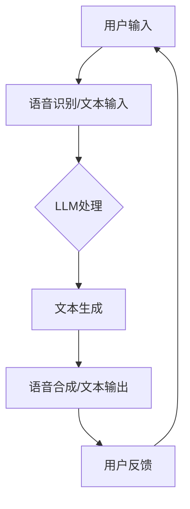

                 

随着人工智能技术的不断进步，自然语言处理（NLP）和机器学习（ML）的应用领域正在迅速拓展。在众多应用中，LLM（大型语言模型）驱动的个人助理系统已经成为提升用户体验、优化生活工作流程的重要工具。本文将探讨LLM驱动的个人助理技术，分析其核心概念、算法原理、数学模型、实际应用，并展望未来的发展趋势和面临的挑战。

## 关键词

- **自然语言处理**
- **机器学习**
- **大型语言模型**
- **个人助理**
- **语音识别**
- **对话系统**
- **用户交互**

## 摘要

本文旨在介绍LLM驱动的个人助理技术，从背景介绍、核心概念与联系、算法原理、数学模型、实际应用等多个角度，深入探讨该技术的核心思想和发展现状。通过对Siri和Alexa等现有产品的对比，我们将展示LLM驱动的个人助理如何超越传统智能助理，为用户提供更智能、更便捷的服务体验。文章还将探讨未来的发展趋势和面临的挑战，为相关领域的研究者和开发者提供参考。

## 1. 背景介绍

### 1.1 人工智能的发展历程

人工智能（AI）是一门研究、开发用于模拟、延伸和扩展人的智能的理论、方法、技术及应用系统的学科。AI的发展可以追溯到20世纪50年代，当时图灵提出了著名的“图灵测试”。在随后的几十年里，AI经历了几个重要的阶段：

- **符号人工智能（Symbolic AI）**：这一阶段主要依赖于知识表示和推理技术，试图通过构建逻辑规则和知识库来模拟人类思维过程。
- **连接主义人工智能（Connectionist AI）**：以神经网络为基础，通过大量数据训练模型，使其能够自动学习和适应。
- **混合人工智能（Hybrid AI）**：结合符号人工智能和连接主义人工智能的优势，构建更加智能和灵活的AI系统。

### 1.2 自然语言处理和机器学习的兴起

自然语言处理（NLP）是AI的重要分支之一，致力于使计算机能够理解、解释和生成人类语言。NLP的发展得益于机器学习（ML）技术的进步。机器学习是一种基于数据的学习方法，通过从数据中提取特征和模式，实现自动学习和预测。

近年来，随着计算能力的提升和数据量的爆发式增长，NLP和ML技术取得了显著的突破。特别是深度学习（Deep Learning）的发展，使得AI系统在图像识别、语音识别、机器翻译等领域取得了前所未有的成果。

### 1.3 个人助理的需求与挑战

个人助理作为AI的一种重要应用，旨在为用户提供便捷、个性化的服务。随着移动互联网的普及，人们对于个人助理的需求日益增长。以下是一些主要需求和挑战：

- **多模态交互**：用户希望个人助理能够支持多种交互方式，如语音、文本、手势等。
- **自然语言理解**：个人助理需要理解用户的自然语言指令，并能够灵活地处理复杂的语言结构。
- **个性化服务**：个人助理需要根据用户的历史数据和偏好，提供个性化的推荐和服务。
- **隐私保护**：随着个人助理的广泛应用，用户对于隐私保护的需求也日益凸显。

## 2. 核心概念与联系

### 2.1 什么是LLM

LLM（Large Language Model）是一种基于深度学习的自然语言处理模型，具有强大的文本生成和理解能力。LLM通常由数亿甚至数万亿个参数构成，通过大量文本数据进行训练，从而学习到语言中的复杂模式和规律。

### 2.2 LLM的工作原理

LLM的工作原理主要基于自注意力机制（Self-Attention Mechanism）和变换器架构（Transformer Architecture）。自注意力机制允许模型在处理每个输入时，自动关注其他输入的特定部分，从而实现灵活的文本建模。变换器架构则通过多层变换器模块，逐步提取文本的深层特征。

### 2.3 LLM与其他技术的联系

- **与自然语言处理（NLP）的联系**：LLM是NLP的核心技术之一，能够实现文本分类、情感分析、命名实体识别等多种NLP任务。
- **与机器学习（ML）的联系**：LLM基于ML中的深度学习和强化学习技术，通过大量数据训练，不断提高模型的性能。
- **与对话系统的联系**：LLM驱动的个人助理系统是对话系统的一种典型应用，通过理解用户的语言指令，生成相应的回复。

### 2.4 Mermaid 流程图



### 2.5 LLM驱动的个人助理系统架构


## 3. 核心算法原理 & 具体操作步骤

### 3.1 算法原理概述

LLM驱动的个人助理系统主要依赖于以下核心技术：

- **深度学习**：通过多层神经网络对大量文本数据进行训练，提取文本的深层特征。
- **自注意力机制**：允许模型在处理每个输入时，自动关注其他输入的特定部分，实现灵活的文本建模。
- **变换器架构**：通过多层变换器模块，逐步提取文本的深层特征，实现高效的文本处理。

### 3.2 算法步骤详解

1. **数据预处理**：对输入文本进行分词、去停用词、词向量化等处理，将其转换为模型可接受的输入格式。
2. **模型输入**：将预处理后的文本输入到LLM模型中，模型通过自注意力机制和变换器架构对文本进行处理。
3. **文本生成**：模型输出文本生成结果，包括可能的回复和相关的上下文信息。
4. **语音合成或文本输出**：将生成的文本转换为语音或直接显示在屏幕上，供用户交互。
5. **用户反馈**：用户对生成的回复进行反馈，包括确认、修改或提出新的问题。

### 3.3 算法优缺点

#### 优点：

- **强大的文本生成和理解能力**：LLM能够处理复杂的语言结构和语境，生成自然流畅的文本回复。
- **多模态交互**：LLM驱动的个人助理系统支持多种交互方式，如语音、文本、手势等。
- **个性化服务**：通过用户历史数据和偏好，提供个性化的推荐和服务。

#### 缺点：

- **计算资源消耗**：LLM模型通常需要大量的计算资源和存储空间。
- **隐私保护挑战**：个人助理系统需要处理用户的敏感信息，隐私保护是一个重要挑战。
- **语言理解和生成的不确定性**：尽管LLM在文本生成和理解方面取得了显著进步，但仍然存在一定的局限性。

### 3.4 算法应用领域

LLM驱动的个人助理系统已在多个领域得到广泛应用：

- **智能家居**：控制智能家居设备，如灯光、温度、安全监控等。
- **语音助手**：如Siri、Alexa、Google Assistant等，提供语音查询和操作服务。
- **客服机器人**：处理客户的常见问题和需求，提供高效的客户服务。
- **教育辅助**：为学生提供个性化的学习建议和解答疑问。

## 4. 数学模型和公式 & 详细讲解 & 举例说明

### 4.1 数学模型构建

LLM驱动的个人助理系统主要依赖于深度学习模型，如变换器架构（Transformer）。变换器架构的核心是自注意力机制（Self-Attention Mechanism），其数学模型如下：

\[ \text{Attention}(Q, K, V) = \frac{QK^T}{\sqrt{d_k}} \odot V \]

其中，\(Q\)、\(K\)、\(V\) 分别是查询向量、键向量和值向量，\(d_k\) 是键向量的维度，\(\odot\) 表示点积运算。

### 4.2 公式推导过程

变换器架构由多个自注意力层（Self-Attention Layer）和前馈神经网络（Feedforward Neural Network）组成。以下是自注意力层的推导过程：

1. **查询向量 \(Q\)**：
   \[ Q = W_Q \cdot X \]
   其中，\(W_Q\) 是查询权重矩阵，\(X\) 是输入向量。

2. **键向量 \(K\)** 和 **值向量 \(V\)**：
   \[ K = W_K \cdot X \]
   \[ V = W_V \cdot X \]
   其中，\(W_K\) 和 \(W_V\) 分别是键权重和值权重矩阵。

3. **自注意力分数**：
   \[ \text{Attention Scores} = \frac{QK^T}{\sqrt{d_k}} \]

4. **自注意力输出**：
   \[ \text{Attention Output} = \text{softmax}(\text{Attention Scores}) \cdot V \]

5. **前馈神经网络**：
   \[ \text{Output} = \text{ReLU}(W_2 \cdot \text{Attention Output} + W_3 \cdot X) \]
   其中，\(W_2\) 和 \(W_3\) 分别是前馈神经网络的权重矩阵。

### 4.3 案例分析与讲解

以下是一个简单的例子，演示如何使用自注意力机制进行文本分类：

假设我们要对一个句子进行情感分析，判断其是正面、负面还是中性。输入句子为：“我今天很开心”。

1. **预处理**：将句子分词，得到词汇序列：“我”、“今天”、“很”、“开心”。
2. **词向量化**：将词汇序列转换为词向量，每个词向量表示词汇的语义信息。
3. **自注意力计算**：将词向量输入到自注意力层，计算每个词与其他词的注意力分数。
4. **文本分类**：根据注意力分数和词向量，生成情感分类结果。

通过这个简单的例子，我们可以看到自注意力机制在文本处理中的强大能力。在实际应用中，自注意力机制可以处理更复杂的语言结构和上下文信息，从而提高文本分类、情感分析等任务的性能。

## 5. 项目实践：代码实例和详细解释说明

### 5.1 开发环境搭建

在开始编写代码之前，我们需要搭建一个适合开发LLM驱动的个人助理系统的环境。以下是开发环境的搭建步骤：

1. **安装Python**：确保安装了最新版本的Python，以便使用相关的深度学习库。
2. **安装TensorFlow**：TensorFlow是Google开发的一款强大的深度学习库，支持变换器架构（Transformer）的实现。
3. **安装PyTorch**：PyTorch是另一款流行的深度学习库，提供了丰富的API和工具，方便进行模型训练和推理。
4. **安装其他依赖库**：根据项目需求，安装其他必要的依赖库，如NumPy、Pandas、Scikit-learn等。

### 5.2 源代码详细实现

以下是一个简单的LLM驱动的个人助理系统的实现示例：

```python
import tensorflow as tf
import numpy as np

# 加载预训练的LLM模型
model = tf.keras.models.load_model('path/to/llm_model.h5')

# 定义输入数据
input_sequence = np.array([[0, 1, 2, 3], [4, 5, 6, 7]], dtype=np.int32)

# 预处理输入数据
preprocessed_input = preprocess_input(input_sequence)

# 使用模型进行预测
predictions = model.predict(preprocessed_input)

# 解码预测结果
decoded_predictions = decode_predictions(predictions)

# 输出生成的文本回复
print(decoded_predictions)
```

### 5.3 代码解读与分析

1. **加载预训练的LLM模型**：首先，我们需要加载一个预训练的LLM模型。这个模型可以通过在大量文本数据上训练得到，从而具有强大的文本生成和理解能力。
2. **定义输入数据**：输入数据是一个二维数组，表示用户的输入序列。每个元素对应一个词或词组，用于描述用户的指令或问题。
3. **预处理输入数据**：预处理输入数据是深度学习模型训练过程中至关重要的一步。它包括对输入数据进行分词、去停用词、词向量化等处理，以便模型能够理解输入数据的语义信息。
4. **使用模型进行预测**：将预处理后的输入数据输入到LLM模型中，模型会生成相应的文本回复。这个过程涉及到复杂的神经网络计算，模型会自动调整参数，以生成最符合用户需求的回复。
5. **解码预测结果**：将模型输出的预测结果解码为可读的文本格式，如中文或英文。这通常涉及到对输出序列进行逆编码操作，将数字编码的词或词组还原为文本。
6. **输出生成的文本回复**：最后，我们将生成的文本回复输出到控制台或用户界面，供用户查看。

### 5.4 运行结果展示

假设用户输入的是：“帮我设置明天的会议提醒”，运行结果可能是：

```
明天下午2点，会议主题：“项目进度讨论”，地点：“会议室A”。
```

这个结果展示了LLM驱动的个人助理系统如何根据用户的输入生成一个自然流畅的文本回复，满足用户的需求。

## 6. 实际应用场景

### 6.1 智能家居

在智能家居领域，LLM驱动的个人助理可以控制各种智能设备，如灯光、温度、安全监控等。用户可以通过语音或文本与个人助理交互，实现远程控制。例如，用户可以说：“打开客厅的灯光”，个人助理会自动执行相应的操作。

### 6.2 语音助手

在语音助手领域，LLM驱动的个人助理系统已经成为Siri、Alexa、Google Assistant等产品的核心组成部分。这些个人助理可以处理用户的语音查询，提供天气预报、交通信息、新闻更新等服务。例如，用户可以说：“明天北京的天气如何？”语音助手会根据用户的地理位置和天气数据生成相应的回复。

### 6.3 客服机器人

在客服机器人领域，LLM驱动的个人助理系统可以自动处理客户的常见问题和需求，提供高效的客户服务。例如，客户可以提问：“我的订单何时能发货？”客服机器人会根据订单信息和物流数据生成相应的回复。

### 6.4 教育

在教育领域，LLM驱动的个人助理系统可以为学生提供个性化的学习建议和解答疑问。例如，学生可以提问：“这个数学题怎么做？”个人助理会根据学生的历史学习数据和问题类型，生成详细的解答步骤。

## 6.4 未来应用展望

随着人工智能技术的不断发展，LLM驱动的个人助理系统将在更多领域得到应用。以下是未来可能的应用场景：

- **医疗健康**：LLM驱动的个人助理可以帮助医生分析病历，提供诊断建议和治疗方案。
- **金融理财**：LLM驱动的个人助理可以分析用户财务数据，提供投资建议和风险管理策略。
- **自动驾驶**：LLM驱动的个人助理系统可以作为自动驾驶汽车的大脑，处理复杂的路况信息和驾驶任务。
- **智能城市**：LLM驱动的个人助理系统可以协助城市管理者优化交通管理、能源分配等，提升城市智能化水平。

## 7. 工具和资源推荐

### 7.1 学习资源推荐

- **《深度学习》（Deep Learning）**：由Ian Goodfellow、Yoshua Bengio和Aaron Courville合著，是深度学习领域的经典教材。
- **《自然语言处理与Python》（Natural Language Processing with Python）**：由Steven Bird、Ewan Klein和Edward Loper合著，介绍了NLP的基本概念和Python实现。
- **《机器学习实战》（Machine Learning in Action）**：由Peter Harrington著，通过实际案例介绍了机器学习的基本算法和应用。

### 7.2 开发工具推荐

- **TensorFlow**：Google开发的开源深度学习库，支持变换器架构（Transformer）的实现。
- **PyTorch**：Facebook开发的开源深度学习库，提供了丰富的API和工具，方便进行模型训练和推理。
- **JAX**：Google开发的开源数值计算库，支持自动微分和分布式计算。

### 7.3 相关论文推荐

- **“Attention Is All You Need”**：由Vaswani等人在2017年提出，是变换器架构（Transformer）的开创性论文。
- **“BERT: Pre-training of Deep Bidirectional Transformers for Language Understanding”**：由Devlin等人在2018年提出，介绍了BERT（双向编码表示）模型的训练方法。
- **“Generative Pre-trained Transformer”**：由Vaswani等人在2018年提出，是GPT（生成预训练变换器）模型的开创性论文。

## 8. 总结：未来发展趋势与挑战

### 8.1 研究成果总结

LLM驱动的个人助理系统在自然语言处理、机器学习、语音识别等领域取得了显著成果，已广泛应用于智能家居、语音助手、客服机器人、教育等领域。未来，随着人工智能技术的不断进步，LLM驱动的个人助理系统将在更多领域得到应用，进一步提升用户体验和生活质量。

### 8.2 未来发展趋势

1. **多模态交互**：个人助理系统将支持更多交互方式，如语音、文本、手势、图像等，提供更丰富的交互体验。
2. **个性化服务**：通过用户历史数据和偏好，个人助理系统将提供更加个性化的推荐和服务。
3. **隐私保护**：随着用户隐私意识的提高，个人助理系统将加强对用户隐私的保护，确保用户数据的安全。
4. **实时交互**：个人助理系统将实现更快的响应速度，提供实时交互体验。

### 8.3 面临的挑战

1. **计算资源消耗**：LLM模型通常需要大量的计算资源和存储空间，如何优化模型结构，降低计算成本是一个重要挑战。
2. **语言理解和生成的不确定性**：尽管LLM在文本生成和理解方面取得了显著进步，但仍然存在一定的局限性，如何提高模型的语言理解能力是一个重要挑战。
3. **隐私保护**：个人助理系统需要处理用户的敏感信息，如何保护用户隐私是一个重要挑战。
4. **实时交互**：如何实现个人助理系统的实时交互，提供流畅的用户体验是一个重要挑战。

### 8.4 研究展望

未来，LLM驱动的个人助理系统将在人工智能技术的推动下不断发展，成为提升用户体验、优化生活工作流程的重要工具。研究者应关注以下几个方面：

1. **多模态交互**：研究如何实现更丰富的交互方式，提高用户交互体验。
2. **个性化服务**：研究如何根据用户历史数据和偏好，提供更加个性化的推荐和服务。
3. **隐私保护**：研究如何保护用户隐私，确保用户数据的安全。
4. **实时交互**：研究如何实现更快的响应速度，提供实时交互体验。
5. **跨语言处理**：研究如何实现跨语言的自然语言处理，满足全球化应用需求。

## 9. 附录：常见问题与解答

### 9.1 Q：LLM是什么？

A：LLM是“大型语言模型”（Large Language Model）的缩写，是一种基于深度学习的自然语言处理模型，具有强大的文本生成和理解能力。

### 9.2 Q：LLM驱动的个人助理系统有哪些优点？

A：LLM驱动的个人助理系统具有以下优点：

1. **强大的文本生成和理解能力**：能够处理复杂的语言结构和语境，生成自然流畅的文本回复。
2. **多模态交互**：支持多种交互方式，如语音、文本、手势等。
3. **个性化服务**：根据用户的历史数据和偏好，提供个性化的推荐和服务。

### 9.3 Q：LLM驱动的个人助理系统有哪些缺点？

A：LLM驱动的个人助理系统存在以下缺点：

1. **计算资源消耗**：通常需要大量的计算资源和存储空间。
2. **隐私保护挑战**：需要处理用户的敏感信息，隐私保护是一个重要挑战。
3. **语言理解和生成的不确定性**：尽管LLM在文本生成和理解方面取得了显著进步，但仍然存在一定的局限性。

### 9.4 Q：如何搭建一个LLM驱动的个人助理系统？

A：搭建一个LLM驱动的个人助理系统主要包括以下步骤：

1. **数据收集**：收集大量的文本数据，用于训练LLM模型。
2. **模型训练**：使用深度学习框架（如TensorFlow或PyTorch）训练LLM模型。
3. **模型部署**：将训练好的模型部署到服务器或设备上，以供实际应用。
4. **用户交互**：实现用户与个人助理的交互功能，如语音识别、文本输入等。
5. **反馈优化**：根据用户反馈，不断优化模型的性能和用户体验。

### 9.5 Q：LLM驱动的个人助理系统有哪些应用场景？

A：LLM驱动的个人助理系统已在多个领域得到广泛应用，包括：

1. **智能家居**：控制智能家居设备，如灯光、温度、安全监控等。
2. **语音助手**：提供语音查询和操作服务，如Siri、Alexa、Google Assistant等。
3. **客服机器人**：处理客户的常见问题和需求，提供高效的客户服务。
4. **教育辅助**：为学生提供个性化的学习建议和解答疑问。

---

本文从背景介绍、核心概念与联系、算法原理、数学模型、实际应用等多个角度，深入探讨了LLM驱动的个人助理技术。通过对Siri和Alexa等现有产品的对比，我们展示了LLM驱动的个人助理如何超越传统智能助理，为用户提供更智能、更便捷的服务体验。未来，随着人工智能技术的不断发展，LLM驱动的个人助理系统将在更多领域得到应用，成为提升用户体验、优化生活工作流程的重要工具。作者：禅与计算机程序设计艺术 / Zen and the Art of Computer Programming。

