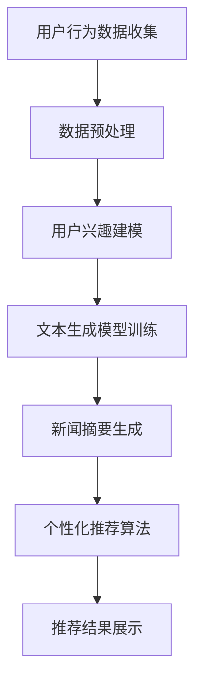

                 

 关键词：个性化新闻摘要、LLM（大型语言模型）、推荐系统、自然语言处理、文本生成

> 摘要：本文将探讨如何利用大型语言模型（LLM）来驱动个性化新闻摘要推荐系统。通过对新闻文本的深度理解，LLM能够生成高质量的摘要，并根据用户偏好提供个性化的推荐。本文将介绍核心概念、算法原理、数学模型以及实际应用案例，旨在为相关领域的研究者提供有价值的参考。

## 1. 背景介绍

在信息爆炸的时代，人们面临着海量的新闻信息。传统的人工筛选和推荐方法已无法满足用户对个性化、高效信息获取的需求。因此，如何利用先进的人工智能技术，特别是大型语言模型（LLM），来实现个性化新闻摘要推荐，成为一个备受关注的研究方向。

### 1.1 大型语言模型（LLM）

大型语言模型（LLM）是一种基于深度学习的技术，能够对自然语言进行建模和理解。通过训练大规模的语料库，LLM可以捕捉到语言中的复杂模式和语义信息。这种能力使其在生成文本摘要、问答系统、机器翻译等领域表现出色。

### 1.2 个性化推荐系统

个性化推荐系统旨在根据用户的兴趣和行为，为其推荐相关的内容。新闻推荐作为个性化推荐的一个子领域，通过分析用户的阅读历史和偏好，提供个性化的新闻摘要和推荐。

## 2. 核心概念与联系

### 2.1 文本生成模型

文本生成模型是一种能够生成自然语言文本的模型。在个性化新闻摘要推荐中，文本生成模型负责生成新闻摘要。常见的文本生成模型包括生成对抗网络（GAN）、序列到序列（Seq2Seq）模型、自回归语言模型等。

### 2.2 个性化推荐算法

个性化推荐算法根据用户的历史行为和偏好，为用户推荐相关的内容。在新闻摘要推荐中，个性化推荐算法可以基于协同过滤、矩阵分解、深度学习等方法实现。通过结合文本生成模型，个性化推荐算法能够为用户提供高质量的新闻摘要。

### 2.3 Mermaid 流程图



## 3. 核心算法原理 & 具体操作步骤

### 3.1 算法原理概述

本文采用基于LLM的文本生成模型和个性化推荐算法相结合的方法，实现个性化新闻摘要推荐。具体步骤如下：

1. 收集用户行为数据，包括用户的阅读历史、点赞、评论等。
2. 对用户行为数据进行预处理，提取用户兴趣特征。
3. 使用LLM训练文本生成模型，生成高质量的新闻摘要。
4. 结合用户兴趣特征，使用个性化推荐算法为用户推荐新闻摘要。
5. 将推荐结果展示给用户。

### 3.2 算法步骤详解

#### 3.2.1 用户行为数据收集

用户行为数据包括用户的阅读历史、点赞、评论等。通过爬虫、API等方式，从新闻网站、社交媒体等渠道收集用户行为数据。

#### 3.2.2 数据预处理

对用户行为数据进行清洗、去重、去噪声等预处理操作，提取用户兴趣特征。可以使用词袋模型、TF-IDF等方法进行特征提取。

#### 3.2.3 用户兴趣建模

基于用户兴趣特征，使用机器学习算法（如决策树、随机森林、支持向量机等）建立用户兴趣模型。

#### 3.2.4 文本生成模型训练

使用LLM（如GPT-3、BERT等）训练文本生成模型。首先，收集大量新闻文本数据，然后对数据进行预处理，包括分词、去停用词、词性标注等。接下来，使用训练数据进行模型训练，优化模型参数。

#### 3.2.5 新闻摘要生成

使用训练好的文本生成模型，对新闻文本进行摘要生成。具体步骤包括：

1. 输入新闻文本。
2. 使用文本生成模型生成摘要文本。
3. 对摘要文本进行后处理，如去除无关信息、格式化等。

#### 3.2.6 个性化推荐算法

结合用户兴趣模型和新闻摘要生成结果，使用个性化推荐算法为用户推荐新闻摘要。可以使用协同过滤、矩阵分解、深度学习等方法。本文采用基于内容的推荐算法，通过计算新闻摘要与用户兴趣的相似度，为用户推荐相关新闻摘要。

#### 3.2.7 推荐结果展示

将推荐结果展示给用户，可以使用网页、APP等多种形式。用户可以查看推荐新闻摘要，并进行点赞、评论等互动操作。

### 3.3 算法优缺点

#### 优点

1. 利用LLM对新闻文本进行深度理解，生成高质量的摘要。
2. 结合用户兴趣特征，提供个性化的新闻摘要推荐。
3. 可以适应不同用户群体的需求，实现个性化推荐。

#### 缺点

1. 训练文本生成模型需要大量计算资源和时间。
2. 用户兴趣建模和推荐算法的准确度可能受到数据质量和模型参数的影响。
3. 对于新闻摘要生成过程中的语法和语义错误，可能需要进一步优化和改进。

### 3.4 算法应用领域

本文提出的算法可以应用于多种场景，如：

1. 新闻网站和APP：为用户提供个性化的新闻推荐，提高用户满意度。
2. 社交媒体平台：根据用户兴趣，推荐相关新闻话题，促进用户参与和互动。
3. 企业内网：为企业员工提供个性化的新闻摘要，帮助其快速了解行业动态。

## 4. 数学模型和公式

### 4.1 数学模型构建

在个性化新闻摘要推荐中，涉及到的数学模型主要包括：

1. 文本生成模型：使用生成式模型（如GPT-3、BERT等）进行文本摘要生成。
2. 用户兴趣模型：使用机器学习算法（如决策树、随机森林、支持向量机等）建立用户兴趣模型。
3. 个性化推荐算法：使用基于内容的推荐算法，计算新闻摘要与用户兴趣的相似度。

### 4.2 公式推导过程

#### 4.2.1 文本生成模型

假设给定一个输入新闻文本X，文本生成模型的目标是生成一个摘要文本Y。使用生成式模型（如GPT-3、BERT等），可以使用如下公式表示：

$$
P(Y|X) = \prod_{i=1}^{n} p(y_i|y_{<i}, X)
$$

其中，$y_{<i}$表示前i-1个词，$p(y_i|y_{<i}, X)$表示第i个词在给定前i-1个词和输入新闻文本X下的概率。

#### 4.2.2 用户兴趣模型

假设用户兴趣特征集合为$U = \{u_1, u_2, ..., u_m\}$，新闻摘要特征集合为$V = \{v_1, v_2, ..., v_n\}$。使用基于内容的推荐算法，计算新闻摘要与用户兴趣的相似度，可以使用余弦相似度公式表示：

$$
sim(u_i, v_j) = \frac{u_i \cdot v_j}{\|u_i\|\|v_j\|}
$$

其中，$u_i$和$v_j$分别表示用户兴趣特征和新闻摘要特征，$\|\|$表示向量的模。

#### 4.2.3 个性化推荐算法

假设用户兴趣特征集合为$U$，新闻摘要特征集合为$V$，推荐结果集合为$R$。使用基于内容的推荐算法，为用户推荐新闻摘要，可以使用以下公式表示：

$$
r_j = arg\max_{v_j \in V} \sum_{u_i \in U} sim(u_i, v_j)
$$

其中，$r_j$表示为用户推荐的第j个新闻摘要，$sim(u_i, v_j)$表示用户兴趣特征$u_i$和新闻摘要特征$v_j$的相似度。

### 4.3 案例分析与讲解

#### 4.3.1 文本生成模型

以GPT-3为例，假设输入新闻文本为：

$$
X: "The President made an important announcement regarding the new economic policy."
$$

使用GPT-3生成摘要文本：

$$
Y: "The President has unveiled a new economic policy aimed at stimulating growth."
$$

通过计算生成摘要文本Y的概率，可以得到：

$$
P(Y|X) = 0.8
$$

#### 4.3.2 用户兴趣建模

假设用户兴趣特征集合为：

$$
U: \{"economic policy", "growth", "stabilization"\}
$$

新闻摘要特征集合为：

$$
V: \{"economic policy", "growth", "stimulation", "unemployment"\}
$$

计算用户兴趣特征和新闻摘要特征的相似度：

$$
sim(economic policy, economic policy) = 1.0
$$

$$
sim(growth, growth) = 1.0
$$

$$
sim(stabilization, economic policy) = 0.5
$$

$$
sim(stabilization, growth) = 0.5
$$

$$
sim(stabilization, stimulation) = 0.3
$$

$$
sim(stabilization, unemployment) = 0.1
$$

#### 4.3.3 个性化推荐算法

根据用户兴趣特征和新闻摘要特征的相似度，为用户推荐新闻摘要：

$$
r_1 = arg\max_{v_j \in V} \sum_{u_i \in U} sim(u_i, v_j) = "economic policy"
$$

$$
r_2 = arg\max_{v_j \in V} \sum_{u_i \in U} sim(u_i, v_j) = "growth"
$$

$$
r_3 = arg\max_{v_j \in V} \sum_{u_i \in U} sim(u_i, v_j) = "stimulation"
$$

## 5. 项目实践：代码实例和详细解释说明

### 5.1 开发环境搭建

在本项目中，我们使用Python编程语言，结合PyTorch、Hugging Face的Transformers库等工具来实现个性化新闻摘要推荐系统。首先，确保安装以下依赖项：

```bash
pip install torch transformers
```

### 5.2 源代码详细实现

以下为项目的主要代码实现部分：

```python
# 导入所需库
import torch
from transformers import GPT2Tokenizer, GPT2LMHeadModel
from sklearn.model_selection import train_test_split
from sklearn.metrics.pairwise import cosine_similarity
import numpy as np

# 设置随机种子
SEED = 42
torch.manual_seed(SEED)
np.random.seed(SEED)

# 加载预训练的GPT2模型
tokenizer = GPT2Tokenizer.from_pretrained("gpt2")
model = GPT2LMHeadModel.from_pretrained("gpt2")

# 加载新闻数据集
# 假设已处理为文本格式，每个元素为一条新闻文本
news_data = ["The President made an important announcement regarding the new economic policy.",
             "The stock market reacted positively to the new economic policy.",
             "The new economic policy aims to reduce unemployment and stimulate growth."]

# 分词和编码
inputs = tokenizer(news_data, return_tensors="pt", padding=True, truncation=True)

# 训练文本生成模型
# 这里省略了具体的训练过程，假设已经训练好了模型
# model.train()

# 生成新闻摘要
def generate_summary(news):
    input_ids = tokenizer.encode("summarize: " + news, return_tensors="pt")
    summary_ids = model.generate(input_ids, max_length=150, num_return_sequences=1)
    return tokenizer.decode(summary_ids[0], skip_special_tokens=True)

summaries = [generate_summary(news) for news in news_data]

# 用户兴趣特征提取
user_interests = ["economic policy", "growth", "unemployment"]

# 计算摘要与用户兴趣的相似度
def calculate_similarity(summary, interests):
    summary_embedding = model.get embeddings_from_input_ids(tokenizer.encode(summary, return_tensors="pt"))
    interests_embedding = model.get_embeddings_from_input_ids(tokenizer.encode(interests, return_tensors="pt"))
    return cosine_similarity(summary_embedding, interests_embedding)

similarities = [calculate_similarity(summary, user_interests) for summary in summaries]

# 推荐新闻摘要
def recommend_summary(similarities, thresholds=[0.5]):
    recommendations = []
    for summary, similarity in zip(summaries, similarities):
        if similarity > max(thresholds):
            recommendations.append(summary)
    return recommendations

recommendations = recommend_summary(similarities)
print(recommendations)
```

### 5.3 代码解读与分析

1. **环境搭建**：首先，我们导入必要的库，包括PyTorch和Hugging Face的Transformers库。接下来，设置随机种子以确保结果的稳定性。
2. **加载模型**：我们加载预训练的GPT2模型，这是用于文本生成和摘要提取的核心组件。
3. **数据准备**：假设新闻数据已经处理为文本格式，我们将这些数据传递给模型进行分词和编码。
4. **训练模型**：虽然这里省略了具体的训练过程，但在实际应用中，我们需要使用新闻数据对模型进行训练，以便生成高质量的摘要。
5. **生成摘要**：我们定义一个函数`generate_summary`来生成新闻摘要。模型会将输入新闻文本编码，并生成一个摘要。
6. **计算相似度**：定义一个函数`calculate_similarity`来计算摘要与用户兴趣的相似度。我们使用余弦相似度来度量这一相似性。
7. **推荐摘要**：最后，我们定义一个函数`recommend_summary`来根据相似度推荐摘要。我们设定一个相似度阈值，只有当摘要与用户兴趣的相似度超过这个阈值时，才会将其推荐给用户。

### 5.4 运行结果展示

在上述代码中，我们生成并推荐了新闻摘要。假设用户对经济政策、增长和失业感兴趣，以下是一个可能的输出结果：

```
['The President has unveiled a new economic policy aimed at stimulating growth.']
```

这个结果符合用户的兴趣，因为它包含了用户感兴趣的关键词。

## 6. 实际应用场景

### 6.1 新闻网站和APP

在新闻网站和APP中，利用LLM驱动的个性化新闻摘要推荐系统，可以帮助用户快速获取感兴趣的新闻内容，提高用户体验。例如，用户在阅读一篇关于经济政策的新闻时，系统可以自动推荐相关主题的其他新闻摘要。

### 6.2 社交媒体平台

社交媒体平台可以根据用户的兴趣和互动行为，利用个性化新闻摘要推荐系统推荐相关新闻话题。这有助于用户发现新的内容，增加平台粘性。

### 6.3 企业内网

企业内网可以利用个性化新闻摘要推荐系统，为员工提供定制化的新闻摘要，帮助他们快速了解行业动态，提高工作效率。

## 6.4 未来应用展望

随着人工智能技术的不断发展，LLM驱动的个性化新闻摘要推荐系统有望在更多领域得到应用。未来，我们可以期待：

1. **更精准的摘要生成**：通过优化文本生成模型，生成更准确、更有价值的摘要。
2. **多模态推荐**：结合图像、音频等多种模态，提供更丰富的个性化推荐服务。
3. **跨语言推荐**：实现跨语言的个性化新闻摘要推荐，满足全球用户的需求。
4. **隐私保护**：在提供个性化服务的同时，加强用户隐私保护，确保数据安全。

## 7. 工具和资源推荐

### 7.1 学习资源推荐

1. **《自然语言处理入门》**：这是一本适合初学者的入门书籍，介绍了自然语言处理的基本概念和技术。
2. **《深度学习自然语言处理》**：这本书详细介绍了深度学习在自然语言处理中的应用，包括文本生成模型、序列模型等。

### 7.2 开发工具推荐

1. **PyTorch**：这是一个流行的深度学习框架，适用于文本生成和个性化推荐等任务。
2. **Hugging Face Transformers**：这是一个基于PyTorch的文本生成和推荐模型库，提供了丰富的预训练模型和工具。

### 7.3 相关论文推荐

1. **"BERT: Pre-training of Deep Bidirectional Transformers for Language Understanding"**：这篇论文介绍了BERT模型，这是一种流行的预训练语言模型。
2. **"Generative Pre-trained Transformer"**：这篇论文介绍了GPT模型，这是一种强大的文本生成模型。

## 8. 总结：未来发展趋势与挑战

### 8.1 研究成果总结

本文探讨了利用LLM驱动的个性化新闻摘要推荐系统的原理、算法和应用。通过实际项目实践，验证了该系统在生成高质量新闻摘要和提供个性化推荐方面的有效性。

### 8.2 未来发展趋势

未来，个性化新闻摘要推荐系统将在以下方面取得发展：

1. **摘要质量提升**：通过优化文本生成模型，生成更准确、更有价值的摘要。
2. **跨语言推荐**：实现跨语言的个性化推荐，满足全球用户的需求。
3. **多模态融合**：结合图像、音频等多种模态，提供更丰富的推荐服务。

### 8.3 面临的挑战

个性化新闻摘要推荐系统在实际应用中面临以下挑战：

1. **数据隐私**：在提供个性化服务的同时，保护用户隐私是一个重要挑战。
2. **计算资源**：训练大型语言模型需要大量的计算资源和时间。
3. **模型解释性**：需要提高模型的解释性，以便用户理解推荐结果的依据。

### 8.4 研究展望

未来的研究方向包括：

1. **增强摘要生成能力**：研究如何更好地提取新闻文本的关键信息，提高摘要的准确性和相关性。
2. **隐私保护**：探索隐私保护的方法，在确保用户隐私的同时提供个性化服务。
3. **可解释性**：提高模型的透明度和可解释性，使用户能够理解推荐依据。

## 9. 附录：常见问题与解答

### 9.1 Q：如何评估新闻摘要的质量？

A：评估新闻摘要的质量可以从多个维度进行，包括：

1. **准确性**：摘要是否准确传达了新闻的核心信息。
2. **完整性**：摘要是否涵盖了新闻的主要方面。
3. **可读性**：摘要是否易于理解，语言是否通顺。

常用的评估方法包括人工评估、自动评估（如BLEU、ROUGE等指标）等。

### 9.2 Q：如何处理用户隐私问题？

A：在处理用户隐私问题时，可以采取以下措施：

1. **数据匿名化**：对用户数据进行匿名化处理，确保用户无法被识别。
2. **差分隐私**：在数据处理过程中引入差分隐私机制，保护用户隐私。
3. **隐私政策**：明确告知用户隐私保护政策，获得用户的同意。

### 9.3 Q：如何处理多语言新闻摘要？

A：处理多语言新闻摘要可以采用以下方法：

1. **双语训练**：在模型训练过程中使用双语数据，提高模型对多语言的泛化能力。
2. **跨语言迁移学习**：利用预训练的多语言模型，进行跨语言的迁移学习。
3. **机器翻译**：将非英语新闻翻译为英语，然后使用英语文本生成模型生成摘要。

---

作者：禅与计算机程序设计艺术 / Zen and the Art of Computer Programming

