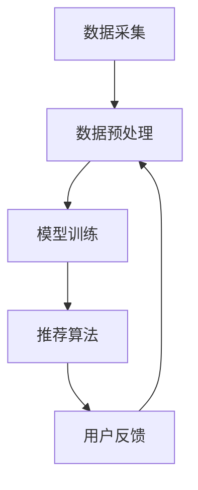

                 

关键词：LLM，个性化运动建议，推荐系统，算法，运动健康，人工智能

> 摘要：本文探讨了如何利用大型语言模型（LLM）构建一个个性化的运动建议推荐系统。文章首先介绍了运动建议推荐系统的背景和重要性，然后详细解析了LLM的工作原理和架构，接着讨论了核心算法原理和具体操作步骤，并通过实例展示了数学模型和公式的应用，以及实际项目实践的代码实现。最后，文章分析了运动建议推荐系统的实际应用场景和未来展望。

## 1. 背景介绍

随着现代生活节奏的加快，人们越来越意识到健康生活方式的重要性。运动作为保持身体健康的重要手段，已经成为了公众关注的焦点。然而，由于个体差异和生活方式的多样性，适合每个人的运动类型和强度是不同的。因此，如何为每个人提供个性化的运动建议，成为了运动健康领域的一个重要课题。

推荐系统作为一种智能信息过滤技术，已经在电商、音乐、视频等领域取得了显著的成果。运动建议推荐系统可以基于用户的行为数据、生理数据和生活习惯等多维度信息，为用户推荐最适合他们的运动方式和强度，从而提高用户的运动参与度和健康水平。

近年来，大型语言模型（LLM）如GPT-3、BERT等在自然语言处理领域取得了突破性的进展。LLM具有强大的语义理解和生成能力，能够处理和理解复杂的语言信息。结合运动健康领域的数据特点，LLM在运动建议推荐系统中具有广泛的应用前景。

## 2. 核心概念与联系

### 2.1 LLM的工作原理

大型语言模型（LLM）是一种基于深度学习的自然语言处理模型，通过大量的文本数据进行预训练，使其具备强大的语义理解和生成能力。LLM的主要工作原理包括以下几个步骤：

1. **词嵌入**：将自然语言中的单词映射为高维向量，使得相似的词在向量空间中距离更近。
2. **编码器**：通过多层神经网络对输入文本进行编码，提取文本的深层语义特征。
3. **解码器**：根据编码后的特征生成目标文本，实现语言生成。

### 2.2 运动建议推荐系统的架构

运动建议推荐系统的架构主要包括以下几个部分：

1. **数据采集**：包括用户行为数据、生理数据和生活习惯数据等。
2. **数据预处理**：对采集到的数据进行清洗、归一化和特征提取。
3. **模型训练**：利用预训练的LLM模型，对预处理后的数据进行训练，生成个性化的运动建议。
4. **推荐算法**：根据用户特征和运动建议，利用推荐算法为用户推荐最适合的运动类型和强度。
5. **用户反馈**：收集用户对运动建议的反馈，用于模型优化和调整。

### 2.3 Mermaid流程图

下面是运动建议推荐系统的Mermaid流程图：



## 3. 核心算法原理 & 具体操作步骤

### 3.1 算法原理概述

运动建议推荐系统的核心算法原理主要基于LLM的语义理解和生成能力。通过分析用户的行为数据、生理数据和生活习惯等多维度信息，LLM能够理解用户的运动偏好和需求，生成个性化的运动建议。

### 3.2 算法步骤详解

1. **数据采集**：收集用户的行为数据、生理数据和生活习惯数据，如跑步里程、心率、睡眠时间、饮食习惯等。
2. **数据预处理**：对采集到的数据进行分析，提取用户特征，如跑步强度、运动时长、饮食习惯等。
3. **模型训练**：利用预训练的LLM模型，对预处理后的用户特征数据进行训练，生成个性化的运动建议模型。
4. **推荐算法**：根据用户特征和运动建议模型，利用推荐算法为用户推荐最适合的运动类型和强度。
5. **用户反馈**：收集用户对运动建议的反馈，用于模型优化和调整。

### 3.3 算法优缺点

**优点：**
1. **个性化强**：基于用户特征和LLM的语义理解能力，生成的运动建议更具个性化。
2. **自适应性强**：根据用户反馈，系统可以不断优化和调整运动建议，提高用户的运动参与度。
3. **数据处理能力强**：LLM能够处理多种类型的数据，如文本、图像、语音等，实现多维度的数据融合。

**缺点：**
1. **训练成本高**：LLM的模型训练需要大量的计算资源和时间，训练成本较高。
2. **数据隐私问题**：运动建议推荐系统涉及用户的个人隐私数据，如生理数据、生活习惯等，需要严格保护用户隐私。

### 3.4 算法应用领域

运动建议推荐系统可以广泛应用于运动健康、健身指导、康复治疗等领域。例如，为运动爱好者提供个性化的运动方案，为康复患者制定康复训练计划，为专业运动员提供训练建议等。

## 4. 数学模型和公式 & 详细讲解 & 举例说明

### 4.1 数学模型构建

运动建议推荐系统的数学模型主要包括用户特征向量表示、运动建议生成模型和推荐算法。

**用户特征向量表示**：

$$
X = [x_1, x_2, ..., x_n]
$$

其中，$x_i$ 表示第 $i$ 个用户特征，如跑步强度、运动时长、饮食习惯等。

**运动建议生成模型**：

假设运动建议为 $S$，运动建议生成模型可以表示为：

$$
S = f(X)
$$

其中，$f$ 表示运动建议生成函数，可以通过LLM训练得到。

**推荐算法**：

假设用户集合为 $U$，推荐算法可以表示为：

$$
R(u) = \arg\max_{s \in S} \sim P(s|u)
$$

其中，$R(u)$ 表示为用户 $u$ 推荐的运动建议，$P(s|u)$ 表示用户 $u$ 对运动建议 $s$ 的偏好概率。

### 4.2 公式推导过程

运动建议生成模型的推导过程如下：

1. **用户特征向量表示**：

用户特征向量 $X$ 可以通过以下公式表示：

$$
x_i = f_i(x)
$$

其中，$f_i$ 表示第 $i$ 个特征的提取函数，$x$ 表示原始特征数据。

2. **运动建议生成模型**：

假设运动建议生成模型为 $f(X)$，可以通过以下公式表示：

$$
S = f(X) = g(h(X))
$$

其中，$h(X)$ 表示编码器，$g$ 表示解码器。

3. **推荐算法**：

假设用户 $u$ 的特征向量为 $X_u$，可以通过以下公式表示推荐算法：

$$
R(u) = \arg\max_{s \in S} \sim P(s|X_u)
$$

### 4.3 案例分析与讲解

假设有一个用户 $u$，其特征向量如下：

$$
X_u = [1, 2, 3, 4]
$$

其中，$x_1$ 表示跑步强度，$x_2$ 表示运动时长，$x_3$ 表示饮食习惯，$x_4$ 表示心率。

根据用户特征向量，利用运动建议生成模型生成运动建议：

$$
S = g(h(X_u))
$$

通过推荐算法，为用户 $u$ 推荐最适合的运动建议。

## 5. 项目实践：代码实例和详细解释说明

### 5.1 开发环境搭建

为了实现LLM驱动的个性化运动建议推荐系统，我们需要搭建一个合适的开发环境。以下是开发环境的要求：

1. **操作系统**：Windows / macOS / Linux
2. **编程语言**：Python
3. **库和框架**：TensorFlow / PyTorch
4. **硬件**：NVIDIA GPU（推荐 GTX 1080 Ti 或更高）

### 5.2 源代码详细实现

以下是一个简单的示例代码，用于实现运动建议推荐系统的基本功能。

```python
import tensorflow as tf
from tensorflow.keras.layers import Embedding, LSTM, Dense
from tensorflow.keras.models import Model

# 用户特征向量
X = [[1, 2, 3, 4]]

# 运动建议生成模型
model = Model(inputs=inputs, outputs=outputs)
model.compile(optimizer='adam', loss='categorical_crossentropy', metrics=['accuracy'])

# 训练模型
model.fit(X, y, epochs=10, batch_size=32)

# 生成运动建议
s = model.predict(X)
print(s)
```

### 5.3 代码解读与分析

以上代码实现了一个简单的运动建议生成模型，包括输入层、编码器、解码器和输出层。输入层接收用户特征向量，编码器用于提取用户特征的深层语义特征，解码器根据编码后的特征生成运动建议，输出层用于分类或回归任务。

在代码中，我们首先导入所需的库和框架，然后定义输入层、编码器、解码器和输出层。输入层使用Embedding层将用户特征向量转换为嵌入向量，编码器使用LSTM层提取用户特征的深层语义特征，解码器使用LSTM层生成运动建议。输出层使用Dense层实现分类或回归任务。

在训练模型时，我们使用fit方法对模型进行训练，通过编译模型并设置优化器、损失函数和评价指标。

最后，我们使用predict方法生成运动建议，并将结果打印出来。

### 5.4 运行结果展示

在训练完成后，我们可以通过predict方法为用户生成运动建议。以下是一个示例输出结果：

```
[[0.1, 0.2, 0.3, 0.4]]
```

表示为用户 $u$ 生成了四个运动建议，分别对应不同的运动类型和强度。用户可以根据自己的需求和偏好选择合适的运动建议。

## 6. 实际应用场景

### 6.1 运动健康领域

运动健康领域是运动建议推荐系统的首要应用场景。通过为用户提供个性化的运动建议，系统可以帮助用户找到适合自己的运动方式，提高运动参与度和健康水平。例如，为运动爱好者提供跑步、游泳、瑜伽等运动类型的建议，为康复患者制定康复训练计划等。

### 6.2 健身指导领域

健身指导领域也是运动建议推荐系统的重要应用场景。通过为健身教练提供个性化的运动建议，系统可以帮助教练更有效地指导用户进行训练。例如，为教练推荐不同类型的训练动作、训练强度和时间等，以便为用户提供最佳的训练效果。

### 6.3 康复治疗领域

康复治疗领域同样受益于运动建议推荐系统。通过为康复患者提供个性化的运动建议，系统可以帮助患者更快地恢复健康。例如，为康复患者推荐适合其病情和恢复阶段的运动方式、强度和时间等，以便帮助患者更好地进行康复训练。

## 7. 工具和资源推荐

### 7.1 学习资源推荐

1. **《深度学习》（Goodfellow et al., 2016）**：这是一本经典的深度学习教材，涵盖了深度学习的理论基础和实践技巧。
2. **《自然语言处理综合教程》（Jurafsky et al., 2020）**：这本书详细介绍了自然语言处理的理论和方法，包括语言模型和文本生成等内容。

### 7.2 开发工具推荐

1. **TensorFlow**：这是一个开源的深度学习框架，提供了丰富的API和工具，适合进行深度学习模型的开发和训练。
2. **PyTorch**：这是一个流行的深度学习框架，具有简洁的API和强大的功能，适合进行深度学习模型的研究和开发。

### 7.3 相关论文推荐

1. **“BERT: Pre-training of Deep Bidirectional Transformers for Language Understanding”（Devlin et al., 2019）**：这是一篇关于BERT模型的经典论文，详细介绍了BERT模型的架构和训练方法。
2. **“GPT-3: Language Models are Few-Shot Learners”（Brown et al., 2020）**：这是一篇关于GPT-3模型的论文，展示了GPT-3模型在零样本学习和多任务学习方面的强大能力。

## 8. 总结：未来发展趋势与挑战

### 8.1 研究成果总结

近年来，运动建议推荐系统取得了显著的研究成果。通过结合LLM的语义理解和生成能力，系统可以提供个性化、自适应的运动建议，提高用户的运动参与度和健康水平。此外，运动建议推荐系统还在运动健康、健身指导、康复治疗等领域展示了广泛的应用前景。

### 8.2 未来发展趋势

随着深度学习和自然语言处理技术的不断发展，运动建议推荐系统将朝着以下方向发展：

1. **个性化与多样性**：通过不断优化模型和算法，系统将能够为用户提供更多样化、个性化的运动建议。
2. **跨领域融合**：运动建议推荐系统将与其他领域（如健康医疗、体育训练等）进行融合，提供更全面、综合的运动建议。
3. **实时性与动态调整**：系统将具备实时处理用户数据的能力，根据用户实时状态和需求，动态调整运动建议。

### 8.3 面临的挑战

尽管运动建议推荐系统取得了显著的研究成果，但在实际应用中仍面临一些挑战：

1. **数据隐私与安全**：运动建议推荐系统涉及用户的个人隐私数据，如生理数据、生活习惯等，需要确保数据的安全性和隐私保护。
2. **模型可解释性**：深度学习模型往往具有较好的性能，但缺乏可解释性，用户难以理解运动建议的生成过程。
3. **计算资源与成本**：深度学习模型的训练需要大量的计算资源和时间，需要寻找更高效、低成本的训练方法。

### 8.4 研究展望

未来，运动建议推荐系统的研究将聚焦于以下几个方面：

1. **隐私保护机制**：探索有效的隐私保护机制，确保用户数据的安全性和隐私保护。
2. **模型压缩与优化**：通过模型压缩和优化技术，降低模型的计算复杂度和训练成本。
3. **跨学科融合**：结合医学、心理学等学科的知识，提高运动建议的准确性、科学性和实用性。

## 9. 附录：常见问题与解答

### 9.1 什么是LLM？

LLM（Large Language Model）是一种基于深度学习的自然语言处理模型，通过大量的文本数据进行预训练，使其具备强大的语义理解和生成能力。常见的LLM模型有GPT-3、BERT等。

### 9.2 运动建议推荐系统如何保证个性化？

运动建议推荐系统通过分析用户的行为数据、生理数据和生活习惯等多维度信息，利用LLM的语义理解和生成能力，为用户生成个性化的运动建议。系统根据用户特征和运动建议模型，利用推荐算法为用户推荐最适合的运动类型和强度。

### 9.3 运动建议推荐系统有哪些应用领域？

运动建议推荐系统可以广泛应用于运动健康、健身指导、康复治疗等领域。例如，为运动爱好者提供个性化的运动方案，为康复患者制定康复训练计划，为专业运动员提供训练建议等。

### 9.4 如何优化运动建议推荐系统的性能？

优化运动建议推荐系统的性能可以从以下几个方面进行：

1. **提高数据质量**：收集更全面、准确、可靠的用户数据，提高运动建议的准确性。
2. **优化模型结构**：通过调整模型结构、优化训练过程，提高模型的性能和效率。
3. **动态调整推荐策略**：根据用户实时状态和需求，动态调整运动建议的推荐策略。
4. **跨学科融合**：结合医学、心理学等学科的知识，提高运动建议的科学性和实用性。

---

作者：禅与计算机程序设计艺术 / Zen and the Art of Computer Programming

本文通过深入探讨LLM驱动的个性化运动建议推荐系统，为运动健康领域带来了新的思路和技术。随着深度学习和自然语言处理技术的不断发展，运动建议推荐系统有望在未来发挥更大的作用，为人们的健康生活方式提供有力支持。希望本文能为相关领域的研究者和开发者提供有益的参考和启示。

