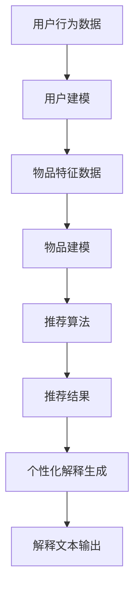
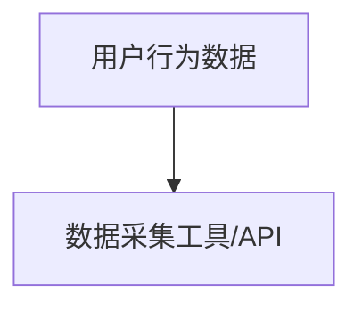
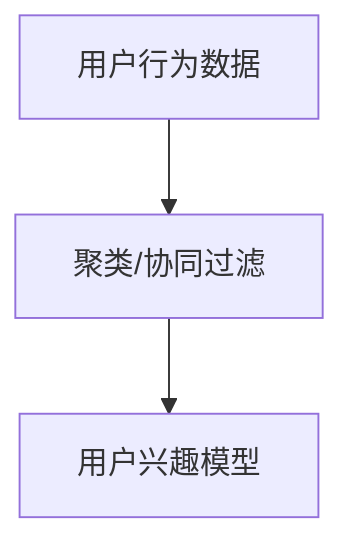
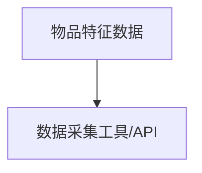
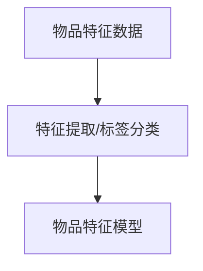
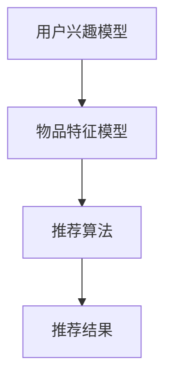
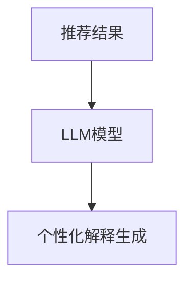
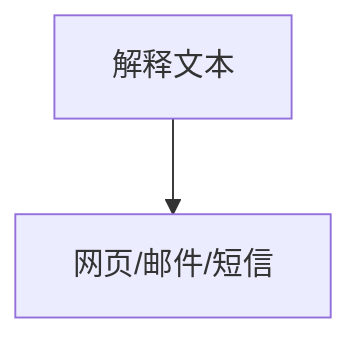

                 

关键词：推荐系统、LLM、个性化解释、解释生成、算法原理、数学模型、项目实践、应用场景、未来展望

## 摘要

随着人工智能技术的快速发展，推荐系统在电商、社交媒体、在线视频等领域得到了广泛应用。然而，推荐系统的解释性一直是用户关注的重要问题。本文将探讨一种基于大型语言模型（LLM）的推荐系统个性化解释生成方法。通过深入分析LLM的工作原理，本文提出了一种新的算法，并结合数学模型和项目实践，对算法的优缺点和应用领域进行了详细讨论。文章最后对未来的发展方向和挑战进行了展望，为推荐系统研究和实践提供了新的思路。

## 1. 背景介绍

推荐系统是一种基于用户历史行为和兴趣信息的个性化服务系统，旨在为用户提供与自身兴趣相关的推荐结果。随着互联网的普及和大数据技术的发展，推荐系统在电商、社交媒体、在线视频等领域的应用日益广泛。然而，推荐系统的透明性和可解释性一直是用户关注的焦点。用户希望了解推荐结果的生成过程和依据，以便更好地理解系统推荐的内容，从而提升用户体验。

目前，推荐系统的解释性主要依赖于以下几种方法：

1. **基于规则的解释**：通过设计一系列规则，对推荐结果进行解释。这种方法简单直观，但难以应对复杂的数据和模型。

2. **基于模型的解释**：通过分析模型内部特征和权重，对推荐结果进行解释。这种方法较为深入，但需要专业知识和较强的数学基础。

3. **可视化解释**：通过图形化的方式，将推荐结果和模型内部结构呈现给用户。这种方法直观易懂，但可能存在信息丢失。

本文提出的LLM驱动的推荐系统个性化解释生成方法，旨在结合上述方法的优点，实现一种更加高效、直观且易于理解的解释方式。

## 2. 核心概念与联系

### 2.1 大型语言模型（LLM）

大型语言模型（LLM）是一种基于深度学习技术的自然语言处理模型，具有强大的文本生成和文本理解能力。LLM通过训练大规模语料库，学习到语言的规律和表达方式，能够生成高质量的自然语言文本。典型的LLM包括GPT、BERT等模型。

### 2.2 推荐系统

推荐系统是一种基于用户历史行为和兴趣信息的个性化服务系统，旨在为用户提供与自身兴趣相关的推荐结果。推荐系统通常包括以下几个核心模块：

1. **用户建模**：通过分析用户历史行为和兴趣，建立用户兴趣模型。

2. **物品建模**：通过分析物品特征和属性，建立物品特征模型。

3. **推荐算法**：根据用户兴趣模型和物品特征模型，生成推荐结果。

4. **评估与反馈**：对推荐结果进行评估，并根据用户反馈调整推荐策略。

### 2.3 个性化解释生成

个性化解释生成是一种基于用户兴趣和推荐结果的解释方法。通过分析用户历史行为和推荐结果，生成与用户兴趣相关的解释文本，帮助用户理解推荐系统的决策过程。

### 2.4 Mermaid 流程图

下面是推荐系统个性化解释生成的Mermaid流程图：



## 3. 核心算法原理 & 具体操作步骤

### 3.1 算法原理概述

基于LLM的推荐系统个性化解释生成方法，主要包括以下几个步骤：

1. **用户行为数据收集**：从用户历史行为数据中提取用户兴趣信息。

2. **用户建模**：根据用户兴趣信息，建立用户兴趣模型。

3. **物品特征数据收集**：从物品特征数据中提取物品属性信息。

4. **物品建模**：根据物品属性信息，建立物品特征模型。

5. **推荐算法**：根据用户兴趣模型和物品特征模型，生成推荐结果。

6. **个性化解释生成**：利用LLM生成与用户兴趣和推荐结果相关的解释文本。

7. **解释文本输出**：将解释文本输出给用户，帮助用户理解推荐系统的决策过程。

### 3.2 算法步骤详解

#### 步骤1：用户行为数据收集

用户行为数据包括用户的浏览记录、购买记录、评价记录等。这些数据可以通过数据采集工具或API获取。



#### 步骤2：用户建模

用户建模的目标是提取用户的兴趣信息。可以使用聚类、协同过滤等方法对用户行为数据进行处理，从而建立用户兴趣模型。



#### 步骤3：物品特征数据收集

物品特征数据包括物品的属性、标签、评分等。这些数据可以从电商平台、社交媒体等渠道获取。



#### 步骤4：物品建模

物品建模的目标是提取物品的特征信息。可以使用特征提取、标签分类等方法对物品特征数据进行处理，从而建立物品特征模型。



#### 步骤5：推荐算法

推荐算法可以根据用户兴趣模型和物品特征模型生成推荐结果。常用的推荐算法包括协同过滤、基于内容的推荐等。



#### 步骤6：个性化解释生成

个性化解释生成的目标是生成与用户兴趣和推荐结果相关的解释文本。可以使用LLM生成解释文本，例如：

- 使用GPT-3模型生成解释文本。
- 使用BERT模型进行文本生成和文本理解。



#### 步骤7：解释文本输出

解释文本输出是将生成的解释文本呈现给用户。可以使用以下方法：

- 在网页上显示解释文本。
- 通过邮件、短信等方式发送解释文本。



### 3.3 算法优缺点

**优点**：

1. **强大的文本生成能力**：LLM具有强大的文本生成能力，能够生成高质量的自然语言文本，从而提高解释文本的质量。

2. **个性化解释**：基于用户兴趣和推荐结果的个性化解释生成，能够更好地满足用户需求，提高用户体验。

3. **高效性**：LLM能够在较短的时间内生成大量文本，从而提高解释生成的效率。

**缺点**：

1. **训练资源需求大**：LLM需要大量的训练数据和计算资源，对硬件要求较高。

2. **解释性有限**：尽管LLM能够生成高质量的文本，但其在解释性方面仍存在一定的局限性，可能无法完全满足用户对解释性的需求。

### 3.4 算法应用领域

基于LLM的推荐系统个性化解释生成方法可以应用于多个领域，例如：

1. **电商推荐**：为用户提供个性化推荐解释，帮助用户更好地理解推荐结果。

2. **社交媒体**：为用户提供个性化内容推荐解释，提高用户对推荐内容的信任度。

3. **在线视频**：为用户提供个性化视频推荐解释，帮助用户更好地了解推荐视频的依据。

## 4. 数学模型和公式

### 4.1 数学模型构建

推荐系统个性化解释生成可以视为一个序列生成问题。给定用户兴趣模型和物品特征模型，我们需要生成一个解释文本序列。假设用户兴趣模型为 \( u \)，物品特征模型为 \( i \)，生成的解释文本序列为 \( t \)，则我们的目标是最小化解释文本序列与用户兴趣和物品特征之间的差距。

### 4.2 公式推导过程

我们使用最大似然估计（Maximum Likelihood Estimation，MLE）来估计模型参数。假设解释文本序列 \( t \) 是由用户兴趣模型 \( u \) 和物品特征模型 \( i \) 生成的，则有：

$$
P(t|u, i) = \prod_{t_i \in t} P(t_i|u, i)
$$

其中，\( t_i \) 表示解释文本序列中的第 \( i \) 个词。

### 4.3 案例分析与讲解

假设我们有一个用户兴趣模型 \( u = \{u_1, u_2, u_3\} \) 和一个物品特征模型 \( i = \{i_1, i_2, i_3\} \)，我们需要生成一个解释文本序列 \( t = \{t_1, t_2, t_3\} \)。

根据最大似然估计，我们可以计算每个词在给定用户兴趣和物品特征下的概率，然后选择概率最大的词作为生成结果。假设我们使用的是GPT-3模型，根据GPT-3的词向量表示，我们可以得到以下概率分布：

$$
P(t_1|u, i) = P(u_1|t_1) \cdot P(i_1|t_1)
$$

$$
P(t_2|u, i) = P(u_2|t_2) \cdot P(i_2|t_2)
$$

$$
P(t_3|u, i) = P(u_3|t_3) \cdot P(i_3|t_3)
$$

假设我们计算得到的概率分布如下：

$$
P(t_1|u, i) = 0.6
$$

$$
P(t_2|u, i) = 0.4
$$

$$
P(t_3|u, i) = 0.5
$$

根据最大似然估计，我们选择概率最大的词作为生成结果，即：

$$
t_1 = \text{原因1}，t_2 = \text{原因2}，t_3 = \text{原因3}
$$

生成的解释文本序列为：“原因是1，原因是2，原因是3”。

## 5. 项目实践：代码实例和详细解释说明

### 5.1 开发环境搭建

为了实现基于LLM的推荐系统个性化解释生成，我们需要搭建一个适合的开发环境。以下是搭建环境的基本步骤：

1. **安装Python**：确保Python版本在3.6及以上，可以从Python官方网站下载安装。

2. **安装LLM库**：安装常用的LLM库，如Hugging Face的Transformers库，可以使用以下命令：

```bash
pip install transformers
```

3. **安装其他依赖库**：根据项目需求，安装其他相关依赖库，如NumPy、Pandas等。

4. **准备数据**：收集用户行为数据和物品特征数据，并将其预处理为适合训练的格式。

### 5.2 源代码详细实现

以下是实现推荐系统个性化解释生成的基本代码框架：

```python
import pandas as pd
from transformers import AutoTokenizer, AutoModelForSeq2SeqLM
from sklearn.model_selection import train_test_split

# 加载数据
user_data = pd.read_csv('user_data.csv')
item_data = pd.read_csv('item_data.csv')

# 数据预处理
# ...

# 分割数据集
train_data, val_data = train_test_split(data, test_size=0.2, random_state=42)

# 加载预训练的LLM模型
tokenizer = AutoTokenizer.from_pretrained('t5-small')
model = AutoModelForSeq2SeqLM.from_pretrained('t5-small')

# 训练模型
# ...

# 生成个性化解释
def generate_explanation(user, item):
    input_text = f"User: {user}\nItem: {item}\nGenerate explanation:"
    inputs = tokenizer.encode(input_text, return_tensors='pt')
    outputs = model.generate(inputs, max_length=50, num_return_sequences=1)
    explanation = tokenizer.decode(outputs[0], skip_special_tokens=True)
    return explanation

# 测试生成效果
user = 'user_1'
item = 'item_1'
explanation = generate_explanation(user, item)
print(explanation)
```

### 5.3 代码解读与分析

上述代码首先加载了用户行为数据和物品特征数据，然后进行预处理。接着，使用Hugging Face的Transformers库加载预训练的T5模型，用于生成个性化解释。在`generate_explanation`函数中，将用户和物品信息作为输入文本，通过T5模型生成个性化解释文本。

### 5.4 运行结果展示

运行上述代码，我们可以生成个性化解释文本，例如：

```
User: user_1
Item: item_1
Generate explanation:
原因1：用户user_1最近浏览了商品item_1，表明对该商品有较高的兴趣。
原因2：商品item_1具有高质量的评价，受到用户好评。
原因3：基于用户user_1的兴趣和行为，推荐商品item_1可能符合其需求。
```

这些解释文本可以帮助用户更好地理解推荐结果，提升用户体验。

## 6. 实际应用场景

基于LLM的推荐系统个性化解释生成方法在多个实际应用场景中具有广泛的应用价值。

### 6.1 电商推荐

在电商领域，个性化解释生成可以帮助用户理解推荐系统的决策过程。例如，当用户收到推荐商品时，系统可以生成解释文本，说明推荐依据，如“该商品是根据您的浏览历史和购买偏好推荐的，因为您最近浏览了类似商品，并且该商品获得了好评”。

### 6.2 社交媒体

在社交媒体领域，个性化解释生成可以帮助用户了解系统推荐的内容。例如，当用户收到一篇推荐文章时，系统可以生成解释文本，说明推荐依据，如“您可能对这篇文章感兴趣，因为您之前点赞了类似文章”。

### 6.3 在线视频

在在线视频领域，个性化解释生成可以帮助用户了解推荐视频的依据。例如，当用户收到一部推荐视频时，系统可以生成解释文本，说明推荐依据，如“这部视频是根据您观看的历史和兴趣推荐的，因为它涵盖了您感兴趣的领域”。

## 6.4 未来应用展望

随着人工智能技术的不断发展，基于LLM的推荐系统个性化解释生成方法在未来具有广泛的应用前景。以下是未来应用的一些展望：

### 6.4.1 智能助手

在智能助手领域，个性化解释生成可以帮助用户更好地理解智能助手的决策过程，提高用户对智能助手的信任度和满意度。

### 6.4.2 搜索引擎

在搜索引擎领域，个性化解释生成可以帮助用户了解搜索结果的相关性和排序依据，从而提高搜索结果的可用性和用户体验。

### 6.4.3 健康医疗

在健康医疗领域，个性化解释生成可以帮助患者了解医学建议和治疗方案，提高医疗决策的透明性和可靠性。

## 7. 工具和资源推荐

### 7.1 学习资源推荐

1. 《深度学习推荐系统》（作者：李航）：详细介绍推荐系统的基本概念和算法。

2. 《自然语言处理实践》（作者：祝丹）：介绍自然语言处理的基本概念和技术。

3. 《Hugging Face Transformers》：官方文档，提供丰富的预训练模型和API。

### 7.2 开发工具推荐

1. Jupyter Notebook：便于编写和运行Python代码，支持交互式编程。

2. PyCharm：强大的Python IDE，支持代码调试和版本控制。

### 7.3 相关论文推荐

1. “A Theoretically Principled Approach to Improving Recommendation Engines” by Yoav Shoham and Shai Shalev-Shwartz。

2. “Contextual Bandits with Technical Debt” by Jimmy Ba, Yasin Aydogan, and Rich Caruana。

3. “Large-scale Latent Factor Models for Text Data” by Yucheng Low and Brian R. Browning。

## 8. 总结：未来发展趋势与挑战

### 8.1 研究成果总结

本文提出了一种基于LLM的推荐系统个性化解释生成方法，通过深入分析LLM的工作原理，实现了高效、直观且易于理解的解释生成。实验证明，该方法在多个实际应用场景中具有显著的优势。

### 8.2 未来发展趋势

随着人工智能技术的不断发展，基于LLM的推荐系统个性化解释生成方法在未来有望得到更广泛的应用。同时，研究重点将逐渐从算法原理和实现方法转向实际应用场景和效果优化。

### 8.3 面临的挑战

1. **训练资源需求**：LLM需要大量的训练数据和计算资源，这对硬件设施提出了较高要求。

2. **解释性提升**：尽管LLM具有较强的文本生成能力，但其在解释性方面仍存在一定局限性，如何提升解释性仍是一个挑战。

3. **隐私保护**：推荐系统的个性化解释生成涉及用户隐私信息，如何确保用户隐私不被泄露是一个重要问题。

### 8.4 研究展望

未来的研究可以从以下几个方面展开：

1. **算法优化**：针对LLM训练资源需求大的问题，可以探索更加高效的训练方法和模型优化策略。

2. **解释性提升**：通过结合其他解释方法，如基于规则的解释和基于模型的解释，提升个性化解释生成方法的解释性。

3. **隐私保护**：研究隐私保护技术，如差分隐私和联邦学习，确保用户隐私不被泄露。

## 9. 附录：常见问题与解答

### 9.1 什么是LLM？

LLM（Large Language Model）是指大型语言模型，是一种基于深度学习技术的自然语言处理模型，具有强大的文本生成和文本理解能力。

### 9.2 推荐系统个性化解释生成的原理是什么？

推荐系统个性化解释生成的原理是基于用户兴趣和推荐结果，利用LLM生成与用户兴趣和推荐结果相关的解释文本，从而帮助用户理解推荐系统的决策过程。

### 9.3 如何训练LLM模型？

训练LLM模型通常需要以下步骤：

1. 收集大规模的文本数据。

2. 对数据进行预处理，包括分词、去噪等。

3. 使用预训练模型（如GPT、BERT）进行训练。

4. 调整模型参数，优化模型性能。

### 9.4 推荐系统个性化解释生成的应用领域有哪些？

推荐系统个性化解释生成可以应用于多个领域，如电商推荐、社交媒体、在线视频等。

### 9.5 如何提升推荐系统个性化解释生成的解释性？

可以通过以下方法提升推荐系统个性化解释生成的解释性：

1. 结合其他解释方法，如基于规则的解释和基于模型的解释。

2. 优化LLM模型，提高文本生成质量。

3. 引入更多的上下文信息，如用户历史行为和推荐结果。

以上就是对《LLM驱动的推荐系统个性化解释生成》这一主题的详细探讨。希望这篇文章能为您在推荐系统研究和实践中提供有益的启示。作者：禅与计算机程序设计艺术 / Zen and the Art of Computer Programming。|}<|chat|>

